## 第四章：**可调稳压电源**


无论你是使用标准的台式电源，还是通过计算机的 USB 端口为 Arduino 供电，迟早你都会需要一个独立的、可调电压的稳压电源。这个项目将教你如何制作一个，只需要少量的廉价零件。可调电源是许多工作坊中最常用的工具之一。这个项目既简单又有趣，你会发现你会一遍又一遍地使用它。

当设定为 5V 或 3.3V 时，可调稳压电源可以轻松为大多数 Arduino 项目供电。你也可以用它为一些附属设备供电，在系统中调整特定电压，而主电源保持不变，或者仅仅用来测试灯电路、LED、电机或其他设备。

电路使用了极其通用的 LM317 调节器芯片。如果你需要一款具有特殊要求的精密电压调节器，可以在网上查找 LM317。JavaScript 电子笔记本上有一篇特别好的文章，标题为“LM 317 电压调节器设计”，作者是 Martin E. Meserve，文章地址是*[`www.k7mem.com/Electronic_Notebook/power_supplies/lm317.html`](http://www.k7mem.com/Electronic_Notebook/power_supplies/lm317.html)*。

### 所需工具

焊接铁和焊锡

电钻和钻头（3/8 英寸和 1/4 英寸）

锯条或钥匙孔锯（剪切工具或其他）

一个十字螺丝刀

（可选）锥形扩孔套件

（可选）压接工具

### 零件清单

可调稳压电源能够提供从 1.25V 到大约 12V 的可调电压，最大电流可达 1.5A，具体取决于你使用的基础电源。它使用 LM317 单芯片电压调节器来设置电压。要构建这个项目，你需要以下零件：

一个 Arduino Pro Mini 或克隆板

一个 LM317 电压调节器

一个 LM7805 电压调节器

两个 2.2 欧，5 瓦电阻

三个 10 千欧，1/8 瓦电阻

三个 6.8 千欧，1/8 瓦电阻

一个 68 μF 钽电容

三个 0.1 μF 陶瓷电容

一个 1 μF 钽电容

一个 16×2 LCD 显示屏

一个 I²C 适配器（如果 LCD 未附带）

四个 4-40 螺丝

八个 4-40 螺母

一个 5 毫米 LED（用于电源指示）

一个单极单刀开关（SPST）

一个 470 欧，1/8 瓦电阻

一个 10 千欧，1/8 瓦电位器

一个 Hammond 面板/外壳（#1456CE3WHBU）

两个香蕉插头插座

一个 3.5 毫米插孔

一个 12V 2A 交流适配器

一个电源适配器插孔

一个 PCB/屏蔽板

六个 1×4 接头

四个 1×4 接头外壳

四个 1×2 接头

一个重型 TO-220 散热器

一个中等功率的 TO-220 散热器

四个男性压接连接器

四个女性压接连接器

30 号连接线

一个旋钮用于覆盖电位器轴

双面泡沫胶带

关于散热器选择的说明：市面上有各种各样的散热器可供选择。图 Figure 3-2 中展示的是 Futurlec TO220ST 型号，虽然它能正常工作，但当电流接近 1A 时会比较热。一个更大的散热器，如果能放入外壳中，可能会更好。Futurlec TO220SMAL 是 LM7805 的散热器，足以完成任务。

### 下载

你将在本书的在线资源中找到以下文件，帮助你完成本项目：

**模板** *PowerSupplyFront.dxf, PowerSupplyFrontBottom.dxf*

**草图** *PowerSupply.ino*

**扩展板文件** *VoltageRegulator.pcb*

**稳压电源的定义与非定义**

本项目中的电源不打算替代常规的实验室电源。它不提供任何电流限制，额定电流为 1.5A，因 LM317 的电流承载能力。然而，针对各种应用——包括本书中的所有项目——它表现得非常好。如果你是 Arduino 新手，它将为你提供稳定的电源，并节省你大量的电池费用（如果你一直使用电池供电的话）。如果你已经拥有一台完整的实验室电源，这个项目将作为第二个电源变得不可或缺。该稳压电源可用于本书中需要辅助电源的多个项目。

我已经在其他应用中使用过该稳压电源，并且在本项目的最后，我将展示一个简化版本，可以作为远程电源使用。有时你可能没有适合某个项目的电压供应，而这个设计正好满足需求。

### 一个灵活的电压稳压器电路

图 Figure 3-1 中的基础 LM317 稳压器电路是该电源稳压器的核心。尽管它相对简单，但该芯片的简洁掩盖了它强大且多用途的特性。

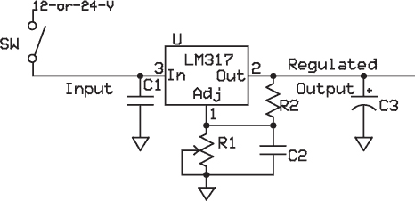

*图 3-1：这是稳压电源稳压器组件的原理图，带显示器的完整原理图见 Figure 3-4*。

我已经在许多应用中使用过这个电路的变种，从独立的可调电源到更大系统的一部分，总是取得了良好的结果。

在商店里，我有时使用一种“电线连接”版本，如图 Figure 3-2（左侧）所示，用于测试 LED 和控制诸如电机速度与灯光强度等设备。我还使用过面包板版本，如图 Figure 3-2（右侧）所示，用于实现稳压器电路。在这两种情况下，我都使用了一个调节电位器，需要调节工具或螺丝刀来进行调整。

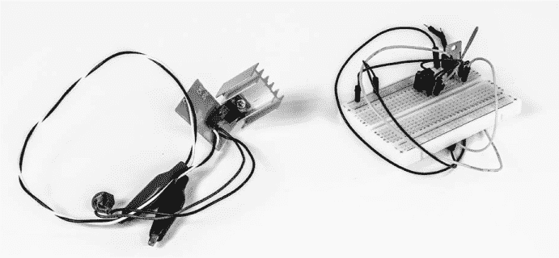

*图 3-2：电压调节器电路的“线搭线”版本，LM317 上安装了散热片（左侧）和电压调节器的面包板版本（右侧）。我在一个功率需求较低的应用中使用了这个电路，因此没有加装散热片*。

虽然这些调节器电路有效，但使用图 3-1 中更精细的稳压电源格式的一个原因是为了消除笨重的调节电位器，并改用标准的 270 度电位器和旋钮，这样我可以快速、轻松、反复地进行调整。但我构建它的主要原因是希望在工作台上方便地拥有一个具有数字显示的二次可调电压电源。

### 电路如何工作

这个项目的电路并不复杂。从本质上讲，它通过板载的模拟-数字转换器（ADC）测量 LM317 调节器输出端的电压，并将其与内部参考电压进行比较。结果会发送到 LCD 屏幕。然而，Arduino Pro Mini 5V 版的模拟输入端最大只能接受 5V。因此，我们使用了一个*电压分压器*来确保模拟输入引脚上的电压不会超过 5V。（确保供给 LM317 的电压不大于 12V。）

在这种情况下，电压分压器由两个串联的电阻组成，它们跨接在 LM317 的输出端和面包板的接地轨之间（参见图 3-4 中的示意图）。来自 LM317 的电压在 R2 和 R3 这两个电阻之间分配。如你在草图中所见，将分压后的电压转换回显示的原始电平，只需反转算术运算即可。

如图 3-4 中的示意图所示，LM317 的输出端连接到 R2-R3 电压分压器以及电阻 R1。R1 与 R9 和负载并联，或者说与任何你希望用电源供电的设备，并可以视为另一个电压分压器。R1-R9 电压分压器的电阻仅为 1.1 欧姆，因此其电压降相对较小。根据欧姆定律（*I* = *V*/*R*），R1 和 R9 上的电压将在最大电流为 1.5A 时降至 1.65V（这是该调节器 IC 所支持的最大电流）：1.5A = 1.65V/1.1Ω。

这意味着当 LM317 提供约 12V 且负载电流为 1.5A 时，R1 和 R9 上的电压降为 1.65V，电源输出端剩余的电压为 10.45V。

看图 3-4 中的示意图，我们正在比较 Pro Mini 的模拟输入端 A0 和 A2 上的电压。如果你为 A0 和 A1 使用相同的电压分压器电阻值，你可以省略其中一组电阻，直接将 A0 连接到 A1。

**电压分压器电阻值**

实现特定电压所需的电阻值是通过以下公式确定的：

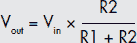

一个典型的电压分压电路的电路图如图 3-3 所示。

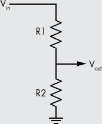

*图 3-3：典型的电压分压电路*

如果你愿意，可以做一些代数计算，但最简单的方式是使用在线计算器，比如* [`www.daycounter.com/Calculators/VoltageDivider-Calculator.phtml`](http://www.daycounter.com/Calculators/VoltageDivider-Calculator.phtml)* 上的那个。在这个项目中，目标是实现大约 5V 的输出。我们从 12V 的输入和一个 10 千欧的电阻开始，在公式中表示为 R1，在电路图中标记为 R2。将这些信息填入计算器，计算公式会给出电路图中的 R2 和公式中的 R1 电阻值为 7.1 千欧。最接近的标准电阻值是 6.8 千欧，所以该项目使用 6.8 千欧的电阻和 10 千欧的电阻来构成电压分压器。

那么，为什么要从一个 10 千欧的电阻开始呢？第一个原因是为了避免消耗过多电流。即使整个 12V 压降通过 10 千欧电阻，它也只会导致 1.2 毫安的名义电流消耗。第二，我在零件箱里有很多 10 千欧的电阻，我敢肯定你也有。

在这个电路中，我使用了三组电压分压器。第一组用于测量稳压器输出端的电压，最终显示在 LCD 上。其他两组则分别在电压下降电阻的前后分压，以便根据公式*I* = *V*/*R*测量电流，其中*V*是电阻 R1 和 R9 之间的电压降，R 是这两个电阻的总值。我是否可以去掉一组电压分压器？是的，通过将 A0 和 A1 连接起来。然而，我认为我可能会在某个时候改变这些值，以通过将其值接近 Arduino 的参考电压来提高安培计的精度，因此我在项目中没有将它们连接。

### 电路图

虽然我希望稳压电源相对稳健，但我并不想让它过于复杂或难以构建。头发线和面包板版本在临时或紧急应用中表现良好，特别是与数字万用表（DMM）一起使用时，但我希望构建一些更持久的东西，它能够有自己的电压和电流读数，并且能够常驻工作台或放在我的桌面上，成为工具集中的常规部分。图 3-4 展示了稳压电源的完整电路图。


*图 3-4：稳压电源的电路图*

### 面包板

像我所有的 Arduino 项目一样，我从标准的面包板开始。为了简化操作，我使用了一个标准的电位器，其引脚可以适配 0.100 英寸间距的面包板孔。经过一些努力，一个标准的 16 毫米旋转电位器（原理图中的 R7）带有印刷电路板连接器，几乎能适配面包板上每隔一个孔。图 3-5 展示了安装好之前的面包板的俯视图。

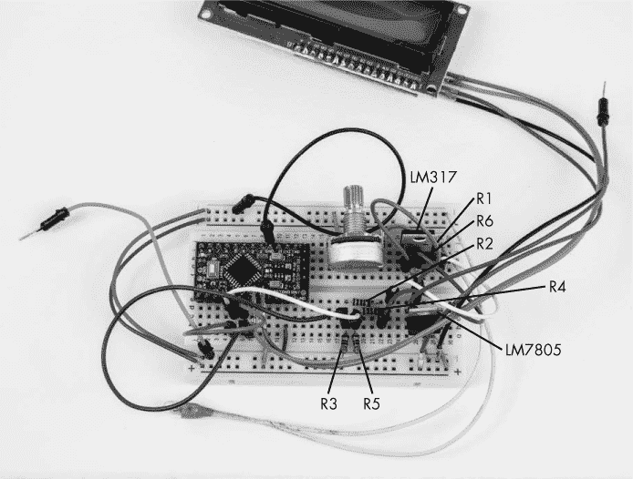

*图 3-5：稳压电源的面包板。原理图中的电容器—C1、C2 和 C3—不包括在面包板上，但应该包含在完成的单元中*。

#### *准备 Arduino Pro Mini 和 LCD*

Arduino Pro Mini 可能会附带公头针脚，也可能没有。如果没有，你需要自己焊接（请参见“准备 Arduino 板”第 2 页）。确保你的针脚条上针脚的数量与 Pro Mini 上的孔位匹配；如果附带的针脚条太长，你可能需要将其剪短。将两条针脚条修剪到合适的长度，并将两条长针脚条插入面包板，使其间隔合适，以便 Pro Mini 板能放在上面。将 Pro Mini 放置好后，焊接所有的针脚。然后，取两根针脚（使用从长针条中剩余的部分或单独购买），将其插入 Pro Mini 上的 A4 和 A5 孔，并焊接。这些针脚是用于 LCD 的。

最后，在板子的边缘（在 TX0 和 RXI 端）安装五个针脚。某些板子带有直头针脚，其他板子则带有 90 度弯曲的长针脚。在大多数应用中，我发现使用直头针脚更为方便。你可以使用直角针脚，但可能会使得插入编程连接器变得更困难，所以我建议将任何直角针脚替换为直头针脚。你还可以考虑使用一段 1/2 英寸长的 22 号线，将其焊接到 RST 针脚的短端，使其突出。编程时，女性针座连接器将连接到这个突出部分。

现在，你需要准备 LCD/I²C 组件。如果你单独购买了显示器和适配器，你需要将它们组装在一起。请参阅第 3 页的“将 I²C 板固定到 LCD 上”以获取详细说明。如果你购买了带有 I²C 适配器的显示器，它就可以直接组装了。

#### *组装面包板*

这是组装面包板的逐步指南：

1.  插入电线连接两个正极（红色）轨道。

1.  插入电线连接两个负极（蓝色）轨道。

    **警告**

    *小心不要将两者交叉连接，将正极轨道连接到负极轨道。这样可能会造成短路并损坏硬件*。

1.  将 10 千欧旋转电位器插入面包板。

1.  将 LM317 插入面包板，带或不带散热器，靠近电位器，如图 3-5 所示。（有关 LM317 引脚分布，请参见图 3-6。）

    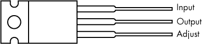

    *图 3-6：LM317 调节器的引脚分布*

1.  当电位器轴面朝向你时，将电位器的最左侧引脚和中间引脚连接在一起，然后将这两者都连接到 LM317 的调节（ADJ）引脚。

1.  将电位器保持相同的方向，连接最右侧的引脚到蓝色负极轨道（地）。

1.  将一个 470 欧姆的电阻器从输出引脚连接到 LM317 的 ADJ 引脚。

1.  将一个 1.2 欧姆的电阻器（图 3-4 中的 R1——我使用了两个 2.2 欧姆电阻器并联）从 LM317 输出引脚连接到你选择的负载上。为了测试，我使用了一个 1/8 W 的电阻器，并连接了一个 5V，30 mA 的白炽指示灯作为负载。（你可能想使用在最终装置中将使用的实际 R1 和 R9 电阻器，这样你就可以在完成装置之前调整草图。）

1.  将 LM317 的输入引脚连接到 12V 系统输入电压。这是从 LM317 到图 3-5 中上方鳄鱼夹的导线。

1.  将蓝色负极轨道连接到输入电源的负极（可能是墙插）。

1.  将 LM7805 插入面包板，如图 3-5 所示。（有关 LM7805 引脚分布，请参见图 3-7。）

    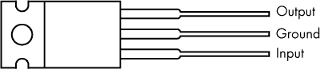

    *图 3-7：LM7805 调节器的引脚分布*

1.  将 LM7805 的输出引脚连接到面包板上的红色正极轨道。

1.  将 LM317 的输入引脚连接到 LM7805 的输入引脚。这是连接来自电源输入电压的点。

1.  将 LM7805 的接地引脚连接到面包板上的蓝色负极轨道。

1.  插入一个 6.8 千欧姆的电阻器，并将一端连接到蓝色负极轨道。这是电阻器 R3；另一端将连接到电阻器 R2。请参见图 3-5 中的面包板俯视图。

1.  将一个 10 千欧姆的电阻器（R2）插入面包板，一端连接到 LM317 输出引脚，另一端连接到第 15 步中的电阻器 R3。

1.  将第 8 步中的电阻器 R1 从 LM317 输出引脚连接到面包板中的一个空孔。这一行将作为调节器的输出。

1.  连接电压分压器：首先，将一个 10 千欧姆的电阻器（R4）插入面包板。然后，将电阻器 R4 的一端连接到与 R1 相同的行（你需要使用跳线），另一端连接到面包板上的一个空行。

1.  将一个 6.8 千欧姆的电阻器（R5）插入面包板，一端连接到 R4 的开路端，另一端连接到蓝色负极轨道。

1.  将 Arduino Pro Mini 插入面包板，使其跨越中央断开部分，如图 3-4 和图 3-5 所示。

1.  使用跳线将 Pro Mini 的 VCC 端口连接到红色正电源轨。

1.  使用跳线将 Arduino Pro Mini 的 GND 引脚连接到蓝色负电源轨。（至少有两个可供选择，一个位于 RST 和 D2 之间，另一个位于 RAW 和 RST 之间。任选其一。）

1.  使用跳线将 R4 和 R5 的连接点连接到 Arduino Pro Mini 上的 A1 和 A0 引脚。

1.  找到 R2 和 R3 的交点，并使用跳线将该交点连接到 Arduino Pro Mini 上的 A2 端口。

1.  将草图上传到 Arduino Pro Mini。（我通常会完全从电路中取下 Pro Mini 来编程，这样稍微不那么混乱。）

1.  通过将 VCC 和 GND 分别连接到面包板上的红色正电源轨和蓝色负电源轨，连接 LCD/I²C 显示屏。

1.  将 SDA 连接到 Arduino Pro Mini 上的模拟引脚 A4，SCL 连接到模拟引脚 A5。

1.  将 LM7805 电压调节器的输入连接到将接入+12V 的引脚。

1.  将 LM7805 的输出连接到红色正电源轨，将接地连接到蓝色负电源轨。

一旦这些连接都完成，您就可以开始了。上传草图并测试电路。

### 草图

稳压电源草图尽可能简化。唯一的难点是，尽管我全程使用 1%容差的电阻，但我发现电阻值有所不同。因此，请注意，您可能需要调整草图以适应这一点。

这是草图：

```
// Regulated Power Supply with volt and current read

#include <Wire.h>
#include <LiquidCrystal_I2C.h>

LiquidCrystal_I2C lcd(0x27, 16, 2); //Check your library for specific LCD
                                    //code both here and in setup.

float low_side_res = A0;
float volt_two;
float volt_three;
float volt_disp;
float low_side_res_2 = A1;
float hi_side_res = A2;
float volt_drop_1;
float amp;
float amp_3;
float amp_4;
float amp_disp;

void setup() {
    lcd.init();
    lcd.backlight();
}

void loop() {
    volt_two = analogRead(low_side_res);
    volt_three = (volt_two*5)/1024.0;
    volt_disp = volt_three*(10000+6800)/6800;  //Actual voltage reading
    amp_3 = analogRead(low_side_res_2);
    amp_4 = analogRead(hi_side_res);
    amp = amp_3 - amp_4;
    amp_disp = amp *5/1024*(10+6.8)/6.8/1.22*.9; //Calculation of amperage I=V/R
    //*0.9 = adjustment for random error in ref voltage in pro mini

    lcd.setCursor(1,0);
    lcd.print("Volt ");
    lcd.setCursor(12, 0);
    lcd.print(volt_disp);
    lcd.setCursor(1, 1);
    lcd.print("mA ");
    lcd.setCursor(11, 1);
    lcd.print(amp_disp*1000,2);
}
```

首先，这个草图导入了一些库，并设置了 LCD（参见 “编写代码以设置 LCD” 在第 36 页）。接着，它定义了一系列变量，都是浮动类型，用于设置电压、从模拟引脚读取数据、计算要显示在 LCD 上的值等等。`setup()`循环非常简短：它只有两行代码用于初始化 LCD。主`loop()`读取电池电压和电流，并执行必要的计算来显示在 LCD 上。`volt_disp`值是要显示在 LCD 上的电压。

### 屏蔽板

尽管电路并不复杂，使用屏蔽板会简化许多连接，尤其是驱动 LCD 和构建电压分压器的部分，它将使稳压电源的组装比点对点接线更加方便。图 3-8 展示了我设计的屏蔽板，当然你也可以自己设计。PCB 文件可在 *[`www.nostarch.com/arduinoplayground/`](https://www.nostarch.com/arduinoplayground/)* 获取。

虽然我使用了两层来构建屏蔽板，但通过一点努力和稍微大一些的电路板，电路完全可以放置在单层板上。

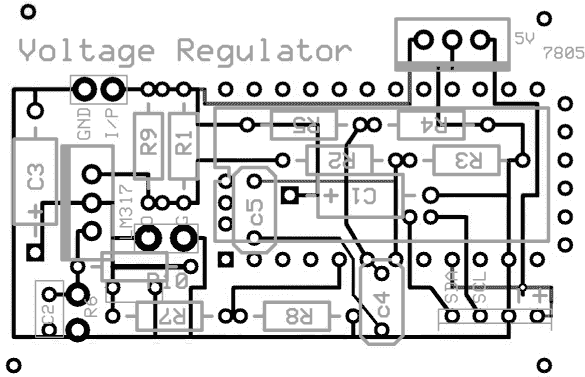

*图 3-8：在稳压电源中使用的 PCB 屏蔽。黑色是顶层，深灰色是底层，浅灰色是丝网印刷层*。

扩展板的元件不需要按特定顺序安装，但某些元件在其他元件之前安装会更容易。我建议按以下顺序焊接：

1.  首先，将 2.2 欧姆、5 瓦特的电阻 R1 和 R9 插入 PCB。这些是降压电阻，为安培计（mA）提供电压，提供总电阻（原理图中的 R1）为 1.1 欧姆，功率为 10 瓦特。这些电阻比板上的配置稍长，所以你需要弯曲引脚以使其适配。当稳压电源接近其最大额定功率时，预计这些电阻和 LM317 本身都会变得有些热。

1.  电容 C1 是一颗 68μF 的钽电容，安装时会比较紧凑。为了确保它不会干扰 LM317，先安装电容。然后，再安装 LM317，确保为散热器留出空间。记住，散热器可能会变得相当热。

1.  确保按照图 3-6 中的引脚排列和图 3-4 中的原理图正确安装 LM317 的引脚。如果你使用提供的扩展板文件，LM317 丝网图上的粗线对应 IC 上的金属标签。如果将元件安装方向错误，系统将无法工作，并且该元件可能会烧坏，而且拆除起来会很麻烦。

1.  将 LM7805 稳压器安装在 PCB 的右上部分，并确保它与图 3-7 中的引脚排列及图 3-4 中的原理图匹配。你可以使用 PCB 丝网图中的粗线作为参考。

1.  尝试将两个稳压 IC 和散热器一起安装在扩展板上（至少暂时安装），确保它们不会与任何活动元件接触。记住，散热器是活动的：LM7805 的散热器（标签）为接地电位，而 LM317 的散热器（标签）为输出电位。

1.  安装电阻 R2、R3、R4 和 R5。在安装 Arduino Pro Mini 的女性插针之前，先安装这些会更容易。

1.  然后，焊接 C1、C2 及将 Arduino Pro Mini 与电位器 R6 连接的导线，电位器 R6 将安装在外壳上。你可以将导线留长一些，等安装扩展板到外壳时再修剪。按照原理图中的指示安装电容 C4 和 C5，参见图 3-4。

1.  接下来，焊接包含 Pro Mini 支架和 LCD 连接器的女性插针。LCD 的连接为 SDA、SCL、−和+，位于 PCB 的右下角。我使用了男性插针和一根女性对女性连接线，将 LCD 与扩展板连接。（要了解如何制作自定义连接器，请参见本书中使用的连接器，第 18 页。）

对于 LCD 和 Arduino Pro Mini，我通常将针脚插入板中，先焊接一个引脚，然后用手指按住上面，加热该引脚并推动连接器，以确保其与板面平齐。对于 Pro Mini 的针脚，我只使用女性针脚连接到那些有铜迹的引脚。我还喜欢在 Pro Mini 的最后一个引脚（通常是 1×4 针脚）上放置一个针脚，以便对准。这些引脚对应 RAW、GND、RST 和 VCC。此外，我还喜欢至少放置两个对角线排列的针脚，以增强机械稳定性。这将对应 Pro Mini 上的 D8 和 D9 引脚。Pro Mini 上的 A4 和 A5 引脚位于 A2、A3 和 VCC 的上方，属于主连接行的一部分。

### 构建

当稳压电源全部焊接完成后，您需要准备一个外壳并将电路装入其中。我选择了一个外观不错的粉末涂层金属外壳，约为 2 1/4 × 3 1/4 × 4 3/4 英寸。图 3-9 展示了完成的设备，驱动着几个白炽灯面板灯。

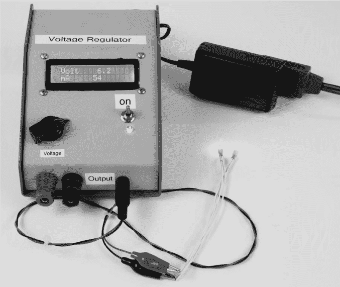

*图 3-9：完成的稳压电源*

不过，请记住，虽然外壳不脆弱，但漆面容易划伤，因此要小心。它也有点贵——大约 20 美元——但因为它将一直放在我的工作台上，我认为值得。当然，您也可以使用您选择的其他外壳，并根据本书提供的模板进行修改。

#### *准备外壳*

如果外壳的前面板是倾斜的，您需要在需要打中心点和钻孔的地方放一块废木板，以帮助固定位置。确保仔细测量、打中心点并钻孔。

本项目的模板见图 3-10 和 3-11，可从*[`www.nostarch.com/arduinoplayground/`](https://www.nostarch.com/arduinoplayground/)*下载。

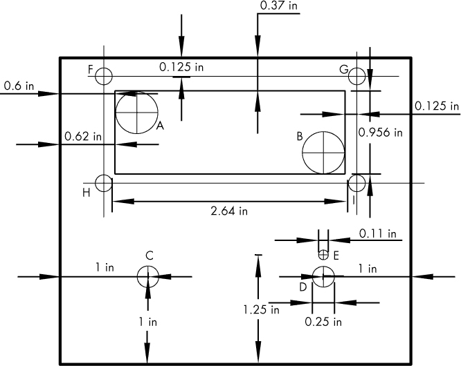

*图 3-10：稳压电源外壳的倾斜面*


*图 3-11：稳压电源外壳的前面和底部*

以下是我建议您准备外壳的方法：

1.  为电位器、开关（1/4 英寸）和电源指示 LED 打中心点并钻孔。有关前面板的尺寸，请参见图 3-10。

1.  在面板后部打中心点并钻孔，用于电源输入插孔（见图 3-10）。

1.  在外壳前面钻孔，用于输出绑定器和 3.5 毫米插孔，如图 3-11 所示。

1.  小心测量并标记 LCD 的切割区域，如图 3-10 所示。用中心冲打标记并钻孔 1/2 英寸的孔在 LCD 屏幕区域的四个角落，帮助启动锯切。你可以根据图 3-10 中的示意图大致判断，或者下载模板的 PDF 文件。可以使用碳纸将图像描摹到机箱上，或者仅用中心冲打标记角落并连接这些打孔点。

1.  小心切割 LCD 的开孔。你可以使用多种工具来完成这项工作。我首先钻了 A 和 B 两个孔，然后使用细齿锯条的钥匙孔锯（可在本地五金店购买）在这两个孔之间切割。记住，切割是在外推时进行的，因此在回程时无需对锯片施加压力。可以用锉刀清理毛刺。

1.  小心地将显示器安装到窗口中，如有必要，可以打磨以确保其紧密安装。由于背光在显示器的一侧突出，为避免挤压背光，您可以使用螺母作为垫片，使其与面板分开。

1.  钻孔 F、G、H 和 I，并固定显示器。在此过程中，仔细检查垫片螺母的宽度是否足够（4-40 螺母有不同尺寸），如果需要，可以使用两个螺母或一个螺母和一个垫圈来为背光提供空间。

#### *安装电路板*

完成护罩组装并测试 LCD 后，安装电位器、开关、LED 和电源插孔。然后就是将护罩安装到机箱中的时候了。最初，我在电路板上钻了四个孔，方便将其固定到机箱中，但我发现 3M 双面胶带也能达到同样的效果。我用 1 1/4 英寸长、3/4 英寸宽的双面胶带将整个电路板（包括散热器）固定住。（制造商声称它能承受 2 磅的重量。）

该粘合剂相对较强，因此在使用之前，请确保仔细计划好安装电路板的位置，以避免它阻碍其他组件。我将电路板倒置安装在机箱的顶部部分，这样所有的组件和连接都位于同一平台上（见图 3-12）。

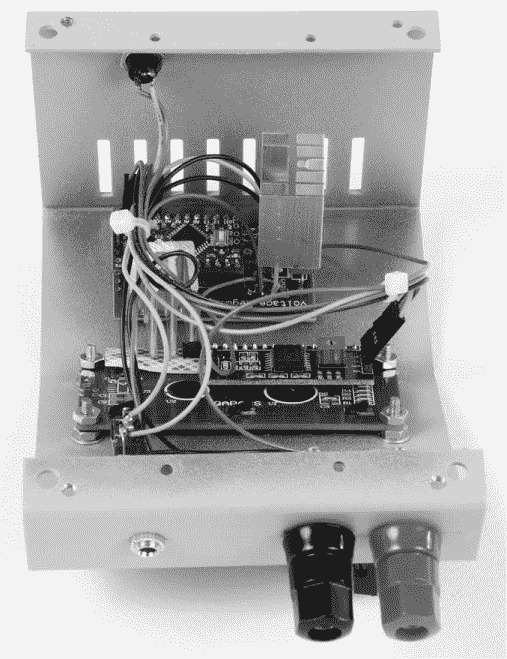

*图 3-12：已完成的（倒置）组装，电路板、LCD、输出连接器、电位器、开关、LED 和输出电源插孔都安装在机箱顶部内部。*

最后一步是根据项目原理图将开关、LED 指示灯、LED 限流电阻、电位器、电源输入插孔和输出连接器连接到 PCB。我使用了 28 号连接线将所有组件连接在一起。两个接线柱/香蕉插头插孔和 3.5 毫米插孔是并联连接的。图 3-12 展示了我如何安装护罩。请注意，我使用了小型线扎带（可选）来保持电线整洁。

在关闭外壳之前，确保没有可能导致短路的区域。例如，我在 LCD 屏幕和金属屏蔽之间放了一小块绝缘胶带。它们在组装时可能不会接触，但在你合上外壳时可能会接触。你可以使用绝缘胶带来防止这种短路。

在测试短路之后，只剩下将外壳的两部分组装在一起。输出连接—绑定端子/香蕉插孔和 3.5 毫米插孔—是并联的。最后一步是将两个部分用螺丝固定，你就可以开始使用了。我在电位器上装了一个指示旋钮，尽管外壳上没有标记。如果你想加上刻度盘也可以，但我觉得数字显示已经足够了。

最后的点睛之笔：去掉一些橡胶脚底部的保护纸，并将它们安装到外壳底部。完成！

完整的稳压电源项目将占用相当大的工作台空间，但你会发现数字显示和香蕉插孔非常有用。如果你觉得冒险的话，你也可以制作一个更小的版本，去掉插孔和 LCD，见图 3-13。


*图 3-13：这是快速简易的电源，顶部已拆开。我是在决定制造完整的稳压电源之前做的这个简易版*。

你可以在 *[`www.nostarch.com/arduinoplayground/`](https://www.nostarch.com/arduinoplayground/)* 找到如何构建迷你稳压电源的说明。
