## 第五章：一只手表上链器**


如果你是自动机械手表或自上链手表的收藏者，你可能已经熟悉手表上链器及其功能。那么，为什么在一本关于 Arduino 微控制器项目的书中会有手表上链器呢？这个问题的答案随着我们深入了解本项目的技术将逐渐明朗。而且，在本项目的过程中，我们将快速了解一些自动手表的历史以及这些看似过时的设备如何在数字时代得以生存和繁荣。即使你不收藏这些珍贵的时计，这个项目也许会激发你开始自己的收藏。

### 为什么选择手表上链器？

因为作为一个收藏者，你拥有的不止一只自动机械手表，你可能想要考虑把那些不在手腕上的手表保持上链状态。如果你阅读过有关机械手表和上链器的资料，你会发现使用手表上链器有许多优缺点（可能优点更多）。一个大的优点是，如果多功能手表停下来，重新设置可能需要很长时间。也有一种观点认为，如果一只机械手表保持静止不动，润滑油会向低点迁移。手表上链器的定期运动，或佩戴时的运动，有助于保持润滑油的均匀分布，并保持在轴承中，防止润滑油流失。虽然很多人赞同这一观点，但实际上并没有确凿的证据。

还有一个很有说服力的理由支持使用手表上链器。作为一个收藏者，能够展示更多的收藏品，而不仅仅是单独戴在手腕上的那一只，感觉很好。许多市售的上链器都配有珍稀木材的外壳，以展示手表。但便宜的上链器往往不可靠，而贵的上链器则，嗯，价格不菲。

我冒险购买了其中一款更经济实惠的手表上链器，并把我的两只机械手表——一只真劳力士和一只假劳力士——放了进去，想着就这样搞定了。但不到六个月，这个上链器就坏了。我把它拆开，发现设计和做工非常差。即使我更换了坏掉的电机，其他的机制也可能不太可靠。在使用上链器时，那只假劳力士没有完全上链，而且也没能保持准确的时间。

当时的问题是，是否要从口袋里掏出 400 或 500 美元，购买一个承诺可靠性的上链器（甚至有些型号的售价超过 1500 美元、2000 美元或更多），还是尝试做得更好。所以，隐喻地说，挑战已经提出。挑战是设计并制造一个可靠的手表上链器，它不仅能作为我的手表展示平台，还能在坚固的机械结构中提供我所需要的时间控制和灵活性。Arduino 是控制手表旋转频率的显而易见的选择，而机械部分则围绕这一点展开。

在构建你的手表上弦器时，你会发现无论是在机械结构还是草图方面，都有很多个性化的空间。尽管手表上弦器是一个用于保持手表上弦的实用设备，但这个版本为你的时计提供了一个优雅的展示平台——它本身也是一件艺术作品，一座动感雕塑。你可以在图 4-1 中看到最终效果。

因为我选择了 Arduino 作为逻辑计时元件，我不得不围绕这一点规划其他电子元件和软件。我们将重新审视 PCB 蚀刻机中的 H 桥电路（参见“使用 H-Bridge”，见第 48 页），以便使电机能够双向驱动，并且我们将使用晶体管来增强高功率 LED 的驱动能力。我们还将使用霍尔效应传感器来测量手表的旋转。

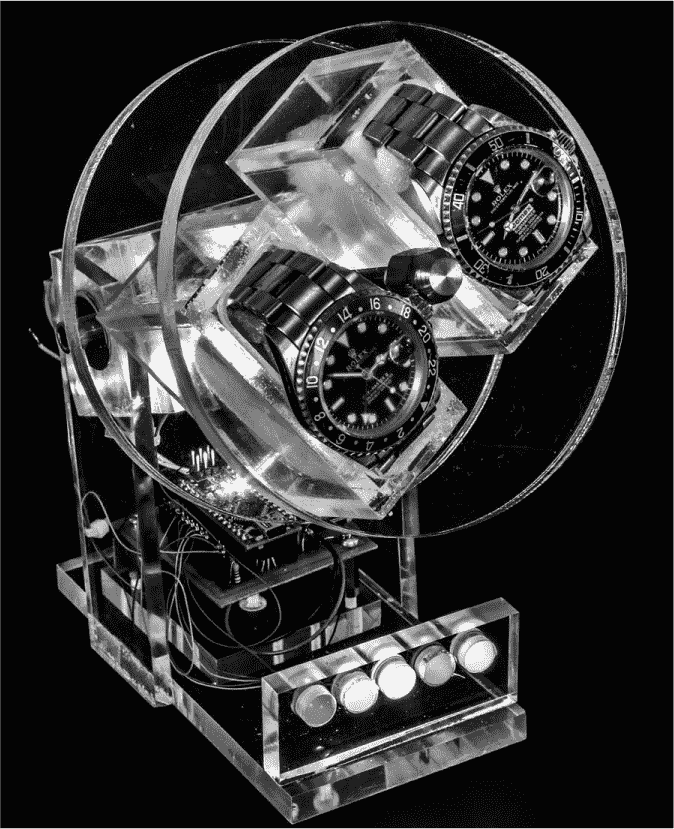

*图 4-1：完成的手表上弦器。遗憾的是，这张黑白图片无法体现其美感：鲜艳的 LED 灯光通过丙烯酸材料作为光导，将各种颜色的 LED 光传送到设备上*。

该项目的草图使用函数和数组以重复的模式闪烁 LED。草图还指示控制器读取霍尔效应传感器的状态，该状态为零或一。知道这一状态可以让控制器决定何时为手表上弦，并保持旋转次数的计数，以确保手表不会上弦过度或不足。

**自动手表的神秘感**

自动手表是在 1920 年代初期发明的，并在几年后开始商业化。在接下来的几年里，许多改进相继出现，直到它达到了今天仪器的精密水平。自动手表通过一个连接到棘轮装置的摆锤来运作：当摆锤摆动时，棘轮装置会为手表的主发条上弦。内置的滑动离合机制防止了过度上弦。请参见图 4-2，了解这些手表的内部结构。

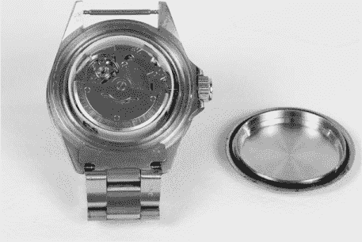

*图 4-2：一只自动手表，背面已移除，暴露出摆锤和支点（中心的螺钉），它们与棘轮装置一起工作，给手表的主发条上弦*

几乎所有手表制造商的自动手表都在几十年间享受了广泛的成功。然而，在 1960 年代初期，宝路华（Bulova）开发了其 Accutron 调谐叉电子手表，随后 Pulsar 推出了数字石英电子手表。1

尽管电子手表（现在包括智能手表）涌现，但领先的机械手表制造商依然在这个时代存活下来，并且甚至有所繁荣。今天，自动手表的价格从不到 100 美元到数万甚至数十万美元不等。

为什么有人愿意为一款不特别准确、沉重、经常笨重且在不使用时需要保持上链的手表支付高价呢？我敢肯定每个收藏者的答案都不相同，但我猜他们和我一样，喜欢那种优雅、声望、复杂性、历史感和精密机械感，这是电子表无法比拟的——尽管 iWatch 在某些方面接近。就像任何收藏品一样，一只自动手表永远不够——这也引出了手表自动上链器。

* * *

1。从机械表到电子表的过渡被描述为托马斯·库恩在其 1962 年的著作《科学革命的结构》中提出的“范式转变”的典型例子。

### 必备工具

钻头和钻头套件

锥形铰刀套件

小型压线钳

中心冲孔器

Weld-On 4 和 Weld-On 16 丙烯酸粘接液

各种砂纸，包括 220 到 600 目数的砂纸以及用于最终抛光的 1500 目砂纸

珠宝抛光粉或其他液体塑料抛光剂

（可选）圆锯

（可选）螺纹锁固液

（可选）线圈工具

（可选）旋转工具（例如，你可以购买一款带有磨料切割轮的德瑞姆工具。）

### 零件清单

如果你想制作一款像图片中的手表自动上链器，你将需要几块丙烯酸材料以及其他硬件，详细内容我会在本节中说明。

#### *丙烯酸*

以下丙烯酸部件可以轻松从标准丙烯酸板中切割而成。除非购买独立的圆盘（我建议你单独购买），其余部分都可以从两块 12×12 英寸的丙烯酸板中切割（其中一块厚度为 3/8 英寸，另一块为 1/4 英寸厚）。如果你愿意，你也可以找到提供激光切割丙烯酸定制尺寸的供应商。（例如 ZLazr，其他许多商家也提供此服务。）虽然价格会比自己动手稍贵，但它会使切割和抛光更加简单。

四块尺寸为 1/4 × 2 × 1 1/2 英寸的材料（手表篮子的长边；可以是 3/8 英寸）

四块尺寸为 1/4 × 1 × 2 英寸的材料（手表篮子的短边；可以是 3/8 英寸）

两块尺寸为 3/8 × 3 × 2 英寸的材料（轴承盒的轴承支架）

两块尺寸为 3/8 × 2 × 1 1/2 英寸的材料（轴承盒的安装面）

一块尺寸为 1/4 × 1 × 2 英寸的材料（电机支架）

两个圆形部件，厚度为 3/8 英寸，直径为 5 英寸（手表篮子的两端）

两块尺寸为 1 1/2 × 5 × 1/4 英寸的材料（支架侧支撑）

一块尺寸为 3/8 × 3 × 5 1/2 英寸的材料（支架底座）

一块尺寸为 3 × 1 1/2 × 3/8 英寸的材料（灯条）

一块尺寸为 2 1/2 × 2 1/2 × 3/8 英寸的材料（屏蔽支架）

两个 3.5 毫米的立柱，带有 M/F M3-05 螺纹（电机支架）

三个 1.5 毫米的立柱，带有 M/F M3-05 螺纹（屏蔽支架）

有几个在线商家可以购买这个项目所需的亚克力材料；只需在 Google 上搜索*acrylic sheet*，就能找到离你最近的商家。在美国，* [`www.zlazr.com/`](http://www.zlazr.com/)*似乎不错。在我写这篇文章的时候，我与商家老板亲自交谈过，他表示他可以轻松处理这个项目所需的切割工作。

#### *其他硬件和电路组件*

一个 Arduino Nano 或其克隆版

一个霍尔效应开关，例如 Melexis US5881LUA（侧支撑的尺寸应为 1 1/2 × 5 × 1/4. 参见《搭建支架》，见第 115 页）

一根 8 英寸长，直径为 1/4 英寸，28 牙螺距的驱动轴（我建议使用黄铜，因为它易于加工）

两个球轴承（R4A-2RS）

六个 1/4 英寸-28 的六角锁紧螺母

两个装饰性螺栓，1/4 英寸-28，长度 1 英寸（我使用的是镀铬的内六角螺栓）

十个 ZTX649 晶体管

一个 SN754410 四路 H 桥

十个 470 欧姆电阻

一个 10 千欧，1/8 W 电阻

一个 0.1 μF 的陶瓷电容器（C1）

一个 10 μF 的钽电容器（C2）

一个如《定制屏蔽板》中所描述的定制屏蔽板，或孔板（你也可以选择让 ExpressPCB 定制屏蔽板；有关详细信息，请参见《制作你自己的 PCB》，见第 13 页）

一个齿轮头电机（我使用的是一个 6V、20 RPM 的电机，型号为 Amico 20 RPM 6VDC 0.45 A）

一个 LM7805 电压调节器

十四个 LED，颜色多样（我购买了清晰和磨砂版本。输出较高的通常是清晰版本）

各种连接线和线缠绕线

十个 LED 线缆缠绕或焊接用的钉子（可尝试 Pololu 的#966 商品或 Electronic Goldmine 的#G19870 商品）

一根直径为 3/8 或 1/2 英寸，长度约为 3/4 英寸的黄铜圆棒（我使用的是直径 3/8 英寸的黄铜棒。黄铜材料常见，长度为 6 英寸和 12 英寸，可以用锯子裁剪成所需的尺寸）

一根直径为 0.39 英寸的 6 英寸长钢琴弦

一个铌或钕磁铁，直径约为 3/8 英寸，厚度约为 1/8 英寸

一个 4-40 平头螺钉

六个 M3×3/8 英寸螺丝

七个 M3-05×1/2 英寸螺丝

（可选）一个 Amico H7EC-BCM 计数器

（可选）八个 270 欧姆电阻（如果你选择遵循我在《面包板》中的具体说明，可以在面包板原型中使用这些电阻，见第 98 页）

### 下载

在开始构建之前，请访问*https://www.nostarch.com/arduinoplayground/*，下载本书的资源文件，并查找以下第四章所需文件：

**模板**    *MotorMountAndBearingBox.pdf, BaseAndLightbar.pdf, WatchBasket.pdf*

**机械图纸**    *MotorAssembly.pdf*

**屏蔽板**    *WatchWinder.pcb*

**草图**    *WatchWinder.ino*

### 基本的手表上链器要求

一些初步研究表明，为了保持手表的最佳状态，手表上链器每天应该旋转 600 到 1200 次。但这并不完全正确。我随后发现，这个范围实际上要宽得多，至少根据两个领先的自动手表网站，手表是不能被过度上链的，因为它们有内置的保护系统。我还了解到，手表应该同时朝顺时针和逆时针旋转，以保持润滑油在正确的位置，并避免长时间内出现不均匀的磨损。关于这个主题，网络上有丰富的信息，包括手表制造商的官方网站以及手表上链器网站。

显然，总的转动次数才是关键，而不一定是转动的顺序或每个方向上转动的次数完全相同。（如果手表在长时间内被过度上链，可能会有负面影响。）听起来不是很棘手，对吧？我也这么认为。

### 使用 Arduino 控制上链器旋转

一个纯粹实用的上链器只需要完成其功能，旋转手表以使摆锤摆动。但拥有额外功能的上链器更加有趣。正如在《为什么使用上链器？》一节中提到的，第 90 页上，一些上链器装饰有精美的异国木材盒子，用来展示手表。

然而，这是一个 Arduino 项目，额外的技术特性和 LED 应体现平台的灵活性和多样性。在一个开发模型中，原始草图指示电子设备先将电动机朝一个方向转动，然后再转向另一个方向，使用延迟确保每天进行 600 到 1200 次的旋转。

但事实证明，一些手表需要比最小的旋转次数更多，而有些手表则可以少一些。改变旋转次数最简单的方法是根据需要调整草图中的各种延迟。你甚至可以向电路中添加硬件，通过一个电位器来调整每天的转动次数，正如我在《设计说明》一节中描述的，见第 124 页。

为了驱动电动机，我使用了一个 H 桥集成电路。它接受来自 Arduino 的控制逻辑，并允许你通过单一电源反转电动机的极性，从而使电动机可以在两个方向上旋转。

**注意**

*欲了解更多关于 H 桥的信息，请参阅《使用 H 桥》一节，见第 48 页*。

### 使用霍尔效应传感器监测旋转

然后，就涉及到如何测量设备转动的次数，以协助计时并为草图提供更多信息。每单位时间的转动次数是电动机的一个函数，虽然我为指定电动机提供的计时方法理论上可行，但它可能并不适用于所有电动机。

例如，我在相同电压下测试了三台相同型号的电机，每台电机的转速略有不同。此外，如果你选择替换一个转速不同的电机，旋转计数也会不同。在 Beta 测试中，一位用户在 5V 电源下运行 6V 电机时遇到了困难。（参见“电机电压”在第 126 页）。由于每单位时间的转动次数与电机有关，因此如果仅凭计时来确定总的旋转次数，这些不一致性可能会成为问题；需要一种机制来监控旋转次数。

为了确保一致的计时，我决定测量设备的转动次数。因此，我将一个小磁铁固定在旋转手表的轴上，并将一个霍尔效应设备，或者说一个能够检测磁场的传感器，安装在与磁铁对齐的位置。如果你愿意，可以用一个小型簧片开关来替代霍尔效应传感器。

当手表和磁铁旋转时，霍尔效应开关只有在靠近磁铁时才会开启，使开关在每次旋转时开关一次。每次霍尔效应开关状态改变时，Arduino 会递增一个内部计数器。结合草图，这确保了无论电机速度如何，每天的转动次数都能正确计算。与簧片开关不同，霍尔效应开关不需要任何缓冲或去抖动，如在“草图”中讨论的那样，在第 102 页，因为设备电路中包含了施密特触发器。如果你选择使用簧片开关，可能需要在草图中添加去抖动功能。

使用带有永久磁铁的霍尔效应开关时，你只需要小心如何移动磁铁。某些机械手表因靠近强磁场而受损，因为发条被磁化，导致物理特性发生变化，从而使计时出现偏差。尽管指定的磁铁很小，不太可能造成问题，但我强烈建议你将任何磁铁至少保持在距离手表一英寸的地方——无论是机械表还是电子表。

### 原理图

图 4-3 展示了用于手表上链器的电路原理图。请注意，霍尔效应设备的输出端连接了一个上拉电阻，连接到正电源。这使得 Arduino 的 A0 引脚在霍尔效应开关或簧片开关遇到足够强的磁场时保持高电平，关闭开关并将引脚拉低。霍尔效应设备的输出本质上是一个开路集电极，因此没有上拉电阻时，集电极会处于浮空状态，可能会导致误触发。

这两个电容器防止 LM7805 调节器自行振荡并消耗过多的电力。尽管我用示波器检查了调节器的输入和输出并没有看到振荡，但我决定添加这些电容器作为预防措施。我根据以前的项目选择了这些电容器，它们表现得很好。

我试图为时钟上链器（Watch Winder）设计一种壮观的外观，以匹配它所容纳的一些时计，因此我使用了高功率的 LED，如在“零件清单”中描述的，位于第 93 页。这些 LED 的光输出可以达到 100,000 到 200,000 甚至更多的毫坎德拉（MCD）。但这引发了另一个问题。Arduino Nano 的处理器芯片 ATmega328 每个输出引脚只能提供或吸收 40 mA 电流。此外，整个芯片的最大电流消耗仅为 200 到 300 mA。因为这些 100,000+ MCD 的 LED 每个大约需要 30 到 60 mA 的电流，所以必须采取措施。

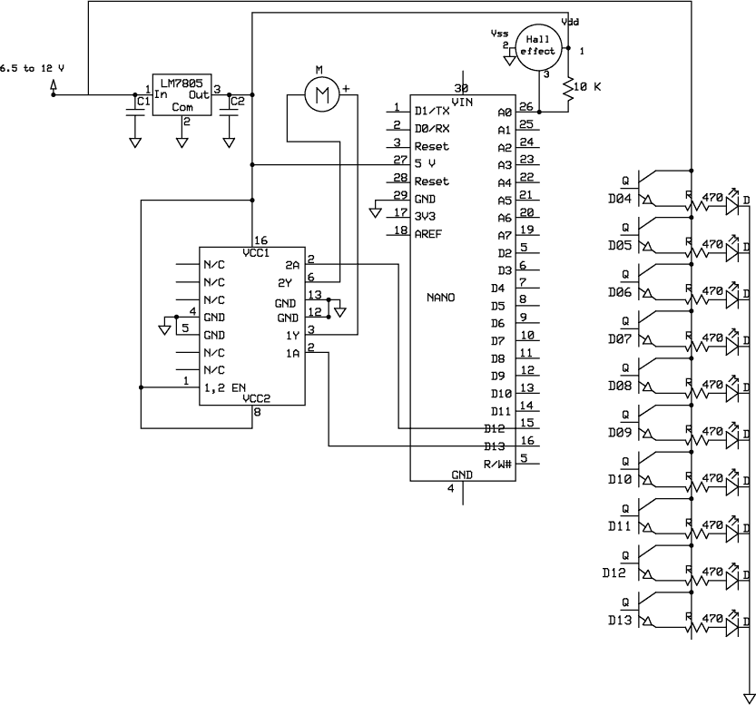

*图 4-3：时钟上链器电路。晶体管连接到 Nano 的数字输出，而 A0 通过 10 千欧电阻连接到高电平*。

每个 LED 都有一个 1 A 的晶体管来承担负载。NPN 晶体管的集电极—正极—连接到 VIN，而不是为 Nano 和 H 桥供电的 5V，因此 LED 不会对电压调节器造成负担，即使发射极跟随基极并将 5V 送到 LED。

### 面包板

就像我们讨论过的其他项目一样，时钟上链器最初是一个面包板，如图 4-4 所示。这让我能够测试技术并进行草图的初步调试。

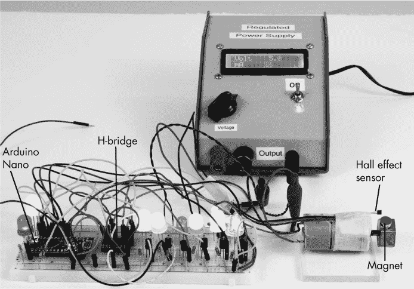

*图 4-4：时钟上链器面包板被用作项目的概念验证。在这里，我使用第三章的调节电源为其供电*。

我建议首先为这个项目建立一个面包板，这样你可以看到每个部件的连接位置以及原因。使用面包板，你还可以在不需要每次都重新焊接的情况下玩转草图和 LED。我使用了一块 6.5 英寸长的面包板来容纳所有组件。我在面包板上确实采取了一些捷径，这些都在说明中注明；你也可以直接按照电路图来构建。

为了接线面包板，请按以下步骤操作：

1.  将面包板右侧的红色条带连接到左侧相应的红色条带。这些是你的正极轨道。

1.  将面包板右侧的蓝色条带连接到左侧相应的蓝色条带。这些是你的负极轨道（地线连接）。

1.  将 Arduino Nano 插入面包板的一端。

1.  将 Nano 的 5V 引脚连接到红色正极轨道。

1.  将 Nano 的 GND 引脚连接到面包板上的蓝色负极轨道。

1.  插入 LM7805 调节器，并将输出引脚连接到红色正极轨道。（图 4-5 展示了调节器的引脚排列。）

    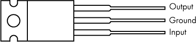

    *图 4-5：LM7805 稳压器 TO-220 封装引脚排列*

1.  将稳压器的地端连接到蓝色负极轨道。

1.  稳压器的输入端将连接到面包板上的一个空行，这一行将连接到+7.5V 到 9V 的电源。

1.  将电容 C1 从稳压器的输入连接到地线。

1.  将电容 C2 从稳压器的输出连接到地线。

1.  将 SN754410 H-桥插入距 Nano 几行的地方，跨过面包板中间的凹槽。(图 4-6 显示了 H-桥的引脚排列。)

    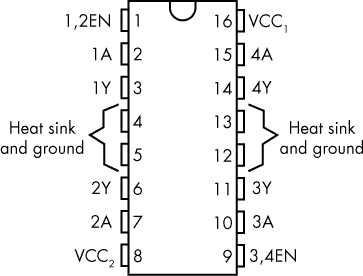

    *图 4-6：SN754410 H-桥 DIP 封装引脚排列*

1.  将 H-桥的 4 号、5 号、12 号和 13 号引脚连接到地。

1.  将 H 桥的 8 号、9 号和 16 号引脚连接到红色正极轨道。

1.  将 H-桥的 14 号和 11 号引脚连接到电机，电线至少要 10 到 12 英寸长。除非使用鳄鱼夹或夹子引线，否则必须将连接电机的引脚焊接起来。

1.  将大约 8 英寸的电线连接到霍尔效应传感器的三个引脚。将霍尔效应传感器连接到红色正极轨道和蓝色负极轨道的引脚分别接到正负极。

1.  将连接到霍尔效应传感器第三个引脚的电线连接到 Nano 的 A0 引脚。霍尔效应传感器将用胶带（我用了 masking tape）固定在电机外壳上（由于引脚是绝缘的，这样做是可行的），使设备的活动部分靠近与轴旋转时附着在轴上的磁铁。

1.  将一个 10 千欧姆电阻从 Nano 的 A0 引脚连接到红色正极轨道。

1.  将 H-桥的 10 号引脚连接到 Nano 的 D13 引脚。

1.  将 H-桥的 15 号引脚连接到 Nano 的 D12 引脚。

1.  在面包板的一侧插入五个 ZTX649 晶体管，每个晶体管使用三行。(图 4-7 显示了晶体管的引脚排列。)

1.  将每个晶体管的集电极连接到红色正极轨道。

    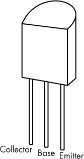

    *图 4-7：ZTX649 晶体管 TO-92 封装引脚排列*

    *这些晶体管连接与最终的原理图不同，其中集电极将连接到 9V 输入电压。*

1.  取五个 LED，并将每个 LED 的正极连接到每个晶体管的发射极。

1.  将每个 LED 的负端通过一个 270 欧姆电阻连接到地。

1.  在面包板的另一侧以类似步骤 20-23 中连接的五组方式，连接三个额外的晶体管、LED 和 270 欧姆电阻。

    **注意**

    *步骤 20-25 与原理图不同，因为 LED 直接由 Nano 驱动，便于实验。在原理图中，它们是通过晶体管连接的。使用 470 欧姆电阻代替 270 欧姆电阻限制了 Nano 的电流。*

1.  将另一个 LED 的正极连接到 Nano 的 D12 引脚。

1.  将 D12 引脚的 LED 负端连接到面包板上的一个空行。

1.  将一个 470 欧姆电阻的一端连接到 D12 引脚 LED 的负端，将电阻的另一端连接到地面。

1.  将另一个新 LED 的正端连接到 Nano 的 13 引脚。

1.  将 13 引脚 LED 的负端连接到面包板上的空排。

1.  将一个 470 欧姆电阻的一端连接到 13 引脚 LED 的负端，将电阻的另一端连接到地面。

1.  将 Nano 上的 D4、D5、D6、D7、D8、D9、D10 和 D11 引脚连接到为 LED 供电的晶体管的基极。

因为面包板仅用于示意，所以连接的顺序并不重要，除非你希望在电路处于面包板上的时候重新编程 Arduino。

磁铁是通过双面胶泡沫胶带安装到电机轴上的插头上的。对于插头，你几乎可以使用任何东西——如软木塞、橡胶塞等——只要它能将磁铁放置到一个位置，使磁铁旋转时大约距离传感器 3/8 英寸。

完成面包板连接后，将*WatchWinder.ino*草图上传到 Arduino。只需按照第 5 页中“将草图上传到 Arduino”的说明操作。

### 草图

Watch Winder 利用函数和数组显示不同的闪烁序列在 LED 上，而无需每次都重写序列。也有一些漫长的延迟：大约 24 小时内 829 次旋转，相当于 20 转/分钟的马达大约运行 32.5 分钟，在 1,400 分钟的一天中。这意味着如果草图处理整整一天的旋转，它将每天闲置 1,367.5 分钟。

但你可以将旋转分配开来，这样草图就可以重复，并且只需要 24 小时中的一小部分时间来完成。例如，如果选择一小时作为草图循环完成的时间，那么电机必须旋转 24 次。它可以每次 12 次，或者其他的组合。

在以下的草图中，我还努力使灯光和马达的运动尽可能地具有视觉吸引力，几乎没有发生什么的空闲时间——这是一种艺术选择。

```
      /*This gives about 829 revs/day*/  

      const int HallPin = A0; //Identify those things that will not change  
      const int CWpin = 12;  
      const int CCWpin = 13;  

      const int LED11 = 11;  
      const int LED10 = 10;  
      const int LED9 = 9;  
      const int LED8 = 8;  
      const int LED7 = 7;  
      const int LED6 = 6;  
      const int LED5 = 5;  
      const int LED4 = 4;  

      int autoDelay = 1000;  
      int timer = 500;  
      int timer2 = 3000;  
      int repeats = 10;  

      int previous;  
      int HallValue = 1; //Response from the Hall effect sensor  
      int time = 0;  
      int state;  
      int count = 0;  
      int q = 0;  
      int i;  
      int j;  

      int ledPins[] = {  
        11, 4, 7, 6, 8, 10, 5, 9,  
      };  
      int pinCount = 8;  

      void blinkIt() {  
        //Initiate rapid blink sequence  
        for(int thisPin = 0; thisPin < pinCount; thisPin++) {  
          //Turn the pin on:  
          digitalWrite(ledPins[thisPin], HIGH);  
          delay(timer2);  
          //Turn the pin off:  
          digitalWrite(ledPins[thisPin], LOW);  
          delay(timer2);  
        }  

        //Loop from the highest pin to the lowest:  
        for(int thisPin = pinCount - 1; thisPin >= 0; thisPin--) {  
          //Turn the pin on:  
          digitalWrite(ledPins[thisPin], HIGH);  
          delay(timer2);  
          //Turn the pin off:  
          digitalWrite(ledPins[thisPin], LOW);  
          delay(timer2);  
        }  
      }  

      void flashIt() {   
        //Initiate rapid blink sequence  
        for(int thisPin = 0; thisPin < pinCount; thisPin++) {  
          //Turn the pin on:  
           digitalWrite(ledPins[thisPin], HIGH);  
           delay(timer2);  
           //Turn the pin off:  
           digitalWrite(ledPins[thisPin], LOW);  
        }  

        //Loop from the highest pin to the lowest:  
        for(int thisPin = pinCount - 1; thisPin >= 0; thisPin--) {  
           //Turn the pin on:  
           digitalWrite(ledPins[thisPin], HIGH);  
           delay(timer2);  
           //Turn the pin off:  
           digitalWrite(ledPins[thisPin], LOW);  
        }  
      }  

      void allatOncefast() {  
        {  
          digitalWrite(LED4, HIGH);  
          digitalWrite(LED5, HIGH);  
          digitalWrite(LED6, HIGH);  
          digitalWrite(LED7, HIGH);  
          digitalWrite(LED8, HIGH);  
          digitalWrite(LED9, HIGH);  

          digitalWrite(LED10, HIGH);  
          digitalWrite(LED11, HIGH);  

          delay(500);  

          digitalWrite(LED4, LOW);  
          digitalWrite(LED5, LOW);  
          digitalWrite(LED6, LOW);  
          digitalWrite(LED7, LOW);  
          digitalWrite(LED8, LOW);  
          digitalWrite(LED9, LOW);  
          digitalWrite(LED10, LOW);  
          digitalWrite(LED11, LOW);  

          delay(500);  
        }  
      }  

      void allatOnce() {  
        {  
          digitalWrite(LED4, HIGH);  
          digitalWrite(LED5, HIGH);  
          digitalWrite(LED6, HIGH);  
          digitalWrite(LED7, HIGH);  
          digitalWrite(LED8, HIGH);  
          digitalWrite(LED9, HIGH);  
          digitalWrite(LED10, HIGH);  
          digitalWrite(LED11, HIGH);  

          delay(4000);  

          digitalWrite(LED4, LOW);  
          digitalWrite(LED5, LOW);  
          digitalWrite(LED6, LOW);  
          digitalWrite(LED7, LOW);  
          digitalWrite(LED8, LOW);  
          digitalWrite(LED9, LOW);  
          digitalWrite(LED10, LOW);  
          digitalWrite(LED11, LOW);  

          delay(2000);  
        }  
      }  

      void setup() {  
        pinMode(HallPin, INPUT);  //Identifies inputs and outputs  
        pinMode(CWpin, OUTPUT);  
        pinMode(CCWpin, OUTPUT);  

        Serial.begin(9600);  

        for(int thisPin = 0; thisPin < pinCount; thisPin++)  {  
          pinMode(ledPins [thisPin], OUTPUT);  
        }  
      }  

        void loop() {  
          int HallValue = (digitalRead(HallPin)); //Sets value of initial Hall effect  

          if(HallValue == HIGH  previous == LOW) {  
            if(state == HIGH)  
              state = LOW;  
            else  
              state = HIGH;  

            //Increments counter each time the Hall effect sensor passes the magnet  
➊          count++;  
        }  

        /* The "Serial.print" line was used in development. I left it in so that   
           you can experiment and look at some of the values on a serial   
           monitor. You might even want to change the parameters of what you   
           are looking at in the monitor.  
        */  
        Serial.print("HallValue       ");  
        Serial.println(HallValue);  
        Serial.print("count                      ");  
        Serial.println(count);  
        Serial.print("CCW                             ");  
        Serial.println(" ");  

        if(count == 1) {  
           digitalWrite(CCWpin, HIGH);  
           digitalWrite(CWpin, LOW);  
        }  

        if(count == 3) {  
           digitalWrite(CWpin, HIGH);  
           digitalWrite(CCWpin, HIGH);  
        }  

        if(count == 3) {  
           for(i = 0; i < repeats; i++) {  
            allatOncefast();  
          }  
          count = count + 1;  
        }  

        if(count == 3) {  
           digitalWrite(CWpin, LOW);  
           digitalWrite(CCWpin, HIGH);  
        }  

        if(count == 4) {  
           digitalWrite(CWpin, HIGH);  
           digitalWrite(CCWpin, HIGH);  
        }  

      if(count == 4) {  
         for(q = 0; q < repeats; q++) {  
           blinkIt();  
         }  
         count = count + 1;  
      }  

      if(count == 5) {  
         for(j = 0; j < repeats; j++) {  
          allatOnce();  
         }  
        delay(50);  
         count = count + 1;  
      }  

      if(count == 6) {  
         digitalWrite(CCWpin, LOW);  
         digitalWrite(CWpin, HIGH);  
      }  

      if(count == 7) {  
         digitalWrite(CWpin, LOW);  
         digitalWrite(CCWpin, LOW);  
      }  

      if(count == 7) {  
         for(i = 0; i < repeats; i++) {  
           flashIt();  
         }  
         count = count + 1;  
      }  

      if(count == 8) {  
        digitalWrite(CCWpin, HIGH);  
         digitalWrite(CWpin, LOW);  
      }  

      if(count == 10) {  
         for(i = 0; i < repeats; i++) {  
           allatOncefast();  
         }  
         count = count + 1;  
      }  

      if(count == 11) {  
         digitalWrite(CCWpin, LOW);  
         digitalWrite(CWpin, LOW);  
      }  

      if(count == 11) {  
         for(i = 0; i < repeats; i++) {  
           blinkIt();  
         }  

         delay(2000);  
         count = count + 1;  
      }  

      if(count == 12) {  
         digitalWrite(CCWpin, LOW);  
         digitalWrite(CWpin, HIGH);  
      }  

      if(count == 13) {  
         digitalWrite(CCWpin, HIGH);  
         digitalWrite(CWpin, HIGH);  
      }  

      if(count == 13) {  
         for(i = 0; i < repeats; i++) {  
           flashIt();  
         }  
         count = count + 1;  
      }  

      if(count == 14) {  
         for(i = 0; i < repeats; i++) {  
          allatOnce();  
         }  
      }  

      if(count == 14) {  
         digitalWrite(CWpin, LOW);  
         digitalWrite(CCWpin, HIGH);  
        delay(autoDelay);  
      }  

      if(count == 17) {  
         digitalWrite(CWpin, HIGH);  
         digitalWrite(CCWpin, HIGH);  
      }  

      if(count == 17) {  
         for(i = 0; i < 20; i++) {  
           blinkIt();  
         }  
      }  

      {  
         for(i = 0; i < repeats; i++) {  
           allatOncefast();  
         }  
         count = count + 1;  
      }  

            if(count == 18) {  
              digitalWrite(CCWpin, HIGH);  
              digitalWrite(CWpin, LOW);  
               delay(2000);  
               digitalWrite(CCWpin, LOW);  
               digitalWrite(CWpin, HIGH);  
               delay(2000);  
            }  

            if(count > 20) {  
➋          count = 0;  
            }  
            previous = HallValue;  
     }
```

首先，草图创建几个常量、整数和数组，通过读取霍尔效应传感器并计算旋转次数来帮助计时旋转。接下来，定义几个函数：`blinkIt()`和`flashIt()`以不同的模式闪烁 LED，而`allatOnceFast()`和`allatOnce()`则在不同的延迟下同时闪烁所有 LED。

和往常一样，`setup()`函数告诉 Arduino 哪些引脚是输入和输出。在`loop()`函数的开始，读取霍尔效应传感器，并根据需要在➊处增加计数器，同时在串行监视器中打印一些有用的调试值。这个程序使用`count`值来开启或关闭不同的序列，并限制重复次数。然而，由于`count`在➋处在序列结束时被重置，它不能作为总计器使用。

最后，对于不同的计数，程序使用`if`语句来硬编码不同的模式，用于打开手表和闪烁 LED；我在这里展示了一些，但我鼓励你设置你自己的模式。这个程序编写了许多函数，你可以按原样使用或在`for`循环中重复以进行多次迭代。

### 盾牌

与一些其他 Arduino 项目一样，这块盾牌并不是非常复杂，但看起来有点繁忙。为了简化，这块盾牌采用单面板设计。电路使用 LM7805 电压调节器来处理由于使用不同电机可能产生的过多电流。Nano 上内置的调节器仅适用于 300 mA 以下的电流。

**注意**

*在这个项目中，我使用了最高可达 500 mA 的调节器，但调节器会变得相当热，我在这个电流下使用它并不感到舒服*。

你也许可以省略调节器；为高输出 LED 供电的晶体管的集电极被配置为发射极跟随器，并直接连接到正 9V 电源，因此它们并没有对稳压后的 5V 产生负载。

图 4-8 显示了盾牌的铜箔图案（左）和丝印层（右）。

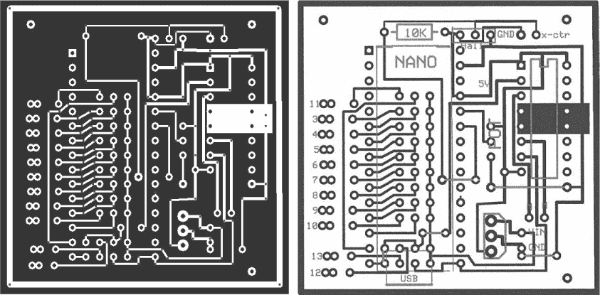

*图 4-8：盾牌的铜箔图案（左）和丝印层（右）。手表上链器的丝印层显示了 Nano、H 桥、外部计数器的接点、霍尔效应传感器、可调电阻、LED 连接、跳线、输入电压（VIN）和地（GND）的大致位置。PCB Express 文件可以从[`www.nostarch.com/arduinoplayground/`](https://www.nostarch.com/arduinoplayground/)下载。*

请注意，板子顶部标有*Hall*的霍尔效应开关接点。我将连接霍尔效应器件的线缆直接焊接到 PCB 上，不过如果你更喜欢的话，也可以使用连接器。

在板子的中央，我留出了连接可调电阻（POT）的位置，用于外部调整周期，这一选项我在“总旋转调整”中进行了描述，见第 124 页。数字输出的编号标注在左侧。

如果你选择组装 Watch Winder 屏蔽板，请注意 Nano 板应插入焊接到屏蔽板上的女性插头，并且晶体管位于 Nano 板的下方。在焊接晶体管之前，请将它们按足够深的位置按下，以确保插入 Nano 板时它们不会阻碍其安装。我必须将晶体管放得相当靠近，以便将所有连接都安排在 PCB 布局中。我选择的 ZTX649 晶体管足够适合 Nano 脚印所允许的 0.100 英寸间距。

你还需要添加一些跳线，以完成屏蔽板上的连接。它们在丝网印刷图案上标明了。在图 4-8 中，这些以五条黑色线条显示。在接线板时不要忘记将它们包括在内。我还省略了 LM7805 稳压器输入和输出到地面的电容器；在完成的电路板上，它们是外部焊接的。如果你需要这些电容器，只需直接将一个 10.0μF 的钽电容和一个 0.1μF 的陶瓷电容焊接到稳压器的引脚上，正如图 4-3 中的电路图所示。

### 电机组件概览

当你玩够了看面包板上 LED 灯闪烁、观察电机启动和停止，以及玩弄草图时，接下来就是解决该项目的机械部分，这部分有一些特殊的挑战。这个上链器在电机没有东西可以转动之前是无法运作的；请参见图 4-9，其中有电机、电机支架、传动装置、轴承盒和传动轴的详细图示，它们构成了转动组件。

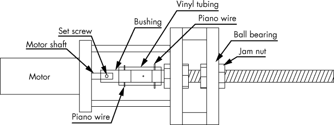

*图 4-9：该结构需要制作一个小盒子，用以固定通过轴承安装的传动轴，并通过锁紧螺母将其固定到位。电机安装在支架上，并与传动轴连接，手表篮将连接到传动轴的另一端*。

传动轴需要通过轴承进行安装，两者可以用锁紧螺母固定在一起。我选择了一个相当标准的 R4A-2RS 轴承，这是一个比较常见的部件，外径为 3/4 英寸，内径为 1/4 英寸，厚度为 9/16 英寸。我建议使用滚珠轴承，因为我购买的预制上链器仅使用了电机的铜套作为唯一的轴承，而这正是故障的原因。由于轴承的内径是 1/4 英寸，我决定使用标准的螺纹杆，规格为 1/4 英寸×20 tpi（每英寸转数）或 1/4 英寸×28 tpi，而不是尝试将 1/4 英寸的杆强行压入轴承中。

**注意**

*我使用锁紧螺母将杆固定到轴承上，因为它们比常规螺母更薄且外观不那么显眼，但你也可以使用标准螺母*。

### 构造

卷轴的制作提供了许多挑战，特别是处理亚克力材料——这是我在这个项目之前不熟悉的材料。虽然有一些困难需要克服，但通过反复试验，我学会了如何完成这项工作。图 4-10 展示了完成的手表卷轴侧面。

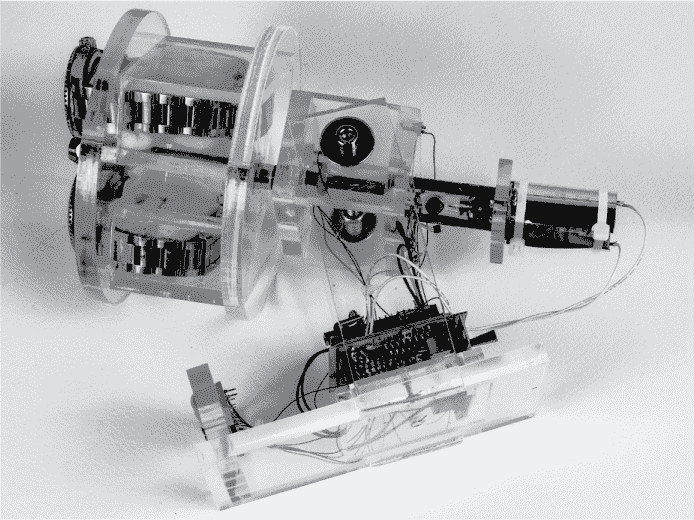

*图 4-10：完成的手表卷轴侧面，显示了底座制作、轴承盒、电机安装架和手表篮。*

最难的部分是切割亚克力和钻孔以安装球轴承。切割亚克力的方法有很多种，但没有一种特别容易。如果你选择一个能为你激光切割亚克力部件的供应商，这会容易很多。一些公司提供这种服务，价格略高于原材料成本。我之前提到过其中一个供应商，ZLazr。

如果你能使用圆锯，这将是最简单的 DIY 方法之一。否则，任何锯子都可以使用。我使用过钢锯，如果你耐心点，效果比大多数锯子要好。（如果操作太快，亚克力会过热并开始融化，导致锯子卡住。）我还知道一些人通过刻划并断裂亚克力板来成功切割。只需使用最适合你的方法即可。

请参阅 第 93 页的“亚克力”章节，了解制作轴承盒、手表篮和支架所需的亚克力形状。如果你还没有切割这些部件，请现在开始，并按照以下步骤制作这些部件。

#### *准备电机安装架和轴承盒的亚克力材料*

首先，打印出本章文件夹中的电机安装模板（见图 4-11），将其剪下，并使用中心线将其对齐到亚克力板上，用于电机安装。

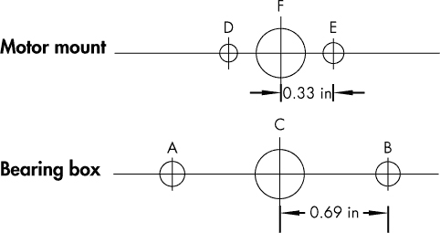

*图 4-11：电机安装架和轴承盒的模板。你可以在* [`www.nostarch.com/arduinoplayground/`](https://www.nostarch.com/arduinoplayground/) *下载模板。*

将模板贴到亚克力板上，使模板的中心线与亚克力板的中心对齐，并标记 A、B、D、E 和 F 孔的位置。标记孔的位置时，只需使用中心冲或钉子打出中心点。现在，开始钻孔；对于 A、B、D 和 E 孔使用 1/8 英寸的钻头，F 孔使用 3/8 英寸的钻头。

然后，将这块部件放在一旁，收集用于轴承盒的亚克力材料。最终的轴承盒将看起来像图 4-12 所示，等我们把所有部件装配在一起后。

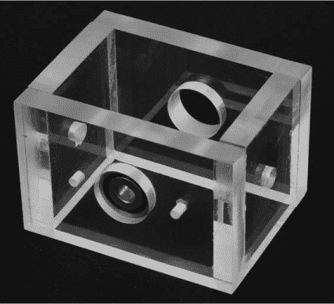

*图 4-12：完成的轴承盒，未经过最终修整和抛光。一个轴承暂时放置在位。*

使用轴承箱模板标记一个轴承安装件上的 A、B、C 孔的钻孔中心。C 孔是轴承孔，A 和 B 孔是用于电机安装支架的。用中心冲击工具打标记，并使用 2.5 毫米（或#39）的钻头钻孔，再用 M3-05 螺纹 tap 攻丝。这些孔将用于安装电机的支架。使用相同的模板仅在有机玻璃的另一侧标记轴承孔（C）。然后，拿起那两块不承载轴承的轴承箱有机玻璃，按对角线标出中心。用中心冲击工具打标记，钻 1/4 英寸的孔以便安装到支架上。

**警告**

*在钻任何尺寸的孔时，务必将工件牢牢夹住，如图 4-13 所示。不要手持工件。如果钻头或孔锯卡住了，有机玻璃可能会旋转。无论如何，请保持钻机转速较慢，并非常缓慢地将钻头推进到工作中。*

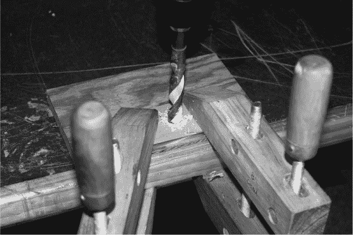

*图 4-13：在有机玻璃上钻大孔。请注意，有机玻璃已被牢牢固定住。*

我找到的最好的方法是先钻一个相对较小的孔——可能是 1/4 英寸或 3/8 英寸——然后用锥形扩孔器将孔扩大到最终尺寸（参见图 4-14）。这是迄今为止最安全、最简单的方法，也是我强烈推荐的做法。

当你用扩孔器扩大轴承孔时，确保从两侧都进行扩孔。这将导致孔的中心部分直径略小于外部部分。扩孔直到轴承紧密配合，然后，如果需要，你可以使用厌氧粘接剂填充孔边缘。

有机玻璃的最终准备阶段是打磨和整理。你最初切割有机玻璃的方法将决定需要多少整理工作才能将边缘处理好。如果是激光切割的，几乎不需要打磨。对于所有的整理工作，我使用了逐渐增大的砂纸，开始时用 220 目，逐步升到 1500 目——也就是说，220、320、400、600，最后是 1500 目。自动砂光机——如轨道式、带式、振动式等——往往太粗糙，如果不小心使用，会融化有机玻璃。如果使用，请先在废料上试验。打磨过程效果良好，尽管对于粗糙切割的部分需要额外的打磨。对于另一块工件的打磨也需要额外的工作，以确保两块工件拼合成矩形——如果是轴承箱的情况，则是拼成正方体。

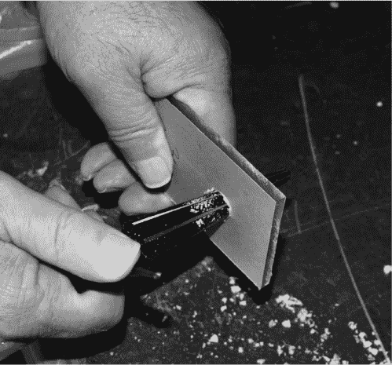

*图 4-14：使用锥形扩孔器将轴承孔扩大到最终尺寸*

使用液体抛光剂或珠宝师抛光膏进行最终抛光。确保在粘接之前，将抛光剂上的所有蜡都清除干净。尽量避免圆滑各部分的边缘，这样薄粘合剂（Weld-On 4）才会有效。你需要确保粘接面有足够的接触面积，以确保粘接牢固。

#### *轴承盒的丙烯酸粘接*

现在，是时候使用粘合剂将轴承盒的各个部件连接起来了。幸运的是，粘接丙烯酸板实际上比我预想的要容易一些。

在边缘平滑但没有过度圆角的地方，Weld-On 4 薄粘合液应该能很好地工作。它部分溶解丙烯酸并形成实际的焊接。最困难的部分是防止粘合液流到不该流的地方。如果你有较大的缝隙，或者边缘被圆滑化，可以尝试使用 Weld-On 16，它具有更高的粘度和透明丙烯酸填料，必要时用来填补缝隙和空隙。

在这两种情况下，你应该按照产品上的说明进行操作，但丙烯酸焊接的一般过程是这样的：首先将干燥的丙烯酸件夹紧，然后使用粘合剂随附的针头涂抹器，在每个接缝处涂上一层薄薄的丙烯酸水泥。毛细作用会将水泥吸入接缝处。对于表面稍微不平整的接缝，你可以将较厚的 Weld-On 16 涂抹在一面表面，然后将其与另一面连接。夹紧只需几分钟，但最终固化需要几个小时。

这个系统不需要太强的强度，但它在触碰时不应散架。对于节俭的人来说，像 Klean Strip 这样的油漆去除剂也可以很好地粘合丙烯酸。（Weld-On 中的粘合剂背后的化学物质是氯甲烷，这也是油漆去除剂的关键成分。）Klean Strip 的价格不到 Weld-On 的四分之一。

**注意**

*网上也有一些关于粘接丙烯酸的教程。如果有疑问，可以查阅其中的一个，并先用一些废料试验，之后再尝试在你辛苦制作的部件上操作*。

粘接完轴承盒后，如图 4-9 所示，粘接侧板到底部，然后检查对齐情况。将螺纹杆穿过轴承，并把止动螺母放好，但不要过度拧紧。确保轴承不会卡住。如果轴承没有很好地居中，可能会出现这种情况，但通常在你稍微拧紧止动螺母时，它们会自动对齐。如果对齐不正确，可能需要用扩孔器稍微调整孔位，并用一些丙烯酸水泥修补，但我从来没有遇到过这个问题。目前，先从轴承盒中取出传动轴。

#### *搭建支架*

底座是这个项目中最简单的部分。它包括两个侧支撑，尺寸为 1 1/2 × 5 × 1/4 英寸，以及底座，尺寸为 3/8 × 3 × 5 1/2 英寸。我还将光条（3 × 1 1/4 × 3/8 英寸）和屏蔽安装（2 1/2 × 2 1/2 × 3/8 英寸）包括在内（参见图 4-15）。

首先，在每个侧支撑的上方 1/2 英寸处钻 1/4 英寸的孔，左右居中。然后，将两个侧支撑与底座粘接，位置距底座边缘 1 1/2 英寸，背面朝外。接下来，钻光条上的 LED 孔。我使用了五个 LED（红色、蓝色、白色、黄色和绿色），每个大小为 10 毫米。你可以选择任何你喜欢的颜色组合。

最后，钻孔并安装屏蔽。要找到零件的中心，从角落到角落标记。然后，在中心处钻一个#43 的孔，并为 4-40 螺钉攻丝。在底座的后边缘 2 英寸处，钻一个对应的孔并居中。接着，使用屏蔽本身，或者从 ExpressPCB 打印图纸中提取的图纸，作为模板钻孔以安装三个固定螺钉。在设计电路板时，我没有留出足够的空间来放置第四个螺钉。但三个螺钉已经足够，因为电路板上没有任何机械应力。我使用了 2.5 毫米（#39）钻头，并为 M3-05 螺钉攻丝，立柱将适合这个螺钉。图 4-15 展示了零件的尺寸和部分组装好的底座，包括支撑、光条和屏蔽安装。

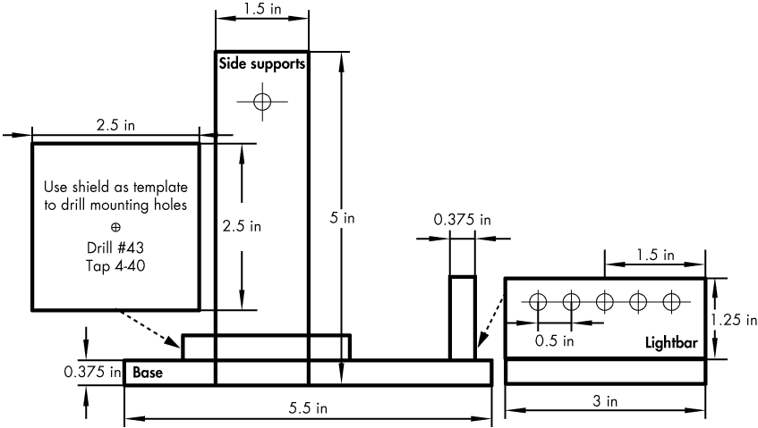

*图 4-15：表盘和灯条的组件及配置*

#### *准备电机和传动轴*

尽管我们尽力精确标记并钻孔，但仍然可能会出现电机与传动轴之间的错位问题，因此这个构建的目标是保持联轴器的灵活性。我的解决方案可能不会受到工业工程师们的推崇，但我使用了一段乙烯基管将电机和传动轴连接起来。这个联轴器已经使用超过一年，且没有出现任何磨损或问题。

一段 1 英寸长、壁厚的乙烯基管，外径 7/16 英寸，内径 3/16 英寸，应该能够胜任这个工作。

不过，它可能无法直接适配电机轴或 1/4 英寸的螺纹轴，稍微需要一些加工。（我把 Lowe’s 的销售员弄得快疯了，买了他们库存的每种尺寸六个。）我们只需将螺纹轴的直径减小，并为电机轴制作一个小的衬套。

##### 修剪螺纹轴

首先，修剪螺纹轴的直径。将手持电钻夹紧在台钳或平行夹具中，使用折叠的毛巾保护电钻不被损坏，并将螺纹轴放在通常钻头的位置（参见图 4-16）。然后，打开电钻，并使用锋利的锉刀修剪轴。

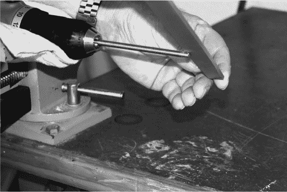

*图 4-16：减少螺纹轴的直径*

将轴直径缩小到略大于 3/16 英寸，这样就能紧密地配合塑料管，应该只需要一到两分钟。

##### 制作电机衬套

接下来，取一小段圆形金属料，大约 3/4 英寸长，直径为 3/8 到 1/2 英寸。（我使用了直径为 3/8 英寸的材料，因为它需要的工作量较少。）在端部钻一个 11/64 英寸（#21）的孔，深度大约为 3/8 英寸。衬套孔需要尽量靠近中心，所以你可能想先用中心冲打一个标记（参见图 4-17）。

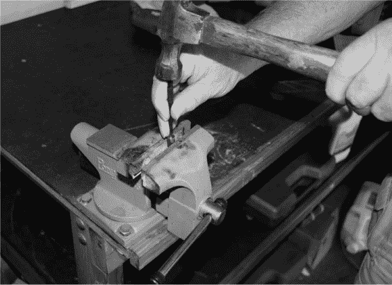

*图 4-17：将用作衬套的零件的轴夹在台钳或台钳夹具中，在钻孔之前先用中心冲打一个标记。尽量靠近中心。*

然后，像处理带螺纹的轴一样，将你切割的短料放入钻床中，使中心孔朝向钻床。将没有孔的一端打磨平整。将直径减少约 1/4 英寸，使其大致与传动轴打磨后的端部相等。

接下来，在衬套上钻一个 0.041 英寸的孔，距离衬套边缘大约 3/8 英寸。

同时，在传动轴上钻一个相应的孔。为了中心打孔并钻传动轴和衬套孔，先将端部打平，以便中心冲能找到一个支点（参见图 4-18）。这些孔将用于通过塑料管穿过钢琴线。

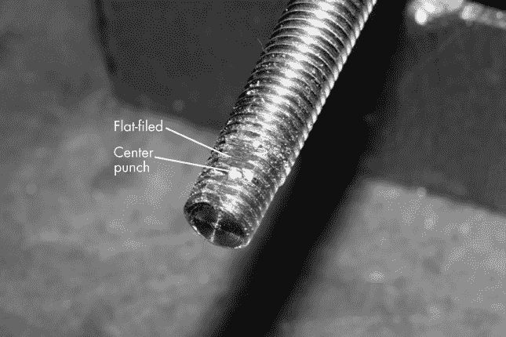

*图 4-18：钻螺纹杆和衬套上的孔最简单的方法是将轴端打磨平整并使用中心冲。*

最后，在衬套上钻一个 2.5 毫米（#39）孔，并在与电机轴孔垂直的方向上攻一个 M3-05 的螺纹孔。这将用来安装电机轴的锁紧螺钉。如果你愿意，也可以钻一个#43 的孔并攻一个 4-40 的锁紧螺钉。这个锁紧螺钉将把衬套固定在电机轴上，另外，在传动轴和电机衬套上分别钻的两个 0.041 英寸的孔，将通过钢琴线将塑料管固定到位。

##### 切割钢琴线销钉并完成电机组件

切割两段宽度为 0.039 英寸，长度为 1/2 到 5/8 英寸的钢琴线。这可能会稍微费点力气。我使用了 Dremel 工具上的砂轮切割片。使用固定在钻床上的小磨轮角可以在钢琴线上打出槽口。一旦在钢琴线上打出槽口，你就可以用手折断它。你也可以用任何磨刀石来刻划钢琴线，应该能轻松折断。

完成这些步骤后，剩下的组装过程应该会很容易。首先，将轴承安装到电动机上；在紧固前，在锁紧螺钉上滴上一些螺纹锁定液。然后，将乙烯基管的一端套在轴承上，并将钢琴丝穿过轴承上的 0.041 英寸孔。用一把小钳子（小型自锁钳效果很好）牢牢夹住钢琴丝的一端，将其穿过乙烯基，进入电动机轴承中的孔，并穿过另一侧的乙烯基。如果这变得困难，可以尝试用小火焰加热钢琴丝，之后它应该就能轻松穿过。图 4-19 显示了乙烯基管套在电动机轴承上。

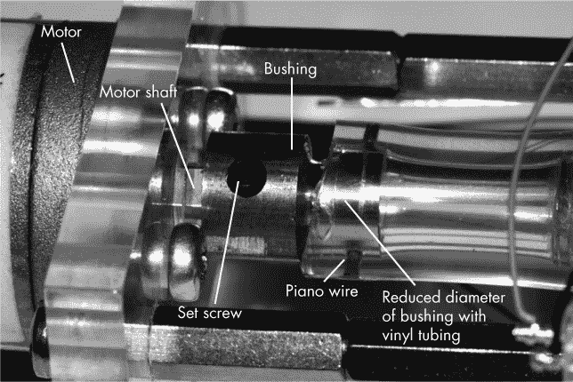

*图 4-19：电动机轴和轴承组成了传动装置的一半，另一半是经过减速的驱动轴，通过轴承并固定手表篮*。

使用 M3×3/8 英寸螺钉将电动机支架固定到电动机上。接下来，将电动机支撑柱拧入轴承笼中；请参见图 4-20 了解如何安装它们。然后，将电动机组件（即电动机、支架、轴承和乙烯基管）与轴承支撑柱对接，使用 M3-05×1/2 英寸螺钉将其固定到轴承笼上。

要在乙烯基上制作驱动轴的孔，只需将驱动轴安装到轴承箱中，不加卡紧螺母，将乙烯基管套上，然后按照前面部分所述安装钢琴丝销。如果你担心钢琴丝销会脱落，可以用线扎将其固定或用胶带覆盖它们。（我从未遇到过问题。）目前，先从驱动轴上取下钢琴丝销，并将驱动轴从轴承箱中取出，直到准备进行最终组装。

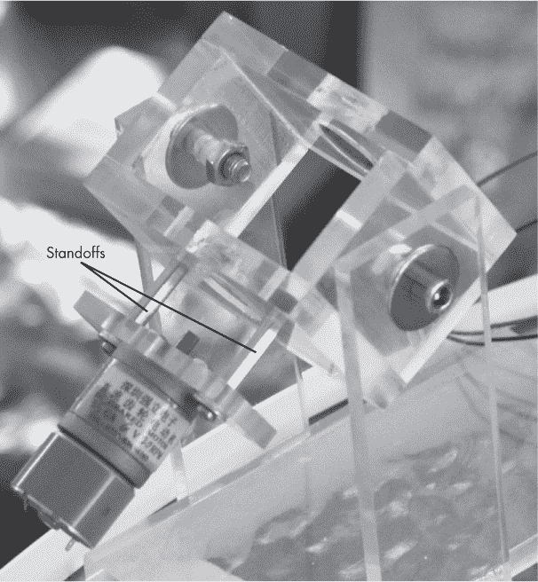

*图 4-20：电动机和电动机支架通过支撑柱与轴承箱连接。支撑柱拧入轴承箱，而电动机支架则用 3 毫米×1/2 英寸的螺钉和垫圈固定。轴承箱用 1 英寸长、1/4 英寸×28 的螺钉和螺母固定在支架上*。

#### *制作手表篮*

制作固定手表的部分有很多方法。我选择用丙烯酸材料制作我的手表篮。制作过程相对简单，但需要一些耐心。首先，取两个 5×3/8 英寸的丙烯酸圆盘，并在每个圆盘上仔细标记中心位置。然后，在每个圆盘的中心钻一个 1/4 英寸的孔。接下来，在将作为顶部圆盘的圆盘上，标出图 4-21（左侧）所示的矩形区域。

如果你还没有做，按照我在“零件清单”中描述的方式，切割用于手表盒的矩形亚克力件，并按照“粘合轴承盒的亚克力”中的说明在第 93 页组装它们。（在我制作的大多数样品中，我使用了 1/4 英寸的亚克力；不过，3/8 英寸的亚克力也能很好使用。）然后，小心地在圆盘上标出开口的位置（见图 4-21）。现在，将手表篮子粘合到一个圆盘上，如图 4-22 所示。接着，切割开口，使其与手表篮子的内部对齐。

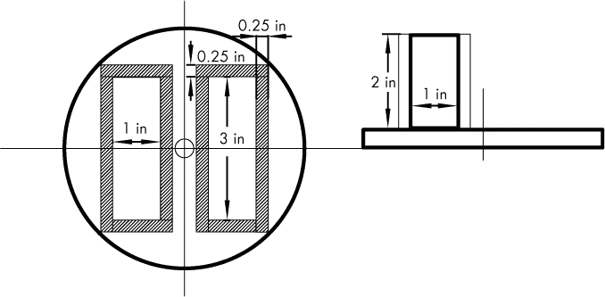

*图 4-21：为手表托篮切割尺寸。该图案可以作为 PDF 文件从* [`www.nostarch.com/arduinoplayground/`](http://www.nostarch.com/arduinoplayground/) *下载*。

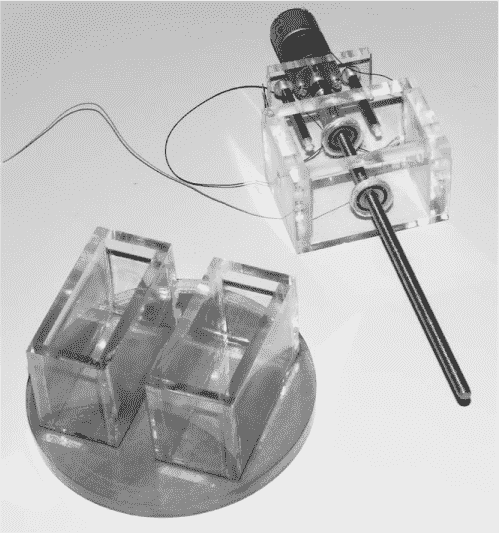

*图 4-22：手表托篮安装在亚克力圆盘上的样子。它们上方是完全组装好的电机、轴承盒和传动轴*。

切割矩形块最简单的方法是在角落钻孔，注意不要钻到手表篮子里，然后使用钥匙孔锯或弯锯（或者，如果你小心的话，也可以使用弯曲锯）来切割开口。这些开口只需在一个圆盘上切割，这将是顶部。你可以用锉刀或砂纸稍微清理切口的边缘，但不要花太多时间，因为安装手表和垫圈后，这些边缘并不会显得很明显。

最后，将篮子安装到传动轴上。首先，将两个螺母拧到传动轴上，并将它们锁紧——也就是将一个螺母拧紧到另一个螺母上。然后，加入一个垫圈，接着是篮子的底盘、上部组件和手表篮子、一个垫圈，最后是顶部的螺母。如果你愿意，可以去五金店找一个装饰性的螺母来完成这个项目。

**注意**

*如果按照我描述的方式使用锁紧螺母并将篮子紧固，则不需要粘合底部圆盘。我没有将盒子粘合到底圆盘上，这也没有造成任何问题*。

到了这个阶段，你可以使用两个装饰性的 1/4 英寸 × 28 螺栓和螺母将完成的组件安装到支架上。你也可以用亚克力水泥将灯条粘合到底座上，并钻孔安装盾牌安装板。

#### *添加 LED*

你差不多完成了。将 LED 灯安置在亚克力上，放置的位置可以随你喜欢，并将其接线到盾牌上。你可以在图 4-1 中看到我放置的位置。（亚克力传导光线的方式能产生一些很酷的效果。）你可能想要钻一些盲孔来安装 LED。只需钻一个 LED 直径大小的孔，但不要完全穿透亚克力。如果你小心的话，可能会做得很整洁，连线几乎看不见。

由于 LED 对自动上链器的最终外观至关重要，因此它们的安装和位置是成品的重要组成部分。钻孔以安装 LED 可能有点棘手，因为如果你购买了不同种类的 LED，它们的直径可能会稍有不同。作为起点，尝试为 5 毫米 LED 钻 3/16 英寸的孔，为 10 毫米 LED 钻 25/64 英寸的孔。我发现获取正确尺寸的最佳方法是在废料上钻一个样品孔，并在钻进成品之前进行试验。如果孔稍微小了一点，使用倒角扩孔器稍作修整应该能解决问题。如果孔稍微大了一点，可以尝试用丙烯酸水泥（如 Weld-On 16）填补。

如果你有一些线包线和线包工具，你可以使用线包技术将 LED 与屏蔽罩连接，而不是焊接。这样可以保持 LED 背部的连接整洁，而且由于线材直径较小，连接相对不显眼。它还允许你将电线靠近 LED 连接，如图 4-23 所示。如果你进行了焊接，可能会有过热 LED 连接点的风险。

使用线包或焊接将 LED 的引脚连接到屏蔽罩上。我在屏蔽罩上焊接了一个插座，这样就可以轻松地将 LED 的引脚直接线包或焊接到屏蔽罩上。你确实需要将电机的引脚焊接到屏蔽罩的另一端，但这应该不是问题。

霍尔效应传感器的电线可以焊接到屏蔽罩和传感器的引脚上。测量电线的长度，使其适合你计划安装霍尔效应传感器的位置。你可以使用连接器，但我们保持简单。传感器本身和磁铁通过双面泡沫胶带机械安装。

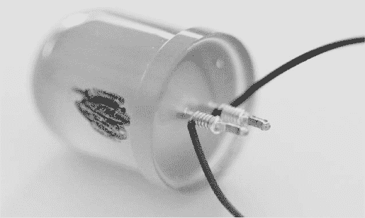

*图 4-23：LED 上的线包线。这些电线非常细（30 号线）且绝缘层薄，因此不显眼。使用小型线缆扎带可以整理电线。我建议提前标记 LED 的正极端子，像我在这里做的那样，之后可以擦掉*。

#### *展示组件*

那么，屏蔽罩和纳米板该怎么办呢？本项目的主题一直是透明性，因此我建议让所有东西都暴露出来：将裸板直接安装在支架上，背面放置开关和电源插座（见图 4-24）。

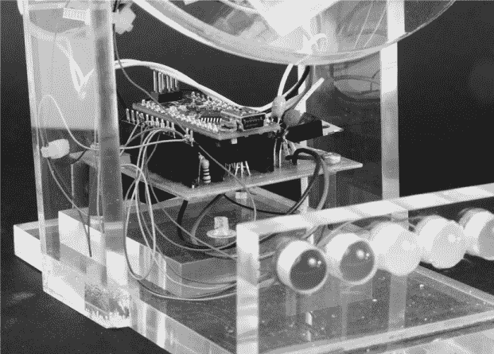

*图 4-24：完成的自动上链器上安装的纳米板和屏蔽罩。屏蔽罩上仅使用了三个支架*。

我将电子元件直接放置在轴承盒下方，位于支撑整个组件的立柱之间。然后，我将电路板安装在一块单独的丙烯酸板上，该板通过 4-40 平头螺钉固定在基座上。

#### *将手表保持在篮子里*

为了固定手表在手表篮里，我简单地剪了一块细致的泡沫海绵，效果很好。如果你想要比海绵更有格调一点的东西，你可以缝制一些小枕头，把手表带缠绕在上面。我没有缝纫能力，所以我就选择了海绵。

**注意**

*开放框架总体上效果不错，但可能会积灰。如果你比较讲究，你可以用 3/16 英寸厚的亚克力板制作一个盒子来覆盖整个上链器。或者你也可以像我一样买一罐除尘喷雾。有些人还建议我，可以将整个上链器安装在一块硬木上，比如胡桃木或其他装饰性硬木，以增加一点点完美的收尾效果*。

### 设计说明

现在你已经看到我如何制作手表上链器了，我将带你走过一些关键的设计决策，可能有些你会选择不同的方式来做。

#### *总旋转调整*

通过不修改草图，可能会改变手表上链器的总转数，尽管我选择不这样做。

你可以使用电位器来创建一个可变电压，并将其输入到 Arduino 的一个模拟输入端口。然后，你可以用这个值替代草图中某个延迟的值，以改变每日的转数。以下是如何安装电位器以及你需要对草图做的修改。

##### 硬件更改

将电位器的上端和下端接到系统的正负电源轨上。为了这个目的，扩展板上已经提供了焊接点。你不需要使用全尺寸的电位器；一个小型的可调电位器（10 圈最好）就足够了，并且能节省很多空间。将电位器的中间引脚（在扩展板上）连接到 Nano 的一个模拟引脚。由于霍尔效应开关使用的是 A0 引脚，我建议使用模拟输入 A1。扩展板上已提供焊接点。

##### 软件更改

在草图中，你需要做几个操作。首先，告诉 Nano 输入 A1 正在使用。在草图顶部添加如下代码：

```
const int revSet = A1;
```

然后，再稍微往下，识别电位器设置的值，如下所示：

```
int revNumber = 0;
```

`revSet`是我给输入 A1 取的任意名称，`revNumber`是我给草图中替代延迟的数字取的任意名称。

电位器将输出从 0 到 5 伏的值。由于模拟输入 A1 连接到一个 10 位的 ADC，它将生成 0 到 1,023 之间的 1,024 个数字值。在其他应用中，通常需要将这 1,024 个值映射到其他一组值。然而，在这个特定情况下，最简单的做法是直接使用这些值。

在草图文件中，移动到`void loop() {`之后的那一行，并将 A1 的值赋给`revNumber`，如下所示：

```
revNumber = analogRead(revSet);
```

回到我们定义草图中某些延迟的地方。修改

```
int timer = 500;
```

到

```
int timer = 0;
```

最后，回到你输入`revNumber = analogRead(revSet);`的地方，在那之后输入如下内容：

```
timer == revNumber;
```

现在，每次草图调用定时器值时，`revNumber` 值应该自动使用，这会带来延迟的广泛变化。最终的变化范围从每天 200 次到 1,200 次不等。

#### *使用多少个 LED 和放置位置*

我最初设想 Watch Winder 只有两个 LED 来指示旋转方向。第一版使用了连接到 Nano 的电机方向引脚 D12 和 D13 的 LED（见 图 4-2）。一个引脚在旋转一个方向时保持亮起，反之亦然。红色和绿色的 LED 用来指示绕发器的旋转方向，就像船上的跑道灯一样。

但这还是很无聊，而且还有那么多引脚没做任何事。此外，如果你邀请朋友来看你的绕发器，它会大部分时间什么都不做——你的朋友也是。所以我决定为这个项目增加一些装饰性的 LED。我还决定通过让草图提供一些动画来增加更多的变化，要求手表转动不同的次数——有时转动较少，但更频繁。我甚至加入了一个“乒乓效果”。

由于负责艺术事务的大脑半球显然没有得到很好的发展，我将 LED 的放置位置留给你自己。在 图 4-1 中，轴承盒里有四个 LED，灯条中有五个 LED，但你可以把它们放在任何地方。

我随意选择了九个 LED 通道，在某些情况下，我为每个通道使用了两个 LED。我为电机的每个方向都用了两个 LED——D12 和 D13 这两个通道既驱动 LED，也驱动电机。D2 和 D13 各自为两个 LED 供电。D4 到 D10 为其他 LED 供电，包括位于手表篮子后面的两个 LED——D9 和 D10，每个都有两个 LED——以及位于灯条前面的五个 LED——D4–D8。D11 保留给你未来可能想要添加的开发。

#### *电机电压*

一位 Watch Winder 的测试员在使用 5V 电源驱动 6V 电机时遇到困难。投诉是扭矩不足。如果你遇到这个问题，解决方法是将 H-桥的第二个电源（VCC[2]）直接连接到 9V 电源。为此，你需要切断连接到第 8 引脚的线路，或者移除该引脚并将其单独焊接到 9V 电源上。由于电机是间歇性运行的，烧坏电机的风险很小。虽然这不是一个优雅的解决方案，但它确实有效。顺便提一下，在大约 20 个不同的电机中，只有这个电机出现了该问题。而且正如之前所提到的，电机在较高电压下的更高速度对转动次数几乎没有影响。

#### *手表自动绕发器转动多少次？*

如果你真的需要知道手表上链器的旋转次数，这里有一个解决方案。内部计数器用于排列草图，但并不准确反映电机的总旋转次数。虽然我们本可以在内部计数旋转次数，但那样需要额外的显示装置或将其连接到串行监视器。但如果你需要保持计数，可以添加一个小型外部计数器。因为你只会在更改旋转次数时偶尔需要它，所以你可以在需要时插入它——保护板中已有预留——不需要时可以将其保存起来用于其他项目。图 4-25 中的外部计数器是自供电的，价格不到$8。有关详细信息，请参见“零件清单”和第 93 页。

外部计数器并非必须，但它可能是一个不错的配件，可以在此项目及其他项目中使用。它未包含在设计中，因为它只在偶尔使用时需要插入。我在保护板上使用了一个双引脚母头——连接端口标记为*GND*和*X-ctr*，并为计数器的连接线配备了一个双引脚插头。计数连接从地线接到计数器的引脚 4，再从霍尔效应传感器接到引脚 1。你可以为计数器添加一个复位按钮，将其从地线接到引脚 3。计数器来自制造商，附带的信息很少，因此图 4-25 显示了计数器背面的视图，复位按钮位于右侧。


*图 4-25：增加复位按钮的外部硬件计数器*

即使这个手表上链器不能保持我的手表上链，我认为它依然会是一个很棒的雕塑。当你完成这个项目后，也许你的下一个 Arduino 项目将正是这样：一个充满动感、闪烁和运动的艺术作品。
