## 第六章：**Garage Sentry 停车助手**


这个项目是一个可靠的电子设备，用于测量你需要将车开进车库的距离。如果你停车在车库里，可能会遇到这个问题：你应该把车开到车库多远，才能确保前面有足够的空间放置物品，后面又有足够的空间让车库门关上？有些人会在天花板上悬挂一个网球，并在网球接触到挡风玻璃时停车。这种方法有效，但网球的安装和调整很麻烦，且如果你想将车库用于除停车外的其他用途时，网球常常会妨碍你。

Arduino 提供了更好的解决方案。这个 Garage Sentry 项目是经典的“网球挂绳”装置的电子版，只是做得更好。Garage Sentry 准确地检测你的车是否到达车库的正确位置，并触发一个警报，闪烁的灯光提示你何时踩刹车。

此外，在本章末尾，我将展示如何将基本的 Garage Sentry 改造为豪华版，当你接近完美停车位置时，它会发出警报。

**Garage Sentry 背后的灵感**

这个项目来源于我玩 *超声波收发模块* 的经验，该设备发出声波并在声波到达物体后被反射回来，模块接收到反射波。模块的输出使得微控制器能够测量声波的往返时间，进而根据已知的声速来计算距离。为了测试超声波收发器的灵敏度和极限，我使用了在车库中的电池供电面包板版本，那里有足够的空间可以测试不同的距离。事实证明，汽车是超声波能量的极好反射体。通过这些实验，我受到了启发，将测试设备转化为 Garage Sentry。

### 必需工具

这个项目不需要太多工具或材料，但无论是标准版还是豪华版，你都需要以下工具：

配备 3/8 英寸或 1/2 英寸夹头的电钻（可由电池驱动，或通过 110/220V 电源）

用于电位器（9/32 英寸）、电源输入（1/4 英寸）和 LED（3/8 英寸）的钻头

焊接铁和焊锡

锥形扩孔器套件

十字螺丝刀和一字螺丝刀

钳子（我推荐使用尖嘴钳。）

（可选）1/4 英寸螺纹 tapping

### 零件清单

你将需要以下零件来构建基本版 Garage Sentry：

一块 Arduino Nano（或克隆版）

一只 HC-SR04 超声波传感器

两个高强度 LED（>12,000 MCD）

两个 270 欧姆、1/4 W（或更多）电阻（用于限制 LED 的电流）

一只 20 欧姆、1/8 W 的电位器

两个额定集电极电流至少为 1.5 A 的 NPN 信号晶体管（我使用了 ZTX649 晶体管。）

一个外壳（我推荐使用蓝色的 Hammond 1591 ATBU，透明的 1591 ATCL，或类似的外壳。）

（可选）一条 0.80 英寸的铝条用于安装支架

（可选）两颗 1/4 英寸×20 英寸×3/4 英寸的螺栓和螺母

一块大约 1×1 英寸的打孔板（可以在一侧包含铜箔环）

一个 3.5 mm 插孔

两颗 2-56×3/8 英寸螺丝和螺母

两颗额外的 2-56 螺母，用作垫片

一个 9V、100 mA 插头式墙壁适配器电源（任何 7.5V 至 12V DC，100 mA 或更大都应能正常工作）

一段大约 3 英寸长的双面泡沫胶带

一个 LM78L05（TO-92 封装）调节器（仅适用于面包板版）

28 或 30 号连接线

（可选）线包工具和线材

因为基础版不需要太多额外组件，我建议在标准打孔电路板上构建电路，而不是使用扩展板。为了为电路供电，您可以使用一个 9V、100 mA 的墙壁适配器，通过 3.5 mm 插孔连接（参见图 5-1）。您应该不需要开关。

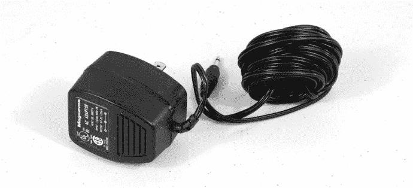

*图 5-1：我使用的是 Magnavox 的交流适配器，但任何类似的 7.5V 至 12V 的直流输出电源都可以使用。这些电源在网上很容易买到，价格从不到 1 美元到大约 3 美元不等*。

请确保使用两颗明亮的 LED，即使在汽车前灯开启时也能清晰可见。亮度较高的 LED 范围从 10,000 MCD（毫坎德拉）到超过 200,000 MCD。亮度越高越好；不过要记住，亮度更高的 LED 需要更多的电力，因此限流电阻器需要有更高的功率额定值来配合更亮的灯。使用 270 欧姆的限流电阻器，在 5V 时，我使用的 12,000 MCD 的 LED 电流消耗大约是 30-40 mA。（功率等于电压乘以电流，或者*P* = *VI*，所以在 40 mA 和 5V 的情况下，功率就是 0.20 W。）即使您可以用更小的功率值（如 1/4 W）轻松应对，因为 LED 仅间歇性亮起，还是最好使用 1/2 W 或更大功率的电阻器。

### 豪华版配件

除了基础版车库守卫的组件外，如果您想要构建豪华版，还需要以下额外组件：

两颗高亮度绿色 LED

两颗高亮度琥珀色 LED

两颗额外的 270 欧姆、1/4 W 电阻器

两个额外的 NPN 信号晶体管，一个 Hammond 1591 BTCL 外壳（替代 1591 ATCL）

一块 PCB（扩展板）

### 下载

**程序文件**    *GarageSentry.ino* 和 *GarageSentryDeluxe.ino*

**钻孔模板**    *Transducer.pdf*

**机械图**    *Handle.pdf*

**豪华车库守卫的扩展板文件**    *GarageSentryDeluxe.pcb*

### 原理图

图 5-2 显示了车库守卫的原理图。R1 和 R3 是 LED 的 270 欧姆电阻器，应该是 1/4 W 或更大功率。如果没有更大功率的电阻器，可以将几个电阻器并联使用来达到所需的功率。首先，使用公式找出正确的电阻值：

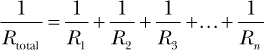

你还可以使用自动计算器，例如 *[`www.1728.org/resistrs.htm`](http://www.1728.org/resistrs.htm)*，这比自己做数学计算要容易得多。

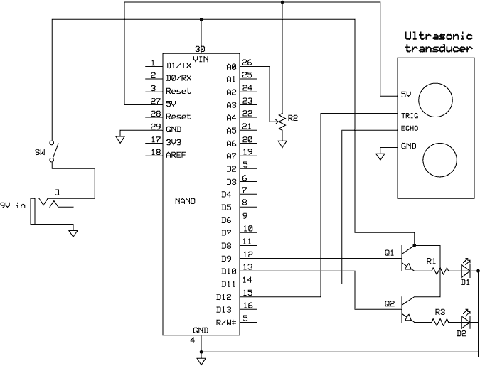

*图 5-2：车库哨兵的示意图*

为了避免额外的计算，选择相同值的电阻器。这样，相同数量的电流会通过每个电阻器。例如，两个 1/8 W 的电阻并联将得到 1/4 W 的值。

如果你使用不同值的电阻器，你将不得不计算每个电阻器通过的电流以及总的功耗。

这个原理图还为你定制报警提供了空间。虽然该版本的项目使用 LED 来创建视觉报警，但只需稍作修改，你也可以轻松创建可听到的报警。只需将红色或蓝色 LED 替换为可听设备，例如 Sonotone Sonalert，报警就会响起。要替换 LED，你需要将 Sonalert 连接到该 LED 的两端；只需确保极性正确。或者，你可以保留两个 LED 并为第三个警告添加可听设备。

**注意**

*在这个项目中，Nano 利用了其板载电压调节器，这就是为什么原理图中没有外部调节器的原因*。

### 计算距离的基础

这个项目测量声音从起点发出、反射回物体并重新传回起点所需的时间，并利用该时间计算物体与传感器之间的距离。

基本的距离计算与通过计算闪电和雷声之间的秒数来确定暴风雨的距离差不多。每一秒钟代表 1,125 英尺的距离，约合 0.2 英里。由于声音在海平面上的传播速度为每秒 1,125 英尺，如果闪电和雷声之间有五秒钟的延迟，你可以确定暴风雨大约离你 1 英里远。在车库哨兵的情况下，一旦你知道声音来回所需的时间，并知道声音的传播速度，你可以根据时间-速度-距离公式计算出距离：

距离 = 速度 × 时间

### 车库哨兵的工作原理

这个项目利用了*超声波*，它与雷声不同，超出了大多数人的听力范围。如果你的听力很好，你可以检测到约 30 Hz 到接近 20 kHz 之间的声音，尽管听力在超过 10 kHz 或 15 kHz 后会迅速衰退。

**注意**

*作为参考，钢琴上的中央 C 是 261.6 Hz。幼儿（以及大多数狗）通常能够听到高频声音，但随着年龄的增长，听力，特别是高频部分，会迅速下降*。

本项目中使用的超声波收发模块以大约 25 kHz 的频率发出脉冲，并通过麦克风监听回声。如果信号碰到物体反射回波，系统会接收返回的回声，并告知微控制器已接收到信号，并进行距离计算。对于 Garage Sentry，该模块被放置在车库前方，信号会发射并反射到汽车的前部——如果你是倒车，则是反射到后部。为了计算汽车距离超声波收发器的距离，Arduino 会测量信号从收发器到目标并返回的往返时间。例如，如果 Arduino 测得时间为 10 毫秒（0.010 秒），你可以这样计算距离：

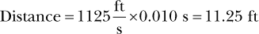

啊，但别急。记住，信号是先到达汽车再返回到麦克风的。为了获得正确的车辆距离，我们需要将测得的时间除以二。如果控制器测得 10 毫秒，那么到汽车的距离就是：

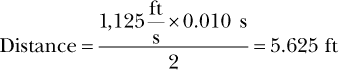

HC-SR04 超声波模块在 Arduino 的指令下发送信号（见 图 5-3）。然后，草图指示发射器关闭，麦克风监听回声。

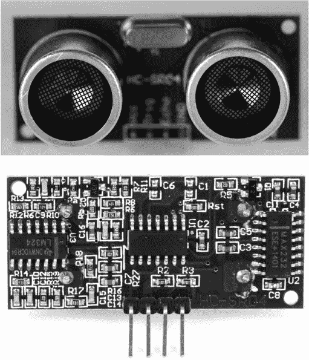

*图 5-3：超声波传感器模块。模块的背面（底部）有连接端子*。

如果有物体让信号反射，麦克风就会接收到反射的信号。Arduino 记录信号发送和接收的准确时间，然后计算延迟。

HC-SR04 模块不仅仅是一个扬声器和麦克风。该模块包含换能器——扬声器和麦克风——以及大量电子元件，包括至少三个集成电路、一个晶体和若干个无源元件。这些元件简化了其与 Arduino 的接口：25 kHz 的音调实际上是由模块生成，并通过微控制器打开和关闭。一些组件还增强了接收器或麦克风的灵敏度，使其具有更好的探测范围。

HC-SR04 超声波换能器的范围大约是 10 到 12 英尺。返回的信号总是比发送的信号要弱，因为一些声波能量在空气中散失（见 图 5-4 中的虚线）。

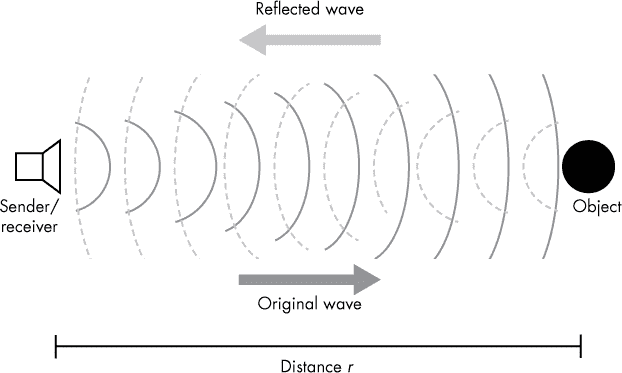

*图 5-4：在本项目中，声音从发射器传出，碰到物体后反射并被接收*。

计算发射器与物体之间的距离并不困难。你只需要拿到信号返回所需的微秒数，除以声音在 1 英寸中传播所需的 73.746 微秒，然后再除以 2，因为信号是先出去再返回的。这个完整的计算方法将在“确定距离”一节的第 141 页中详细介绍。

这个草图提供了一个以英寸或厘米为单位的响应，具体取决于你的偏好。我们将使用英寸来设置报警的距离，但转换为厘米只需要重新映射模拟输入，并略微调整数字。这个草图还会为你执行基本的算术运算，以确定厘米的测量值。

在高层概述之后，让我们深入了解如何接线 Garage Sentry。

### 面包板

整个 Garage Sentry 可以放在一个小型面包板上，你可以将它搭建好，进行编程，用电池供电，并四处走动进行测试。随着你玩这个项目，我相信会想到超声波技术的其他应用。

我组装的面包板，如图 5-5 所示，使用了 9V 电池供电。通常，你可以将电池直接接到 Nano 的 VIN 引脚，并使用 Nano 内置的电压调节器。但在第一次编程和测试时，你将通过 USB 电缆为 Nano 供电，所以在面包板上，你需要为 Nano 和超声波模块分别设置 5V 的正负轨。为了避免损坏 Nano 或模块，并避免使电路过于复杂，我加入了一个单芯片外部电压调节器（LM78L05），使整个面包板都能稳定在 5V 电压下工作。请查看图 5-6，看看它是如何接线的。

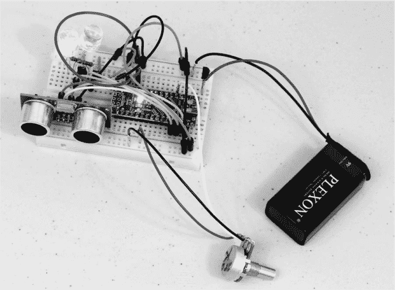

*图 5-5：这是已经接线的面包板。我使用了一块 9V 电池，这样可以在不同环境下进行实验。由于相机曝光时间的长度，两颗 LED 都显得亮着。*

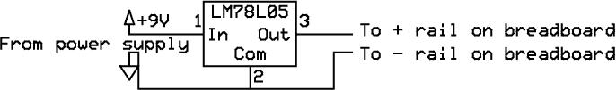

*图 5-6：这是 LM78L05 TO-92 电压调节器在面包板上的接线方式。旁路/滤波电容器不是必需的。*

下面是接线面包板的详细步骤列表：

1.  首先，将超声波模块放置在面包板的下端，面向外侧，然后将 Nano 插入面包板，确保其上方留出四行连接。

1.  确保左侧和右侧的正负轨（红色和蓝色条纹）连接正确——红接红，蓝接蓝。如果将红色连接到蓝色，将会导致严重的问题。

1.  将红色正轨连接到 5V 电源（Nano 的引脚 27，标记为*5V*）。如果你通过 USB 连接供电，这一步是必要的。

1.  将 Nano 的引脚 4（标记为*GND*）连接到面包板的蓝色负轨。

1.  将 HC-SR04 传感器的 VCC 引脚连接到红色正轨。

1.  将 HC-SR04 传感器的 GND 引脚连接到蓝色负电源轨。

1.  将 HC-SR04 传感器的 TRIG 引脚连接到 Nano 的第 15 号引脚（D12）。

1.  将 HC-SR04 传感器的 ECHO 引脚连接到 Nano 的第 14 号引脚（D11）。

1.  将两只 ZTX649 晶体管插入面包板中。选择一个区域，使每只晶体管的三个引脚都有自己的行。

1.  将 Nano 的第 12 号引脚（D9）连接到晶体管 Q1 的基极。

1.  将 Nano 的第 13 号引脚（D10）连接到晶体管 Q2 的基极。

1.  将两个晶体管的集电极连接到红色正电源轨。

1.  将晶体管 Q1 的发射极连接到一个 270 欧姆电阻的一端。

1.  将连接到晶体管 Q1 发射极的 270 欧姆电阻的另一端连接到面包板上的一个空白行。

1.  将晶体管 Q2 的发射极连接到另一个 270 欧姆电阻的一端。将连接到晶体管 Q2 发射极的 270 欧姆电阻的另一端连接到面包板上的另一个空白行。

1.  将 LED（D1）的+（长端）连接到 270 欧姆电阻，并将另一端连接到蓝色负电源轨。

1.  将 LED（D2）的+（长端）连接到第二个 270 欧姆电阻，并将另一端连接到蓝色负电源轨。

1.  将一个 20 欧姆电位器的一端连接到红色正电源轨。

1.  将电位器的另一端连接到蓝色负电源轨。

1.  将电位器的滑动端（中间引脚）连接到 Nano 的模拟引脚 A0（26）。

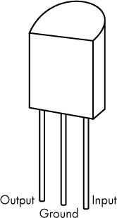

*图 5-7：78L05 稳压器的引脚图*

你应该准备好开始了！如果使用交流电连接，只需将其连接到 Nano 的 VCC 引脚。

要添加电池连接，需将 78L05 的中心引脚连接到地（负电源轨），输入端连接到电池的正极，输出端连接到正电源轨（参见图 5-7）。将电池的负极连接到负电源轨。

### 草图

一旦面包板完成，草图可以加载到 Nano 上。下载*GarageSentry.ino*文件，地址为*[`www.nostarch.com/arduinoplayground/`](https://www.nostarch.com/arduinoplayground/)*。要将文件加载到 Nano 上，按照“上传草图到你的 Arduino”中的说明操作，详见第 5 页。记得选择正确的板类型。加载完成后，设备即可进行实验。

Garage Sentry 的草图有多个功能。它告诉超声波传感器生成一个波，并检测回波返回的时间。然后，基于该时间计算距离，并在必要时通过点亮 LED 发出停止警报。以下是完整的草图；接下来我会详细讲解。

```

      /* Garage Sentry  
      */  

      int ledPin = 10;  
      int ledPin1 = 9;  
      int count;  
      int analogPin = A0;  
      int val;  
      int y;  

      void setup() {  
        Serial.begin(9600);  
        pinMode(ledPin, OUTPUT);  
        pinMode(ledPin1, OUTPUT);  
        pinMode(analogPin, INPUT);  
      }  

      void loop() {  
        val = analogRead(analogPin);  
        long duration, inches, cm;  
        //Give a short LOW pulse beforehand to ensure a clean HIGH pulse:  
➊   pinMode(12, OUTPUT);  //Attach pin 12 to TRIG  
        digitalWrite(12, LOW);  
        delayMicroseconds(2);  
        digitalWrite(12, HIGH);  
        delayMicroseconds(5);  
        digitalWrite(12, LOW);  

        pinMode(11, INPUT);  //Pin 11 to receive ECHO  
        duration = pulseIn(11, HIGH);  

        //Convert the time into a distance  
        inches = microsecondsToInches(duration);  
        cm = microsecondsToCentimeters(duration);  
        val = map(val, 0, 1023, 0, 100);  
        if(inches == 0)  
          digitalWrite(ledPin, LOW);  

        if(count == 0  inches > 0  inches < val) {  
➋      for(y = 0; y < 200; y++)  
         {  
           digitalWrite(ledPin, HIGH);  
           digitalWrite(ledPin1, LOW);  
           delay(100);  
           digitalWrite(ledPin, LOW);  
           digitalWrite(ledPin1, HIGH);  
           delay(100);  
         }  

        count = count + 1;    
      }    

      digitalWrite(ledPin1, LOW);    
      if(inches > 10) {    
        //delay(1000);    
        count = 0;    
      }    
      Serial.print(inches);    
      Serial.print("   inches ");    
      Serial.print(count);    
      Serial.print(" count   ");    
      Serial.println();    
      Serial.print(" Val       ");    
      Serial.println (val);    
      delay(100);    
  }    
  long microsecondsToInches(long microseconds) {    
    return microseconds / 74 / 2;    
  }    
  long microsecondsToCentimeters(long microseconds) {    
    return microseconds / 29 / 2;    
  }
```

首先，我们定义几个变量，设置参数，并加载库（如果有的话）。在此情况下，定义`ledPin`和`ledPin1`，它们将作为警报。其他定义（`int`）包括`cm`和`count`（一个将在内部使用的变量）、`analogPin`（作为 A0）、`val`（用于存储限制信息）和`y`（用于循环中）。

#### *在 setup() 函数内部*

接下来是 `setup()` 函数。在这里，你设置你可能需要使用的 Arduino 特性；这个草图包括串口监视器，尽管你可能在最终产品中不需要它，但它在调试代码时通常非常有用，尤其是当你想修改代码时。这个草图将监视器的速率设置为 9600 波特，这是许多应用程序中的标准设置。它还定义了你将使用的引脚模式，设定为输入或输出。你可以在代码中的几乎任何位置设置 `pinMode` 的值，包括在 setup 之前或其中；它们也常常在主循环中定义，特别是当这些定义预期会发生变化时。

#### *在 loop() 函数内部*

`loop()` 函数是所有操作真正发生的地方。循环会不断执行，除非被命令延迟或暂停。所以即使看起来什么也没发生，控制器也会不断循环执行代码。在这个应用程序中，控制器在循环中的第一项任务是设置变量 `val` 来存储来自连接到模拟引脚（`analogPin`）的电位计输入。

为了启动超声模块的发送/接收功能，草图首先会调用低信号发送给发射器（`TRIG`），清除模块以确保接下来的高信号是干净的。你可以在从 ➊ 开始的几行代码中看到这一点。

接下来，会有一个延迟，让系统稳定下来，然后草图会向传输引脚写入高电平，命令发射器发送超声波信号。紧接着是另一个延迟，然后草图将数字引脚 12 设置为低电平，关闭发射器，并通过调用 `pulseIn()` 方法激活接收器。

#### *确定距离*

如果没有回声——也就是说，如果 `inches == 0` 或者英寸接近无穷大——控制器会继续运行代码，直到它到达结束位置，然后从头开始。如果检测到回声，微秒数（`duration`）会从发射器开启到接收到信号的时间，这个值会转换成英寸和厘米。这给了我们一个测量值，表示收发器距离物体的距离。请注意，在整个解释过程中，我将使用英寸单位，但你也可以使用厘米单位来理解。

`microsecondsToInches()` 和 `microsecondsToCentimeters()` 命令根据“车库哨兵工作原理”一节的算式，将时间测量值分别转换为英寸和厘米，详见 第 134 页。使用 `long` 数据类型，而不是 `int`，是因为 `long` 提供 4 字节的数据存储，而不是仅有的 2 字节，并且微秒数可能会超过 2 字节的限制 32,767 位。到目前为止，一切顺利。

在常规公式中，距离的计算看起来是这样的：

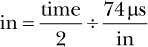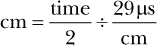

在任一情况下，我们首先除以 2，因为信号从换能器传到目标再返回，正如之前所讨论的那样。在英寸函数中，我们将折半后的微秒数除以 74，在厘米函数中，我们除以 29。（信号传播 1 英寸需要 74 微秒，传播 1 厘米需要 29 微秒；我通过遵循“时间与距离转换系数”中的算式得出了这些数字，详见第 142 页）

**时间与距离转换系数**

你可以直接相信我的数学计算并复制时间到距离的转换代码，但你也可以将这段算式应用到任何使用类似超声模块或其他传感器的项目中，因此我鼓励你自己计算一下。

如我在“车库监控器工作原理”中所述，声音速度大约是每秒 1,125 英尺。将其乘以每英尺 12 英寸，得到每秒 13,500 英寸。

要得到每英寸的秒数，只需将此值除以 13,500 英寸：

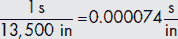

声音传播 1 英寸大约需要 74 微秒，即 0.000074 秒。要计算厘米的距离，可以进行相同的操作，但使用 343 米每秒的声音传播速度，乘以每米 100 厘米，并取倒数。

#### *触发警报*

草图还没有完成。现在我们需要查看测量的英寸（或厘米）数，并将其与预定的值——在此案例中是`val`——进行比较，以确定是否应激活警报。为了将变量`val`设定为数值，取一个跨越电源的电位器（R2），将刮片连接到 A0 引脚（见图 5-2）。因为 A0 是一个 10 位模拟到数字转换器的输入，它将电压（介于 0V 和 5V 之间）转换为介于 0 和 1,023 之间的数字值。使用`analogRead()`命令读取该值时，结果将在 0 到 1,023 之间，具体取决于电位器的位置。

然后将该值用于设定警报的触发点。但允许所有 1,024 个值实际上会使距离范围从 0 到 1,023 英寸。由于控制器仅旋转 270 度，因此调整例如 40 到 42 英寸之间的距离将代表一个非常微小的旋转——超出了大多数电位器的分辨率。

为了将此应用于电位器，草图将该值映射，使电位器的整个旋转表示大约 100 英寸的距离，代码如下：

```
val = map(val,   0,   1023,   0,   100);
```

映射电位器的值会将最大距离从 1,023 英寸缩小到 100 英寸，同时保持最小距离 0 英寸不变。你可以映射任何一组值，这样车库卫士的目标距离可以从*X*到*Y*，电位器完全旋转时，设置好车库卫士后，你可能需要测试这个范围，直到它适合你的车库。

一个条件控制结构设置了警报的限制。这个结构确保当测量的距离为 0 时，无论草图使用的是英寸还是厘米，LED 都会关闭。首先，`inches`的值会与`val`进行比较，表达式如下：

```
count  ==  0 && inches  >  0  &&  inches  <  val
```

如果该语句为真，警报会被触发，且➋处的`for`循环会被激活（见第 139 页），该循环交替闪烁 LED 200 次，直到超时并将 LED 关闭。

`for`循环仅从 0 数到 200，但可以很容易地修改。每次计数后，它会打开一个 LED，短暂延迟后关闭该 LED，再稍微延迟打开第二个 LED，再稍微延迟关闭该 LED，然后进入下一个计数。在 200 次计数结束时，系统会关闭 LED，程序继续到下一行，重新开始。也就是说，程序会从头开始。

### 结构

图 5-8 显示了车库卫士的外壳。

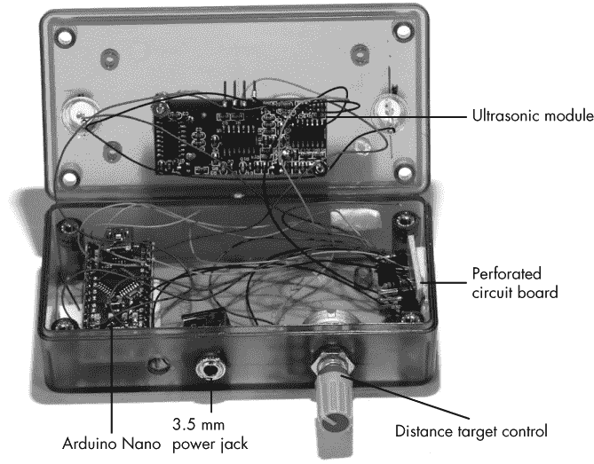

*图 5-8：基础车库卫士使用导线包绕进行最终连接*。

车库卫士最棘手的部分是将超声波模块安装到外壳上。由于该模块只能沿直线发射声波，因此你需要能够调整其方向，以便超声波传感器能够击中目标并接收回波。但该模块仅包括两个对角安装孔，因此没有简单的方法将其固定到一个灵活的安装架上。我们将首先解决这个问题。

#### *为电子设备钻孔*

为了解决这个问题，我将收发器直接安装到外壳上，并根据需要调整外壳的方向。为了安装模块，需要在外壳上钻 5/8 英寸的孔，并使用支撑柱牢固地固定电路板。可以参见图 5-9 中的模板来进行钻孔测量。本书的在线资源中有该模板的 PDF 文件，网址是*[`www.nostarch.com/arduinoplayground/`](https://www.nostarch.com/arduinoplayground/)*，如果你想打印它并将其作为指南放在外壳上，可以访问该网站。推荐使用的外壳是聚碳酸酯塑料，比苯乙烯或有机玻璃更不容易开裂；但它容易卡住钻头，所以要小心。

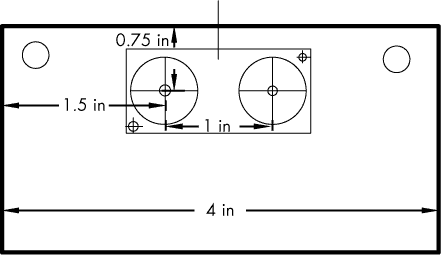

*图 5-9：钻孔模板，用于安装传感器孔*

有几种方法可以钻出 5/8 英寸的孔。如果你擅长钻孔，可以直接使用 5/8 英寸的钻头钻孔。但是我发现，通过先钻一个直径约为 1/4 到 3/8 英寸的孔，然后用锥形扩孔器扩大孔径，可以安全且轻松地钻孔。亚马逊上不到 15 美元就能买到锥形扩孔器套件，里面较大的扩孔器可以将孔扩展到 7/8 英寸直径，对于其他项目也很有用。使用 1/8 英寸的钻头钻孔，用作支撑垫的孔，可以参考图纸来作为模板。

如果你扩孔时要确保从两侧进行扩孔。将孔扩大到一个能够紧固换能器元件的大小，但不要过于紧密。虽然这不是一种非常精确的打孔方式，专业的机械师可能会对这种方法不以为然，但在这里效果还不错。

**警告**

*无论孔的大小如何，钻孔时不要用手直接握住工件。始终将其固定在夹具中。如果钻头卡住，工件会想要旋转或向上攀升。钻孔时应使用较慢的速度，轻轻操作*。

接下来，钻孔以安装电位器、电源插孔和两个 LED 灯。根据你使用的电源插孔和电位器选择合适的钻头尺寸。我使用了 9/32 英寸的钻头用于电位器，1/4 英寸的钻头用于 3.5 毫米插孔，以及大约 25/64 英寸的钻头用于 LED。10 毫米 LED 的尺寸可能会因制造商不同而有所不同，因此我建议你选择一个较小的钻头，比如 3/8 英寸，然后逐渐扩孔直到 LED 能够紧密安装。由于 LED 是锥形的，最好从外壳的后部扩孔，这样 LED 会更好地适应。

电位器和电源插孔的位置并不重要，但要确保它们不会挤压换能器或 Nano。你希望它们位于外壳的底部，这样在外壳安装后可以方便访问（见图 5-12）。

#### *安装选项*

在将 Arduino、超声波传感器和打孔板电路塞进外壳之前，先弄清楚你想如何安装 Garage Sentry。有几种方法可以将外壳安装到你需要的表面上。

##### 魔术贴条

如果你有一个平整的表面来安装组装好的设备，可以直接使用粘性魔术贴将外壳固定（见图 5-10）。我车库里已经用这种方式安装了两个警戒器几个月，没有出现滑动或老化的迹象。

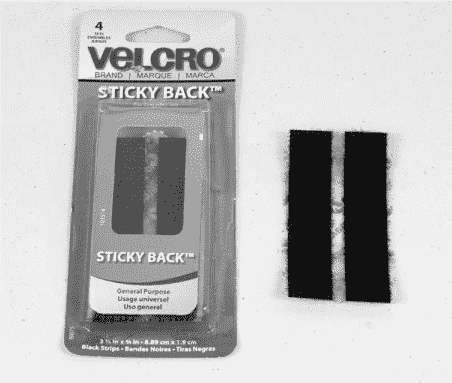

*图 5-10：使用粘性魔术贴条安装 Garage Sentry 外壳*

##### 一个可以调节的 U 型支架

如果你没有合适的表面并且需要将模块以一定角度进行调节，可以将其安装在一个 U 型支架上，这样传感器就可以上下或左右摆动。在这一节中，我将描述如何构建图 5-11 所示的 U 型支架安装架。

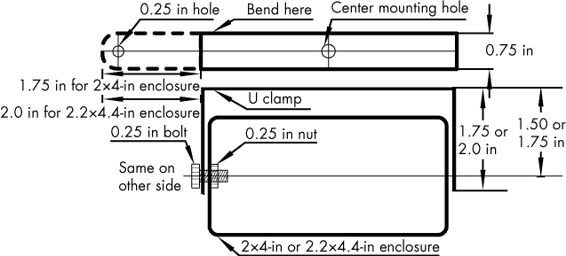

*图 5-11：此图说明了可选的 U 型支架把手的大小和形状，以及它如何连接到外壳。当你看到一个维度有两个测量值时，较小的适用于基本车库警卫，而较大的适用于豪华版本*。

为了制作适用于 1591 ATCL 2×4 英寸外壳的基本车库警卫 U 型支架，取一条 3/4 英寸×0.080 英寸×5 1/2 英寸长的铝条（可在 Ace Hardware、Home Depot 或 Lowe’s 购买），并在铝条的两端 5/16 英寸处钻 1/4 英寸孔。然后，在外壳的侧面钻对应的孔，使用 7 号或 15/64 钻头，并在孔中螺纹加工 1/4 英寸-20 螺纹。对于标准版本，将铝条在每端 1.5 英寸处弯曲，而豪华版则在每端 2 英寸处弯曲（参见图 5-11）。使用台钳弯曲金属是最简单的方法，但如果不方便，也可以将铝条夹在工作台和金属板之间，夹紧后手工弯曲。

为了制作适用于 1591 BTCL 2.2×4.4 英寸外壳的豪华车库警卫 U 型支架，使用一条 6 3/8 英寸长的相同材料条，且在距两端 1/2 英寸的位置钻 1/4 英寸孔。然后，在距离每端 3/4 英寸的位置将铝材弯曲成直角，以适应标准版本；对于豪华版，则在每端 1 英寸处弯曲。

要将 U 型支架固定到任何外壳上，可以先在外壳每端的中心钻孔。最简单的方法是分别在外壳的两端钻一个 7 号孔——15/64 号也足够接近——为了准确定位孔位，最好在两端沿对角线画一条线，交点即为中心。接着，将孔螺纹化，使用 1/4 英寸-20 螺纹 tap，这样你就可以直接将外壳固定到 U 型支架上。由于薄 ABS 塑料的螺纹强度不高，请小心避免过度拧紧螺栓。

完成将支架安装到外壳上后，外观应与图 5-12 相符。

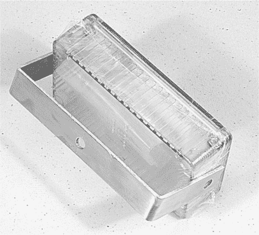

*图 5-12：基本车库警卫的外壳可以通过支架安装，从而使其能够倾斜或旋转，将传感器指向正确的方向*。

#### *焊接晶体管和限流电阻*

在面包板上测试完电路并决定如何安装车库警卫后，将驱动晶体管和限流电阻焊接到一小块打孔的酚醛板或 FR-4 预钻孔板上。使用图 5-2 中的原理图或“面包板”中的说明，参考第 136 页作为焊接和布线元件的指南。

按照原理图进行连接，除此之外，组装打孔板没有对错之分。我推荐使用带有铜垫的打孔板，这样可以简化焊接。在尝试将板子安装到外壳内之前，先焊接好电源、可调电阻、Nano 板、超声波模块和 LED 的连接线。

完成焊接后，将打孔板安装在外壳中任何有足够空间的地方。我使用了双面泡沫胶粘剂，效果很好。接下来，安装 Nano 板、LED 和超声波模块。

#### *连接各部分*

最后，使用 30 号连接线根据图 5-2 中的原理图，将 Nano 板、超声波传感器、打孔板电路和 LED 连接起来。你也可以选择使用线绕线和线绕工具来连接各部分，但这不是必需的，如果你没有工具和线，可能会比较昂贵。连接组件并将其安装在外壳内可能会有些杂乱，但这样可以省去做外壳的步骤。

### 豪华车库守卫

就这样！或者说，这就完了吗？

我在车库里使用标准模型已经好几个月了；它能做到它应该做的事，并且做得很好。但是似乎少了点什么。当你到达车库里指定的位置时，警报会响起，但为什么不在你到达之前就给你一个小警告，这样你就可以在接近停靠点时慢下来呢？

这个设计的想法是让系统在停靠点的预设距离内发出警告，这样你就不需要突然停车了。增加两个 LED，让它们在不同距离时亮起，并不会增加太多的额外工作。图 5-13 展示了豪华车库守卫。

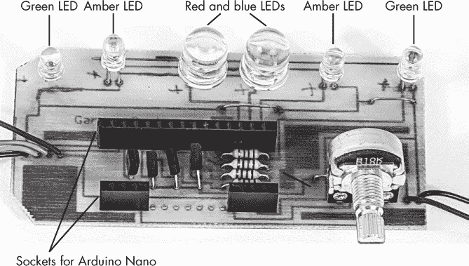

*图 5-13：豪华车库守卫设置了三个阶段的警报*。

现在，让我们讨论如何组装豪华车库守卫。

#### *豪华原理图*

手工焊接标准版的所有组件非常繁琐。所以，在豪华版中，我开发了一个集成板（PCB），它可以容纳 LED、可调电阻、Nano 板、晶体管和限流电阻。增加 LED 和额外晶体管需要对电路做一些修改。图 5-14 展示了修改后的原理图。

请注意，这个电路是以发射极跟随器的方式驱动晶体管。因此，基极显示出较高的电阻，因此不需要在 Arduino 与 Q1 至 Q4 的电阻之间添加电阻。如果使用共射极驱动，则需要电阻，因为电流会流经基极-发射极结，导致驱动器短路并烧毁晶体管。

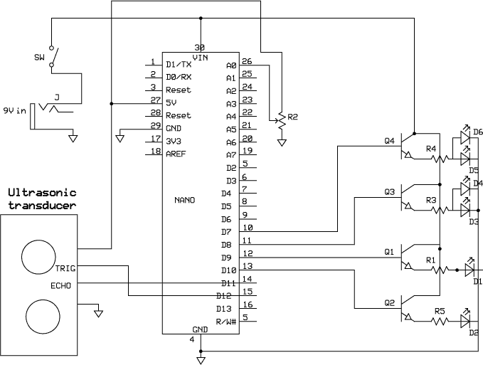

*图 5-14：豪华原理图在右侧增加了 LED、驱动晶体管和限流电阻*。

**注意**

*为了进一步改进车库哨兵，你也可以考虑使用特殊的换能器和电子设备将范围加倍或以其他方式增加，但在此应用中，10 英尺的工作范围已经足够。*

#### *豪华版草图*

在构建豪华版车库哨兵之前，从本书的资源文件中下载 *GarageSentryDeluxe.ino*，并根据 “将草图上传到你的 Arduino” 中的说明，在 第 5 页 上传到你的 Arduino Nano。该草图与基本的车库哨兵草图基本相同，但已更新以包含新的 LED。

```
        /* Deluxe Garage Sentry: goes with the shield PCB      
       */  

        int ledPin = 8;  
        int ledPin1 = 7;  
        int ledPin2 = 10;  
        int ledPin3 = 9;  
        int count;  
        int analogPin = A0;  
        int val;  
        int y;  

        void setup() {  
          //Initialize serial communication:  
          Serial.begin(9600);  
          pinMode(ledPin, OUTPUT);  
          pinMode(ledPin1, OUTPUT);  
          pinMode(ledPin2,OUTPUT);  
          pinMode(ledPin3,OUTPUT);  
          pinMode(analogPin, INPUT);  
        }  

        void loop() {  
          val = analogRead(analogPin);  

          long duration, inches, cm;  

          pinMode(12, OUTPUT);  
          digitalWrite(12, LOW);  
          delayMicroseconds(2);  
          digitalWrite(12, HIGH);  
          delayMicroseconds(5);  
          digitalWrite(12, LOW);  

          pinMode(11, INPUT);   //Attached to ECHO  
          duration = pulseIn(11, HIGH);  

          //Convert the time into a distance  
          inches = microsecondsToInches(duration);  
          cm = microsecondsToCentimeters(duration);  

          val = map(val, 0, 1023, 0, 100);  
          //Map the value of the potentiometer to 0 to 100  

          if(inches == 0)  
            digitalWrite(ledPin, LOW);  

  ➊   if(count == 0  inches > 0  inches < val + 15)   
             digitalWrite(ledPin2, HIGH);  
          else digitalWrite(ledPin2, LOW);  

  ➋   if(count == 0  inches > 0  inches < val + 7.5)  
             digitalWrite(ledPin3, HIGH);  
          else digitalWrite(ledPin3, LOW);  

       if(count == 0  inches > 0  inches < val) {  
  ➌     for(y = 0; y < 200; y++) { //Repeating blink sequence  
           digitalWrite(ledPin, HIGH);  
           digitalWrite(ledPin1, LOW);  
           delay(100);  
           digitalWrite(ledPin, LOW);  
           digitalWrite(ledPin1, HIGH);  
           delay(100);  
        }  
        count = count + 1; //Turn off instruction  
      }  

            digitalWrite(ledPin1, LOW);  

         if(inches > 10) { //Reset if inches > 10  
              delay(1000);  
              count = 0;  
         }  

         Serial.print(inches);  
         Serial.print("   inches ");  
         Serial.print(count);  
         Serial.print(" count   ");  
         Serial.println();  
         Serial.print(" val       ");  
         Serial.println(val);  
         delay(100);  
      }  

      long microsecondsToInches(long microseconds) {  
          return microseconds / 74 / 2;      
      }  

      long microsecondsToCentimeters(long microseconds)         {        
          return microseconds / 29 / 2;  
      }  
```

豪华版草图和标准版草图的最显著区别在于，在 ➊ 和 ➋ 处的两个 `if-else` 语句中，绿色和琥珀色的 LED 在不同的距离处被激活，取决于停止点。例如，如果停止点设置为 36 英寸，或者草图中的 `Val`，那么绿色 LED 会在 `VAL + 15`，即 52 英寸时亮起，琥珀色 LED 会在 `VAL + 7.5`，即 43.5 英寸时亮起。这样，当汽车距离最终停止点 15 英寸时，绿色 LED 会亮起，而当汽车距离停止点 7.5 英寸时，琥珀色 LED 会亮起。这些数字是随意选择的，你可以更改它们。

当汽车到达停止点时，红色和蓝色的 LED 开始闪烁。你可以在 ➌ 处看到 LED 的闪烁方式。

#### *豪华版屏蔽*

图 5-15 显示了豪华版车库哨兵的屏蔽。如果你想制作这个屏蔽，下载本书的资源文件，找到文件 *GarageSentryDeluxe.pcb*，按照 “制作你自己的 PCB” 中的蚀刻说明，在 第 13 页 上操作，并将你的组件焊接到电路板上。你也可以将文件发送给服务机构，让他们为你制作电路板。

电位器直接焊接到屏蔽上，尽管你仍然需要将电线焊接到电源插口和超声波模块上。如图 5-15 所示，超声波传感器的连接位于左侧。

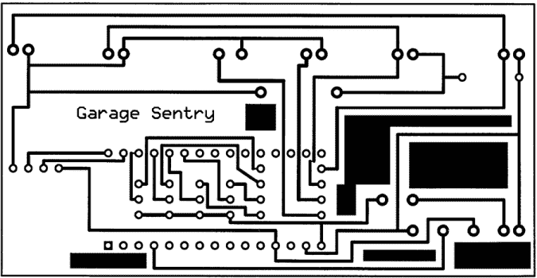

*图 5-15：这是豪华版车库哨兵的屏蔽，它简化了早期版本中必须焊接的各个电线。*

绿色 LED 位于最外侧，琥珀色 LED 紧随其后，闪烁的红色和蓝色 LED 位于中间。电位器的连接位于右下方，靠近前两个连接端口，分别是地线和 VIN（从左到右）。电位器帮助将屏蔽固定在外壳内。

这个版本使用了高功率 LED，这些 LED 需要相当大的电流。由于哨兵使用了 Nano 上的 5V 电压调节器，驱动 LED 的晶体管直接与 9V 输入电压连接，这样该设备就不需要单独的电压调节器。LED 与驱动晶体管配置为发射极跟随器，因此 LED 的电压将“跟随”晶体管基极的电压——即 5V，而不会给 LED 提供 9V 电压。

这个扩展板上需要几个跳线，包括用于电源的跳线，它连接到晶体管的集电极并将原始输入连接到 Nano 的（VIN）端口。还需要跳线将地线连接到 LED。

我将晶体管和限流电阻器安装在 Nano 板下方以节省空间。另外，注意标准版中的超声波模块连接使用了一个直角女性头，而在豪华版中这样做会导致公头部分的长度挡住 LED，因此我直接将连接焊接到 PC 板和超声波模块上，以避免电线干扰。

#### *更大的盒子*

绿色和琥珀色 LED 作为一对工作，因此每对 LED 只需要一个驱动晶体管。但由于所有这些新的电路，豪华版的电路板不容易适应与标准版相同的外壳。

你需要为豪华版找到一个更大的外壳，这样可以带来一些额外的好处。使用更大且透明的聚碳酸酯外壳，比如 Hammond 1591 BTCL，LED 可以保持在外壳内并且仍然可见，这样你就不需要在 PC 板上钻孔来安装 LED。你只需要钻四个孔：两个大孔用于超声波传感器，一个孔用于电源插座，一个孔用于电位器。这些孔使得可以使用双面泡沫胶带将超声波传感器安装在 Nano 板上，并且 Nano 板又被安装到扩展板上（见图 5-16）。换句话说，你需要将 Nano 板夹在中间，底部是扩展板，顶部是超声波模块。这个设计消除了第一版中使用的安装螺丝的需要。

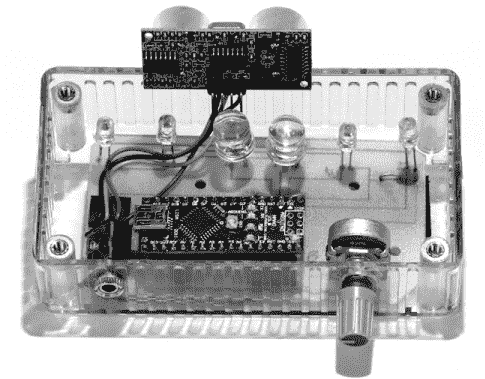

*图 5-16：与基本版的车库哨兵相比，豪华版几乎没有手工接线。驱动 LED 的晶体管和限流电阻器位于 Nano 板下方*。

只需使用标准版中使用的相同模板，钻（和/或扩孔）两个 5/8 英寸的孔用于两个超声波元件。屏蔽本身可以用小型平头螺钉和螺母或更多的双面泡沫胶带固定到底部。当你将电位器固定在外壳上时，它应该会把电路板固定到位，因为它的引脚已经焊接到屏蔽上。图 5-16 显示了豪华版；请注意它比图 5-8 中的基础版要整洁得多。

在为电位器钻孔之前，仔细测量电位器孔的高度，并稍微钻一个较大的孔，以便轴和螺丝可以以角度插入外壳。你还会注意到，在图 5-16 中，印刷电路板的角落已经被剪去，以免妨碍外壳顶部螺丝使用的螺柱。

我建议将电源连接安装在与电位器相同的外壳表面——即底部。在这里，电源连接和电位器在安装后可以方便接触，而顶部可以紧密贴合在架子上。该单元也可以轻松地倒置安装，将调整和电源插孔置于顶部。

图 5-17 显示了安装在我车库工作台上的完成版豪华车库哨兵，车子已经到位。

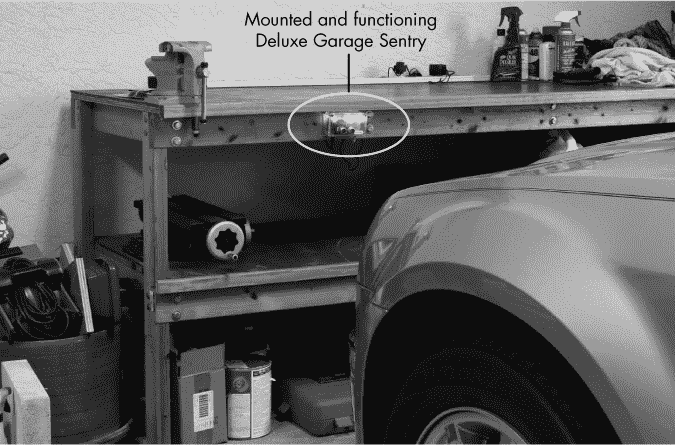

*图 5-17：安装在我车库工作台上的完成版豪华车库哨兵，车子已经到位*

完整的哨兵单元运行完美无缺。根据你特定的车库以及单元放置的位置，你可能需要调整草图，使得绿色和琥珀色的灯在不同的距离上亮起。图片中的单元已经完美运行了近六个月，我简直无法想象没有它，我怎么把车开进车库。
