## 第七章：**电池保护器**


这个项目实际上起源于 1970 年代，当时我第一次制作了一个非常类似的装置。其目的是在电池因不经意的电量消耗而导致车辆无法启动时，切断车辆的电池。在计算机化汽车出现之前，驾驶员常常会停车并忘记关灯，结果回来时发现电池没电。那时，他们必须找到办法呼叫服务站（因为没有手机），并启动电池。更糟的是，如果电池死掉且车辆放置时间过长，电池就会变得无法使用，必须更换。在 12 到 18 小时之间处于放电状态后，大多数铅酸电池会完全放电，无法恢复。

但那是过去的事了。现在，许多车辆，尤其是配备了自动照明系统的车辆，已经通过自动（通常是延迟）断电功能来防止这种不便情况的发生。然而，仍有几种类型的车辆没有自动关机系统或报警装置来提醒你灯光还开着。这个项目，如图 6-1 所示，对于这些车辆特别有用。

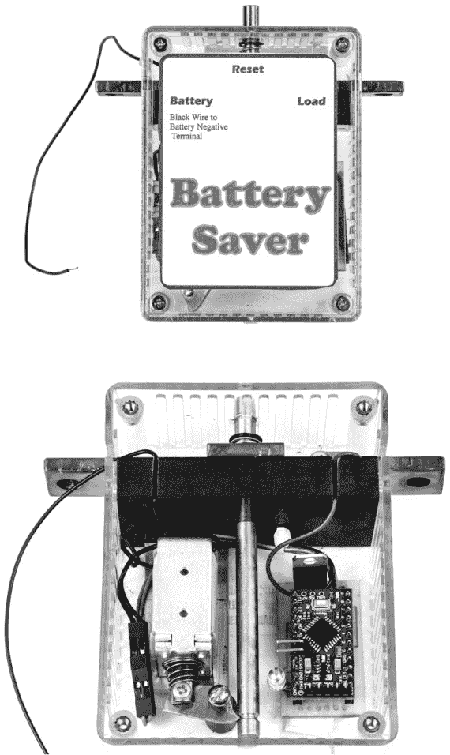

*图 6-1：完成的电池保护器，包装好准备使用（上），以及内部构造（下）*

### 船只、拖拉机和其他车辆

许多适合上路的车辆都能从电池保护器中受益，但这个项目主要面向那些电池意外放电可能带来麻烦且昂贵的系统。船只尤为容易受到影响。即使是我的小型跑船也遇到过类似问题。曾多次在白天忘记关掉导航灯，直到几天后才发现。电池完全没电，必须更换。

留下导航灯开着并不是唯一一种会意外耗尽船只电池的方式。大多数内舱船只都配备有排气系统，用于安全地排出可能爆炸的气体和燃油蒸气。常识（以及海岸警卫队）建议，在启动引擎前保持排气扇运转，船只运行时一直开着，并且至少在关闭引擎后再运行 10 分钟。很容易忘记排气扇还在开着，结果下次使用船只时发现需要更换电池。

**注意**

*在为像船只排气扇这样的安全系统构建电池保护器之前，请阅读《注意事项》中的内容，见第 158 页。有一些需要注意的事项，可能会要求对电气系统做一些小的布线更改*。

船只并不是唯一易受影响的车辆。骑行割草机和拖拉机也有三种原因容易面临风险：

• 它们通常只是间歇性使用。

• 停车和/或前照灯开关通常放置在容易碰撞到的位置，尤其是在上下车时。开关也可能会被飞溅的碎片或崎岖的地面损坏。

• 它们通常在白天使用，因此有时很难判断灯光是否开启。

电池节能器还可以保护电动工具，如拖车喷雾器。使用这些工具后，容易忘记关掉它们，尽管大多数喷雾泵的电流消耗不大，但如果让它们开着一整天或两天，电池很可能会耗尽。

### 所需工具

电钻和钻头

中心冲

4-40 螺纹攻丝

锯条

400 目砂纸

沉头钻（几乎任何 82°的沉头钻都可以使用。被加工的材料相对较软，因此不需要特殊的材料。）

针形锉（参见图 6-20。虽然只需要一把，但通常它们是成套出售的。）

三角锉

**注意事项**

如果你按照本章所述制作电池节能器，它应该能够正常工作。然而，仍然有可能发生墨菲定律带来的问题，因此在制作之前，请考虑以下几点。

如果电池节能器发生故障，可以进行重置，但在此期间，它将切断车辆电气系统的所有电源。*不要*将电池节能器用于任何电气故障可能导致灾难性后果的系统（如飞机上），或可能导致人身伤害或财产损失的系统。话虽如此，我已经在一辆汽车、三台农业拖拉机和两艘船上使用了这个设备超过一年（以及更早版本使用了好几年），没有发生过任何故障。

电池节能器包含一个非常高电流的开关。在某些条件下，可能会产生一定的电阻，当电流流过时，开关可能会变得非常热——甚至可能会热到成为火灾隐患。（值得一提的是，即便是原型版本，也从未发生过这种情况。）我们已经尽一切努力消除类似问题——例如，电池节能器铜触点所用的模块是由耐火和耐熔的酚醛材料制成的——但过热仍然是一个潜在的危险。在触碰电池节能器之前，请始终检查它的温度，确保它不热到足以烫伤你。如果车辆或电池节能器出现故障，重置按钮也可能变得足够温热以致烫伤。

最后的这一条警告专门针对船员。如果你将船停在水中，它很可能配备了内置的舱底泵和自动浮漂开关，以确保在你不在船上的时候船能保持浮力。如果你有多个电池，请确保舱底泵接到与电池节能器电路无关的电池上，如图 6-2 所示。否则，找到为舱底泵/开关供电的电线，并简单地绕过电池节能器。

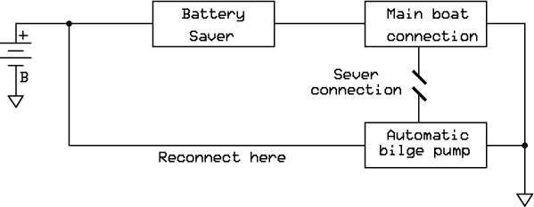

*图 6-2：船上电池节能器的接线*

### 零件清单

这个零件清单看起来可能有点像寻宝游戏，但所有东西都可以从各种来源轻松找到。然而，获取特定尺寸或数量可能会有些困难，因此在开始之前，仔细阅读清单，确保你拥有所有物品。在购物前，还请查看图 6-13 以及第 170 页，看看一些不常见的零件，比如铜触点。

一块 Deek-Robot Pro Mini Arduino 克隆微控制器板（有几种不同的版本，其中一些有不同的引脚排列，特别是 A4 和 A5 引脚）

图 6-3 显示了我使用的引脚排列。其他具有不同引脚排列的设备应该也能工作，但需要更改扩展板上的连接。）

一个 LM7805 电压调节器

12V 电磁铁（此项目使用的是 Electronic Goldmine G19852。）

一个 10 千欧的电阻

一个 5.6 千欧的电阻

一个 4.7 千欧的电阻

一个 470 欧的电阻

一个 4.7V 的齐纳二极管

一个 1N4002 二极管或等效品

两个 ZTX649 晶体管

一块 1/2 英寸的酚醛板

一根 6×3/4×3/16 英寸的铜条，是高电流开关的一部分（这实际上是一块常用于大型电气安装的铜母线。请参见图 6-4 的示例。要找到这个，你可能需要通过在线搜索*铜母线*进行一些挖掘。我买了一根长 3 英尺的铜条。）

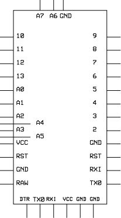

*图 6-3：Deek-Robot Pro Mini Arduino 克隆的引脚排列*


*图 6-4：用于电池节能器的铜母线*

一个 ABS 塑料外壳，类似于 Hammond 1591 STCL

两个 1/4 英寸的黄铜圆棒（你将使用其中一个作为支柱。）

一小块金属片，用作释放部件

一个 e 型卡环

四个 1/2 英寸、4-40 型号的平头螺丝

一个 3/8 英寸、4-40 型号的圆头螺丝

3 盎司的 Permatex 硅胶 RTV 密封剂

一对匹配的内联连接器（你可以在线购买简单、便宜的内联连接器，或者自己制作。我使用了 Pololu 的 1×2 连接器外壳和男、女性压接针脚，如图 6-5 所示。请参阅《本书中使用的连接器》部分，在第 18 页了解压接技巧。如果能找到电话式的“小鸡头”连接器，也可以使用。）

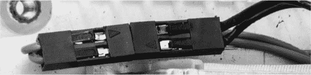

*图 6-5：用于连接电磁铁的配对连接器*

28 号连接线

一个焊接端子（如果找不到，你可以绕过它，方法是将 Arduino 的电源线缠绕在螺钉的头部，如图 6-7 所示。）

一条电池电缆，一端适配你的储电池，另一端有接线端子用于连接电池节能器

### 下载

**草图**   *BatterySaver.ino*

**模板**   *ReleaseLever.pdf, BatterySaverEnclosure.pdf*

**扩展板**   *BatterySaver.pcb*

### 电路图

尽管电路相对简单，如图 6-6 所示，但有几个关键设计元素需要注意。

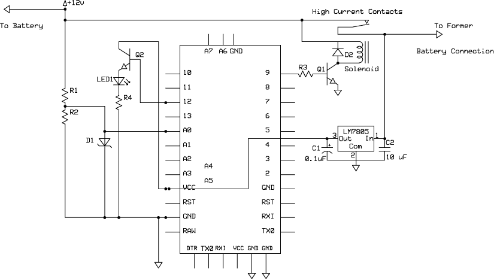

*图 6-6：电池保护器的原理图*

请注意，电路使用了 LM7805 稳压器。理论上，Pro Mini 板上包含的小型稳压器应该足够，因为负载相对较轻。但是在汽车引擎盖下以及高电流系统和高压电子设备周围，存在大量的杂散电磁能量。虽然这种能量不太可能对电池保护装置造成问题，但这种情况完全有可能发生。更为强大的 1.5A LM7805 稳压器为 Pro Mini 提供了额外的保护。此外，还包括了电容 C1 和 C2，用于旁路进入电路的交流信号，并防止不必要的振荡。同样，4.7V 稳压二极管（D1）保护 Arduino 输入免受 12V 电源电压尖峰的影响，这种尖峰非常可能发生。它将 A0 的电压限制为 4.7V。

电阻 R1 和 R2 的配置可能在其他项目中也很熟悉。它们构成了一个电压分压器，将 12V 电源降低到 Arduino 输入能够承受的 5V 最大值以下。为了安全起见，我选择了 R1 为 10 千欧，R2 为 5.6 千欧，这两个值都是标准值。这个设计应该允许电池电压在达到稳压二极管启动的点之前，跳升到 14V。

二极管 D2（1N4002 或等效型号）提供了另一个保护层级：它保护免受反向电流的影响，这种电流可能在电磁线圈的磁场坍塌时产生。这是铁芯电感器中的标准保护装置，它能够储存磁能并迅速将其释放到线圈中。反向电压可能达到相对较高的水平，并产生显著的电流，这可能会损坏驱动晶体管及系统中的其他组件。

晶体管 Q1 和 Q2 都是 ZTX649 硅 NPN 晶体管。我选择这些晶体管是因为它们具有足够的驱动能力，并且价格低廉且容易获取。我在其他项目中也使用了相同的型号。Q2 的高端连接到红色正极轨（VCC），因为 LM7805 稳压器提供了足够的电流。（你也可以将 Q2 的高端或集电极连接到 12V 电源，因为 Q2 是按发射极跟随器接线的，发射极的电压将只跟随基极电压。）R4 是一个 470 欧姆电阻，限制 LED1 的电流。

LED1 指示装置是否在运行。包含 Q2 和 LED1 的电路提供了一个短周期闪烁的 LED，这与本章目标一致，即尽可能频繁地闪烁 LED。

**注意**

*Deek-Robot Pro Mini 还配备一个红色 LED，指示其是否打开。这个附加的小的常态电流消耗可能会对电池的放电产生影响。在我安装的设备中，我将 Pro Mini 的 LED 的一端焊接了，这是一项相对精细的操作*。

晶体管 Q1 以共发射电路的方式提供驱动电流给电磁铁。电阻 R3（4.7 千欧姆）驱动晶体管并起到保护作用——如果直接连接，基极-发射极结将会通过过多电流，可能导致损坏。电磁铁的高端连接到正 12V，以允许最大电压和电流流过电磁铁线圈，而不会对电压调节器造成负担。

#### *电池保护器如何防止电池过度放电*

电池保护器包括一个能够断开电流的高电流开关和一个传感器电路，用于检测电池是否面临耗尽的风险。高电流开关是必需的，因为它会中断电池的主电源，其中包括给启动电机供电的部分，启动电机可能会消耗数百安培的电流。

高电流开关——也可以认为是一个继电器——由三块铜母排组成：一个释放条，一个电磁铁和一个释放杠杆。当铜母排连接时，电池与其电路正常连接。当电磁铁被吸入时，电源被断开。

传感器电路使用 Arduino 微控制器的电力。Arduino 不断监控电池，如果它检测到电力正在减少，它会触发高电流开关（继电器）。有许多方法可以判断电池是否快耗尽，这个项目简单地查看电池中的剩余电压。表 6-1 显示了标准 12V 铅酸蓄电池的电压与剩余电量之间的关系。

**表 6-1：** 电池充电状态与电压的关系

| **电池充电水平** | **电池电压** |
| --- | --- |
| 100% | 12.7V |
| 90% | 12.5V |
| 80% | 12.4V |
| 70% | 12.3V |
| 60% | 12.2V |
| 50% | 12.1V |
| 40% | 11.9V |
| 30% | 11.8V |
| 20% | 11.6V |
| <10% | 11.3V |

电池电量迅速下降，但电压仅有最小的减少。为了确保电池至少剩余 40%到 50%的电量，必须在 11.9V 到 12.2V 之间某个位置停止电池的耗电（如表 6-1 所示），我以后将这个电压称为*触发点*。在实际应用中，经验数据显示，即使电池电压降至 12.0V、11.90V，甚至更低，仍然有足够的电量。一块处于良好状态的电池，在理想情况下可能会以不到 30%容量的电量运行，但这取决于负载、环境温度等因素，因此我持一个非常保守的看法，认为 12V 以上是合理的。新设计的电池通常表现更好。  

虽然电量状态是电池剩余容量的良好指示，但其他因素——如内阻、电池放电速率等——也可能影响电池剩余的可用电量。更准确的电池剩余容量测量方法可能是当前使用的电流，如果已知电池中的总能量，就可以计算。例如，如果电池的容量为 1100 安培小时（A·h），你可以计算出剩余 550 A·h 并在此时断开电池。但是，由于这个项目针对的系统电池容量差异很大，因此我决定通过测量电池电压来满足需求，足以满足项目需求。  

#### *Arduino 来拯救*  

Arduino 微控制器负责测量电池电压，并在适当的电压下触发断电开关，但如果它只做这些，可能会出问题。启动车辆时，启动电机会消耗大量电流。根据电池的状态（如内阻等）和环境条件（例如温度），在启动过程中，电池电压可能会跌破关键的关机电压。电池节能器依赖 Arduino 给车辆足够的时间来启动电机。  

此外，如果系统因意外耗电而关机，你需要确保在重置电池节能器时，它不会立即检测到电池电压临界值并再次关机。所有这些功能都由微控制器根据程序指令来处理。虽然可能有多种不同的处理方式，但该程序实现了*时间序列*——即在某些情况下采取特定行动的规则——以便在发动机启动时电压下降时使用。类似的时间规则也为用户在重置电池节能器后重新启动发动机提供了时间。  

### 面包板

尽管这个项目不需要很多额外的组件和外围设备，我仍然认为通过面包板接线的练习是有用的。一个工作原型可以为概念提供明确的证明，并且让你在最终版本完成之前，先体验硬件和软件。与面包板一起工作时，我测试了与成品中使用的电磁铁类似的电路（参见图 6-7）。

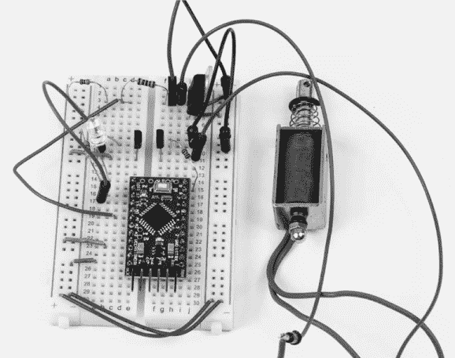

*图 6-7：我用来测试电池节能器概念并组装软件的面包板。使用电磁铁测试电路不是必需的*。

图 6-8 显示了面包板操作高电流开关的示意图；“构建”在第 170 页描述了如何构建这个开关。若不先构建高电流开关进行电路测试，或者仅使用电磁铁（参见图 6-7），你可以将灯泡、LED、继电器或其他元件替代开关进行连接。记住：如果使用 LED 或其他极性元件，确保正确连接极性。

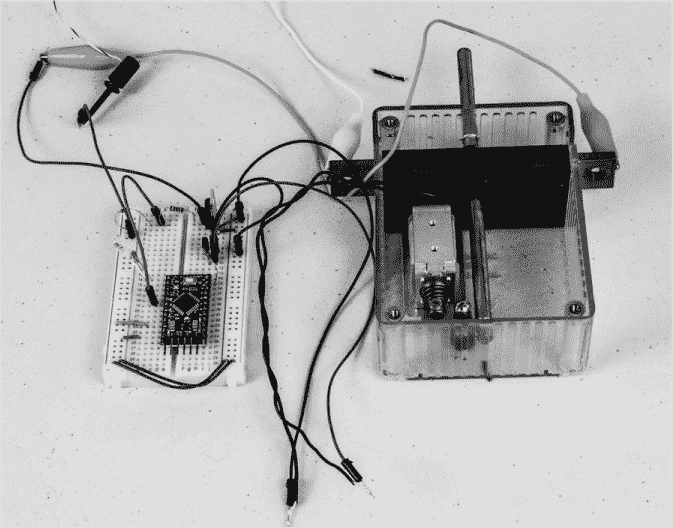

*图 6-8：高电流开关组装完成后，面包板电路操作电磁铁的示意图。请注意使用夹线将电池节能器连接到面包板。二极管 D1 和 D2 以及电容 C1 和 C2 没有包含在面包板中，主要是因为它们只在项目使用时才需要*。

基本的面包板连接非常简单。只需按照以下说明组装：

1.  将面包板上的红色正极轨连接在一起，并将蓝色负极轨连接在一起。不要将正极轨与负极轨连接，因为那样会导致直接短路。

1.  插入 LM7805 电压调节器，使三个引脚跨越三行不同的排针。（参见“原理图”在第 160 页，了解为何使用外部电压调节器，而不是 Pro Mini 板载的调节器。）

1.  将调节器的输入端连接到正 12V 电源。（参见图 6-9，了解 LM7805 的引脚图。）

    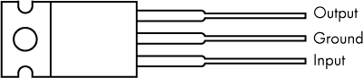

    *图 6-9：LM7805 调节器的引脚图*

1.  将调节器的中间引脚连接到蓝色负极轨，将输出引脚连接到红色正极轨。当你为电路供电时，正极轨应从调节器的输出端获得 5V 电压。

1.  将 Pro Mini 微控制器板插入面包板。其位置并不关键；放在图 6-7 所示位置附近的任何地方都可以。

1.  将电阻 R1（10 千欧姆）和 R2（5.6 千欧姆）插入面包板。最方便的做法是将它们插入靠近稳压器的地方。然后，将 R1 的一端直接连接到稳压器（输入引脚）。R1 和 R2 的连接点应该位于板上的独立位置，R2 的另一端直接接地。

1.  将跳线从 R1 和 R2 的连接点连接到 Pro Mini 的 A0 引脚。

1.  将晶体管 Q1（ZTX649）插入面包板，在有三个开放排的区域（请参见图 6-10 了解引脚排列）。

1.  将电阻 R3 从 Q1 的基极连接到 Pro Mini 的 D9 引脚。

1.  将 Q1 的发射极连接到地面。

1.  将 Q1 的集电极连接到负载（电磁铁或其他）。

1.  将负载的另一端连接到 12V 正电源。

1.  将晶体管 Q2 插入面包板，并将其集电极连接到红色正电源轨道之一。

1.  将 Q2 的基极连接到 Pro Mini 的 D12 引脚。

1.  将 Q2 的发射极连接到 LED1 的正极。

1.  将 LED1 的负极连接到 R4（470 欧姆）。

1.  将 R4 的另一端直接连接到蓝色负电源轨道。

1.  将 12V 电源的负极连接到蓝色负电源轨道。

现在，将草图加载到 Pro Mini 上（请参见“连接和编程 Arduino Pro Mini”第 8 页），并进行测试。如果你有带电压读数的可调电源，设置电压会很简单；如果没有可调电源，我建议你参考第三章中的“稳压电源”进行构建。如果你使用没有读数的可调电源，只需使用万用表来监控电压，并观察触发点。

将电源开启到 13V（对于充满电的 12V 铅酸蓄电池，12.7V 是正常值），此时监控 LED 应缓慢闪烁。逐渐降低电压，记下从慢闪到快闪的电压。该电压即为触发点，应该在 11.9V 到 12V 之间。

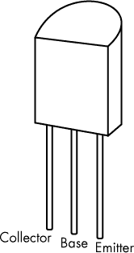

*图 6-10：ZTX649 晶体管引脚图*

### 草图

在开发电池节能草图时，我经历了几个迭代过程，以确保其可靠的功能性。一个难点是避免当引擎或附件（如液压倾斜装置）启动时，由于电压波动而产生误触发。

我使用了函数来调整不同的操作序列，这些操作序列独立于主程序运行。这并不是一个复杂的草图，但编写简单的函数是一种有用的技巧，当你想避免重复代码时特别有效。我本可以在最终草图中避免使用函数，但我让它们保留了下来，因为它们工作得很好，而且这种写法也为我提供了关于使用函数的好经验。

```
/*The Battery Saver sketch, which uses multiple functions
  to create timing sequences */

int led = 12;
int Battin = A0;
int Relay = 9;
int volts = 0;
int volts2 = 0;
int volts3 = 0;
int B = 387;    //Threshold trigger set point

void timer3() { //Shut off timer function
  delay(200);
  volts = analogRead(Battin); //Reset trigger point
  volts3 = map(volts, 0, 1023, 0, 500);
  if(volts3 > B) {
    digitalWrite(Relay, LOW);
  }
  else {
    digitalWrite(Relay, HIGH);
  }
}

void timer2() { //Fast blink timer function -- low voltage
  if(volts2 < B) {
    for(int j = 1; j < 1800; j++) {
      digitalWrite(led, HIGH);
      delay(10);
      digitalWrite(led, LOW);
      delay(90);
    }
  }
}

void timer() { //First timer function -- high voltage
  if(volts2 > B) {
    digitalWrite(led, HIGH);
    delay(200);
    digitalWrite(led, LOW);
    delay(1000);
  }
}
void setup() {
  Serial.begin(9600);
  pinMode(Relay, OUTPUT);
}
void loop() {
  delay(1000);
  volts = analogRead(Battin);
  volts2 = map(volts, 0, 1023, 0, 500);

  timer();
  if(volts2 < B) { //Set trigger point
    timer2();
  }
  if(volts2 < B) {
    timer3();
  }
}
```

在这个草图中，`timer()`、`timer2()`和`timer3()`是使用的三个函数。`timer()`函数用于在电池电压高于触发点时的正常操作。触发点是电池节能器进入超时模式并准备关闭的电压值。`timer2()`函数在达到触发阈值时启动一个快速闪烁序列，并提供超时前的定时——快速 LED 序列。一旦`timer2()`完成，若电压仍低于阈值，则调用`timer3()`，此时通过激活电磁阀切断电池。如果在超时期间，电压在任何时刻超过触发点，则在`timer3()`超时后，电池节能器会恢复正常操作。此草图中的许多变量也可以更改，以调整闪烁和延迟序列及阈值；这些内容在《操作电池节能器》中讨论，详见第 180 页。

### 扩展板

正如你从面包板上可以猜到的那样，扩展板也很简单。不过，与手工接线相比，我认为这样做更容易、更快捷。

#### *PCB 布局*

图 6-11 展示了我完成的 PCB， 图 6-12 展示了布局图，丝印显示了元件的位置。你可以在 *[`www.nostarch.com/arduinoplayground/`](https://www.nostarch.com/arduinoplayground/)* 下载扩展板的 PCB 布局。

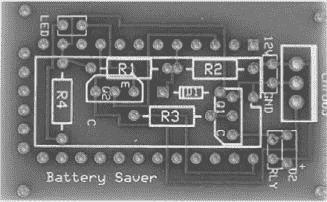

*图 6-11：未安装元件的电池节能器电路板。RLY 连接处是你连接电磁阀的位置*。

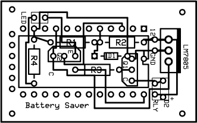

*图 6-12：电池节能器上扩展板的铜箔图案。丝印图像为灰色*。

大多数元件都放置在 Pro Mini 下方，以节省空间。除此之外，填充扩展板没有什么特别之处。与其他项目一样，并不需要为所有 Pro Mini 的引脚都配备排针。只需使用与板上走线连接的引脚，以及足够的其他引脚来增加机械稳定性。我通常会为第一个引脚使用至少一个排针，以便在插入时对齐电路板。

LED 可以直接安装在电路板上，也可以通过长线安装在远离电路板的位置。只需确保遵守极性。电池节能器可能位于操作员无法看到 LED 的位置，因此将其放置在远离电路板的地方是一个实际的解决方案。

#### *准备扩展板和 Pro Mini 控制器*

如果你想使用 PCB，可以根据本书提供的资源文件中的布局制作屏蔽层，无论是自己蚀刻还是将其交给专业制造。你也可以设计自己的屏蔽层 PCB，如果你有雄心壮志，或者仅仅是将所有组件焊接到原型板上，但如果你使用了零件清单中的其他所有部件，只需确保你的电路板与提供的屏蔽层布局尺寸相同。

如果你使用我提供的 PCB 设计，请接下来钻孔。我通常使用#66 钻头。将一根 2 英寸的电线焊接到屏蔽层的正 12V 端，并将电线的另一端焊接到一个小焊接端子。将一根 15 英寸的电线焊接到接地端子，然后将两根电线连接到电磁铁的连接端。我使用了一种小型内联连接器——由 Pololu #1950 压接连接器外壳、#1931 男型压接针脚和#1215 女型压接针脚制作——这样，如果需要的话，我可以轻松地拆下电路板。几乎任何连接器都可以使用。

两个晶体管位于屏蔽层下方，因此在焊接时，确保将它们按压到足够的位置，使其清除 Pro Mini 的底部。请参见图 6-11 和图 6-12 了解 PCB 上的晶体管放置位置。

我将监视 LED 直接焊接到电路板上，这样它可以通过外壳看到。不过，你也可以将电线焊接到电路板上，并将监视 LED 放置在一个可能更容易在车辆外部看到的位置。

### 构建

完成电池节能器的其余部分涉及一些机械挑战，并且需要一定的拾荒技巧。图 6-13 展示了电池节能器的所有组件布局。任何组件都不复杂。

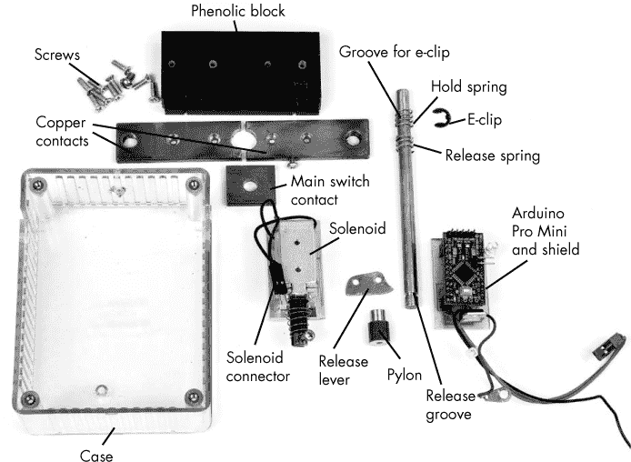

*图 6-13：电池节能器的组件，完全拆解。外壳的盖子位于透明盒子下方。请注意用于固定间隔器与电磁铁的短螺钉，以免损坏电磁铁线圈*。

电池节能器中只有少量组件：外壳、酚醛接触支撑、屏蔽层和 Pro Mini 控制器、铜接触组件、电磁铁和安装件、释放杠杆和支架、释放杆、弹簧和电子夹。以下的组装说明有些复杂，但如果卡住了，只需参考图 6-13，这样就能理清思路。完成后，电池节能器应该像图 6-14 一样。

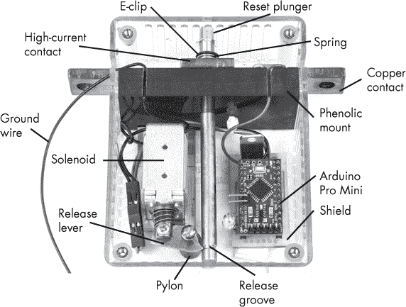

*图 6-14：完整的电池节能器，盖子已拆除，开关处于工作位置。在这一版本中，酚醛块上为正极和接地线刻有凹槽*。

#### *准备外壳*

因为外壳——Hammond 1591 STCL——是设计的一个重要部分，我建议从那里开始。除了外壳上加工的几个孔和槽口，几乎没有其他要做的工作。图 6-15 详细展示了我所切割的孔；一个模板包含在本项目的资源文件中。其实只需要切几个孔，因此，如果你仔细按照这些说明操作，应该不需要模板也能完成。

在外壳的长边上，从顶部大约量出 1 1/8 英寸的位置——这是重置活塞将要穿过的地方。这应该大致位于第四个安装肋的位置。在该肋的中心，钻两个 #30 的孔——大约 1/8 英寸——距离每个边缘 3/8 英寸，并且要将孔倒角，以便安装 4-40 的螺钉。两边都要做。

在每一侧，紧靠下一个肋的顶部（朝外壳顶部方向），切一个深度为 1 英寸的槽，用于放置铜触点组件。图 6-15 的侧视图中阴影部分显示了槽的切割位置。ABS 塑料外壳可以用钢锯轻松切割。去掉外壳盖，从外壳的开口向后切割。每个槽需要做两次切割，这样当你去掉它们之间的材料时，就能得到一个宽度为 3/16 英寸的通道。切割时，离开口大约 1 英寸就可以了，但不需要切到外壳的背面。你甚至可以同时切割两侧，只要确保通道正好位于对面即可。如果切割稍有偏差也不用担心，稍后可以用锉刀修正。完成切割后，取下中间的材料，并用小三角锉或平锉清理通道。

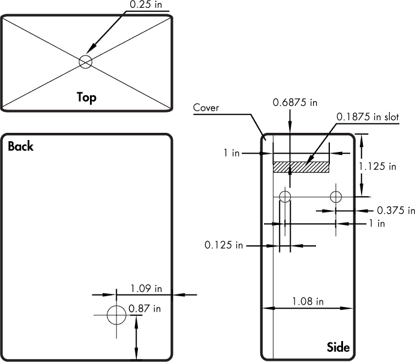

*图 6-15：电池节能器外壳中的孔和槽*

现在，在外壳顶部钻一个 1/4 英寸的孔，这是重置按钮的安装位置，正好位于顶部表面中心。按照图 6-15 中所示，从角落到角落画出对角线，然后在交点处钻孔。这个孔是安装重置活塞的黄铜释放杆的地方。

#### *联系我们支持*

接触支架可能是最容易制作的部分。首先，将酚醛片切割成 3×1 3/8 英寸的块。用钢锯轻松切割酚醛材料。将块插入外壳中，使得你通过肋条钻的两个孔位于块的中心。标记孔的位置，分别在两侧钻孔，使用#43 钻头，并为 4-40 螺钉攻丝。在制作酚醛接触支架时，你可以在两侧切割两个槽或通道，用于电源和接地线（稍后在图 6-18 中展示）。这个位置不太关键，因为这些槽仅用于放置屏蔽的正负电线。我使用图 6-16 中的小 Dremel 工具切割槽。每侧使用两个 4-40×3/8 英寸的平头螺钉将酚醛块固定到位。

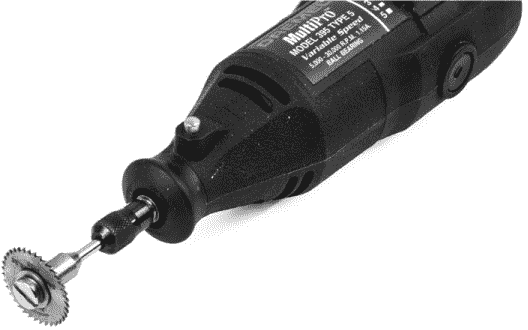

*图 6-16：带小圆锯片的 Dremel 工具*

在酚醛接触支架固定到位后，将钻头尽量垂直地握住，定位于接触块最大面的中心位置。钻一个 1/4 英寸的孔，使其与之前在外壳顶部钻的 1/4 英寸孔对齐。最简单的方法是将接触支架固定好，然后使用外壳顶部的孔作为引导来钻接触块中的孔。钻孔后，将接触支架放在一旁，直到你准备好铜接触组件。

**注意**

*外壳并不是一个完美的矩形，因为它包含了一些缓解区域，便于从模具中取出。钻孔对准中心孔时，需要考虑这一点。在我钻孔时，我将外壳固定在台钳中，以消除缓解区域的影响*。

#### *准备铜接触组件*

铜接触组件只需要几个孔。切割一段 4 3/4 英寸长的 3/16×3/4 英寸铜条，并按图 6-17 所示在 3/4 英寸尺寸的中心位置钻孔。

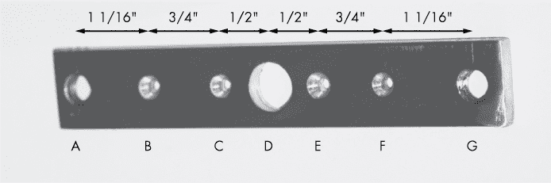

*图 6-17：铜接触组件的基座，显示孔和间距*

对于孔 A 和 G，使用 9/32 英寸的钻头。孔 B、C、E 和 F 应使用#30 钻头钻孔；确保它们被深度沉孔，以适应 4-40 平头螺钉。最后，使用 1/2 英寸的钻头钻孔 D。为孔 A 和 G 攻丝，使用 5/16×18×3/4 英寸的螺栓，这将用于固定电池电缆。

**警告**

*虽然铜不硬，但它容易抓住钻头并沿着钻头攀爬。在钻孔时，始终将铜件夹在台钳中、夹具里或用钳子固定。绝不要用裸露的手持铜件*。

当七个孔都钻好后，将铜接触的底部放置在酚醛接触支撑上，使铜条中的 1/2 英寸中心孔尽可能精确地对准酚醛支撑中的 1/4 英寸中心孔，并且铜条在接触支撑的整个长度上居中。确保铜条两侧的距离相等，牢牢地将两件配件固定在一起，并标记 B、C、E 和 F 孔。用中心打孔器打出刚才标记的孔，在接触支撑上用#43 钻头钻孔，并攻丝为 4-40 螺丝，再次将接触支撑放到一边。

现在，标记铜接触的精确中心，中心应当恰好平分 1/2 英寸的孔。根据这个标记将铜条剪成两段；锯条应该能很好地完成这个工作。接着，用剩余的 3/16×3/4 英寸的铜条切割出一个 3/4×3/4 英寸的正方形，并通过从角到角画对角线来标记中心。在交点处居中打孔，钻一个 1/4 英寸的孔。这个铜方块将成为实际的接触部分。

铜接触组件中需要打的最后一个孔位于 E 和 F 孔之间，条形的外缘上；请查看图 6-18（已圈出），寻找从接触条上突出的小螺丝。钻一个#43 的孔并攻丝以适应 4-40 螺丝。这就是连接到 Pro Mini 的开关正电压的来源。图 6-18 显示了所有接触和安装硬件的钻孔情况。

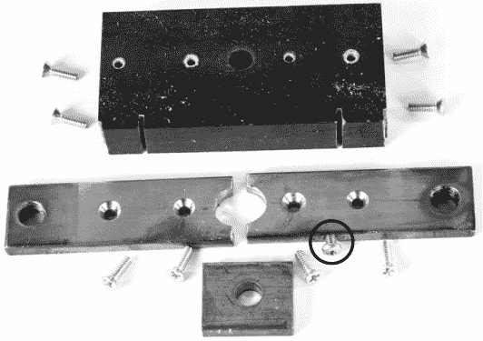

*图 6-18：准备组装的接触和支撑硬件*

#### *电磁铁的安装材料*

根据你的电磁铁，安装过程可能会有所不同。我使用的电磁铁框架底部有两个孔，已攻丝适合 4-40 螺丝。然而，框架和线圈之间的空间非常狭窄，因此我决定寻找一种替代的安装方法——一种非常强力的双面胶。如果你还是希望用螺丝安装电磁铁，仔细判断螺丝的长度。无论采用哪种安装方式，电磁铁都没有足够的高度与释放机制对接，因此我不得不添加一个平台。

#### *准备释放杆、弹簧和 E 型卡簧*

和电池节能器的其他机械组件一样，重置接触的释放杆只需要一点点关爱。从一段 1/4 英寸的黄铜棒开始，将其切割成 4 1/4 英寸长。从一端量起 1 1/8 英寸，制作一个槽以便春季固定夹的安装，如图 6-19 所示。

为了切割槽口，我将条形件安装在电钻的夹头中，然后将电钻固定在工作台上，使用锯条小心地在材料上开槽，手指引导锯条。锯条的齿距有些宽，但槽口的深度，而不是宽度，才是最重要的。话虽如此，槽口不需要太深。我建议你逐步切割槽口，并不断试装保持夹子，直到它牢固地合适为止。

图 6-19 也展示了弹簧的配置。最底部的弹簧将放置在酚醛块上，直到释放杆被压下时，才会将铜触点从触点区推开。它的大小应足够小，以免碰到铜触点的两侧。（记住，方形触点的孔宽为 1/2 英寸，所以弹簧的大小需要小于此。）当释放杆被按下时，顶部弹簧会覆盖住下部弹簧，并保持开关的上半部分与下半部分牢固接触。你可以在小型磨床上微调弹簧长度，或者使用德美工具（Dremel）或手动磨石。

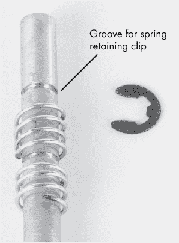

*图 6-19：释放条的上半部分。条上有两个槽；下部槽是错误做成的。用于释放杆的弹簧是从 Ace Hardware 的标准弹簧套件中选出的，并裁剪到适合项目的大小。*

现在，从同一端量取 4 英寸，并使用小针锉在 1/4 英寸的释放条下半部分锉出释放槽。图 6-20 展示了使用的针锉以及释放槽的形状。（你可能想先用锯子锯出槽口，然后用锉刀修整上面部分。）

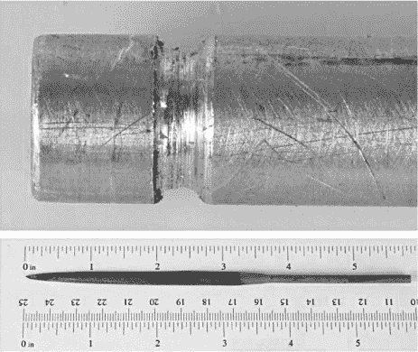

*图 6-20：释放杆底部释放槽的特写（上图），以及用来制作槽的针锉（下图）。*

释放槽的形状并不十分关键，但确保上侧有轻微的倒角。你在轴上看到的漩涡是我用 400 目砂纸磨光杆子所留下的，以便它能平滑地滑过酚醛块、机壳中的孔以及触点件。

#### *制作释放杆和塔架*

释放杆由一小块轻型钢板制成，厚度大约为 0.060 英寸。使用图 6-21 中的图样切割杠杆。在本书的在线资源文件中，你可以找到杠杆模板的 PDF 文件。由于模板相当小，你可以尝试将模板粘贴到一块大小相似的空白材料上，夹住它（活络钳效果不错），然后在磨石上塑形。将模板粘贴到材料上后，你也可以使用锉刀来修整它。

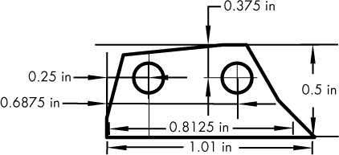

*图 6-21：释放杆模板*

使用一把锡剪，我首先剪出一个矩形，然后剪出释放杠杆的形状。我将零件牢牢夹在台钳中，这样我就可以用锉刀完成它的成形。软钢用锉刀锉削时手感很好。（您也可以使用小型磨轮或带有磨砂轮的 Dremel 工具来塑形。）首先根据模板制作略大一些的零件，因为在最终组装时可能需要进行一些调整。杠杆应该受到弹簧的压力，并能牢固地固定释放杆，使得方形铜件紧密接触底部铜接触组件的两侧。杠杆上的两个铰链孔——一个用于连接电磁铁，另一个用于连接释放支柱——都用#30 号钻头打孔。

这个支柱用于将释放杠杆安装到外壳上，您可以使用任何手头有的废铜或铝材来制作支柱。图 6-22 中的支柱是用直径为 3/8 英寸的黄铜棒做成的。我缩小了顶部部分的直径，因为我不希望支柱与释放杆摩擦，但那可能并不是必需的。

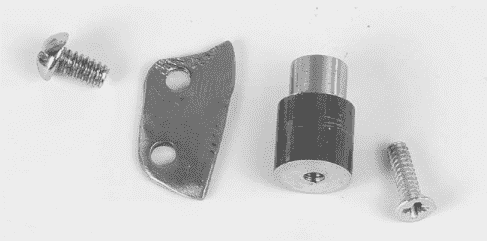

*图 6-22：释放杠杆、支柱和两个螺丝*

将支柱切割到大约 0.61 英寸长，这样当它安装在外壳内部时，连接到释放杠杆的一端将刚好撞击释放杆的直径中心下方。这个尺寸取决于释放杆孔是否准确地钻到外壳顶部的中心。将释放杆穿过孔，测量它距离外壳背面的中心有多远。支柱应该比这个长度稍短一些。

您可以通过将支柱的顶部夹入钻机中，像钻头一样旋转并用锉刀修整它，使其变得更小。在最终组装电池节省器时，如果孔没有钻得完全垂直，您可能还需要稍微调整支柱的高度，以适应释放杠杆的厚度和释放杆的高度。

在支柱的中心附近钻一个#43 号大小的孔，贯穿支柱两侧，并从两面攻丝以适配 4-40 螺丝。一个螺丝将用于安装到外壳背面，另一个将固定释放杠杆。为了确保螺丝不会拧得太紧并卡住释放杠杆，我仅攻丝约 3/16 英寸，这样螺丝就会到底并卡住。图 6-23 展示了攻丝后的支柱样子。

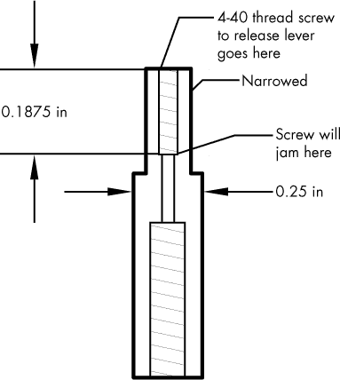

*图 6-23：支柱内部*

您可以调整攻丝孔的长度或螺丝的长度，确保释放杠杆能自由移动但又稳固，用螺丝头作为支撑表面。为了固定释放杠杆的轴承螺丝和支柱安装螺丝，我建议使用厌氧胶粘剂（如 Loctite Threadlocker）来确保螺纹牢固。

#### *组装所有零件*

现在，我们准备将图 6-13 中的所有部分组合在一起，并将它们固定在适当的位置。组装顺序并不非常关键，更多的是依靠常识。我将逐步进行说明：

1.  从将铜接触件拧入酚醛支架开始。确保螺钉头部低于铜的表面。这对于确保与接触条的良好接触至关重要。在组装之前，为了提高接触面积，我用 400 目砂纸打磨了铜接触件和接触帽。为了确保平整，我将砂纸放在平面上，并将铜件在上面摩擦。

1.  将酚醛支架滑入外壳，并用四个 4-40×1/2 英寸的螺钉将其固定。

1.  将释放杆穿过外壳，然后将其穿过压力弹簧，再穿过铜接触件，最后穿过释放弹簧并下穿酚醛基座。插入 E 型卡簧。这可能有些棘手，你需要用一把尖嘴钳固定卡簧。

1.  测量塔柱的位置，并用 4-40×1/2 英寸的平头螺钉将其固定到外壳上。塔柱应该位于外壳内部，螺钉应从外部拧入。

1.  将释放杠杆拧到塔柱上，并手动检查它是否与释放槽啮合，并固定释放杆。这有点棘手，可能需要通过打磨或修整释放杠杆来调整它，以适应释放杆的槽。一旦杠杆到位，你可以用手指操作它，确保它牢牢地锁定在释放杆槽中。

1.  将垫片安装到电磁铁上。

1.  临时将电磁铁安装到外壳上，并将释放杠杆固定到电磁铁上。为此，我首先将释放杠杆从塔柱上解开，并将另一端固定到电磁铁活塞上。接着，我在垫片底部贴上双面胶带，将所有部件调整到位，并将螺钉松动地放入释放杠杆，并拧入塔柱。

1.  在保持电磁铁固定的位置的情况下，操作释放机制。一旦释放杆牢固地按下了顶部开关接触点，就标记电磁铁垫片的位置。

1.  在外壳上钻孔并攻丝，以牢固地将电磁铁和垫片固定到外壳上。或者，也可以使用双面胶带（如 3M 户外双面胶带）将电磁铁固定。

1.  将连接电磁铁到 Pro Mini 电路的电线从释放杆下方穿过，并使用连接器将其连接到电磁铁。

1.  将 Pro Mini 电路的接地线从释放杆下方引出，并通过铜条的槽口开口穿出。（它是图 6-14 中从外壳左侧突出出来的黑色电线。）您可能需要在酚醛块上钻小孔给电线留出通道，或者使用 Dremel 工具和小圆锯片（如图 6-16 中所示）雕刻小槽来让电线通过。您也可以使用锉刀或钢锯锯条制作槽口。

1.  将红色正电压线与接头连接到第 173 页中《准备铜接触组件》最后一个孔的铜开关极上。使用 4-40×3/8 英寸的圆头螺钉。

1.  使用小间隔垫安装屏蔽板。如果找不到焊接接头，您可以先对电线进行焊锡处理，然后将其形成适合螺丝的形状，紧固螺丝。

将您的电池保护器与图 6-14 中的完成设备进行比较，以确保一切正常。当电池电压达到触发点时，Arduino 会触发电磁铁，从而释放杠杆。杠杆释放后，杆子从下弹簧的弹力中弹出。下弹簧将接触片保持在铜片上方，铜片被安装在酚醛块上，从而切断电路。要重置电池保护器，只需将杆子重新推下。进行最终测试之前，请多次检查释放杠杆和杆子的卡扣情况。

### 将电池保护器安装到车辆中

将电池保护器连接到车辆上只需要几分钟。首先，断开电池的正负极接头。然后，从电池的正极接一个短电池线到电池保护器的输入端。再将电池保护器的输出端连接到原先连接到电池的电缆上。将黑色电线连接到将要重新接回电池的负极端子。

安装整个外壳的方式将取决于您的车辆电池和/或电池箱的位置及安装方式。在许多情况下，电池保护器可以直接挂在电池电缆上。在其他应用中，我使用了重型电缆扎带，将其绕在整个电池和电池保护器周围，以固定位置。在某些情况下，双面魔术贴也能很好地起到固定作用。

### 操作电池保护器

在操作中，一旦电池保护器安装完成（见图 6-24），恢复电池的接地连接，并将该接地连接挂接到电池保护器。然后，通过按下重置按钮——也就是释放杆的顶部——来设置电池保护器，直到设备被激活。当您按下重置按钮并且释放杠杆卡住时，应该能听到或感觉到“咔哒”一声。

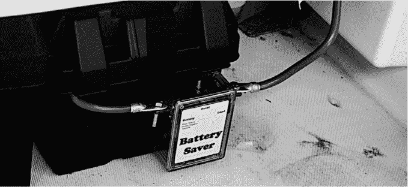

*图 6-24：安装在我波士顿 Whaler 小艇上的电池节能器。电池连接到电池端子，并与电机及配件的正极连接。电池的地线穿过电池盒的背部。重置按钮非常容易接触到*。

#### *正常操作*

只要电池充满电并且电压高于阈值电压，"开"指示灯将以`timer()`函数中设定的速率闪烁，约每 2.2 秒闪烁一次。当电池电压低于阈值时，指示灯将开始快速闪烁。阈值电压大约设置在 11.9V，通过电路图中的可变`B`进行调整。当 LED 序列完成，即大约 3 分钟后，电压将再次被检查。如果电压仍然低于阈值，电池将被断开；否则，系统将恢复正常操作。

当你在电池节能模式关闭后重置它时，系统将恢复运行。重置后，如果电池电压高于阈值，指示灯将按照每 2.2 秒闪烁一次的正常速率闪烁。通常，当电池从某个放电水平移除负载后，电池会在相对较短的时间内自行恢复。然而，如果电压低于阈值，指示灯将按照超时周期快速闪烁，如前所述，以允许操作员启动船只、拖拉机或其他车辆。你可以通过更改`timer2()`函数中`j`的值来设置超时周期。

`j`变量的最大值在初始电路图中设置为 1,800，增减`j`的值将分别增加或减少 100 毫秒的总超时周期。因此，要将超时周期设置为 5 分钟，你可以将`j`的最大值设置为 3,000。

#### *设置阈值电压*

阈值电压由电阻 R1 和 R2 决定，分别为 10,000 欧姆和 5,600 欧姆（参见图 6-6 中的原理图）。它们被设置为电压分压器。根据电压分压计算，无论是使用计算器还是根据公式计算，12V 输入下的电压大约为 4.31V。因此，你可以通过设置阈值触发点，即电路图中的`B`，来计算你希望设备关闭电池电流时的确切阈值电压。虽然我计算了理论阈值，但通过实验我发现将`B`设置为 387 时，关闭电池电流的阈值大约为 11.9V。

**电池类型**

我通过几块电池和负载进行了实验，发现将`B`设置为 387 时，关机后电池至少还剩下一半电量，用于重新启动发动机。在几种不同的电池上，从便携式发电机的小电池到用于启动卡车的大容量电池，设置相同的值似乎都能很好地工作。

话虽如此，我对深循环电池了解甚少，知道它们具有非常不同的放电参数。如果你想尝试将电池节省器用于这类电池，请查看它们的放电速率和电压，并相应地调整阈值。

#### *防护环境*

不幸的是，电池节省器并不防水，而大多数应用场景要求它在某种程度上能够适应恶劣环境。然而，也有一些可能的解决方案。在各种车辆上，包括船只和拖拉机，我将设备包裹在塑料袋中，并将电缆进入和退出设备的地方用电缆扎带紧紧固定。

但那样看起来不太美观，我还因此受到了家族中女性成员的一些责备，于是我在所有铜条穿过的开口周围涂上了 Permatex 硅胶 RTV 密封剂——但不包括重置（黄铜）杆的穿过处——并封住了所有的螺丝。

对于重置按钮，我很难找到合适的保护套（你会对我在网上找到的东西感到惊讶），所以我最终用硅胶密封剂将一个滴眼液瓶的顶部固定在外壳上。这样也可以防止重置条——当按下时，带有 12V 电压——短路。

#### *应用 Cool Amp*

尽管铜对铜接触良好，我还是在组装前用非常细的砂纸（400 目）进行了打磨。即使未处理的接触点已在多个版本的电池节省器中使用且从未失败，但我决定在这一版本中使用 Cool Amp，这是一种易于使用的银镀合金。

通过非常低的成本，我成功地对接触条和接触板的接触区域进行了银镀，从而降低了它们的电阻。图 6-25 和 6-26 显示了未镀和镀银铜的差异。

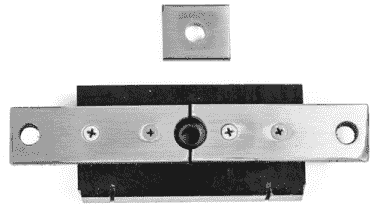

*图 6-25：电池节省器接触点在打磨后，但在使用 Cool Amp 处理前的状态*


*图 6-26：电池节省器接触点在使用 Cool Amp 银镀后的效果*

尽管这种额外降低电阻的措施可能并非必要，但车辆的所有电流都必须通过这个接触点，因此我认为在安全方面多做一些准备并不会有坏处。此外，我在海洋环境中使用过电池节省器，接触点周围的铜部件已经获得了绿色的铜绿，而银镀部分则没有。

我已经在多个接触点上使用了 Cool Amp，从电动机启动接触点到重型继电器接触点，它的效果很好。你可以在*[`www.coolamp.com/`](http://www.coolamp.com/)*了解更多关于 Cool Amp 的信息。

**注意**

*铜不会迅速氧化，铜的最常见氧化物具有高度的导电性，这也是铜常用于电流开关的原因之一。银具有相同的性质——只不过更好*。

**我的原始想法**

我持有一项美国专利（4,149,093，现已过期），该专利涉及与电池节能器类似的设备。专利图纸见于图 6-27。注意，即使是在几十年前制造的，它与这个项目的相似程度仍然很高。尽管当时还没有发明微控制器，它的功能基本相同！

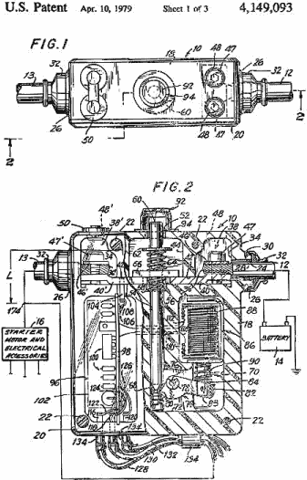

*图 6-27：电池节能器前身的专利图纸*
