## 第八章：**定制 pH 测量仪**


微控制器被广泛应用于许多，甚至大多数商业和科学仪器中。它们精确且多功能，使得它们成为解决各种测量需求的低成本方案。本项目将 Arduino 微控制器与商业探头和一些模拟电路结合，构建了一个精确的仪器来测量 *pH*，即溶液的相对酸性或碱性。

测量 pH 值的方法有三种基本方式。这个项目涉及使用 pH 测量仪和探头。其他方法包括石蕊试纸指示剂（你可能还记得它们在高中化学课上用过）和比色计，后者通常是游泳池维护工具包的一部分。比色计通常是一套化学试剂和比较色卡。在这三种方法中，pH 测量仪无疑是最准确的。

那么，pH 值到底测量的是什么呢？pH 值描述的是水溶液中氢离子的活性。氢离子的活性越高，溶液越酸性，pH 值越低。氢离子的活性较低（而氢氧根离子的活性较高）时，pH 值较高。

pH 值的刻度是对数的。每增加一个 pH 单位，代表氢离子活性在溶液中增加或减少十倍。这解释了为什么溶液的攻击性会随着 pH 值从中性点的距离迅速增加。

图 7-1 显示了完成的定制 pH 测量仪，如果你想知道为什么测量 pH 值是有用的，“为什么要测量 pH？” 在 第 187 页 提供了多个答案。

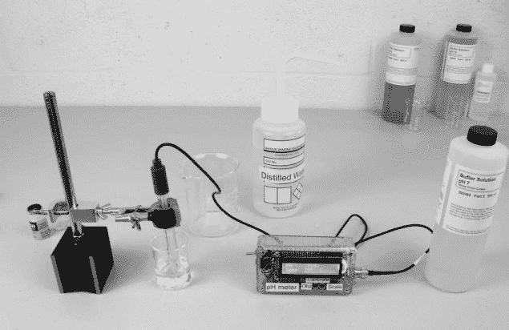

*图 7-1：定制 pH 测量仪在实际测量环境中的应用*

### 为什么要自己制作 pH 测量仪？

商业 pH 测量仪的价格从不到 $60 的低成本便携型设备到几百或几千美元的全功能实验室仪器不等。相对低成本的 pH 测量仪可以完成任务，但它们都有一些缺点，例如精度有限、使用寿命较短、校准问题和一致性问题。

还有许多 pH 测量仪套件可供选择，包括许多印刷电路板，有些是为 Arduino 设计的。（*印刷电路板* 是一块小电路板，包含执行某些功能所需的关键电路，但没有处理器。）我还没机会尝试这些套件，但它们通常比较昂贵，接近或超过 $100。而且它们仍然需要电源和包装。

虽然这个项目并未提议提供一款完整的实验室仪器，但它提供了一款不错、可用的 pH 测量仪，并且对 pH 测量仪的组成部分提供了很多有价值的见解。我已尽力调试电路以达到最佳性能，但你可能会觉得进一步的调整会有所帮助，所以如果你在查看电路后想尝试不同的方法，尽管去做吧。

**为什么要测量 pH 值？**

过去，pH 是一个相对晦涩的测量，局限于实验室工作台和工业环境（用于质量控制、过程控制、废水排放监测与控制等）。然而，越来越多的人开始在那些传统上依赖死记硬背或试错实验的方法的领域使用科学测量，比如家庭酿酒和啤酒酿造、水培、家庭农业、水养殖和烘焙。所有这些应用都能从精确的 pH 测量中受益，而且它们甚至不包括管理游泳池、锦鲤池、喷泉或水族馆化学成分这一更为平常的任务。

例如，在烘焙中，面团需要低 pH 才能发酵。食物的 pH 值也影响四种味觉中的两种：低 pH，或酸性食物往往味道酸，而较高 pH，或碱性食物则味道苦。柠檬汁是酸味的例子，西兰花或黑巧克力则可以视为苦味。在家庭园艺中，pH 是特定作物的重要土壤特性。简单调整 pH 可以使水族箱水清澈，并减少玻璃壁上的污垢沉积，而池塘中的平衡 pH 维持鱼类健康，并减少藻类生长。类似的例子还很多。

### 所需工具

焊接铁和焊料

电钻和钻头

锯孔锯

中心冲孔器

文件

2-56 螺纹刀

热风枪或吹风机（用于热缩管）

### 零件清单

构建定制 pH 计需要以下零件：

一个 Deek-Robot Pro Mini Arduino 克隆板（其他 Arduino 一般也适用于本项目，但不能与本书提供的屏蔽模板兼容。我在面包板上使用了一个 Arduino Nano 克隆板，因为它自带 USB 接口。在完成的设备中，我换用了 Pro Mini 以节省空间。）

一个 LM35（D）温度传感器

一个 Texas Instruments TL072 双运算放大器（引脚图见图 7-2）

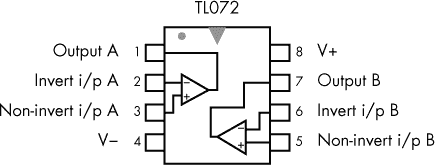

*图 7-2：TL072 引脚图*

一个 10 转，1 兆欧 调节电位器（R7）

一个 10 转，10 千欧 调节电位器（R4）

一个 BNC 公头连接器

一个 LM7805 电压调节器

一个 LMC7660 电源逆变器（引脚图见图 7-3）

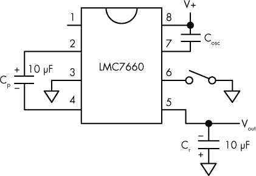

*图 7-3：LMC7660 引脚图*

一个 16×2 LCD 显示器

一个 I²C 适配器，如果 LCD 没有自带的话

一个 5.1V 稳压二极管

一个 1 μF 陶瓷电容（C2）

五个 0.1 μF 陶瓷电容（C1，C6，C7，C8，C9）

一个 0.01 μF 陶瓷电容（C5）

一个 22 μF 钽电容（C10）

两个 10 μF 钽电容（C3，C4）

一个 10 千欧，1/8 W 电阻（R5）

三个 10 千欧，1/8 W 电阻（R1，R2，R10）

两个 1 千欧，1/8 W 电阻（R8，R9）

一个 pH 探头

四个 4-40×1/2 英寸螺丝

八个 4-40 螺母和垫圈

四个 2-56×1/2 英寸螺丝

28 或 30 号导线

一个 Hammond 1591 BTCL 塑料外壳

热缩管

### 下载

**草图**   *pHMeter.ino*

**封面模板**   *pHCover.pdf*

**侧面模板**   *pHBoxSide.pdf*

**屏蔽**   *pHMeter.pcb*

### 关于 pH 探头

自定义 pH 测量仪的核心是 pH 探头。它测量溶液中氢离子的活性，从而决定该溶液的酸碱性。一个基本的 pH 探头，如图 7-4 所示，包含两个元件：参考电极和测量电极。我不会深入探讨探头的化学原理或 pH 探头的具体工作机制，但我会描述它的输出以及与电路的接口，电路提供显示读数。

pH 探头产生的电压与探头浸入溶液的 pH 值成正比。pH 范围从 0 开始，最酸性，到 14，最碱性。探头输出的电压大约在 -420mV 到 +420mV 之间，表示每个 pH 单位大约增量为 60mV。中性 pH 7.0 位于从 0 到 14 的中间值，表示为 0.0mV。

探头输出的特性使得本项目中的自定义 pH 测量仪的基本功能相对简单：它需要读取并显示电压。但自定义 pH 测量仪电路还需要考虑其他一些问题。首先，虽然商用探头是按照最高标准制造的，但它们可能存在一定的误差，需要调整。其次，我们处理的是相对较小的值，因此为了保持准确性，组件和电路必须精心挑选。此外，随着探头的使用和老化，它们通常会发生轻微变化，需要重新校准。

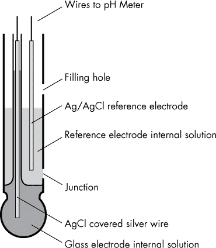

*图 7-4：pH 探头的简化图*

最后，pH 探头具有非常高的电阻值——可能是 10 到 100 兆欧姆或更高。从实际角度看，高电阻意味着尽管电压水平较高，但几乎没有能量能够改变其他设备的状态或条件，因此电路需要放大这个信号。这需要一个专门的输入电路，通常会涉及运算放大器（op-amp），其设计目的是在处理高阻抗信号时尽量减少噪声。今天的半导体技术已经能够满足这一需求，正如我在《集成电路选择的一些注意事项》中提到的，第 196 页里，我检查了几种运算放大器，找到了最适合性能与价格平衡的型号。当然，虽然选择一款好的运算放大器很重要，但输入电路同样需要尽可能高效，以便在不引入噪声的情况下，准确读取 pH 探头的敏感输出。

**如何保养你的 pH 探头**

虽然你的 pH 探头可能附带了使用说明书，但有一些方法可以延长其使用寿命。首先，当然，按照制造商的说明进行操作。其次，除非制造商另有说明，存储探头时，应将探头的工作端浸入 3 摩尔浓度的氯化钾（KCl）溶液中，如图 7-5 所示。你应该能在购买 pH 缓冲溶液的地方以相当低廉的价格购买到这种溶液。（*缓冲溶液*是由相对弱酸性和碱性化学物质混合而成的溶液，能保持特定的 pH 值。）你也可以通过将约 22 克 KCl 溶解在 100 毫升蒸馏水中来自制这种溶液。

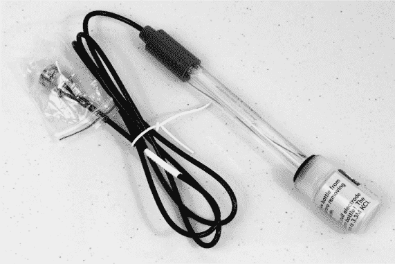

*图 7-5：我在本项目中使用的 pH 探头。探头尖端被浸泡在含有橡胶密封的 KCl 溶液的小瓶中*。

即使是相对较短的存储时间，最好将探头存放在 pH 7 缓冲溶液中，而不是在空气或水中。在每次样品之间，或将探头转移到不同的缓冲溶液时，务必小心冲洗探头。大多数制造商建议使用蒸馏水冲洗。你可以轻轻地将多余的水分拍掉，但大多数制造商警告不要擦拭或擦干电极球，以免由于极化效应而导致测量误差。

在测量之前对探头进行校准时，即便是顶级 pH 计的制造商也建议使用最接近预期样品 pH 值的缓冲溶液进行校准。例如，如果你怀疑样品的 pH 值约为 9，那么应使用 pH 10 的缓冲溶液来校准仪器。

### 原理图

图 7-6 和 图 7-7 所示的定制 pH 计电路包括一个双运算放大器、一个电压反转器（为运算放大器提供 ±5V 电压）、一个电压调节器、一个温度集成电路、一个 Arduino 和一个 I²C LCD 显示屏。你可以选择使用 Arduino Nano 或 Arduino Pro Mini 来构建你的定制 pH 计。我在使用 Nano 构建面包板时更为顺利，但我的最终产品（因此，本章节提供的扩展 PCB 文件）使用 Pro Mini 来节省空间。

本节的其余部分将介绍在设计此原理图时做出的决策及其背后的原因。


*图 7-6：使用 Arduino Nano 的定制 pH 计基本原理图*

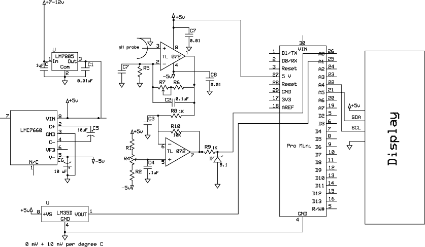

*图 7-7：使用 Deek-Robot Pro Mini 的定制 pH 计基本原理图*

#### *集成高阻抗探头*

请记住，pH 探头输出的直流电压范围从–420mV 到+420mV，大约每个 pH 单位对应 60mV。此输出具有非常高的阻抗，电路必须接受探头的高阻抗输入而不引入杂散信号，降低阻抗到可管理的水平，并放大输入信号，以便 Arduino 的模拟输入能够读取。电路还必须提供一种方法来调整送往显示器的电压，以便在偏置和增益方面校准探头（请参见“偏置和增益”在第 194 页的快速教程）。

为了处理高阻抗探头输出，运算放大器的输入必须具有非常高的阻抗，通常在太赫（1×10¹²欧姆）范围内，才能读取任何电压。运算放大器的输入还必须具有低输入电流（这两者是相关的）；通常约为 10 皮安（1×10^(−12)安培），尽管一些运算放大器的输入电流低于 25 飞安（1×10^(−15)安培）。如果运算放大器具有非常低的*漂移*（即在输入不变的情况下输出发生变化的倾向），那将是非常好的。

#### *一般设计注意事项*

定制 pH 计设计为使用 9V 电源，可以通过电源开关在电池和插入模块之间选择（请参见图 7-6 和图 7-7 中的原理图）。由于交流电源的输入可能不稳定，定制 pH 计使用外部电压调节器，而不是 Pro Mini 内建的调节器。一个 LM7805 电压调节器，输入和输出端都带有旁路电容器，在以前的项目中效果良好，本项目也使用了同样的调节器。该调节器为逆变器、运算放大器电路和 Arduino 提供+5V 电源。电源开关是一个三位置开关，中间是关闭位置，一个位置选择电池，另一个位置选择交流电源。

由于 pH 探头提供的输出为±420mV，因此该电路必须能够处理*双极性*（高于和低于地面）电压。实现这一点的最简单方法是使用一个具有正负电源和中间接地的运算放大器，这就需要一个能够提供这些电压的电源。LMC7660 电压逆变器是解决方案：它将来自电压调节器的+5V 转化为+5V 和–5V，并且中间有地面。这样，运算放大器就能处理输入信号，只要它不超过+5V 或低于–5V。

**注意**

*大多数电压逆变器与 LMC7660 非常相似，且所需的外部组件最小—在这种情况下，仅需两个电容器。该电路使用钽电容器，因为它们体积小且可靠，但也可以使用电解电容器*。

**偏置和增益**

为了演示偏置和增益如何工作，图 7-8 展示了本项目中使用的电压范围，从–5V 到+5V。

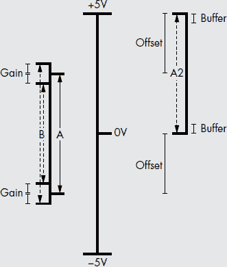

*图 7-8：改变增益和偏移量时自定义 pH 计中电压变化的示意图*

想象一下，当 pH 探头的电压被放大时，会有一个电压范围 A。在这个示例中，电压 A 代表供电电压的一半，范围从–2.5V 到+2.5V，总共是 5V。如果增益被调整，电压范围仍然会以 0V 为中心，但会增加或减少到某个电压范围 B。调整增益时，所选电压范围的最低和最高端将始终以相同的幅度增加或减少，前提是原始电压范围在总电压范围内。

通过调整偏移量，整个电压范围也可以在连续体内移动，如图 7-8 所示。电压范围 A2 仍然包含与范围 A 相同的总电压，但其最小电压和最大电压不同。在这种情况下，电压范围的中心从 0V 移动到 2.5V，使得电压 A2 的范围从 0V 到 5V。

这个偏移量可以是供电范围内的任何电压，但实际上最好不要将电压推到电压轨（即供电电压的最大值和最小值）。相反，应在电压轨和项目所需的电压范围之间留出一些缓冲区。

“电路图”在第 205 页中显示，自定义 pH 计将电压映射到 Pro Mini 的供电限制内（0V 到+5V），并使其成为所选增益的平均值。本项目的最终增益和偏移调整是通过使用预先准备的缓冲溶液和电路中的电位器来完成的。

自定义 pH 计使用 Deek-Robot Pro Mini Arduino 克隆板，因为该克隆板体积小且价格便宜；不过，如果自己制作印刷电路板，Nano 也可以使用。虽然 Pro Mini 没有 USB 接口，但有多种方式可以轻松地对其进行编程。如果你以前从未使用过这款 Arduino，请参阅第 8 页的“连接和编程 Arduino Pro Mini”章节。

显示器的 I²C 接口仅包括两根线——时钟和数据，此外还有电源和接地。如果需要，I²C 协议也可以与多个 I²C 设备同时使用。

#### *运算放大器电路详细介绍*

在运算放大器电路中，使用了电阻和电容来最小化杂散信号的影响，并对电路进行耦合。放大电路有两个阶段，两个阶段都包含在运算放大器的单一封装中：第一个阶段处理来自探头的高阻抗并提供增益调整，第二个阶段是缓冲器，提供偏移量，既用于校准，也为了适应 Arduino 所需的 0 到+5V 模拟输入。每个阶段都有一个 10 转的调整电位器。第一个阶段的电位器为 1 兆欧，它设置增益；缓冲阶段的电位器为 10 千欧，用于调整偏移量。

第一级提供了大部分增益（输出大约是输入的六倍），增益可以通过一个负反馈电阻（R2）和一个电位器（R3）进行调节。调整范围比实际需要的稍宽，但效果还是很好。最初，我对范围进行了收紧，但发现对于某些探头来说，较小的范围会使校准变得困难。

第二级运算放大器电路使用了一个固定的反馈电阻（R5），值为 10 千欧，而非反相输入使用了两个 10 千欧电阻（R1 和 R2）和一个 10 千欧的可调电位器（R4）来提供偏移调节。该阶段除了提供偏移调节外，还提供了少量增益，使得 pH 探头电压能够集中在 0mV（pH 为 7）并在–420mV（pH 为 0）和+420mV（pH 为 14）之间波动。此外，该缓冲阶段将电压范围从正负电压转换为仅正电压，供 Arduino 使用。

使用缓冲阶段同时提供校准偏移和转换正负电压范围是非常方便的，几乎没有什么明显的缺点。可选择生成单独的参考电压，但这会增加额外的组件，并且相比于从缓冲阶段偏移电压并将电压参考接地，几乎没有优势。

在缓冲器的输出端，添加了一个齐纳二极管（D1）和电阻（R9）来保护 Pro Mini 免受过电压影响。没有添加保护来防止负电压对模拟输入引脚的影响；然而，在初始设置和实验过程中，模拟引脚多次意外接收到负电压，但没有出现不良反应。

#### *一些关于 IC 选择的说明*

在为任何项目选择集成电路（IC）之前，最好测试多个 IC，以查看哪个最适合你的情况。在采样芯片时，我建议记录每个芯片的优缺点。例如，这些是我对定制 pH 计的运算放大器选择的记录：

**TL072**   表现良好；是一个不错的全能解决方案

**TLC2262**   一个不错的全能解决方案；和 TL072 之间难以抉择

**OPA129**   表现良好，但没有 DIP 封装

**LMC6001**   表现良好，但没有优势，价格有点贵，大约 20 美元

**LMC6042**   可能会有效，但设置起来较为困难

**LMP7702**   可能会有效，但价格有点贵，且设置起来较为困难

在尝试了多个公共领域的运算放大器电路并且大多结果令人失望之后，我使用了一个通用电路逐一测试这些运算放大器，并且每次测试都需要对电路进行一定的调整。调节包括改变电路以稳定增益并最小化杂散信号和杂散电压。德州仪器的 TL072P 运算放大器证明是最佳选择，一旦我做出了这个选择，我进一步调整了电路以优化定制 pH 计。TLC2262 也会表现得很好，我在一些原型样品中使用过它。

我试用的其他运算放大器可能也能发挥作用，或者在像 TL072 那样优化后，几乎能达到相同效果；然而，这样做会非常耗时，而所得增益则微乎其微，甚至为零。最终定制的 pH 计电路是在自我设限下的最佳努力，例如预算。例如，一款顶级运算放大器，如德州仪器的 OPA627/637，可能会很好地工作，但仅芯片的价格在 25 美元到 50 美元之间，具体取决于版本。这将使项目的总预算超过 100 美元，超出了自设的预算限制。继续进行该项目本身就已经很有问题，因为探头的成本（在写作时为 36 美元）；然而，我相信探头的性能是值得花费这笔钱的。

### 准备 LCD

在你将电路搭建在面包板上之前，确保 LCD 已经准备好进行原型制作。尽管本项目使用的 LCD 可以与 I²C 适配器板一起购买，但我经常需要将 LCD 和适配器板分开购买，就像这次一样。当你单独购买时，适配器板通常会带有插针，您只需将它们插入显示器并进行焊接即可。 “将 I²C 板固定到 LCD 上”在第 3 页中描述了这个过程。

**关于 LCD 背光**

当我最初将 I²C 板连接到定制 pH 计的显示板时，我切除了显示板上的阴极（K）插针。阳极和阴极插针可以为显示器的背光提供电压。切断连接的想法是加入一个单独的开关来控制背光的开关，以节省电池电流。结果发现，显示器在没有背光的情况下几乎无法读取，除非在极其明亮的光线下，因此我放弃了这个想法，并手动重新接线了背光。你可以尝试使用其他显示器，看看是否能找到一种适合环境光下阅读的显示器。

### 面包板

像我大多数 Arduino 项目一样，定制 pH 计项目从面包板开始（见图 7-9）。尽管外观有些凌乱，但面包板版本运行良好。

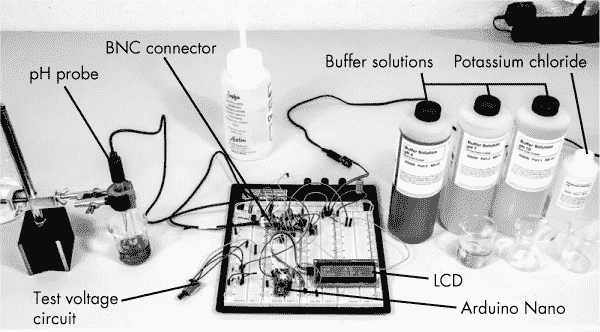

*图 7-9：这块面包板上的电路作为定制 pH 计的概念验证原型。*

除了基本的定制 pH 计电路外，我还在面包板的左上区域（在图 7-9 中可见）增加了一个单独的电路，以提供一个连续的、可变的±500mV 测试电压，这样我就可以在使用探头之前检查电路并进行一些初步的校准。这个测试电路，如图 7-10 所示，由一个独立的电压逆变器、一对电压分压器和一个调节电压的电位器组成。你可能希望将这个小电路设置在一个单独的面包板上，并用它来对完成的单元进行初步调整。

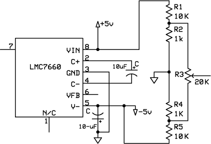

*图 7-10：此电路为定制 pH 计提供了测试电压*。

在图 7-9 中，pH 探头被一个廉价的滴定管夹固定在一个旧的机床磁性量规支架上。探头太细，无法直接安装在支架上，因此我在探头周围包裹了一些泡沫来夹紧它。

准备这个面包板比平常更加凌乱和复杂，因为面包板上有很多元件。如图 7-9 所示，我使用了一个包含四个垂直面包板和一个位于顶部用于正负轨道的条形面包板的大型面包板。最初，我使用了一个 Arduino Nano 克隆板在面包板上构建定制 pH 计。然而，在完成的版本中，我建议使用 Deek-Robot Pro Mini 板，以减少尺寸。两款 Arduino 都使用相同的 5V、16 MHz 的 Atmel 328 处理器及其他组件。为了满足与运算放大器输入连接尽可能短的要求，BNC 连接器被设置在能够提供相对直接连接到运算放大器的非反向输入的位置。电压调节器 LM7805 位于面包板的右上方，并通过 9V 碱性电池或 7.5V 至 12V 的壁式适配器供电。

下面是我构建面包板的步骤：

1.  将所有垂直方向的正负轨道（分别用红色和蓝色条纹标记）连接到面包板顶部的水平正负轨道。

1.  将电源逆变芯片（LMC7660）安装在面包板的左上方。

1.  将电容器 C3（10 μF）安装在 LMC7660 的 2 脚和 4 脚之间。（请确保观察极性：将正极连接到 2 脚，负极连接到 4 脚。）

1.  将电容器 C4（10 μF）安装在 LMC7660 的 5 脚和蓝色负极轨道之间。（请确保观察极性：电容器的正极连接到蓝色负极轨道。）

1.  将 LMC7660 的 3 脚连接到蓝色负极轨道。

1.  将 LMC7660 的 8 脚连接到红色正极轨道。

1.  将电压调节器（LM7805）插入面包板的右侧区域。

1.  将 LM7805 的 1 脚连接到一个空白行，该行将接收输入的 9V 或 7.5V 电压。（如原理图所示，它可以接受+7V 至+12V 的输入电压。）

1.  将 LM7805 的 2 脚连接到蓝色负极轨道。

1.  将 LM7805 的 3 号引脚连接到红色正电源轨。

1.  将电容 C2（1 μF）的一端从 LM7805 的 1 号引脚连接到蓝色负电源轨。

1.  将电容 C1（0.1 μF）的一端从 3 号引脚连接到蓝色负电源轨。

1.  将 TL072 集成电路插入面包板；我将其放置在第二个垂直区域。在操作芯片时，务必遵循所有防静电预防措施。

1.  尽可能缩短与 TL072 的连接，以消除可能的杂散信号。

1.  将电容 C5（0.01 μF）的一端从 TL072 的 8 号引脚连接到蓝色负电源轨。尽量将连接做得靠近芯片，以最小化杂散信号的影响。

1.  将 TL072 的 8 号引脚连接到红色正电源轨（再次使用尽可能短的跳线）。

1.  将电阻 R5（47 千欧姆）从 TL072 的 2 号引脚连接到蓝色负电源轨。

1.  将 BNC 输入插孔的中间引脚通过尽可能短的电线连接到 TL072 的 3 号引脚。

1.  将 BNC 的地线连接到蓝色负电源轨上最靠近的位置。（我使用了面板安装型 BNC 连接器，并将一根硬线拧到法兰上，这样我就能将其安装得非常接近。）

1.  将 TL072 的 4 号引脚连接到 LMC7660 的负电压（5 号引脚）。

1.  将电容 C6（0.1 μF）的一端插入 TL072 的 4 号引脚，尽量靠近芯片。

1.  将电容 C6 的另一端插入蓝色负电源轨上最靠近的位置。

1.  将电位器 R7（1 兆欧姆）的外侧引脚插入 TL072 的 1 号和 2 号引脚之间。

1.  从电位器 R7 的 2 号引脚插入一根短跳线连接到 3 号引脚。该电位器仅使用两个引脚（中间和一个端点）工作。为了规范性和稳定性，我通常将中间引脚连接到不调节的引脚。

1.  将电容 C7（0.1 μF）的一端从 TL072 的 1 号引脚连接到 2 号引脚。

1.  将电阻 R8（1 千欧姆）插入 TL072 的 1 号引脚和 6 号引脚之间。

1.  将电容 C8（0.1 μF）的一端连接到 TL072 的 6 号引脚，另一端连接到地线。

1.  将电阻 R10（10 千欧姆）连接在 TL072 的 6 号引脚和 7 号引脚之间。

1.  在面包板的空旷区域（尽量靠近 TL072），插入电位器 R4（10 千欧姆）。

1.  将电阻 R2（10 千欧姆）的一端连接到电位器 R4 的 1 号引脚。

1.  将电阻 R2 的另一端连接到负 5V（LMC7660 的 5 号引脚）。

1.  将电阻 R1（10 千欧姆）的一端连接到电位器 R4 的 3 号引脚。

1.  将电阻 R1 的另一端连接到红色正电源轨。

1.  将电位器 R4 的 2 号引脚（中间引脚或滑动端）连接到 TL072 的 5 号引脚。

1.  将电容 C9（0.1 μF）的一端连接到 TL072 的 5 号引脚（尽量靠近引脚），另一端连接到蓝色负电源轨。

1.  将 Arduino Nano 插入面包板。我将其放置在面包板从左数的第二排，以便 USB 连接易于访问。

1.  将 Nano 的 5V（27 号引脚）连接到红色正电源轨。

1.  将 Nano 的地线（29 号引脚）连接到蓝色负电源轨。

1.  将电阻 R9（1 千欧姆）的一端连接到 TL072 的 7 号引脚。

1.  将电阻 R9 的另一端连接到 Nano 的 A0（第 26 脚）。你可能需要在面包板上找一个空位，然后使用跳线。

1.  将齐纳二极管（D1）的阳极连接到 Nano 的 A0 引脚。

1.  将齐纳二极管的阴极连接到蓝色负极轨道。

1.  将电容 C10（22 μF）的正极引脚连接到 Nano 的 A0 引脚。

1.  将电容 C10 的另一引脚连接到蓝色负极轨道。

1.  为 LCD 制作一条四线电缆，包括正极、负极、SDA 和 SCL 线。（如果你从未制作过电缆，请参阅本书中使用的连接器，见第 18 页。）

1.  将 LCD 线束的正负线分别连接到红色正极和蓝色负极轨道。

1.  将 LCD 的 SDA 引脚连接到 Nano 的 A4（第 22 引脚）。

1.  将 LCD 的 SCL 引脚连接到 Nano 的 A5（第 21 引脚）。

在图 7-9 中，板子左上角会看到四个电阻和一个通过三条线连接的电位器。这是图 7-10 中的探针电压模拟电路。要接线模拟电路，进行以下连接：

1.  将电阻 R5（10 千欧）的开口端连接到负 5V（LMC7660 的第 5 引脚）。

1.  将电阻 R1（10 千欧）的开口端连接到红色正极轨道。

1.  在电阻 R1（10 千欧）和电阻 R2（1 千欧）的连接处，连接电位器 R3（20 千欧）的第 1 脚。

1.  在电位器 R4（1 千欧）和电阻 R5（10 千欧）的连接处，连接电位器 R3（20 千欧）的第 3 脚。

1.  将电位器 R3（20 千欧）的中间引脚（第 2 脚）连接到 TL072 的第 3 脚。

温度传感器不包含在面包板中。

最后，校准自定义 pH 表。我建议先使用模拟电路进行校准，然后再使用实际探针，具体步骤见下一节。

### 自定义 pH 表的校准

第一次校准自定义 pH 表可能会有点困难，但一旦熟悉了操作，就不需要太长时间，之后应该会运行得很好。首先，将标度电位器和偏置电位器都调整到其范围的中间位置。因为 pH 7 是中性，所以从 pH 7 开始，将探针放入 pH 7 溶液中，并调整偏置电位器，直到显示屏显示为 7.00。

接下来，清洁探针，将其放入 pH 4 溶液中，并调整标度微调器，直到显示屏显示为 4.00。之后，再次清洁探针，重新测试 pH 7 溶液；读数应该接近中心。如果偏离中心，则再次调整偏置，使其精确为 7.0，并重复此过程。这一次，调整标度到 pH 4.0 只需要很小的调整。现在，将探针放入 pH 10 缓冲溶液中，检查显示，看看读数偏离多少，并相应调整标度微调器。重复这一过程，直到读数与所有三个缓冲溶液匹配。（大约三到四次尝试，调整标度和偏置后，我将其完美校准。）

当你确认仪表工作正常后，我建议你重置它并重新校准以进行练习。第二次我做得更快，只用了两次重复。我在大约三周的时间里多次检查了我的 pH 计，发现它似乎保持了良好的校准状态；你应该也能获得类似的结果。

**注意**

*作为初步测试，我还使用了图 7-10 中的测试电压电路进行初步校准。你还需要一个数字电压表。我从 0V 开始，调整偏置电位器，直到 LCD 显示 pH 为 7。接下来，我调整测试电压电路，使其在数字电压表上输出 180mV，并转动刻度电位器，直到 LCD 显示 pH 为 10。我然后将测试电压调整为-180mV，并调整刻度，直到 LCD 显示 pH 为 4。经过几次尝试后，我得到了不错的结果，于是我断开了测试电源并替换成了探头。这一次，我只用了一个尝试就成功校准了仪表*。

当你的仪表搭建并校准好后，试着用一些常见的家庭产品进行测试，比如这些：

• 可口可乐经典：pH 2.5

• 橙汁：pH 2.8

• 咖啡：pH 5.0

• 5%氨水溶液：pH 11

• 漂白水：pH 11.9

**从模拟思维角度看**

我们这些老古董仍然喜欢模拟读数，对于那些仍徘徊在 20 世纪的坚持者，我在图 7-6 和 7-7 的原理图中、草图以及最终的屏蔽 PCB 文件中包括了使用模拟读数的设置。这是一个稍微的后期想法，是可选的，因此屏蔽板中没有包括仪表的串联电阻器；然而，Pro Mini 与读数器的引脚连接是有的。所需的单个电阻器可以安装在仪表表头的背面。在图 7-11 中，我只是将仪表连接到面包板电路中。

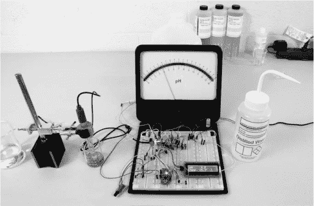

*图 7-11：定制 pH 计面包板电路，包含数字显示和 20mA 表头*

多年来，我收集了模拟表和表头；所示的仪表是一个 Simpson 20mA 表头。为了驱动该仪表，我简单地使用了 Pro Mini 上引脚 5 和 6 的 PWM（脉宽调制）输出，直接连接到仪表，并串联一个电阻器。在草图中，我将仪表居中在 0V，因此它使用正负电压。

最终，我使用了一个可变电阻器，将模拟表的最小值和最大值分别设置为-420mV 和+420mV。这样解决了尝试设置增益和偏移以匹配数字读数的问题。然而，这并不会影响任何读数的准确性，数字和模拟读数是匹配的。它们也在整个 pH 范围内完全一致。

对于许多仪表，可以拆卸外壳以方便更换不同的刻度，如图 7-11 中所示。本项目的仪表面板是用激光打印机制作的，以使刻度反映 pH 值并显示用于参考的 mV 刻度。你可以使用 Corel Draw 或 Adobe Illustrator 等绘图程序制作一个精美的刻度，并购买带有粘性背面的标签纸，将其粘贴到原始仪表板上。只需小心操作，避免在过程中损坏指针或机芯。

### 关于温度的影响

到目前为止，我还没有处理温度问题，但溶液的 pH 值是温度依赖的，正如图 7-12 所示。

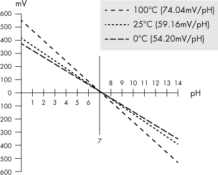

*图 7-12：pH 值如何随温度变化*

温度对 pH 值的影响在接近室温（25°C）时是微不足道的。实际上，根据图表，从 25°C 到 0°C 的 pH 差异在两端的 pH 值极限处仅为半个 pH 单位。然而，在 100°C 时，差异更加明显，可能达到 1.5 个 pH 单位。

有了这些信息，问题就变成了如何处理温度对 pH 值的影响。

#### *添加温度传感器*

解决温度影响的第一步是将一个温度传感器包含在电路中，这样自定义 pH 计就能知道温度是多少。在 Arduino 平台上，最简单且应用最广泛的温度传感器之一是 LM35，根据数据表，该传感器在 25°C 时输出线性 10mV/°C，并具有半度的准确度。你可以在图 7-6 和 7-7 的电路图中看到这个传感器。

我连接了芯片并将其包含在电路图中，但我有些担心其准确性。不幸的是，我没有国家标准与技术研究院（NIST）的温度标准可以参考，于是我将 Arduino 传感器的读数与玻璃科学温度计、双金属拨盘温度计以及 Radio Shack 数字温度计进行了比较。结果是这些设备的读数彼此不一致，也与 Arduino 的读数不符。

#### *检查准确性*

校准温度传感器的显而易见方法是将其与我非常了解的两个温度值进行比较：蒸馏水的冰点和沸点（在海平面上）。因为我住在海平面以上大约 12 英尺的地方，所以海拔高度不成问题。冰水和沸水测试的结果表明，传感器的读数确实偏差了大约 2%。这可能是外部电路中的某些因素造成的，例如参考电压，这在电路图中已有补偿。温度 IC 和连接部分被热缩管保护，以避免水分进入连接部分，具体内容可以参见《构建》章节中的第 211 页。

根据我在此项目中使用的玻璃电极制造商的说明，温度引起的误差可以按以下方式计算：

pH 误差 = 0.003 × (校准温度 − 当前温度) × (中性 pH − 实际 pH)

例如，如果电极在室温（25°C）下校准，并且测量的样本 pH 值约为 4，温度约为 5°C，则误差计算如下：

1.  计算温差：25°C – 5°C = 20°C

1.  计算 pH 值与中性 pH 值的差距：7 pH – 4 pH = 3 pH

1.  总误差为：0.003 × 20 × 3 = 0.18 pH。

截至目前为止，我还没有尝试将温度读数集成到草图中以自动调整 pH 值。然而，定制 pH 计在 LCD 屏幕上显示温度，因此你可以决定是否值得进行调整。正如你在图 7-12 中看到的，温度对 pH 值的影响是微小的，可以通过图表近似，或者用类似我的测试方法计算出来。

你的大多数测量值很可能会在室温下或接近室温。温度补偿通常只在恶劣的环境和工业环境中需要。如果你在极端温度下进行 pH 测量，你可能想在草图中加入该公式。

**注意**

*如果你感兴趣，可以阅读更多关于如何补偿由于温度导致的 pH 探头读数误差的内容，网址为* [`www.qclscientific.com/electrochem/phtemp%20comp.html`](http://www.qclscientific.com/electrochem/phtemp%20comp.html)。

### 草图

定制 pH 计草图，像本书中的许多草图一样，包含了其他草图和示例的部分。我在整个代码中加入了注释，描述了最重要的部分是如何工作的。该设备是在 Arduino IDE 版本 1.0.5-r2 上进行测试和使用的。

```
//Custom pH Meter Sketch
//Smoothes both temperature and pH

#include <Wire.h>
#include <LiquidCrystal_I2C.h>
/* Visit http://playground.arduino.cc/Main/I2cScanner for code
  you can run to figure out your LCD's I2C address if 0x27 doesn't work. */
LiquidCrystal_I2C lcd(0x27, 16, 2); //16x2 display
//There are a couple of libraries out there. The one I used was
//simply Liquid Crystal_I2C for a generic type display.
const int numReadings = 10;
const int numReadings2 = 20;
const int meterOut1 = 5;
const int meterOut2 = 6;

float readings[numReadings];         //The readings from the analog input
float readings2[numReadings2];

int index = 0;                       //The index of the current reading
int index2 = 0;
float total = 0;                     //The running total
float total2 = 0;

float average = 0;                  //The average
float average2 = 0;

int pHpin = A0;
int tempPin = A1;
int meterdrive1;
int meterdrive2;

int pHvalue = 0;
float val;
float val2;
float tempC;
float temp2;
void setup() {
  lcd.init(); //You may have to use a different command, depending on the
             //library you use
  lcd.backlight();
  pinMode(meterOut1, OUTPUT);
  pinMode(meterOut2, OUTPUT);

  //Initialize serial communication with computer:
  Serial.begin(9600);

  //Initialize all the pH and temperature readings to 0:
  for(int thisReading = 0; thisReading < numReadings; thisReading++) {
    readings[thisReading] = 0;
  }
  for(int thisReading2 = 0; thisReading2 < numReadings2; thisReading2++) {
    readings2[thisReading2] = 0;
  }

  //Configure the reference voltage used for analog input to 1.1V
  analogReference(INTERNAL);
}

void loop() {

  tempC = analogRead(tempPin);
  temp2 = tempC/9.31; //My calibration factor was 9.31, as determined
                     //by the boiling water and ice tests

  pHvalue = analogRead(pHpin);

  val = map(pHvalue, 0, 1023, 0, 1400);
  val = constrain(val, 0, 1400);

  val2 = val/100;

  meterdrive1 = map(average, 0, 14, 0, 255);
  meterdrive2 = map(average, 14, 0, 0, 255);

  analogWrite(meterOut1, meterdrive1);
  analogWrite(meterOut2, meterdrive2);

  //Subtract the last reading:
  total = total - readings[index];

  //Read from the sensor:
  readings [index] = val2;

  //Add the new reading to the total:
  total = total + readings[index];

  //Advance to the next position in the array:
  index = index + 1;

  //If we're at the end of the array…
  if(index >= numReadings)
    //…wrap around to the beginning:
    index = 0;

  //Calculate the average:
  average = total / numReadings;

  //Subtract the last reading:
  total2 = total2 - readings2[index2];

  //Get readings from the temperature sensor:
  readings2 [index2] = temp2;

  //Add the temperature reading to the total:
  total2 = total2 + readings2[index2];

  //Advance to the next position in the array:
  index2 = index2 + 1;

  //If we're at the end of the array…
  if(index2 >= numReadings2)
    //…wrap around to the beginning:
    index2 = 0;

  //Calculate the average:

  average2 = total2 / numReadings2;

  delay(1);                   //Delay between reads for stability

  lcd.setCursor(0,0);
  lcd.print("pH");
  lcd.setCursor(4,0);
  lcd.print("               ");
  lcd.setCursor(7,0);
  lcd.print(average,2);      //Truncate to two decimal places
  lcd.setCursor(0,1);

  lcd.print("Temp ");
  lcd.print(average2*.98,1); //Error calculated from empirical measurement
  lcd.print((char)223);      //Print the degree symbol
/* This may vary depending on display. One display used ((char)178) for the
degree symbol.*/
  lcd.print("  C");

  delay(600);  

}
```

基本的 pH 测量功能非常简单：它从运算放大器电路的模拟输出读取一个模拟值，并将该值传输到 Pro Mini 的模拟输入引脚。每次主循环运行时都会读取 pH 值和温度，然后分别将它们存储在 `pHvalue` 和 `tempC` 中。我第一版的草图直接将这些值打印到 LCD 屏幕上。

但是，当我在面包板上布置电路并调整组件时，我注意到输出有些跳动。pH 值波动大约两到三十分之一的 pH 单位，围绕某个核心值上下波动。例如，读数可能从 pH 4 跳到 4.1，再到 3.9，然后回到 4。

#### *平滑 pH 和温度输出*

我重新回到设计图板前。调整电路，试图找出跳动的原因，但未能解决。然后，因为 pH 值不太可能快速变化，我决定对几个读数进行平均。虽然这稳定了读数，但缺点是，我取样越多，读数的速度就越慢。

然而，我认为这不是问题，因为我使用过的一些昂贵的商业 pH 仪表也需要一些时间才能稳定，很可能是由于相同的原因。但仍然有改进的空间。

幸运的是，Arduino 网站上有一个由 David Mellis 编写，后来由 Tom Igoe 修改的有用草图，使用数组来平滑信号。（你可以在 *[`www.arduino.cc/en/Tutorial/Smoothing/`](https://www.arduino.cc/en/Tutorial/Smoothing/)* 上看到完整的原始草图。）我将这个示例作为模型，在本项目的草图中平滑 pH 电压。我尝试了几种不同的值，发现 5 到 10 个样本之间的值效果最佳。我将 `numReadings` 设置为 10，这样就减少了稳定期的拖延，并且平滑效果相当好。书中显示的草图将平滑后的结果存储在 `average` 变量中，并在主循环结束时打印到 LCD 屏幕。此外，我继续微调电路，使得草图需要的平均值越来越少。

请注意，在处理来自温度传感电路输入的草图部分中，也采用了相同的平滑技术。（`average2` 变量包含平滑后的温度读数结果。）这是必要的，因为平滑 pH 电压时需要做同样的事情：即使是温度传感器输出也有些许波动。我最初的怀疑是，可能是 Arduino Pro Mini 及其电压参考导致了 pH 和温度电压的波动。然而，我将温度传感器直接连接到我的万用表，并使用过滤良好的电源，结果还是出现了同样的干扰。最终，平滑方法解决了这个问题。

**注意**

*虽然这个草图中使用的平滑方法效果很好，但这并不是唯一的选择。例如，移动平均法也可以很好地工作*。

#### *居中一个模拟仪表*

如果你选择使用模拟仪表，Arduino 需要驱动仪表的正负两端。草图将仪表驱动映射到两个引脚的 PWM 值反转，如下所示。

```
meterdrive1 = map(average, 0, 14, 0, 255);
meterdrive2 = map(average, 14, 0, 0, 255);
```

为了获得 `meterdrive1`，将平均值（测量的 pH 值的平均值）从 0 映射到 14，而 `meterdrive2` 是将相同的平均值从 14 映射到 0。两个映射都使用了 Arduino 预加载库中的 `map()` 函数。

`map()` 函数是一个有用的工具，它允许你将一个数字从一个范围映射到另一个范围。其语法如下：

```
map(value, fromLow, fromHigh, toLow, toHigh)
```

`map()` 函数可以用于调整一组值，或者像在此案例中，将值从 0 到 14 反向映射至 14 到 0。如果你想使用模拟仪表并且不想将指示器重置到中心位置，你可以简单地使用输出引脚 5 或引脚 6（将不使用的引脚留空），并改变电阻的值以获得正确的读数。

**关于有效数字的说明**

以下这行代码将 pH 值显示到 LCD 上，显示两位小数：

```
lcd.print(average,2); //Truncate to two decimal places
```

草图的早期版本中调用了`lcd.print(average,1)`，只显示一位小数，但当我试图最小化自定义 pH 计的抖动时，我更改了显示代码，加入了两位小数，以便实现更精细的分度。大部分时间，pH 读取值即使到第二位小数也保持极其稳定。

在最终的草图中，我保留了两位小数，但老实说，我不确定第二位小数的意义或准确性有多高。当探头浸入溶液中时，它有轻微的漂移倾向，我认为这是正常现象。我认真研究并学习了比我想知道的更多关于*有效数字*（测量中具有实际意义的数字）的知识，但仍然没有得到一个确切的答案。

结论是：我阅读的所有关于 pH 值的文献都讨论了整数形式的 pH 值——或者在最好的情况下，只有到十分位。只有在一些科学和工业应用的参考中，才会涉及到百分位。

对于大多数实际应用，如果你愿意，可以将草图更改为只使用一个有效数字。我也强烈建议你在初步校准期间只使用一个有效数字，因为额外的数字可能会造成混淆。如果你非得要使用第二个有效数字（也许更多的是出于自尊心），你可以重新添加它，但要知道它的准确性存疑，并且根据我的经验，它实际上并没有带来什么额外的好处。

### 屏蔽层

本项目中显示在图 7-13 中的自定义 pH 计屏蔽层旨在最大限度地减少 pH 探头对输入的噪声。Pro Mini 和 LCD 会产生一些电噪声，因此，所有活跃的模拟输入组件都位于 PCB 的一端，而 Pro Mini 和显示器的接口则位于板的另一端。反相器 IC 及相关组件位于 Pro Mini 下方，以节省空间。

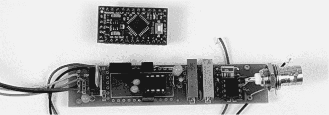

*图 7-13：屏蔽层 PCB 上仅为本项目在 Pro Mini 上使用的引脚焊接了插头。电压反相器和电容器位于 Pro Mini 将要插入的位置下方*。

对于这个项目，我决定使用双面电路板。这使得 PCB 布局比试图将所有东西挤到一面上简单得多，并且它允许放大器、缓冲阶段 IC 及相关组件紧密排列。你可以在图 7-14 中看到这个屏蔽层的布局文件，你可以与本书的其他资源文件一起下载。

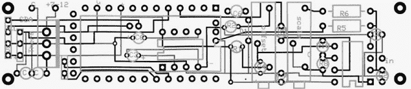

*图 7-14：屏蔽层中的顶部走线最暗，底部走线次之，丝网印刷层最浅。请注意，丝网印刷层显示了围绕各种组件的框*。

图 7-15 展示了完成的印刷电路板，显示了装配前后的情况。在装配这块板时，要采取预防措施防止静电损坏 TL072 芯片。由于该芯片具有非常高的输入阻抗，因此对静电放电特别敏感。我使用了一个插座来固定运算放大器，这样万一它损坏，更换起来就不需要大费周章。

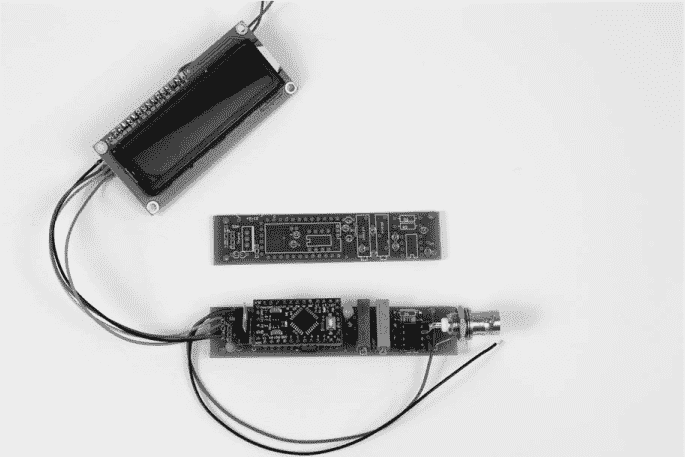

*图 7-15：装配前后屏蔽 PCB 的情况。电压逆变器及其相关组件位于 Pro Mini 下方。装配后的版本显示了与显示器连接的情况*。

还要注意，许多电阻器在这个 PCB 上是垂直安装的，以节省空间并减少引线长度和电路板布线长度。我使用了 0.100 英寸的女性针脚头来安装 Pro Mini，这样就为下面的组件留出了充足的空间。并不需要完全填充所有针脚头来适配 Pro Mini 的所有引脚；只需要足够的针脚头来机械支撑 Pro Mini 并提供必要的电气连接。我发现，将针脚头放在至少一侧的最末端可以对齐引脚，简化将 Pro Mini 板插入时的对准工作。

### 构建

确保草图已经加载到 Arduino 中，并且现在将所有组件焊接到你的 PCB 上，包括电源和接地的线缆以及（可选的）温度传感器插座的线缆。现在也将运算放大器插入其插座，但要弯曲运算放大器的第 3 针，使其突出。你需要在后续的构建过程中访问第 3 针。

当定制 pH 计电路已焊接完毕并将草图加载到 Arduino 时，实际构建过程只剩下最后一步：将一切放入保护外壳中。本节描述了一些关于外壳和如何将电路板安装到外壳中的建议。图 7-16 展示了完成的外壳。

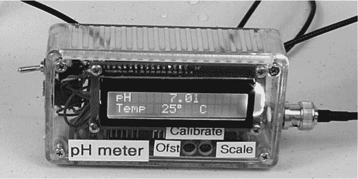

*图 7-16：完成的定制 pH 计放入外壳中。此特写图说明了偏移（标注为*Ofst）*和增益（标注为*Scale）*校准调整孔的位置*。

#### *定制 pH 计外壳*

你选择外壳的方式将取决于你如何使用定制 pH 计，是否选择包括模拟仪表，以及所需的便携性。我选择了一个标准的 ABS 透明塑料盒，外部尺寸大约为 1.3×2.45×4.4 英寸。空间比我预期的要紧凑一些，但我还是能够将印刷电路板、显示器、开关、连接器和电池挤进盒子里。

##### 为显示器腾出空间

这个项目的外壳是 Hammond Manufacturing 公司生产的 1591 BTCL 型号的盒子。图 7-17 展示了塑料盒顶部的图纸，标明了切割显示孔和钻孔位置的线条。

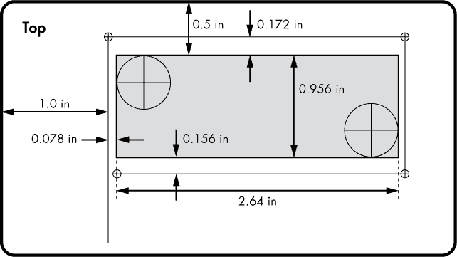

*图 7-17：外壳盖的模板，显示 16×2 显示器的开口（阴影区域）和钻孔位置*

你可以下载本书的资源文件（见 *[`www.nostarch.com/arduinoplayground/`](https://www.nostarch.com/arduinoplayground/)*)，并将其作为打孔模板使用。

我需要尽可能多的垂直空间来容纳电池，因此需要切割外壳的顶部。但要小心：有些显示器的尺寸可能略有不同，所以在切割之前请先测量你的显示器并与图纸对比。如果有差异，请调整测量值。

外壳所用的 ABS 塑料容易切割，因此切割显示孔应该不会遇到重大问题。在开始之前，请将外壳牢固地夹在一块附着在工作台或桌子上的废木板上。

**警告**

*当你使用较大的钻头钻入薄层 ABS 塑料时，钻头容易抓住塑料。请勿手持外壳进行操作*。

要遵循此模板，首先在显示区域的对角线两端的角落中钻两个大孔，使用冲击标记作为中心。我发现 1/2 英寸的孔大小刚好合适，但只要孔足够大，能容纳你用来切割的锯片就可以。你可能希望先用小钻头钻一个 1/2 英寸孔的中心，以确保孔的位置正确。然后，使用钥匙孔锯切割出较小的矩形。

为了确保电池有足够的空间，我建议将显示器安装在偏离中心的位置，如图 7-16 所示，并按照图 7-17 中的尺寸进行安装。当显示孔切割完成后，用#30 或 1/8 英寸的钻头钻小孔，用于安装 LCD 显示器，并配合 4-40 螺丝。

##### 钻孔用于其他硬件

一旦顶部准备好，根据图 7-18 中的模板，在外壳主体的两个较小的侧面上钻孔，用于 BNC 连接器（A）、开关（B）、电源输入开关（C）和可选的温度插孔（D）。BNC 连接器的孔为 3/8 英寸，而开关和温度插孔的孔均为 1/4 英寸。

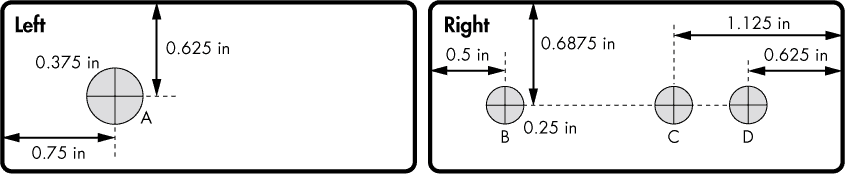

*图 7-18：外壳左侧 BNC 连接器（A）孔和右侧开关（B）、电池/交流开关（C）以及可选的 3.5 毫米温度传感器输入插孔（D）孔的近似布局*。

#### *安装电路板*

最后，选择将印刷电路板安装到机壳内的位置。对于我制作的两个 pH 计，我将一个没有元件的盾牌 PCB 放置在外壳内，标记了塑料上四个安装孔的位置；如果你愿意，也可以使用本书资源文件中的板布局打印图纸作为模板。标记好四个孔后，轻轻用中心冲击器打点并钻孔。小心不要弄裂塑料外壳，并确保它们与 PCB 上的安装孔对齐。我建议使用#41 钻头（大约 3/32 英寸）来钻这些孔。

如果你使用本书附带的盾牌设计，可能还需要将电路板的安装孔钻孔至正确的大小。传统的制造方法建议使用垫片、螺丝和螺母将电路板固定在外壳内，但我选择了直接在电路板上钻孔并攻丝。我使用了#50 钻头在四个角落钻孔，并使用 2-56 攻丝器进行攻丝。然后，我用 2-56 螺丝将电路板固定到位。虽然这种做法并不适用于所有应用场景，但由于电路板比较轻，这种方法效果不错。

此外，我并不认为制作完成的 pH 计会遭受过多的物理冲击。考虑到这一点，我只是在电路板的无元件一侧放了一条泡沫条，并将电路板轻轻地固定在外壳侧面——但是不要太紧。如果你预计该设备将经历反复且剧烈的震动，可以在组装前在螺纹上涂抹一小滴 Thread-Lok 或其他厌氧胶粘剂。

一旦电路板安装好，标记增益和偏置微调电位器的接入孔位置。将外壳盖放在外壳上，直视盖子，使用马克笔标记两个微调孔的位置。移除外壳顶部后，钻出 1/4 英寸的孔，对应微调电位器上的螺丝头（见图 7-16）。

#### *安装其他硬件*

现在你可以安装 BNC 连接器、开关、电源开关和（可选的）温度插口。我发现最好先将开关和插口安装到外壳内，然后再将线缆焊接到它们上面。同样的技巧也适用于 BNC 连接器，虽然你可能希望提前将接地线焊接好。我取了一根 22 号实心线，将它绕在连接器底座上三分之四圈，用固定螺母拧紧，然后将它焊接到 PCB 上的接地点（见图 7-13）。

**注意**

*虽然我没有为个人制作的设备引出模拟仪表的信号，但如果你制作这块盾牌，你会看到两个信号连接点，它们周围有一个小方框标记*。

##### 连接探头到运算放大器

“高阻抗探头集成”在第 193 页中描述了使用 pH 探头作为定制 pH 计输入时的特殊注意事项。事实证明，即使是高质量的 FR-4 电路板材料，也可能由于表面污垢或潮气等污染而导致一些电流泄漏。为了最小化泄漏，将 IC 的输入直接连接到探头。为此，将 IC 放置在接近外壳内 BNC 连接器的位置。然后，代替将运算放大器的第 3 针焊接到电路板上或插入插座，将其弯曲并直接接线到 BNC 连接器（见图 7-19）。

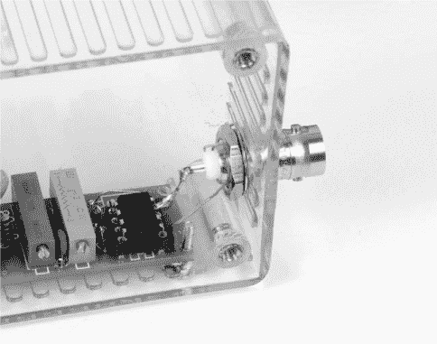

*图 7-19：为了最小化杂散信号，从 BNC 连接器到 IC 引脚的连接直接焊接。*

因为这是电路中唯一的高阻抗部分，运算放大器数据表中提到的其他一些预防措施（例如在其他输入周围使用接地隔离环）并不需要。然而，这个项目的屏蔽 PCB 确实保持了关键信号线尽可能短，并将组件放置得很近。

##### 连接温度传感器

对于可选的温度传感器，你需要在外壳内安装一个 3.5 毫米的三导体插孔；该孔的位置在图 7-18 中标记为 D。将这个插孔与 PCB 上温度 IC 的连接端子连接，这些端子位于图 7-20 中显示连接器和调节 IC 之间的三个孔。插头的套筒为接地，环为正极，尖端为温度传感 IC 的输出。

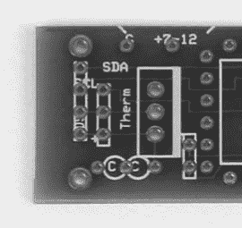

*图 7-20：温度传感 IC 的三个连接就在“Therm”字样的上方。*

你可以通过将 IC 封装在一段短的热收缩管内并加上密封剂来保护 IC 免受液体侵入，如图 7-21 所示。这种热收缩管可以在网上轻松购买。管内的密封剂应能为 IC 提供完全防水的密封。封装 IC 时，只需将其插入管内，并使用热风枪或高温的吹风机加热，直到完全封住。

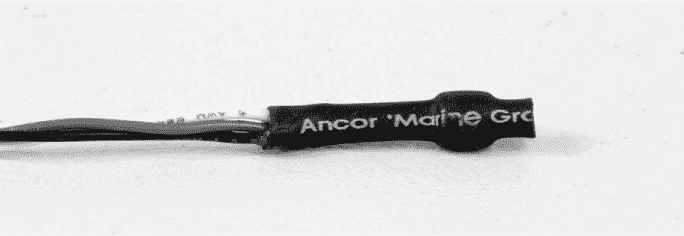

*图 7-21：这个 LM35 温度 IC 完全包裹在一段短的热收缩管内，里面填充了密封的热凝胶。热凝胶几乎不可见，只能在电线进入管道的地方看到一些。*

一旦所有硬件都安装在外壳内，所有组件都焊接到 PCB 上后，将 LCD 固定在盖子上并封闭，完成组装。你可能还需要像图 7-16 所示那样标记你的电位计和开关，以便日后操作更加方便。
