## 第九章：两种弹道测速仪**


这个项目是用来测量弹丸速度的设备。最初它是用来测量气枪和彩弹枪的子弹速度，后来它发展为能够测量 BB 枪和弹丸枪的弹丸速度，最终能测量高达每秒 3,000 英尺（fps）以上的高功率武器的速度。这个项目的主要目标不是测量传统火器的速度，但它确实具备这个能力，本章的最后部分将介绍如何使用它来测量 9 毫米子弹的速度。

弹道测速仪本来设计得很简单，但结果比原计划稍微复杂了一些。最终产生了两个项目：完整的弹道测速仪和一个更小巧、更简单的设备，我称之为 Chronograph Lite（见图 8-1）。

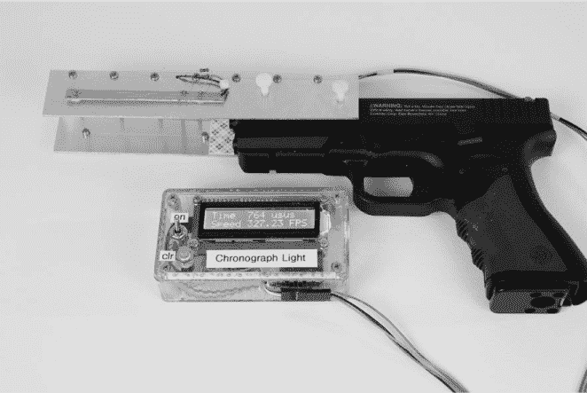

*图 8-1：附有弹丸加速度通道的 Chronograph Lite，连接到 0.177 口径的弹丸枪*

我尽力让每个弹道测速仪系统既灵活又精确。灵活性来自于将传感器元素与读数分开，并允许不同类型的传感器用于测量不同设备——并且使用相同的加速度通道产生不同的读数。

在这个项目中，你将使用一些在 Arduino 项目中不常见的元件，如晶体振荡器来提供精确的定时（与 Nano 中使用的晶体振荡器不同）、红外 LED、光电晶体管、逻辑门、12 级数字计数器和数字-模拟转换器（DAC）来帮助执行计数功能。

**警告提示**

本着对 Jean Shepherd 的*《圣诞故事》*的敬意（在其中每个人都警告 Ralphie，“你会把眼睛射瞎！”），请记住，任何火器本身都具有危险性，许多气动武器也能发射致命力量。无论你测试的是气动设备还是使用高能子弹的武器，都要格外小心。完整的弹道测速仪和 Lite 版本主要是为使用 CO[2]和气动装置加速弹丸的低功率武器开发、测试并制造的。虽然该设备能够测量传统火器的子弹速度，比如前面提到的 9 毫米手枪，但它并未为此应用进行开发或测试。我强烈建议你不要尝试将本章中构建的设备用于此类应用。

### 什么是弹道测速仪？

用于测量从火器中发射的高速弹丸速度的设备通常被称为*弹道测速仪*。术语*测速仪*是从钟表学领域借用过来的，现在广泛用于描述用于测量子弹、箭、飞镖等速度的仪器。

本章介绍了两种版本的弹道计：一种能够准确测量高速弹丸的版本，以及一种提供稍低精度但实现更加简便的轻量版。尽管我将较简单的版本称为“轻量版”，但它绝不是不成熟的设计。

#### *商业弹道计*

市面上有多种商业弹道计，大多数是为高功率手枪和步枪设计的。弹道计通常被放置在射手前方的地面或桌面上。大多数流行的商业设备依赖于环境光照进行工作，因此它们无法在室内或阴天使用。虽然这些设备价格适中，但并不算便宜。

弹道计的种类从简单的双线设备（至今仍在使用，并且被一些人认为是最准确的）到相对复杂的设备，这些设备具有数字存储、平均速度计算及其他功能。双线方法仅使用两根细线（36 号或 40 号线即可），将它们拉伸并精确地放置在两组接触点之间。弹丸发射后，首先打断第一根线，启动计时器；然后，如果瞄准准确，打断第二根线，停止计时器。根据两次线断裂之间的时间，计算出以英尺或米为单位的速度。最早的弹道计是用时钟构建的，通过一排 LED 显示的数字 1 和 0 进行读数。这个二进制数需要转换为十进制数，然后与线之间的距离一起计算出速度。

#### *测量枪口速度*

现在你知道了市面上有哪些现成的弹道计，我们来看看该设备的物理原理。离开武器枪口的弹丸由某种推进剂（如空气、CO[2]，或是火药快速氧化产生的气体）赋予它速度。弹丸沿枪管前进并离开枪口。弹丸离开枪口时的速度称为*枪口速度*。

空气动力枪的枪口速度会因多个因素而有所不同，包括推进剂的装药量、枪管的清洁度和弹丸与枪管的匹配。某些空气步枪的压力可以被充至近 3000 psi（每平方英寸磅），以便发射较大的弹丸，且射速相对较高。这些大口径空气枪的枪口速度相对较低，通常在 1000 fps 以下，但威力十足。与常规空气步枪（通常发射直径为 0.177 英寸的弹丸，提供 15 到 25 英尺磅（ft-lbs）动能）相比，这些大口径步枪提供 500 到 700 英尺磅的动能。

理想情况下，你希望尽可能靠近枪管的末端测量速度。然而，这可能比较困难，一些计速器制造商声称，在前几英尺（甚至几码）的飞行中，速度变化不大。另一方面，毫无疑问空气阻力是一个显著的因素，飞行物在前几英尺内会至少有一定的减速，特别是对于较大的飞行物来说。

#### *本项目的做法*

就像两线式弹道计速器系统一样，我们尝试测量飞行物穿越固定距离所需的时间。但与打断细线不同，该项目利用了红外光源和光敏接收器，如图 8-2 所示。


*图 8-2：测量飞行物速度的基本原理是让飞行物打断光束启动计时器，然后打断另一个光束停止计时器*。

两对 LED 和红外传感器被布置成红外传感器通常能够检测光源。但是当飞行物穿过第一对传感器的光束时，传感器会变暗并改变其电气状态。处理器检测到这一变化并启动定时器。当飞行物中断第二对源/接收器的光束时，定时器停止。这两组光源和接收器之间的距离被精确设置，因此可以相对容易地计算出飞行物的速度。

举个简单的例子，假设光束的间距是 1 英尺。当飞行物打断第一个光束时，计时器开始；当飞行物打断第二个光束时，计时器停止。如果微控制器的计时器测得是 1 秒，那么速度就是 1 英尺每秒，或 1 fps。

该系统可以用于各种飞行物，并在 LCD 上提供数字读数。与其他方法不同，该设备将传感器组与电子设备分离开来，因此，如果需要，可以为不同的枪械或甚至不同的应用场景更换不同的传感器。例如，你可以设置一个传感器通道，通过它做一些基础的物理实验，记录小物体掉落的速度。

### Chronograph Lite

首先，我们来看一下 Chronograph Lite，它非常容易构建，并且只有少量部件。

#### *所需工具*

焊接铁和焊料

电钻和钻头（1/2、1/4 和 1/8 英寸）

十字螺丝刀和平头螺丝刀

锯子（钥孔锯或伐木锯）

#### *零件清单*

一块 Arduino Pro Mini 或其克隆版

两个红外 LED，波长约为 650–850 纳米；两个红外光电传感器（我使用了霍尼韦尔 Optoschmitt SA5600 型）。

**注意**

*有些用户在将红外 LED 与 Optoschmitt 光传感器匹配时遇到了问题。如果你碰到这个问题，可以尝试使用霍尼韦尔 SE3450/5450 或同等产品。另一种选择是使用两个 Adafruit IR Break Beams（零件号 #2167），而不是单独的 LED 和传感器。IR Break Beams 适用于 Chronograph Lite，但需要对输出进行反向处理，以便适配完整版。）*

一个 270 欧姆、1/8 W 电阻（可选）两个 10 千欧姆、1/8 W 电阻（如果使用光电晶体管而非 Optoschmitt 光传感器）

一个包含两对 LED/传感器的通道 一个 16×2 LCD 屏幕

一个 I²C 适配器，如果 LCD 没有包含的话 一个 x4 适配器外壳（见“本书使用的连接器” 在 第 18 页）

四个母头插针（见“本书使用的连接器” 在 第 18 页）

一个 SPST 开关 一个瞬时 NO 开关

一个 9V 电池连接器

一个 9V 电池

一个 Hammond 1591 BTCL 外壳或同等产品

两个 7 1/2 × 1 1/2 × 0.06 英寸铝片

一块 1 3/8 × 7 1/2 英寸的 1 3/8 英寸丙烯酸板

两个 #10-24×1 英寸尼龙螺钉

两个 #10×24 尼龙螺母

四个 4-40×1/2 英寸螺钉

八个 4-40 螺母

四个 4-40 螺母垫圈

各种 28 号连接线

#### *下载链接*

**草图** *ChronographLite.ino*

**模板** *PanelCutoutLite.pdf, PanelCutout.pdf, AccelerationChannel.pdf*

#### *原理图*

在 Arduino 主板外，项目的电路并不复杂。图 8-3 中的原理图使用 I²C 总线为 LCD 提供电源，两个光电传感器的连接以及两个清除开关的连接。

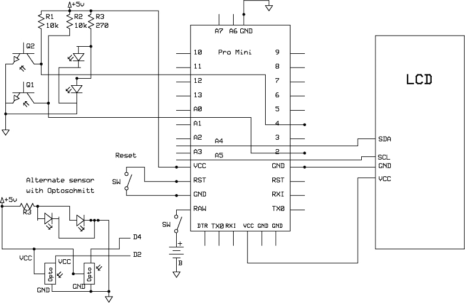

*图 8-3：Chronograph Lite 的原理图。主原理图显示了光电晶体管，而备用部分则显示了霍尼韦尔 Optoschmitt 传感器（左下角）*。

#### *构建测试平台*

图 8-4 展示了用于验证概念并开发草图的测试平台。我建议你先自己动手制作一个，并将 LED 和光电传感器安装进去，然后再搭建面包板。

对于这个测试平台，我剪切了两块约 2×6 英寸的纸板，并打孔使其适配两个红外 LED 和光电晶体管的对接位置，两个传感器之间间隔为 3 英寸。然后，我将纸板用螺丝固定到一块 1 英寸厚的木板上，你也可以选择用胶水或钉书钉固定。制作时，确保每个光电晶体管与红外 LED 在通道中直接对面。

安装红外 LED 和光电晶体管到测试平台后，我建议按照以下方式为面包板做准备：

1.  用一根电线将两个红外 LED 的正极连接起来，可以通过焊接或绕线方式进行连接。

1.  将一根 24 英寸长的电线焊接到组合的 LED 正极。如果你使用的是适合面包板的实心线，只需将 24 英寸电线的另一端剥皮即可。如果你使用的是绞线芯电缆，则需要将一个男性压接针连接到电线的末端。

1.  使用电线将两个红外 LED 的阴极连接起来，可以通过焊接或包线方式连接。

1.  使用电线将两个光电晶体管发射极连接起来，可以通过焊接或包线方式连接。

1.  将合并后的红外 LED 阴极连接到合并后的光电晶体管发射极；我建议焊接一根长线。

1.  将一根 24 英寸的电线焊接到合并的 LED 阴极和光电晶体管发射极上，并像第 2 步那样在电线的另一端做上公端压接针。

1.  将一根 24 英寸的电线焊接到每个光电晶体管的集电极上，并像第 2 步那样在电线的另一端做上公端压接针。

在图 8-4 中，LED 和光传感器（根据选择，这些将是光电晶体管或 Honeywell Optoschmitt 传感器）被放置在加速通道纸板上打的孔中。

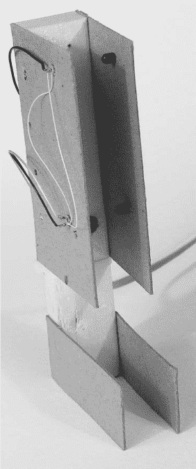

*图 8-4：我最初用来验证测速仪概念的测试台*

我使用了一个相对较小的打孔器，以便利用摩擦力将它们固定到位。你也可以使用热熔胶或接触胶将它们粘在一起。我使用了一根 24 英寸长的四导线电话线来连接通道和面包板，但任何电线都可以。在完成的版本和其他原型中，我只用了四根 30 号铜线，因为它们更灵活。或者，你现在也可以构建最终的传感器通道。

LED 和光电晶体管需要按照图 8-3 中的电路图连接到 Arduino 上。我将 LED 的正极通过一个 270 欧姆电阻（R3）连接到电源上。对于光电晶体管，我将它们设置为发射极接地，每个集电极通过 10 千欧电阻（R1 和 R2）连接到电源的正极，以实现开集电极配置。因此，如果光束被中断，光电晶体管将导通，集电极的电压会下降。

****注意****

*如果使用 Honeywell Optoschmitt SA5600/5610，则不需要 10 千欧电阻（R1 和 R2），因为它们已经包含在 SA5600/5610 芯片中。Optoschmitt 传感器的接线如图 8-3 所示，位于电路图的左下方。*

我并没有用活弹丸、BB 弹或子弹把办公室弄得一团糟，而是将设备垂直设置，这样可以让一个飞行物穿过光束来测试系统。这种方法意味着所测得的速度不会接近武器枪管发射物体的速度，但对于初步的概念验证实验已经足够。目标从更高处掉落时，记录的速度会更高——当然，前提是你的瞄准准确。（记住，*s* = (1/2)*at*²，其中*s*是位移或距离，*a*是重力加速度，*t*是时间，初始速度为零。）

如果环境光在测试中造成问题，可以将额外的纸板粘贴到两个纸板的顶部（侧面）以遮挡传感器，尽管在我进行的所有实验中我没有发现这是个问题。

#### *面包板*

下一步是构建一个面包板，如图 8-5 所示。为此，我们将使用图 8-3 中的 Chronograph Lite 电路图。电路中最复杂的部分是连接光传感器和 LED，这些组件并没有直接插入面包板，而是需要安装在传感器通道中，正如前一部分所描述的。

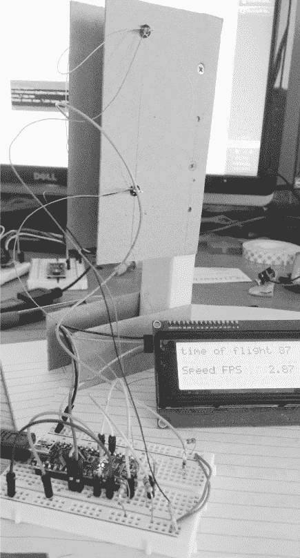

*图 8-5：早期原型中，光传感器和 LED 通过离散电线连接到面包板。为了测试该单元，将一枚硬币掉入通道中*。

无论您是否已经制作完成了通道，还是正在使用纸板原型，您都需要将通道中的传感器和 LED 连接到面包板上——或者，实际上，连接到已完成的单元——使用四根电线：正极、地线、第一传感器和第二传感器。

以下是如何接线面包板：

1.  将红色正极轨道和蓝色负极轨道分别连接起来。绝对不要将红色正极轨道和蓝色负极轨道连接在一起——这样会导致短路并损坏组件。

1.  将 Arduino Pro Mini 或其克隆板插入面包板，留出一定的空间——大约四五行——在一端。

1.  将 Mini 上的 VCC 引脚连接到红色正极轨道。

1.  将 Mini 上的 GND 引脚连接到蓝色负极轨道。

1.  取两个 10 千欧电阻（R1 和 R2），将每个电阻的一端连接到红色正极轨道。（注意，如果您使用的是 Optoschmitt SA5600 光传感器，则无需使用这两个电阻。）

1.  使用跳线将电阻 R1 的另一端连接到 Mini 的 D4 引脚。

1.  使用跳线将电阻 R2 的另一端连接到 Mini 的 D2 引脚。（如果您使用 Optoschmitt 光传感器，可以直接将 D2 和 D4 引脚连接到光传感器的输出引脚，如图 8-3 左下角所示。）

1.  使用附带的 24 英寸电线，将光电晶体管 Q1 的集电极引脚连接到 Nano 的 D2 引脚。

1.  使用附带的 24 英寸电线，将光电晶体管 Q2 的集电极引脚连接到 Nano 的 D4 引脚。

1.  将一个 270 欧电阻 R3 的一端连接到红色正极轨道。

1.  使用其中一根 24 英寸的电线，将电阻 R3 的另一端连接到面包板上的一个空行。

1.  将 LED 1 和 LED 2 的共同阳极通过附带的 24 英寸电线连接到第 9 步中连接电阻 R3 的行。请参考图 8-3 查看 LED 是如何连接在一起并接入面包板的。

1.  将 Mini 上的 5V 引脚和 GND 引脚分别连接到 LCD 上的 VCC 和 GND 引脚。

1.  将 Mini 上的 A4 引脚连接到 LCD 的 SDA 引脚。

1.  将 Mini 的 A5 引脚连接到 LCD 的 SCL 连接端口。

现在你已经准备好输入草图了。

#### *草图*

现在编写草图使其正常工作。以下是 Chronograph Lite 的草图：

```

     //Lite version of chronograph, using Optoschmitt sensors

     #include <Wire.h>
     #include <LiquidCrystal_I2C.h>

     unsigned long start_time = 0;
     unsigned long stop_time = 0;
     unsigned long time_of_flight = 0;
     float velocity = 0;
     LiquidCrystal_I2C lcd(0x3F, 20, 4);
      void setup() {
       Serial.begin(9600);
       pinMode(2, INPUT);
       pinMode(4, INPUT);
       lcd.init();
       lcd.backlight();
     }
     void loop() {

➊   while(digitalRead(2) == 1) {
         //Waiting for first sensor to trip
     }

➋   start_time = micros();

➌   while(digitalRead(4) == 1) {
     }

➍   stop_time = micros();

➎   time_of_flight = stop_time - start_time;

     Serial.print(" time of flight        ");
     Serial.println(time_of_flight);

     velocity = 1000000*.25/(time_of_flight);

     lcd.clear();
     lcd.print("tm of flt  ");
     lcd.print(time_of_flight);
     lcd.print(" us");
     lcd.setCursor(0, 2);
     lcd.print("Speed FPS    ");
     lcd.print(velocity);
  } 
```

草图非常直观。在设置了变量和输入后，一个`while`循环会等待第一个传感器被中断，通过检查条件`digitalRead(2) == 1` ➊。触发时，时钟通过`start_time = micros();` ➋开始，另一个`while`循环会继续，直到第二个传感器被激活（由于第二个传感器插入了 D4 引脚，这个`while`循环检查是否`digitalRead(4) == 1` ➌）。当第二个传感器激活时，时钟通过`stop_time = micros()` ➍停止。

草图会计算从第一个传感器到第二个传感器之间的时间，通过`time_of_flight = stop_time – start_time`公式在➎位置计算。一旦草图完成计算，它会提供指示，显示结果在 LCD 屏幕上。

现在你需要做的就是加载草图，将测试通道竖立起来，如同在图 8-4 中所示，并通过纸板通道掉落像弹珠这样的投射物。首先，用编程器为 Mini 供电。或者，你可以使用一个单独的调节后的 5V 电源，连接到 Mini 的 5V 端口，或者你可以连接一个电池到 Mini 的 VIN 端口，并使用 Mini 的板载调节器。*不要*将 9V 电池连接到 5V 电源轨道——这可能会烧毁所有电路。

当你确认传感器正常工作后，如果想进一步测试电路，你可以将临时传感器通道连接到真正的气手枪上（参见图 8-6）。

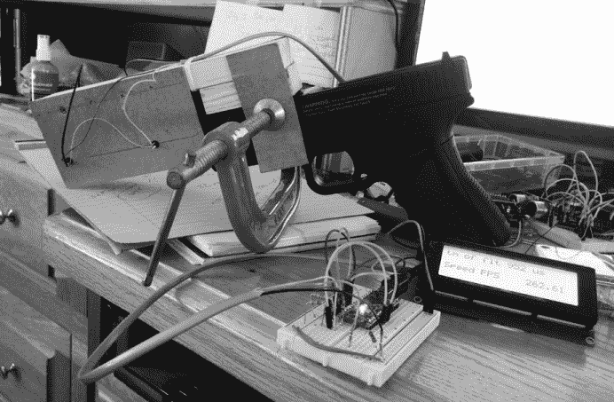

*图 8-6：早期原型中的光电传感器，安装在 Crossman 0.177 口径气手枪上。设置显然是原始的，使用 C 夹将通道固定在武器上。由于测试通道非常简单，我将其设置在了我的桌子上*。

如果这已经足够满足你的需求，你可以将其打包，并跳过第 233 页中“完整弹道测速仪”的内容。Chronograph Lite 应该适用于游戏以及低速和中速武器（低于 600 fps），如气枪、BB 枪、气软枪等。

尽管表现令人满意，但我仍然困扰于这样一个事实：虽然 Arduino 可以计算微秒，但它只能提供四的倍数结果，因此实际上分辨率只有 4 微秒。这就是我开发完整弹道测速仪项目的原因。如果这也让你感到困扰，并且你不打算将 Chronograph Lite 打包，你可以现在跳到第 233 页的“完整弹道测速仪”章节。

**使用投射物模拟器测试 Chronograph Lite**

为了测试 Chronograph Lite 或 Full Ballistic Chronograph 是否有误，我做了一个模拟器来模拟投射物穿过两个传感器的效果，而不是用子弹或彩弹射击我的工作区。在开发过程中，我主要使用了这个模拟器——它对于本章中任何计时器的完成或使用都不是必需的——但是它提供了如何开关相对高速信号的一些见解。

我使用了一个方波发生器（如果你想自己制作，见第九章），并制作了一个非常简单的面包板模拟器。模拟器的电路图，显示在图 8-7 中，仅包括开关功能，并由方波发生器驱动。

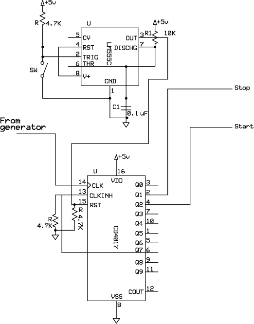

*图 8-7：用于模拟 Optoschmitt 传感器顺序触发的模拟器示意图。它与方波发生器一起使用。电阻 R1 和电容 C1 可以调节以达到满意的去抖效果，但所示的数值已经很好。（续）*

模拟器从方波发生器接收时钟信号。启动时，按下模拟器上的开关（在图 8-7 中标为 SW）开始从 CD4017 十进制计数器发出的起停信号序列。一个手动开关（SW）在 NE 555 定时器的去抖作用后触发模拟器。模拟器的功能是像投射物穿过起始和停止 LED/光传感器对一样，打开和关闭连接到光传感器的电路。图 8-8 显示了一个用于模拟器的面包板，展示了完成的电路板和方波发生器。

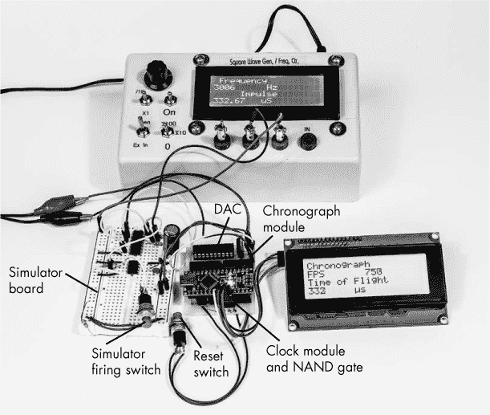

*图 8-8：模拟器面包板和方波发生器连接到完成的 Full Ballistic Chronograph 原型板上。模拟器与 Chronograph Lite 或 Full Ballistic Chronograph 一样工作良好。*

#### *构建*

为了完成 Chronograph Lite 项目，你需要做的就是将 Mini、显示屏、电池和适当的开关安装到一个外壳中，并留出一个连接器，以便将设备连接到传感器通道。与本书中大多数其他项目不同，我没有为 Chronograph Lite 使用保护板，因为 Mini 的接线已经足够。

它简单到不需要额外说明。我使用了 Hammond ABS 塑料外壳 1591 BTCL，正如部件清单中所示。见图 8-9 了解完整的 Chronograph Lite。

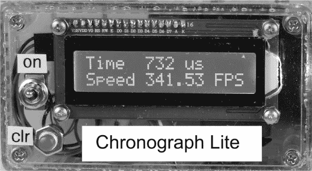

*图 8-9：完成的 Chronograph Lite 的正视图。外壳右侧切了一个孔，以便为背光突起提供空间*。

图 8-10 展示了外壳的模板。你可以从* [`www.nostarch.com/arduinoplayground/`](https://www.nostarch.com/arduinoplayground/)* 下载该图纸的 PDF 文件，并用它来标记并中心打孔外壳上的孔。

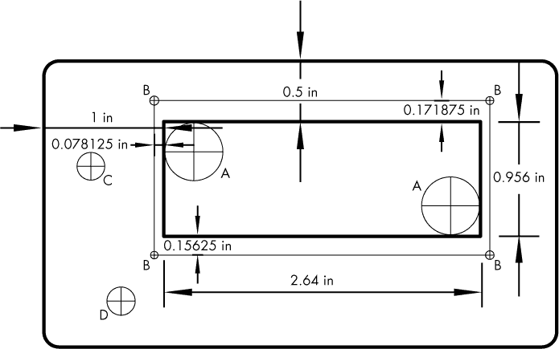

*图 8-10：Chronograph Lite 的孔和显示器模板*

我为 Chronograph Lite 准备了外壳，步骤如下：

1.  小心地标记、中心打孔，并钻 1/2 英寸孔用于显示器（A）的角落，1/8 英寸孔用于显示器的安装孔（B），1/4 英寸孔用于开关（C），以及 1/4 英寸孔用于清除开关（D）。

1.  对于 LCD 屏幕，标记 1/2 英寸孔（A）的边缘。画线连接这些边缘，这样你就有一个矩形可以切割。 （你可以使用 Sharpie 马克笔，稍后用酒精清除多余的标记。）钻孔并沿着这些线用钥匙孔锯或弯锯切开开口。

1.  LCD 右侧（面朝上）有一个轻微的凸起，这是背光组件的一部分。你可以像我在图 8-10 中所做的那样切一个孔来适应这个凸起，或者你也可以保持边缘平直，并使用垫片防止凸起碰到外壳。

1.  安装显示器，并用 1/2 英寸长的 4-40 安装螺丝和螺母将其固定。如果你已经为 LCD 背光凸起切割了孔，你可以直接安装显示器。如果没有，使用额外的 4-40 螺母将显示器从外壳面向后移。如果需要，添加额外的垫圈；4-40 螺母的厚度可能有所不同。

1.  按照图 8-9 中所示安装*开*和*清除*开关。

现在接线 Pro Mini。没有扩展板，因此我们将直接焊接到 Pro Mini 板上，步骤如下：

1.  焊接 I²C 连接的电线。为了让你的工作更轻松，使用彩色电线并为自己创建一个编码。将连接焊接到 Nano 板上的 5V（一些克隆板可能标为 VCC）和 GND 引脚。然后，将 3 英寸的电线焊接到 Nano 上的 A4 和 A5 引脚。将这些电线的另一端连接到一个四针母连接器。（详见“本书中使用的连接器”第 18 页了解如何制作 Pololu 连接器。）将 Nano 上的 5V 和 GND 引脚连接到 LCD 上的 5V 和 GND。将 Nano 上的 A4 引脚连接到 I²C 板上的 SDA，将 A5 引脚连接到 I²C 板上的 SCL。

1.  将电池连接器的正极（红色）电线连接到 SPST 开关的一侧。将开关的另一侧连接到 Nano 板上的 VIN 端口（一些克隆板可能标为 RAW）。

1.  将电池连接器的黑色（负极）电线焊接到 Nano 板上的 GND 引脚。

    最后，将 Nano 板连接到传感器通道，步骤如下：

1.  准备一个四导线女性 Pololu 连接器，带有大约 3.5 英寸长的四根彩色编码导线。将两根导线（建议使用红色和黑色）从此连接器连接到 Nano 的 VCC 和 GND 引脚。

1.  将剩余的两个连接器连接到 Nano 板上的 2 号（D2）和 4 号（D4）引脚。

1.  在外壳的一侧开槽或打孔，并将带有传感器通道连接器的 Pololu 连接器穿过孔洞（见图 8-11）。

    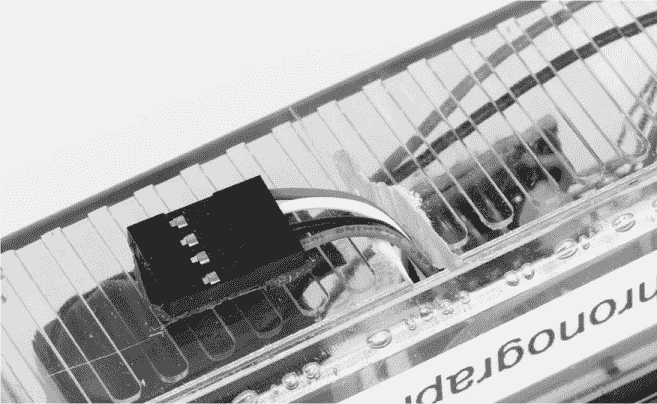

    *图 8-11：外壳上的一个槽口，用于穿过四针传感器通道连接器。该连接器使用双面胶粘贴安装*

1.  将*clr*按钮的一端连接到 GND，另一端连接到 Nano 的 RST（重置）引脚。

1.  最后，连接电池，拧上外壳顶部，插入传感器通道，翻转开关打开设备。

你应该准备好使用你的 Chronograph Lite 了。请参考“最终设置与操作”(ch08.xhtml#ch08lev1sec5))，获取关于如何使用 Chronograph Lite 的说明。

### 全弹道测速仪

虽然 Chronograph Lite 工作良好，并且我成功地用它测量了投射物的速度，但我一直有一种感觉，它还可以做得更好。如果你用这个设备测量低速投射物——即 600 fps 或更低——Chronograph Lite 的准确度完全足够。但由于分辨率限制在 4 微秒，在更高速度下，精度出现了我认为有一定误差的情况（单位为英尺每秒 fps），因此我决定构建全弹道测速仪。

#### *所需工具*

烙铁和焊锡

电钻和钻头（1/2、1/4 和 1/8 英寸）十字螺丝刀和平头螺丝刀 锯（钥匙孔锯或军刀锯）

#### *零件清单*

组装全弹道测速仪相对简单。你需要以下材料：

一个 Arduino Nano 或克隆板

一个 16×4 LCD

一个 I²C 适配器（如果 LCD 中未包含） 一个 PCB 保护板

一个外壳（Hammond 1591 BTCL）

四个 1/2 英寸×4-40 螺丝 四个 4-40 螺母

一个 3PDT 拨动开关

两个瞬时按钮开关 四个 0.100×4 的女性接头

四个母座 X4 外壳

十六个（八个公头，八个母头）适配器引脚 一个 4 MHz 晶体

一个 TI SN 74LVC1GX04 晶体振荡器驱动器 一个 SOT23 适配器板

一个 HCT 4011 四输入 NAND 门 一个 CD4013 双 D 触发器

一个 CD4040 12 级二进制计数器 一个 ADC DAC8562 数字模拟转换器 一个 LM7805 电压调节器

一个 NPN 晶体管 2N5172（或等效） 四个 5 千欧姆、1/8 W 的电阻器

一个 1 兆欧姆、1/8 W 的电阻器

一个 1 千欧姆、1/8 W 的电阻器

一个 1.5 千欧姆、1/8 W 的电阻器

一个 270 千欧姆、1/8 W 的电阻器

一个 4.7 μF 钽电容器 两个 33 pF 电容器

一个 0.01 μF 电容器

一个 5 毫米 LED

两个 IR 探测器（我使用了 Honeywell Optoschmitt SD5610） 两个 850–950 纳米的 IR LED 28 号或 30 号连接线

**注意**

*对于完整的弹道计时器，你需要使用芯片的反向版本 SA5610，或者外部反转信号。请参见 图 8-3 底部的说明*。

#### *下载*

**草图** *FullBallisticChronograph.ino*

**模板** *ChronoCover.pdf, AccelerationChannel.pdf*

**PCB** *ChronoPCB.pcb, LEDHolder.pcb, SensorHolder.pcb*

#### *提高准确性*

改进计时器准确性有几种可能的解决方案。Arduino Nano 使用的是 16 MHz 时钟，但在使用 Arduino Nano 平台和 IDE 配置时，其分辨率为 1 微秒（±2 微秒），尽管 16 MHz 时钟的周期——即周期之间的时间——是 1/16,000,000 秒，或 0.063 微秒。虽然处理器无法精确到自身时钟速度，但它可能远超 1 微秒的精度。显然，目前项目中存在一些开销——可能部分来自硬件（Arduino 板上的组件）和部分来自软件（IDE 的编译器和固件部分）——这些都限制了性能。以下是我提出的一些提高准确性的想法，从一个未能进入最终项目但我认为具有教育意义的想法开始。

##### 深入研究机器代码

一种可能的解决方案是深入研究基础的 Atmel 机器和 AVR 代码。不必详细讲解，AVR 汇编语言是 Atmel 芯片的功能性语言。Arduino 社区为其提供了特定的代码，使 AVR 能够在 Arduino 环境中运行。

根据 ATmega328 的数据手册，可以直接访问 ATmega328 上的各个定时器，以获得所需的分辨率。然而，经过研究，我发现这种方法可能会过于复杂，认为一定还有其他方式。

##### 创建高速窗口

我们希望查看的弹丸飞行时间范围大约是 90 微秒（在 3 英寸距离内约为 3000 fps）到 950 微秒（在相同的 3 英寸距离内约为 260 fps），从最快到最慢。与一些时钟的高频率（如处理器的 16 MHz 时钟）相比，90 微秒已经算是相当长的时间。

测量速度的一种方法是在第一个光束被中断时打开一个定时窗口，允许高速信号通过，直到第二个光束被中断。在窗口打开时，信号中的脉冲将被计数；当窗口关闭时，计数值将表示窗口打开的时间。

例如，假设窗口打开，一个每秒 10 个周期（cps）的信号通过，直到窗口关闭；此时计数了 100 个周期。在这个例子中，Arduino 的时钟就是高频信号。当你知道了投射物的行进距离后，可以使用简单的算术来确定行进时间和速度：10 cps 下的 100 个周期给出了 10 秒。如果距离是 1 米，而窗口打开时计数了 100 个周期，那么速度就是 1 米/10 秒，即 0.1 米/秒。

一个单一的 NAND 逻辑门可以用来制造一个可以打开和关闭的窗口。*逻辑门*只是一个电子控制的开关，仅在特定条件下输出电压，对应于布尔逻辑方程式。*NAND*是“非与”的布尔表达式，当两个输入不相同的时候，*NAND 门*会输出电压。

我测试了 74HC00 高速 NAND 门和标准 CD4011BC 门，标准部件工作良好。还有一些其他部件也可以使用——你需要的是一个传播延迟（T[PD]）小于 100 纳秒的部件。

##### 选择计数器

在决定采用窗口方法后，接下来要考虑的是需要计数的最大值。例如，如果你要从 1 计数到 100，你将需要一个能够计数到 100 的计数器，这样的计数器将提供 100 的分辨率。如果你将这个范围扩大，计数器的范围可以是 10 到 1,000，或者是 100 到 10,000。如果这个范围是 fps 计算的结果，那么你将只有 1,000 fps 的分辨率（每次增加将等于 100 fps），加上任何可能的误差，我们稍后会详细讨论。

那么接下来该怎么做呢？当然是去零件箱看看有哪些计数器可以用来计数通过该窗口的信号。当选择计数器时，你需要考虑它需要多快以及需要计数多少脉冲。经过验证的 CD4040，12 位，串行输入，平行输出数字计数器似乎能够完成这项任务。（CD4040 的工作频率为 4 MHz，但你总是可以使用更快的计数器，如 74HC4040 或 74HCT4040。）CD4040 将提供从 0 到 4095 的数字计数，或 2¹²。

##### 选择时钟频率

接下来，考虑需要什么样的信号频率来适应投射物速度的范围。我假设我想要实现一个目标。

大致范围从 300 fps 到 2,500 fps，尽量在两端保留尽可能多的宽容度。

此外，尽管计数器理想情况下会从零计数到最大值 4,095，但也存在一定的误差。因此，我有些随意地选择了查看从 400 到 4,000 之间的总数字计数，以考虑可能的误差。

给定计数的周期数、信号频率和行进距离，可以通过以下计算得出投射物的速度：

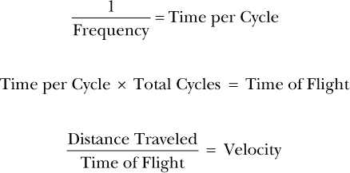

让我们来计算一下一个弹丸在 4,000 个 2 MHz 信号周期内行进 0.25 英尺（3 英寸）的情况：

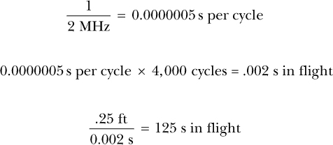

对于 4 MHz 的时钟，一个完整的 4,000 周期计数将在速度范围的低端大约为 281 fps。在高端，考虑到计数了 400 个周期并且使用 2 MHz 时钟信号，你将测量到 1,250 fps，而在 4 MHz 时，你可以测量到 2,500 fps。

你可以对频率进行创意性设计。如果你选择使用 2 MHz 的时钟，它将在非常低速范围内提供最大分辨率。另一方面，如果你选择 4 MHz 的时钟，它将位于分辨率范围的中间。8 MHz 的时钟将在快速范围内提供非常好的分辨率（比任何常规武器都快），但会在低速范围内限制性能。

由于我预期我需要测量的大多数速度都将在计数范围的中间，因此大约 4 MHz 的时钟听起来是合适的。我并未预见到很多速度会低于 300 fps，而在高端，看来精度可以保持在 5,000 fps 以上（数字计数接近 200，可能有点超出，但在模拟中似乎效果不错）。

如果你的弹丸仍然处于低于 300 fps 的范围，我建议重新考虑使用 Chronograph Lite。如果因为某种原因，你想保持在较低的 fps 范围内，但又需要最大精度，可能需要多个数字，那么可以构建一个时钟速度较慢的完整弹道计时器。你只需要将 4 MHz 的晶体换成 2 MHz 的晶体，并调整程序代码，将范围滑动到较低区域。

##### 调整时钟速度

为了处理时钟的速度（即传递到计数器的信号），迄今为止最准确的方法是使用晶体控制振荡器，这种振荡器通常只有低于 50 万分之一的误差。我使用了一个 4 MHz 的晶体和 TI SN 74LVC1GX04 晶体振荡器驱动器进行实验配置，它表现得非常好，因此我在最终项目中使用了它。

尽管我查看、评审并测试了单芯片振荡器，如 Maxim 独立振荡器（7375），它的稳定性不如晶体控制版本。

#### *设计完整的弹道计时器*

现在，我们已经有了将信号传递到 4040 计数器的手段，但我们需要弄清楚如何在 LCD 上显示速度。一种方法是使用一个具有串行输出的不同计数器，直接将其时钟信号传输到 Nano 上。另一种可能的方法是将来自 CD4040 的并行数据通过移位寄存器串行化，然后将结果传递给 Nano。

然而，我采取了不同的方向，如图 8-12 中的框图所示。我决定使用一个 12 位的数模转换器（DAC）来接收并行数字信号，并将其转换为单一的模拟值。DAC 和其对应的模数转换器（ADC）广泛应用于数字音乐、电视以及其他许多需要将模拟输入数字化、处理、传输、存储，最终输出以返回模拟信号的领域。我认为这是一个很好的机会来介绍数模转换器的功能。

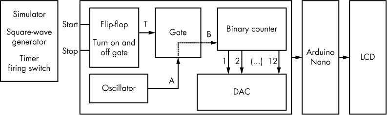

*图 8-12：全弹道计时器的框图*

图 8-12 中的过程展示了使用模拟器的计时器操作。在实际操作中，模拟器将被两个 LED 传感器对所替代。在发射开关的控制下，模拟器启动一个启动信号，该信号会保持激活状态，直到第二个停止开关在由方波发生器确定的时间间隔后被激活。这基本上模拟了弹丸通过第一个传感器对，再通过第二个传感器对的过程。

当启动开关最初被激活时，它会打开*触发器*——一个双稳态设备，随着启动开关的激活而打开，并保持开启，直到停止开关被激活。触发器向门的触发端输入信号。当触发器（T）未激活时——即，当其设为逻辑 0 时——来自振荡器的信号（A）无法通过门传递到输出（B）。当触发器被激活（设为逻辑 1）时，门允许来自振荡器（A）的信号通过门传递到输出（B），并最终传递到二进制计数器的输入。二进制计数器计数通过门传输的脉冲数，并在门关闭时停止计数。

二进制计数器的输出被送入 DAC，它们表示从 0 到 4,095 的二进制数——即 0 到 2¹² - 1。DAC 将这些数字值转换为单一的模拟值。这个转换的技术取决于使用的 DAC 类型；例如，在此处使用的 DAC8562 中，切换 R-2R 电阻梯形网络，并使用晶体管来产生输出。（要获取完整信息，请查阅来自 Analog Devices 的 DAC8562 数据手册。）

DAC 的输出范围为 0V 到 4.095V，且与数字输入值对应。然后，该输出被导入 Arduino Nano 的一个模拟输入，Nano 提供 DAC 的逆向功能，将模拟信号转换回 Nano 能够处理的数字格式。Nano 接收该信号，并根据草图中的指令，调整该值以表示弹丸在 3 英寸距离内所需的速度（fps）。最后，Nano 将该数据发送到 LCD 显示器，显示弹丸的速度和旅行时间。

#### *原理图*

图 8-13 和 8-14 展示了完整的全弹道测速仪原理图。注意底部的额外门电路。我将它们包含在原理图中，因为它们在为这个项目建议的 NAND 门和触发器 IC 封装中是可用的，但我的设计并没有使用它们。如果你想增加功能，它们是可以使用的。

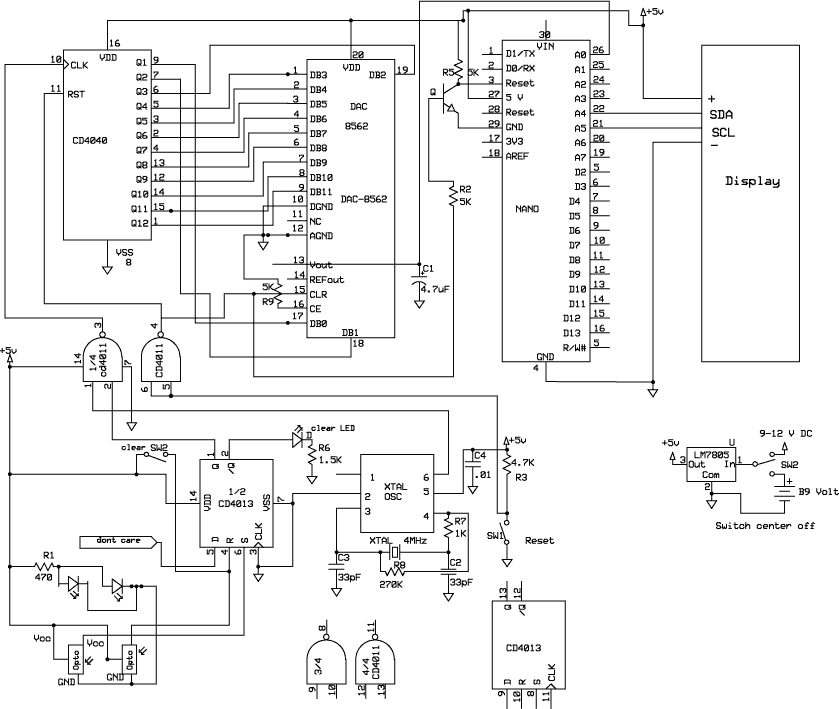

*图 8-13：全弹道测速仪的原理图*

我们还没有讨论的是原理图中包含的复位按钮。在全弹道测速仪中，我添加了一个按钮来触发复位，而不是让它自动复位。我本可以设置为在系统复位之前，结果会在 LCD 上显示一段固定时间，但这样可能会导致数字在用户有时间记录之前就被擦除，或者用户可能会发现自己在等待超时时什么都不做。我决定使用复位按钮会更加方便。

因为复位微控制器不会打乱事物的顺序，所以我选择通过晶体管 Q1 对控制器进行硬复位。为了复位 CD4040 和 DAC，我使用了复位信号，并通过 CD4011 的四个 NAND 门之一反转该信号，将两个输入接在一起。SW2 手动关闭第二组传感器，以防第一组传感器触发而第二组没有触发，SW3 是电源和电池开关。

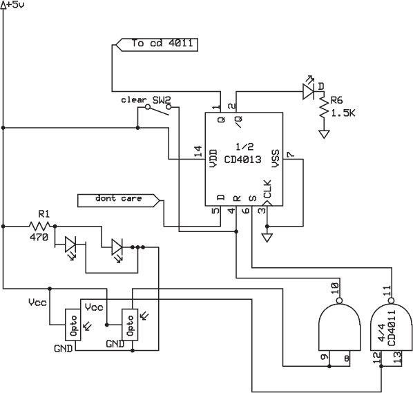

*图 8-14：如果使用 SA5600 而不是 SA5610，针对 Optoschmitt 或 Adafruit 传感器的反相器电路。该电路使用 CD4011 NAND 门的未使用的门作为逻辑反相器。它们没有在 PCB 中布局，所以你需要手动接线*。

#### *原理图草图*

全弹道测速仪的原理图相对简单：

```

      //Full Ballistic Chronograph 

      #include <Wire.h>
      #include <LiquidCrystal_I2C.h> 
      LiquidCrystal_I2C lcd(0x27, 16, 2); 
      int DACpin = A0; 
      float DACvalue = 0; 
      float FPS; 
      float Time; 

      void setup() {
        lcd.init();
        lcd.backlight();
      }

 void loop() {
➊   DACvalue = analogRead(DACpin);
      Time = DACvalue*5/1023/4*1000;
      FPS = .25/Time*1000000;
      lcd.setCursor(0,0);
      lcd.print("Speed  ");
      lcd.print(FPS,0);
      lcd.setCursor(11,0);
      lcd.setCursor(0,1);
      lcd.print("Time  ");
      lcd.print(Time); 

      lcd.setCursor(11,1);  
      lcd.print(char(0XE4)); //To display the mu symbol, use 228 or 0XE4
      lcd.print("s");
  }
```

在这个草图中，软件接收来自 DAC 在 X 点的模拟信号，并将其转换为数字值。然后，它经过几个快速的数学运算来得出飞行时间（`Time`），计算每秒英尺速度（`FPS`），并最终将这些值导出到 LCD 显示器。

在设计电子电路时，硬件和软件之间总是存在权衡。这些很多都与时序问题和软件方法中的内建延迟有关。在这种情况下，权衡在于需要更高的精度，而这在使用直接的 Arduino IDE 方法时是无法获得的，除非转向某种本地代码。为了避免使用本地代码，全弹道测速仪比 Chronograph Lite 有更复杂的硬件。

#### *电路板*

与 Chronograph Lite 不同，Full Ballistic Chronograph 最好在一个扩展板上构建。这个扩展板比书中其他一些扩展板稍微复杂一些，但不要被吓到。图 8-15 展示了扩展板的实际走线，而图 8-16 展示了带有元件位置和孔位配置的丝印图像。对于这个项目，我选择了双面电路板，因为电路比其他一些电路复杂，并且它能让我最小化所需空间。完整的 PCB 文件可以在 *[`www.nostarch.com/arduinoplayground/`](https://www.nostarch.com/arduinoplayground/)* 上下载。

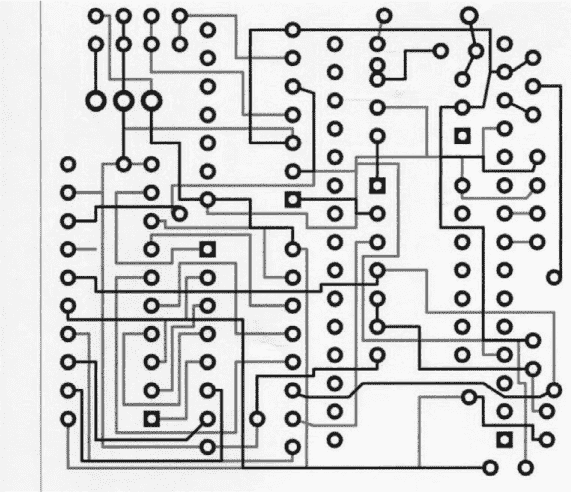

*图 8-15：扩展板的走线图。深灰色是上层铜层，浅灰色是下层铜层*。

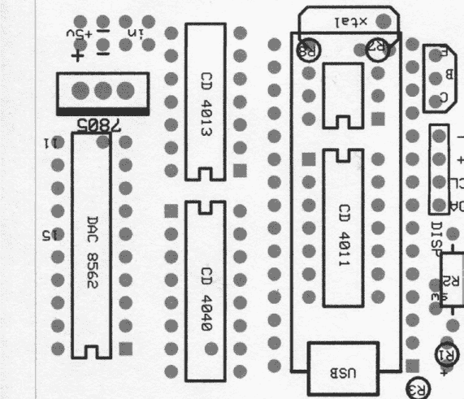

*图 8-16：扩展板上的元件放置图*

我尽量将扩展板的占地面积保持在最小，以便用户可以将系统放入一个小型便携外壳中。完成后的 Full Ballistic Chronograph 可以轻松放入一个 11×8×4 厘米的盒子里。

这是另一个我选择将 PCB 制造外包的案例，在我自己制作并完善了第一个样品，确保所有关键连接都能在电路板的两面焊接后，图 8-17 展示了从服务机构收到的原始电路板。

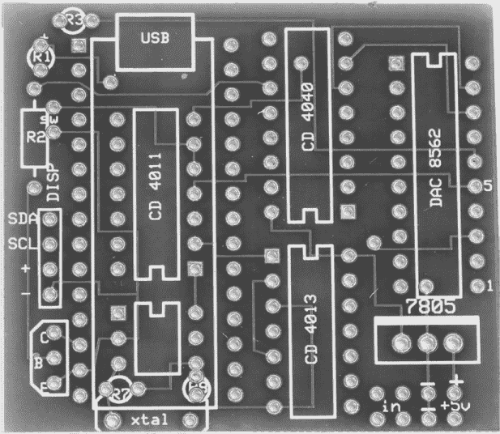

*图 8-17：Full Ballistic Chronograph 电路板在元件放置前的状态*

#### *焊接 Full Ballistic Chronograph*

一旦你有了所有的元件，按照这个指南来构建 Full Ballistic Chronograph：

1.  准备振荡器适配板，先将引脚头焊接到位。使用“使用 SOIC”中建议的方法之一，将芯片焊接到适配器上，第 20 页提供了详细步骤。

1.  开始填充 PCB。我通常喜欢从放置在 Nano 下方的组件开始——在这种情况下，是振荡器适配板、电阻器、晶体和 CD4011\。将它们按图 8-15 所示放置到 PCB 上。接下来，我喜欢加入 Nano 插入的引脚头。再次强调，不必完全填充所有的 Nano 引脚头。虽然偶尔我会使用完整的引脚头，但我通常只填充有连接的那些引脚头，以及顶部的一个对，以简化在插入 Nano 时的对准。此外，还应该有足够的引脚头来机械支撑 Nano。现在将这些引脚头焊接到位。

1.  填充板上的其余部分，包括 I²C 显示器和传感器通道的接头。将电线引线焊接到板上的复位开关、清除开关、LED 和正负电源的连接处。引导传感器——即第一个被投射物体打断的传感器——应连接到 4013 的第 6 脚，无论是否使用反相器电路；另一个传感器应连接到第 4 脚。

#### *构建*

图 8-18 显示了外壳中孔和切割孔的位置。你可以从*[`www.nostarch.com/arduinoplayground/`](https://www.nostarch.com/arduinoplayground/)*下载图 8-18 并将其作为模板使用。

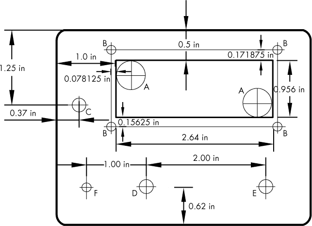

*图 8-18：外壳盖上的孔和 LCD 切割孔*

按照以下步骤准备全弹道计时器的外壳：

1.  按照图 8-18 所示，准备外壳盖，钻出 1/2 英寸的孔用于切割 LCD（A）；钻出 1/8 英寸的孔用于安装 LCD（B）；用扩孔器将 1/8 英寸孔扩大，以便 5 毫米 LED（F）紧密安装；以及钻出 1/4 英寸的孔用于瞬时清除开关（D）、瞬时复位开关（E）和开/关开关（C）。

1.  标记 1/2 英寸孔（A）的边缘，并连接切线——你可以使用马克笔，稍后用酒精清理多余的标记。

1.  使用钥匙孔锯或弯锯切开显示屏的开口。

1.  LCD 的右侧中央（面朝上）有一个轻微的突起部分，这是背光组件的一部分。你可以像我在全弹道计时器和 Chronograph Lite 上做的那样切一个孔以容纳它，或者保持边缘直线，并使用垫片防止突起部分接触到外壳。即使我为突起部分切割了空间，我仍然使用了一个单个螺母垫片，以便将显示屏顶部的连接从外壳前部隔开（参见图 8-19）。

    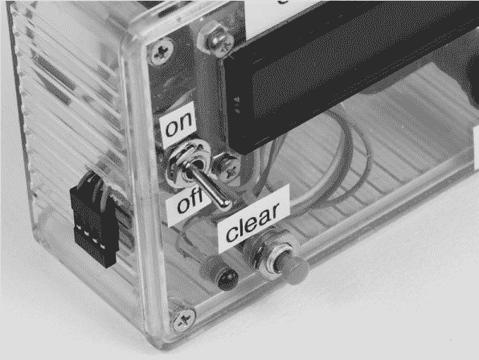

    *图 8-19：四导线母连接器通过双面胶粘贴在外壳侧面*。

1.  将 LCD 的 I²C 组件安装到外壳的前面。

1.  将开关安装到外壳上。按照图 8-13 中的原理图连接开关和 LED。按照"焊接全弹道计时器"中第 3 步的说明使用带引线的电缆（见第 244 页）。

1.  准备电缆组件，将屏蔽板连接到 I²C 适配器以及连接全弹道计时器与传感器通道的 4 针母连接器。（如果你以前从未制作过连接器，请参见本书中使用的连接器，可在第 18 页查阅。）

1.  使用双面胶将屏蔽板粘贴到外壳底部。

1.  使用 4-40 平头螺丝或双面胶固定电池架。

1.  在外壳的一侧切一个口子，将电线穿过连接器连接到传感器通道。单根钢锯片的宽度足以容纳 28 号电线。

1.  使用双面胶将传感器通道的连接器固定到外壳上，如图 8-19 所示。

### 传感器通道

我们在本章早些时候建立了一个传感器通道测试台，但现在我们将构建一个更为永久的传感器通道，并查看我们将在其中使用的传感器和 LED 配对。

#### *构建传感器通道*

传感器通道是一个 U 形隧道，固定在武器的枪口上，容纳处理开关的光电探测器/LED 配对。这个通道可以由多种材料构建。我使用了 3/8 英寸厚的亚克力和两块 0.060 英寸厚的铝片（见图 8-20）。

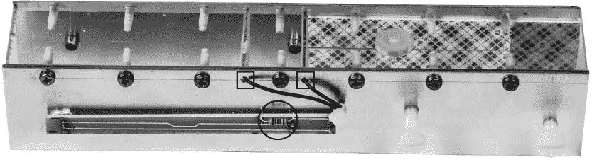

*图 8-20：从上方（正面朝上）看到的完整传感器通道。注意亚克力上为 LED 的正负电源连接所开设的通孔（标框）。还注意到 PCB 上用于 LED 的限流电阻（标圈）。交叉纹理区域是泡沫胶带，用于保护武器的滑块免受刮擦*。

你也可以使用轻型钢板作为侧面部件。顶部部件，如图 8-20 所示，可以采用任何轻质材料，如酚醛塑料、Lexan 或其他塑料，以支撑侧面部件。我选择了透明亚克力，因为它让我能看到枪支内部，而不必看枪管。你可以在图 8-21 中看到更宽的视角，整个通道，包括传感器电缆。

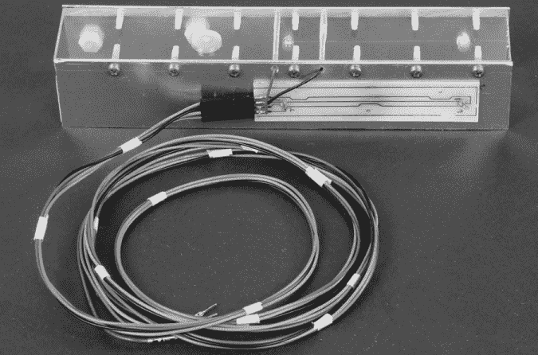

*图 8-21：连接电缆并安装好 PCB 的通道，确保连接器面朝后方（武器连接处）*

有两块 PCB，分别用双面胶带固定在通道的两侧，用于容纳 LED 和光电传感器。这些 PCB 彼此略有不同，如图 8-22 和图 8-23 所示。这些电路板的 PCB 文件可以在*[`www.nostarch.com/arduinoplayground/`](https://www.nostarch.com/arduinoplayground/)*下载。

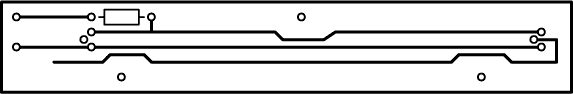

*图 8-22：用于容纳 LED 并安装到传感器通道上的 PCB 图案。注意限流电阻*。

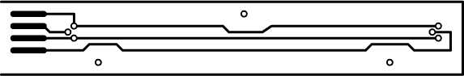

*图 8-23：传感器通道光电晶体管一侧的 PCB 图案。注意每个光电晶体管的三个引脚。边缘的接触点是用来焊接连接头的，连接头通过脐带电缆与主处理和显示板连接*。

传感器通道的亚克力顶部尺寸为 1 3/8 × 7 5/8 英寸。我使用了一根直木棒将枪管与传感器/LED 对齐。请注意，在亚克力顶部有一个小的凹痕，这是用 1/2 英寸钻头打出来的，以便让 Crossman T4 气手枪的光学瞄准器能够对准。

用于侧面的铝板尺寸为 1 3/8 × 7 5/8 英寸。我用 #30 钻头钻了孔，将铝侧面固定到亚克力顶部，孔距为 1 英寸。亚克力使用 #43 钻头钻孔，并进行了 4-40 螺钉攻牙。有关亚克力和铝件钻孔的规格，请参见图 8-24。亚克力的孔是穿过宽度方向钻孔的。

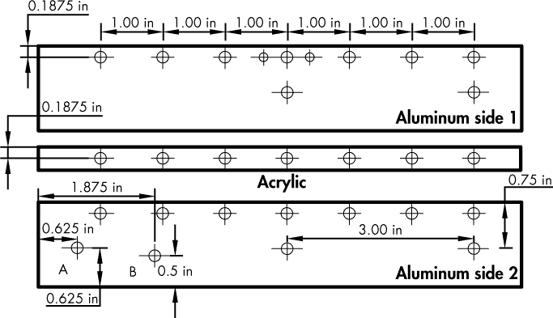

*图 8-24：传感器通道的亚克力顶部和铝侧面孔位的尺寸。此模板可以下载并作为标记和中心打孔的模板使用*。

此外，作为 LED 侧到光电传感器侧的线缆穿过孔，我在亚克力和铝件上的第四个安装孔两侧各钻了两个 #43 的孔。这些孔的具体位置不是特别关键。

除了用于固定亚克力的孔外，铝板还需要在每侧钻两个孔用于安装 LED 和光电传感器对，以及在一侧再钻两个孔用于将其安装到枪管（滑套）上（如 图 8-24 中的 A 和 B），使用 #25 钻头钻孔并攻牙为 10-24 螺钉。看看 IR LED 的大小。大多数是 5 毫米，3/16 英寸的孔通常适合。Optoschmitt 传感器也能紧密适配 3/16 英寸的孔。LED 和光电传感器的孔可以精确地间隔 3 英寸，或者你也可以自行测量，以便与安装在侧面的 PCB 匹配。

根据你打算使用的武器，你可能需要调整图 8-24 中 A 和 B 孔的位置。传感器通道还可以容纳更多的攻牙孔，以适配多个武器。为了将传感器通道安装到枪的顶部，我使用了带锁紧螺母的尼龙螺丝。尼龙螺丝能够紧固在手枪的蓝钢表面上，而不会损伤其表面。

用于安装枪支的螺丝在 Crossman T4 上以及在旧款 Crossman 气枪上都能很好地工作（见 图 8-25）。

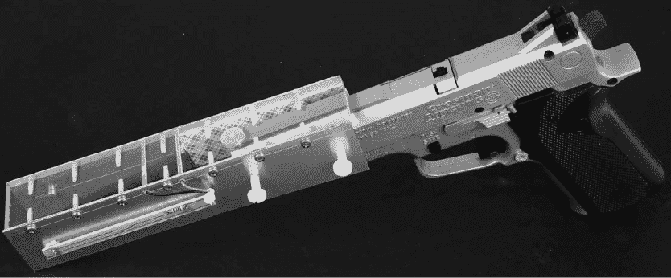

*图 8-25：安装在旧款 Crossman 气枪上的传感器通道。这个角度展示了通道的顶部（亚克力）部分*。

在通道内部，我放置了一些双面胶泡沫带（如果你能找到单面胶泡沫带，那就更好了），以便更紧密地适配，并保护武器免受损坏。我保留了泡沫另一面的保护膜，这样它就不会粘到武器上或损伤表面。

根据你使用的武器，你可能需要在通道中增加一层泡沫，以便将枪管的中心靠近通道的中心。但是，只要枪管没有偏离到足以让弹丸击中 LED 或光电探测器的位置，完美地将枪管居中并不是至关重要的。

然而，确保垂直调整的居中是至关重要的，以便 LED/探测器对能够与弹丸的轨迹对齐。为了设置这个对准，我使用了一根直木棒，直径与枪管的孔径相同，部分插入到武器的枪管中，然后调整位置，使其与 LED/探测器对齐。一旦对准好，就用尼龙螺丝将通道固定在武器上。

#### *Optoschmitt 光传感器和紫外线 LED*

在准备传感器通道时，我测试了几种不同类型的 LED 和探测器，看看哪种在价格和性能上最好。通过 eBay 购买的单元（紫外 LED 和光电晶体管组合）效果很好，我在早期的原型版本中使用了它们。然而，我继续寻找一个我确信足够快速且能在狭窄的领域内提供良好灵敏度的传感器，这有助于排除环境光。经过多次筛选，我选择了霍尼韦尔的 Optoschmitt SD5610 探测器——大概因为它包括了施密特触发电路（见图 8-26）。

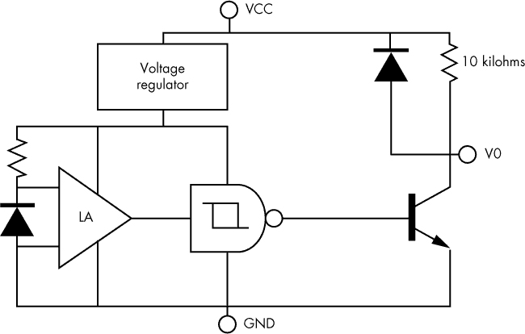

*图 8-26：我在测速仪中使用的 Optoschmitt SD5610 探测器的示意图。请注意，10 千欧的上拉电阻已包括在内，但示意图中没有包括反向器功能*。

Optoschmitt SD5610 传感器稍显昂贵，但它具有 6 度的接收角度，适用于各种大小的弹丸，包括非常小和非常大的弹丸。它还有效减少了环境光的影响。

根据制造商的说法，光电探测器由光电二极管、放大器、稳压器、施密特触发器和一个带有 10 千欧（标称）上拉电阻的 NPN 输出晶体管组成（见图 8-26）。内部的上拉电阻消除了电路中外部电阻的需要。需要注意的是，这个设备有两个版本：SD5600 和 SD5610。SD5610 包括一个反向器，因此当环境光超过开启阈值时，输出为低电平。由于我需要反向输出，我使用了 SD5610。它的光谱灵敏度在 800 到 850 纳米波长范围内最大，这是大多数常见红外 LED 的波长范围。有关 SD5600 系列的更多信息，可以访问霍尼韦尔网站。

对于 LED，我使用了声称输出在 850–950 纳米范围内的普通红外 LED。我只是通过 eBay 买了一袋 50 个单位的 LED，它们工作得很好。或者，SparkFun 也非常便宜地提供单个 LED。

LEDs 和光传感器应焊接到为它们设计的 PCB 上，并应紧密适配到孔内。我使用一些标准的 3M 双面胶带将 PCB 固定在加速通道的两侧。

#### *传感器脐带电缆*

我用来将传感器通道连接到全弹道测速仪 PCB 的电缆由四根 30 号电线扭在一起，使用胶带固定，并在每端连接一个四芯的 Pololu 母接头。这些接头没有极性，也没有定位槽，因此可以相对容易地拔出或插反。在插入之前，确保对齐彩色电线。

**注意**

*我最初尝试使用一根四芯电话线，但它太硬，导致了一些问题*。

通道和完成的测速仪可以轻松连接。如果你使用了彩色电线，你会知道插头连接正确，因为它没有极性。

### 最终设置与操作

完成单元和传感器通道的组装后，是时候将其带到射击场试试了。Chronograph Lite 和全弹道测速仪都设计为由电池供电，因此无需插电。将脐带电缆连接传感器通道与测速仪单元，然后将通道牢固地安装到武器上（见图 8-27）。

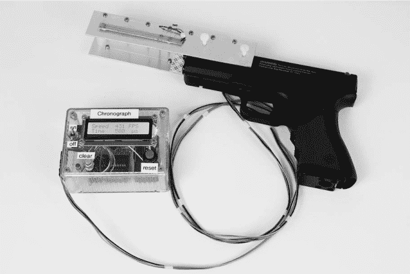

*图 8-27：完成的全弹道测速仪，传感器通道安装在 Crossman 0.177 口径气枪上*

一旦通道连接到武器上，通过使用与枪管孔径相同直径的直木棍或制作一个简单的适配器，利用一段直管将武器的枪管与通道中的 LED/传感器对齐（见图 8-28）。

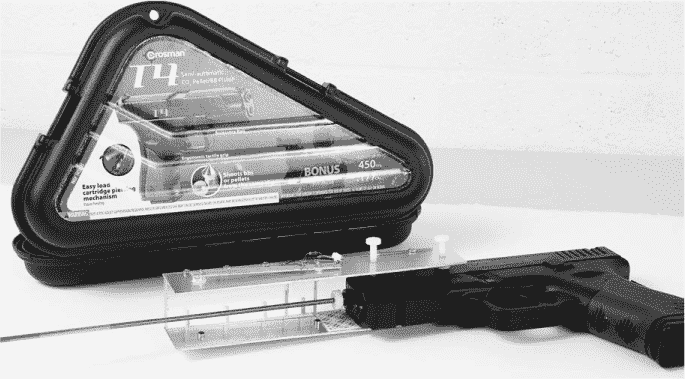

*图 8-28：使用小直径的黄铜杆和特氟龙端部设置 Crossman T-4 CO[2]手枪的枪管与传感器/探测器之间的正确对准*

**警告**

操作武器时请始终小心。*不要直接看着枪管对齐。请通过传感器通道的透明有机玻璃顶部观察*。

#### *使用全弹道测速仪*

在尽可能对齐枪管后，打开全弹道测速仪并按下复位按钮。小心瞄准目标并射击。弹丸的速度（以每秒英尺为单位）以及弹丸在传感器间移动 3 英寸所需的时间应显示在 LCD 屏幕上。要进行另一次测量，只需按下复位开关并再次射击。

如果不小心未能正确地将武器对准通道，可能会导致弹丸中断第一个光电传感器组，而非第二个光电传感器组。在这种情况下，你可以按下清除开关，然后按下重置开关，再次尝试。清除开关仅仅是断开第二组光电传感器的连接。

全弹道计时器应提供从约 300 fps 到超过 2,000 fps 的精确读数。

#### *使用 Chronograph Lite*

Chronograph Lite 的操作方式与此类似，只是它会自动重置，因此无需重置按钮。然而，如果弹丸未能中断第二组传感器/探测器，则需要通过按下清除按钮来清除显示。实质上，这和中断第二个传感器/LED 对的作用相同，但你应该始终使用清除按钮，而绝不应尝试用外部物体——尤其是你的手指——去中断第二组传感器/探测器。如果武器不小心发射，你可能会受到严重伤害。Chronograph Lite 可以提供从约 200 fps 到超过 1,000 fps 的精确测量，但其精度在接近 700 fps 时会有所下降。

**高功率武器测试**

除非你有丰富的枪械使用经验，否则我强烈建议不要使用 Chronograph 来测量高功率武器。尽管如此，我还是在一些高功率武器上测试了全弹道计时器。

图 8-29 显示了安装在史密斯菲尔德 XP/M 9 毫米半自动手枪上的传感器通道。我用多种弹药测试了全弹道计时器，测量结果与制造商提供的子弹规格误差仅在几 fps 之内。例如，雷明顿 JHP 声称子弹速度为 1,155 fps，而我测得大约为 1,152 fps。其他武器的测量结果也接近公布的速度。

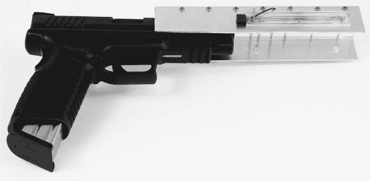

*图 8-29：一把配备全弹道计时器传感器通道的史密斯菲尔德 XP/M 9 毫米手枪。为了安全起见，弹匣被故意倒插。*
