## 第十章：方波发生器**


*信号发生器*，也叫波形发生器或函数发生器，产生交流（AC）电压，可用于各种电子测试和诊断程序。像你将在本章中构建的*方波发生器*（如图 9-1 所示）是一种电子实验室仪器，它产生一系列等间隔的电脉冲，这些脉冲在一定时间内保持开启，随后关闭相同的时长，再次开启，循环往复。

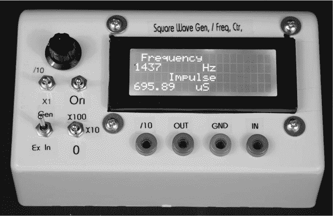

*图 9-1：完成的方波发生器*

### 为什么要构建方波发生器？

像这样的信号发生器常用于执行诊断任务，从评估组件和子系统的频率响应到为正在开发的系统提供激励信号。信号发生器的一些具体用途包括：

• 观察放大器、衰减器或其他设备的完整性

• 测量电路的时间特性

• 模拟现实世界的开/关事件

本项目中的信号发生器部分主要是方波发生器。

#### *什么是方波？*

你问，什么是方波，它有什么用？*方波*是一种电信号，从零电压开始，升高到某个电平（其*幅度*），在该电平上保持一段时间，回到零电压，然后以对称的模式重复这一过程。

方波是电子学中最基本的波形之一，并且在许多方面是最有用的，部分原因是它同时具有直流成分和交流成分。直流成分指的是它在一段时间内保持在某个电压水平，然后几乎瞬间过渡到另一个电平。交流成分则是它以规律的周期重复这种过渡。图 9-2 展示了一个方波。

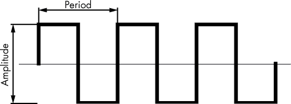

*图 9-2：典型的方波*

方波有一个幅度和周期。*周期*是一个完整周期的持续时间，单位可以是秒、分钟、毫秒、微秒等。*频率*是指在一定时间内（标准单位为一秒）发生的周期数，因此是周期的倒数。对于周期*T*，计算频率的公式为*f* = 1/*T*。

#### *方波的应用价值*

方波在开发和测试电子产品时特别有用。例如，微控制器系统中的时钟本质上就是一个方波。在一些诊断和测试过程中，可以断开微控制器的内部时钟，并用信号发生器生成的外部信号替代——在这种情况下，方波或正弦波都能很好地工作。你可以在不同频率下测试微控制器。对于某些处理器，通常在测试过程中减慢处理器时钟是很有价值的，这样可以准确地看到软件故障发生的位置。

其他用途包括向被测试的设备发送信号，以便将电路调节到正确的值，或者检查设备的频率响应或完整性。方波发生器也可以作为脉冲发生器，用于测试各种数字电路。你会发现在第八章的弹道计时仪中，这个应用非常有用。

由于方波的电压从零开始并几乎瞬间上升，它也可以作为开关电压，在方波的频率下开关电路。在本章中的方波发生器的频率范围从 1 kHz 到约 30 MHz（包括分频开关后，可以降到 100 Hz）。通过电位器可以调节这个频率范围，因此你可以以不同的速率开关设备。这使得方波发生器几乎可以模拟任何重复的开关操作，这对于进行寿命测试应用时开关设备也非常有用。

**其他有用的波形**

方波只是常见波形中的一种。最常见的波形可能是*正弦波*，即正弦波形，其中波形是一个连续的曲线，一个周期代表 360 度。另一种在电子学中经常遇到的波形是三角波。图 9-3 中展示了这两种波形。正弦波和三角波的振幅和周期的测量方式与方波相同。


*图 9-3：正弦波（上）和三角波（下）*

这些波形各自具有特定的特点，使它们在不同的应用中发挥作用。例如，正弦波和三角波在电子音乐项目中都很重要。然而，本项目聚焦于方波，随着你在本章的学习进展，你会发现它可以以多种方式应用。

#### *一个频率计*

除了提供信号发生器，本项目还包括一个*频率计*，它可以读取波形频率，因此你可以在数字读数上显示发生器的输出频率。你还可以将频率计作为独立仪器，测量来自外部源的频率并显示它。这个项目还显示波形的周期或脉冲时间。

在操作过程中，频率计接收一个交流输入信号并计算每个脉冲。计算了一定数量的脉冲后，计数器将其与一个时钟信号进行比较，这个时钟信号有时被称为*时间基准*，并显示单位时间内的脉冲数量——例如，每秒的脉冲数或周期数。

为了确保准确性，计数器将脉冲与时钟进行比较，通常时钟是基于晶体的。对于需要最高精度的仪器，晶体时钟组件是一个精密的子系统，通常放置在温控环境中。这个项目中的频率计使用的是 Arduino Pro Mini 上的 16 MHz 晶体。实际上，Pro Mini 几乎具备了实现完整频率计所需的大部分电路，所需的额外组件非常少。它包括用于计数的时钟寄存器以及几乎所有频率计所需的其他组件，无需外部组件。

**注意**

*专业的实验室和台式仪器，售价几百（或几千）美元，通常提供非常宽的频率范围，从低于 1 Hz 到几 GHz，并且提供从 6 位到 10 位的精度。它们的显示器还可以切换为读取频率或时间（脉冲间的时间）*。

为了完成这一切，方波发生器利用了 Arduino AT328 16 MHz，5V Pro Mini，它是 Arduino Nano 的一个更小、更便宜的版本。发生器还包含了特殊电路来分频，使你能够在一端提供非常低频率的输出，并允许频率计读取非常高的频率——超出了 Pro Mini 通常能够处理的范围——在另一端。

### 方波发生器的不足之处

虽然这个项目制作了一个方波发生器和一个在许多应用中表现良好的频率计，但与专业实验室和台式仪器相比，它仍有一些缺点。发生器的频率误差不到 1%，这对于爱好者项目来说是足够的，但无法达到实验室级别和直接数字合成器（DDS）发生器单元的容差。这些单元的误差通常以百万分之一（PPM）来衡量。而频率计使用的是 Arduino 的时间基准，尽管它准确，但无法与高价单元中的晶体烤箱和其他特殊电路相匹配。

这个发生器也没有提供多个数字的分辨率。许多实验室和台式仪器的分辨率可以达到多达 10 位数字。尽管如此，这个仪器在我进行的各种 Arduino 和其他项目中表现得很好，而这些项目并不需要更高的分辨率。

### 所需工具

电钻和钻头

锯孔锯

烙铁和焊锡

锉刀

### 零件清单

除了 Arduino Pro Mini 之外，你还需要一个线性技术公司的振荡器芯片和一些其他小组件。以下是完整的零件清单：

一个 Arduino Pro Mini 或克隆板（有几种可用，且一些具有不同的引脚配置，尤其是 A4 和 A5 引脚。图 9-4 显示了我使用的特定克隆板的引脚配置。其他具有不同引脚配置的单元也可以使用，但可能需要更改屏蔽板上的连接。）

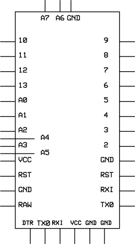

*图 9-4：Deek-Robot Pro Mini Arduino clone 的引脚配置图*

一个 LTC1799 振荡器芯片和面包板兼容适配器板，类似于图 9-5 所示的 5-SOT-23 适配器板（有关如何使用这种表面贴装芯片的提示，请参见使用 SOIC 页面 20）

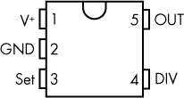

*图 9-5：此适配器板包含一个完整的可调频率振荡器（1 KHz 到 30 KHz）和 CMOS 缓冲电路*。

一个 250 千欧的碳质电位器

两个 0.1 μF 陶瓷电容

一个 LM7805 电压调节器

两个 SPDT 中间开关

两个 SPDT 拨动开关

一个 HCT4017 十进制计数器 IC，类似于图 9-6 所示的 CD4017 B

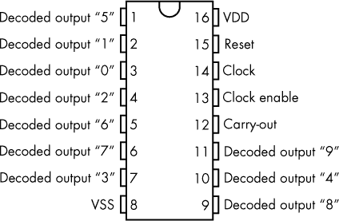

*图 9-6：CD4017 B 是一个 CMOS 计数器/分频器，由一个 5 级 Johnson 计数器和 10 个解码输出组成。在此作为 10 分频计数器使用*。

一个 1 μF 电解电容

一个 10 μF 电解电容

一个 20×4 LCD

一个 I²C 适配器（如果 LCD 未包含该适配器）

一个 PCB 屏蔽板（如果不想自己设计，请参见下载页面 262 上的页面 262）

一个 Hammond 1595C 斜面前端外壳（或同等产品）

一个电池座

一个旋钮

四个 4-40×1/2 英寸的螺丝和垫圈

八个 4-40 螺母

一块双面泡沫胶带

一个 9V 电池

各种 28 或 30 号连接线

（可选）四个香蕉插头插座 *或* 三个 BNC 连接器

（可选）一个 3.5 毫米插孔

（可选）一个 9V, 100 mA, 110V 墙壁电源适配器（更多信息请参见电池电源页面 278）

请注意，我选择在前面板上使用香蕉插头插座，尽管这有点过时，可能不是最佳做法。你可以用 BNC 连接器替换两个输出连接器，就像 pH 计项目中使用的那样，虽然价格稍贵，但它消除了对接地的需求，因为 BNC 连接器有一个中心导体和一个围绕它的屏蔽地。香蕉插座每个只有一个导体。

### 下载

**草图** *SquareWave.ino*

**前面板模板** *SquareWaveEnclosure.pdf*

**PCB 铜箔图案** *Generator.pcb*

### 原理图

图 9-7 中的方波发生器电路所需的元件并不多。然而，在开始构建之前，请注意，Arduino Pro Mini 的引脚配置与 Nano 有很大不同。还需要注意的是，Pro Mini 有许多版本可供选择，因此购买时要检查所选版本的引脚排列。建议在零件清单中列出的特定 Arduino，其引脚排列在图 9-4 中有详细说明。有关主要差异的描述，请参见“关于 Pro Mini 的重要说明”（第 263 页）。

在原理图中，请注意开关：SW1、SW2、SW3 和 SW4。SW2 提供了 10 倍分频显示功能。SW3 允许你使用外部信号源代替信号发生器与频率计连接。SW1 连接主时钟的 1、10、100 分频器（该开关具有一个中位“关”位置，处于此位置时没有连接）供 LTC1799 振荡器使用。SW4 是电源开关；其中心位置为关，另外两个位置用于外部电源或电池。

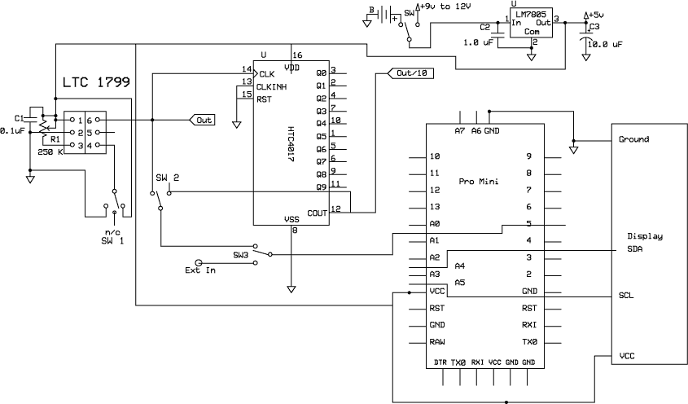

*图 9-7：方波发生器原理图*

### 关于 Pro Mini 的重要说明

在搭建面包板之前，请注意，Pro Mini 板之间的一个主要引脚差异是 A4、A5、A6 和 A7 的布局。一些版本将所有四个模拟输入放置在板子的短边上，而本项目使用的 Deek-Robot 则将它们分开（见图 9-8）。它将 A4 和 A5 放置在其他模拟引脚附近，但不与它们对齐，A6 和 A7 则位于板子的短边。引脚 A4 和 A5 用于驱动显示器的 I²C 总线。

Pro Mini 和 Arduino Nano 之间有一些其他的小差异，但最显著的一点是 Pro Mini 没有 USB 接口，因此你必须使用外部串口接口进行编程。市场上有几种基于 FTDI 技术的串口适配器。(*FTDI*是*Future Technology Devices International*的缩写，是一家专注于 USB 技术的苏格兰半导体公司。)

使用基于 FTDI 的专用串口适配器的替代方案是使用另一块微处理器板来为 Pro Mini 编程。我使用一块 Arduino Uno 克隆板来为 Pro Mini 编程，因为它价格便宜，允许我移除处理器芯片，这样就不会编程两个板子，而且使用起来很方便。我使用一个简单的面包板设置进行编程。有关连接详情，请参见“上传草图到你的 Arduino”（第 5 页）上的内容。

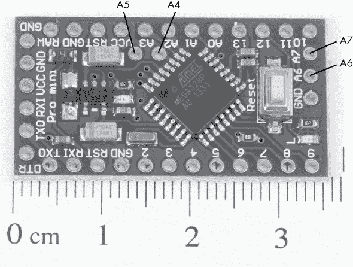

*图 9-8：Deek-Robot Pro Mini 与一把厘米标尺放在一起。其引脚排列与类似的 Arduino 克隆板略有不同。例如，引脚 A4 是 A2 和 A3 之间未标记的焊盘，而 A5 是 A3 和 VCC 之间的焊盘*。

### 方波发生器的开发过程

这个项目是为了应对在创建第八章中的弹道计时器时出现的一个需求。开发计时器时，我需要一种方法来测试它，确保它正常工作，而不需要使用带有实弹的武器，也不需要在我的车间里打洞。

方波发生器是我解决问题的方法。通过它和一些其他的小零件，我能够模拟出当一个弹丸打破一系列光束时，计时器应接收的信号。我决定从弹丸在 3 英寸（约 7.62 厘米）距离内所需的时间开始，这个时间在 50 到 1,000 微秒之间，具体取决于弹丸的速度。然后，我使用方波发生器生成频率在 20,000 Hz 到 1,000 Hz 之间的信号，这些频率是这些时间的倒数。一旦我弄清楚了计时器需要什么，方波发生器项目便发展出了它自己的生命，最终版本就是你在本章看到的样子。

#### *决定如何生成信号*

首先，我寻找了一种简单的方法来满足我的时间要求。有几款 DDS（直接数字合成）产品和板卡可以轻松解决这个问题，但我找到的所有解决方案都比我期望的要贵一些，而且很多还有其他缺点。在放弃 DDS 后，我查看了几种替代方案，其中一些让我回到了我的旧无线电爱好者时代。一种解决方案是使用晶体振荡器并通过分频器将基本频率分割，从而获得接近我需要的频率。这带来了几个问题，其中一个最大的就是电路可能需要多个分频芯片。

另一种解决方案是从零开始创建我自己的可调频率振荡器（VFO）。虽然这也是一个可行的选择，但这一解决方案需要比我当时准备做的更多的设计工作，所以我又回去查阅了数据表。

我发现 Linear Technology 的 LTC1799 单芯片精密振荡器几乎完全符合要求——而且还多了一些。根据数据表，这款芯片提供从 1 KHz 到 33 MHz 的方波信号，只需一个可调电阻和一个开关来将基本振荡器频率分频 1、10 或 100 倍。它的稳定性也相当好：名义上误差不到 1%。而且，它的价格远低于 DDS 解决方案，仅为不到 4 美元。

问题的最后一部分是要查看发生器生成的频率。如果没有外部频率计或经过校准的示波器，即使是接近的频率也很难获得。因此，项目扩展到了包含一个内建频率计。由于频率计反正已经在了，我还加了一个开关，允许我将频率计作为独立的仪器使用。

#### *如何规划显示频率*

现在我可以生成方波了，但仍然有一些其他问题需要解决。例如，我该如何读取外部频率呢？我可以通过标记电位器位置来进行校准——就像许多旧式发生器所做的那样——但在今天的数字时代，这种方法充其量也只是笨拙且不准确。内置的频率计数器和亮显示器似乎是最实用的选择。

我回到了绘图板——并且回到了 Arduino 库。我在网上找到了几种 Arduino 频率计数器的实现方式，包括至少两个独立的频率计数器库。对于这个应用来说，最简单和最方便的库是*FreqCount.h*，由 Paul Stoffregen 开发。我如何使用这个库将在“草图”中进一步讨论，见第 271 页。有关该库的更多信息或获取最新更新，您可以访问*[`github.com/PaulStoffregen/FreqCount/`](https://github.com/PaulStoffregen/FreqCount/)。

初步的面包板原型表明频率计数器工作良好。我使用一个 20×4 的 LCD 显示器，并通过 I²C 接口将其连接起来，制作了面包板。在显示器上标注了*Frequency*字样，并在其下方显示了频率（以 Hz 为单位），我仍然剩下两行 20 个字符（见图 9-9）。


*图 9-9：方波发生器的显示，显示频率和脉冲时间*

我常说“浪费不得”。因为我计划使用方波发生器的至少两个项目需要均匀间隔的脉冲（差不多就是一个脉冲发生器），我决定使用显示器的后两行来指示脉冲的时间。在草图中计算时间相对容易，因为时间（以秒为单位）是频率的函数（*T* = 1/*f*）。

### 信号完整性

如果不深入信号组合的高级数学，方波可以被认为是无限多个正弦波谐波相加的结果。随着频率的增加，波形的复杂性和脆弱性也在增加。如果你将面包板电路连接到示波器，你可以亲自观察到这一点。

这个项目最初是作为一个方波发生器/频率计数器开发的，能够在 1,000 Hz 到 1 MHz 的范围内工作。这个发生器表现得非常出色，但其基本的振荡器芯片的工作范围远远超出了这个范围。

在开发这个项目时，我有两个选择。第一个是故意将设备的性能限制在最初提出的范围内，或者将其扩展到接近振荡器的极限，并在高频段遭受一些退化。我选择了后者。虽然方波在大约 15 MHz 时开始变得不规则，但在较低频率——即原定频率——下的性能完全不受影响。图 9-10 显示了不同频率下的四个示波器波形图，以作示范。

在 1 kHz 时，波形几乎完美无缺，你可以从我的老式模拟示波器的显示屏上看到这一点（见图 9-10A）。在图 9-10B 中，5 MHz 时，方波的边缘有一点点妥协，显示出上升沿有轻微的超调。当频率提高到 12 MHz 时，信号开始显得有些凌乱，失真更严重（见图 9-10C）。波形的一些失真是由调谐或某些元件的寄生电容和电感效应引起的。这是一个可以避免的现象，我之所以提到它，主要是让你了解波形的形状。我怀疑你大多数应用这个发生器的场景会是在低频区，低于 1 MHz，在这个频率范围内产生的波形可以说是最完美的。此外，我也在更高频率下使用过该发生器，稍微失真的波形几乎对结果没有影响。

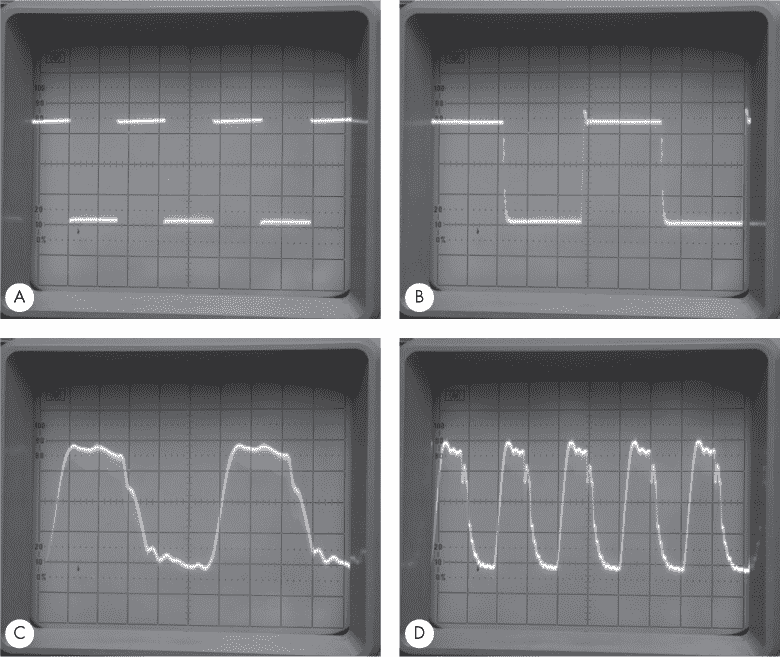

*图 9-10：四个示波器波形图，显示了方波发生器在 1 kHz (A)、5 MHz (B)、12 MHz (C) 和 20 MHz (D) 下的输出。很快就能看出，方波信号在约 12 MHz 时开始失去完整性*。

当频率超过 20 MHz 时，波形继续失真（见图 9-10D），但它们仍然可以完全识别为方波，并且仍然有效。在 30 MHz——方波发生器的工作范围极限——下，信号波形看起来越来越像正弦波，但对于大多数测试目的来说，它仍然完全有效。

**听方波**

一个有趣的实验，可以让你了解方波中存在的谐波，就是将方波发生器设置为可听频率范围，并将其输出连接到放大器和扬声器的输入。仔细聆听声音的质量。你听到的“噪音”是方波产生的丰富谐波的结果，这些谐波本质上由频率范围内所有其他正弦波的合成组成。

### 使用十进制计数器进行微调

在设计系统时，我最终决定添加一些功能，以提高系统的实用性和性能。频率计数器组装完成后，频率范围大约为 100 Hz 到最大约 10 MHz。LTC1799 振荡器的频率范围从 1 kHz 到约 30 MHz，对于大多数应用来说，这已经足够。但我考虑到的一些应用需要一个低至 100 Hz 的交流信号源。

嗯，结果证明有一种方法可以用一颗芯片“杀死两只鸟”：一个除以 10 的计数器——在这个例子中，是一个 HCT4017 或 CD4017 十进制计数器和几个开关。

十进制计数器接受一个交流信号，计数到 10，然后重新开始。通过查看其中一个计数器输出，它基本上是除以 10 的。

可以通过将振荡器的输出信号送入除以 10 的计数器，并在 LCD 上显示输出频率，而实际输出频率将是显示频率的 10 倍。这个变通方法允许方波发生器在 LCD 上显示高于 10 MHz 的频率，只要你能在脑中将小数点向右移动一位。另一方面，开关（SW2）可以被移动，以直接获取振荡器的输出，除以 10，使得最小输出频率可低至 100 Hz，或者是 1 kHz/10。

### 振荡器详细信息

这个项目的振荡器部分几乎完全由 LTC1799 单芯片完成，只需要一个外部可变电阻、一个旁路电容和一个用来将基本振荡器频率除以 1、10 或 100 倍的开关。频率除以多少，取决于你连接到 4 脚的组件。当将 LTC1799 的 4 脚或 DIV 脚连接到地（GND）时，频率除以 1；当 4 脚悬空或开路时，频率除以 10；当 4 脚连接到 5V 时，频率除以 100。这样，设备可以覆盖从 1 kHz 到 30 MHz 的频率范围。

此外，虽然我选择在 LTC1799 的 1 脚和 3 脚之间使用一个 250 千欧的电位器，但任何 3 千欧到 1 兆欧之间的电位器都是可以接受的。当电阻值增加时，频率会降低，反之亦然。

根据制造商的说法，LTC1799 在其频率范围内输出的方波相当清晰。然而，随着频率的增加，有许多因素会影响波形的完整性。这些因素包括由于电路布局引起的寄生电容和电感，如输出位置、可调电位器的连接、开关和其他元件。由于我考虑的大多数应用位于 LTC1799 提供的频率范围的低端，因此我没有严格关注布局，因此在较高频率下可能会出现某些完整性问题。请参阅图 9-10 查看实际信号轨迹。

### 面包板

就像我几乎所有的 Arduino 项目一样，在设计过程中，我总会制作一个面包板布局。图 9-11 展示了方波生成器的原型。

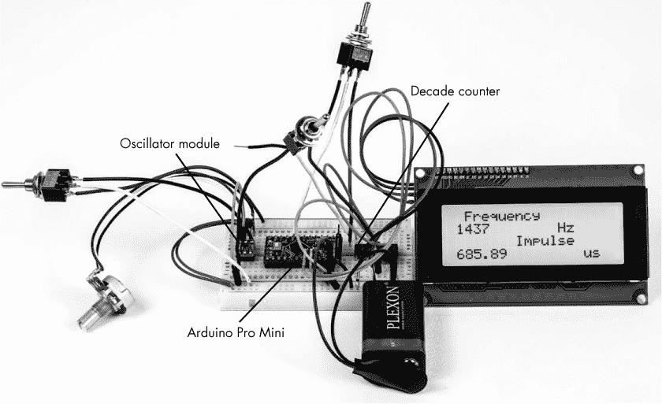

*图 9-11：方波生成器的面包板*

为测试接线面包板并不困难，唯一的例外是，当使用较长的互联导线时，振荡器在较高频率下会变得有些不稳定。

这是连接方式：

1.  将所有的红色正极轨道和蓝色负极轨道连接在一起。务必小心，绝不要将红色轨道和蓝色轨道连接在一起。

1.  将 LTC1799 振荡器模块尽可能靠近面包板的一端插入。请参见图 9-11 的最左侧。振荡器必须安装在适配板上，以便其适应面包板的 0.100 英寸间距，如图 9-12 所示。

1.  将 Arduino Pro Mini 插入面包板。将 Pro Mini 的 5V 端子连接到面包板的红色正极轨道。

1.  将 Pro Mini 的 GND 连接到蓝色负极轨道。

1.  将 HCT4017 十进制计数器插入面包板。（它位于图 9-11 中的 LCD 左侧。）

1.  将 LTC1799 和其适配板插入面包板。

1.  将三位置（中断）开关 SW1 的一端连接到地。将另一端连接到 VCC，并将开关的中间引脚连接到 LTC1799 的第 4 引脚。

1.  将开关 SW2 的一端连接到 LTC1799 适配板的第 6 引脚（或 LTC1799 的第 5 引脚）。

1.  将电位器 R1 的一端连接到 LTC1799 的第 3 引脚。将 LTC1799 的第 1 引脚与电位器的另一端及其滑动端（即电位器的中间引脚）一起连接到红色正极轨道。

1.  LTC1799 的第 6 引脚将是振荡器的输出，连接到 HCT4017 的第 14 引脚和开关 SW2 的一只脚。

1.  电容器 C1 应如描述那样安装在适配板上。

1.  将 HCT4017 的 13 引脚和 15 引脚连接到地。

1.  将开关 SW2 的另一端连接到 HCT4017（CD4017）的第 12 引脚。

    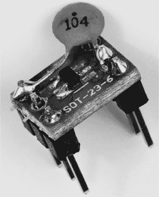

    *图 9-12：SOIC 已焊接到适配板上，这样它就可以适配面包板的 0.100 英寸间距。该芯片只有 5 个引脚，但我使用了一个 6 引脚适配器*。

1.  将开关 SW2 的中心连接到面包板上的空行。（我使用的是 Pro Mini 和 HCT4017 之间的一行）。

1.  将开关 SW3 的一端连接到你在第 8 步中使用的相同空行，该行应与开关 SW2 的中心相连。

1.  将开关 SW3 的中心连接到 Pro Mini 的数字引脚 5（D5）。

1.  如果你在仅使用频率计模式下使用面包板，则开关 SW3 的第 3 引脚将作为输入。

    **注意**

    *SW4，AC/电池开关，无需在面包板上配置，因为在编程 Arduino 时，电路可以从计算机获取电源。由于同样的原因，LM7805 在面包板配置中没有使用*。

1.  检查你的 LCD。如果它已经焊接了 I²C 子组件板，你可以继续。如果没有，按照 “将 I²C 板固定到 LCD” 在 第 3 页 中的描述，将 I²C 板焊接到显示器上。

1.  当你的 LCD 准备好后，你将需要四根公对母连接线来连接它。（在最终版本中，你可以为它做一个小的线束，包括 VCC、GND、SCL 和 SDA 的线。）我通常用红色和黑色表示正负电源，用绿色表示 SCL，用黄色表示 SDA。将 VCC 线插入红色正极轨道，将负极插入蓝色负极轨道，将 SDA 插入 Pro Mini 的 A4，将 SCL 插入 Pro Mini 的 A5。

最后，构建你的编程电路或插入 FTDI 适配器，将草图加载到 Pro Mini 上，你就可以开始了。

### 草图

随着项目的迭代，方波生成器的草图做了一些简化。得益于 LTC1799 和 *FreqCount.h* 库的集成（可以从 Arduino IDE 的库管理器部分获得），最终结果是一个相当简洁的程序。

```

/* Square Wave Generator Sketch. Gives a proper reading with multiplier.  
 * Parts of this sketch are derived from Paul Stoffregen's public domain  
 * example code.  
 */ 
#include <FreqCount.h>
#include <LiquidCrystal_I2C.h> 
#include <Wire.h> 

unsigned long freq = 0; 
float impulse; 

LiquidCrystal_I2C lcd(0x27,20,4);

 void setup() {
  lcd.init();
  lcd.backlight();
  FreqCount.begin(1000);  
} 

void loop() {
  if(FreqCount.available()) {
    freq = FreqCount.read();
    lcd.clear();
    lcd.setCursor(1,0);
    lcd.print(" Frequency");
    lcd.setCursor(0, 1);
    lcd.print(freq);
    lcd.setCursor(10, 1);
    lcd.print("Hz");
    lcd.setCursor(0, 2);
    lcd.print("Impulse");
    lcd.setCursor(0,3);

    impulse = ((1/(float)freq)* 1000000);
    lcd.print(impulse);  
    lcd.print("  uS  ");
  } 
} 
```

该草图首先包含三个库：*FreqCount.h* 用于频率计数器，另外两个用于操作 LCD。要将 *FreqCount.h* 添加到你的 Arduino IDE 中，进入 **草图 ▸ 包含库 ▸ 管理库...** 并从库管理器中安装 FreqCount 库。`setup()` 部分准备 LCD 并启动频率计数器。`loop()` 部分获取频率，计算脉冲宽度并显示两者。

Arduino 实际上与信号的生成无关——这完全是在振荡器和随后的分频器中完成的。Arduino 的功能是查看信号并读取频率。

**注意**

*尽管 Arduino 的第 5 引脚连接到 LTC1799 振荡器，但我在这个草图中并没有将其设置为模拟输入。显然，这在 FreqCount 库中已经处理好了。有关不同 Arduino 型号的详细信息，请参阅“频率输入引脚”* [`www.pjrc.com/teensy/td_libs_FreqCount.html`](https://www.pjrc.com/teensy/td_libs_FreqCount.html) *。顺便说一下，使用这个库会使模拟引脚 3、9、10 和 11 无法用作模拟输出（PWM）*。

### 扩展板

对于这个项目，我开发了一个小型 PCB 保护板，用于固定各种组件。虽然这个保护板本可以设计成只使用单层板，但我选择使用了双层板。首先，这大大减少了布线时间；其次，由于我同时在生产另一个双层板，我可以同时曝光并蚀刻它们，几乎没有额外的工作量。（当你可以同时蚀刻多个板时，这是更高效的。）图 9-13 展示了保护板的上下铜箔图案。

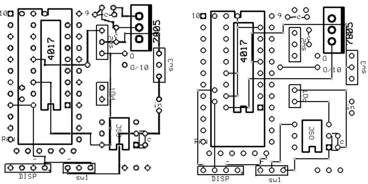

*图 9-13：方波生成器的 PCB 保护板的顶部（左）和底部（右）铜箔图案*

在保护板上组装组件时，特别需要注意旁路电容。0.1 μF 电容从 LTC1799 振荡器的第 1 引脚到地的引线越短，振荡器工作得越好。我实际上将电容直接焊接到芯片安装板上。

图 9-13 展示了保护板上的组件布局。请注意，HCT4017（CD 4017）位于 Pro Mini 的下方；PCB 是这样设计的，以节省空间，并将高频信号的走线保持在最小长度。

像其他项目一样，只有在 Pro Mini 的插针与板子连接的地方才需要填充连接器，此外在第 1 号引脚处还需要一个连接器，以简化 Pro Mini 在保护板上的对接。LM7805 电压调节器不需要散热片。

### 构建

构建方波生成器相对简单，但需要注意的是，我在布线开关 SW1 的引脚时并没有特别小心，SW1 提供了振荡器的分频器，或者在布置和布线电位器时没有特别注意。缩短这些引线——也许还需要调整组件本身的位置——可能会在较高频率下改善波形的完整性。图 9-14 展示了我的方波生成器的内部结构；如果仔细观察，你可以看到我手写的标注，指示各部分的位置。

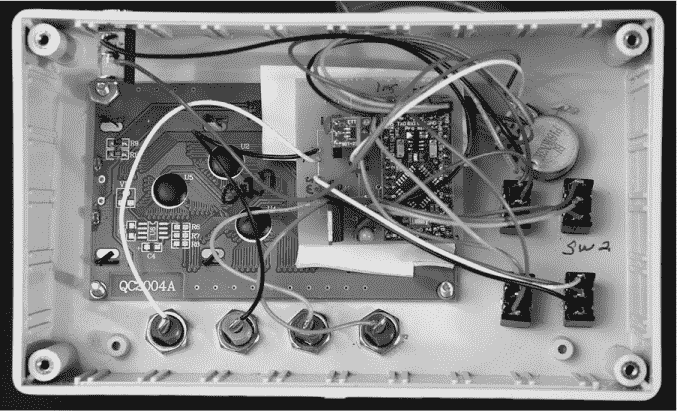

*图 9-14：所有组件轻松装入斜面面板外壳。LCD 通过四个螺丝固定，保护板通过双面泡沫胶粘剂安装在 LCD 上方。开关、I/O 插孔和电位器都是手工焊接的*。

#### *准备外壳*

首先，在外壳的前面标记以下孔位：

• 两个用于切割 LCD 的空间

• 四个用于 LCD 的安装孔

• 四个香蕉插孔

• 四个用于开关

• 一个用于电位器

如果你使用的是我在 “零件清单” 中推荐的 Hammond 1595C 倾斜前外壳（见 第 260 页）或类似的外壳，可以按照图 9-15 中的模板操作。只需找到本书资源文件中的 PDF 绘图，打印出来，将其放在外壳前面，并小心地用中心冲孔标记孔的位置。我还会用细尖的 Sharpie 马克笔标记位置并在外壳上画线。多余的马克笔痕迹可以用异丙醇轻松清除。

图 9-16 展示了如何利用外壳的半径来确定显示屏的位置。

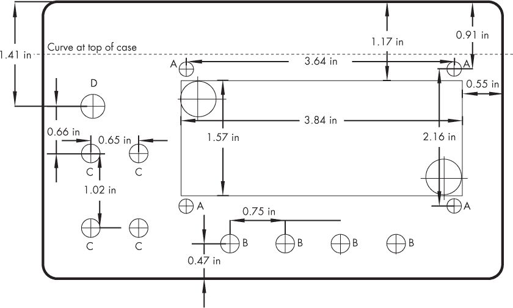

*图 9-15：方波发生器的钻孔模板*

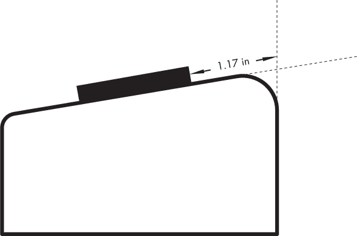

*图 9-16：使用外壳的半径来定位 LCD 的位置*。

我按照以下顺序钻孔：

1.  小心地在 LCD 切口的四个角钻 1/2 英寸的孔。如果你正确标记了孔的中心，显示屏的边缘将与孔的外径相切。然后，你可以连接孔的边缘画线，作为切割显示屏的指导。

1.  使用钥匙孔锯或弯锯切割显示屏。外壳由相对较软的 ABS 塑料制成，所以切割应该不成问题。

1.  如有必要，用锉刀清理切口处的碎屑，并检查显示屏是否合适。

1.  钻四个安装孔（在图 9-15 中标记为 A）以安装显示屏。

1.  钻四个 5/16 英寸的孔以安装香蕉插座（标记为 B）。

1.  钻四个 1/4 英寸的孔以安装开关（标记为 C）。建议在外壳的内部使用永久性标记笔标出开关位置，以简化接线过程。

1.  钻一个 9/32 英寸的孔以安装电位器（标记为 D）。

1.  找一个你喜欢的位置，将 3.5 毫米电源插孔距离外壳边缘 3/4 英寸，距离底部 1/2 英寸。然后在该位置钻一个 1/4 英寸的孔来安装 3.5 毫米插孔。

1.  使用四个 4-40 螺丝将 LCD 安装在外壳上。某些 LCD 屏幕的一侧有一个凸起，用于背光。如果你的 LCD 有这个凸起，你需要将 LCD 抬离外壳表面，以适应右边缘的背光部分（当你将 LCD 放置在顶部连接端时）。我通常在螺丝背面放置 4-40 螺母，以腾出空间。如果单个螺母不够（4-40 螺母的厚度不同），可以加垫圈。然后，将显示屏固定在外壳上。如果你的显示屏没有凸起部分，只需将显示屏直接固定在外壳上。

1.  将香蕉插头插座和开关安装到外壳中。有时，将电线焊接到开关和插座上比直接焊接到外壳上更容易，以减少意外接触焊接铁而造成的外壳损坏。

#### *布线电子元件*

在将 PCB 屏蔽板安装到外壳之前，先将元件焊接到屏蔽板上，并将 LCD、电位器、开关、电源插孔和香蕉插孔的所有电线焊接好。你可能会发现先焊接开关和插孔的电线会更方便。如果不确定的话，可以在电线预留一些额外的长度，但记住一句话：“如果电线太短，你总是可以接上；如果电线太长，你就不知道怎么处理了。”我建议使用公母排针连接 LCD，以便更方便地接线。

我直接使用双面泡沫胶带将屏蔽板固定在 LCD 的背面。然而，这可能导致在较高频率下波形出现失真。你可能更喜欢将模块安装得尽可能远离显示屏。外壳的前面除了根据需要放置标签外，不需要特别处理。

### 设计笔记与修改

在实现本章所述的方波生成器版本之前，我玩过几次方波生成器的不同版本。在这个过程中，我调整了一些方面，并考虑了其他修改。虽然这一部分的想法没有进入这个项目，但你可以尝试自己实现它们。

#### *以其他单位显示频率*

草图以 Hz 显示方波频率，因为我计划的大多数应用都在 100 Hz 到 10 kHz 之间。但如果你发现自己在高频率下频繁使用该设备，查看六个或七个整数可能会令人困惑。别担心：只需截断显示，轻松就能将草图更改为显示 kHz 甚至 MHz 的频率。

要截断显示，只需添加一个逗号和你希望显示的数字位数。例如，要从 Hz 更改为 kHz，只需在草图中更改以下行：

lcd.print(freq);

lcd.setCursor(10, 1);

lcd.print("Hz");

改为这些行：

lcd.print(freq/1000);

lcd.setCursor(10, 1);

lcd.print("kHz");

如果你想减少显示的数字位数，请更改这一行：

lcd.print(freq/1000);

改为：

lcd.print(freq/1000,3);

你可以将`3`改为你希望显示的数字位数。

#### *读取外部输入频率*

原理图和完成的项目包括一个开关，用于从生成脉冲切换到读取外部输入的频率。开关（SW3）将输入插孔直接连接到 Arduino 的输入端（第 5 引脚），这是振荡器通常连接的地方。我已成功地将其用于各种应用，特别是当我想在车间外部快速读取频率时。

由于没有电路保护处理器，所以请小心操作。该设备旨在使用标准 TTL 电平的输入—0 到 5V。Arduino 对信号较为敏感，甚至可以检测到较低电平的信号。然而，如果你计划将其与非常低电平的输入（即低于 0.5V）一起使用，那么你应该构建某种预分频器或前置放大电路。

如果你计划将方波发生器作为独立的频率计使用，你可能需要考虑使用前置放大器来提供放大功能，并防止处理器损坏。一个简单的前置放大器示例见于图 9-17，它使用了 74HC14 六反相施密特触发器的六分之一。

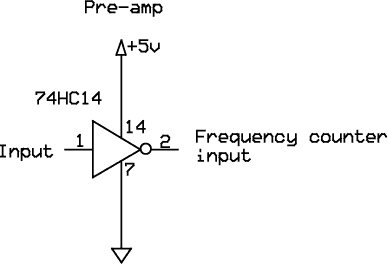

*图 9-17：频率计输入的可选前置放大器/缓冲器*

使用前置放大器有助于保护 Arduino 的输入，因为前置放大器的输出将被限制在供电电压内。

#### *电池供电*

尽管这个项目最初是为外部电源设计的，但它可以轻松转换为电池供电。LCD 背光开启时的总电流消耗略低于 100 毫安。锌锰电池的容量大约为 500 毫安时。因此，你可以预计电池使用时间大约为 5 小时。碱性电池通常会表现得更好。

为了适应电池供电，我简单地将电源开关替换为一个带有中立位置的开关。我将一个外部端子连接到基于交流电的电源插孔，另一个外部端子连接到电池的正极，中心端子连接到 PCB 屏蔽上的正电源轨。电池的负极连接到地。当前电路图中展示了这种配置。如果你使用我建议的外壳，电池应能方便地安装。你可以使用双面胶粘贴电池座。
