## 第十一章：**色度温度计**


这个项目最初是为了提供一个快速的本地温度视觉指示。最简单的形式，它是一个通过依次点亮不同颜色的 LED 来显示温度的温度计。然而，在开发过程中，项目增加了更多的功能，包括一个 LCD 显示屏来补充基本的颜色显示。在实验过程中，我遇到了一个 IC，它提供了极为准确的测量而无需特殊校准，从而大大提高了设备的性能。

色度温度计包括 10 个不同颜色的 LED，当传感器检测到特定温度时，每个 LED 都会亮起。原始版本设计用于测量 68 到 78°F 的温度，每个 LED 表示 1°F 的温度变化。后来，我根据不同的应用对其进行了调整。完成的项目如图 10-1 所示，可以测量广泛的温度范围。它还包括一个防水探头，用于测量液体中的温度，这对于鱼缸、游泳池等非常有用，并且可以构建成各种物理配置。在草图中显示的版本，温度范围从 76 到 86°F，温度变化为 1°F 的增量。

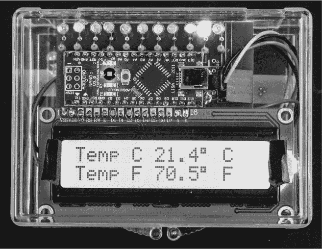

*图 10-1：完成的色度温度计*

你还可以通过在特定温度下闪烁灯光来编程设置警报，或者通过增加一些硬件，你可以加一个可听警报。我相信你能想出更多的硬件或软件修改，使这个温度计成为一个非常实用的设备。

### 选择温度传感器

任何电子温度计的关键成分是温度传感器。市面上有许多种温度传感器可供选择。

*热敏电阻*随着温度的变化而改变电阻，其价格范围从便宜到非常昂贵，具体取决于它们的制造和测试方式。*电阻温度探测器 (RTDs)*使用纯金属线圈，如银、铂或铜，绕在玻璃核心周围。将 RTD 组合在一个电阻桥中，可以达到非常高的精度，但它们的价格相对较贵。*热电偶*仍然是行业标准的传感技术，特别是在高温下（即超过 500°C）。在较低温度下，由于准确性、精度、一致性和线性，热电偶正被 RTD 所取代。

*半导体温度传感器*——即专用的集成硅传感器电路——因其精度、可靠性、坚固性和便利性而持续受到欢迎。在准备这个项目时，我几乎看遍了所有的方案，并选择使用了半导体传感器，因为它提供了足够的准确性，同时连接简单，价格也适中。

对于任何温度计，*精度*和*分辨率*都是问题。可以将精度视为测量温度的能力，其接近由 NIST（美国国家标准技术研究院）建立的某个标准值，带有一些偏差。对于这个简化的定义，分辨率可以称为*重复性*——即在相同环境下，能够稳定地读取相同的温度。

第七章中的自定义 pH 计使用了沸水和冰水溶液的温度，分别设定了 100°C 和 0°C 的边界，以校准温度计。我使用相同的方法检查了色差温度计，但我使用了这里描述的高精度 MCP9808 模块作为标准，因为它非常接近。

精度和分辨率最终是一个系统问题——并不一定是传感器的问题。这个项目讨论了两种具有基本相同精度和分辨率的不同传感器。最简单的传感器，LM35 模拟温度传感器，依赖于系统的其他部分来保证其精度和分辨率。第二种传感器，MCP9808 芯片，无论是否使用附带的分离板，都能提供精确的结果，因为它将其他可变组件集成到了芯片内部的子系统中。

LM35 和 MCP9808 都具有 0.25°C 的最大精度和 0.0625°C 的分辨率。为了实现这种精度，它们使用*硅带隙温度传感器*，该传感器利用了硅二极管的正向电压。然而，除了传感器外，MCP9808 还包括其自带的芯片内 ADC、电压参考和其他内部电路，以确保精度。

**注意**

*如果你想深入了解带隙传感器技术，网上有大量相关信息，包括 Bob Widler 的背景资料，他通常被认为是发现这一现象的关键人物*。

在这个项目中，LM35 依赖于 Arduino 的 ADC 和电压参考，虽然其性能相当不错，但与 MCP9808 的单片系统不匹配，因此可能需要进行校准，正如在《LM35 系统示例》中所展示的，第 289 页中提到的。当我使用 MCP9808 构建一个版本时，我使用了 Adafruit 的芯片分离板，因为它极大简化了组装——无需为 MicroSMT 封装的小引脚而烦恼。

虽然 MCP9808 的价格高于 LM35D，但它的表现相当好。我在项目的 PCB 护盾板中包括了用于该芯片的引线，如果你选择使用《使用 SOIC 封装》中建议的某种技术来焊接它，第 20 页提供了详细说明。

### 所需工具

焊接铁和焊锡（可选）电钻和 1/4 英寸钻头（用于钻孔以连接远程温度传感器或为电源适配器打孔）

### 零件清单

首先，决定你想使用哪种温度传感器：LM35 还是 MCP9808。如果你只想使用 LM35，这里是制作基本色差温度计所需的配件：

一块 Arduino Nano 或其克隆版

一个 LM35 温度传感器

十个不同颜色的 LED（见“模块：尝试不同的 LED”在第 300 页）

十个 ZTX649 晶体管，十个 470 欧电阻

一个 7.5 至 9V 的墙壁适配器，或等效的（或 9V 电池）

一个塑料外壳（见“构建”在第 298 页），28 或 30 号的连接线

一块印刷电路板（使用提供的保护板模板，设计自己的保护板，或者使用任何你熟悉的原型板。）

在本章中，我还描述了几种色度温度计的变体。购物之前可以先快速浏览一下项目，如果你想制作其中一种变体，也需要购买以下物品：

如果你计划按照“设计决策：远程温度传感器”中描述的方式使用温度传感器，购买一个 3.5mm 立体声插孔。如果你的色度温度计需要数字显示屏，还需要购买一个 16×2 I²C LCD。

对于高精度色度温度计，将 LM35 替换为一个 MCP9808 Adafruit Breakout 板，或一个带 100nF 电容和两个 10 千欧电阻的 Microchip MCP9808 芯片。

对于面包板原型，请确保你有一块大型面包板（与本书中使用的大部分小型面包板不同）和至少 30 根跳线。

**设计决策：远程温度传感器**

如果你的应用需要走不同的方向，可以修改保护板以*远程连接芯片*。也就是说，你可以直接将长电线连接到芯片（只需要四根电线），并将芯片放置在与显示屏分开的地方。如果你远程连接芯片，只需在芯片附近的引脚 4 和 8 之间添加一个小电容（约 100nF），如图 10-2 所示。

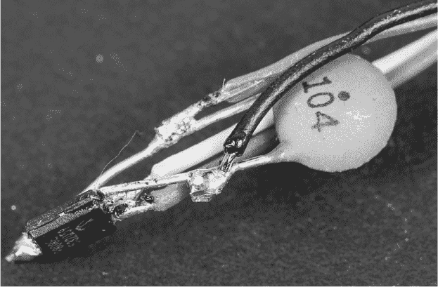

*图 10-2：MCP9808 与直接焊接的电线*

然而，请记住，I²C 代表*集成电路间通信*，用于芯片间通信。因此，MCP9808 只能与 Arduino 保持有限的距离。虽然一些在线爱好者声称成功使用长达 100cm 的电缆，但我能够稳定使用的最长距离约为 50cm。另一方面，LM35 可以通过三根电线实现远程连接并且可防水，适用于更长的距离，而不需要微型工具和像钟表匠那样的灵活手指。（如果你只能容忍两根电线，可以参考 LM35 的数据表，它有解决方案。）

MCP9808 可能像我在第七章中的定制 pH 计中用 LM35 那样进行封装，尽管我没有尝试过。制作远程传感器时，尝试将连接点隔离开，并保持芯片的精密引脚不被折断，可能会成为使用 MCP9808 时的一个问题。

这是在制作最终色度温度计之前需要做出的设计决策，因此我建议你在组装设备之前，通读本章以便做出决定。

### 下载

**LM35 版本的代码** *LM35Thermo.ino*

**MCP9808 版本的代码** *9808Thermo.ino*

***Adafruit_MCP9808*** **库** *[`www.adafruit.com/product/1782`](https://www.adafruit.com/product/1782)*（仅适用于 MCP9808 温度传感器）

**电路板模式（用于扩展板）** *Thermo.pcb*

### Chromatic Thermometer（彩色温度计）的工作原理

在实际操作中，Chromatic Thermometer（彩色温度计）相当简单。首先，我们来看看使用 LM35 传感器的基本配置。

该传感器产生的电压为 10mV/°C。例如，在 28°C（约 82°F）时，芯片输出 0.280V。你可以用万用表轻松检查这个值。要制作一个可用的 Arduino 温度计，你所要做的就是将这个电压转换为 Arduino 能理解的值，然后让 Arduino 将其转换为你希望在 LED 或 LCD 上显示的内容。

第一步是将模拟电压转换为数字值，以便 Arduino 能处理。为此，将传感器的输出连接到 Nano 的一个模拟输入端口。（我通常使用 A0，但任何模拟输入都可以使用。只要不要使用 A4 或 A5，因为这两个端口用于本项目的 I²C 部分。）与 Nano 使用的 5V 电压相比，LM35 的输出电压相对较低，ADC 将 5V 电压分为 1,024 部分（范围 = 0 到 1,023）来确定输入电压的模拟值。如果直接使用 LM35 的输出，每变化 1 摄氏度，输出电压就会变化 0.010V，从而使 ADC 的结果在 1,024 总单位中变化 2.046 个单位。

这样工作正常，但参考电压非常低端时 ADC 的小增量容易受到随机误差的影响。由于 Nano 的 ADC 只输出整数，因此也会有显著的四舍五入误差。

为了减少误差的影响，你将把 ADC 的参考电压从 5V 更改为 1.1V，其中 1,024 个增量的每一个在 5V 时表示 0.004882V，而在 1.1V 时每个增量仅表示 0.00107V。这样，温度每变化 1 摄氏度，只会对应 1,024 单位中的 9.345 个增量。因此，LM35 在 28°C 时输出的 0.280V 将对应大约 261 个单位，而不是 52 个。

### 原理图

图 10-3 显示了该项目的原理图。

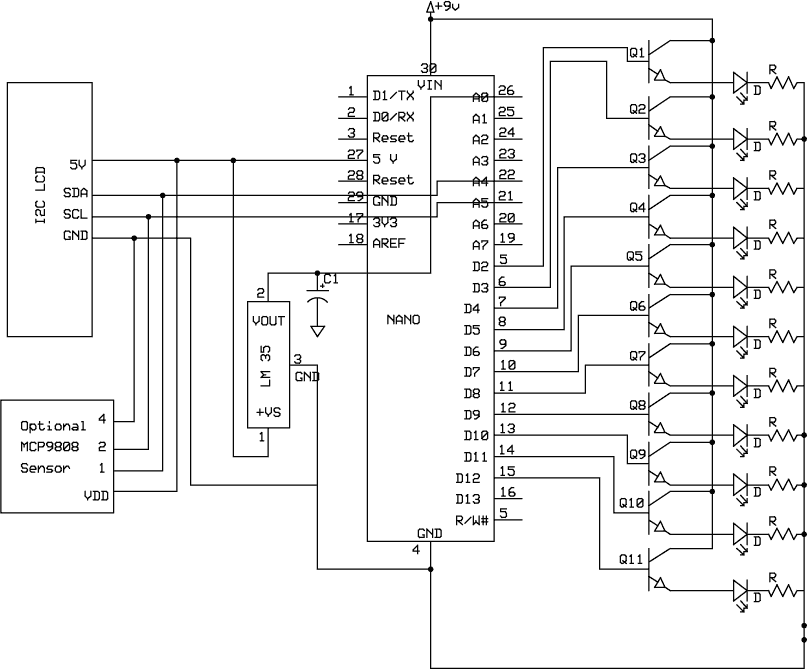

*图 10-3：彩色温度计的原理图*

请注意，在这个代码中，LM35 和 MCP9808 两个传感器都已经连接。这并不成问题，因为你可以通过修改上传到 Arduino 的代码，在软件中选择使用哪个传感器。你可以连接其中一个或两个传感器。该原理图还显示了带有 LCD 的彩色温度计，但如果你只想根据 LED 读取温度，这部分是可选的。

Arduino 处理器可能能够单独驱动 LED，但我选择为每个 LED 使用晶体管驱动器。这可以确保如果你选择使用更高输出的 LED，甚至白炽灯泡时，也不会有驱动问题。所使用的晶体管能够承受最高 1A 的电流。

一个第 11 个 LED-晶体管-电阻组（Q11）被连接到 Nano 的 D12 引脚，尽管最终的色温计仅使用 10 个 LED。我展示了这个额外的配对，甚至将其包含在了屏蔽 PCB 文件中，给你一个内置的自定义选项。你可以添加另一个温度数字、蜂鸣器报警或任何其他输出设备。

### 面包板

和本书中的其他项目一样，我建议先使用面包板来测试设计并运行草图，然后再进行最终的组装。因为该项目使用了 10 个 LED 和 10 个驱动晶体管，所以我使用了一个大尺寸面包板，以便能舒适地放置所有组件（见图 10-4）。

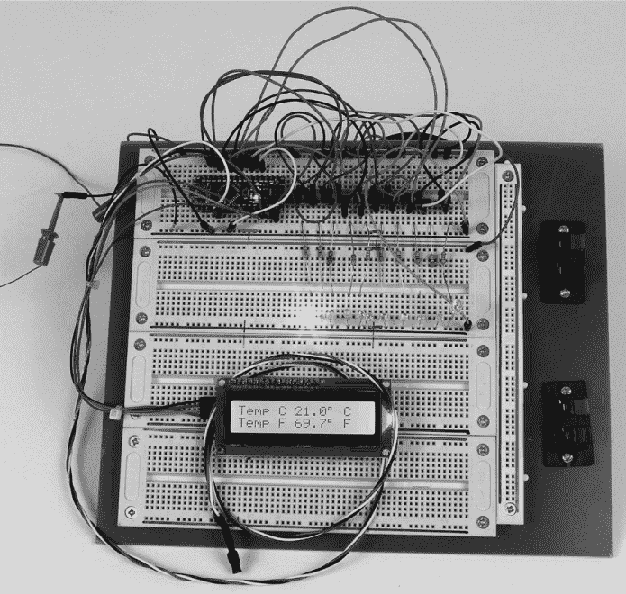

*图 10-4：完成的色温计面包板*

LED 位于面包板的中间，其中一个 LED 亮起。为了 LCD，我组装了一条线束。LM35 温度传感器（左）通过绳索连接，并被热缩管固定，这样它就防水了。

以下是我用来组装面包板的步骤：

1.  将 Arduino Nano 放置在面包板的左上角。

1.  将 Nano 的 VIN（引脚 30）连接到来自电池或其他电源的 9V 输入位置。

1.  将 Nano 的 5V 引脚连接到红色正极轨道。

1.  将 Nano 的 GND（引脚 4）连接到面包板上的蓝色负极轨道。

1.  确定 10 个驱动晶体管（Q1 到 Q10）的放置位置，并将它们放置在面包板上。我将它们放置成晶体管的斜边朝右，当从板子的底部看时。

1.  将所有晶体管的集电极连接到 9V 输入所在的位置（Nano 的 VIN）。请参见图 10-5 查看晶体管的引脚图。

    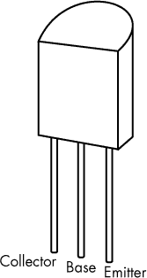

    *图 10-5：ZTX649 晶体管的引脚图*

1.  将 Q1 的基极连接到 Nano 的 D2（引脚 5）。

1.  将 Q2 的基极连接到 Nano 的 D3（引脚 6）。

1.  将 Q3 的基极连接到 Nano 的 D4（引脚 7）。

1.  将 Q4 的基极连接到 Nano 的 D5（引脚 8）。

1.  将 Q5 的基极连接到 Nano 的 D6（引脚 9）。

1.  将 Q6 的基极连接到 Nano 的 D7（引脚 10）。

1.  将 Q7 的基极连接到 Nano 的 D8（引脚 11）。

1.  将 Q8 的基极连接到 Nano 的 D9（引脚 12）。

1.  将 Q9 的基极连接到 Nano 的 D10（引脚 13）。

1.  将 Q10 的基极连接到 Nano 的 D11（引脚 14）。

1.  将 Q1 到 Q10 的所有晶体管的发射极连接到每个有色 LED 的正极引脚。

1.  将 LED 的负极引脚连接到面包板上的一个空位置。

1.  将 470 欧姆电阻的一端连接到每个 LED 的负极引脚。

1.  将 470 欧姆电阻的另一端连接到地（蓝色负极轨道）。

1.  将 LM35 的引脚 1（4–20V）连接到红色正极轨。（请参见图 10-6 查看 LM35 的引脚图。）

    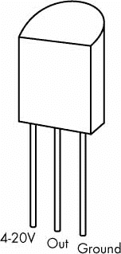

    *图 10-6：LM35 温度传感器的引脚图*

1.  将 LM35 的引脚 3（GND）连接到蓝色负极轨。

1.  将 LM35 的输出引脚（中间）连接到 Nano 的 A0（26）引脚。

1.  24. 将电源和接地分别连接到红色正极轨和蓝色负极轨。

现在，你已经完成了最基本的配置。要添加数字显示屏：

1.  将 LCD 的 I²C 适配器的电源和接地引脚分别连接到红色正极轨和蓝色负极轨。

1.  将 LCD 的 I²C 适配器的 SDA 引脚连接到 Nano 的 A4（22）引脚。

1.  将 LCD 的 I²C 适配器的 SCL 引脚连接到 Nano 的 A5（21）引脚。

1.  将适当的软件代码上传到 Nano。

如果你想使用高精度温度传感器：

1.  从电路中移除 LM35（或者你也可以将其保留在电路中——它不会影响任何东西）。

1.  将高精度传感器放置在一个位置，以避免引脚受到任何影响。

1.  将 MCP9808 传感器的 I²C 连接的电源引脚分别连接到 Nano 的蓝色负极轨和 5V——引脚 27，或者红色正极轨。

1.  将 MCP9808 传感器的 I²C 连接的 SDA 引脚连接到 Nano 的 A4（22）引脚。

1.  将 MCP9808 传感器的 I²C 连接的 SCL 引脚连接到 Nano 的 A5（21）引脚。

1.  使用高精度传感器版本的代码上传软件到 Nano。

现在你已经准备好开始了。

**注意**

*这个面包板的正负电源轨不连续。前 15 个连接在一起，接下来的 20 个连接在一起，最后 15 个连接在一起——但它们之间没有连接。我使用跳线根据需要连接这些电源轨。*

### 草图

这个草图有两个版本：一个是 LM35 版本的项目，另一个是 MCP9808 版本的项目。你可以根据想要构建的色谱温度计版本选择草图，但两个草图都包括三个基本部分。

在加载库和初步设置的样板代码部分之后，每个草图的第一部分涉及温度传感器本身。第二部分涉及设置温度和 LCD 显示（如果使用）。每个草图的最后部分详细说明了打开和关闭 LED 的条件，以指示温度。我已在代码中适当地添加了注释。

#### *LM35 系统的草图*

这是使用 LM35 传感器的色谱温度计草图，包括数字 LCD 显示。

```

    //Chromatic Thermometer sketch for the LM35, with an alarm
    //around 78 to 79 degrees Fahrenheit (26 degrees Celsius) 

    #include <Wire.h>              //Set up Comm wire library 
    #include <LiquidCrystal_I2C.h> //Set up LCD library with I2C 

    LiquidCrystal_I2C lcd(0x27, 16, 2); //16x2 display I2C address 0x27 

    //Establish the number of readings to average at 10
➊  const int numReadings = 10; 
    float readings[numReadings];        //The readings from the analog input 
    int index = 0;                      //The index of the current reading 
    float total = 0;                    //The running total
    float average = 0;                  //The average
    int tempPin = A0;
    float TempC; 
    float tempF; 

    void setup() {
      lcd.init();                       //Initialize LCD and turn on backlight
      lcd.backlight(); 

      //Initialize serial communication with computer:
      Serial.begin(9600); 

      //Initialize all the readings to 0:
      for(int thisReading = 0; thisReading < numReadings; thisReading++)
      readings[thisReading] = 0; 

      analogReference(INTERNAL);        //Set voltageReference = 1.1V 
    } 

    void loop() {
      total = total - readings[index];          //Subtract the last reading
      readings[index] = analogRead(tempPin);    //Read from the sensor
      total = total + readings[index];          //Add the reading to the total 

      //Advance to the next position in the array:
      index = index + 1; 

      if(index >= numReadings)     //If we're at the end of the array…
        index = 0;                    //…wrap around to the beginning 

      average = total / numReadings;  //Calculate the average temperature
      TempC = average / 9.81;         //Adjust/calibrate average 
                                      //based on empirical measurement

      tempF = (TempC * 9 / 5) + 32;   //Convert to Fahrenheit
     //Set up serial readout if desired
      Serial.println();
      Serial.print("TempC  ");
      Serial.println(TempC);
      Serial.print("TempF  ");
      Serial.println(tempF);
      Serial.print("Average  ");
      Serial.println(average);
      delay(10);                    //Delay in between reads for stability 

      //Set up for LCD
      lcd.setCursor(0, 0);
      lcd.print("Temp                  ");
      lcd.setCursor(7, 0);
      lcd.print(TempC, 1);
      lcd.print((char)223);         //Degree symbol see below
      lcd.print(" C");
      lcd.setCursor(0, 1);
      lcd.print("Temp  ");  
      lcd.setCursor(7, 1);
      lcd.print(tempF, 1);          //Truncate second decimal place
      lcd.print((char)223); 
    /*May need to use (char) 178 if LCD displays the greek alpha character. 
    Different LCDs display different special characters*/ 

      lcd.print(" F");
      delay(50); 

      //Beginning of conditional statements for display
      if((tempF > 85.00 ) && (tempF < 200)) {
        //85 degrees and 200 degrees are arbitrary.
        digitalWrite(2, HIGH);
      }
      else {
        digitalWrite(2, LOW);
      } 

      if((tempF > 84) && (tempF < 85)) {
        digitalWrite(3, HIGH);
      }
      else {
        digitalWrite(3, LOW);
      } 

      if((tempF > 83.00 ) && (tempF < 84)) {
        digitalWrite(4, HIGH);
      }
      else {
        digitalWrite(4, LOW);
      } 

     if((tempF > 82) && (tempF < 83)) {
        digitalWrite(5, HIGH);
      }
      else {
        digitalWrite(5, LOW);
      } 

      if((tempF > 81.00 ) && (tempF < 82)) {
        digitalWrite(6, HIGH);
      }
      else {
        digitalWrite(6, LOW);
      } 

      if((tempF > 80) && (tempF < 81)) {
        digitalWrite(7, HIGH);
      }
      else {
        digitalWrite(7, LOW);
      } 

      if((tempF > 79.00 ) && (tempF < 80)) {
        digitalWrite(8, HIGH);
      }
      else {
        digitalWrite(8, LOW);
      } 

      if((tempF > 78) && (tempF < 79)) {
        //Code for blinking LED as an alarm
        digitalWrite(9, HIGH);
        delay(50);
        digitalWrite(9, LOW);
        delay(50);
      }
      else {
        digitalWrite(9, LOW);
      } 

      if((tempF > 77.00 ) && (tempF < 78)) {
        digitalWrite(10, HIGH);
      }
      else {
        digitalWrite(10, LOW);
      }

      if(tempF < 76) {
        digitalWrite(11, HIGH);
      }
      else {
        digitalWrite(11, LOW);
      }
  }
```

在包括库之后，LM35 草图在➊处定义了要跟踪的样本数量。样本数量越高，读数越平滑，但稳定下来所需的时间也越长。使用常量而不是普通变量来表示样本数量，使得该值能够决定`readings`数组的大小。

`setup()` 代码初始化 LCD，打开串行通信以进行调试，将读取数组初始化为全零（因为草图尚未读取任何数据），并将 ADC 参考电压设置为 1.1V。`loop()` 代码将传感器数据存储在 `readings` 数组中，并通过平均这些读数来计算要显示的温度。如果你有 LCD，草图会在其上显示温度，然后检查各种温度范围，并通过 `if` 语句决定哪些 LED 需要打开。

这个草图和下一个草图之间的最大区别在于，LM35 版本设置系统以接受来自传感器的模拟电压，并将其引导到模拟输入。它还通过 `analogReference(INTERNAL)` 命令建立了一个 1.1V 的参考电压。

#### *MCP9808 系统的草图*

高精度 MCP9808 芯片版本（或 Adafruit 的开发板）的草图使用了大部分相同的代码；用于打开 LED 的条件语句是相同的。唯一不同的部分是 Arduino 如何从传感器获取温度信息。以下是完整的草图：

```

/*Sketch for MCP9808 version of Chromatic Thermometer

 This version of the Chromatic Thermometer uses the Adafruit MCP9808 breakout
 Board (or Microchip MCP9808 chip) and the Adafruit_MCP9808 library
 available from Adafruit ----> https://www.adafruit.com/product/1782

 The averaging may not be necessary. It tends to slow the
 response a little, but smoothes out the display.

 The result is truncated to a single decimal for both Celsius and Fahrenheit.
 This version includes the code to turn on and off 10 LEDs.
*/ 

#include <Wire.h>               //Set up wire/serial library 
#include "Adafruit_MCP9808.h" //Set up MCP9808 library 
#include <LiquidCrystal_I2C.h>  //Set up library for LCD 

LiquidCrystal_I2C lcd(0x27, 16, 2);   //16x2 display; define LCD 

// Create the MCP9808 temperature sensor object 
Adafruit_MCP9808 tempsensor = Adafruit_MCP9808(); 

const int numReadings = 10;     //Once again averaging 10 readings 
float readings[numReadings];    //The readings from the analog input
int index = 0;                  //The index of the current reading
float TempC = 0;
float tempF = 0;
float total = 0;                //The running total 
float average = 0;              //The average

 void setup() {
  Serial.begin(9600); 

  lcd.init();  //Initiate LCD and backlight
  lcd.backlight(); 

/*Make sure the sensor is found. You can also pass a different I2C address
from the default, as in tempsensor.begin(0x19).*/   
  if(!tempsensor.begin()) { 
    Serial.println("Couldn't find MCP9808!");
    while(1);
  }
} 
void loop() {
  //Read and print out the temperature; then convert to Fahrenheit
  float c = tempsensor.readTempC();
  total = total - readings[index];
  //Read from the sensor
  readings[index] = c;
  //Add the reading to the total
  total = total + readings[index];
  //Advance to the next position in the array
  index = index + 1;
  if(index >= numReadings)        //If we're at the end of the array… 
    index = 0;                        //…wrap around to the beginning:
  //Calculate the average
  average = total / numReadings; 

  TempC = average;
  tempF = (TempC * 9 / 5) + 32;
  delay(100); 

  //Set up LCD to print out temperatures
  lcd.setCursor(0, 0);
  lcd.print("Temp          ");
  lcd.setCursor(6, 0);
  lcd.print(TempC, 1);                //Truncate to one decimal place
  lcd.print((char)223);
  lcd.print(" C");
  lcd.setCursor(0, 1);
  lcd.print("Temp  ");  
  lcd.setCursor(6, 1);
  lcd.print(tempF, 1);               //Truncate to one decimal place
  lcd.print((char)223); 
/*May need to use (char) 178 if LCD displays the greek alpha character. Different LCDs display different special characters*/

  lcd.print(" F");
  delay(100); 

  //Beginning of conditional statements for display
  if((tempF > 85.00 ) && (tempF < 100)) {
  digitalWrite(2, HIGH);
  }
 else {
  digitalWrite(2, LOW);
  } 

  if((tempF > 84) && (tempF < 85)) {
  digitalWrite(3, HIGH);
  }
  else {
  digitalWrite(3, LOW);
  } 

  if((tempF > 83.00 ) && (tempF < 84)) {
  digitalWrite(4, HIGH);
  }
  else {
  digitalWrite(4, LOW);
  } 

  if((tempF > 82) && (tempF < 83)) {
  digitalWrite(5, HIGH);
  }
  else {
  digitalWrite(5, LOW);
  } 

  if((tempF > 81.00 ) && (tempF < 82)) {
  digitalWrite(6, HIGH);
  }
  else {
  digitalWrite(6, LOW);
  } 

  if((tempF > 80) && (tempF < 81)) {
  digitalWrite(7, HIGH);
  }
  else {
  digitalWrite(7, LOW);
  } 

  if((tempF > 79.00 ) && (tempF < 80)) {
  digitalWrite(8, HIGH);
  }
  else {
  digitalWrite(8, LOW);
  } 

  if((tempF > 78) && (tempF < 79)) {  //Code for blinking LED
  digitalWrite(9, HIGH);
  delay(50);
  digitalWrite(9, LOW);
  delay(50);
  }
  else {
  digitalWrite(9, LOW);
  }

 if((tempF > 77.00 ) && (tempF < 78)) {
  digitalWrite(10, HIGH);
  }
  else {
  digitalWrite(10, LOW);
  } 

  if(tempF < 76) {
  digitalWrite(11, HIGH);
  }
  else {
  digitalWrite(11, LOW);
  } 
}
```

MCP9808 草图版本的 `setup()` 代码检查确保你已连接 MCP9808 温度传感器。在 `loop()` 部分，它调用 *Adafruit_MCP9808* 库中的 `readTempC()` 函数来获取当前温度，而不是像 LM35 代码那样直接调用 `analogRead()`。与 LM35 代码不同，这个草图不需要设置外部电压参考：使用 MCP9808 的一个优点是该芯片自带内部参考电压。否则，除了几个变量名的不同外，其余的草图与 LM35 代码相同。

#### *温度显示的工作原理*

在这两个草图中，基本的温度显示由 10 个不同颜色的 LED 组成，LED 通过从 Nano 的 D2 到 D11 的输出端驱动的发射极跟随配置的晶体管来控制。

Nano 的输出由草图激活，每个输出对应一个条件语句，格式为：“如果温度在 *X* 度和 *Y* 度之间，开启 LED。如果不是，关闭 LED。”这些命令的 `if` 语句在 LM35 和高精度版本的 MCP9808 中是相同的。

当我第一次完成这个项目时，我将它用于一个盐水鱼缸，在那里我希望能够准确地远程查看温度。我设置了 LED 在温度达到不可接受的极限时闪烁，以引起我的注意，这样我就可以采取纠正措施。闪烁效果只需要在 LED 关闭和打开之间加入延迟。我修改了草图，使其在警告条件下如下所示：

```

  if((tempF > 78) && (tempF < 79)) {
    digitalWrite(9, HIGH);
    delay(50);
    digitalWrite(9, LOW);
    delay(50);
  }
    else {
      digitalWrite(9, LOW);
  }
```

这个示例仅当温度在 78°F 和 79°F 之间时才会闪烁显示，如完整草图所示。延迟的长度，再加上你可能添加的其他延迟，决定了闪烁的速率。

一般的读数系统和这个简单、安静的报警器一起工作得非常好。我可以设置报警，确保温度高于或低于阈值温度。

我还认为拥有一个数字读数可能很有价值，原因有两个：

1.  我想要能够准确查看温度。

1.  如果温度超出范围并且“闪烁”报警执行，我希望能够看到温度距离限制有多远。

添加数字显示屏相对简单，因为我使用了一个标准的 16×2 LCD 带有 I²C 接口，只需要四根线。这次我买了一个内置 I²C 适配器的 LCD。它比我希望的要大，但我很难找到一个更小的显示屏。如果你能找到一个更小的，尽管去买。

### 屏蔽

这个项目的 PCB 屏蔽板设计采用了两层铜而非单层。额外的层使得制造板子变得有些困难，但它在识别和连接跳线时节省了很多精力。我最初在内部蚀刻了板子，但最终是通过 Express PCB 制作了完成的板子。专业完成的板子上的电镀过孔使得组装更加容易。PCB 的层次结构在图 10-7 中展示。

请注意，LED 驱动晶体管位于 Nano 板下方，以节省表面面积。这样做的唯一缺点是 Nano 板稍微提高了一些。你可以在图 10-8 中看到这些晶体管，图中展示了带有 Nano 板的装配完毕的 PCB。

这个屏蔽板还包括了两个 I²C 设备的接口——每端一个。因为我认为这个板子可能会用到很多不同的项目中，所以我尽量让它尽可能灵活。I²C 连接使得连接高精度的 Adafruit breakout 板和数字显示屏变得非常容易。你可以直接接线，也可以将一个直角或直头的母头插座焊接到板子上，然后使用带有压接连接器外壳和电缆的方式（参见图 10-9）。

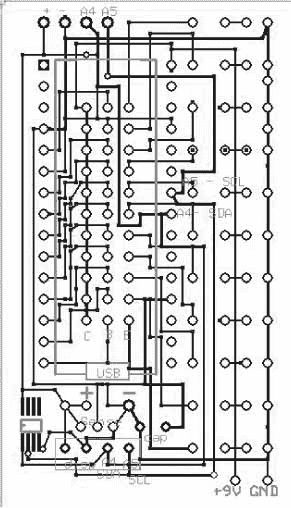

*图 10-7：带有丝网印刷图像的 PCB 屏蔽板的顶层。你可以看到底部左侧的 MCP9808 图案*。

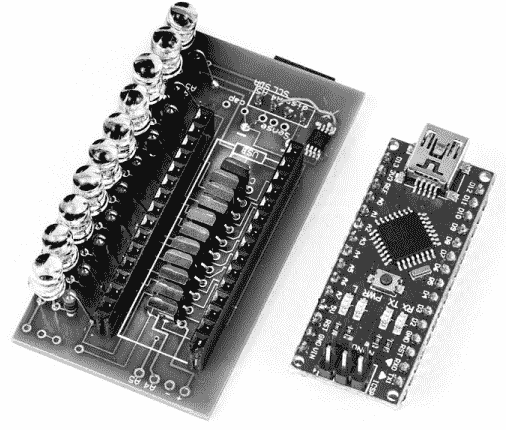

*图 10-8：装配完毕的屏蔽板，旁边是一个 Arduino Nano。注意我为 Nano 使用了全长母头插座。还请注意右上角的第 11 个 LED 的孔和迹线*。

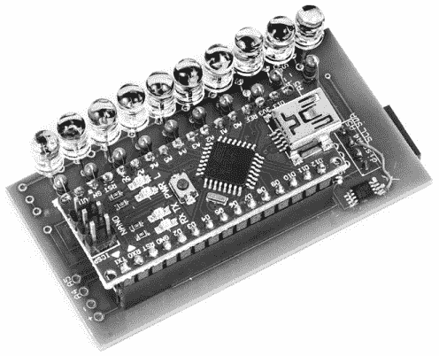

*图 10-9：使用 MCP9808 芯片直接焊接到屏蔽板上的组装温度计（右下角）。一个 I²C 连接器位于 MCP9808 芯片的上方和右侧；另一个 I²C 连接器的连接点位于左下角*。

如果你选择将 MCP9808 芯片直接焊接到板上，屏蔽板上有为 MCP9808 芯片预留的焊盘（见图 10-9）。如果你使用的是 MCP9808 芯片而不是带有 I²C 接口的分离板，你将需要为 SDA 和 SCL 线路提供 10 千欧姆的上拉电阻。这些电阻没有包含在屏蔽板布局中，但可以很容易地添加到 I²C 端口连接中，因为这些连接本来是没有使用的。在图 10-9 中的实现中，10 千欧姆的电阻安装在 LCD 适配器上，因为会有一个 LCD 适配器插入到 I²C 端口，从而不需要额外的上拉电阻。

尽管为本项目提供的屏蔽板文件支持将 LED 直接安装到 PCB 板上，但在许多情况下，你可能希望将 PCB 板与 LED 分开。例如，我做了一个版本，将高强度的 10 毫米 LED 按一英寸的间距排列在一块装饰木板上，以创造更具戏剧性的效果。要实现这种效果，你需要将长电线焊接到 LED 引脚上，然后再将这些电线焊接到 PCB 板上。所有 LED 的阴极可以连接在一起，只有阳极需要单独连接到电路板上。

### 构建

如果你还没有将组件焊接到屏蔽板 PCB 或原型板上，现在就开始焊接，并记得按照正确的极性安装 LED。Chromatic Thermometer 的最终配置很大程度上取决于你的最终应用，因此我不会在构建此项目时提供过多的具体细节。

例如，如果你想使用远程温度传感器，你需要一个插孔或者其他适当的连接器。你可能还需要在外壳上切一个缝隙，以容纳传感器的电线，以及另一条用于长电源连接的线。如果你打算只使用 LED 而不使用 LCD 来构建 Chromatic Thermometer，你可能会以不同的方式将电子元件安装到外壳内。类似地，如果你构建的是高精度版本，你可能需要调整零件在外壳中的布局。图 10-10 中的 Chromatic Thermometer 使用了 LM35 传感器和 16×2 LCD。

我使用了在亚马逊上找到的一款小盒子（最初是用来放棒球卡的）将整个装置封装起来，并将传感器直接安装到三个孔位的屏蔽板上，以便将其适配到 PCB 板中。如果你不想让 Nano 板上的 LED 显示出来，可以将其拆除，或者简单地用一小块黑色电工胶带将其遮住。

无论你使用 3 毫米 LED 还是更重的高输出 5 毫米 LED，使用某种间隔器都有助于确保 LED 按照你喜欢的高度对齐。当我将读数 LED 安装到护盾上时，我放置了一块未使用的 PCB 材料，将所有 LED 保持在一个统一的高度（见图 10-11）。你也可以使用纸板，若想要不同的高度，只需使用更高或更矮的间隔器即可。


*图 10-10：完成的色度温度计放置在亚克力外壳中，用于在旅行中监控冷却器中药物的温度。这个版本使用了 9V 电池，电池在外壳内部。我使用了带背光的显示器，但没有背光时电池寿命会更长。LED 的开关阈值被修改为适应低温使用*。

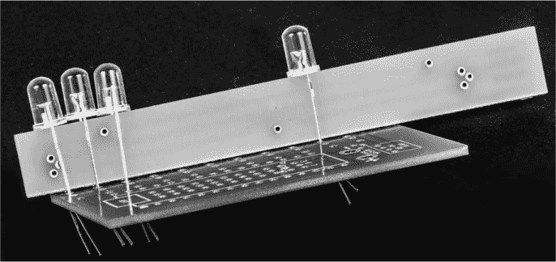

*图 10-11：我使用了废弃的 PCB 材料条来保持 LED 的统一高度*

如果你使用 5 毫米 LED，可能会发现它们难以通过标准 PCB 的孔洞，因为一些 5 毫米 LED 的引脚较宽。我使用钻头扩孔以适应较大的 LED；由于 PCB 的另一面没有连接，所以不需要镶嵌孔。

**MOD：尝试不同的 LED**

图 10-8 中所示的色度温度计使用了 3 毫米 LED。我在 eBay 上订购了 10 种不同颜色的 3 毫米 LED，但引脚有点短。随后，我订购了 200 颗 5 毫米 LED，包含 10 种不同的颜色。这些 LED 的引脚同样较短，但亮度更强，并且效果不错。我确实需要修整一些 LED 的边缘，去掉模具上留下的一些多余闪光，以便它们能适应 PCB 上 0.200 英寸（略大于 5 毫米）的间距。然而，我没能找到足够多不同颜色的高输出 5 毫米 LED。

对于一个实验版本，我使用了六种不同颜色的高输出 5 毫米 LED，在极端位置重复这些颜色，并返回草图，创造了闪烁模式以区分相似的颜色。这个版本的色度温度计效果很好，而且高输出的 LED 让它非常显眼。

为了吸引更多的注意力，你可以使用高输出的 10 毫米 LED。 但是，它们无法安装在此处所示的护盾 PCB 上，因为我只将 LED 间距设置为 0.200 英寸。这个间距适用于大多数 3 毫米和 5 毫米 LED，但不适用于 10 毫米 LED。有关尺寸比较，请参见图 10-12。

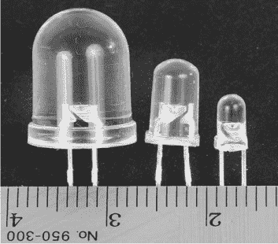

*图 10-12：从左到右，10 毫米、5 毫米和 3 毫米 LED 显示在一个米制尺旁*

要使用 10 毫米 LED，你必须将它们安装在其他地方，并用导线将它们连接到 PCB 上。可以参考第四章中的手表绕线器的灯条获取灵感。

### 使用色度温度计

如何将温度计放置在你想要监控的环境中，只有你的想象力可以限制。最初我在鱼缸上使用的版本没有 LCD 显示屏，所以我只是将几个金属线钩固定在裸板上，然后把它挂在水箱的边缘，LED 灯朝外。（我本可以把整个装置安装在一个小的丙烯酸盒子里，但我很难找到合适尺寸的盒子。）这种配置效果很好。

最终，我将那个色差温度计替换成了一个带有 LCD 显示屏的版本，并将其封装在一个丙烯酸盒子里。我正在考虑再次修改它，使用高强度的 LED 灯照射水箱，这应该能创造出一个有趣的效果！
