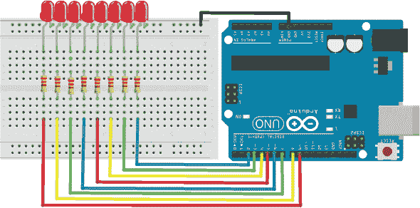

## 前言

欢迎来到*Arduino 项目手册第二卷*。如果你没有阅读第一卷，别担心——本书中的每个项目都是完全独立的，并旨在温和地向你介绍使用 Arduino 的世界。我们将在这里和下一章中涵盖一些开始使用 Arduino 的重要方面，因此如果你已经读过第一卷，你可以快速浏览作为复习，或者直接跳到新的项目部分。

本书使用 Arduino Uno，这是一个小巧、便宜的计算机，可以编程控制无数的设备和创作。你很快就会使用 Arduino 控制一系列项目，比如音乐键盘、温控风扇、数字温度计、指纹输入系统等。

Arduino 板由两个主要部分组成：硬件，即微控制器，它是板子的“大脑”；以及你将用来将程序发送到微控制器的软件。这个软件叫做 Arduino 集成开发环境（IDE），可以免费下载安装，我将在本书的入门部分教你如何使用它来设置一个简单的项目。

### 关于本书

是什么激发了我写这本书的灵感？互联网上充斥着关于 Arduino 和潜在项目的教程、视频和文章，但许多缺乏详细的视觉效果或构建这些项目所需的代码。本书旨在帮助你构建简单的项目，激励你在应用你将学到的技能和技术时，创造自己的发明。

**注意**

*在本书中，你将在面包板上创建你的项目。这是学习电路工作原理的最佳方式，因为连接不是永久性的；如果你犯了错误，可以直接拔掉电线或组件，再试一次。*

每个项目都包括它将要做的事情的描述、你需要的物品、设置的图片、简单的逐步说明以及用于快速连接参考的表格、一个电路图（见图 1）和必要的代码，因此你无需担心在开始之前学习编程。早期的项目提供了对代码中发生的事情的简单解释，帮助你理解编程过程，以便在需要时进行自己的修改。如果你不想输入那么多代码，可以下载草图，链接在*[`www.nostarch.com/arduinohandbook2/`](https://www.nostarch.com/arduinohandbook2/)*。

**图 1：** 本书中的电路图是使用 Fritzing（*[`www.fritzing.org/`](http://www.fritzing.org/)*）创建的，这是一个免费的开源程序。

在每个项目的开始，我会列出除了 Arduino Uno 之外所需组件的费用（见表 1）和预计的构建时间。在结尾，我会提供针对该项目的故障排除部分。

**表 1：** 本书中使用的费用指示

| **指示** | **费用** |
| --- | --- |
| $ | $1–$9 |
| $$ | $10–$19 |
| $$$ | $20–$29 |
| $$$$ | $30+ |

我写这本书是为了教你如何创建自己的电子产品。通过提供技术知识，我让你能够专注于创意设计部分。我的目的是让你理解电路的功能，这样你就可以发挥想象力，将这些电路应用到实际中。虽然我没有深入讲解电子学理论或编程，但本书中的项目逐步增加难度，会为你提供一个很好的起点。

本书为你提供了实用的信息，例如，你可以参考引脚连接并在需要时在不同的项目中复制它们。你还可以将多个项目结合起来，制作更复杂有趣的电子产品。许多 Arduino 书籍侧重于编程元素，这对于某种学习方式非常有帮助，但我认为即插即用的电子学也有其独特的价值。通过按照项目中的步骤操作，你将在过程中不断学习。

我写了这本书，它是我当初开始学习 Arduino 时所寻找却找不到的那本书。我希望你能像我写这本书时那样享受阅读和动手实践的过程。

### 本书的组织结构

我建议你先尝试一些早期的项目，因为你会在那里找到对更复杂项目有帮助的信息。但如果你看到一个自己喜欢的项目并且有信心完成它，你也可以跳过其他部分直接开始。本书的结构如下：

**入门：开始使用** 了解 Arduino Uno 的基本知识，学习如何使用面包板，然后通过一个简单的程序测试你的板子，最后学习如何进行焊接。

**第一部分：LEDs** 在这里，你将从学习如何使用可变电阻控制简单的发光二极管（LEDs）开始，然后将组件组合起来，构建一个光敏 LED、一个滚动文本显示器、一个闪烁的多彩指南针等等。

**第二部分：声音** 在这一部分，你将使用一个*压电元件*，这是一种发出声音的设备，通过一个音乐键盘来制作旋律，并创建一个简单的音频可视化器，让 LED 灯随着你的音乐跳动。

**第三部分：马达** 这些项目使用各种类型的马达来使你的创意作品动起来。你将构建一个模拟拨号器来测量光照强度，学习步进电机的工作原理，并制作一个温控风扇来保持凉爽。

**第四部分：LCD 屏幕** LCD 屏幕在许多项目中都非常有用，用于显示信息和结果。在这些项目中，你将学习如何设置串行 LCD 屏幕，并构建一个可拆解的炸弹游戏、一个超声波测距仪、一个移动版*乒乓*游戏，甚至一个酒精呼吸测试仪。

**第五部分：安全** 使用运动传感器保护你的空间，当有人进入时触发超声波喷水枪，并使用指纹扫描仪创建一个安全系统，防止未经授权的人进入。

**第六部分：智能机器** 在这一部分，你将结合 Arduino 与电机和传感器，创建一个智能机器人，使用蓝牙技术控制灯光，甚至还可以制作一个 GPS 测速仪来跟踪你的运动。

在本书的结尾，我提供了一些有用的参考信息，包括对一些常见程序错误的回顾及其修复方法、书中使用的组件及购买地点的信息，以及一个关于 Arduino Uno 引脚的参考表。
