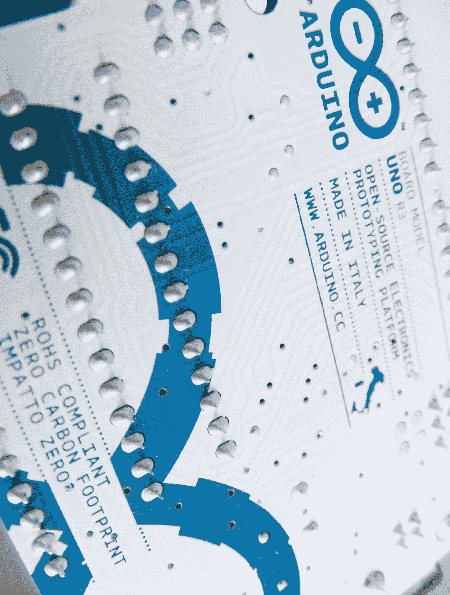

## 第一章：入门：开始使用

**在你开始使用 Arduino 之前，有一些你需要了解和做的事情。首先，让我们看一看本书所需的硬件和软件。接下来，你将通过一个简单的 LED 项目来测试 Arduino，并开始一些有用的技巧，比如焊接和下载有用的代码库。**

### 硬件

首先，让我们来看看 Arduino Uno 板和一些你将在几乎每个项目中使用的硬件。

#### Arduino Uno

市面上有许多类型的 Arduino 板，但本书仅使用最流行的 Arduino Uno，如图 0-1 所示。Arduino Uno 是开源的（意味着其设计可以自由复制），因此除了官方板（价格约为 25 美元），你还可以找到许多兼容的克隆板，价格约为 15 美元。

**图 0-1：** Arduino Uno 板

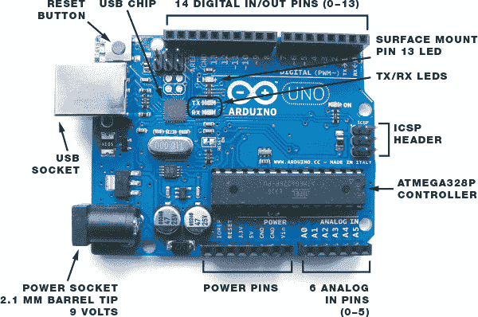

Arduino 通过向你连接的组件发送信息来控制它们，例如电机或 LED，这些信息作为*输出*（从 Arduino 发送出去的信息）。Arduino 从传感器读取的数据则是*输入*（进入 Arduino 的信息）。Arduino 上有 14 个数字输入/输出引脚（引脚 0–13），每个引脚可以设置为输入或输出（有关完整的引脚参考表，请参见“Arduino 引脚参考”，见第 253 页）。

#### 电源

当你将 Arduino Uno 板连接到电脑上传程序时，它通过电脑的 USB 端口供电。当 Arduino 未连接到电脑时，你可以通过连接一个 9 伏交流适配器或一个带 2.1 毫米插头的 9 伏电池包来使其独立运行，插头的中心引脚连接到正极电源，如图 0-2 所示。只需将插头插入 Arduino 的电源插座即可。

**图 0-2：** 9 伏电池包，你可以将其插入 Arduino，为其提供电源

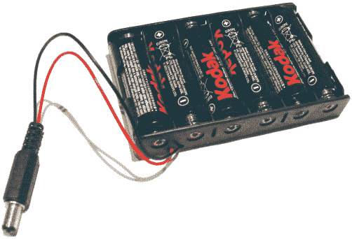

#### 面包板

面包板作为电子原型制作的构建基础。在本书的所有项目中，你都将使用面包板，而不是将零件焊接在一起。

*面包板*这个名称可以追溯到电子项目最初是在木板上制作的时代。当时的电子爱好者将钉子钉入木板，并将电线绕在钉子上，通过这种方式连接组件，而无需将其永久焊接。今天的面包板由塑料制成，预先钻有孔（称为*连接点*），你可以将组件或电线插入这些孔中，连接点下方有夹子将其固定。连接点之间通过导电材料连接，这些导电材料沿着板底部延伸，如图 0-3 所示。

**图 0-3：** 面包板连接

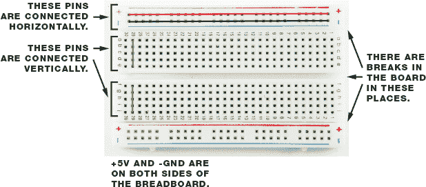

面包板有不同的大小。为了构建本书中的项目，理想情况下你需要三块面包板：一块全尺寸面包板，通常有 830 个孔；一块半尺寸面包板，约有 420 个孔；以及一块迷你面包板，有 170 个孔。全尺寸面包板适用于使用 LCD 屏幕或许多组件的项目，而半尺寸和迷你面包板更适合较小的项目。对于本书中的项目，我建议你购买像图 0-3 中显示的那种面包板，带有红蓝线和中心断裂的孔。

**提示**

*使用红色导线连接 5V 电源、黑色导线连接地线（GND）是很有用的。其余的导线可以选择任何颜色。*

主面包板区域有 30 列连接点，它们是垂直连接的，如图 0-3 所示。你常常需要将组件放置在跨越面包板中心断裂的地方，以完成电路。这个断裂有助于防止组件短路，这可能会干扰你的项目，甚至损坏你的组件。随着你开始搭建电路，你会学到更多关于这一点的知识。

顶部和底部的蓝色和红色线条是电源轨，用于为插入主面包板区域的组件供电（参见图 0-4）。电源轨将轨道中的所有孔连接在一起；红线是正电源，蓝线是负电源（或*地线*，如你常常看到的那样）。

**图 0-4:** 正负面包板电源轨

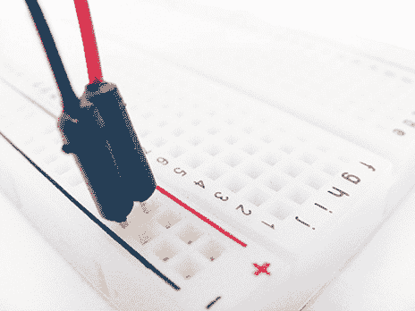

#### 跳线

你将使用*跳线*在面包板上进行连接。跳线是带有塑料固定件的实心导线，每个端头都有一个塑料外壳，使得插入和拆卸导线变得更容易。（如果你有自己的导线，也可以使用，但要确保使用实心导线——多股导线不足以牢固地插入孔夹中。）

当你将跳线插入面包板的孔时，它会通过下面的小弹簧夹固定住，从而在该行中建立电气连接。然后你可以将一个组件放置在相邻的孔中，帮助完成电路，正如图 0-5 所示。

**图 0-5:** 一个示例面包板电路

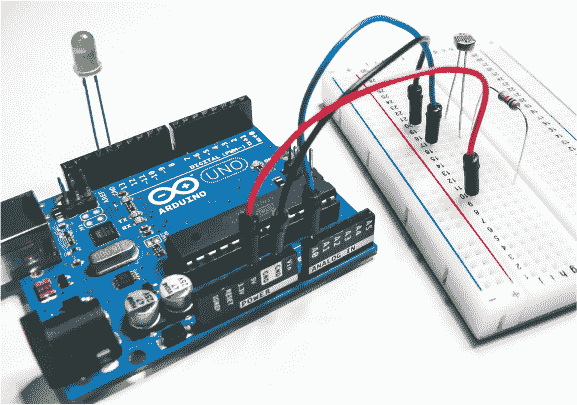

**注意**

*由于 IDE 版本更新较快，* *我不会详细介绍安装过程，但安装应该很简单，而且 Arduino 网站上的安装说明非常清晰。所有版本的 IDE 和针对您操作系统的安装详细信息都可以在* [`www.arduino.cc/`](http://www.arduino.cc/) *找到。*

### 编程 Arduino

为了让我们的项目按照预期运行，我们需要编写程序来给 Arduino 发出指令。我们通过 Arduino *集成开发环境（IDE）* 来做到这一点。Arduino IDE 可以从 *[`www.arduino.cc/`](http://www.arduino.cc/)* 免费下载，并且支持在 Microsoft Windows、OS X 和 Linux 上运行。它使你能够编写计算机程序（一系列逐步指令，在 Arduino 的世界里称为 *sketches*），然后通过 USB 电缆将其上传到 Arduino。你的 Arduino 将根据与外部世界的交互执行这些指令。

#### IDE 界面

当你打开 Arduino IDE 时，它应该看起来像 图 0-6。IDE 界面分为顶部的工具栏，包含最常用的功能按钮；中央的 sketch 窗口，你将在其中编写或查看程序；以及底部的串口输出窗口。串口输出窗口显示了你的 PC 和 Arduino 之间的通信信息，如果 sketch 编译出错，它也会列出相关错误。

**图 0-6：** Arduino IDE

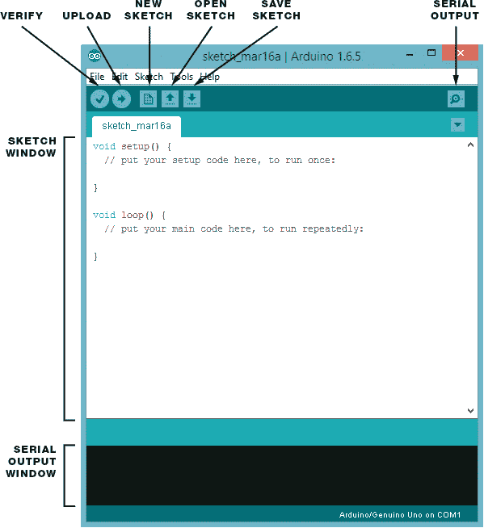

#### Arduino Sketches

我将在每个项目的相关部分为你提供相应的 sketch，并在那里详细讲解。所有的 sketch 都可以从 *[`www.nostarch.com/arduinohandbook2/`](http://www.nostarch.com/arduinohandbook2/)* 下载。

和任何程序一样，sketches 是一组非常严格的指令，对错误非常敏感。最好下载 sketch 文件并在 IDE 中打开，而不是直接从书中复制它。为了确保程序正确运行，点击屏幕顶部的绿色勾号按钮。这是验证按钮，它会检查是否有错误，并通过串口输出窗口告诉你 sketch 是否已正确编译。

#### 库

在 Arduino 的世界里，*库* 是执行特定功能的代码片段。你可以通过简单地添加一个命令，从库中调用代码，而不必每次在 sketch 中反复输入相同的代码。这个快捷方式节省了时间，使你更容易连接传感器、显示器或模块等设备。

Arduino IDE 包含了多个内置库——例如 LiquidCrystal 库，它使得与 LCD 显示屏的通信变得简单——并且还有许多更多库可以在网上找到。为了完成书中的项目，你需要导入以下库：PololuLedStrip、FastLED、HMC5883L、Keypad、Tone、Adafruit_GFX、Adafruit_SDD1306、NewPing、Adafruit 指纹传感器以及 Adafruit 电机扩展板。你可以在 *[`www.nostarch.com/arduinohandbook2/`](http://www.nostarch.com/arduinohandbook2/)* 的资源中找到所有需要的库。

#### 安装库

下载完库之后，你需要安装它们。对于 Arduino 版本 1.0.5 及更高版本，按照以下步骤安装库：

1.  选择 **Sketch** ▸ **Include Library** ▸ **Add .ZIP Library**。

1.  浏览到你下载的 ZIP 文件并选择它。在旧版本的 Arduino 中，解压库文件并将整个文件夹及其内容放入 *sketchbook/libraries* 文件夹（Linux），*My Documents\Arduino\Libraries*（Windows），或 *Documents/Arduino/libraries*（OS X）。

要手动安装库，首先进入包含库的 ZIP 文件并解压它。例如，要安装一个名为 *keypad* 的库，压缩文件名为 *keypad.zip*，你需要解压 *keypad.zip*，它将扩展为一个名为 *keypad* 的文件夹，里面包含类似 *keypad.cpp* 和 *keypad.h* 的文件。解压后，将 *keypad* 文件夹拖到操作系统中的 *libraries* 文件夹：Linux 中为 *sketchbook/libraries*，Windows 中为 *My Documents\Arduino\Libraries*，OS X 中为 *Documents/Arduino/libraries*。然后重启 Arduino 应用程序。

库在草图的开始部分列出，并且很容易识别，因为它们以 `#include` 命令开头。库名被 `< >` 括起来，并以 `.h` 结尾，像这样调用 Servo 库的代码：

#include <Servo.h>

现在就安装你在项目中需要的库，以便稍后节省一些时间。

### 测试你的 Arduino：让 LED 闪烁

让我们从经典的第一个 Arduino 项目开始：让 LED 闪烁（LED 是 *发光二极管* 的缩写，类似于一个小灯泡）。这不仅是确保你的 Arduino 正常工作的最简单方式，还能让你了解一个简单的草图。Arduino 一次只能运行一个程序，因此，一旦你将草图上传到 Arduino，该草图将在每次打开 Arduino 时运行，直到你更改它为止。

#### 构建

在这个项目中，我们将使用 IDE 中提供的 *Blink* 示例草图。Blink 程序让 LED 点亮 1 秒钟，然后熄灭，反复进行。LED 只能在电流流动的一个方向上工作，因此它的长引脚必须连接到正电源。LED 需要一个 *限流电阻*，否则灯泡可能会烧坏。Arduino 的 13 号引脚内置了一个电阻，我们将使用它。

按照以下步骤设置你的测试：

1.  将 LED 的长引脚（正极）插入 Arduino 的 13 号引脚，如 图 0-7 所示。将短引脚（负极）连接到 13 号引脚旁边的 GND 引脚。

    **图 0-7：** *Blink* 项目设置

    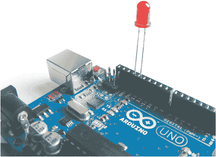

1.  使用 USB 电缆将 Arduino 连接到你的计算机。

1.  打开电脑上的 Arduino IDE，然后从下拉菜单中选择 **文件** ▸ **示例** ▸ **Blinking LED**。草图将在 IDE 的主程序区域显示。

    ➊// Blinking LED 项目 - 这个示例代码属于公共领域

    ➋ int led = 13;

    ➌ void setup() {

    ➍   pinMode(led, OUTPUT);

    }

    ➎ void loop() {

    ➏   digitalWrite(led, HIGH);

    ➐   delay(1000);

    ➑   digitalWrite(led, LOW);

    ➒   delay(1000);

    ➓ }

1.  在 IDE 中，点击 **验证** 按钮检查草图是否工作正常。

1.  点击 **上传** 按钮，将草图发送到你的 Arduino。运行此代码应该会让你的 LED 闪烁。

#### 理解草图

以下是草图中每行代码的作用：

➊ 这是一条注释。程序中以 `//` 开头的任何行都仅供用户阅读，Arduino 会忽略它，因此你可以使用这种方式输入备注并描述你的代码（这叫做 *注释* 代码）。如果注释超过一行，开始的第一行用 `/*`，结束时用 `*/`，中间的内容 Arduino 会忽略。

➋ 这给引脚 13 命名为 `led`。草图中每次提到 `led` 时都将指代引脚 13。

➌ 大括号 `{}` 中的代码在程序启动时运行一次。左大括号 `{` 开始了设置代码。

➍ 这告诉 Arduino 引脚 13 是一个输出引脚，表示我们要从 Arduino 向 LED 发送电力。闭括号 `}` 结束了设置代码。

➎ 这创建了一个循环。`loop()` 语句后的所有内容（即括号 `{}` 中的内容）将在 Arduino 上电后运行一次，并持续重复直到断电。

➏ 这告诉 Arduino 将 `led`（引脚 13）设置为 `HIGH`，从而向该引脚提供电源。可以将其理解为开启该引脚。在此草图中，这会让 LED 点亮。

➐ 这告诉 Arduino 等待 1 秒钟。Arduino 上的时间以毫秒为单位，所以 1 秒 = 1,000 毫秒。

➑ 这告诉 Arduino 将 `led`（引脚 13）设置为 `LOW`，这会切断电源并关闭该引脚，从而关闭 LED。

➒ 再次告诉 Arduino 等待 1 秒钟。

➓ 这个闭括号结束了循环。所有在初始 `setup` 代码后的代码都必须包含在大括号内。缺少括号很容易被忽视，是导致草图无法正确编译的常见原因。此闭括号之后，代码会返回到循环开始处的 ➎。

现在你已经测试了你的 Arduino，并理解了草图的工作原理以及如何上传它，我们将看看你完成本书中所有项目所需的组件。有关每个组件的更多细节、外观以及功能，请参考 第 238 页 的 “组件” 部分。

### 项目组件清单

这是完成本书中所有项目所需物品的完整列表。最重要的部分当然是 Arduino 主板，所有项目都使用 Arduino Uno R3 版本。只有官方的板子被称为 Arduino，但你会发现来自像 SlicMicro、Sainsmart 和 Adafruit 等公司的兼容克隆板。（你可以在 *[`arduino.cc/en/Main/Buy/`](http://arduino.cc/en/Main/Buy/)* 上找到官方供应商的列表。）

你可以单独购买每个项目，但我建议购买一个电子爱好者入门套件或 Arduino 套件，其中会提供你这里列出的一些物品。有关推荐供应商的清单，请参见第 249 页中的“零售商名单”部分。或者，每个项目都会开始列出所需的零件清单，所以你可以翻到一个感兴趣的项目，获取你所需的组件。

1 个 Arduino Uno R3（或兼容型号）

1 个 9V 电池包，带 2.1 mm 插孔，可容纳 6 节 AA 电池

1 个 9V 电池卡扣和电池

3 块面包板：1 块全尺寸，1 块半尺寸，1 块迷你尺寸

50 根公对公跳线

10 根母对公跳线

固体芯线

9 个 220-欧姆电阻

4 个 10k-欧姆电阻

8 个 1k-欧姆电阻

40 个 5 毫米 LED，颜色包括红色、绿色、黄色、蓝色（每种 10 个）

1 个 RGB 公共阴极 LED

1 个 RGB LED 灯带（WS2812B 5V 32-LED 灯带）

1 个 Adafruit NeoPixel 环形灯带，含 16 个 RGB LED

1 个 HMC5883L 三轴传感器

2 个 50k-欧姆电位器

1 个 10k-欧姆电位器

8 个瞬时触摸按钮

1 个七段单数字公共阴极 LED

1 个压电蜂鸣器

1 个 3.5 毫米母耳机插孔

1 个 Tower Pro SG90 9g 伺服电机

1 个光敏电阻（*光依赖电阻*，或 *LDR*）

1 个 28BYJ-48 步进电机，带 ULN2003 驱动模块

1 个 HC-SR04 超声波传感器

1 个 3×4 薄膜键盘

1 个 LM35 温度传感器

1 个 12V 小型计算机冷却风扇

1 个 5V 单通道继电器模块

1 个 HD44780 16×2 LCD 屏幕

1 个诺基亚 5110 LCD 屏幕

1 个串行 LCD 屏模块

1 个 OLED 单色屏（128×64）

1 个 8×8 LED Maxim 7219 矩阵模块

1 个 Keyes MQ3 酒精传感器模块

1 个光学指纹传感器（ZFM-20 系列）

1 个 L293d 电机驱动板

1 个机器人底盘套件，包括两个直流电机和车轮、中央轮、底座和配件

1 个以太网扩展板 W5100 LAN

1 根以太网电缆

1 个 WLToys V959-18 水射流手枪

1 个 HC-06 蓝牙模块

1 个 Ublox NEO-6M GPS 模块，飞机飞行控制器和天线

### 快速焊接指南

本书的大多数项目不需要焊接，但有一些组件可能会带有未焊接的引脚（图 0-8），以便运输时更为方便。引脚带有条状，可以根据需要轻松折断为适合的长度。

**图 0-8：** 引脚

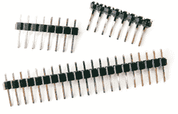

例如，项目 25 中使用的 GPS 模块没有附带引脚，因此我将解释如何将这些引脚焊接到位。一个通用的 30 瓦特焊接铁，配有细尖头，应该能够满足你的需求。值得购买一个包含焊接铁、支架和焊料的套件（图 0-9）。

**图 0-9：** 焊接铁

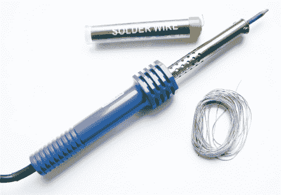

1.  插入你的焊接铁，并至少等待 5 分钟让它达到工作温度。

1.  要进行焊接，取下所需数量的引脚条，并按图 0-10 所示插入到模块中。

    **图 0-10：** 插入引脚到模块中

    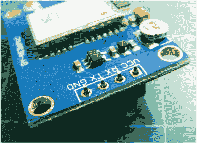

1.  现在开始固定引脚，从最左边的引脚开始。将加热的烙铁尖端同时接触到引脚和模块接触点。只需保持大约 2 秒钟。保持烙铁不动的同时，向接点处添加焊锡；焊锡应该融化并流动，形成一个*焊点*。注意，不要将焊锡直接加到烙铁上，而是加到你正在焊接的接点上。迅速移开烙铁和焊锡——接触超过几秒钟可能会损坏你的元件。

1.  一个好的焊点应该看起来像一个光亮的锥形体（图 0-11）。只要稍加练习，你就能迅速焊接得很干净。

    **图 0-11：** 焊点应该像这样。

    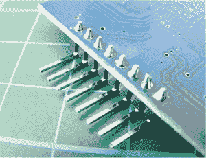

#### 安全第一

焊接烙铁非常非常热，必须在成人监督下小心使用。以下是一些安全小贴士：

• 确保使用烙铁架，切勿将热的烙铁直接放在桌面上。

• 在通风良好的房间内焊接。融化的焊锡释放出的烟雾可能有害。

• 将易燃物质远离工作区域。

• 将设备放在儿童接触不到的地方。

• 戴好眼部防护。

• 等待烙铁完全冷却后再存放。
