**LED**

## 第二章：LED 灯条**

在这个项目中，我们将使一排 LED 按顺序来回闪烁，类似于 1980 年代 TV 剧集 *Knight Rider* 中的 KITT。

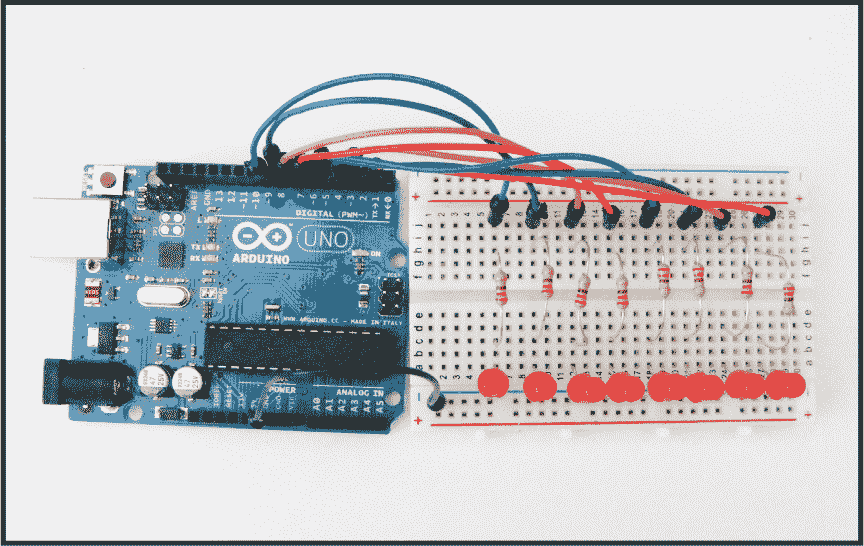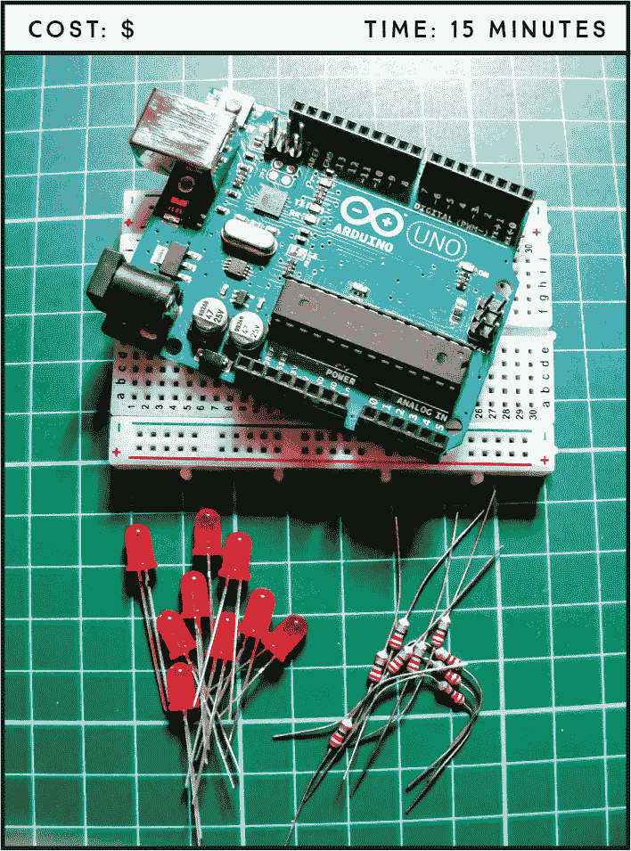

**所需组件**

**Arduino 板**

**面包板**

**跳线**

**8 个 LED**

**8 个 220 欧姆电阻**

### 工作原理

当小电流通过 LED 时，它会发光。LED 是*极性化*的，这意味着一端是正极，另一端是负极。这是因为 LED 只能在电流单向流动时工作，从正极到负极。LED 的长脚是正极，必须连接到正电源。Arduino 的草图控制闪烁的顺序。

LED 是非常精细的元件，只需少量电压就能点亮——比 Arduino 提供的电压还要小。为了防止 LED 因过多电压而烧坏，我们使用*电阻*，它限制了通过 LED 的电压。

你可以更改 LED 的颜色，并使用这个灯条来装饰汽车、电动滑板车、自行车、相框、低音炮或几乎任何其他物品。在 Uno 上，你最多可以连接 10 个 LED，而不会用尽引脚。

### 搭建过程

1.  将 LED 插入面包板时，较短的负极脚应插入面包板顶部的 GND 导轨。然后将此导轨连接到 Arduino 的 GND，如图 1-1 所示。

    **图 1-1：** LED 按顺序来回闪烁。LED 的短脚连接到面包板的 GND 导轨，长脚通过电阻连接到 Arduino。

    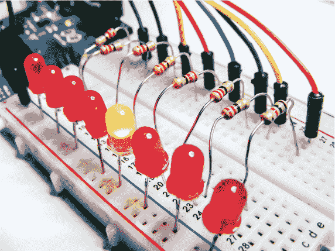

1.  按照下图的电路图，将 LED 依次连接到 Arduino 的数字引脚 2 到 9。每个 LED 与数字引脚之间需要放置一个 220 欧姆电阻，确保电阻跨越面包板的中间分隔。

    | **LED** | **Arduino** |
    | --- | --- |
    | 正极脚 | 通过电阻连接到 2–9 引脚 |
    | 负极脚 | GND |

1.  检查你的设置与图 1-2 中的对比，然后上传下面的代码“草图”。

    **图 1-2：** LED 灯条的电路图

    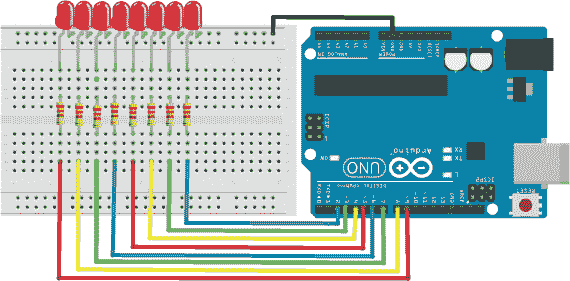

### 草图

该草图将连接到 LED 的引脚设置为输出，然后定义一个函数以同时关闭所有 LED。这个函数会在循环周期中调用，将 LED 关闭，然后依次点亮每个 LED，每次点亮之间有 200 毫秒的延迟，从而创建一个扫过效果。另一个循环则将顺序反向传输。

// 经由友好许可使用

// Warwick A Smith, startingelectronics.com

// Knight Rider 在 8 个 LED 上显示

void setup() {

for (int i = 2; i < 10; i++) { // 选择引脚 2-9

pinMode(i, OUTPUT); // 将引脚设置为输出模式

}

}

// 定义函数以同时关闭所有 LED

void allLEDsOff(void) {

for (int i = 2; i < 10; i++) {

digitalWrite(i, LOW);

}

}

// 按顺序从左到右点亮 LED

void loop() {

for (int i = 2; i < 9; i++) { // 每个 LED 执行一次循环

allLEDsOff(); // 关闭所有 LED

digitalWrite(i, HIGH); // 点亮当前 LED

delay(200); // 延迟 200 毫秒

// 然后重复循环以移动到下一个 LED

}

for (int i = 9; i > 2; i--) { // 从右到左点亮 LED

allLEDsOff();

digitalWrite(i, HIGH);

delay(200);

}

}

### 故障排除

**问：** *代码编译通过，但部分或所有 LED 未按预期点亮。*

• 如果没有任何 LED 亮起，请确保将 Arduino 的 GND 线连接到面包板的正确电源轨，并且 Arduino 已经连接了电源。

• 如果只有部分 LED 亮起，检查 LED 是否正确插入，较长的引线应连接到正电源，较短的引线应连接到 GND。由于 LED 是有极性的，必须正确连接。检查电阻是否已完全插入，并与相应的 LED 引脚对齐在同一排。

• 确保 LED 连接到 Arduino 中定义的引脚，详见“草图”第 19 页（page 19）。草图的第一部分将引脚 2-9 定义为输出，因此应该使用这些引脚。

• 如果 LED 仍然无法点亮，可能是 LED 已经烧坏或出现故障。一种简单的检查方法是将该 LED 与序列中的另一个 LED 交换，看看是否能解决问题。如果发现 LED 在另一个位置能正常工作，说明电阻可能损坏或没有完全插入。根据结果，替换 LED 或电阻为正常的组件。

## 光敏夜灯**

这个项目是一个简单的光敏电阻功能测试：我们将制作一个夜灯，根据检测到的光线强度，夜灯的亮度会变化。

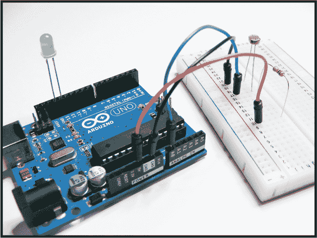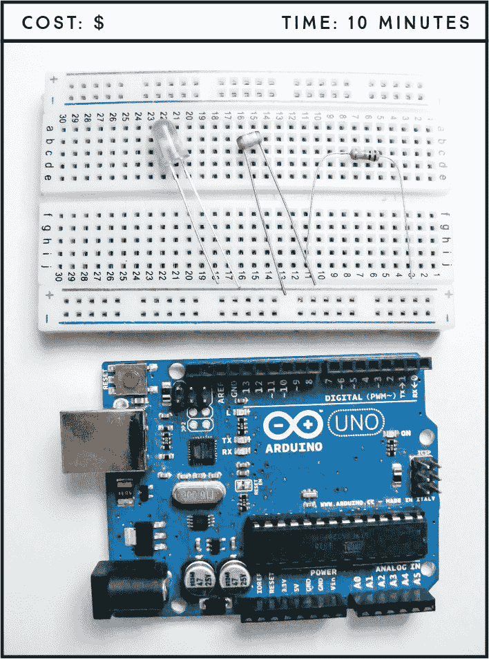

**所需部件**

**Arduino 板**

**面包板**

**跳线**

**光敏电阻**

**LED**

**10k 欧姆电阻**

### 工作原理

*光敏电阻* 是一种对光线敏感的可变电阻；光线越少，它提供的电阻值越大。这个电阻值会改变发送到 Arduino 输入引脚的电压，进而将该电压值发送到输出引脚作为 LED 的电源电平，因此在光线较弱的情况下，LED 将会变得更亮。光敏电阻有不同的类型，但通常都有一个小而透明的椭圆形头部，带有波浪形的线条（见图 2-1）。光敏电阻没有极性，因此连接引脚时方向无关紧要。

这里的原理类似于儿童夜灯的工作方式。你可以使用光敏电阻来控制的不仅仅是 LED，正如我们将在接下来的章节中看到的那样。由于我们只有两个电源和 GND 连接，这里我们不会使用面包板电源轨。

**图 2-1：** 光敏电阻

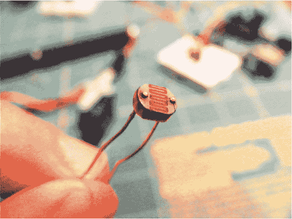

### 制作过程

1.  将光敏电阻插入面包板，一端连接到 Arduino 的 GND，另一端连接到 Arduino 的 A0。

1.  将一个 10k 欧姆电阻的一端连接到+5V，另一端连接到 A0 光敏电阻引脚，如图 2-2 中的电路图所示。

    **图 2-2：** 光敏 LED 的电路图

    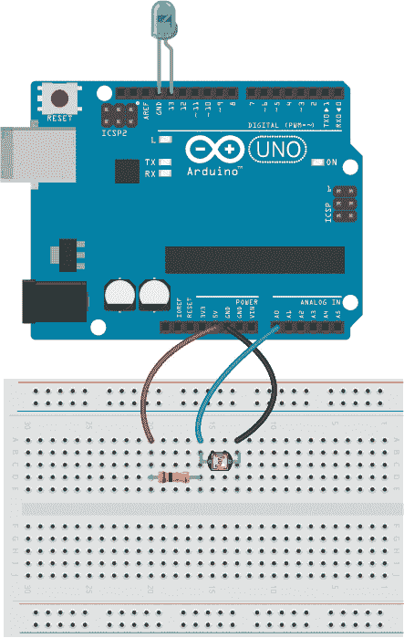

1.  将 LED 的长脚（正极）直接插入 Arduino 的 13 号引脚，短脚（负极）直接插入 Arduino 的 GND。我们通常会使用电阻来限制 LED 的电流，但在这里不需要电阻，因为 Arduino 的 13 号引脚已内置电阻。

1.  上传代码到"草图"下面。

### 草图

草图首先将光敏电阻连接到 Arduino 的 A0 引脚作为我们的`输入`，将 LED 连接到 13 引脚作为我们的`输出`。我们通过`Serial.begin(9600)`来启动串行通信，这将在 Arduino 连接到计算机时将信息发送到 Arduino 的串口监视器。这意味着光敏电阻的电阻值将显示在你计算机上的串口监视器中，如图 2-3 所示。

**图 2-3：** 串口监视器将显示光敏电阻的电阻值。

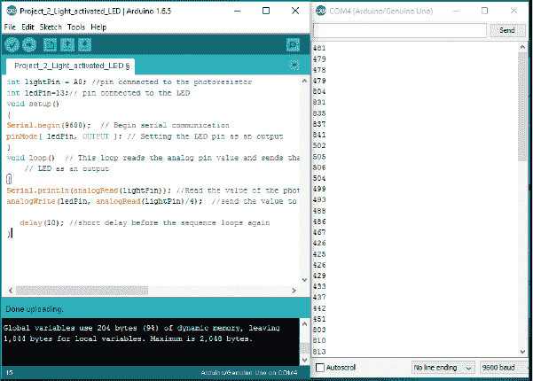

循环读取光敏电阻的模拟值，并将其作为电压值发送到 LED。A0 引脚可以读取 1,024 个值，这意味着 LED 有 1,024 个可能的亮度级别。这么多级别之间的微小变化不容易被察觉，因此我们将这个数字除以 4，缩小到仅有 256 个值，使得检测 LED 电压变化变得更加容易。

int lightPin = A0; // 连接到光敏电阻的引脚

int ledPin = 13; // 连接到 LED 的引脚

void setup() {

Serial.begin(9600); // 开始串行通信

pinMode(ledPin, OUTPUT); // 设置 LED 引脚为输出

}

// 这个循环读取模拟引脚的值并

// 将值发送到 LED 作为输出

void loop() {

// 读取光敏电阻的值

Serial.println(analogRead(lightPin));

// 将值写入串口监视器

// 将值发送到 ledPin 并除以 4

analogWrite(ledPin, analogRead(lightPin) / 4);

delay(10); // 在循环再次开始之前稍作延迟

}

### 故障排除

**问：** *代码编译成功，但在黑暗中 LED 不亮。*

• 确保 LED 的长脚（正极）插入 13 号引脚，短脚（负极）插入旁边的 GND。

• 确保光敏电阻按照图 2-2 中的电路图连接到 Arduino 的 A0。打开串口监视器查看是否有读取。如果你能看到读取值但 LED 不亮，LED 可能有故障，尝试更换一个。

## 七段数码管倒计时计时器**

在这个项目中，我们将创建一个简单的计时器，从 9 倒数到 0。这个计时器可以应用于各种有用的项目！

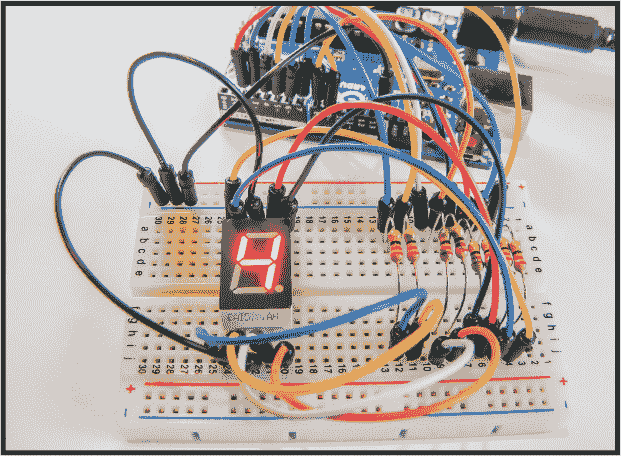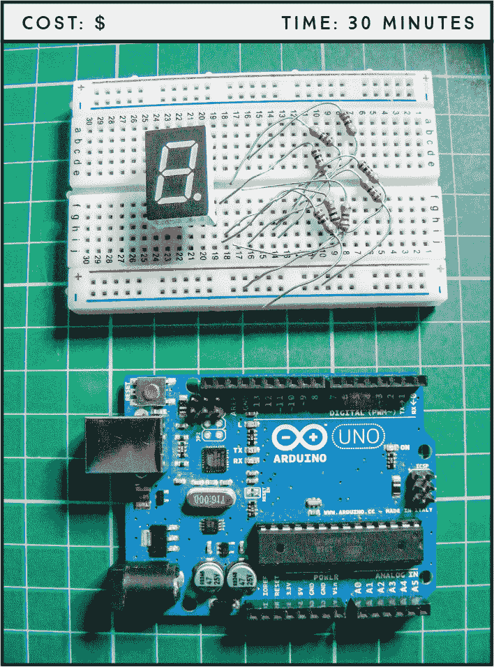

**所需零件**

**Arduino 板**

**面包板**

**跳线**

**七段单数共阴极 LED**

**8 个 220 欧姆电阻**

### 工作原理

七段 LED 显示器使用 LED 段显示一个数字或字符。每个段都是一个独立的 LED，通过控制哪些段在任何时刻点亮，我们可以显示数字值。在这个项目中我们使用的是单数字显示，如图 3-1 所示，但也有双位、三位、四位和八位的变化版本可供选择。

**图 3-1：** 七段 LED

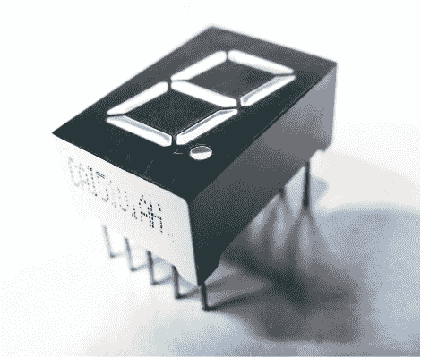

**注意**

*设备的* 阴极 *是负极连接，通常用负号（–）表示，有时也称为* 地（GND）*。它连接到负电源。设备的* 阳极 *是正极连接，通常用加号（+）表示，并连接到正电源。*

本项目将创建一个简单的计时器，从 9 倒计时到 0。七段 LED 有 10 个引脚。七个引脚控制七个 LED，这些 LED 亮起来形成每个数字，第八个引脚控制小数点。其他两个引脚是共阴极（–）或共阳极（+）引脚，为项目提供电力。我们的七段 LED 是共阴极的，这意味着每个 LED 的一侧需要连接到地。需要注意的是，代码只适用于共阴极 LED。如果你想使用共阳极 LED，在上传草图之前，请查阅本章末尾的故障排除部分。每个 LED 段都需要电阻来限制电流，否则它会烧毁。

引脚上标有字母，如图 3-2 所示。编号引脚控制右侧显示的段。Arduino 通过不同的组合打开或关闭 LED 来创建数字。

**图 3-2：** 七段 LED 的典型引脚布局

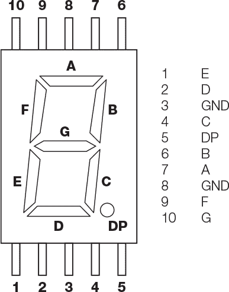

### 构建步骤

1.  按照图 3-3 所示，将七段显示器放置在面包板上，确保引脚跨越中心断开部分。将 LED 的引脚 3 和 8 连接到 GND 轨。

    **图 3-3：** 七段 LED 引脚应跨越面包板的中心断开部分。

    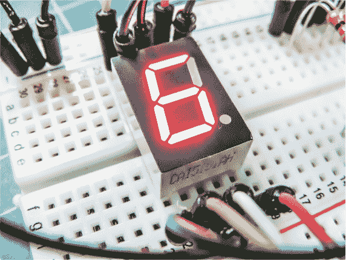

1.  按照下表连接 LED 引脚 1、2、4、5、6、7 和 9，并记得在 LED 与 Arduino 连接之间插入 220 欧姆电阻。电阻需要跨过面包板的中心断开部分，如图 3-4 中的电路图所示。

    | **ARDUINO** | **七段 LED 部分** | **七段 LED 显示器** |
    | --- | --- | --- |
    | Pin 2 | A | Pin 7 |
    | Pin 3 | B | Pin 6 |
    | Pin 4 | C | Pin 4 |
    | Pin 5 | D | Pin 2 |
    | Pin 6 | E | Pin 1 |
    | Pin 7 | F | Pin 9 |
    | Pin 8 | G | Pin 10 |
    | Pin 9 | DP | Pin 5 |

    **图 3-4：** 七段 LED 倒计时计时器电路图

    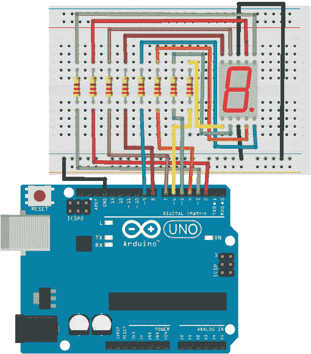

1.  上传代码到 “The Sketch” 中的 第 32 页。

### 草图

草图首先定义了数字 0 到 9 作为关闭（`0`）和打开（`1`）LED 的组合。控制 LED 的引脚被设置为输出，因此它们可以将相应的 LED 设置为`HIGH`或`LOW`。通过 `1` 和 `0` 的组合点亮 LED，形成数字。

请注意，这些模式适用于共阴极显示器。对于共阳极显示器，将每个 `1` 改为 `0`，每个 `0` 改为 `1`。在代码中，`1` 表示 LED 亮，`0` 表示 LED 灭。

// Arduino 七段显示示例代码

// [`hacktronics.com/Tutorials/arduino-and-7-segment-led.html`](http://hacktronics.com/Tutorials/arduino-and-7-segment-led.html)

// 许可证：[`www.opensource.org/licenses/mit-license.php`](http://www.opensource.org/licenses/mit-license.php)

// 定义要点亮的 LED 以创建一个数字

byte seven_seg_digits[10][7] = { { 1, 1, 1, 1, 1, 1, 0 }, // = 0

{ 0, 1, 1, 0, 0, 0, 0 }, // = 1

{ 1, 1, 0, 1, 1, 0, 1 }, // = 2

{ 1, 1, 1, 1, 0, 0, 1 }, // = 3

{ 0, 1, 1, 0, 0, 1, 1 }, // = 4

{ 1, 0, 1, 1, 0, 1, 1 }, // = 5

{ 1, 0, 1, 1, 1, 1, 1 }, // = 6

{ 1, 1, 1, 0, 0, 0, 0 }, // = 7

{ 1, 1, 1, 1, 1, 1, 1 }, // = 8

{ 1, 1, 1, 0, 0, 1, 1 }  // = 9

};

// 设置七段 LED 引脚为输出

void setup() {

pinMode(2, OUTPUT);

pinMode(3, OUTPUT);

pinMode(4, OUTPUT);

pinMode(5, OUTPUT);

pinMode(6, OUTPUT);

pinMode(7, OUTPUT);

pinMode(8, OUTPUT);

pinMode(9, OUTPUT);

writeDot(0); // 从小数点关闭开始

}

void writeDot(byte dot) {

digitalWrite(9, dot);

}

void sevenSegWrite(byte digit) {

byte pin = 2;

for (byte segCount = 0; segCount < 7; ++segCount) {

digitalWrite(pin, seven_seg_digits[digit][segCount]);

++pin;

}

}

void loop() {

for (byte count = 10; count > 0; --count) { // 开始倒计时

delay(1000); // 每个数字之间间隔 1 秒

sevenSegWrite(count - 1); // 倒数 1

}

delay(4000);

}

### 故障排除

**问：** *一些 LED 段没有点亮。*

检查 LED 的接线是否插好，并确保它们与面包板上的电阻对齐。

**问：** *显示屏没有正确显示数字，看起来不稳定。*

• 请重新检查你的接线是否与图示一致，因为容易将一些线接错位置。

• 如果所有线路正确连接，但定时器仍然无法工作，可能是你的七段 LED 显示器配置与这里使用的不同。请查看你的零件数据表，并根据数据表指导电路的连接，同时参考七段引脚表。你还可以通过连接电池来检查每个引脚对应的 LED：将七段 LED 的 GND 引脚连接到电池的负极；将一根跳线连接到电池的正极，通过 220 欧姆电阻连接；依次触碰每个引脚，点亮每个段。注意每个引脚点亮的是哪个段。

• 请记住，这里的接线适用于七段共阴极 LED；对于共阳极显示，请在草图中将每个`1`改为`0`，将每个`0`改为`1`。

## LED 滚动广告牌

在这个项目中，我们将使用内建的驱动模块，在一个 8×8 矩阵上创建一个滚动信息。

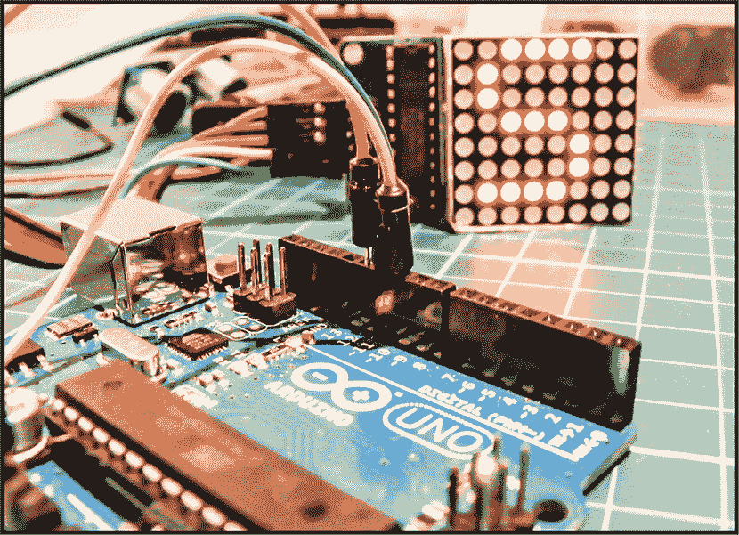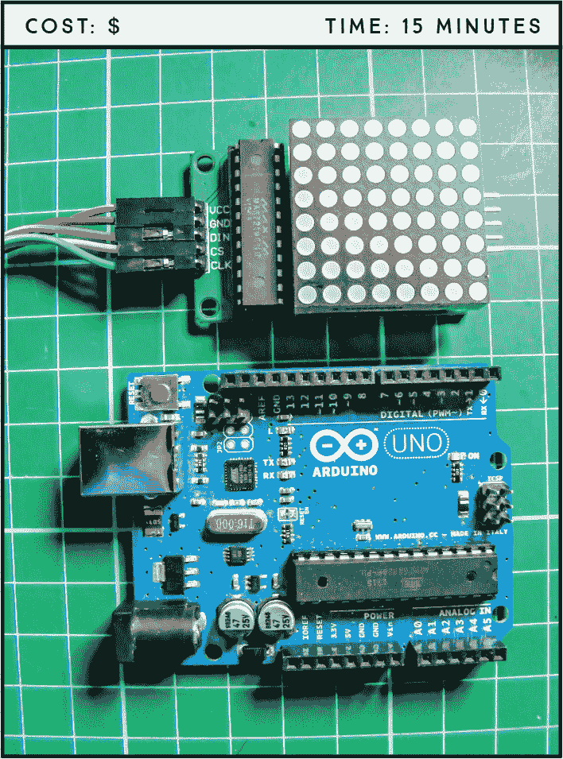

**所需零件**

**Arduino 开发板**

**母对公跳线**

**8×8 LED Maxim 7219 矩阵模块**

**所需库**

**MaxMatrix**

### 工作原理

LED 矩阵是一个 LED 阵列，你可以单独控制每个 LED，创建图案、文字、图片或你可以编程的任何内容。我们将在这个项目中使用的 8×8 LED 矩阵已经预装了一个*驱动模块*——一个由 Maxim 7219 芯片驱动的电路板，可以让你通过连接到 Arduino 的五个引脚来控制整个矩阵。这些模块价格便宜，且可以串联在一起，这样你就可以用一个草图驱动多个矩阵。

该矩阵模块有三个引脚：DIN、CS 和 CLK，如图 4-1 所示。*DIN*代表数据输入，*CS*代表芯片选择，*CLK*代表时钟。剩余的两个引脚连接到 Arduino，用于为矩阵供电。CLK 引脚感应脉冲，控制 Arduino 与矩阵之间同步通信的速度。该矩阵使用*串行外设接口(SPI)*通信协议与 Arduino 进行交流，而 CS 引脚检测当前使用的 SPI 设备。DIN 读取来自 Arduino 的数据——在本项目中是草图。

**图 4-1：** Maxim 7219 芯片控制 LED 矩阵。

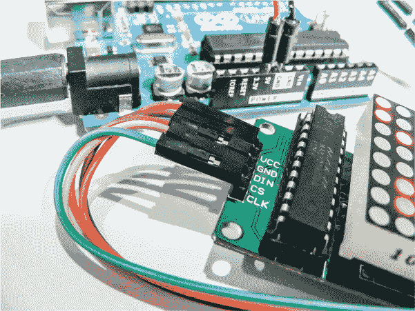

每个模块都有额外的连接，可以让你添加另一个模块。通过将多个模块串联起来，并在代码中更改矩阵的数量，你可以在更大的区域内滚动信息。

### 搭建过程

1.  使用母对公跳线将模块直接连接到 Arduino，将母头连接到模块。如下面的表格所示，将 LED 矩阵模块的 VCC 连接到 Arduino 的+5V，GND 连接到 GND，DIN 连接到 Arduino 的引脚 8，CS 连接到引脚 9，CLK 连接到引脚 10。

    | **LED 矩阵模块** | **Arduino** |
    | --- | --- |
    | VCC | +5V |
    | GND | GND |
    | DIN | 引脚 8 |
    | CS | 引脚 9 |
    | CLK | 引脚 10 |

1.  确认您的设置与图 4-2 中的电路图匹配，并上传“草图”中的代码，位于第 38 页。

    **图 4-2：** 滚动 LED 广告牌电路图

    

### 草图

这个草图通过调用 MaxMatrix 库来控制矩阵模块。然后我们定义要显示的字符，并设置控制矩阵的 Arduino 引脚。您的消息将在 LED 上以连续循环的方式显示。

#include <MaxMatrix.h> // 调用 MaxMatrix 库

PROGMEM const unsigned char CH[] = {

3, 8, B00000000, B00000000, B00000000, B00000000, B00000000, // 空格

1, 8, B01011111, B00000000, B00000000, B00000000, B00000000, // !

3, 8, B00000011, B00000000, B00000011, B00000000, B00000000, // "

5, 8, B00010100, B00111110, B00010100, B00111110, B00010100, // #

4, 8, B00100100, B01101010, B00101011, B00010010, B00000000, // $

5, 8, B01100011, B00010011, B00001000, B01100100, B01100011, // %

5, 8, B00110110, B01001001, B01010110, B00100000, B01010000, // &

1, 8, B00000011, B00000000, B00000000, B00000000, B00000000, // '

3, 8, B00011100, B00100010, B01000001, B00000000, B00000000, // (

3, 8, B01000001, B00100010, B00011100, B00000000, B00000000, // )

5, 8, B00101000, B00011000, B00001110, B00011000, B00101000, // *

5, 8, B00001000, B00001000, B00111110, B00001000, B00001000, // +

2, 8, B10110000, B01110000, B00000000, B00000000, B00000000, // ,

4, 8, B00001000, B00001000, B00001000, B00001000, B00000000, // -

2, 8, B01100000, B01100000, B00000000, B00000000, B00000000, // .

4, 8, B01100000, B00011000, B00000110, B00000001, B00000000, // /

4, 8, B00111110, B01000001, B01000001, B00111110, B00000000, // 0

3, 8, B01000010, B01111111, B01000000, B00000000, B00000000, // 1

4, 8, B01100010, B01010001, B01001001, B01000110, B00000000, // 2

4, 8, B00100010, B01000001, B01001001, B00110110, B00000000, // 3

4, 8, B00011000, B00010100, B00010010, B01111111, B00000000, // 4

4, 8, B00100111, B01000101, B01000101, B00111001, B00000000, // 5

4, 8, B00111110, B01001001, B01001001, B00110000, B00000000, // 6

4, 8, B01100001, B00010001, B00001001, B00000111, B00000000, // 7

4, 8, B00110110, B01001001, B01001001, B00110110, B00000000, // 8

4, 8, B00000110, B01001001, B01001001, B00111110, B00000000, // 9

2, 8, B01010000, B00000000, B00000000, B00000000, B00000000, // :

2, 8, B10000000, B01010000, B00000000, B00000000, B00000000, // ;

3, 8, B00010000, B00101000, B01000100, B00000000, B00000000, // <

3, 8, B00010100, B00010100, B00010100, B00000000, B00000000, // =

3, 8, B01000100, B00101000, B00010000, B00000000, B00000000, // >

4, 8, B00000010, B01011001, B00001001, B00000110, B00000000, // ?

5, 8, B00111110, B01001001, B01010101, B01011101, B00001110, // @

4, 8, B01111110, B00010001, B00010001, B01111110, B00000000, // A

4, 8, B01111111, B01001001, B01001001, B00110110, B00000000, // B

4, 8, B00111110, B01000001, B01000001, B00100010, B00000000, // C

4, 8, B01111111, B01000001, B01000001, B00111110, B00000000, // D

4, 8, B01111111, B01001001, B01001001, B01000001, B00000000, // E

4, 8, B01111111, B00001001, B00001001, B00000001, B00000000, // F

4, 8, B00111110, B01000001, B01001001, B01111010, B00000000, // G

4, 8, B01111111, B00001000, B00001000, B01111111, B00000000, // H

3, 8, B01000001, B01111111, B01000001, B00000000, B00000000, // I

4, 8, B00110000, B01000000, B01000001, B00111111, B00000000, // J

4, 8, B01111111, B00001000, B00010100, B01100011, B00000000, // K

4, 8, B01111111, B01000000, B01000000, B01000000, B00000000, // L

5, 8, B01111111, B00000010, B00001100, B00000010, B01111111, // M

5, 8, B01111111, B00000100, B00001000, B00010000, B01111111, // N

4, 8, B00111110, B01000001, B01000001, B00111110, B00000000, // O

4, 8, B01111111, B00001001, B00001001, B00000110, B00000000, // P

4, 8, B00111110, B01000001, B01000001, B10111110, B00000000, // Q

4, 8, B01111111, B00001001, B00001001, B01110110, B00000000, // R

4, 8, B01000110, B01001001, B01001001, B00110010, B00000000, // S

5, 8, B00000001, B00000001, B01111111, B00000001, B00000001, // T

4, 8, B00111111, B01000000, B01000000, B00111111, B00000000, // U

5, 8, B00001111, B00110000, B01000000, B00110000, B00001111, // V

5, 8, B00111111, B01000000, B00111000, B01000000, B00111111, // W

5, 8, B01100011, B00010100, B00001000, B00010100, B01100011, // X

5, 8, B00000111, B00001000, B01110000, B00001000, B00000111, // Y

4, 8, B01100001, B01010001, B01001001, B01000111, B00000000, // Z

2, 8, B01111111, B01000001, B00000000, B00000000, B00000000, // [

4, 8, B00000001, B00000110, B00011000, B01100000, B00000000, // \

2, 8, B01000001, B01111111, B00000000, B00000000, B00000000, // ]

3, 8, B00000010, B00000001, B00000010, B00000000, B00000000, // hat

4, 8, B01000000, B01000000, B01000000, B01000000, B00000000, // _

2, 8, B00000001, B00000010, B00000000, B00000000, B00000000, // `

4, 8, B00100000, B01010100, B01010100, B01111000, B00000000, // a

4, 8, B01111111, B01000100, B01000100, B00111000, B00000000, // b

4, 8, B00111000, B01000100, B01000100, B00101000, B00000000, // c

4, 8, B00111000, B01000100, B01000100, B01111111, B00000000, // d

4, 8, B00111000, B01010100, B01010100, B00011000, B00000000, // e

3, 8, B00000100, B01111110, B00000101, B00000000, B00000000, // f

4, 8, B10011000, B10100100, B10100100, B01111000, B00000000, // g

4, 8, B01111111, B00000100, B00000100, B01111000, B00000000, // h

3, 8, B01000100, B01111101, B01000000, B00000000, B00000000, // i

4, 8, B01000000, B10000000, B10000100, B01111101, B00000000, // j

4, 8, B01111111, B00010000, B00101000, B01000100, B00000000, // k

3, 8, B01000001, B01111111, B01000000, B00000000, B00000000, // l

5, 8, B01111100, B00000100, B01111100, B00000100, B01111000, // m

4, 8, B01111100, B00000100, B00000100, B01111000, B00000000, // n

4, 8, B00111000, B01000100, B01000100, B00111000, B00000000, // o

4, 8, B11111100, B00100100, B00100100, B00011000, B00000000, // p

4, 8, B00011000, B00100100, B00100100, B11111100, B00000000, // q

4, 8, B01111100, B00001000, B00000100, B00000100, B00000000, // r

4, 8, B01001000, B01010100, B01010100, B00100100, B00000000, // s

3, 8, B00000100, B00111111, B01000100, B00000000, B00000000, // t

4, 8, B00111100, B01000000, B01000000, B01111100, B00000000, // u

5, 8, B00011100, B00100000, B01000000, B00100000, B00011100, // v

5, 8, B00111100, B01000000, B00111100, B01000000, B00111100, // w

5, 8, B01000100, B00101000, B00010000, B00101000, B01000100, // x

4, 8, B10011100, B10100000, B10100000, B01111100, B00000000, // y

3, 8, B01100100, B01010100, B01001100, B00000000, B00000000, // z

3, 8, B00001000, B00110110, B01000001, B00000000, B00000000, // {

1, 8, B01111111, B00000000, B00000000, B00000000, B00000000, // |

3, 8, B01000001, B00110110, B00001000, B00000000, B00000000, // }

4, 8, B00001000, B00000100, B00001000, B00000100, B00000000, // ~

};

int data = 8;   // 连接到 MAXIM7219 模块的 DIN 引脚

int load = 9;   // 连接到 MAXIM7219 模块的 CS 引脚

int clock = 10; // 连接到 MAXIM7219 模块的 CLK 引脚

➊ int maxInUse = 1; // 设置你使用的矩阵数量

MaxMatrix m(data, load, clock, maxInUse); // 定义模块

byte buffer[10];

// 设置滚动显示的消息

➋ char string1[] = " Arduino Project Handbook . . . ";

void setup() {

m.init(); // 启动模块

m.setIntensity(0);

Serial.begin(9600); // 启动串行通信

}

void loop() {

byte c;

while (Serial.available() > 0) {

byte c = Serial.read();

Serial.println(c, DEC);

printCharWithShift(c, 100);

}

delay(100);

m.shiftLeft(false, true);

printStringWithShift(string1, 100);

}

// 该草图的其余部分用于移动滚动字符

// 根据连接的矩阵数量

void printCharWithShift(char c, int shift_speed) {

if (c < 32) return;

c -= 32;

memcpy_P(buffer, CH + 7 * c, 7);

m.writeSprite(maxInUse * 8, 0, buffer);

m.setColumn(maxInUse * 8 + buffer[0], 0);

for (int i = 0; i < buffer[0] + 1; i++) {

delay(shift_speed);

m.shiftLeft(false, false);

}

}

void printStringWithShift(char* s, int shift_speed) {

while (*s != 0) {

printCharWithShift(*s, shift_speed);

s++;

}

}

void printString(char* s) {

int col = 0;

while (*s != 0) {

if (*s < 32) continue;

char c = *s - 32;

memcpy_P(buffer, CH + 7 * c, 7);

m.writeSprite(col, 0, buffer);

m.setColumn(col + buffer[0], 0);

col += buffer[0] + 1;

s++;

}

}

你可以通过修改➋处引号内的文本来更改 LED 矩阵上的消息。如果你想将多个矩阵连接在一起，请将➊处的数字更改为你有的矩阵数量（你最多可以连接七个矩阵）。

### 故障排除

**问** *矩阵没有亮起，或者 LED 显示异常符号。*

• 如果没有任何 LED 亮起，请确保你已按照图 4-2 中的电路图正确连接矩阵；引脚必须完全匹配。

• 确保你的 Arduino 已供电，且 TX 指示灯在闪烁。如果没有，请重新检查电池或电源。

• 确保 Maxim 7219 芯片已牢固插入模块。

## 氛围灯**

在这个项目中，我们将使用一个单色 RGB LED 制作一个舒缓的氛围灯。

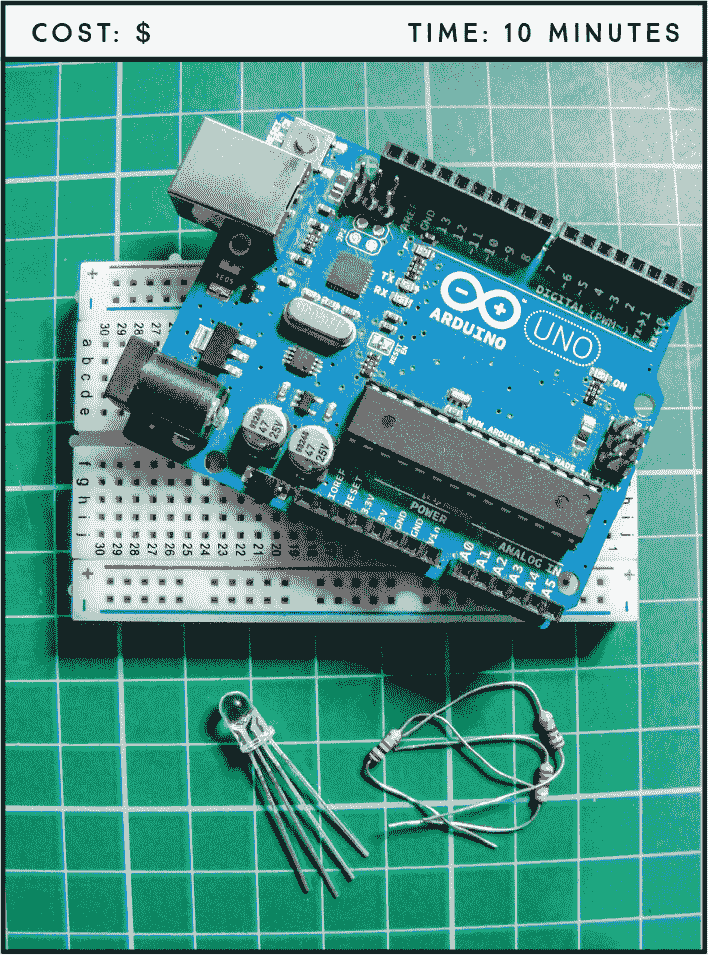

**所需组件**

**Arduino 板**

**面包板**

**跳线**

**RGB 共阴极 LED**

**3 个 220 欧姆电阻**

### 工作原理

LED 有许多不同的颜色和形式，但其中最实用的之一就是 RGB LED。顾名思义，RGB LED 实际上是三个 LED 合为一体：红色、绿色和蓝色（见图 5-1）。

**图 5-1：** RGB LED 的三原色

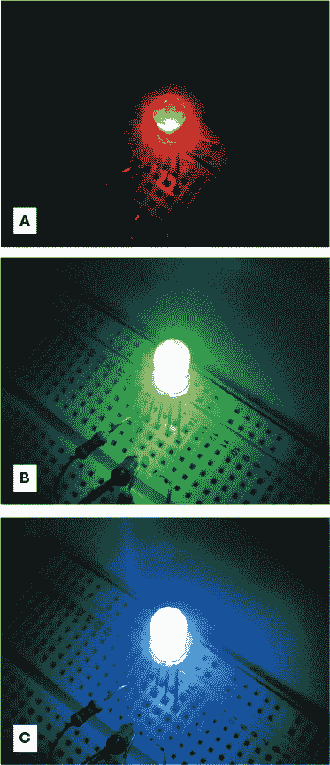

RGB 是一种*加色*模型，这意味着通过组合两种或更多颜色的光，我们可以创建其他颜色。红色、绿色和蓝色是加色模型中的原色，它们作为其他颜色的基础，如图 5-2 所示。

**图 5-2：** RGB 是加色模型。

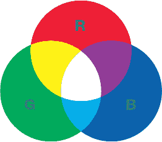

我们可以在图 5-3 中更详细地查看 RGB LED。

**图 5-3：** 一个 RGB LED

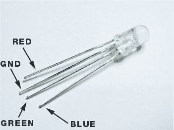

你会看到 RGB LED 有四个引脚，而不是通常的两个：红色、绿色和蓝色各一个，第四个是阴极或阳极。我们将使用像图中所示的*共阴极*RGB LED，其中最长的引脚是阴极，并连接到地。

我们可以使用 RGB LED 创建一个随机颜色的输出，循环显示彩虹的颜色，并逐渐变暗和变亮。这种照明效果在俱乐部或酒吧中经常使用，以营造轻松的氛围。你也可以将 LED 放入不透明的花瓶或盒子中，作为一个舒缓的夜灯。

### 组装

1.  首先将共阴极 RGB LED 插入面包板，将红色引脚插入长的 GND（或阴极）引脚左侧的孔中。然后将 220 欧姆电阻连接到三个颜色引脚上。

    **注意**

    *某些 RGB LED 的绿脚和蓝脚位置正好相反。*

1.  将红色引脚连接到 Arduino 的 11 号引脚，GND 连接到 Arduino 的 GND，绿色连接到 Arduino 的 10 号引脚，蓝色连接到 Arduino 的 9 号引脚。

    |  **共阴极 RGB LED**  | **Arduino** |
    | --- | --- |
    | 红色 | 11 号引脚 |
    | GND | GND |
    | 绿色 | 10 号引脚 |
    | 蓝色 | 9 号引脚 |

1.  确认你的设置与图 5-4 中的电路图匹配，并上传第 47 页中的“草图”代码。

    **图 5-4：** 氛围灯的电路图

    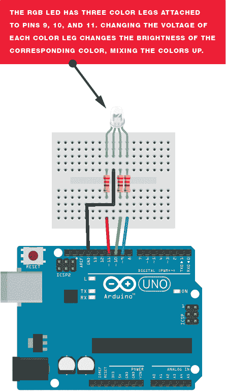

### 草图

该草图首先将 Arduino 的 9、10 和 11 号引脚设置为输出。该草图通过极快地开关 RGB LED 上的每个灯的亮度（电力值），使它们依次变化——LED 点亮的时间越长，亮度越高。为此，Arduino 使用了一种叫做*脉宽调制（PWM）*的技术。Arduino 通过快速地开关电源来创建脉冲。电源开关的持续时间（称为*脉冲宽度*）决定了平均输出，通过改变这个脉冲宽度，Arduino 可以模拟从完全打开（5 伏）到关闭（0 伏）之间的电压。如果 Arduino 的信号开关一半时间为开，另一半时间为关，平均输出将是 2.5 伏，即 0 和 5 之间的一半。如果信号开关时间为 80%，关时间为 20%，电压为 4 伏，依此类推。

我们定义一个 RGB 值在`0`到`255`之间，增量为`5`伏，以创建淡化效果。简单来说，LED 的每种颜色从 0 逐渐亮起到 5 伏，然后在达到最大值`255`时逐渐变暗。Arduino 可以处理`0`到`1023`之间的值（总共 1,024 个值），但因为这个值太高，我们将其除以 4，使用`255`作为最大 LED 值，以便颜色变化更加明显。

int redPin = 11;   // 连接到 RGB LED 红色脚的引脚

int greenPin = 10; // 连接到 RGB LED 绿色脚的引脚

int bluePin = 9;   // 连接到 RGB LED 蓝色脚的引脚

void setup() {

setRgb(0, 0, 0); // 将所有颜色设置为 0

}

void loop() {

int Rgb[3]; // 3 个 RGB 引脚

Rgb[0] = 0; // 每个值

Rgb[1] = 0;

Rgb[2] = 0;

// 颜色的增减变化

for (int decrease = 0; decrease < 3; decrease += 1) {

int increase = decrease == 2 ? 0 : decrease + 1;

for (int i = 0; i < 255; i += 1) { // 淡化颜色

Rgb[decrease] -= 1;

Rgb[increase] += 1;

setRgb(Rgb[0], Rgb[1], Rgb[2]);

delay(20);

}

}

}

void setRgb (int red, int green, int blue) {

analogWrite(redPin, red);

analogWrite(greenPin, green);

analogWrite(bluePin, blue);

}

### 故障排除

**问答** *代码编译通过，但 RGB LED 没有按预期点亮。*

• 如果 RGB LED 完全不亮，确保你已经将 Arduino 的 GND 线连接到 RGB LED 的正确脚——长阴极脚——并且 Arduino 已连接电源。

• 如果你有共阳 RGB LED，则应将长脚连接到 Arduino 的+5V。检查你的部件数据手册以了解你使用的是哪种类型的 RGB LED。

• 如果颜色没有按预期显示，可能是你的 RGB LED 引脚配置不同；检查数据手册或尝试交换绿色和蓝色脚的连接。

## 彩虹条形灯**

在本章中，我们将使用 RGB LED 条形灯创建一个装饰性的彩虹色氛围条。

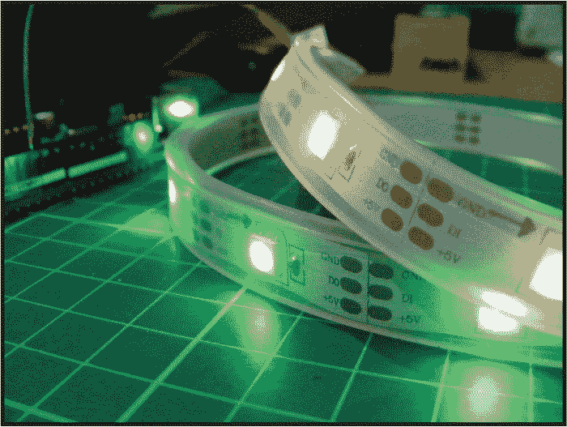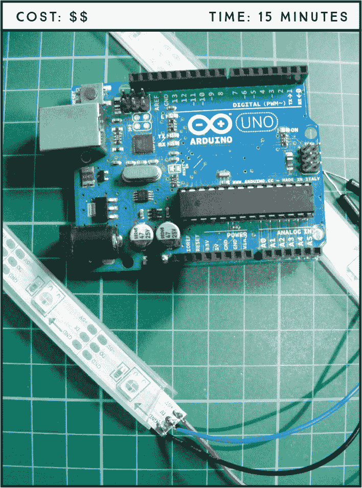

**所需零件**

**Arduino 板**

**实心电线**

**RGB LED 条带（WS2812B 5V 32-LED 条带）**

**所需库**

**PololuLedStrip**

### 工作原理

LED 条灯通常用于创建氛围作为装饰性功能，例如电视的背光或厨房柜下的灯光。它们功率较低，通常在 5 至 12 伏之间，因此它们很容易安装在任何地方，并且具有自己的电源——而且看起来也很漂亮！

条灯通常有两种类型。单色或多色*非可寻址*条带只能同时点亮所有 LED 为同一颜色。RGB 多色条带通常是*可寻址*的，这意味着每个 LED 都有自己的芯片，可以单独控制，从而使不同的 LED 能同时显示多种颜色。

我们将使用一条可寻址 RGB LED 条带。与项目 5 中的 RGB LED 不同，条灯上的 LED 是*表面贴装*的。这意味着组件直接放置在印刷电路板的表面——在这种情况下，是一条柔性条带上——而不是单独插入电路。

可寻址 RGB 条灯有两种主要类型。三引脚 RGB LED 条带具有 GND、数据和+5V 连接，用于控制 LED。数据引脚连接到 Arduino，并使用在项目 5 中解释的相同*脉宽调制（PWM）*功能来创建条带上的颜色和序列。四引脚 RGB LED 条带具有 GND、时钟、数据输入和+5V 连接，并使用*串行外设接口（SPI）*来控制它们的 LED。SPI 是一种通信方法，允许设备之间进行双向数据传输。

我们的可寻址 RGB LED 条带，如图 6-1 所示，是使用 PWM 的三引脚类型。它调用了由 Pololu Robotics and Electronics 创建的 PololuLedStrip 库（*[`www.pololu.com/`](https://www.pololu.com/)*）来控制 LED。

**图 6-1：** 三引脚可寻址 RGB LED 条灯

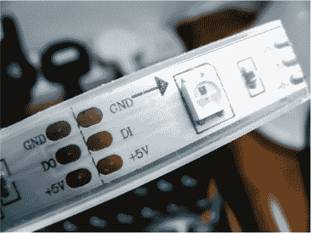

我们将使用 RGB LED 条带来创建一个颜色输出，该输出将通过彩虹的颜色进行循环，每种颜色逐渐变亮和变暗，如图 6-2 所示。

**图 6-2：** RGB LED 条带循环显示彩虹的颜色

### 构建过程

1.  下载并将 PololuLedStrip 库添加到你的 Arduino IDE 中（请查看入门指南了解如何保存库）。

1.  该项目的设置非常简单，完成起来也很快。大多数三引脚可寻址 RGB LED 条带没有将导线连接到条带的连接端口，因此你需要自己连接。将 LED 朝上，首先将实心导线焊接到条带左端的三个连接点，如图 6-3 所示。

    **图 6-3：** 焊接左侧连接的导线

    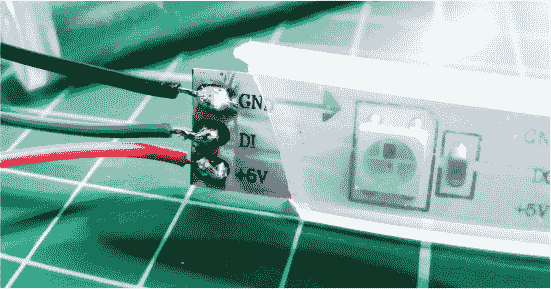

1.  将 LED 的 GND 引脚连接到 Arduino 的 GND，DI 连接到 Arduino 的 12 号引脚，+5V 连接到 Arduino 的+5V，如下表所示。

    | **RGB LED 条带** | **Arduino** |
    | --- | --- |
    | GND | GND |
    | DI（数据输入） | 引脚 12 |
    | +5V | +5V |

1.  根据图 6-4 中的电路图检查你的设置，然后上传下面的代码“草图”并通过电池包为 Arduino 供电。

    **图 6-4：** 彩虹条形灯电路图

    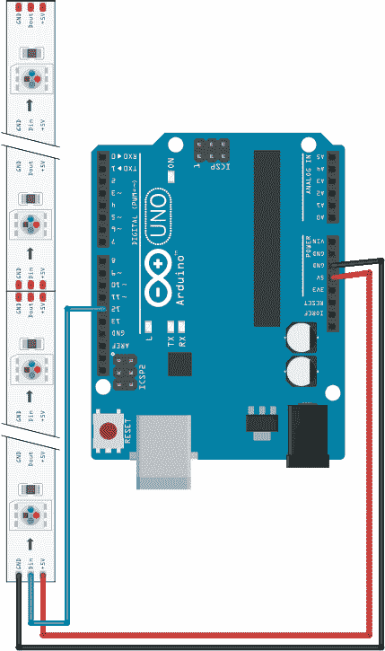

### 草图

该草图首先调用了 PololuLedStrip 库，我们用它来控制单个 LED。接下来，它定义了用于控制数据从 Arduino 传输到 LED 条的引脚为 12，并将 LED 条上的 LED 数量设置为 32——如果你的 LED 条有不同数量的 LED，你需要修改此值。

接下来是一个计算，用于控制我们 LED 的色调、饱和度和亮度（HSV），从而生成 RGB 颜色。如果你愿意，可以使用 HSV 图表来更改这些值；只需快速搜索互联网即可找到参考图表。

WS2812B 数据手册指出，每个 LED 的颜色是通过三个 LED 亮度值编码的，这些值必须按 GRB（绿色-红色-蓝色）顺序发送。第一个传输的颜色应用于离数据输入连接器最近的 LED，第二个传输的颜色应用于条上的下一个 LED，依此类推。

/* PololuLedStrip 库版权(c) 2012 Pololu 公司。

更多信息，请访问[`www.pololu.com/`](http://www.pololu.com/);

[`forum.pololu.com/`](http://forum.pololu.com/)

现特此免费授予任何人许可

获取此软件及相关文档文件的副本

（“软件”），可以在不受限制的情况下使用、复制、修改、合并、

包括但不限于使用、复制、修改、合并的权利，

发布、分发、再许可和/或销售该软件的副本，

并允许软件接收者按此方式使用，

需遵守以下条件：

上述版权声明和此许可声明应包含在

包括在所有副本或实质性部分中。

本软件按“原样”提供，不附任何类型的保证，

明示或暗示的保证，包括但不限于

适销性、特定用途适用性及非

侵权。在任何情况下，作者或版权持有者均不应

对任何索赔、损害或其他责任不承担责任，无论是

合同、侵权或其他原因引起的，或与

与软件相关或使用或其他交易活动相关的

软件。

LedStripRainbow：示例 Arduino 草图，展示如何制作

在 Pololu 的可寻址 RGB LED 条上展示的移动彩虹效果。

要使用此功能，你需要将一个可寻址 RGB LED 条插入

将 Pololu 插入引脚 12。上传草图后，你应该会看到一个

移动的彩虹效果。*/

#include <PololuLedStrip.h>

// 创建一个 ledStrip 对象，并指定它将使用的引脚。

PololuLedStrip<12> ledStrip;

// 创建一个缓冲区用于存储颜色（每种颜色 3 字节）。

#define LED_COUNT 32

rgb_color colors[LED_COUNT];

void setup() {

}

// 将颜色从 HSV 转换为 RGB。

// h 是色调，范围从 0 到 360。

// s 是饱和度，范围从 0 到 255。

// v 是数值，范围从 0 到 255。

rgb_color hsvToRgb(uint16_t h, uint8_t s, uint8_t v) {

uint8_t f = (h % 60) * 255 / 60;

uint8_t p = (255 - s) * (uint16_t)v / 255;

uint8_t q = (255 - f * (uint16_t)s / 255) * (uint16_t)v / 255;

uint8_t t = (255 - (255 - f) * (uint16_t)s / 255) * (uint16_t)v / 255;

uint8_t r = 0, g = 0, b = 0;

switch((h / 60) % 6) {

case 0: r = v; g = t; b = p; break;

case 1: r = q; g = v; b = p; break;

case 2: r = p; g = v; b = t; break;

case 3: r = p; g = q; b = v; break;

case 4: r = t; g = p; b = v; break;

case 5: r = v; g = p; b = q; break;

}

return (rgb_color) {

r, g, b

};

}

void loop() {

// 更新颜色。

uint16_t time = millis() >> 2;

for (uint16_t i = 0; i < LED_COUNT; i++) {

byte x = (time >> 2) - (i << 3);

colors[i] = hsvToRgb((uint32_t)x * 359 / 256, 255, 255);

}

// 将颜色写入 LED 条带。

ledStrip.write(colors, LED_COUNT);

delay(10);

}

### 故障排除

**Q.** *代码可以编译，但 RGB LED 没有按预期点亮。*

• 如果 RGB LED 条带没有点亮，请确保您的电线连接如图 6-4 所示，并且您的 LED 条带是指定的 WS2812B 类型。

• 如果您还没有这样做，请为 RGB LED 条带使用外部电源。

## NeoPixel 指南针**

在本章中，我们将使用三轴传感器和 RGB LED 环创建一个指南针，通过点亮指示北方的 LED 来显示方向。

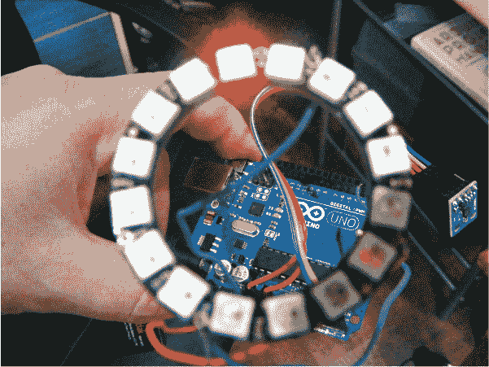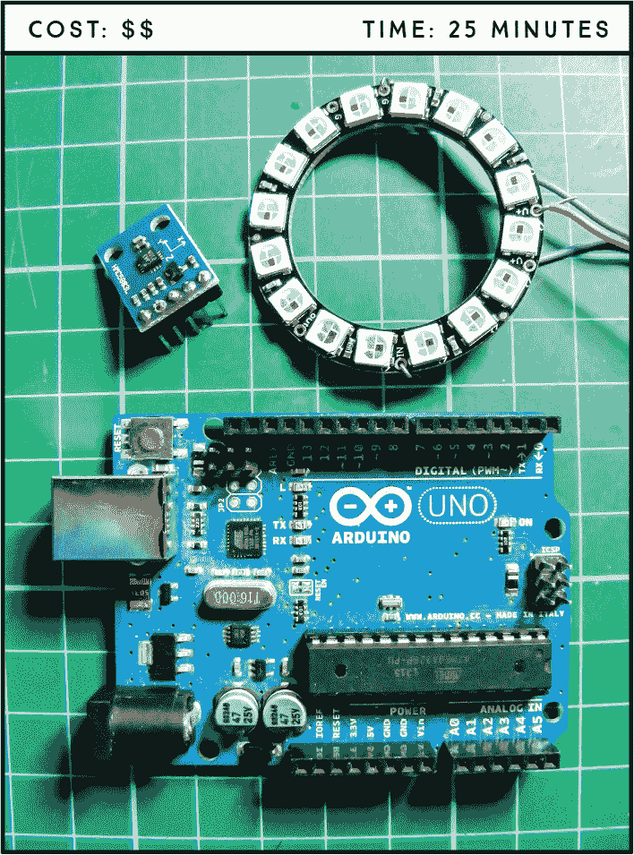

**所需零件**

**Arduino 板**

**跳线**

**HMC5883L 三轴传感器**

**Adafruit NeoPixel 环，包含 16 个 RGB LED**

**9V 电池组，包含 6 节 AA 电池**

**所需库**

**电线**

**FastLED**

**HMC5883L**

### 工作原理

HMC5883L 三轴传感器（见图 7-1）是一个多芯片模块，用于感应磁力。该模块能够测量地球磁场的方向和强度。我们将使用 HMC5883L 库来将我们的项目转化为电子指南针。

**图 7-1:** HMC5883L 三轴模块运行在 3.3V 而不是 5V。

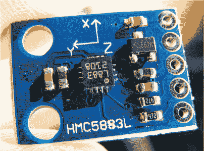

地球的磁场被认为是由其核心中导电材料内的电流产生的，这些电流是由于热量逸散而形成的。由于地球本身就是一个磁体，指南针的北端会被磁场吸引并与其对齐。

为了可视化我们的指南针方向，我们将使用 Adafruit NeoPixel 环（见图 7-2）。NeoPixel 环由 16 个 RGB LED 组成，每个 LED 都有自己的驱动芯片，因此可以单独控制。通过单一数据线控制这些 LED，我们将使用 FastLED 库来控制颜色。

**图 7-2:** Adafruit 16 RGB NeoPixel 环

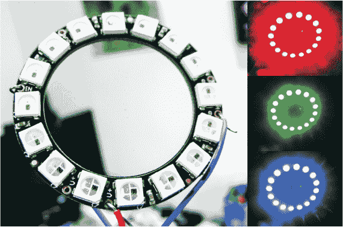

当项目通电时，HMC5883L 模块会检测磁北，并通过点亮 NeoPixel 环形灯带的 LED 来显示它。如果你在拿着已通电的 NeoPixel 指南针时转动方向，LED 灯光会移动，始终指向北方。

### 构建过程

**注意**

*指南针模块上标有 DRDY 的引脚在此项目中未使用。*

您的 HMC5883L 模块可能到达时引脚松动，因此第一步是将引脚焊接到模块上。您需要一条包含五个引脚的引脚条，这应该随模块一起提供。将引脚插入模块上的五个可用孔中，并将每个引脚焊接几秒钟（如果需要帮助，请查看 快速焊接指南 在 第 12 页）。该模块通过 I2C 和 Wire 库与 Arduino 进行通信。

1.  为了正确使用指南针，您需要对 HMC5883L 模块进行校准。将模块连接到 Arduino，如下表所示。

    | **HMC5883L 模块** | **ARDUINO** |
    | --- | --- |
    | VCC | +3.3V |
    | GND | GND |
    | SCL | 引脚 A5 (SCL) |
    | SDA | 引脚 A4 (SDA) |

1.  下载 HMC5883L 库并将其添加到您电脑上的 Arduino 库文件夹中。如果需要提醒如何操作，请查看入门指南中的库部分。保存库后，重新启动 Arduino IDE。重新打开时，库应保存在 *Examples* 中。选择 **文件** ▸ **示例** ▸ **Arduino-HMC5883L-Master** ▸ **HMC5883L_calibrate**。如果看不到草图，请确保您已经将库保存在 Arduino 库文件夹中。以下草图将在 IDE 主窗口中显示：

    /*

    校准 HMC5883L。HMC5883L_calibrate_processing.pde 的输出

    阅读更多: [`www.jarzebski.pl/arduino/czujniki-i-sensory/3-osiowy-magnetometr-hmc5883l.html`](http://www.jarzebski.pl/arduino/czujniki-i-sensory/3-osiowy-magnetometr-hmc5883l.html)

    GIT: [`github.com/jarzebski/Arduino-HMC5883L`](https://github.com/jarzebski/Arduino-HMC5883L)

    网站: [`www.jarzebski.pl`](http://www.jarzebski.pl)

    (c) 2014 by Korneliusz Jarzebski

    */

    #include <Wire.h>

    #include <HMC5883L.h>

    HMC5883L compass;

    int minX = 0;

    int maxX = 0;

    int minY = 0;

    int maxY = 0;

    int offX = 0;

    int offY = 0;

    void setup() {

    Serial.begin(9600);

    // 初始化 HMC5883L

    while (!compass.begin()) {

    delay(500);

    }

    // 设置测量范围

    compass.setRange(HMC5883L_RANGE_1_3GA);

    // 设置测量模式

    compass.setMeasurementMode(HMC5883L_CONTINOUS);

    // 设置数据速率

    compass.setDataRate(HMC5883L_DATARATE_30HZ);

    // 设置平均样本数量

    compass.setSamples(HMC5883L_SAMPLES_8);

    }

    void loop() {

    Vector mag = compass.readRaw();

    // 确定最小值 / 最大值

    if (mag.XAxis < minX) minX = mag.XAxis;

    if (mag.XAxis > maxX) maxX = mag.XAxis;

    if (mag.YAxis < minY) minY = mag.YAxis;

    if (mag.YAxis > maxY) maxY = mag.YAxis;

    // 计算偏移量

    offX = (maxX + minX)/2;

    offY = (maxY + minY)/2;

    /*Serial.print(mag.XAxis);

    Serial.print(":");

    Serial.print(mag.YAxis);

    Serial.print(":");

    Serial.print(minX);

    Serial.print(":");

    Serial.print(maxX);

    Serial.print(":");

    Serial.print(minY);

    Serial.print(":");

    Serial.print(maxY);

    Serial.print(":"); */

    Serial.print(offX);

    Serial.print(":");

    Serial.print(offY);

    Serial.print("\n");

    }

1.  我们只需要最后一组 `Serial.print` 命令中的 X 和 Y 输出，因此请注释掉草图中加粗部分的 `Serial.print` 行。将草图上传到 Arduino，并打开串口监视器。一系列数字将显示出来，如图 7-3 所示。

    **图 7-3：** 校准数字将在 IDE 串口监视器窗口中显示。

    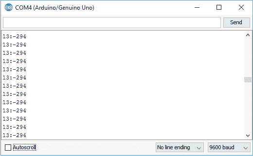

1.  在传感器连接到 Arduino IDE 串口监视器的同时，旋转传感器 360 度，你应该能看到显示两个数字；在图 7-3 中，它们是 13 和 –294。你稍后将在草图中需要这些校准数字，所以请记下它们。

1.  你可以通过查找你所在位置的 *磁偏角* 来提高罗盘的精度。磁偏角或变化是水平面上磁北（罗盘指向的方向）与真北（指向地理北极的方向）之间的角度。你可以通过访问 *[`www.magnetic-declination.com/`](http://www.magnetic-declination.com/)* 并在左上角的搜索框中输入你的位置信息来找到你的磁偏角。你的结果将如图 7-4 所示。

    **图 7-4：** 你所在位置的磁偏角可以在 *[`www.magnetic-declination.com/`](http://www.magnetic-declination.com/)* 网站找到。

    

1.  你需要的值是磁偏角和磁偏差；在图 7-4 中，它们分别是 –2° 26' 和负值（西），但你的值会不同。也要记录这些值，因为我们将在项目的最后使用它们—仅有一个小的变化。例如，我的值是 –2 和 26。我们不会把负号（减号）放在第一个值前面，而是放在后面，像这样：

    float declinationAngle = (2 - (26.0 / 60.0)) / (180 / M_PI);

    如果你所在位置的磁偏角为正值（西），则应该添加正号（加号）：

    float declinationAngle = (2 + (26.0 / 60.0)) / (180 / M_PI);

    接下来，通过将 NeoPixel 的 V 引脚连接到 Arduino 的 +5V，引脚 GND 连接到 GND，引脚 In 连接到 Arduino 的 3 号引脚，将 NeoPixel 环连接到 Arduino。

    | **NEOPIXEL** | **ARDUINO** |
    | --- | --- |
    | 电压 | +5V |
    | GND | GND |
    | 输入 | 引脚 3 |

1.  根据图 7-5 中的电路图检查你的设置，然后上传下面的 “草图” 代码。

    **图 7-5：** NeoPixel 罗盘的电路图

    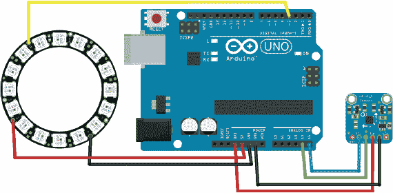

### 草图

首先，我们调用 Wire、FastLED 和 HMC5883L 库。Wire 库已与 Arduino IDE 一起安装，但您需要添加其他库。请在本书的资源中下载它们，链接为 *[`www.nostarch.com/arduinohandbook2/`](http://www.nostarch.com/arduinohandbook2/)*，并根据入门指南获取更多添加库的信息。

接下来，我们声明 NeoPixel 环上的 LED 数量（16 个），并将引脚 3 分配给 Arduino 来控制它。然后我们调用 HMC5883L 库中的多个设置来控制罗盘模块。在 ➊ 处，我们添加了`X`和`Y`的罗盘偏移值，这些值应与步骤 4 中的校准匹配；我的分别是 13，–294。在 ➋ 处，我们添加了步骤 6 中的磁偏角。同样，记得将其更改为您所在位置的磁偏角。

接下来的一组计算使得传感器能够映射到 360 度旋转。然后我们设置 NeoPixel 上的 LED，根据传感器的读数移动指向北方。点亮了三个 LED：一个指向北方的红色 LED，以及其两侧的绿色 LED。罗盘最好在户外使用，模块远离任何强电磁源，且应该通过电池包供电，而非 USB 连接。

// 代码由 brainy-bits.com 提供并经过许可使用

// [`brainy-bits.com/tutorials/find-your-way-using-the-hmc5883l/`](https://brainy-bits.com/tutorials/find-your-way-using-the-hmc5883l/)

#include <Wire.h>

#include "FastLED.h"

#include <HMC5883L.h>

#define NUM_LEDS 16  // 环形灯带上的 LED 数量

#define DATA_PIN_RING 3 // 引脚 3 连接到 RGB 环形灯带

CRGB leds_RING[NUM_LEDS];

HMC5883L 罗盘;

int fixedHeadingDegrees; // 用于存储航向值

void setup() {

Serial.begin(9600);

Wire.begin(); // 设置 I2C

// 设置 FastLED 库与 NeoPixel 环的数据

FastLED.addLeds<NEOPIXEL,DATA_PIN_RING>(leds_RING, NUM_LEDS);

// 设置测量范围

compass.setRange(HMC5883L_RANGE_1_3GA);

// 设置测量模式

compass.setMeasurementMode(HMC5883L_CONTINOUS);

// 设置数据速率

compass.setDataRate(HMC5883L_DATARATE_30HZ);

// 设置平均样本数

compass.setSamples(HMC5883L_SAMPLES_8);

// 设置校准偏移值。请参见 HMC5883L_calibration.ino

➊ compass.setOffset(13, -224);

}

void loop() {

Vector norm = compass.readNormalize();

// 计算航向

float heading = atan2(norm.YAxis, norm.XAxis);

// 设置您所在位置的磁偏角并修正航向

// 查找您的磁偏角： http://magnetic-declination.com/

// (+) 正值或 (-) 负值

// 对于苏格兰邓弗里斯的磁偏角为 -2 '26W（负值）

// 公式：(度 + (分 / 60.0)) / (180 / M_PI);

float declinationAngle = (2.0 – (26.0 / 60.0)) / (180 / M_PI);

➋  heading -= declinationAngle;

// 修正航向 < 0° 和航向 > 360°

if (heading < 0) {

heading += 2 * PI;

}

if (heading > 2 * PI) {

heading -= 2 * PI;

}

// 转换为度数

float headingDegrees = heading * 180 / M_PI;

// 修正 HMC5883L 罗盘模块的旋转速度

如果 (headingDegrees >= 1 && headingDegrees < 240) {

fixedHeadingDegrees = map(headingDegrees * 100, 0, 239 * 100, 0, 179 * 100) / 100.00;

}

else {

如果 (headingDegrees >= 240) {

fixedHeadingDegrees = map(headingDegrees*100, 240*100, 360*100, 180*100, 360*100) / 100.00;

}

}

int headvalue = fixedHeadingDegrees / 18;

int ledtoheading = map(headvalue, 0, 15, 15, 0);

// 清除环

FastLED.clear();

// 新的方向

如果 (ledtoheading == 0) {

leds_RING[15] = CRGB::Red;

leds_RING[0] = CRGB::Green;

leds_RING[14] = CRGB::Green;

}

else {

如果 (ledtoheading == 15) {

leds_RING[0] = CRGB::Red;

leds_RING[15] = CRGB::Green;

leds_RING[1] = CRGB::Green;

}

else {

leds_RING[ledtoheading] = CRGB::Red;

leds_RING[ledtoheading+1] = CRGB::Green;

leds_RING[ledtoheading-1] = CRGB::Green;

}

}

FastLED.setBrightness(50);

FastLED.show();

delay(100);

}

### 故障排除

**Q.** *代码编译成功，但 RGB LED 灯没有按预期亮起。*

• 如果没有 LED 灯亮起，请仔细检查接线，特别是确认 NeoPixel 的数据引脚是否连接到 Arduino 的 3 号引脚。

• 检查你的 NeoPixel 的电源是否连接到 GND 和 +5V。指南针模块应该连接到 GND 和 +3.3V。Arduino 应该由你的电池组供电，而不是通过 PC 的 USB 电缆供电。

• 确保你已经校准了模块，并按照前面所示的步骤输入了数值。指南针模块应该水平持平，并与 RGB 环保持一致。环和模块应始终一起移动。

• 该模块最好在户外使用，因为它对金属和电气干扰非常敏感。

• 尽量将 Arduino 和传感器的电源保持尽可能远，以避免干扰。
