# 第三章：声音

## **Arduino 钢琴**

在这个项目中，我们将使用一些瞬时按钮和一个压电蜂鸣器来制作一个简单的钢琴。

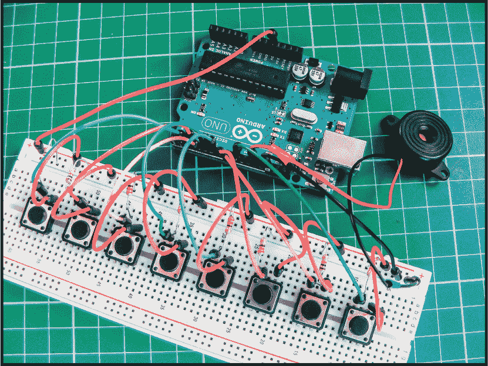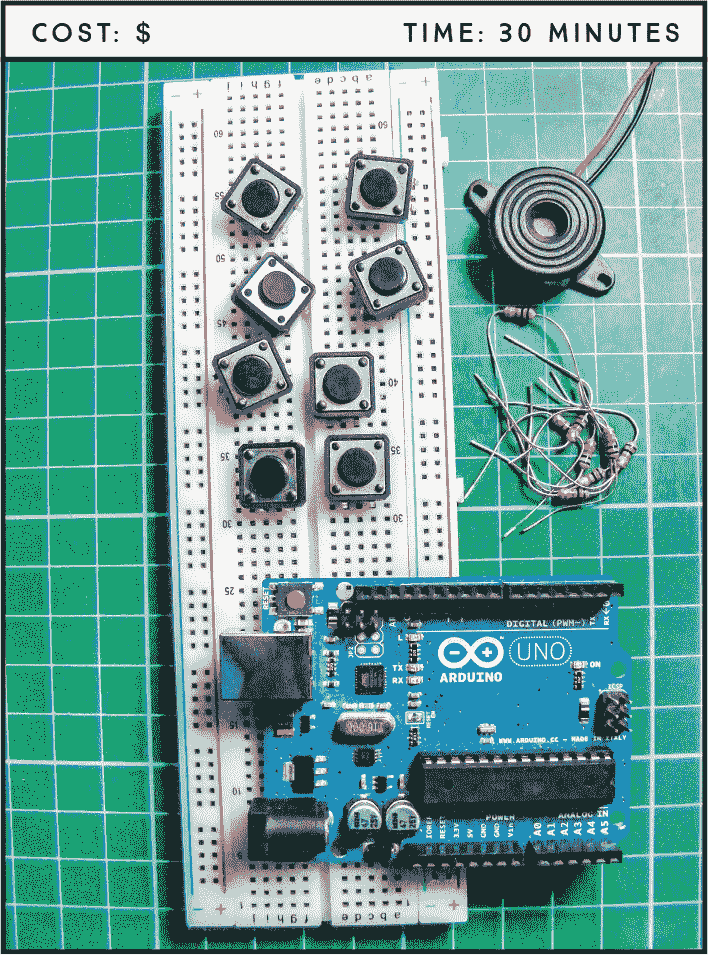

**所需组件**

**Arduino 板**

**面包板**

**跳线**

**压电蜂鸣器**

**8 个瞬时触觉按钮**

**8 个 1k 欧姆电阻**

### 工作原理

在我们的项目中，每个按钮（参见图 8-1）都连接到一个 Arduino 引脚，当按钮被按下时，压电蜂鸣器将发出八个音符中的一个。

**图 8-1：** 瞬时按钮及其电路

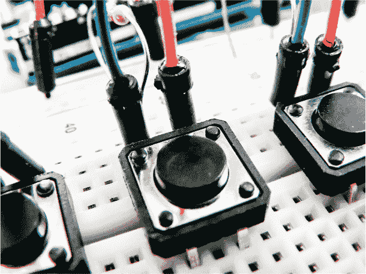

当按下按钮时，按键完成电路的闭合，使电路通电。一旦按钮释放，连接将回弹并断开电路，导致电路关闭。按键开关也叫做*瞬时开关*或*常开开关*，例如用于计算机键盘中。这与*翻转开关*不同，后者保持开或关状态，直到你将它切换到另一位置，就像灯开关一样。

这种类型的按钮有四个引脚，但通常只使用其中的两个来连接。在这个项目中，我们使用顶部的引脚，这样更容易触摸按钮并演奏旋律，尽管底部未使用的两个引脚也能完成相同的工作。如图 8-2 所示，引脚在电路中起作用。引脚 A 和 C 始终连接在一起，B 和 D 也是如此。当按钮被按下时，电路就完成了。

**图 8-2：** 按钮的未完成电路

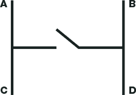

Arduino 钢琴使用了一个压电蜂鸣器，如图 8-3 所示，用来产生类似可识别音符的频率。压电蜂鸣器，简称为压电元件，是一种常见的低价蜂鸣器，通常用于小玩具中。没有塑料外壳的压电元件看起来像一个金色金属圆盘，连接着正极（通常为红色）和负极（通常为黑色）的电线。压电元件只能发出点击声，这是通过施加电压来实现的。

**图 8-3：** 压电蜂鸣器

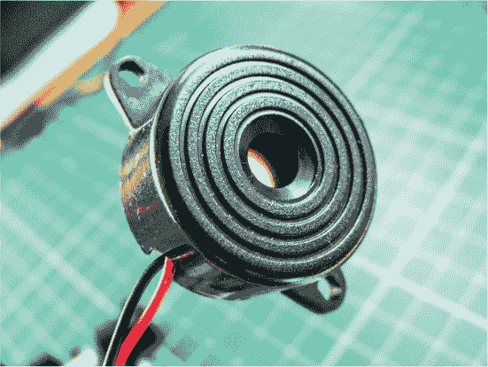

我们可以通过让压电元件以特定频率每秒点击数百次来生成可识别的音符，因此首先我们需要了解我们所需不同音符的频率。表 8-1 展示了音符及其对应的频率。*周期*是频率产生的周期时长，单位为微秒。例如，为了得到 C 音符（261 Hz），我们需要让压电元件以 3,830 微秒的周期工作。我们将周期除以二，得到 `timeHigh` 值，这个值用于代码中来生成音符。（音符的产生是由于压电元件被快速打开和关闭，所以压电元件开启的时间，或者称为 `HIGH`，是周期的一半。）

**表 8-1：** 代码中使用的音符和频率

| **注意** | **频率** | **周期** | **高电平时间** |
| --- | --- | --- | --- |
| `c` | 261 Hz | 3,830 | `1915` |
| `d` | 294 Hz | 3,400 | `1700` |
| `e` | 329 Hz | 3,038 | `1519` |
| `f` | 349 Hz | 2,864 | `1432` |
| `g` | 392 Hz | 2,550 | `1275` |
| `a` | 440 Hz | 2,272 | `1136` |
| `b` | 493 Hz | 2,028 | `1014` |
| `C` | 523 Hz | 1,912 | `956` |

### 构建

1.  将暂时性按键插入面包板，确保引脚跨过面包板的中心断开区域。

1.  面对面包板时，从左到右为按键编号 1 到 8。使用跳线将按键 1 的左上角引脚（A）连接到 Arduino 引脚 2。将其他按键的左上角引脚依次连接到 Arduino，如下所示。

    | **PUSHBUTTON** | **NOTE** | **ARDUINO** |
    | --- | --- | --- |
    | 1 | `c` | 2 |
    | 2 | `d` | 3 |
    | 3 | `e` | 4 |
    | 4 | `f` | 5 |
    | 5 | `g` | 6 |
    | 6 | `a` | 7 |
    | 7 | `b` | 8 |
    | 8 | `C` | 9 |

1.  在面包板上插入一个 1k 欧姆电阻，与第一个按键的左上角引脚成一行，如图 8-4 所示，并将电阻的另一端连接到面包板的 GND 导轨。对其他按键重复此操作。电阻在按钮未按下时将开关拉到 GND，告诉 Arduino 它处于非正状态；当按钮按下时，正电源发出相应音符的声音。

    **图 8-4：** 一个 1k 欧姆电阻连接按键引脚到 GND。

    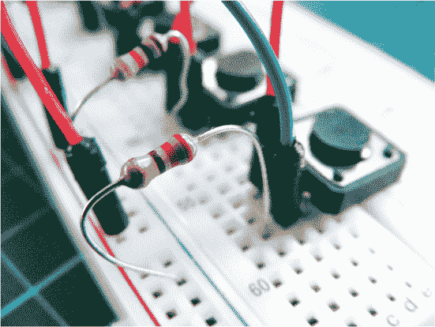

1.  使用跳线将每个按键的右上角引脚（B）连接到面包板的正电源导轨。

1.  将蜂鸣器的红线连接到 Arduino 引脚 13，黑线连接到面包板的 GND 导轨，然后将电源导轨连接到 Arduino 的 GND 和 +5V。

1.  确保你的设置与图 8-5 中的电路图相匹配，然后上传“草图”中的代码，位于第 74 页。

    **图 8-5：** Arduino 钢琴电路图

    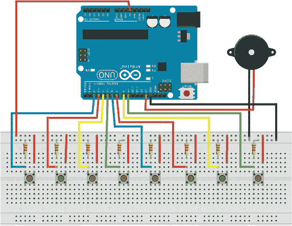

### 草图

该草图首先定义了蜂鸣器连接的引脚以及按键的引脚。为每个按键定义了一个值，并分配了与该值对应的音调。将按键设置为输入，将蜂鸣器设置为输出。循环周期检查每个按钮，在按钮按下时播放对应的音调。每次只能播放一个音符，因为每个音符都需要循环重新开始，所以当按钮释放时，蜂鸣器停止播放音调，循环重新开始。

int speakerPin = 13; // 蜂鸣器定义为 13 引脚

int key_c = 2; // 定义 Arduino 引脚用于按键

int key_d = 3;

int key_e = 4;

int key_f = 5;

int key_g = 6;

int key_a = 7;

int key_b = 8;

int key_C = 9;

// 每个按键的值

int keypress_c = 0; int keypress_d = 0; int keypress_e = 0;

int keypress_f = 0; int keypress_g = 0; int keypress_a = 0;

int keypress_b = 0; int keypress_C = 0;

// 定义每个音符的频率

int tones[] = { 1915, 1700, 1519, 1432, 1275, 1136, 1014, 956 };

//               'c',  'd',  'e',  'f',  'g',  'a',  'b', 'C'

int keytone = 0; // 给 keytone 赋值

void setup() {

pinMode(key_c, INPUT); // 设置按键引脚为输入

pinMode(key_d, INPUT);

pinMode(key_e, INPUT);

pinMode(key_f, INPUT);

pinMode(key_g, INPUT);

pinMode(key_a, INPUT);

pinMode(key_b, INPUT);

pinMode(key_C, INPUT);

pinMode(speakerPin, OUTPUT); // 将蜂鸣器引脚设置为输出

}

// 开始循环读取每个按键的状态

void loop() {

keypress_c = digitalRead(key_c); keypress_d = digitalRead(key_d);

keypress_e = digitalRead(key_e); keypress_f = digitalRead(key_f);

keypress_g = digitalRead(key_g); keypress_a = digitalRead(key_a);

keypress_b = digitalRead(key_b); keypress_C = digitalRead(key_C);

// 如果按键为 HIGH，则播放相应的音调

if ((keypress_c == HIGH) || (keypress_e == HIGH) ||

(keypress_g == HIGH) || (keypress_d == HIGH) ||

(keypress_f == HIGH) || (keypress_a == HIGH) ||

(keypress_b == HIGH) || (keypress_C == HIGH))

{

if (keypress_c == HIGH) {

keytone = tones[0];

}

if (keypress_d == HIGH) {

keytone = tones[1];

}

if (keypress_e == HIGH) {

keytone = tones[2];

}

if (keypress_f == HIGH) {

keytone = tones[3];

}

if (keypress_g == HIGH) {

keytone = tones[4];

}

if (keypress_a == HIGH) {

keytone = tones[5];

}

if (keypress_b == HIGH) {

keytone = tones[6];

}

if (keypress_C == HIGH) {

keytone = tones[7];

}

digitalWrite(speakerPin, HIGH); // 打开压电蜂鸣器播放音调

delayMicroseconds(keytone);

digitalWrite(speakerPin, LOW);  // 短暂延时后关闭

delayMicroseconds(keytone);

}

else { // 如果没有按键被按下，蜂鸣器保持静音

digitalWrite(speakerPin, LOW);

}

}

### 故障排除

**Q.** *代码能编译，但部分或所有按钮未发出音调。*

• 如果压电蜂鸣器完全没有声音，请检查蜂鸣器的红线是否连接到引脚 13，黑线是否连接到面包板的 GND。确保 Arduino 的 GND 连接到正确的面包板电源轨，并且 Arduino 已连接电源。

• 如果只有一些按钮能发出声音，请重新检查静音按钮的接线。跳线可能在面包板上没有对齐，导致它们与按键引脚没有正确连接。

• 如果你仍然遇到问题，尝试将故障的按键换成你知道能正常工作的按键；如果这样解决了问题，可能是原来的按键有故障。

## Audio LED 可视化器**

在这个项目中，我们将使用一个声音传感器，根据它检测到的声音的节拍和音量来点亮一系列 LED。

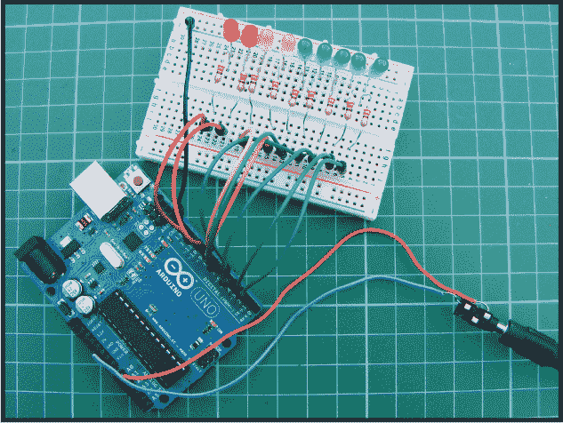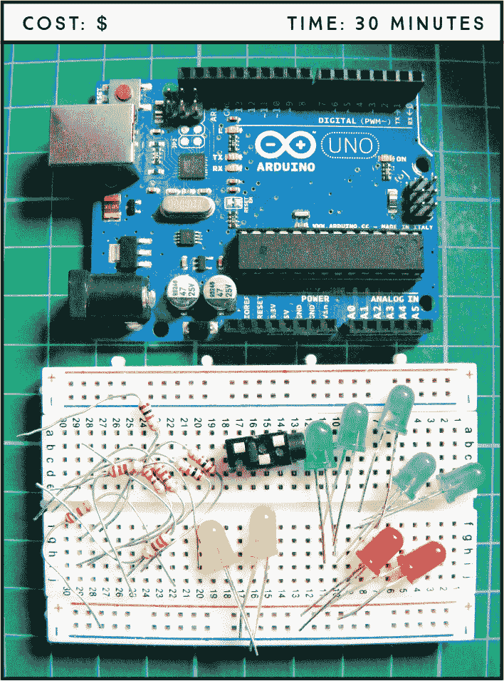

**所需零件**

**Arduino 板**

**面包板**

**实心电线，末端已剥皮**

**跳线**

**2 个红色 LED**

**2 个黄色 LED**

**5 个绿色 LED**

**9 个 220 欧姆电阻**

**3.5 毫米女性耳机插孔**

### 工作原理

在项目 2 中，我们创建了一个由光传感器控制的 LED 夜灯。这个项目与之相似，但 LED 将由声音控制。我们将耳机插孔连接到 Arduino，将插孔连接到 MP3 播放器，然后观看灯光随着音乐“跳动”。MP3 播放器的信号通过耳机插孔被 Arduino A0 引脚接收，并作为脉冲输入。脉冲的模式取决于音乐的节奏和音量。然后，Arduino 根据音乐的脉冲模式向 LED 提供电力。作为替代，你可以添加一个麦克风，并通过彩色灯光来可视化你的声音。

### 搭建过程

1.  将 LED 插入面包板，将短的负极引脚插入 GND 轨道。将面包板上的 GND 轨道连接到 Arduino 的 GND。

1.  为每个 LED 插入 220 欧姆的电阻，确保电阻跨越中心断开，并将一端连接到每个正极 LED 的引脚（参见图 9-1）。将每个电阻的另一端通过跳线连接到 Arduino 的数字引脚 2 到 10，如下表所示。

    | **LED** | **Arduino** |
    | --- | --- |
    | 正极引脚 | 数字引脚 2-10（通过电阻） |
    | 负极引脚 | GND |

    **图 9-1：** LED 与电源之间需要使用电阻。

    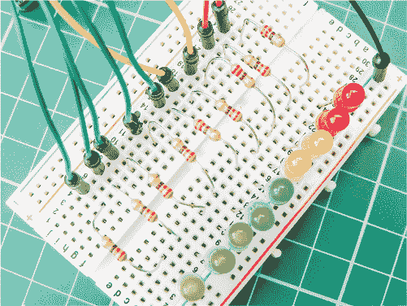

    **注意**

    *这个耳机插孔是从一家美元店购买的收音机中回收来的，但如果你能找到一个购买的耳机插孔，也可以使用。* *在耳机插孔上，接脚分别是 GND、右声道和左声道。*

1.  将耳机插孔的接地引脚直接连接到 GND，插孔的左声道连接到 Arduino 的 A0 引脚，如下表所示。你可以使用跳线来连接，但我使用了实心导线，并剥开了端头以进行连接。细绞线太薄，不容易连接到 Arduino 引脚。（参见图 9-2 了解插孔引脚的位置。）

    | **耳机插孔** | **Arduino** |
    | --- | --- |
    | 接地 | GND |
    | 左声道 | A0 |

    **图 9-2：** 3.5 毫米耳机插孔，插入了 MP3 播放器插头

    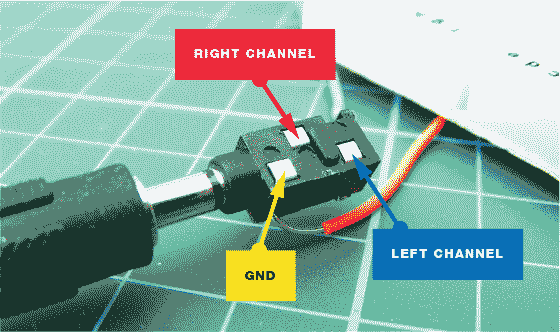

1.  对照图 9-3 中的电路图检查你的设置，然后上传第 81 页中的“程序”代码。

    **图 9-3：** 音频 LED 可视化电路图

    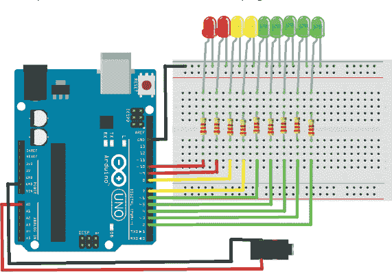

将 MP3 播放器插入耳机插孔以进行音频输入。LED 将随着你的音乐节奏和音量舞动！

### 程序

该草图首先将与 LED 连接的 Arduino 引脚（引脚 2–10）设置为输出模式。此草图中的输入信号来自 MP3 播放器，通过耳机插孔接收，并由模拟引脚 A0 读取。播放器传送的音乐被 A0 作为一系列脉冲接收，音乐的音量和节奏决定了 LED 的点亮方式。音乐越响，点亮的 LED 越多；音乐的节奏越快，LED 闪烁的速度就越快。

// 经 James Newbould 的友好许可使用

int led[9] = {2, 3, 4, 5, 6, 7, 8, 9, 10}; // 与 LED 连接的引脚

int leftChannel = A0; // 连接到耳机插孔的引脚

int left, i; // 创建左和 i 的变量

void setup() {

for (i = 0; i < 9; i++)

pinMode(led[i], OUTPUT); // 将 LED 设置为输出模式

}

void loop() { // 从左到右依次点亮 LED，再反方向点亮

// 根据 A0 的值

left = analogRead(leftChannel);  // 读取左声道值

left = left / 10;  // 设置灵敏度等级，范围为 1 到 50

if (left == 0) {

for (i = 0; i < 9; i++) { // 如果值很低，关闭 LED

digitalWrite(led[i], LOW);

}

}

else { // 否则按顺序点亮 LED

for (i = 0; i < left; i++) {

digitalWrite(led[i], HIGH);

}

for (i = i; i < 9; i++) {

digitalWrite(led[i], LOW);

}

}

}

### 故障排除

**Q.** *代码能够编译，但某些或所有的 LED 灯无法按预期点亮。*

• 如果没有 LED 灯亮起，请确保已将 Arduino 的 GND 线连接到正确的面包板电源轨，并确保 Arduino 已连接电源。

• 如果只有部分 LED 点亮，请检查 LED 是否以正确的方向插入，长腿应连接到正电源，短腿应连接到 GND。LED 是有极性的，因此必须正确连接。检查每个电阻是否完全插入，并确保与对应的 LED 腿在同一排。

• 确保 LED 已连接到草图中定义的 Arduino 引脚，并与图 9-3 中的电路图相匹配；草图的第一部分将引脚 2–10 定义为输出模式，因此应该使用这些引脚。

• 如果某个 LED 仍然不亮，可能是它已经损坏或者有故障。检查的方法是将该 LED 与序列中的另一个 LED 交换，看看问题是否解决。如果发现 LED 在另一个位置工作，说明电阻可能有故障或没有完全插入。根据结果，替换 LED 或电阻为正常工作元件。
