# 第四章：电机

## 老式模拟表盘**

老式模拟显示器具有一定的魅力。在这个项目中，我将展示如何制作你自己的模拟显示器。

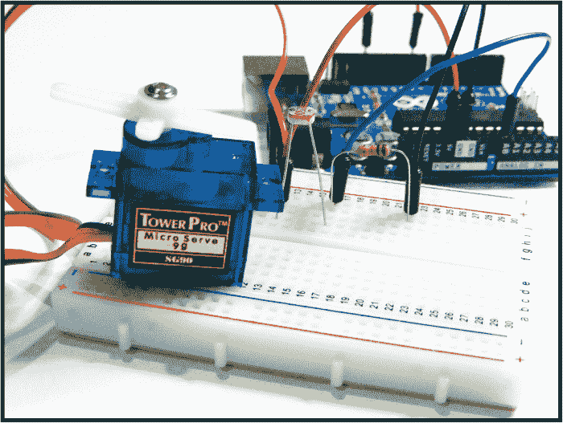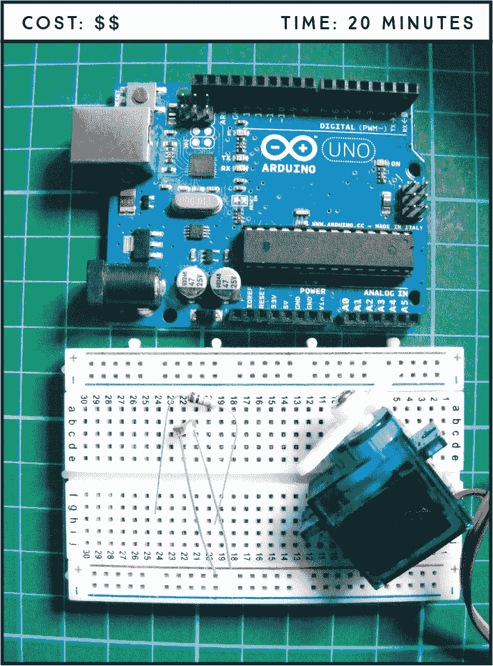

**所需零件**

**Arduino 板**

**面包板**

**跳线**

**Tower Pro SG90 9g 伺服电机**

**光敏电阻**

**10k 欧姆电阻**

**所需库**

**伺服电机**

### 工作原理

今天，测量结果通常通过 LCD 屏幕或 LED 数字显示器以数字方式呈现，但在不久前，模拟指针表盘一直用于显示压力、速度，甚至是时间！Arduino 能够检测来自传感器的电压输入，我们将在这里利用这一能力，创建一个旋转表盘，Arduino 将根据接收到的输入来调整表盘的指针。我们可以在许多项目中使用这个表盘来显示不同的测量值。

在这个项目中，我们将使用光敏电阻来测量光照输入，但你也可以轻松更换成水传感器制作雨水探测器，或者使用气体传感器制作预警仪。*光敏电阻*，也称为*光依赖电阻*，根据传感器检测到的光量产生可变电阻，如第 2 个项目中所讨论的那样。

添加模拟传感器的原理对任何选择的传感器都是相同的。大多数传感器有三根连接：接地、+5V 和连接到 Arduino 的模拟 A0 引脚的信号连接——这使得更换不同的传感器变得简单。光敏电阻略有不同，因为它只有两个连接，其中一个连接到电源，另一个连接到 A0 引脚。

我们将使用传感器来测量光照强度，Arduino 会根据该测量值来控制一个小型伺服电机（简称“伺服”）的臂部运动到相应的角度。电机臂的角度表示光输入的强度。

*伺服电机*，如图 10-1 所示，是一种小型、廉价的大规模生产电机，广泛用于小型机器人和各种电子任务中。伺服电机通过三根电线控制：接地（黑色或棕色）、电源（红色）和信号或控制（通常是橙色、黄色或白色）。通过控制电线发送脉冲，使用脉宽调制（PWM；在第 5 个项目中讨论），光敏电阻接收到的输入决定了伺服电机执行臂的角度。伺服电机每 20 毫秒需要接收一个脉冲，以获取关于角度的正确信息。

脉冲宽度决定了伺服电机的角度运动范围。通常，1.5 毫秒的伺服脉冲宽度将伺服电机设置到其“中立”位置，即 45 度，1.25 毫秒的脉冲宽度将角度设置为 0 度，1.75 毫秒的脉冲宽度将角度设置为 90 度。

**图 10-1：** 伺服电机

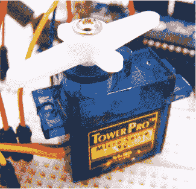

伺服电机臂的角度和伺服硬件的时序因品牌和型号不同而有所不同，但一般来说，伺服电机的角度运动范围为 90 到 180 度，中立位置几乎总是在 1.5 毫秒时。

### 构建步骤

1.  将伺服电机的红色（电源）线直接连接到 Arduino 的 +5V，棕色（接地）线连接到 Arduino 的 GND，黄色（信号）线连接到 Arduino 的引脚 9，如下表所示。

    | **伺服电机** | **ARDUINO** |
    | --- | --- |
    | 红色（电源）线 | +5V |
    | 棕色（接地）线 | GND |
    | 黄色信号（控制）线 | 引脚 9 |

1.  将光敏电阻放入面包板，并将一端连接到 Arduino 的 +5V。将光敏电阻的另一端连接到一个 10k 欧姆电阻，如图 10-2 中的电路图所示，并用跳线将该电阻的另一端连接到 Arduino 的引脚 A0（见下表）。将 10k 欧姆电阻的另一端连接到 GND。

    | **光敏电阻** | **ARDUINO** |
    | --- | --- |
    | 引脚 1 | +5V |
    | 引脚 2 | 通过 10k 欧姆电阻连接到引脚 A0 |

    **图 10-2：** 光敏电阻连接到 Arduino 的 A0 引脚并测量光照强度。伺服电机连接到引脚 9，并根据光照强度进行移动。

    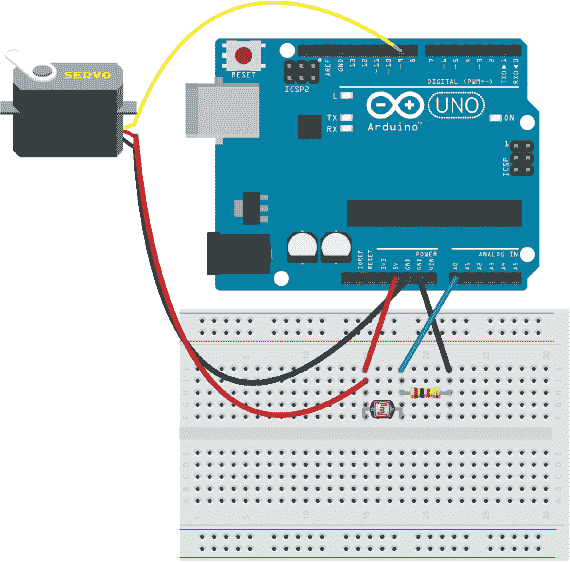

1.  上传 “The Sketch” 中的代码，见 第 89 页。

1.  制作一个像图 10-3 中那样的刻度盘面板，并将其附加到伺服电机上。确保伺服臂可以像指针一样在刻度盘的测量值上移动。当你为 Arduino 加电时，完全覆盖光敏电阻，然后在面板上标记这个位置为 0。用强光手电照射光敏电阻，得到最大值，并在面板上标记这个位置。然后在 0 和最大值之间等距添加标记，以便你得到一个刻度。

    **图 10-3：** 一个示例面板

    

伺服电机的执行臂将根据光照强度沿比例尺移动。例如，在图 10-4 的左侧，伺服臂处于 0 位置。在右侧，当光源（在这种情况下是激光）照射到光敏电阻时，伺服臂会显示光照强度的测量值。

**图 10-4：** 当光照射到光敏电阻上时，伺服臂会移动。

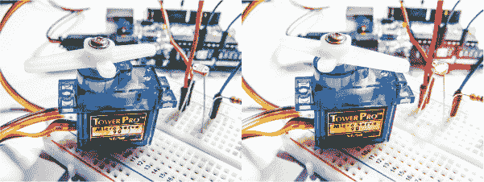

### 草图

该草图首先调用伺服库，该库已经内置于 Arduino IDE 中（因此无需下载和安装该库）。我们为伺服电机的位置设置了初始值`0`，并将光敏电阻引脚设为 A0。我们将 Arduino 的 9 号引脚分配给伺服电机，并从模拟引脚读取值。引脚 A0 能够读取光敏电阻的模拟值并将其转换为范围在 0 到 1,023 之间的数字值，因此我们将其缩放到 0 到 179（180 个可能值），以适应伺服臂 180 度的运动范围。如果没有光照射到光敏电阻，值将为`0`，伺服电机位置将为 0。随着光照的增加，伺服电机的臂会移动，最多可达 180 度。角度取决于亮度。

/* 由 David Cuartielles 创建，Tom Igoe 于 2011 年 8 月 30 日修改

这个示例代码属于公共领域 [`arduino.cc/en/Tutorial/AnalogInput`](http://arduino.cc/en/Tutorial/AnalogInput) */

#include <Servo.h> // 引用伺服库（内置于 IDE 中）

Servo myservo;

int pos = 0; // 给位置赋值

int lightPin = A0; // 连接到光敏电阻的引脚

void setup() {

myservo.attach(9); // 连接到伺服电机的引脚

}

void loop() {

// 从光敏电阻读取电压，最多可以读取 1024 个可能的值

int lightLevel = analogRead(lightPin);

// 将 1024 值缩放到 180

lightLevel = map(lightLevel, 0, 1023, 0, 179);

// 缩放 0-179（180 个值）

pos = constrain(lightLevel, 0, 179);

myservo.write(pos); // 设置伺服电机的角度

delay(100);

}

### 故障排除

**Q.** *代码可以编译，但光照射到光敏电阻时，伺服电机没有移动。*

• 如果伺服电机完全没有移动，请确保电线连接与图 10-2 中的电路图一致，并且 Arduino 有电。

• 将 Arduino 连接到 PC，并打开串口监视器以检查是否有来自光敏电阻的读数。如果没有读数，请检查光敏电阻是否牢固插入面包板。如果仍然没有读数，可能是光敏电阻故障，换一个试试。

## 步进电机**

在这个项目中，我将介绍步进电机（或步进马达），设置它，并讨论它的工作原理。

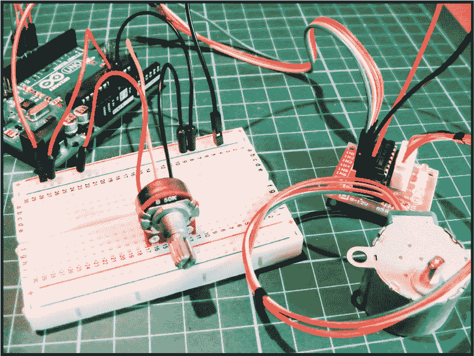

**所需部件**

**Arduino 板**

**面包板**

**跳线**

**28BYJ-48 步进电机与 ULN2003 驱动模块**

**50k 欧姆电位器**

**所需库**

**步进电机**

### 工作原理

*步进电机*，如图 11-1 所示，是一种直流电动机，将完整的旋转分成若干个相等的步骤。与项目 10 中使用的伺服电机不同，这种步进电机可以旋转 360 度，且具有高精度定位或持续旋转的优点。

**图 11-1：** 28BYJ-48 步进电机

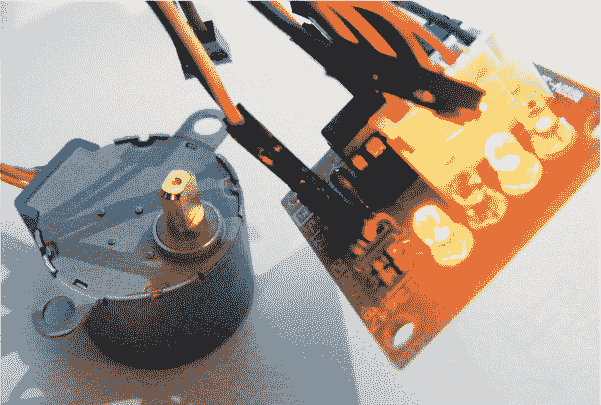

步进电机的数据表将说明其每转一圈执行的步数；*步进*只是一次旋转中的一个运动。一个每转 200 步的电机将通过 200 步旋转 360 度，每步为 1.8 度。步进电机内有两个互锁的盘片，类似于齿轮，齿部具有相反的磁性，交替连接到中心轴或转子上。当电流送入电机的*线圈*时——这些线圈是当施加电压时成为电磁铁的一系列电线——电磁铁吸引或排斥齿轮状的盘片，从而旋转轴。

你可以通过命令电机移动到并保持在这些步进中的一个位置，来控制电机的位置和速度。由于我们知道每一步代表的角度，因此可以获得准确的转动角度和距离测量。步进电机常用于 CD 和 DVD 播放器以及 3D 打印机中，这些设备需要非常精确的运动。

当你准备购买步进电机时，有几个因素需要考虑。第一个是它是否有齿轮箱。齿轮箱可以提高*扭矩*（移动力），但会降低*每分钟转速*（RPM，即速度）。

接下来的考虑是步进电机是双极性还是单极性。*双极性*电机会改变线圈的极性。极性是电流流动的方向；例如，如果我们反转 5V 和 GND 连接，电机将朝相反的方向转动。双极性电机的线圈较简单，但需要更复杂的驱动器，因为它们为我们反转极性。*单极性*电机基本上是为每个极性配备一个线圈，但可以使用更简单的驱动器。你可以通过查看连接方式来检查电机是双极性还是单极性：双极性电机有四个连接，而单极性电机有五到八个连接。在这个项目中，我们使用的是单极性电机——28BYJ-48 步进电机配合 ULN2003 驱动器测试模块——这是一个使得通过 Arduino 控制电机变得简单的板，就像项目 4 中的 LED 矩阵模块板一样。一些驱动板的设置可能会有所不同，因此我建议在这个项目中使用此处列出的电机型号，以便能够紧密按照说明进行操作。

转动电位器改变步进电机臂的角度，因此当你将电位器向左或向右移动时，步进电机臂将跟随你的输入。（*电位器*是一个带旋钮的可变电阻器。）当你转动旋钮时，电位器的电阻值发生变化。它们通常用于电器设备中，如音频设备的音量控制。

### 构建

1.  将步进电机连接到驱动板，如图 11-2 所示。从板外侧的最外层引脚到板中央的最内层引脚，按照以下顺序连接电机的线缆：蓝色、粉色、黄色、橙色、红色。连接器只能以这种方式插入。

    **图 11-2：** 将步进电机连接到驱动板

    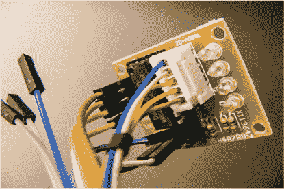

1.  将驱动板的引脚 1、2、3 和 4 直接连接到 Arduino 的引脚 8、9、10 和 11。

    | **步进电机驱动板** | **Arduino** |
    | --- | --- |
    | IN1 | 引脚 8 |
    | IN2 | 引脚 9 |
    | IN3 | 引脚 10 |
    | IN4 | 引脚 11 |
    | GND | GND |
    | +5V | +5V |

1.  在面包板上插入一个电位器，将其中间引脚连接到 Arduino A0，引脚两端连接到 Arduino +5V 和 GND，顺序可以任意。

    | **电位器** | **Arduino** |
    | --- | --- |
    | 左侧引脚 | GND |
    | 中间引脚 | A0 |
    | 右侧引脚 | +5V |

1.  将驱动板的 GND 和 +5V 分别连接到面包板的 GND 和 +5V，并将面包板的轨道连接到 Arduino。别忘了也要将面包板的电源轨连接到 GND 和 +5V。

1.  确保你的设置与图 11-3 中显示的最终配置相匹配，并上传下面的代码“程序代码”。

    **图 11-3：** 步进电机的电路图

    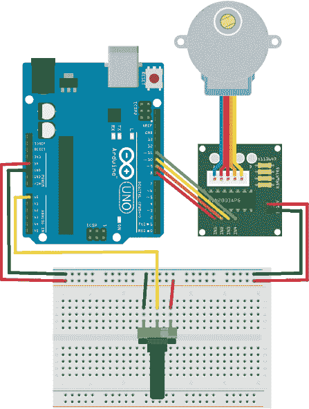

### 程序代码

这段代码是 Arduino IDE 自带的，可以在“文件 ▸ 示例 ▸ 步进电机 ▸ MotorKnob”中找到。我在这里复制了它，你在 IDE 中会看到这段代码。它使用了内置的步进电机库 `<Stepper.h>`。电位器连接到 Arduino A0 引脚，并根据电位器的旋转提供一个可变电压，进而控制步进电机的位置。

/* MotorKnob

* [`www.arduino.cc/en/Reference/Stepper`](http://www.arduino.cc/en/Reference/Stepper)

* 此示例代码属于公有领域。

*/

#include <Stepper.h>

// 将此值更改为你电机的步数

#define STEPS 100

// 创建步进电机类的实例，并指定

// 电机的步数和它所连接的引脚

Stepper stepper(STEPS, 8, 10, 9, 11);

// 来自模拟输入的前一个读数

int previous = 0;

void setup() {

// 设置电机的速度为 700 RPM

stepper.setSpeed(30);

}

void loop() {

// 获取传感器值

int val = analogRead(0);

// 移动的步数等于传感器读数的变化值

stepper.step(val - previous);

// 记住传感器的前一个值

previous = val;

}

### 故障排除

**问：** *代码编译成功，但步进电机不转动。*

• 当你为电机供电时，驱动电机板上的指示灯应该会闪烁。如果没有闪烁，说明电源有问题，请检查你的设置是否与图 11-3 中的电路图匹配。确保步进电机的连接牢固插入到驱动电机板中，它只能以一种方式插入。

• 如果驱动板的灯亮起但电机不动，请检查电位器的连接是否牢固，并确保与前面的表格匹配。

## 温控风扇**

在这个项目中，我们将使用 LM35 温度传感器，当温度过高时自动开启风扇。

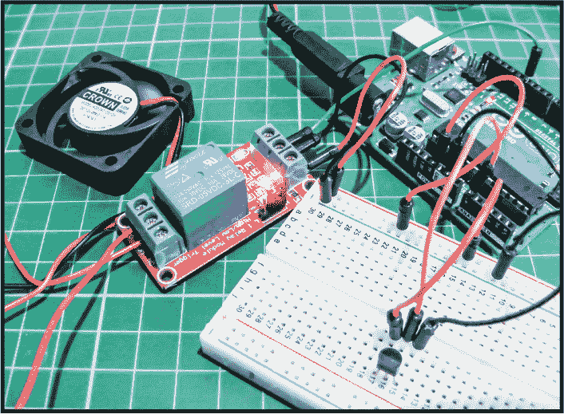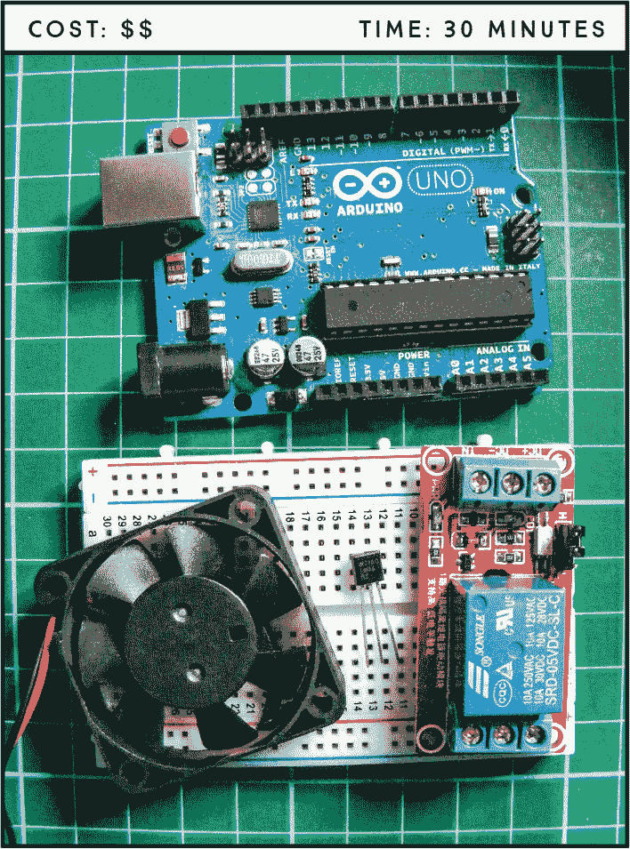

**所需部件**

**Arduino 主板**

**面包板**

**跳线**

**LM35 温度传感器**

**5V 单通道继电器模块**

**12V 小型计算机散热风扇**

**9V 电池夹和电池**

### 工作原理

LM35 温度传感器（如图 12-1 所示）能够感测温度，并将该测量值以电压形式发送到 Arduino。Arduino 将该电压值转换为摄氏温度，再将该值转换为华氏温度。当温度高于 71 华氏度时，Arduino 向继电器发送电源，继电器开启计算机风扇。

**图 12-1：** LM35 温度传感器：左引脚为 +5V，中间为数据输出，右引脚为 GND。

计算机风扇所需的功率超过了 Arduino 能提供的功率，因此我们需要为其提供独立的电源：一个 9V 电池。这个电路由*电子继电器*控制——一种电子操作的开关，在本例中使用电磁铁机械性地打开或关闭电路（如图 12-2 所示）。继电器通常在需要用低功率设备开关高电压设备时使用。我们的继电器通过 5 伏电源供电，用于操作机械开关。在这个项目中，电路的电压为 9 伏，但该继电器可以控制高达 240 伏的电路。然而，增加高电压电路可能非常危险，因此只有在你熟悉电气工作或能寻求专业建议时，才应进行此操作。

**图 12-2：** 一个 5V 单通道继电器

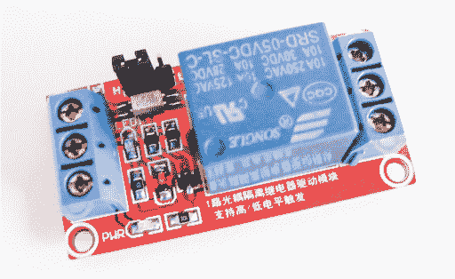

### 构建步骤

1.  将 LM35 传感器插入面包板，传感器的前面（印有文字的平面）朝向你。将左引脚连接到面包板上的 +5V 导轨，中间引脚连接到 Arduino 的 A0 引脚，右引脚连接到 GND 导轨，具体连接方式见下表。

    | **LM35 传感器** | **Arduino** |
    | --- | --- |
    | 左引脚 | +5V |
    | 中间引脚 | A0 |
    | 右引脚 | GND |

1.  继电器上有多个连接，如图 12-3 所示。如果你的继电器模块布局不同，请根据数据表或模块上的引脚标记调整接线。我们的继电器有一个标记为 PWR 的 LED，表示它正在接收电源，还有另一个 LED 显示电磁开关是否开启（你通常也能听到它发出令人满意的“咔嗒”声）。继电器可以在触发时设置为`HIGH`或`LOW`，这可以通过小跳线开关或引脚进行设置。对于我们的项目，确保跳线设置为`HIGH`，这样当继电器被触发时，它就会发送电源。

    **图 12-3：** 继电器连接（你的继电器引脚可能不同，因此请遵循提供的数据表）

    

1.  如图 12-3 所示，继电器模块右侧的引脚分别是信号、GND 和 +5V。将继电器的信号引脚连接到 Arduino 引脚 5，GND 连接到 Arduino 的 GND，引脚 +5V 通过面包板的电源轨连接到 Arduino 的电源。

    | **5V 继电器** | **Arduino** |
    | --- | --- |
    | 信号 | 引脚 5 |
    | GND | GND |
    | +5V | +5V |

1.  在继电器模块的左侧是电磁开关的连接（图 12-3）。中间引脚是公共连接；左侧引脚标有 NO，表示*常开*，意味着电路是断开的，默认状态是关闭的；右侧引脚标有 NC，表示*常闭*，默认状态是开启的。如果继电器没有切换，公共引脚将连接到 NC 引脚。如果继电器切换，公共引脚将连接到 NO 引脚。由于我们希望电路在使用开关之前保持关闭状态，所以我们将使用 NO 引脚。

1.  接下来，将风扇的黑色 GND 线连接到 9V 电池的 GND 线。然后，按照下表所示，将风扇的红色正极线连接到继电器的公共引脚，并将 9V 电池的正极线连接到继电器的 NO 引脚。

    | **5V 继电器** | **风扇/9V 电池** |
    | --- | --- |
    | NO（常开） | 9V 电池的正极 |
    | 公共 | 风扇正极线 |
    | NC（常闭） | 未连接 |

1.  将面包板的电源轨连接到彼此，并连接到 Arduino 的 GND 和 +5V 引脚。

1.  确保你的设置与图 12-4 中的电路图一致，然后上传第 103 页中的“The Sketch”代码。

    **图 12-4：** 温控风扇的电路图

    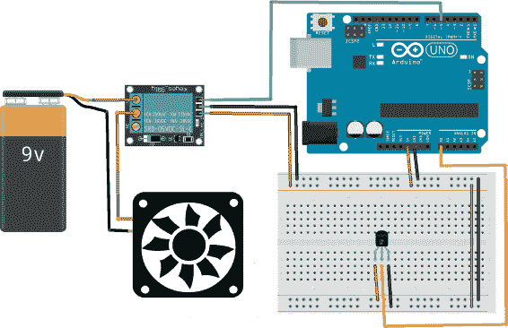

### The Sketch

在此草图中，我们首先将 LM35 的传感器引脚设置为 Arduino 的 A0，将风扇定义为引脚 5，并创建一个变量来读取 LM35 的值。然后，我们创建一个变量来存储温度，并将风扇引脚设置为输出。一个小的计算将传感器的电压读数转换为华氏度的温度值。接着，我们启动串口监视器，这样你就可以看到 Arduino 连接到 PC 时的 LM35 读数值，这对于确保传感器正常工作非常有用。一个循环每秒读取传感器，如果温度达到 71 华氏度，电源会传送到风扇引脚，继电器触发并打开风扇。如果温度降到 71 以下，继电器会关闭风扇。

#define SENS_PIN A0 // 将 A0 引脚定义为“传感器”

#define FAN_PIN 5

int Vin; // 从 Arduino 引脚读取值

float Temperature; // 接收转换后的电压值并转换为温度

float TF; // 接收转换后的 °F 值

void setup() {

pinMode(FAN_PIN, OUTPUT); // 将风扇引脚设置为输出

Serial.begin(9600); // 启动串口监视器

}

void loop() {

// 告诉 Arduino 读取引脚并将值存储在 Vin 中

Vin = analogRead(SENS_PIN);

// 将电压值转换为温度并

// 将值存储在温度（°F）中

温度 = (500 * Vin) / 1023 * (1.8) + 32;

TF = 温度;

Serial.print("Temperature: "); // 向显示屏发送文本

Serial.print(TF); // 在串口监视器中显示温度值

Serial.println(" F"); // 写入 F，表示温度单位为华氏度

if (TF > 71) { // 如果温度超过 71 度

digitalWrite(FAN_PIN, HIGH); // 打开风扇

}

else if (TF < 71) {

digitalWrite(FAN_PIN, LOW); // 或者保持风扇关闭

}

delay(1000); // 等待一秒钟以再次读取引脚

}

### 故障排除

**问：** *风扇在预期的时间没有开启。*

• 确保 LM35 的连接与本章中的表格以及图 12-4 中的电路图匹配。将 Arduino 连接到计算机，并打开 IDE 串口监视器检查 Arduino 是否正确读取传感器。如果读取结果不正确，请重新检查接线或更换传感器。

• 请记住，您的继电器可能与这里使用的继电器不同，因此连接顺序可能会有所不同；根据您的继电器和数据表调整接线。

• 这里使用的风扇需要 9 到 12 伏特的电压，因此 9V 电池有足够的电力来驱动它。如果使用的是需要更高电压的风扇，则需要根据风扇的电压要求，使用更强大的电池来匹配其电压输入。
