# 第五章：LCD 显示屏

## 超声波测距仪**

在这个项目中，我们将制作一个简单的超声波测距仪，屏幕上将显示物体距离传感器最多 5 米的距离。

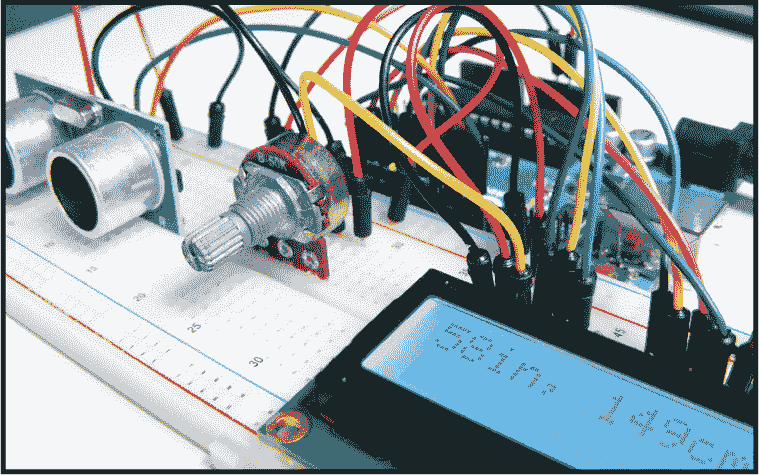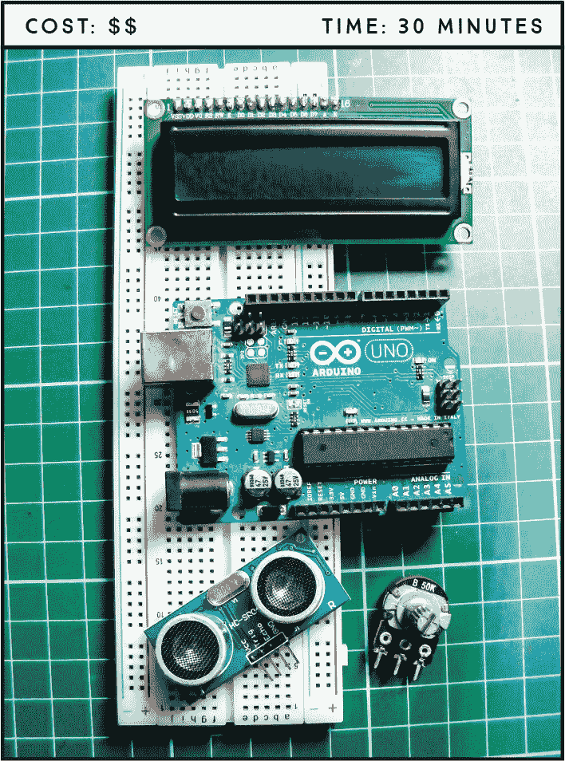

**所需零件**

**Arduino 开发板**

**面包板**

**跳线**

**HD44780 16x2 LCD 屏幕**

**HC-SR04 超声波传感器**

**50k-欧姆电位器**

**所需库**

**LiquidCrystal**

### 工作原理

超声波测距仪发出一阵超声波，并监听从物体反射回来的回声。Arduino 在触发引脚上发送短脉冲来发射超声波，然后通过 `pulseIn` 函数监听回声引脚上的脉冲。

发送和接收脉冲之间的时间等于超声波到达物体并返回传感器的时间。Arduino 将此时间转换为距离并显示在 LCD 屏幕上。你可以从 “零售商列表” 中找到 HC-SR04 模块（图 13-1），或者你也可以在线搜索 *HC-SR04 超声波模块*。

**图 13-1：** HC-SR04 超声波传感器

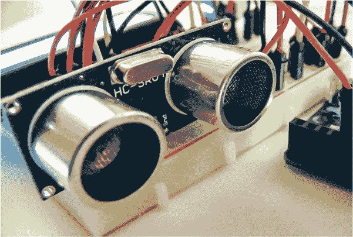

LCD（液晶显示屏）由两片偏振材料和其中的液晶溶液组成。通过液晶溶液的电流使屏幕变得不透明，因此，通过控制电流通过屏幕的区域，Arduino 就能在屏幕上创建图像或字符。在使用 Arduino 时，你需要一个与 Hitachi HD44780 驱动器兼容的 LCD 屏幕；市面上有很多此类屏幕，通常可以通过其 16 引脚接口来识别。我们将使用 LiquidCrystal 库将字符发送到 LCD 屏幕（如果需要复习库的内容，请参考入门指南）。LiquidCrystal 库将字符映射并使用 `print` 命令将消息发送到屏幕。

### 准备 LCD 屏幕

LCD 屏幕可能需要一些组装。你的屏幕应该带有 16 个孔，如 图 13-2 所示，并且有一条单独的排针。将一排 16 个针脚从排针条上断开。将短的一侧插入 LCD 屏幕的 16 个孔中。你需要将这些针脚焊接到位；如果需要指导，入门指南中有一个快速焊接指南。首先焊接最右边和最左边的针脚，固定排针后等一下让其凝固。然后逐个焊接每个针脚。将电烙铁长时间停留在针脚上会损坏它们，因此焊接时只需要几秒钟。

**图 13-2：** 16×2 LCD 屏幕

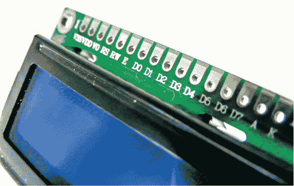

### 组装过程

1.  将 LCD 屏幕放置在面包板上，将引脚插入面包板孔中。同时将电位器放入面包板，并使用跳线将 LCD 屏幕、Arduino 和电位器连接，如下表所示。LCD 屏幕的引脚应有标签或编号，无论是在背面还是正面。如果没有，通常从左侧开始编号，沿顶部排列时引脚从 1 开始。LCD 屏幕与 Arduino GND 之间有多个连接，因此请使用面包板的地轨与 Arduino 的 GND 引脚进行多次连接。

    |  **LCD 屏幕**  | **ARDUINO** |
    | --- | --- |
    | 1 VSS | GND |
    | 2 VDD | +5V |
    | 3 VO 对比度 | 电位器中间引脚 |
    | 4 RS | 引脚 11 |
    | 5 R/W | 引脚 10 |
    | 6 使能 | 引脚 9 |
    | 7 D0 | 无连接 |
    | 8 D1 | 无连接 |
    | 9 D2 | 无连接 |
    | 10 D3 | 无连接 |
    | 11 D4 | 引脚 7 |
    | 12 D5 | 引脚 6 |
    | 13 D6 | 引脚 5 |
    | 14 D7 | 引脚 4 |
    | 15 A BcL+ | +5V |
    | 16 K BcL– | GND |

1.  你应该已经将 50kohm 电位器的中间引脚连接到 LCD 的引脚 3（VO）。现在将电位器的一个外部引脚连接到 GND，另一个连接到+5V。旋转电位器来调节 LCD 屏幕的对比度。

1.  背光 LCD 屏幕内置了电阻器，但如果你使用的是非背光 LCD 屏幕，请在 LCD 15 和+5V 之间插入一个 220 欧姆的电阻。如果不确定，请查看屏幕的数据手册。

1.  将超声波传感器模块添加到面包板，将 VCC 连接到+5V，Trig 连接到 Arduino 引脚 13，Echo 连接到 Arduino 引脚 12，GND 连接到 GND，如下表所示。

    | **超声波传感器** | **ARDUINO** |
    | --- | --- |
    | VCC | +5V |
    | Trig | 引脚 13 |
    | Echo | 引脚 12 |
    | GND | GND |

1.  将面包板的电源轨连接到 Arduino 的+5V 和 GND。

1.  检查你的设置是否与图 13-3 中的电路图一致，并上传“草图”中的代码，该代码位于 112 页。

    **图 13-3：** 超声波测距仪的电路图

    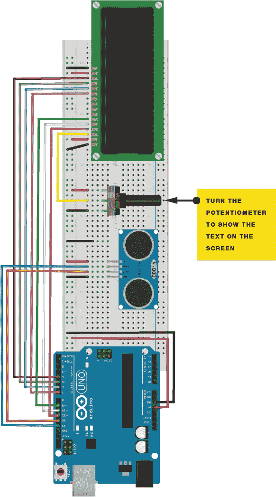

### 草图

草图首先调用 LiquidCrystal 库，并定义连接到 Arduino 的 LCD 引脚。Arduino 的引脚 13 连接到传感器的触发引脚，发送超声波信号，Arduino 的引脚 12 连接到传感器的回波引脚，接收返回信号。Arduino 将发送和接收信号之间的时间转换为距离，并将结果显示在 LCD 屏幕上，单位为英寸和厘米。此草图可以在 Arduino 网站上找到，因此我已按原样复制在这里。

/*

2008 年 11 月 3 日，由 David A. Mellis 创建；

2011 年 8 月 30 日，Tom Igoe 修改

本示例代码属于公共领域。

*/

#include <LiquidCrystal.h>

LiquidCrystal lcd(11, 10, 9, 7, 6, 5, 4);

int pingPin = 13;

int inPin = 12;

void setup() {

lcd.begin(16, 2);

lcd.print("testing...");

}

void loop() {

// 为 ping 的持续时间建立变量，

// 和距离结果（以英寸和厘米为单位）：

// 长时间的持续时间、英寸、厘米；

// PING))) 通过一个 2 毫秒或更长的高脉冲触发

// 预先发送一个短暂的低脉冲，以确保清晰的高脉冲：

pinMode(pingPin, OUTPUT);

digitalWrite(pingPin, LOW);

delayMicroseconds(2);

digitalWrite(pingPin, HIGH);

delayMicroseconds(10);

digitalWrite(pingPin, LOW);

// 使用相同的引脚读取 PING))) 信号：

// 高脉冲，其持续时间为时间（以微秒为单位）

// 从发送 ping 信号到接收到其回声的时间

// 物体的距离。

pinMode(inPin, INPUT);

duration = pulseIn(inPin, HIGH);

// 将时间转换为距离

inches = microsecondsToInches(duration);

cm = microsecondsToCentimeters(duration);

lcd.clear();

lcd.setCursor(0, 0);

lcd.print(inches);

lcd.print("in, ");

lcd.print(cm);

lcd.print("cm");

delay(100);

}

long microsecondsToInches(long microseconds) {

// 根据 Parallax 的 PING))) 数据表，

// 声音速度是 1130 英尺/秒，即每英寸 73.746 毫秒。

// 这给出了 ping 信号行进的距离，来回，

// 并返回，因此需要除以 2 来得到障碍物的距离。

return microseconds / 74 / 2;

}

long microsecondsToCentimeters(long microseconds) {

// 声音速度是 340 米/秒，或每厘米 29 毫秒。

// Ping 信号发射出去并返回，所以要找出距离

// 物体的距离，取行进距离的一半。

return microseconds / 29 / 2;

}

### 故障排除

**问：** *LCD 屏幕上没有显示任何内容。*

• 确保你已经将电源连接到面包板的电源轨，并且连接与之前给出的表格匹配。

• 调整可调电阻的旋钮，改变屏幕的对比度，直到看到文本为止。

• 如果屏幕上显示的是乱码信息，说明你没有正确连接电线；请重新检查你的接线，参考 图 13-3。

## **数字温度计**

这个项目将添加一个 LM35 温度传感器到 LCD 屏幕和 Arduino 上，给你一个数字温度计。

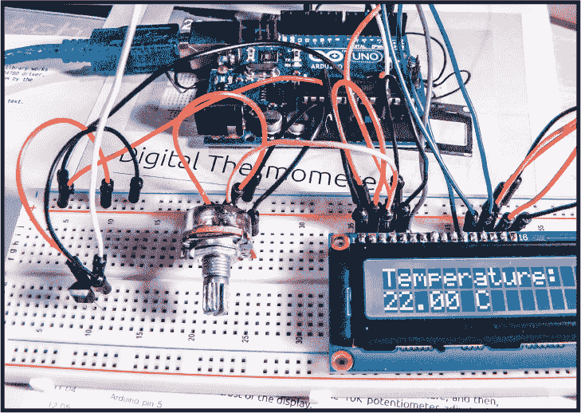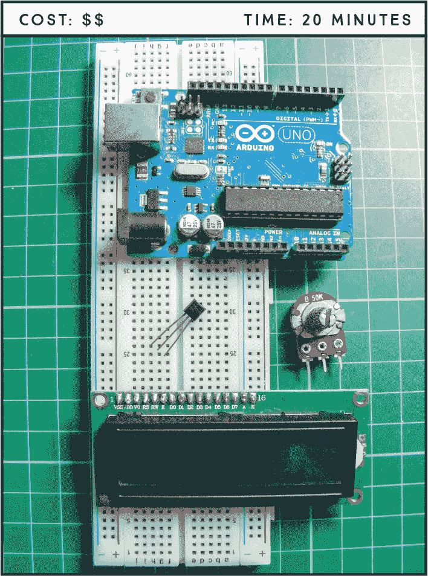

**所需零件**

**Arduino 板**

**面包板**

**跳线**

**HD44780 16×2 LCD 屏幕**

**LM35 温度传感器**

**50k-欧姆可调电阻**

**所需库**

**LiquidCrystal**

### 工作原理

Arduino 从我们在第 12 个项目中使用的相同 LM35 温度传感器读取电压，并将该值转换为摄氏度温度。然后，草图通过将该值乘以 9，结果除以 5，再加上 32 来转换为华氏度。LiquidCrystal 库通过使用 `lcd.print` 命令在 LCD 屏幕上显示温度，完成了所有的繁重工作。这个项目可以很容易地添加更多传感器，变成一个全功能的天气中心。

### 构建

首先，按照 第 109 页上 “准备 LCD 屏幕” 的说明准备 LCD 屏幕。然后按照以下步骤操作：

1.  将 LCD 屏幕和电位器插入面包板，然后使用面包板和跳线按下表所示的方式连接 LCD 屏幕。

    | **LCD 屏幕** | **Arduino** |
    | --- | --- |
    | 1 VSS | GND |
    | 2 VDD | +5V |
    | 3 VO 对比度 | 电位器中间引脚 |
    | 4 RS | 引脚 12 |
    | 5 R/W | GND |
    | 6 使能 | 引脚 11 |
    | 7 D0 | 无连接 |
    | 8 D1 | 无连接 |
    | 9 D2 | 无连接 |
    | 10 D3 | 无连接 |
    | 11 D4 | 引脚 5 |
    | 12 D5 | 引脚 4 |
    | 13 D6 | 引脚 3 |
    | 14 D7 | 引脚 2 |
    | 15 A BcL+ | +5V |
    | 16 K BcL– | GND |

1.  将 GND 和 +5V 电源轨连接到 Arduino 的 GND 和 +5V。

1.  你应该已经将 50kΩ 电位器的中间引脚连接到 LCD 的引脚 3（VO）。现在将其中一个外部引脚连接到 GND，另一个连接到 +5V。

1.  将 LM35 温度传感器的中间引脚连接到 Arduino 的 A0，引脚左侧连接到 +5V 电源轨，右侧连接到 GND 电源轨，如下表所示。

    | **LM35 传感器** | **Arduino** |
    | --- | --- |
    | 左侧 | +5V |
    | 中间 | A0 |
    | 右侧 | GND |

1.  确保你的设置与图 14-2 中显示的电路图匹配，并上传在 第 118 页 的“程序代码”。

    **图 14-1：** 数字温度计的电路图

    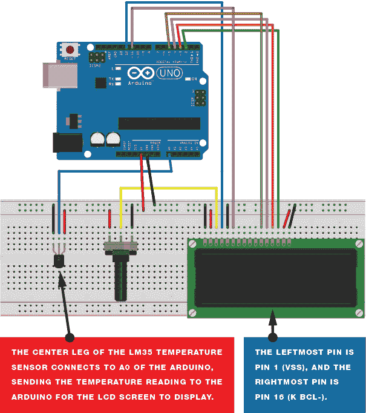

### 程序代码

此程序使用 LiquidCrystal 库根据 LM35 传感器检测到的值在屏幕上显示结果。LM35 传感器向 Arduino 的 A0 引脚发送读取值，该值以电压形式读取。程序将电压值转换为摄氏温度，然后使用一系列计算将最终结果以华氏温标显示。程序每秒更新并显示温度值。

#include <LiquidCrystal.h> // 调用 LCD 库

#define sensor A0 // 连接到 LM35 传感器的引脚（A0）

int Vin; // 从 Arduino 引脚读取的值

float Temperature; // 接收转换后的温度电压值

float TF; // 接收转换后的华氏温度值（°F）

LiquidCrystal lcd(12, 11, 5, 4, 3, 2); // LCD 连接引脚

void setup() {

lcd.begin(16, 2); // 显示屏为 16x2

lcd.print("Temperature: "); // 将文字发送到 LCD 屏幕

}

void loop() {

// 读取 A0 引脚并存储值到 Vin

Vin = analogRead (sensor);

// 将电压值转换为温度，并

// 存储温度值（单位：°C）

Temperature = (500 * Vin) / 1023;

TF = ((9 * Temperature) / 5) + 32; // 将摄氏度转换为华氏度

lcd.setCursor(0, 1); // 将光标移到 LCD 的下一行

lcd.print(TF); // 在 LCD 屏幕上显示温度

lcd.print(" F"); // 在显示器上写入 F，表示华氏温标

delay(1000); // 等待一秒钟再读取引脚

}

### 故障排除

**问：** *LCD 屏幕上没有显示任何内容。*

• 确保你已经将电源连接到面包板电源轨，并且连接符合前面给出的表格。

• 调整电位器以改变屏幕的对比度，直到显示出文字。

• 如果屏幕上显示乱码，可能是接线不正确；请根据图 14-2 重新检查接线。

• 如果显示的值看起来太高，确保 LM35 传感器已牢固插入面包板，并稍等片刻让读数稳定。

## 炸弹解码器游戏**

在这个项目中，我们将构建一个破解炸弹解码的游戏。我们将使用 LCD 屏幕和键盘为玩家提供指令并接受输入。

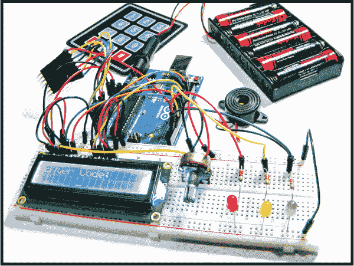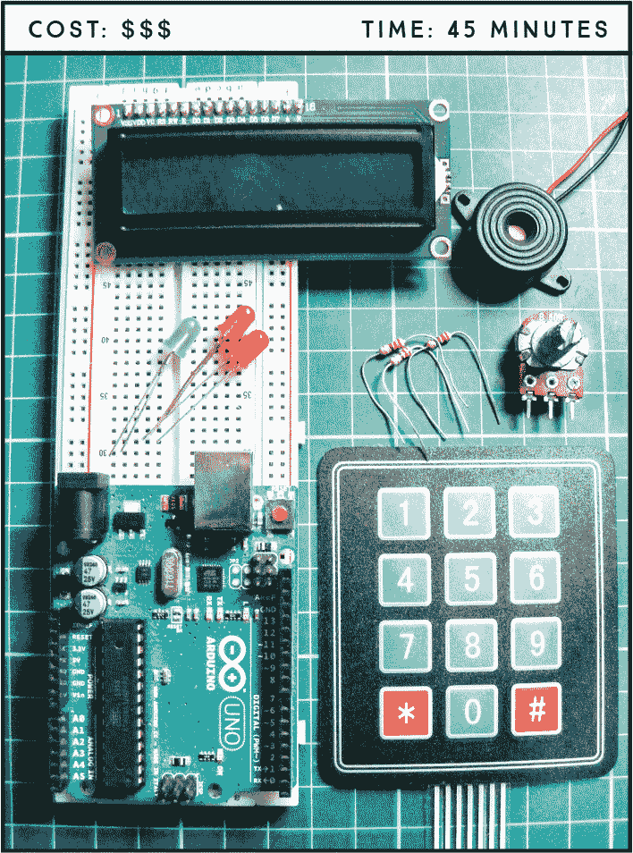

**所需零件**

**Arduino 板**

**面包板**

**跳线**

**HD44780 16×2 LCD 屏幕**

**10k 欧姆电位器**

**蜂鸣器**

**3×4 薄膜键盘**

**3 个 220 欧姆电阻**

**红色 LED**

**黄色 LED**

**绿色 LED**

**所需库**

**LiquidCrystal**

**键盘**

**音调**

### 工作原理

当你给 Arduino 上电时，一个玩家输入四位数字代码启动炸弹计时器。然后他们将计时器交给另一个玩家，后者按 * 键开始解码炸弹——这个玩家（“拆弹员”）必须破解第一个玩家输入的代码，及时拆除炸弹。如果拆弹员按错了键，可以按 # 键删除输入并重新开始。如果输入错误的代码或计时器归零，炸弹将爆炸，游戏失败。

在游戏过程中，黄色 LED 会闪烁，蜂鸣器与倒计时同步发出声音。LCD 屏幕显示倒计时和代码输入。当炸弹引爆时，所有 LED 会闪烁，蜂鸣器发出爆炸声。

进一步推进这个游戏的一个好方法是向拆弹员提四个问题，每个问题为拆弹员提供炸弹代码的一位数字。拆弹员有固定时间来回答问题并输入四位数的代码。如果回答错误或超时，炸弹就会爆炸！

### 构建

1.  如果需要，按 “准备 LCD 屏幕” 中的说明，使用焊接头引脚准备 LCD 屏幕，见 第 109 页。

1.  将 LCD 屏幕放置在面包板上，将焊接头引脚插入面包板孔中。还将电位器放置在面包板上，并使用面包板和跳线将 LCD 屏幕、Arduino 和电位器连接起来，如下表所示。有多个 GND 连接点，因此请使用面包板导轨将这些连接到 Arduino GND 引脚。

    | **LCD 屏幕** | **ARDUINO** |
    | --- | --- |
    | 1 VSS | GND |
    | 2 VDD | +5V |
    | 3 VO 对比 | 电位器中间引脚 |
    | 4 RS | 引脚 7 |
    | 5 R/W | GND |
    | 6 Enable | 引脚 8 |
    | 7 D0 | 无连接 |
    |  8 D1  | 无连接 |
    | 9 D2 | 无连接 |
    | 10 D3 | 无连接 |
    | 11 D4 | 引脚 10 |
    | 12 D5 | 引脚 11 |
    | 13 D6 | 引脚 12 |
    | 14 D7 | 引脚 13 |
    | 15 A BcL+ | +5V |
    | 16 K BcL– | GND |

1.  你应该已经将 10k 欧姆电位器的中间引脚连接到 LCD 引脚 3（VO）。现在将外侧的一个引脚连接到 GND，另一个引脚连接到 +5V，如图 15-1 所示。这控制 LCD 屏幕的对比度。

    **图 15-1：** 电位器控制 LCD 屏幕的对比度。

    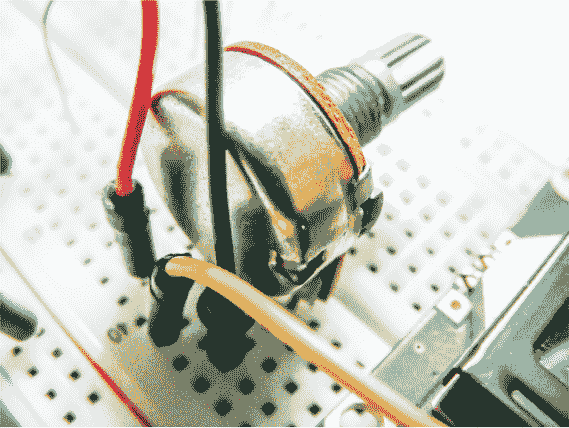

1.  从正面看键盘，如图 15-2 所示，按键引脚从左到右编号为 1–7。按照以下表格连接键盘引脚。

    **图 15-2：** 具有七个引脚连接的 3×4 数字键盘

    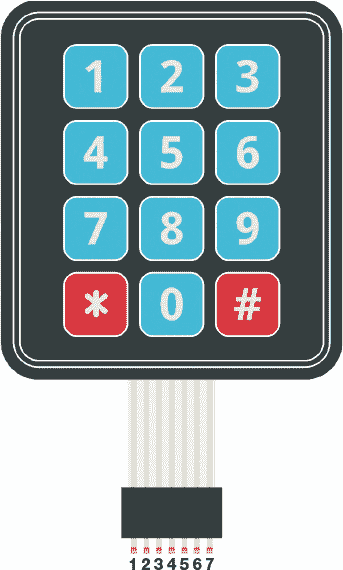

    | **键盘** | **ARDUINO** |
    | --- | --- |
    | 引脚 1 | 引脚 5 |
    | 引脚 2 | 引脚 A5 |
    | 引脚 3 | 引脚 A4 |
    | 引脚 4 | 引脚 A2 |
    | 引脚 5 | 引脚 A1 |
    | 引脚 6 | 引脚 A0 |
    | 引脚 7 | 引脚 A3 |

1.  将蜂鸣器的红色电线直接连接到 Arduino 引脚 9，黑色电线连接到 Arduino GND。

    | **蜂鸣器** | **ARDUINO** |
    | --- | --- |
    | 红色电线 | 引脚 9 |
    | 黑色电线 | GND |

1.  将绿色 LED 放置在面包板上，短的负极腿通过 220 欧姆电阻连接到负电源轨。将绿色 LED 的长正极腿连接到引脚 2。同样，将黄色 LED 连接到引脚 3，将红色 LED 连接到引脚 4，如图 15-3 所示，以及下面的表格。

    **图 15-3：** 通过 220 欧姆电阻将 LED 连接到 Arduino。

    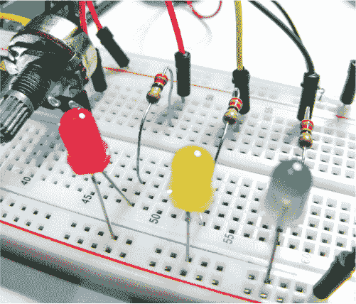

    | **LED** | **ARDUINO** |
    | --- | --- |
    | 负极腿 | GND |
    | 绿色正极 | 通过 220 欧姆电阻连接至引脚 2 |
    | 黄色正极 | 通过 220 欧姆电阻连接至引脚 3 |
    | 红色正极 | 通过 220 欧姆电阻连接至引脚 4 |

1.  将面包板上的正负电源轨分别连接到 +5V 和 GND。

1.  确保你的完成项目电路与图 15-4 相匹配，记得将所需的库添加到你的 *库* 文件夹中，然后上传“草图”中的代码，代码位于第 127 页。

    **图 15-4：** 炸弹解码游戏的电路图

    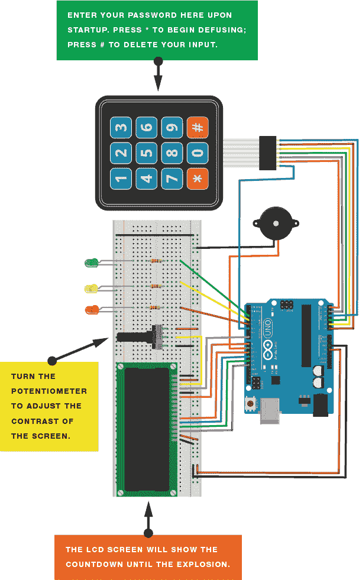

### 玩游戏

图 15-5 展示了游戏不同阶段的过程。

**图 15-5：** 玩游戏

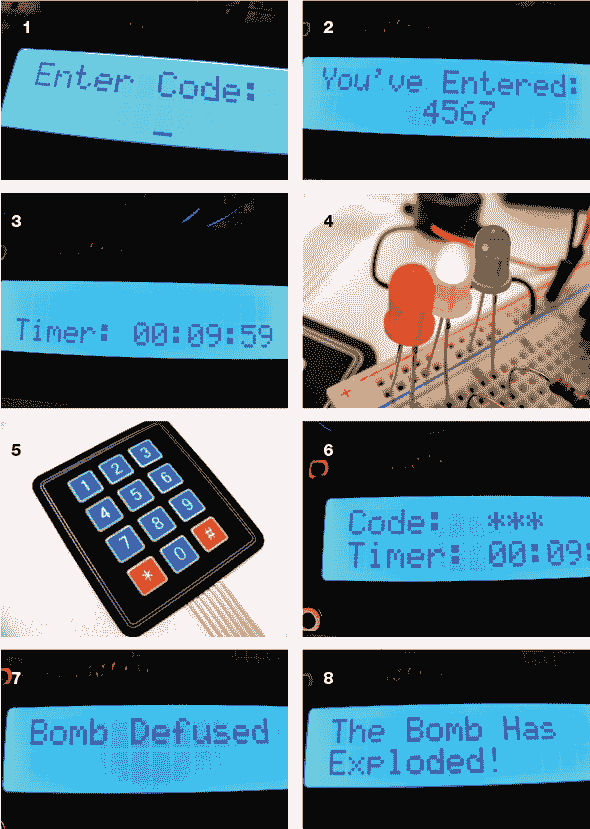

1.  输入代码以设置炸弹。

1.  炸弹确认输入的代码。

1.  定时器开始倒计时。

1.  黄色 LED 随着倒计时闪烁。

1.  将键盘交给另一个玩家（解码员）。他们按下键盘上的 * 按钮，然后输入解除炸弹的代码。

1.  屏幕不显示输入的数字来解除炸弹。

1.  如果输入正确的代码，炸弹解除 . . .

1.  . . . 但是如果没有 . . . 爆炸！

**注意**

*所有库和代码可以从* [`www.nostarch.com/arduinohandbook2/`](https://www.nostarch.com/arduinohandbook2/) *下载*。

### 草图

草图调用了 Keypad、LiquidCrystal 和 Tone 库。LiquidCrystal 库已经包含在你的 IDE 中，但你需要从书本的资源中下载 Keypad 和 Tone 库，地址是*[`www.nostarch.com/arduinohandbook2/`](https://www.nostarch.com/arduinohandbook2/)*，并将它们保存到你的 Arduino 的*Libraries*文件夹中（如果不确定如何操作，请参考入门指南）。

首先，草图定义了定时器持续时间、密码长度、LED 引脚和键盘。它通过显示“输入代码：”来请求第一个玩家输入代码，然后将该值存储为拆弹代码。当第二个玩家（拆弹者）按下*时，定时器开始并等待输入代码，同时黄色 LED 与倒计时同步闪烁。如果拆弹者输入的代码与拆弹代码不匹配，屏幕上会显示“炸弹已爆炸！”的文字，LED 和蜂鸣器会指示爆炸。如果拆弹者输入正确，定时器停止，绿色 LED 亮起，屏幕上会显示“炸弹已拆除”的信息。如果定时器达到零且没有输入，炸弹也会爆炸。游戏结束时，代码会重置，准备开始新一轮游戏。

// 原始代码由 Joey Meyer 和 Chase Cooley 编写

// 并得到友好的许可使用

#include <Keypad.h>

#include <LiquidCrystal.h>

#include <Tone.h>

Tone tone1;

int Scount = 10; // 设置从多少秒开始

int Mcount = 5;  // 设置从多少分钟开始

int Hcount = 0;  // 计数小时

int DefuseTimer = 0; // 将定时器设置为 0

long secMillis = 0; // 存储上次的秒数

long interval = 1000; // 秒的间隔

char password[4]; // 密码字符数

int currentLength = 0; // 当前正在输入的数字位置

int i = 0;

char entered[4];

int ledPin = 4;  // 红色 LED

int ledPin2 = 3; // 黄色 LED

int ledPin3 = 2; // 绿色 LED

// 我们在 LCD 上使用的引脚

LiquidCrystal lcd(7, 8, 10, 11, 12, 13);

const byte ROWS = 4; // 四行

const byte COLS = 3; // 三列

char keys[ROWS][COLS] = {

{'1', '2', '3'},

{'4', '5', '6'},

{'7', '8', '9'},

{'*', '0', '#'}

};

byte rowPins[ROWS] = {5, A5, A4, A2}; // 连接到行引脚

// 键盘的部分

byte colPins[COLS] = {A1, A0, A3}; // 连接到列引脚

// 键盘的部分

Keypad keypad = Keypad(makeKeymap(keys), rowPins, colPins, ROWS, COLS);

void setup() {

pinMode(ledPin, OUTPUT);  // 设置数字引脚为输出模式

pinMode(ledPin2, OUTPUT); // 设置数字引脚为输出模式

pinMode(ledPin3, OUTPUT); // 设置数字引脚为输出模式

tone1.begin(9);

lcd.begin(16, 2);

Serial.begin(9600);

lcd.clear();

lcd.setCursor(0,0);

lcd.print("输入代码：");

while (currentLength < 4) {

lcd.setCursor(currentLength + 6, 1);

lcd.cursor();

char key = keypad.getKey();

key == NO_KEY;

if (key != NO_KEY) {

if ((key != '*')&&(key != '#')) {

lcd.print(key);

password[currentLength] = key;

currentLength++;

tone1.play(NOTE_C6, 200);

}

}

}

if (currentLength == 4) {

delay(500);

lcd.noCursor();

lcd.clear();

lcd.home();

lcd.print("您输入了: ");

lcd.setCursor(6, 1);

lcd.print(password[0]);

lcd.print(password[1]);

lcd.print(password[2]);

lcd.print(password[3]);

tone1.play(NOTE_E6, 200);

delay(3000);

lcd.clear();

currentLength = 0;

}

}

void loop() {

timer();

char key2 = keypad.getKey(); // 获取按键

如果 (key2 == '*') {

lcd.clear();

lcd.setCursor(0, 0);

lcd.print("密码: ");

当 (currentLength < 4) {

timer();

char key2 = keypad.getKey();

如果 (key2 == '#') {

currentLength = 0;

lcd.clear();

lcd.setCursor(0, 0);

lcd.print("密码: ");

}

否则如果 (key2 != NO_KEY) {

lcd.setCursor(currentLength + 7, 0);

lcd.cursor();

lcd.print(key2);

entered[currentLength] = key2;

currentLength++;

tone1.play(NOTE_C6, 200);

delay(100);

lcd.noCursor();

lcd.setCursor(currentLength + 6, 0);

lcd.print("*");

lcd.setCursor(currentLength + 7, 0);

lcd.cursor();

}

}

如果 (currentLength == 4) {

如果 (entered[0] == password[0] && entered[1] == password[1] && entered[2] == password[2] &&entered[3] == password[3]) {

lcd.noCursor();

lcd.clear();

lcd.home();

lcd.print("炸弹解除");

currentLength = 0;

digitalWrite(ledPin3, HIGH);

delay(2500);

lcd.setCursor(0, 1);

lcd.print("重置炸弹");

delay(1000000);

}

否则 {

lcd.noCursor();

lcd.clear();

lcd.home();

lcd.print("密码错误！");

如果 (Hcount > 0) {

Hcount = Hcount - 1;

}

如果 (Mcount > 0) {

Mcount = Mcount - 59;

}

如果 (Scount > 0) {

Scount = Scount - 59;

}

delay(1500);

currentLength = 0;

}

}

}

}

void timer() {

Serial.print(Scount);

Serial.println();

如果 (Hcount <= 0) { // 如果计时器达到 0，LCD 显示爆炸

如果 ( Mcount < 0 ) {

lcd.noCursor();

lcd.clear();

lcd.home();

lcd.print("炸弹已 ");

lcd.setCursor(0, 1);

lcd.print("爆炸了！");

当 Mcount < 0 时 {

digitalWrite(ledPin, HIGH); // 打开 LED

tone1.play(NOTE_A2, 90);

delay(100);

digitalWrite(ledPin, LOW); // 关闭 LED

tone1.play(NOTE_A2, 90);

delay(100);

digitalWrite(ledPin2, HIGH); // 打开 LED

tone1.play(NOTE_A2, 90);

delay(100);

digitalWrite(ledPin2, LOW); // 关闭 LED

tone1.play(NOTE_A2, 90);

delay(100);

digitalWrite(ledPin3, HIGH); // 打开 LED

tone1.play(NOTE_A2, 90);

delay(100);

digitalWrite(ledPin3, LOW); // 关闭 LED

tone1.play(NOTE_A2, 90);

delay(100);

}

}

}

lcd.setCursor(0, 1); // 设置光标到第二行

lcd.print("计时器:");

如果 (Hcount >= 10) {

lcd.setCursor(7, 1);

lcd.print(Hcount);

}

如果 (Hcount < 10) {

lcd.setCursor(7, 1);

lcd.write("0");

lcd.setCursor(8, 1);

lcd.print(Hcount);

}

lcd.print(":");

如果 (Mcount >= 10) {

lcd.setCursor(10, 1);

lcd.print(Mcount);

}

如果 (Mcount < 10) {

lcd.setCursor(10, 1);

lcd.write("0");

lcd.setCursor(11, 1);

lcd.print(Mcount);

}

lcd.print (":");

如果 (Scount >= 10) {

lcd.setCursor(13, 1);

lcd.print(Scount);

}

如果 (Scount < 10) {

lcd.setCursor(13, 1);

lcd.write("0");

lcd.setCursor(14, 1);

lcd.print(Scount);

}

如果 (Hcount < 0) {

Hcount = 0;

}

如果 (Mcount < 0) {

Hcount --;

Mcount = 59;

}

如果 (Scount < 1) { // 如果是 60 执行此操作

Mcount --; // Mcount 减 1

Scount = 59; // 重置 Scount

}

if (Scount > 0) { // 执行此操作 59 次

unsigned long currentMillis = millis();

if (currentMillis - secMillis > interval) {

tone1.play(NOTE_G5, 200);

secMillis = currentMillis;

Scount --; // 给 Scount 加 1

digitalWrite(ledPin2, HIGH); // 打开 LED

delay(10); // 等待一秒

digitalWrite(ledPin2, LOW); // 关闭 LED

delay(10); // 等待一秒

}

}

}

### 故障排除

**Q.** *LCD 屏幕上没有显示任何内容。*

• 确保你已经给面包板的电源轨供电，并且连接与本章中的表格一致。

• 转动电位器来调整屏幕的对比度，直到看到文本。

• 如果屏幕上显示乱码信息，说明你没有正确连接电路；请按照图 15-4 中的电路图重新检查接线。

**Q.** *LED 没有在预期时亮起。*

• 根据图 15-4 中的电路图检查接线，确保 LED 的短腿连接到面包板的地线轨。

• 容易忘记给面包板的电源轨加电，因此确保通过跳线将面包板两侧的地线和电源轨连接到 Arduino。

• 检查你的 LED 和电阻是否牢固地插入面包板，并且它们是否对齐。

• 如果错误的 LED 亮起，你可能错误地连接了引脚号，只需要调整连接即可。

**Q.** *压电音响器没有发出声音。*

• 音响器的红色正极导线应连接到 9 号引脚，黑色接地导线应连接到 GND。如果音响器仍然没有发出声音，可以尝试换一个。

**Q.** *按下键盘时，数字不正确或没有注册。*

• 确保键盘与 Arduino 的连接完全符合图 15-4 中的电路图。

• 配置专门为本项目的 3×4 数字键盘设置，因此如果你的键盘不同，请查看数据手册，找出需要连接的引脚。

## Serial LCD 屏幕**

在本项目中，我们将使用一个 16×2 字符 LCD 屏幕和一个串行模块，创建一个只用两根线控制的串行 LCD。

**所需部件**

**Arduino 开发板**

**母对母跳线**

**HD44780 16×2 LCD 屏幕**

**串口 LCD 屏幕模块**

**所需库**

**导线**

**LiquidCrystal_I2C**

### 工作原理

LCD 屏幕在项目中非常有用，但它们占用了 Arduino 的许多引脚。这意味着如果你将它们应用到更复杂的项目中，可能会用尽引脚。幸运的是，解决方法是使用*串行*LCD 屏幕。串行 LCD 屏幕使用通信协议*I2C*（即*集成电路间通信*），与普通的 16×2 LCD 屏幕不同，它们只需要电源和两个引脚就能通过 Arduino 控制。

串口 LCD 屏幕通常以套件形式提供，需要您焊接引脚，本章稍后会讲解。您通常会分别收到 16×2 LCD 屏幕和串口模块，如图 16-1 所示。

**图 16-1：** 16×2 LCD 屏幕与串口模块

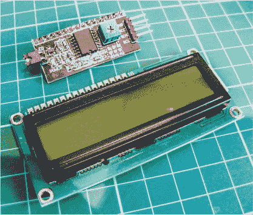

### 准备串口 LCD 屏幕

1.  串口模块一侧已附加一排 16 个引脚。翻转 LCD 屏幕，您将看到 16 个对应的孔，如图 16-2 所示。

    **图 16-2：** LCD 屏幕的反面

    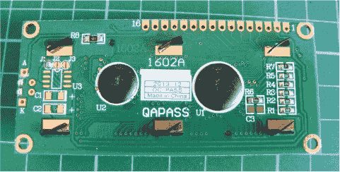

1.  将串口控制器的引脚插入这些孔中，如图 16-3 所示。

    **图 16-3：** 将串口模块插入 LCD 屏幕的孔中。

    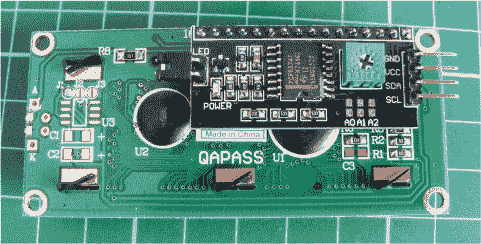

1.  小心地为每个引脚加一点焊锡，以建立连接，并将串口监视器固定在屏幕上。有关快速焊接指南，请参考前言部分。

### 构建过程

您的串口 LCD 屏幕有一个分配的地址，Arduino 需要该地址才能与之通信。不同制造商的地址不同，您需要检查您特定屏幕的地址，因为稍后在草图中需要使用该地址。要检查地址，请将 LCD 屏幕连接到您的 Arduino 并运行一个快速的扫描草图——或者您也可以参考屏幕的数据手册。

1.  将您的女性对男性跳线连接到 LCD 屏幕控制器的四个引脚上。

1.  将串口 LCD 屏幕按以下方式与 Arduino 连接：GND 对 GND，VCC 对 +5V，SDA 对 Arduino 引脚 A4，SCL 对 Arduino 引脚 A5，如下表和图 16-4 中的电路图所示。

    | **串口 LCD 屏幕** | **ARDUINO** |
    | --- | --- |
    | GND | GND |
    | VCC | +5V |
    | SDA | 引脚 A4 (SDA) |
    | SCL | 引脚 A5 (SCL) |

    **图 16-4：** 串口 LCD 屏幕的电路图

    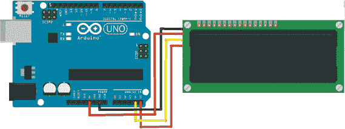

1.  上传以下草图到 Arduino。我们将得到 *十六进制* 地址，这是一种用字母和数字简化表示更大数字的数字系统。

    #include <Wire.h>

    void setup() {

    Wire.begin();

    Serial.begin(9600);

    Serial.println("I2C 扫描仪");

    }

    void loop() {

    byte error, address;

    int nDevices;

    Serial.println("扫描中...");

    nDevices = 0;

    for (address = 1; address < 127; address++) {

    Wire.beginTransmission(address);

    error = Wire.endTransmission();

    if (error == 0) {

    Serial.print("发现 I2C 设备，地址为 0x");

    if (address < 16)

    Serial.print("0");

    Serial.print(address, HEX);

    Serial.println(" !");

    nDevices++;

    }

    else if (error == 4) {

    Serial.print("地址 0x 的未知错误");

    if (address < 16)

    Serial.print("0");

    Serial.println(address, HEX);

    }

    }

    if (nDevices == 0)

    Serial.println("未找到 I2C 设备\n");

    else

    Serial.println("完成\n");

    delay(5000); // 等待 5 秒钟以进行下一次扫描

    }

该草图会扫描 Arduino 的 I2C 总线上的所有地址，并在串行监视器中显示输出，如图 16-5 所示。

**图 16-5：** 你的模块的十六进制地址将在 IDE 的串行监视器中显示。

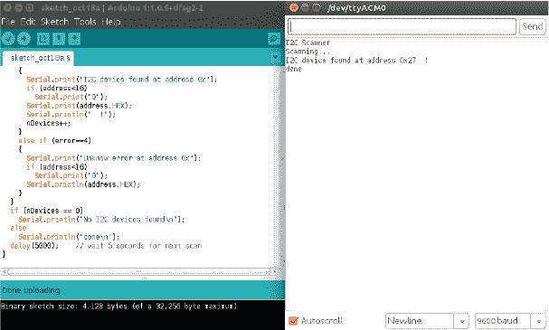

地址是紧跟在 0x 后面的数字。在我的例子中是 27，所以我需要记下 0x27。你将在最终草图中使用这个地址。

### 草图

这个草图调用了 Wire 和 LiquidCrystal_I2C 库。Wire 库已包含在 Arduino IDE 中，但你需要通过从 *[`www.nostarch.com/arduinohandbook2/`](https://www.nostarch.com/arduinohandbook2/)* 下载来安装 LiquidCrystal_I2C 库。这些库使得 Arduino 可以通过仅使用 SDA 和 SCL 引脚的串行通信来控制模块。

在➊处更改代码，将`0x27`替换为你在测试草图中扫描得到的地址。

#include <Wire.h> // 调用 Wire 库

#include <LiquidCrystal_I2C.h> // 调用 I2C 库

LiquidCrystal_I2C lcd(0x27➊,16,2); // 设置 LCD 地址为 0x27

// 16 字符和 2 行显示

void setup() {

lcd.begin(); // 初始化 LCD

lcd.backlight();

lcd.print("Arduino Handbook"); // 将消息打印到 LCD

}

void loop() { // 再次循环

}

模块内有一个电位器，用于调节 LCD 屏幕的对比度，如图 16-6 所示。用小螺丝刀小心转动这个电位器，直到屏幕的对比度合适。

**图 16-6：** 模块背面的蓝色小盒子是一个电位器，用于调节对比度。

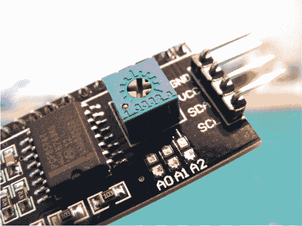

### 故障排除

**问：** *代码编译通过，但屏幕上什么也不显示。*

• 请仔细检查 SDA 和 SCL 引脚是否连接到正确的 Arduino 引脚。如果 LCD 屏幕亮起但没有显示字符，请小心地转动模块背面的微型电位器，直到字母显示出来。

• 如果屏幕仍然没有显示任何内容，并且所有连接都正确，那么可能是因为插针的焊接没有良好连接，或者你把多个引脚焊接在一起。再次用烙铁加热该区域融化焊料，然后使用吸焊器清除多余的焊料，并重新焊接插针。

## 超声波计数器

本项目教你如何使用 HC-SR04 超声波传感器来感知人们的经过，并在串行 LCD 屏幕上显示计数。

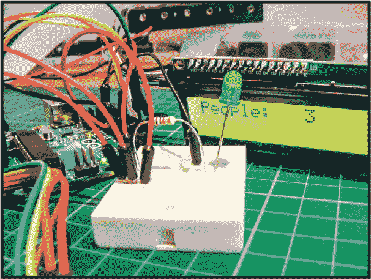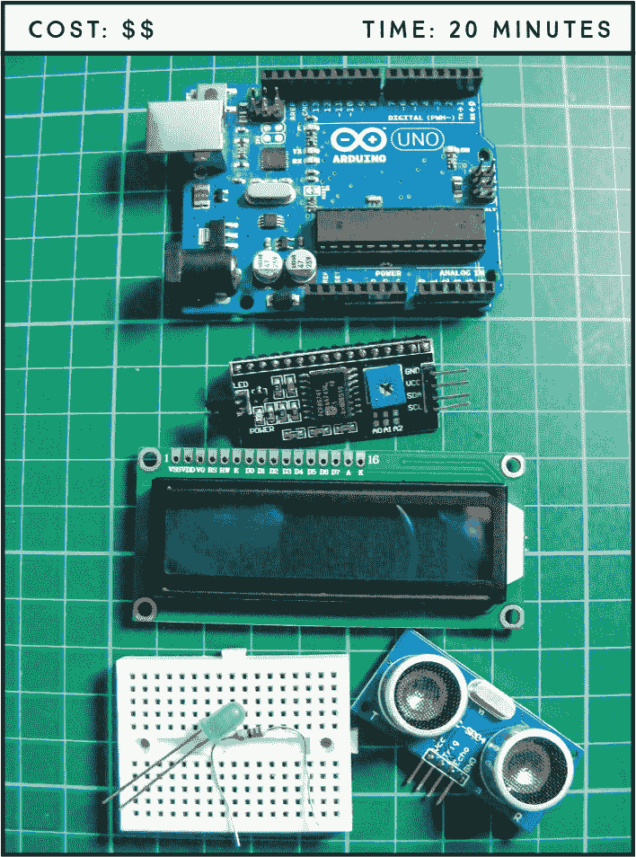

**所需材料**

**Arduino 板**

**迷你面包板**

**跳线，公对公和母对公**

**LED**

**串行 LCD 屏幕模块**

**220 欧姆电阻**

**HC-SR04 超声波传感器**

**所需库**

**NewPing**

**Wire**

**LiquidCrystal_I2C**

### 工作原理

人员计数器通常用于商店或旅游景点来计算访客数量，但你也可以用它来记录高速公路或停车场的车流量，或者在你不在时记录某人进出你房间的次数！

我们将使用的超声波传感器是 HC-SR04，如图 17-1 所示，它首次出现在第 13 项目中。它使用超声波信号，或称为*ping*，来计算传感器与物体之间的距离。在这个项目中，我们将利用这个功能来统计每次有人或物体经过传感器前方时的次数。当计数被记录时，LED 将闪烁，串行 LCD 屏幕将显示总计数。

**图 17-1：** HC-SR04 超声波传感器使用 ping 信号来计算距离。

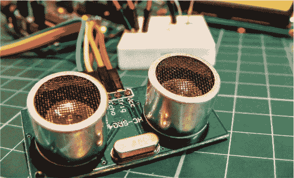

### 构建

1.  使用母对公跳线将 HC-SR04 超声波传感器连接到 Arduino，将 VCC 引脚连接到 Arduino 的+5V，GND 连接到 GND，Trig 和 Echo 分别连接到 Arduino 的 7 号和 8 号引脚，如下表所示，并参见图 17-2。使用迷你面包板进行多重连接。

    | **超声波传感器** | **ARDUINO** |
    | --- | --- |
    | VCC | +5V |
    | Trig | 引脚 7 |
    | Echo | 引脚 8 |
    | GND | GND |

    **图 17-2：** 超声波传感器的连接

    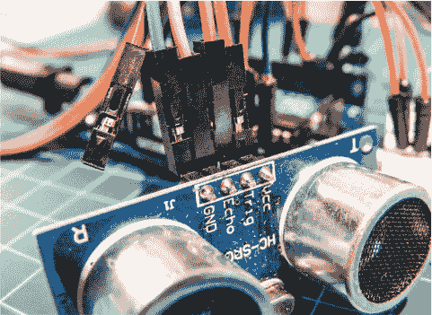

1.  确保下载 LiquidCrystal I2C 和 NewPing 库，并将其添加到计算机的相关文件夹中（请参阅入门指南）。Wire 库随 Arduino IDE 附带，因此不需要额外添加。

1.  按照以下方式将串行 LCD 屏幕连接到 Arduino，使用迷你面包板连接到+5V。

    | **串行 LCD 屏幕** | **ARDUINO** |
    | --- | --- |
    | GND | GND |
    | VCC | +5V |
    | SDA | 引脚 A4 (SDA) |
    | SCL | 引脚 A5 (SCL) |

1.  将 LED 插入迷你面包板，使短的负极（GND）引脚在左侧，长的正极（+5V）引脚在右侧，如下表所示，并参见图 17-3。将 220 欧姆电阻连接到 LED 的正极，确保电阻的另一端横跨面包板的断开部分。将电阻的另一端连接到 Arduino 的 13 号引脚。将 LED 的短引脚连接到 Arduino 的 GND。

    | **LED** | **ARDUINO** |
    | --- | --- |
    | GND | GND |
    | +5V | 通过 220 欧姆电阻连接到引脚 13 |

    **图 17-3：** 我们使用迷你面包板来固定 LED，并与 Arduino 的+5V 进行多重连接。

    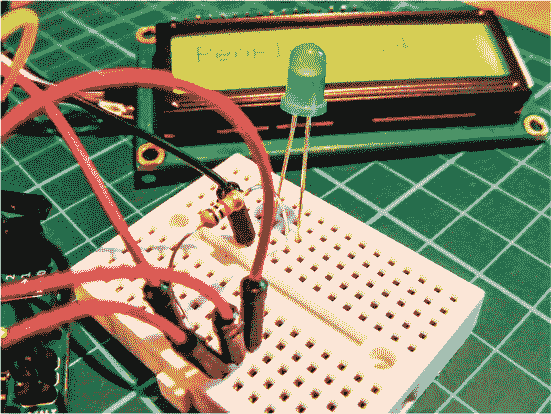

1.  确保您的最终电路与图 17-4 相符，然后将“草图”中在第 146 页的代码上传到 Arduino。

    **图 17-4：** 超声波人员计数器电路图

    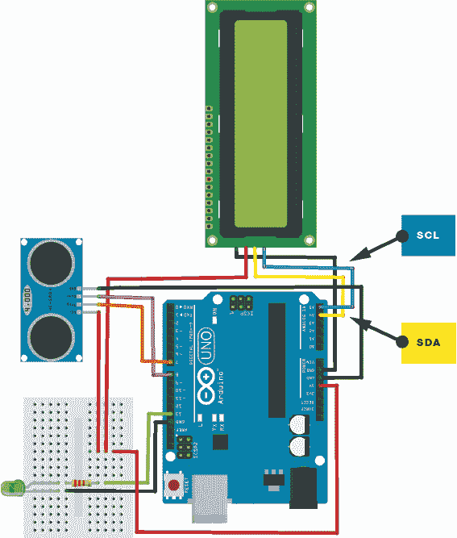

### 草图

该草图首先调用了 LiquidCrystal I2C、NewPing 和 Wire 库，以控制串口 LCD 屏幕和超声波传感器。接下来，它将超声波传感器的 Trig 和 Echo 针脚分别定义为 Arduino 的 7 和 8 号针脚。我们将传感器读取的最大距离设置为 200 厘米（超过 200 厘米的读数会被忽略）。然后我们将 Arduino 的 13 号针脚定义为 LED，用作计数指示器，并创建变量来存储距离和人数。我们创建一个`count`状态，允许 Arduino 判断是否为有效记录，然后定义 LCD 屏幕的类型。我们初始化 LCD 屏幕，使其显示`People:`，并将 LED 针脚设置为输出。

循环部分会发送传感器的 ping 信号，如果返回的 ping 信号来自 100 厘米以外的距离，则认为传感器前方为空，没有记录任何东西。如果记录的距离小于 100 厘米，则表示有物体出现在传感器的范围内。为了让`people:`变量增加，必须有某人经过传感器前，然后离开。传感器将每次接收到有效记录时进行计数，LCD 屏幕上会显示最新的总数。

传感器可以放置在入口的一侧，面向门槛，当有人进入时，传感器会检测到并注册一个计数。如果传感器指向距离墙壁不到 100 厘米的地方，则需要将以下代码行修改为小于到墙壁的距离，否则传感器会每次检测到墙壁时都记录一次计数。

if (distance < 100 && distance != 0 && !count)

下面是完整代码：

#include <LiquidCrystal_I2C.h> // 引入库文件

#include <NewPing.h>

#include <Wire.h>

#define TRIGGER_PIN 7  // 超声波传感器触发针脚连接 Arduino 的针脚 7

#define ECHO_PIN 8     // 超声波传感器回声针脚连接 Arduino 的针脚 8

#define MAX_DISTANCE 200

NewPing sonar(TRIGGER_PIN, ECHO_PIN, MAX_DISTANCE);

int LEDPin = 13; // 将 LED 连接到针脚 13

int distance; // 距离变量

int people = 0; // 人数变量

boolean count = false; // 计数状态

LiquidCrystal_I2C lcd(0x27, 16, 2);

void setup() { // 初始化 LCD 屏幕和 LED

lcd.begin();

lcd.backlight();

pinMode(LEDPin, OUTPUT); // 将 LED 设置为输出

lcd.print("People:"); // 在 LCD 屏幕上打印 "People:"

}

void loop() { // 该部分会无限循环，检查人数

delay(50);

distance = sonar.ping_cm(); // 每 50 毫秒发一次 ping 信号

// 如果距离大于 100 厘米，则不计数

if (distance > 100 && count) {

count = false;

digitalWrite(LEDPin, LOW);

}

// 如果距离小于 100 厘米，则计数 1

if (distance < 100 && distance != 0 && !count) {

count = true;

people ++; // 每次计数增加 1

digitalWrite(LEDPin, HIGH);

lcd.setCursor(10, 0);

lcd.print(people); // 将人数打印到 LCD 屏幕

}

}

### 故障排除

**问答** *代码编译通过，但屏幕上什么也不显示。*

• 请再次检查 SDA 和 SCL 引脚是否连接到正确的 Arduino 引脚。

• 如果 LCD 屏幕亮起但什么也不显示，请小心调节模块背面的细小电位器，调整对比度，直到字母出现。

**问答** *传感器没有注册计数或 LED 未按预期亮起。*

• 确保超声波传感器的触发引脚连接到 Arduino 的 7 号引脚，回声引脚连接到 Arduino 的 8 号引脚，并且电源已连接到 GND 和+5V。

• 如果计数已注册，但 LED 未亮，请重新检查 LED 的短脚是否连接到 GND，长脚是否连接到+5V。电阻应跨越面包板的断开处，一侧连接到 LED 的长脚，另一侧连接到 Arduino 的 13 号引脚。

• 记住传感器的位置非常重要。如果到固定物体（如墙壁）的距离小于示例中的距离，计数将不正确。

• 您的设备可能与我们这里使用的地址不同。要检查您的设备地址，可以使用 Arduino 网站上的 I2C 扫描器示例（*[`playground.arduino.cc/Main/I2cScanner`](http://playground.arduino.cc/Main/I2cScanner)*）。将示例与设备连接到 Arduino 后运行，并打开 IDE 串口监视器，您应该会看到设备的地址。使用显示的地址更新以下行：

LiquidCrystal_I2C lcd(0x27,16,2);

## Nokia 5110 LCD 屏幕 Pong 游戏**

本项目向您展示了如何将 Nokia 5110 LCD 屏幕连接到 Arduino，以重现一个*Pong*风格的街机游戏。

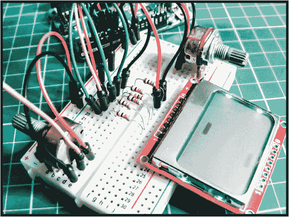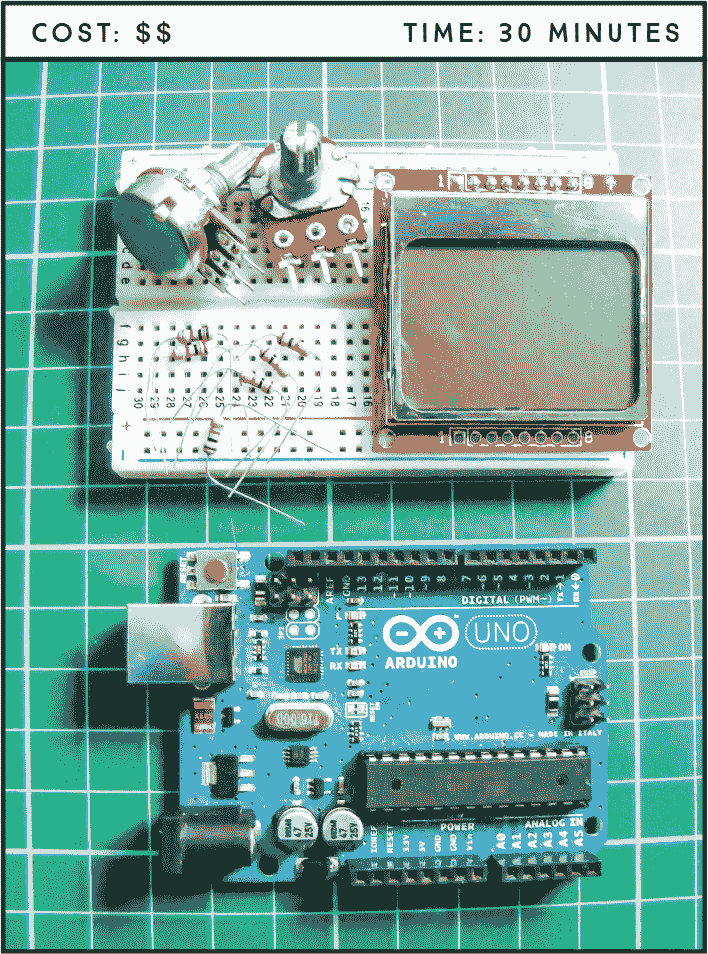

**所需组件**

**Arduino 板**

**面包板**

**跳线**

**Nokia 5110 LCD 屏幕**

**4 个 10k 欧姆电阻**

**2 个 1k 欧姆电阻**

**2 个 50k 欧姆电位器**

### 工作原理

Nokia 5110 LCD 屏幕曾用于几年前所有的 Nokia 手机，因此您应该能在网上找到很多。我们将其连接到 Arduino，并通过添加一些电位器作为控制器来创建一个简单的*Pong*风格游戏。

**注意**

*有关焊接插针的说明，请参阅项目 13；如果您以前没有焊接过，请参阅焊接入门指南。*

屏幕是 84×48 像素，字符之间有间距，以免字符相互接触，这样我们就得到了一个 12×6 字符的屏幕。该屏幕的工作方式与项目 13 中的 LCD 屏幕相同：通过从 Arduino 发送电流到液晶显示屏，使特定像素不透明，形成字母或图像。

大多数屏幕都带有分离的插针，以便运输，因此如果您想将屏幕插入面包板，可能需要将它们焊接到位。您需要将一排八个插针焊接到屏幕一侧的孔排中，如图 18-1 所示。

**图 18-1：** 诺基亚 5110 LCD 屏幕的背面，显示引脚连接

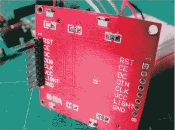

本项目连接到 Arduino 的 +3.3V，而不是 +5V。

### 构建过程

1.  将诺基亚 5110 屏幕插入面包板。

1.  诺基亚屏幕有八个引脚。为诺基亚引脚 1、3、4 和 5 插入 10k-欧姆电阻器，确保它们跨越中心断点。为诺基亚引脚 2 和 7 插入 1k-欧姆电阻器，如图 18-2 所示。

    **图 18-2：** 如此处所示，插入诺基亚 LCD 屏幕的电阻器。

    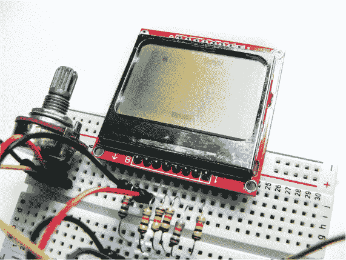

    **警告**

    *对于本项目，使用 Arduino 的 +3.3V 电源供电给诺基亚 5110 屏幕，而不是 +5V；否则，您将损坏屏幕，这是非常重要的。*

1.  使用跳线将诺基亚屏幕与 Arduino 的引脚 3–7 以及面包板电源轨连接。确保将正确值的电阻器连接到正确的引脚，如下表所示。某些扩展板上的引脚位置可能不同，因此请将诺基亚屏幕上的引脚名称与 Arduino 引脚进行匹配。

    | **诺基亚 5110 屏幕** | **电阻器** | **Arduino** |
    | --- | --- | --- |
    | 1 RESET | 10k-欧姆 | 引脚 6 |
    | 2 CE | 1k-欧姆 | 引脚 7 |
    | 3 DC | 10k-欧姆 | 引脚 5 |
    | 4 DIN | 10k-欧姆 | 引脚 4 |
    | 5 CLK | 10k-欧姆 | 引脚 3 |
    | 6 VCC | 无 | +3.3V |
    | 7 Light | 1k-欧姆 | GND |
    | 8 GND | 无 | GND |

1.  按照图 18-3 所示，将可调电阻插入面包板。将其中一个可调电阻的中间引脚连接到 Arduino A0，将另一个可调电阻的中间引脚连接到 Arduino A1。将每个可调电阻的一个外侧引脚连接到面包板的 +5V 电源轨，另一个外侧引脚连接到 GND 电源轨。

1.  将面包板的电源轨连接到 Arduino 的 +5V 和 GND（这仅用于可调电阻）。

1.  确保您的设置与图 18-3 相匹配，并上传下方的代码“草图”。

    **图 18-3：** 诺基亚 5110 LCD 屏幕 *乒乓* 游戏的电路图

    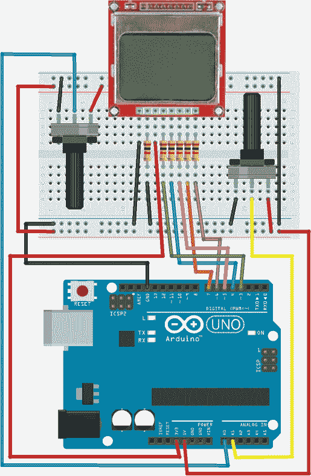

### 草图

游戏开始时，屏幕的两侧各有一个条形，球在它们之间反弹。游戏的目标是使用可调电阻来移动条形，就像挡板一样，将球反弹回来，防止它越过屏幕边界（即超出屏幕外）。球会在挡板上反弹，并逐渐加速。游戏结束时，若球越过屏幕限制，显示会反转，游戏会重新开始。请注意，由于屏幕图形的限制，球越快移动时，可能会显得较为模糊。

草图的第一部分定义了连接到 Nokia 5110 LCD 屏幕的引脚。接着定义了屏幕的大小，也就是我们游戏中计算为有效区域的部分，以及条形和球的大小和起始位置。电位器从 Arduino 的 A0 和 A1 引脚读取模拟信号，并根据旋转的角度来移动对应的条形。在后续的计算中，判断球和条形是否在某些坐标处相遇。如果相遇，球会弹回；如果没有相遇，说明条形错过了球，屏幕将反转并闪烁，表示游戏结束。

// Arduino Pong by Onur Avun and reproduced with kind permission

#define PIN_SCE   7

#define PIN_RESET 6

#define PIN_DC    5

#define PIN_SDIN  4

#define PIN_SCLK  3

#define LCD_C      LOW

#define LCD_D     HIGH

#define LCD_X     84

#define LCD_Y     6

int barWidth = 16;

int barHeight = 4;

int ballPerimeter = 4;

unsigned int bar1X = 0;

unsigned int bar1Y = 0;

unsigned int bar2X = 0;

unsigned int bar2Y = LCD_Y * 8 - barHeight;

int ballX = 0;

int ballY = 0;

boolean isBallUp = false;

boolean isBallRight = true;

byte pixels[LCD_X][LCD_Y];

unsigned long lastRefreshTime;

const int refreshInterval = 150;

byte gameState = 1;

byte ballSpeed = 2;

byte player1WinCount = 0;

byte player2WinCount = 0;

byte hitCount = 0;

void setup() {

LcdInitialise();

restartGame();

}

void loop() {

unsigned long now = millis();

if (now - lastRefreshTime > refreshInterval) {

update();

refreshScreen();

lastRefreshTime = now;

}

}

void restartGame() {

ballSpeed = 1;

gameState = 1;

ballX = random(0, 60);

ballY = 20;

isBallUp = false;

isBallRight = true;

hitCount = 0;

}

void refreshScreen() {

if (gameState == 1) {

for (int y = 0; y < LCD_Y; y++) {

for (int x = 0; x < LCD_X; x++) {

byte pixel = 0x00;

int realY = y * 8;

// 如果在框架内，绘制球

if (x >= ballX && x <= ballX + ballPerimeter -1 && ballY +

ballPerimeter > realY && ballY < realY + 8 ) {

byte ballMask = 0x00;

for (int i = 0; i < realY + 8 - ballY; i++) {

ballMask = ballMask >> 1;

if (i < ballPerimeter)

ballMask = 0x80 | ballMask;

}

pixel = pixel | ballMask;

}

// 如果在框架内，绘制条形

if (x >= bar1X && x <= bar1X + barWidth -1 && bar1Y +

barHeight > realY && bar1Y < realY + 8 ) {

byte barMask = 0x00;

for (int i = 0; i < realY + 8 - bar1Y; i++) {

barMask = barMask >> 1;

if (i < barHeight)

barMask = 0x80 | barMask;

}

pixel = pixel | barMask;

}

if (x >= bar2X && x <= bar2X + barWidth -1 && bar2Y +

barHeight > realY && bar2Y < realY + 8 ) {

byte barMask = 0x00;

for (int i = 0; i < realY + 8 - bar2Y; i++) {

barMask = barMask >> 1;

if (i < barHeight)

barMask = 0x80 | barMask;

}

pixel = pixel | barMask;

}

LcdWrite(LCD_D, pixel);

}

}

} else if (gameState == 2) {

}

}

void update() {

if (gameState == 1) {

int barMargin = LCD_X - barWidth;

int pot1 = analogRead(A0); // 读取电位器并设置条形位置

int pot2 = analogRead(A1);

bar1X = pot1 / 2 * LCD_X / 512;

bar2X = pot2 / 2 * LCD_X / 512;

if (bar1X > barMargin) bar1X = barMargin;

if (bar2X > barMargin) bar2X = barMargin;

// 现在移动球

if (isBallUp)

ballY -= ballSpeed;

else

ballY += ballSpeed;

if (isBallRight)

ballX += ballSpeed;

else

ballX -= ballSpeed;

// 检查碰撞

if (ballX < 1) {

isBallRight = true;

ballX = 0;

}

else if (ballX > LCD_X - ballPerimeter - 1) {

isBallRight = false;

ballX = LCD_X - ballPerimeter;

}

if (ballY < barHeight) {

if (ballX + ballPerimeter >= bar1X && ballX <= bar1X + barWidth) {

// 球从 bar1 反弹

isBallUp = false;

if (ballX + ballPerimeter / 2 < bar1X + barWidth / 2)

isBallRight = false;

else

isBallRight = true;

ballY = barHeight;

if (++hitCount % 10 == 0 && ballSpeed < 5)

ballSpeed++;

} else { // 玩家 2 胜利

gameState = 2;

player2WinCount++;

}

}

if (ballY + ballPerimeter > LCD_Y * 8 - barHeight) {

if (ballX + ballPerimeter >= bar2X && ballX <= bar2X + barWidth) {

// 球从 bar2 反弹

isBallUp = true;

if (ballX + ballPerimeter / 2 < bar2X + barWidth / 2)

isBallRight = false;

else

isBallRight = true;

ballY = LCD_Y * 8 - barHeight - ballPerimeter;

if (++hitCount % 10 == 0 && ballSpeed < 5)

ballSpeed++;

} else { // 玩家 1 胜利

gameState = 2;

player1WinCount++;

}

}

} else if (gameState == 2) {

for (int i =0; i < 4; i++) {

LcdWrite(LCD_C, 0x0D); // LCD 反向模式。

delay(300);

LcdWrite(LCD_C, 0x0C); // LCD 反向模式。

delay(300);

}

restartGame();

}

}

void LcdInitialise(void) {

pinMode(PIN_SCE, OUTPUT);

pinMode(PIN_RESET, OUTPUT);

pinMode(PIN_DC, OUTPUT);

pinMode(PIN_SDIN, OUTPUT);

pinMode(PIN_SCLK, OUTPUT);

delay(200);

digitalWrite(PIN_RESET, LOW);

delay(500);

digitalWrite(PIN_RESET, HIGH);

LcdWrite(LCD_C, 0x21 );  // LCD 扩展命令

LcdWrite(LCD_C, 0xB1 );  // 设置 LCD Vop（对比度）

LcdWrite(LCD_C, 0x04 );  // 设置温度系数。 //0x04

LcdWrite(LCD_C, 0x14 );  // LCD 偏置模式 1:48\. //0x13

LcdWrite(LCD_C, 0x0C );  // LCD 正常模式。

LcdWrite(LCD_C, 0x20 );

LcdWrite(LCD_C, 0x80 );  // 选择 LCD RAM 的 X 地址 0

LcdWrite(LCD_C, 0x40 );  // 选择 LCD RAM 的 Y 地址 0

LcdWrite(LCD_C, 0x0C );

}

void LcdWrite(byte dc, byte data) {

digitalWrite(PIN_DC, dc);

digitalWrite(PIN_SCE, LOW);

shiftOut(PIN_SDIN, PIN_SCLK, MSBFIRST, data);

digitalWrite(PIN_SCE, HIGH);

}

### 故障排除

**问：** *LCD 屏幕上什么都不显示。*

• 确保你已将 LCD 屏幕的电源连接到 Arduino 的 +3.3V 电源引脚，并且连接匹配本章中的表格。

• 确保电阻与正确的 LCD 引脚对接，并且连接到 Arduino 引脚的电缆正确。

• 如果 LCD 屏幕的背光亮起，但没有图像，可能是某些连接线搞混了；它们需要与图 18-3 中的电路完全匹配。

**问：** *当玩家转动电位器时，某个或两个挡板没有移动。*

• 确保电位器牢固地连接在面包板上，并且连接到电源轨和 Arduino 的电缆与电位器的引脚对齐。

• 记住电位器需要 Arduino 提供 +5V 电源和 GND。这些引脚应通过跳线连接到面包板的电源轨。

• 确保你还使用跳线将面包板两侧对应的电源轨连接起来。

## **OLED 呼气酒精测试仪**

在这个项目中，我们将使用 MQ3 酒精传感器和 OLED LCD 屏幕制作一个迷你呼气酒精测试仪。

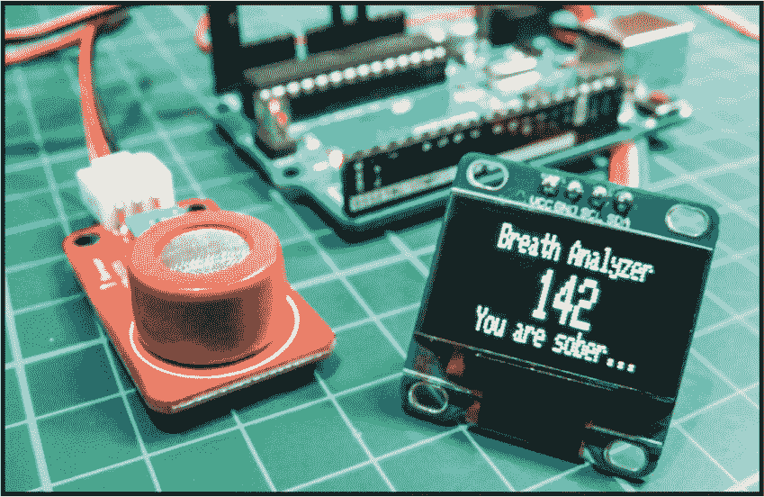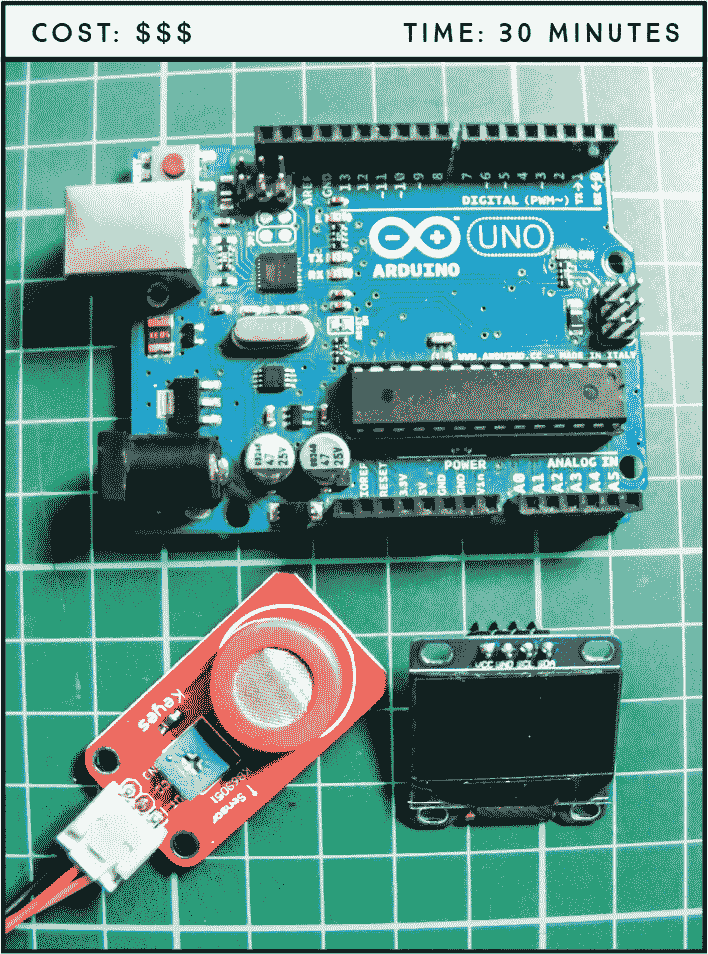

**所需部件**

**Arduino 板**

**母对公跳线**

**Keyes MQ3 酒精传感器模块**

**OLED 单色屏幕 (128×64)**

**所需库**

**SPI**

**电线**

**Adafruit_GFX**

**Adafruit_SSD1306**

### 工作原理

MQ3 是一系列气体传感器中的一员，其他传感器还包括 MQ2（对甲烷、丁烷和烟雾敏感）、MQ4（对压缩天然气敏感）、MQ6（对丁烷和液化石油气敏感）以及 MQ7（对一氧化碳敏感）。MQ3 对酒精和乙醇敏感，因此我们将在呼气酒精测试仪中使用它。

**免责声明**

*此项目仅供娱乐使用，不应用于准确判断任何人的酒精摄入量。*

Keyes MQ3 模块（图 19-1）包含了我们此项目所需的接线，包括一个内置的电位器和电阻器。模块上的三个引脚分别是 OUT、VCC 和 GND。

**图 19-1：** Keyes MQ3 酒精传感器模块。与大多数 MQ 传感器一样，该模块内部有一个小加热器和一个电化学传感器，用于测量气体浓度。读取的数值通过 OUT 引脚发送，随后由 Arduino 上的模拟引脚读取。

为了显示传感器读数，我们将使用 OLED 屏幕（图 19-2）。OLED，代表*有机发光二极管*，是一种发光技术，由薄而多层的有机膜构成，放置在阳极和阴极之间。当施加电压时，图像通过*电致发光*的方式产生，这意味着屏幕不需要背光。我们的 OLED 屏幕是 I2C 128×64 单色版本，意味着我们只需要通过两根引脚连接到 Arduino，并且它的分辨率为 128×64 像素。这个屏幕使用与第 16 项目中的串口 LCD 相同的通信协议，具体内容可以参考该项目的解释。

**图 19-2：** 128×64 OLED 单色屏幕。当 MQ3 读取到值时，Arduino 会向 OLED 屏幕发送一条消息，指示是否检测到酒精。

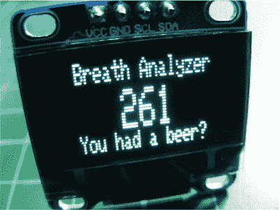

**警告**

*如前所述，MQ3 传感器使用内部加热器作为传感过程的一部分。这个加热器在通电时可达到 120–140 摄氏度，因此在使用时处理时需要小心。*

### 构建过程

1.  在第一次使用传感器之前，你需要“烧录”它。这个过程就是将其通电几个小时以加热内部机制，从而提高传感器的准确性。为此，使用母对公跳线将传感器的 VCC 和 GND 引脚分别连接到 Arduino 上的 +5V 和 GND。当你通电 Arduino 时，它会向 MQ3 发送正确的电压。让其通电两到三小时，你可能会闻到烧焦的气味，传感器也会变热，但这都是正常现象。

1.  一旦传感器烧录完成，断开 Arduino 的电源，并使用母对公跳线将传感器连接到 Arduino，MQ3 的 OUT 引脚连接到 Arduino 引脚 A0，电源和 GND 按照之前的连接方式保持不变（参见下表）。

    | **MQ3 酒精传感器** | **ARDUINO** |
    | --- | --- |
    | OUT | 引脚 A0 |
    | VCC | +5V |
    | GND | GND |

1.  接下来，将 OLED 屏幕按照下表连接到 Arduino，SCL 连接到引脚 A5，SDA 连接到引脚 A4，VCC 连接到 +3.3V，GND 连接到 GND。

    | **OLED 屏幕** | **ARDUINO** |
    | --- | --- |
    | SCL | 引脚 A5 |
    | SDA | 引脚 A4 |
    | VCC | +3.3V |
    | GND | GND |

1.  这个项目需要一些库才能正常工作；SPI 和 Wire 库是 Arduino IDE 中自带的，但我们还需要 Adafruit_GFX 和 Adafruit_SSD1306 库来控制 OLED 屏幕。两个库都可以从 *[`www.nostarch.com/arduinohandbook2/`](https://www.nostarch.com/arduinohandbook2/)* 获取。如果你需要提醒如何将库添加到 IDE，请参考入门手册。

1.  检查你的设置是否与图 19-3 中的电路图一致，并上传下面的代码 “草图”。

    **图 19-3：** OLED 呼气酒精测试仪的电路图

    

1.  MQ3 传感器内部的加热器需要加热约 4 分钟，才能准确工作。草图中有一个计时器，当你首次通电时，直到所需时间过去，屏幕上才会显示值。屏幕上会显示“正在预热”的文字，并有一个小倒计时条，直到传感器准备好。

### 草图

草图通过调用 SPI、Wire、Adafruit_GFX 和 Adafruit_SSD1306 库来控制通信和 OLED 屏幕。我们为预热阶段设定了时间（4 分钟），并将模拟引脚设置为 Arduino A0。

接下来我们设置 OLED 屏幕。根据从模拟引脚读取的值，Arduino 向屏幕发送不同的消息。例如，如果传感器读数超过 200，Arduino 会问你是否喝过啤酒。如果读数低于这个值，Arduino 会显示你是清醒的。MQ3 能读取的最低酒精值大约是 180。对于超过 450 的值，酒精测试仪会提示你已经醉了！

该草图每秒循环一次，读取模拟传感器。要使用酒精测试仪，请等待传感器加热 4 分钟，然后轻轻呼气到传感器上。尽量避免让传感器湿润或暴露在烟雾环境中，因为这会影响读数。

// 经 Nick Koumaris 允许重新创建，来源于 educ8s.tv

// 调用 SPI、Wire、Adafruit_GFX 和 Adafruit_SDD1306 库

#include <SPI.h>

#include <Wire.h>

#include <Adafruit_GFX.h>

#include <Adafruit_SSD1306.h>

#define OLED_RESET 4 // 定义 OLED 屏幕

int TIME_UNTIL_WARMUP = 4; // 热身延迟时间，单位为分钟

unsigned long time;

int analogPin = 0; // 设置模拟引脚为 A0

int val = 0; // 设置一个值，从模拟引脚读取

Adafruit_SSD1306 display(OLED_RESET);

void setup() { // 设置 OLED 屏幕

display.begin(SSD1306_SWITCHCAPVCC, 0x3C);

display.clearDisplay();

}

void loop() { // 读取数据并显示在屏幕上

delay(100);

val = readAlcohol();

printTitle();

printWarming();

time = millis() / 1000;

time /= 60;

if (time <= TIME_UNTIL_WARMUP) { // 如果热身时间少于 4 分钟

time = map(time, 0, TIME_UNTIL_WARMUP, 0, 100); // 显示倒计时

display.drawRect(10, 50, 110, 10, WHITE); // 空白条

display.fillRect(10, 50, time, 10, WHITE);

} else { // 当热身时间已过

// 值和消息将显示在屏幕上

printTitle();

printAlcohol(val);

printAlcoholLevel(val);

}

display.display();

}

void printTitle() { // 屏幕上标题的位置和文本

display.clearDisplay();

display.setTextSize(1);

display.setTextColor(WHITE);

display.setCursor(22, 0);

display.println("呼气分析仪");

}

void printWarming() { // 热身消息

display.setTextSize(1);

display.setTextColor(WHITE);

display.setCursor(30, 24);

display.println("正在热身");

}

void printAlcohol(int value) { // 将酒精值打印到屏幕上

display.setTextSize(2);

display.setTextColor(WHITE);

display.setCursor(50, 10);

display.println(val);

}

void printAlcoholLevel(int value) { // 将消息打印到屏幕上

display.setTextSize(1);

display.setTextColor(WHITE);

display.setCursor(20, 25);

if (value < 200) { // 如果读数小于 200，你是清醒的

display.println("你是清醒的...");

}

if (value >= 200 && value < 280) {

display.println("你喝了一瓶啤酒吗？");

}

if (value >= 280 && value < 350) {

display.println("两瓶或更多啤酒。");

}

if (value >= 350 && value < 450) {

display.println("我闻到了伏特加！");

}

if (value > 450) {

display.println("你醉了！");

}

}

// 通过求三个读数的平均值来计算

// 为了更好的精度，除以 3

int readAlcohol() {

int val = 0;

int val1;

int val2;

int val3;

display.clearDisplay();

val1 = analogRead(analogPin);

delay(10);

val2 = analogRead(analogPin);

delay(10);

val3 = analogRead(analogPin);

val = (val1 + val2 + val3) / 3;

return val;

}

### 故障排除

**Q.** *显示屏没有正确显示读数。*

• 请重新检查你的接线是否与图 19-3 中的图示相符。

• 如果所有接线都正确，确保你已经完成了之前的步骤，将传感器通电几个小时以进行预热。

• 要检查你的组件是否有故障，可以暂时将电位器替换为传感器。将电位器的中间引脚连接到 A0，并为两侧加电。如果电位器正常工作，说明你的传感器可能有故障，应该更换传感器——它们非常便宜。
