# 第六章：安全

## **超声波浸泡器**

在这个项目中，我们将使用超声波传感器来触发一个玩具水枪。你可以设置这个装置，让它在未经察觉的人进入禁区时进行喷水！

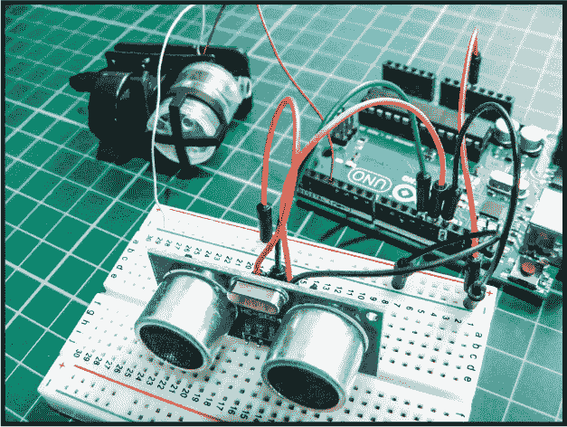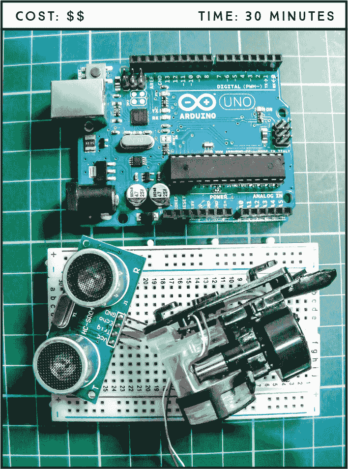

**所需部件**

**Arduino 板**

**面包板**

**跳线**

**HC-SR04 超声波传感器**

**WLtoys V959-18 水射流手枪**

**所需库**

**NewPing**

### 工作原理

对于我们的浸泡器，我们将使用 WLtoys V959-18 水射流手枪（图 20-1）附件，这是一种便宜且在网上广泛可得的 RC 直升机配件。该手枪配有一个小水槽，用于储存水，并且有一个小型水泵，通过前面的喷嘴将水射出。手枪只有两根电线：红色是正电源，白色是接地。它只需要一点电流，这使得我们能够通过 Arduino 提供的电流来触发水泵。

**图 20-1：** WLtoys V959-18 水射流手枪

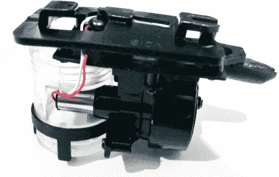

**注意**

*记住水和电不相容，所以尽量将你的 Arduino 远离水喷射口，以减少水短路你* *Arduino 板*的风险。

正如我们在第 13 项中讨论的，超声波传感器会发出一束超声波，并监听从物体反射回来的回声，以确定物体的距离。在这里，超声波传感器寻找一个回波，表示物体距离小于 15 厘米，这时 Arduino 会向浸泡器提供电力，向我们的目标喷射水。

### 组装

1.  将超声波传感器模块（图 20-2）添加到你的面包板上，并将 VCC 连接到 +5V，Trig 连接到 Arduino 引脚 12，Echo 连接到 Arduino 引脚 13，GND 连接到 GND，具体连接如下表所示。

    | **超声波传感器** | **Arduino** |
    | --- | --- |
    | VCC | +5V |
    | Trig | 引脚 12 |
    | Echo | 引脚 13 |
    | GND | GND |

    **图 20-2：** 超声波传感器

    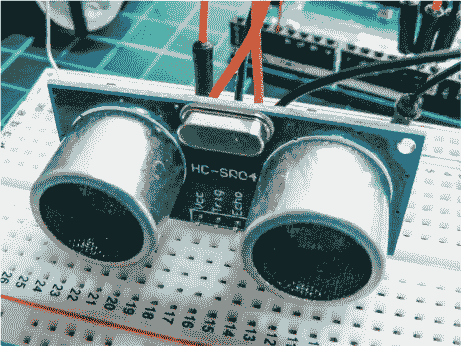

1.  将手枪的红色电源线连接到 Arduino 引脚 3，将白色电线通过面包板的电源轨连接到 Arduino GND。将面包板的电源轨连接到 Arduino 电源。手枪配有一根小移液管，帮助你填充水槽。图 20-3 展示了如何填充水槽。

    **图 20-3：** 使用提供的移液管通过顶部的开口向显示的水槽中加入水。

    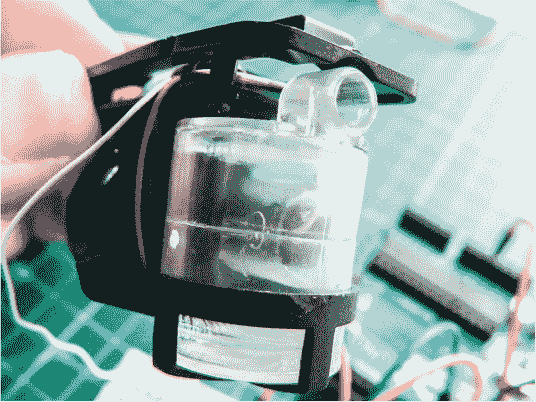

1.  一旦确认你的设置与图 20-4 中的电路图相匹配，将 “The Sketch” 中的代码上传到你的 Arduino，确保将 NewPing 库添加到 Arduino IDE 中。

    **图 20-4：** 超声波浸泡器的电路图

    

### 程序代码

在进入草图之前，下载 NewPing 库，链接为 *[`www.nostarch.com/arduinohandbook2/`](http://www.nostarch.com/arduinohandbook2/)*。草图会调用 NewPing 库并定义 Arduino 引脚连接。Arduino 引脚 12 连接到传感器的触发引脚，并发送超声波信号，Arduino 引脚 13 连接到传感器的 Echo 引脚，并接收返回的信号。Arduino 将发送和接收信号之间的时间转换为距离。喷水器连接到 Arduino 引脚 3，循环检查检测到的物体的距离。如果距离小于 15 厘米，则会向引脚 3 发送电源，喷水器会向毫无防备的朋友们喷射水！

#include <NewPing.h>   // 调用 NewPing 库

#define trigPin 12      // Trig 引脚连接到 Arduino 12

#define echoPin 13      // Echo 引脚连接到 Arduino 13

#define soakerPin 3

#define MAX_DISTANCE 500

NewPing sonar(trigPin, echoPin, MAX_DISTANCE);

void setup() {

Serial.begin(9600);

pinMode(soakerPin, OUTPUT);

}

void loop() {

int distance;

distance = sonar.ping_cm();

Serial.print(distance);

Serial.println(" cm");

if (distance <= 15) { // 如果距离小于 15

digitalWrite(soakerPin, HIGH); // 喷水器射水

delay(250);

digitalWrite(soakerPin, LOW);  // 短暂的水脉冲

}

else {

digitalWrite(soakerPin, LOW);  // 喷水器将保持关闭

}

delay(500);

}

### 故障排除

**Q.** *超声波喷水器没有射水。*

• 通过重新检查本章表格和 图 20-4 中的电路图，确保连接与超声波传感器的设置匹配。

• 记住，只有当传感器检测到有人或物体在前方时，水才会喷出。

• 确保你已为面包板的电源轨提供电源。

• 通过将水喷射器从电路中断开，再直接将电线连接到 Arduino 的 +5V 和 GND 上，检查水射流是否正常工作。你应该能听到泵电机的嗡嗡声；如果没有听到，可能是你的组件有问题。

## 指纹扫描仪**

在这个项目中，我们将使用指纹传感器、舵机和一些 LED，制作一个酷炫的生物识别进入系统。

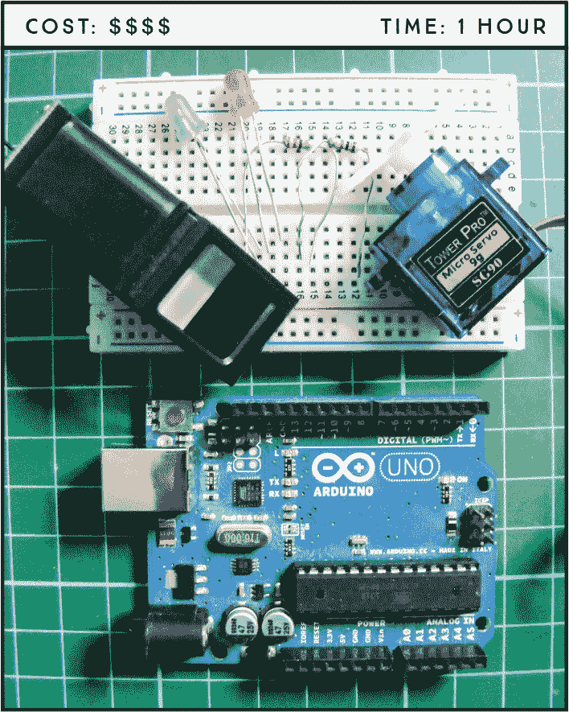

**所需部件**

**Arduino 板**

**面包板**

**跳线**

**红色 LED**

**绿色 LED**

**2 个 220 欧姆电阻**

**Tower Pro SG90 9g 舵机**

**光学指纹传感器 (ZFM-20 系列)**

**所需库**

**Adafruit_Fingerprint**

**舵机**

**SoftwareSerial**

**注意**

*我们在这个项目中使用的软件仅支持 Windows。*

### 工作原理

生物识别技术用于通过特定的生物特征来识别一个人，这些生物特征即使在很长时间内也保持不变，例如指纹或虹膜图案。由于指纹对每个人都是独一无二的，它们通常用于帮助识别个人，例如在刑事调查和安全身份验证中。在本项目中，我们将使用指纹传感器读取指纹，并且如果它与记录中具有适当安全权限的指纹匹配，则通过移动伺服电机允许访问。

我们将使用的传感器是 ZFM-20 系列指纹识别模块（见图 21-1），但通常称为*光学指纹传感器模块*。该传感器拍摄指纹的照片，将其添加到模块的数据库中，然后检查扫描的指纹是否匹配。它最多可以存储 162 个指纹。该传感器可以在线购买，也可以从如 Adafruit 等零售商处购买，Adafruit 还为该模块创建了一个专门的 Arduino 库，我们将在草图中使用。

**图 21-1：** ZFM-20 系列指纹识别模块是一个光学指纹传感器。

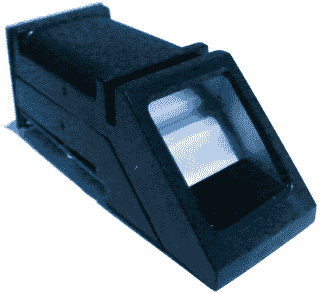

### 准备指纹传感器

要使用传感器，首先需要获取 SFG Demo 软件，可以从*[`www.adafruit.com/datasheets/SFGDemoV2.0.rar`](http://www.adafruit.com/datasheets/SFGDemoV2.0.rar)*下载。SFG Demo 软件是一个简单的免费程序，通过 Arduino 将您的 PC 与指纹识别模块连接，您可以控制它，添加或删除指纹，并为每个指纹分配一个 ID。

1.  下载*SFGDemoV2.0.rar*文件并解压到您选择的目标位置。

1.  一旦解压了*.rar*文件，双击*SFGDemo.exe*文件运行程序，您将看到图 21-2 所示的界面。

    **图 21-2：** SFGDemo 控制界面

    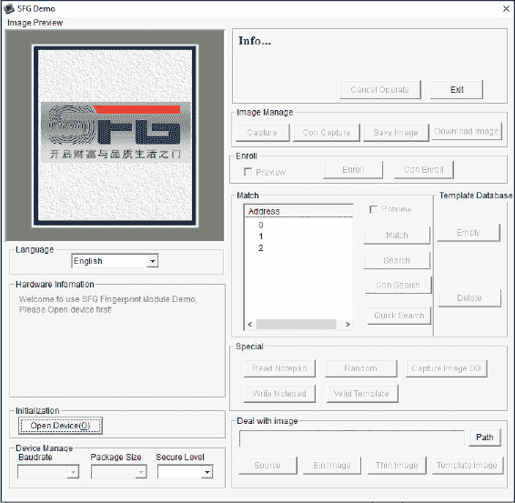

1.  现在，您需要通过 Arduino 将指纹传感器模块连接到 PC。模块与 Arduino 的连接如下表所示。

    | **指纹传感器** | **ARDUINO** |
    | --- | --- |
    | GND（黑线） | +5V |
    | RX（白线） | Pin 0（RX） |
    | TX（绿线） | Pin 1（TX） |
    | +5V（红线） | +5V |

1.  您将使用 Arduino 作为中介，通过 USB 电缆将指纹扫描仪连接到 PC，因此需要加载一个空白的草图，使 Arduino 能够连接到 PC，而无需执行任何功能。最简单的方法是打开最新版本的 Arduino IDE 并上传默认的草图，如下所示。

    void setup() {

    // 在此处输入您的设置代码，只执行一次：

    }

    void loop() {

    // 在此处输入您的主代码，将重复执行：

    }

1.  然后，连接 Arduino 到你的 PC，并在 SFGDemo 程序中选择**打开设备**按钮。在弹出的**COM 端口**下拉菜单中，选择 Arduino 连接的端口并点击**确定**。你会看到一个消息，表示你的模块已连接并被识别，如图 21-3 所示。这里我的模块通过 COM 端口 4 连接到 Arduino，但你可能需要使用不同的端口。

    **图 21-3：** 当设备连接正确时，程序会显示“设备打开成功！”的消息。

    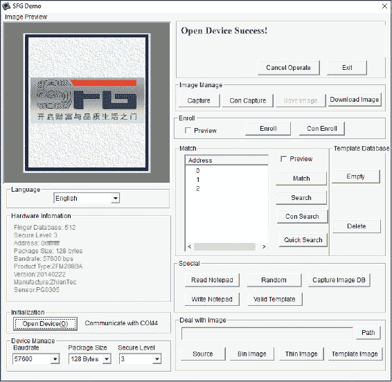

1.  接下来，你将向数据库添加一个指纹。在 SFGDemo 控制屏幕上点击**注册**。当你看到消息“等待指纹”时，牢牢地把手指按在指纹传感器模块窗口上，并等待几秒钟。当指纹注册成功时，你将看到“成功！”的消息（如图 21-4 所示）。

    **图 21-4：** 模块成功捕捉到指纹，并在左上角窗口中显示指纹预览。

    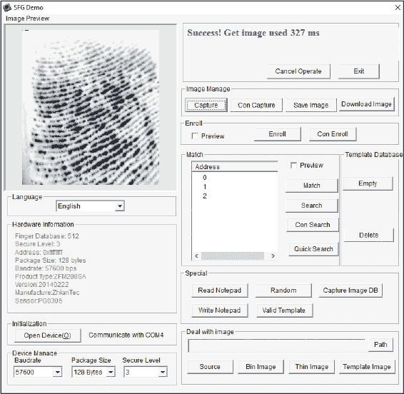

1.  现在，你将测试模块是否能识别你刚刚录入的指纹。在 SFGDemo 控制屏幕上点击**匹配**按钮。当提示时，将你的手指紧紧按在窗口上几秒钟。如果演示找到匹配的指纹，你将看到图 21-5 所示的“通过！”消息。

    **图 21-5：** 指纹匹配成功，且“SFGDemo 控制面板”信息面板中显示“通过！”的消息。

    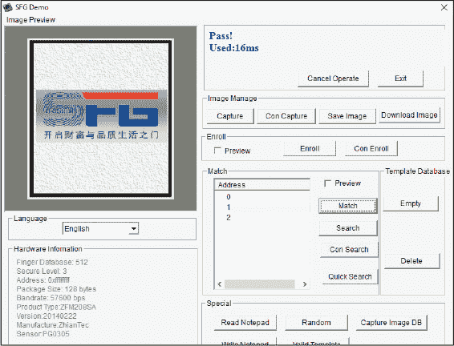

1.  现在，你需要检查模块是否能够识别当它连接到 Arduino 而不是 PC 时的指纹。关闭 SFGDemo 程序，然后从你下载的资源中，*[[`www.nostarch.com/arduinohandbook2/`](https://www.nostarch.com/arduinohandbook2/)]*，将 Adafruit 指纹传感器库添加到你的 IDE 中。如果你需要回顾如何添加库，请查阅本书开头的库部分。

1.  一旦你添加了 Adafruit 指纹传感器库，打开 IDE 并选择**文件** ▸ **示例** ▸ **Adafruit-fingerprint-sensor-master** ▸ **Fingerprint**，选择如图 21-6 所示的库指纹草图。将此草图上传到你的 Arduino。

    **图 21-6：** 来自 Adafruit 指纹传感器库的指纹演示草图

    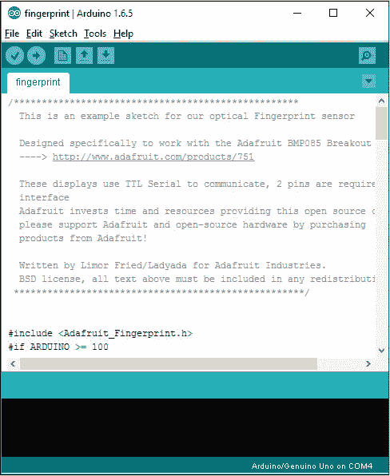

    **注意**

    *你的传感器可能附带六根线，其中两根线对于演示是不必要的。*

1.  上传指纹草图到你的 Arduino 后，断开与 PC 的连接。接下来，你需要更改模块/Arduino 的引脚设置。将模块连接到 TX 和 RX 引脚的连接，分别更改为 Arduino 的引脚 2 和引脚 3，如下表所示。这可以保持 TX 和 RX 串口通信空闲，以便在下一步中使用 Arduino IDE 的串口监视器。

    |  **指纹传感器**  | **Arduino** |
    | --- | --- |
    | GND（黑色电线） | +5V |
    | TX（绿色电线） | 引脚 2 |
    | RX（白色电线） | 引脚 3 |
    | +5V（红色电线） | +5V |

1.  现在，将你的 Arduino 重新连接到 PC，并打开 Arduino IDE。打开 IDE 的串口监视器。当你将手指按在模块窗口时，你应该看到类似图 21-7 的内容。

    **图 21-7：** 模块过程显示在 Arduino IDE 串口屏幕上。

    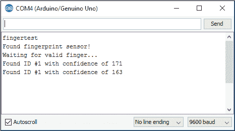

### 构建

现在你知道模块正常工作，你将利用学到的内容创建指纹录入系统。

1.  现在指纹模块应该已经连接到 Arduino，如果你是从这一点开始，请按照步骤 10 中给出的连接进行操作，然后继续。

1.  将舵机电机连接到面包板的 GND 和+5V 电源轨，并将信号引脚连接到 Arduino 的引脚 9，如下表所示。

    | **舵机** | **ARDUINO** |
    | --- | --- |
    | 信号（黄色电线） | 引脚 9 |
    | 正电源（红色电线） | 面包板+5V 电源轨 |
    | 负极电源（黑色电线） | 面包板 GND 电源轨 |

1.  将 LED 插入面包板，使得短的负极腿连接到面包板的 GND 电源轨，长的正极腿通过 220 欧姆电阻连接到 Arduino 的 7 号和 8 号引脚，如下表所示。电阻应该跨越面包板的中心，如图 21-8 所示。

    | **LED** | **ARDUINO** |
    | --- | --- |
    | 绿色 LED（正极，长腿） | 通过 220 欧姆电阻连接到引脚 7 |
    | 红色 LED（正极，长腿） | 通过 220 欧姆电阻连接到引脚 8 |
    | 两个 LED 的负极（短脚） | 面包板 GND 电源轨 |

    **图 21-8：** LED 通过 220 欧姆电阻连接到 Arduino 引脚。

    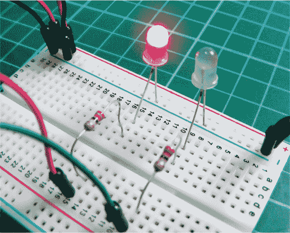

1.  将面包板的电源轨连接到 Arduino 的+5V 和 GND，然后检查你的电路是否与图 21-9 匹配。

1.  上传第 183 页中的“草图”代码。

    **图 21-9：** 指纹扫描仪的电路图

    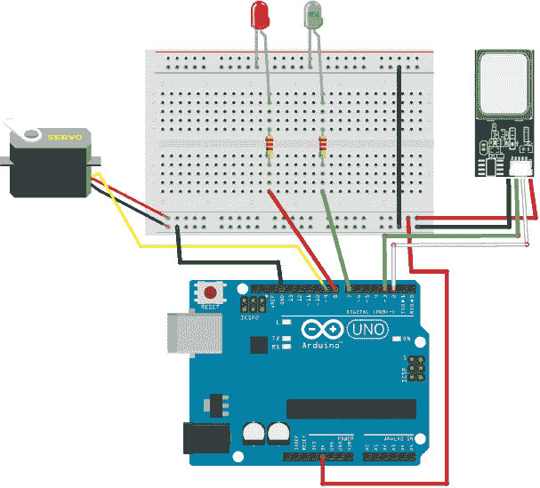

### 草图

草图首先调用了 Servo、SoftwareSerial 和 Adafruit_Fingerprint 库。LED 和舵机的引脚分别定义为 7、8 和 9，引脚 2 和 3 则定义为与指纹传感器模块的串口连接。指纹库处理模块的功能，草图中有一系列步骤来读取和存储指纹。

传感器每 5 秒自动扫描，并在手指按压到窗口时读取指纹。如果指纹与模块内存中的某个指纹匹配（我们在项目中提前存储了该指纹），红色 LED 将熄灭，绿色 LED 会亮起，舵机将旋转 180 度。这个状态将持续 5 秒钟，之后系统将重置并等待下一个有效的录入。

// 指纹传感器库已获许可转载

// 来自 Adafruit Industries

/***************************************************

这是我们光学指纹传感器的示例代码

专为与 Adafruit BMP085 Breakout 配合使用而设计

----> [`www.adafruit.com/products/751`](http://www.adafruit.com/products/751)

这些显示器使用 TTL 串行通信，需用到 2 根引脚

接口

Adafruit 投入时间和资源提供此开源代码，

请通过购买支持 Adafruit 和开源硬件

来自 Adafruit 的产品！

由 Limor Fried/Ladyada 为 Adafruit Industries 编写。

BSD 许可协议，任何重新分发必须包含上面所有文字

****************************************************/

#include <Servo.h>

#include <Adafruit_Fingerprint.h>

#if ARDUINO >= 100

#include <SoftwareSerial.h>

#else

#include <NewSoftSerial.h>

#endif

int getFingerprintIDez();

int ledaccess = 7; // 绿色 LED 引脚

int leddeny = 8; // 红色 LED 引脚

int servoPin = 9; // 伺服电机引脚

Servo doorLock;

// 引脚 #2 是来自传感器的输入（绿色电缆）

// 引脚 #3 是来自 Arduino 的输出（白色电缆）

#if ARDUINO >= 100

SoftwareSerial mySerial(2, 3); // 指纹传感器的引脚

#else

NewSoftSerial mySerial(2, 3);

#endif

Adafruit_Fingerprint finger = Adafruit_Fingerprint(&mySerial);

void setup() {

doorLock.attach(servoPin); // 我们定义了伺服电机的引脚

pinMode(ledaccess, OUTPUT); // 将绿色 LED 引脚设置为输出

pinMode(leddeny, OUTPUT); // 将红色 LED 引脚设置为输出

pinMode(servoPin, OUTPUT); // 将伺服电机引脚设置为输出

Serial.begin(9600); // 开始向串口监视器发送消息

Serial.println("fingertest");

finger.begin(57600); // 设置传感器串口的数据传输速率

// 启动模块并检查指纹

if (finger.verifyPassword()) {

Serial.println("已找到指纹传感器！");

} else {

Serial.println("未找到指纹传感器 :(");

while (1);

}

Serial.println("等待有效的手指...");

}

void loop() {

int ID = getFingerprintIDez(); // 获取指纹 ID#

// 重置设备为测试状态

digitalWrite(ledaccess, HIGH);

digitalWrite(leddeny, HIGH);

doorLock.write(0);

if (ID >= 0) { // 有效的 ID。解锁状态

// 启用访问 LED，关闭拒绝 LED

digitalWrite(ledaccess, HIGH);

digitalWrite(leddeny, LOW);

// 解锁伺服电机

doorLock.write(180);

}

else if (ID == -3) { // ID 与任何已注册的指纹不匹配

// 锁定状态

// 启用拒绝 LED，关闭访问 LED

digitalWrite(ledaccess, LOW);

digitalWrite(leddeny, HIGH);

}

delay(5000);

}

uint8_t getFingerprintID() {

uint8_t p = finger.getImage();

switch (p) {

case FINGERPRINT_OK: // 当手指放置时，传感器拍照

// 放置在模块窗口上

Serial.println("图像已拍摄");

break;

case FINGERPRINT_NOFINGER:

Serial.println("未检测到手指");

return p;

case FINGERPRINT_PACKETRECIEVEERR:

Serial.println("通信错误");

return p;

case FINGERPRINT_IMAGEFAIL:

Serial.println("成像错误");

return p;

default:

Serial.println("未知错误");

return p;

}

p = finger.image2Tz(); // 成功！我们获得了指纹，且

// 现在检查是否能读取

switch (p) {

case FINGERPRINT_OK:

Serial.println("图像转换完成");

break;

case FINGERPRINT_IMAGEMESS:

Serial.println("图像太混乱");

return p;

case FINGERPRINT_PACKETRECIEVEERR:

Serial.println("通信错误");

return p;

case FINGERPRINT_FEATUREFAIL:

Serial.println("无法找到指纹特征");

return p;

case FINGERPRINT_INVALIDIMAGE:

Serial.println("无法找到指纹特征");

return p;

默认:

Serial.println("未知错误");

return p;

}

p = finger.fingerFastSearch(); // 成功转换！它有效，所以

// 与模块内存进行比对

if (p == FINGERPRINT_OK) {

Serial.println("找到了指纹匹配！");

} else if (p == FINGERPRINT_PACKETRECIEVEERR) {

Serial.println("通信错误");

return p;

} else if (p == FINGERPRINT_NOTFOUND) {

Serial.println("未找到匹配"); // 未找到匹配，

// 返回起始位置

return p;

} else {

Serial.println("未知错误");

return p;

}

// 我们找到匹配了！接下来将执行：

Serial.print("找到 ID #"); Serial.print(finger.fingerID);

Serial.print(" 匹配置信度为 "); Serial.println(finger.confidence);

return finger.fingerID;

}

// 如果失败，返回 -1，否则返回 ID #

int getFingerprintIDez() {

int p = finger.getImage();

if (p != FINGERPRINT_OK) return -1;

p = finger.image2Tz();

if (p != FINGERPRINT_OK) return -2;

p = finger.fingerFastSearch();

if (p != FINGERPRINT_OK) ; {

Serial.println("未找到匹配");

return -3;

}

// 找到匹配！

Serial.print("找到 ID #"); Serial.print(finger.fingerID);

Serial.print(" 匹配置信度为 "); Serial.println(finger.confidence);

return finger.fingerID;

}

### 故障排除

**Q.** *代码能编译，但指纹传感器没有亮起或无法工作。*

• 确保你的接线与第 181 页和第 182 页中的表格一致。此代码仅适用于我在本项目中使用的指纹传感器。

• 如果你的传感器有六根线，而不是预期的四根，而且线的颜色与描述不符，实际上你需要的是前四根引脚：GND、TX、RX 和 +5V。其他两根连接线在本项目中不会使用，所以可以移除这些线。

• 如果你的模块仍然无法亮起，请查看数据手册中的实际引脚配置，并按照该配置重新连接线。

• 请记得首先设置模块并按照“准备指纹传感器”中描述的步骤进行测试，见第 176 页。

**Q.** *LED 灯没有按预期亮起。*

• 确保 LED 灯牢固插入面包板，并且电阻与 Arduino 连接端口对齐。

• 请记得将电源连接到面包板的电源轨道。

**Q.** *伺服电机没有按预期移动。*

• 仔细检查接线是否与图 21-9 中的伺服连接一致。

• 该模块、伺服电机和 LED 灯会消耗相当大的电量，虽然 Arduino 可以在较低电压下继续工作，但伺服电机则无法正常运作。请更换新电池。
