# 第七章：智能机器

## 超声波机器人**

在本项目中，我们将结合超声波传感器、两台直流电机和一台伺服电机，创建一个简单的避障机器人。

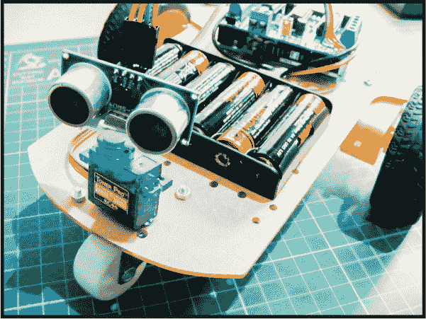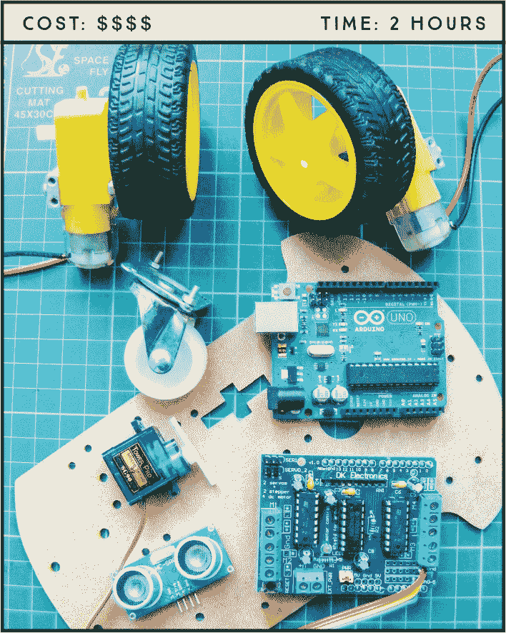

**所需零件**

**Arduino 主板**

**跳线**

**L293d 电机驱动板**

**2 个直流电机和车轮***

**HC-SR04 超声波传感器**

**9V AA 电池包**

**带配件的机器人底座***

**中心轮***

**Tower Pro SG90 9g 伺服电机**

**所需库**

**伺服电机**

**NewPing**

**Adafruit 电机驱动板 V1**

*** 这些物品可以作为套件的一部分购买**

### 工作原理

超声波机器人的关键部件是 HC-SR04 超声波传感器、L293d 电机驱动板和电机。我使用的电机是作为一个套件购买的；如果你在网上搜索“Arduino 机器人套件”，你也应该能够找到包含电机和车轮、底座、电池包、中心轮及所需配件的套件。我购买的套件名为“2WD 智能电机机器人车底盘套件，适用于 Arduino 1:48”，因此尝试几个类似的关键词，直到找到与 图 22-1 中的套件相似的东西。还可以尝试 第 249 页 上的 “零售商列表” 中列出的供应商。

**图 22-1：** 机器人电机套件

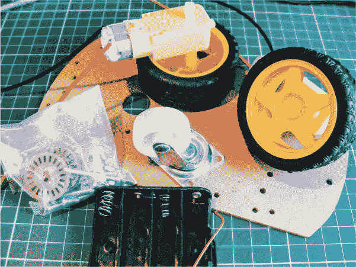

超声波传感器发送和接收信号以测定物体的距离。如果物体距离小于 15 厘米，机器人将停止，四处查看，转向没有感知到任何物体的方向，并朝该方向移动。超声波传感器安装在伺服电机上，使机器人能够移动并寻找清晰的路线。有关 HC-SR04 超声波传感器工作原理的更多信息，请参见第 13 项工程。L293d 电机驱动板安装在 Arduino 上，使用 Adafruit 电机驱动库控制直流电机。

### 制作过程

1.  你需要像在 图 22-2 中所示那样给直流电机焊接电线。如果你需要复习如何操作，请参阅 第 12 页 中的 “快速焊接指南”。将红色正极电源线焊接到一个直流电机的左引脚，将黑色地线焊接到右引脚；另一台电机则反转此顺序。直流电机没有极性，因此不管你如何拿电机确定左右，都无妨，但电源和地线必须放置在电机的相反位置，这样电机旋转的方向才会一致。

    **图 22-2：** 将红色正极电源线焊接到一个直流电机的左引脚，将黑色地线焊接到右引脚。另一台电机则反转此顺序。

    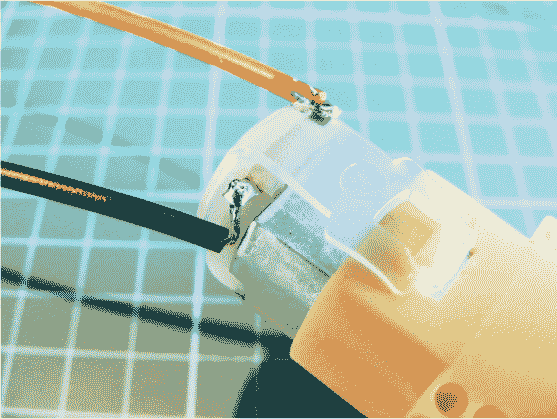

1.  将单轮固定到机器人底座前部，使用提供的螺丝和配件将两个后轮固定到背面。机器人的底部应与图 22-3 相似。

    **图 22-3：** 组装 Arduino 机器人底座。

    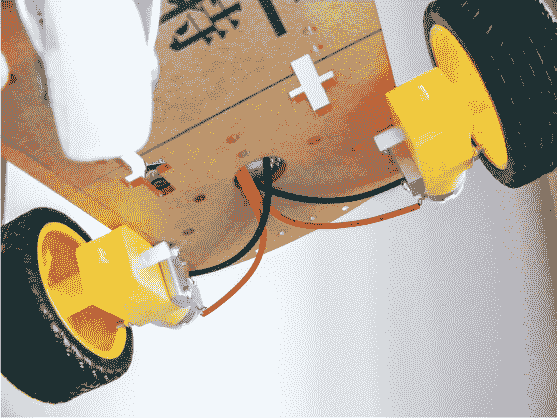

1.  现在你需要 L293d 电机电路板（图 22-4）；我们将给它焊接一些导线来控制超声波传感器。

    **图 22-4：** L293d 电机电路板。我们将焊接四根导线到图中高亮的引脚。

    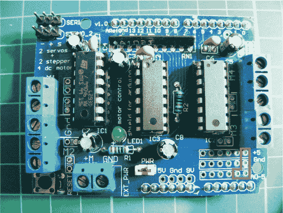

1.  取四根母跳线，并将每根跳线的一端去皮约 5 毫米，如图 22-5 所示。

    **图 22-5：** 去皮四根母跳线的末端，以便焊接到电机电路板。

    

1.  按照图 22-6 所示，将去皮的导线焊接到电机电路板上的高亮引脚。这可能比较棘手，所以请花时间确保焊接连接最好。

    **图 22-6：** 如图 22-4 所示，将跳线焊接到电机电路板。电源连接下方的两个引脚应连接到模拟 A4 和 A5，以控制传感器。

    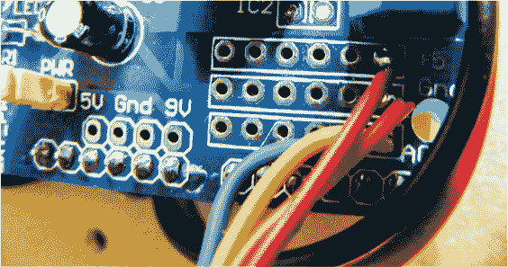

1.  一旦你将导线焊接到电机电路板，将电路板放在 Arduino 上，使电路板的引脚与下面 Arduino 上的插座对齐。电路板应精确贴合，但要小心对齐引脚与孔位，轻轻放置到位。

1.  接着，将超声波传感器连接到你焊接到电机电路板的母端跳线。将传感器上的 VCC 连接到电机电路板上的+5V，Trig 连接到 A4，Echo 连接到 A5，GND 连接到 GND（见下表）。

    | **超声波传感器** | **电机电路板** |
    | --- | --- |
    | VCC | +5V |
    | Trig | 引脚 A4 |
    | Echo | 引脚 A5 |
    | GND | GND |

1.  按照下表和图 22-7 所示，将直流电机的导线连接到电机电路板。你可以通过将导线穿过插针并使用螺丝将导线固定在适当位置来连接导线。

    | **左电机** | **电机电路板** | **Arduino** |
    | --- | --- | --- |
    | 红色导线 | M1 | +5V |
    | 黑色导线 | M1 | GND |
    | **右电机** | **电机电路板** | **Arduino** |
    | --- | --- | --- |
    | 红色导线 | M3 | +5V |
    | 黑色导线 | M3 | GND |

    **图 22-7：** 如图所示，连接直流电机的电源导线。

    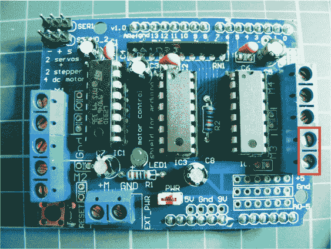

1.  接下来，将伺服电机安装到电路板上，如下表和图 22-8 所示。

    | **伺服电机** | **电机电路板** | **Arduino** |
    | --- | --- | --- |
    | 棕色导线 | Servo_2 - | GND |
    | 红色导线 | Servo_2 + | +5V |
    | 黄色导线 | Servo_2 s | 信号 |

    **图 22-8：** 如图所示，将伺服电机连接到电路板。

    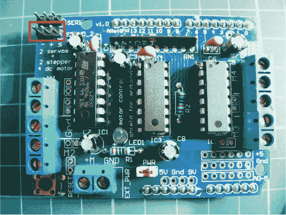

1.  使用胶水或胶带将伺服电机固定在机器人的前方。然后将超声波传感器固定在伺服电机的舵上，这样它就可以随着伺服臂一起移动，你的机器人也能环顾四周。在此阶段，机器人应该看起来像 图 22-9 中的样子。

    **图 22-9：** 完成的机器人，超声波传感器附加在伺服电机上

    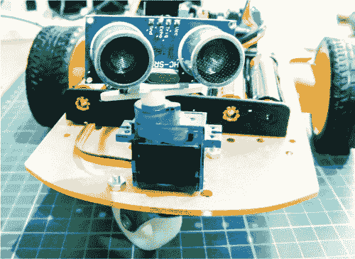

1.  确保你已经下载了 NewPing 和 Adafruit Motor Shield 库，并将它们添加到 IDE 中。Servo 库已包含在 IDE 中，因此无需安装。

1.  一旦确认你的设置与 图 22-10 中的电路图相匹配，上传 “The Sketch” 代码至 第 198 页，并将 9V 电池包连接到你的 Arduino，看看你的机器人如何运作！

    **图 22-10：** 超声波机器人电路图

    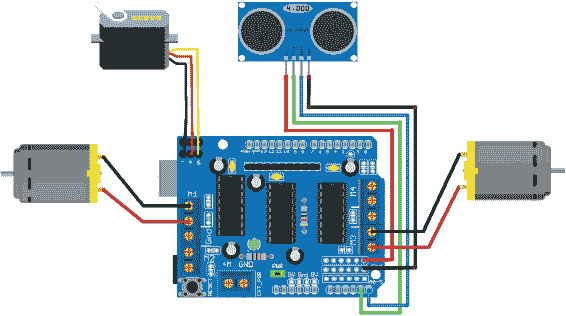

### 草图

草图开始时调用了 Adafruit Motor Shield、NewPing 和 Servo 库。超声波传感器的 Trig 引脚被定义为 Arduino A4，Echo 引脚为 Arduino A5。超声波传感器的最大距离设置为 200 厘米，直流电机的速度设置为 190（满分 255）为中速。直流电机被定义为使用电机屏蔽板的 M1 和 M3 接口。

伺服电机被命名并连接到 Arduino 的 9 号引脚（通过电机屏蔽板的连接）。接下来的循环从超声波传感器读取数据，如果检测到物体距离小于 15 厘米，电机会停止并略微反转，伺服电机会左右移动一次以环顾四周，机器人会转向左侧并继续向前移动，直到发现另一个物体。

// 由 Nick Koumaris 特别授权转载

// [`www.educ8s.tv`](http://www.educ8s.tv)

#include <AFMotor.h>

#include <NewPing.h>

#include <Servo.h>

#define TRIG_PIN A4

#define ECHO_PIN A5

#define MAX_DISTANCE 200

#define MAX_SPEED 190 // 设置直流电机的速度

#define MAX_SPEED_OFFSET 20

NewPing sonar(TRIG_PIN, ECHO_PIN, MAX_DISTANCE);

AF_DCMotor motor1(1, MOTOR12_1KHZ); // 第一个电机连接到 1 号接口

AF_DCMotor motor2(3, MOTOR12_1KHZ); // 第二个电机连接到 3 号接口

Servo myservo; // 给伺服电机命名

boolean goesForward = false;

int distance = 100; // 定义一个用于距离和速度的 int 类型变量

int speedSet = 0;

void setup() {

myservo.attach(9); // 伺服电机连接到 9 号引脚

myservo.write(115); // 设置伺服电机为 115 度

delay(2000);

distance = readPing(); // 读取传感器的距离

delay(100);

distance = readPing();

delay(100);

distance = readPing();

delay(100);

distance = readPing();

delay(100);

}

void loop() {

int distanceR = 0;

int distanceL = 0;

delay(40);

// 如果距离小于 15 厘米，执行此功能

if (distance <= 15) {

moveStop();

delay(100);

moveBackward();

delay(300);

moveStop();

delay(200);

distanceR = lookRight();

delay(200);

distanceL = lookLeft();

delay(200);

if (distanceR >= distanceL) {

turnRight();

moveStop();

} else { // 否则继续

turnLeft();

moveStop();

}

} else {

moveForward();

}

distance = readPing();

}

int lookRight() { // 伺服电机向右看

myservo.write(50);

delay(500);

int distance = readPing();

delay(100);

myservo.write(115);

return distance;

}

int lookLeft() { // 伺服电机向左看

myservo.write(170);

delay(500);

int distance = readPing();

delay(100);

myservo.write(115);

return distance;

delay(100);

}

int readPing() {

delay(70);

int cm = sonar.ping_cm();

if (cm == 0) {

cm = 250;

}

return cm;

}

void moveStop() {

motor1.run(RELEASE);

motor2.run(RELEASE);

}

void moveForward() {

if (!goesForward) { // 如果区域清空，电机向前移动

goesForward = true;

motor1.run(FORWARD);

motor2.run(FORWARD);

// 缓慢加速以避免负载过重

// 电池消耗过快

for (speedSet = 0; speedSet < MAX_SPEED; speedSet += 2) {

motor1.setSpeed(speedSet);

motor2.setSpeed(speedSet + MAX_SPEED_OFFSET);

delay(5);

}

}

}

void moveBackward() {

goesForward = false;

motor1.run(BACKWARD);

motor2.run(BACKWARD);

// 缓慢加速以避免负载过重

// 电池消耗过快

for (speedSet = 0; speedSet < MAX_SPEED; speedSet += 2) {

motor1.setSpeed(speedSet);

motor2.setSpeed(speedSet + MAX_SPEED_OFFSET);

delay(5);

}

}

void turnRight() { // 向右转动的动作

motor1.run(FORWARD);

motor2.run(BACKWARD);

delay(300);

motor1.run(FORWARD);

motor2.run(FORWARD);

}

void turnLeft() { // 向左转动的动作

motor1.run(BACKWARD);

motor2.run(FORWARD);

delay(300);

motor1.run(FORWARD);

motor2.run(FORWARD);

}

### 故障排除

**Q.** *代码已编译，但 Arduino 机器人未按预期工作。*

• 确保您的接线与步骤 7、8 和 9 中的表格以及图 22-10 中的电路图匹配。

• 如果您的机器人转圈而不是向前移动，请反接其中一个直流电机的接线——如前所述，直流电机没有极性，但更改电源连接将反转电机的旋转方向。

• 使用一组 1.5V AA 电池串联为机器人供电，而不是使用 9V 电池，后者电流较小，且更容易耗尽。

## **互联网控制的 LED**

在本项目中，我们将使用以太网扩展板将我们的 Arduino 连接到互联网，并通过网页浏览器控制一个 LED。

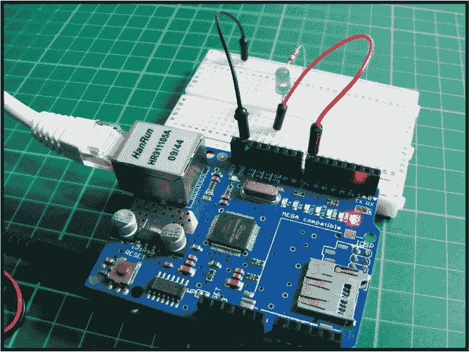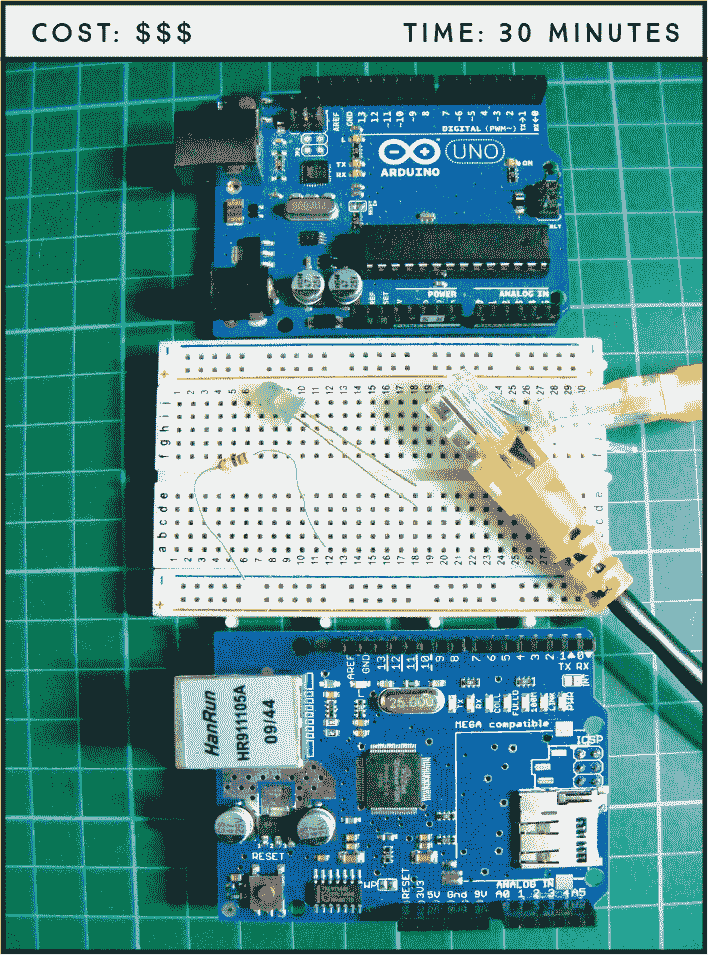

**所需部件**

**Arduino 主板**

**面包板**

**跳线**

**W5100 以太网扩展板**

**以太网电缆**

**LED**

**220 欧姆电阻**

**所需库**

**SPI**

**以太网**

*物联网（IoT）*正在彻底改变我们使用日常物品的方式。这个术语指的是通过网络连接的物体或智能设备，通常涉及互联网。这使我们能够远程控制设备，无论是在家里还是在外面！亚马逊 Echo 和谷歌 Home 通过允许多个设备通过中央控制中心连接和控制，即使您不在家里，也能进一步推动这一进程。我们将以物联网项目的最基本形式来展示相关原理。

### 工作原理

以太网扩展板 W5100 LAN 扩展板，如图 23-1 所示，直接安装在 Arduino 上，为板子提供额外的功能。我们将使用内置于 Arduino IDE 中的以太网库，通过以太网线将我们的板子连接到互联网，如图 23-2 所示。

**图 23-1：** 以太网扩展板

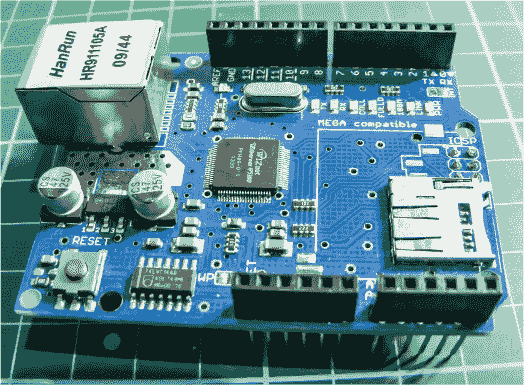

**图 23-2：** 以太网电缆

该库允许 Arduino 充当服务器以接收传入命令，充当客户端发送命令，或同时充当两者。该扩展板通过*串行外设接口（SPI）*连接与 Arduino 进行通信。在 Arduino Uno 上，SPI 连接位于数字引脚 10、11、12 和 13 上。在我们的项目中，Arduino 将同时使用这两种功能，将信息以简单网页的形式发送到互联网，并从该页面接收命令以控制 LED。网页上的按钮将允许我们开启或关闭 LED，只要 Arduino 处于通电状态并连接到互联网。

### 设置您的以太网连接

您需要知道您扩展板的 MAC 地址，以使该项目正常工作。*MAC 地址*是分配给设备的唯一编号，用于通信，并作为以太网和 Wi-Fi 的网络地址。如果您的扩展板较新，MAC 地址将打印在产品标签上。如果您使用的是较旧的通用以太网扩展板，如我们正在使用的这款，您可以使用 MAC 地址 0xDE, 0xAD, 0xBE, 0xEF, 0xFE, 0xED 来完成本项目。

我们将使用端口 80 进行通信，这是 HTTP 的默认端口。HTTP 是超文本传输协议的缩写，是通过互联网传输数据的一套规则。在本例中，端口 80 负责将数据传输到网页。

我们的草图中包含一些 HTML（超文本标记语言）代码，告诉网页浏览器如何显示互联网页面。如果您右键单击任何网页并选择“检查”，您可以看到该页面背后的部分 HTML 代码。

我们草图中包含的 HTML 代码部分如下，并生成了图 23-3 中显示的网页。

client.println("HTTP/1.1 200 OK");

client.println("Content-Type: text/html");

client.println();

client.print("
 <h1>互联网控制 LED</h1>   <FORM>");

client.print("
 <INPUT type=\"submit\" name=\"status\"value=\"ON\">");

client.print("
 <INPUT type=\"submit\" name=\"status\"value=\"OFF\">");

client.print("</FORM>
");

**图 23-3：** 我们控制 LED 的简单网页

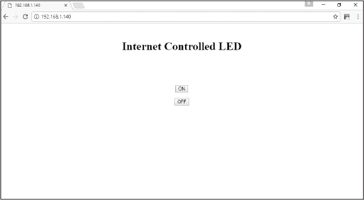

### 搭建过程

1.  将以太网扩展板按照图 23-4 所示安装在 Arduino 板上。该扩展板直接与 Arduino 连接，所以轻轻按压扩展板的插针，使其与 Arduino 下方的孔对接。

    **图 23-4：** 将以太网扩展板安装在 Arduino 板上。

    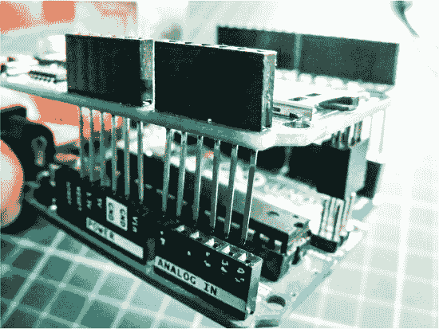

1.  将 LED 插入面包板，使其两脚跨过面包板的中间断点。然后，如下表所示，将 LED 的较短负极脚通过 220 欧姆电阻连接到面包板的 GND 轨道，将 LED 的较长正极脚连接到 Arduino/以太网扩展板的引脚 7。将面包板的 GND 轨道连接到 Arduino 的 GND。

    | **LED** | **Arduino** |
    | --- | --- |
    | 负极 | 通过 220 欧姆电阻连接到 GND |
    | 正极 | 引脚 7 |

1.  将以太网扩展板安装在 Arduino 上后，通过以太网电缆将扩展板连接到路由器。

    **注意**

    *请注意你的 IP 地址，它将不同于图 23-5 中显示的我的地址。*

1.  将 Arduino 连接到 PC，并使用 IDE 上传项目末尾的代码。上传代码后，打开 IDE 的串口监视器，以确定 Arduino 的*IP 地址*（一个用于识别连接到互联网设备的唯一数字字符串），它作为我们的服务器运行。你应该看到类似于图 23-5 的内容。

    **图 23-5：** Arduino 扩展板的 IP 地址将在串口监视器中显示。

    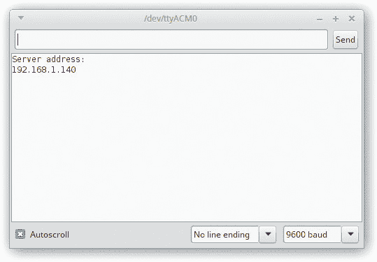

1.  打开任意网页浏览器，输入你的 IP 地址。你应该能看到一个网页，其中有一个开（On）和一个关（Off）按钮，如图 23-3 中所示。按下开按钮点亮 LED，按下关按钮则关闭 LED。

1.  这个项目即使在没有连接本地网络时也可以运行，只要你在互联网路由器上开放了 80 端口。许多互联网服务提供商（ISP）出于安全原因会屏蔽此端口，因此如有需要，请按照 ISP 的指示修改设置。

    **警告**

    *仅在你了解安全风险并且知道如何最小化这些风险的情况下执行此操作。*

1.  确认你的连接与图 23-6 中的电路图一致，然后在第 208 页上传 “程序代码” 中的代码。

    **图 23-6：** 用于互联网控制 LED 的电路图

    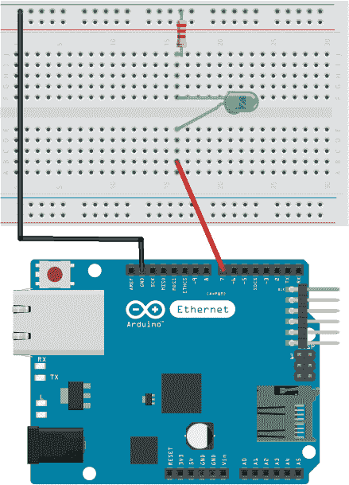

### 程序代码

该草图调用了 SPI 和以太网库来控制与互联网的通信。我们为扩展板定义了 MAC 地址。如果您的扩展板自带 MAC 地址，您需要修改这一行；如果没有，则本项目中早些时候提供的地址和代码中显示的地址应该能正常工作。然后，我们将服务器设置为使用 80 端口，并将 Arduino 的 7 号引脚定义为 LED 引脚。

setup 定义了 LED 引脚为输出，启动了以太网扩展板，并启动了串行通信，以便我们可以看到服务器的 IP 地址。loop 函数设置了网页，当它被调用时会传送给浏览器，并等待浏览器的输入。按下打开按钮时，服务器指示 Arduino 将 LED 引脚设置为 `HIGH`，LED 会亮起。按下关闭按钮时，LED 的电源被设置为 `LOW`，LED 会关闭。

你可以轻松地将 LED 替换为继电器开关，例如第 12 项项目中使用的那种，用来控制更大电压的设备。

#include <SPI.h>

#include <Ethernet.h>

// 扩展板的 MAC 地址

byte mac[] = {0xDE, 0xAD, 0xBE, 0xEF, 0xFE, 0xED};

EthernetServer server(80);  // 使用端口 80

int led = 7;  // LED 连接到引脚 7

void setup() {

pinMode(led, OUTPUT); // 设置 LED 为输出模式

Ethernet.begin(mac);  // 启动以太网扩展板

server.begin();

Serial.begin(9600);  // 启动串行通信

Serial.println("服务器地址：");  // 打印服务器地址

// （Arduino 扩展板）

Serial.println(Ethernet.localIP());

}

void loop() {

EthernetClient client = server.available();

if (client) {

boolean currentLineIsBlank = true;

String buffer = "";

while (client.connected()) {

if (client.available()) {

char c = client.read(); // 从以太网扩展板读取数据

buffer += c; // 将字符添加到字符串缓冲区

// 客户端发送请求，现在等待响应

if (c == '\n' && currentLineIsBlank) {

client.println("HTTP/1.1 200 OK"); // HTTP 响应

client.println("Content-Type: text/html");

client.println(); // HTML 代码

client.print("
 <h1>互联网控制 LED</h1>   <FORM>");

client.print("
 <INPUT type=\"submit\" name=\"status\"value=\"ON\">");

client.print("
 <INPUT type=\"submit\" name=\"status\"value=\"OFF\">");

client.print("</FORM>
");

break;

}

if (c == '\n') {

currentLineIsBlank = true;

buffer = "";

}

else if (c == '\r') { // 来自网页的命令

// 按下了打开按钮吗

if (buffer.indexOf("GET /?status=ON") >= 0)

digitalWrite(led, HIGH);

// 按下了关闭按钮吗

if (buffer.indexOf("GET /?status=OFF") >= 0)

digitalWrite(led, LOW);

}

else {

currentLineIsBlank = false;

}

}

}

client.stop(); // 结束服务器

}

}

### 故障排除

**问。** *代码已编译，但 LED 没有按预期点亮。*

• 首先，确保你已经将 Arduino 的 GND 线连接到正确的面包板电源轨，并且 Arduino 已连接电源。

• 检查电阻是否完全插入并与对应的 LED 引脚对齐。

• 尝试通过连接到局域网并使用该 PC 连接 Arduino 来检查项目是否正常工作。

**Q.** *你在调用网页时收到错误。*

• 确保你按照之前给出的步骤准确输入了服务器的 IP 地址。

• 最好通过连接到局域网并使用该 PC 连接 Arduino 来检查项目是否正常工作。

• 如果项目在你将其连接到局域网时能正常工作，但在连接到外部互联网时收到 HTTP 403 错误，则可能是你的 ISP 阻止了传入的流量。你可以在路由器上为端口 80 添加*端口转发*。这对每个设备来说都不同，所以请与 ISP 联系，获取详细的说明。你可以快速搜索你的 ISP 和“端口转发”作为关键词，按照说明进行操作，但要注意：这可能会危及你 PC 的安全，仅在你理解风险并能够保护你的网络时进行。

## 语音控制 LED**

在这个项目中，我们将使用蓝牙模块、智能手机和语音识别应用程序来通过语音命令控制 LED。

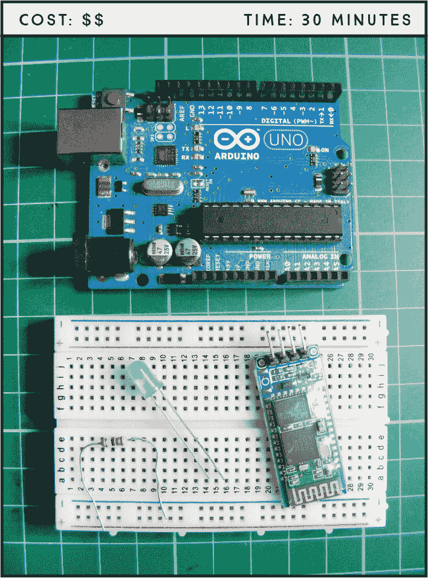

**所需组件**

**Arduino 板**

**面包板**

**跳线**

**HC-06 蓝牙模块**

**LED**

**220 欧姆电阻**

**安卓智能手机**

### 工作原理

蓝牙无线技术利用无线电波在短距离内传输和交换数据。智能手机、笔记本电脑和多媒体设备（如扬声器）使用蓝牙作为常见标准。我们将使用廉价的 HC-06 蓝牙模块（图 24-1）将 Arduino 与智能手机配对（连接），这样我们就可以通过语音识别应用程序远程开关 LED。该模块有六个引脚，但我们只使用中间的四个。引脚应在前面标注。

**图 24-1：** HC-06 蓝牙模块

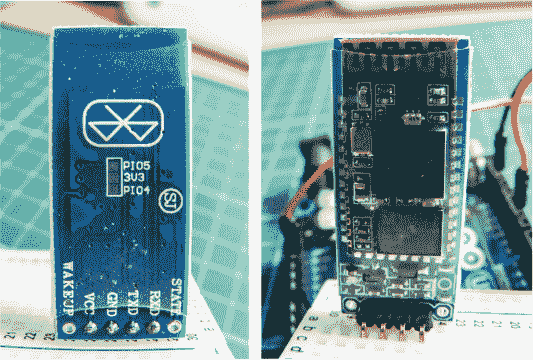

我们将使用的应用程序是 BroxCode 的 Arduino Bluetooth Control，安卓设备可以在 Google Play 商店免费下载。还有许多其他类似的免费应用程序适用于安卓和苹果设备，使用原理应该相同，但 BroxCode 应用程序具有一些额外功能，我们在这个项目中使用了这些功能，例如通过 Google 助手进行语音识别。

### 构建

在构建蓝牙控制器之前，你需要将代码上传到 Arduino。这是因为从 PC 到 Arduino 的串行通信使用了与我们将连接到蓝牙模块的相同引脚。

1.  上传“草图”中的代码，见第 220 页，然后将蓝牙模块插入面包板，并将 VCC 连接到面包板的正电源轨，GND 连接到 GND 电源轨，TXD 连接到 Arduino 的 0 号引脚（RX），RXD 连接到 Arduino 的 1 号引脚（TX），如下面的表格所示。

    | **HC-06 蓝牙模块** | **ARDUINO** |
    | --- | --- |
    | VCC | +5V |
    | GND | GND |
    | TXD | 引脚 0 (RX) |
    | RXD | 引脚 1 (TX) |

1.  将 LED 插入面包板，确保其引脚跨越中心断开。使用 220 欧姆电阻将 LED 的较短负极引脚连接到面包板的 GND 轨道。使用跳线将 LED 的较长正极引脚连接到 Arduino 的引脚 9，具体如下面的表格所示。

    | **LED** | **ARDUINO** |
    | --- | --- |
    | 正极腿 | 引脚 9 |
    | 负极腿 | GND |

1.  将面包板的 GND 轨道连接到 Arduino 的 GND，正极轨道连接到 Arduino 的+5V。

1.  检查你的电路图是否与图 24-2 一致。

    **图 24-2：** 蓝牙语音控制 LED 的电路图

    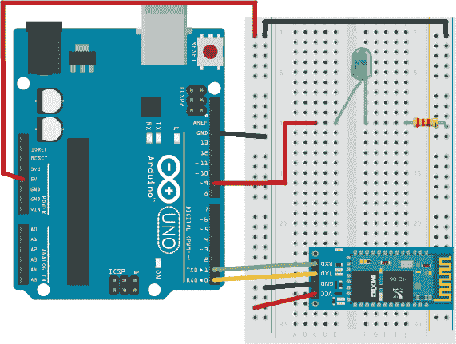

### ARDUINO 蓝牙控制

Arduino 蓝牙控制应用程序提供了六种控制选项，所有选项都通过不同的方式将数据发送到 Arduino（见图 24-3）。你可以根据自己的偏好定制每个选项。

**图 24-3：** Arduino 蓝牙控制应用程序的菜单屏幕

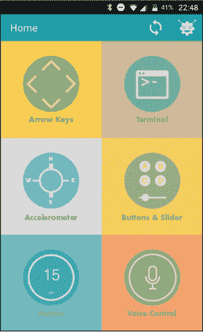

• **方向键：** 这里你可以找到可定制的箭头按钮。

• **终端：** 这是一个经典的终端，用于发送和接收数据，每个操作都有时间戳。

• **加速度计：** 这个工具通过手机的手势传感器读取运动。

• **按钮和滑块：** 这里你可以找到六个完全可定制的按钮以及一个在旋转设备时显示的滑块视图。你可以设置该滑块的数据范围。

• **度量标准：** 该工具已优化，能够通过 Arduino 的`println()`函数接收数据，这使得你配对的手机可以通过短信从另一部手机接收通知。你只需在设置部分指定号码即可。此功能稍后会进一步解释。

• **语音控制：** 这个强大的工具利用你的 Android 设备上的 Google 语音命令，让你定制自己的语音命令，并用它们控制 Arduino。

现在你需要从 Google Play 应用商店下载 Arduino 蓝牙控制应用程序并进行设置。

1.  访问 *[`play.google.com/store/`](https://play.google.com/store/)* 并搜索 “Arduino Bluetooth Control”。你可能会在搜索结果中找到多个应用程序，但你需要的正是名为 “Arduino Bluetooth Control” 的那个，正如图 24-4 所示。点击 **安装** 将其下载到你的设备。该应用程序是免费的，但包含一些广告。

    **图 24-4：** 来自 BroxCode 的 Arduino 蓝牙控制应用程序，来自 Google Play

    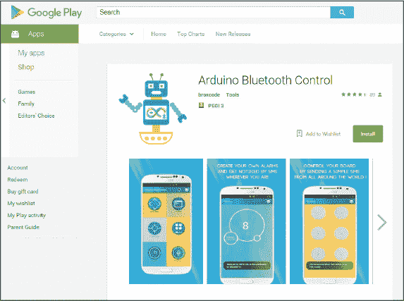

1.  下载应用程序后，给 Arduino 供电以启动蓝牙模块。进入手机的蓝牙设置，打开蓝牙，选择**更多设置**以查看可见设备。你应该看到 HC-06 模块作为可用设备，选择它与手机配对。系统会要求输入密码：默认密码为 1234，有时是 0000，如果第一个密码不行，可以尝试第二个。

1.  当设备配对完成后，打开 Arduino 蓝牙控制应用程序。在出现的窗口中显示所有可用设备，选择 HC-06 模块，如图 24-5 所示。你不需要每次开机时都选择设备——应用程序会记住它。

    **图 24-5：** 配对你的设备

    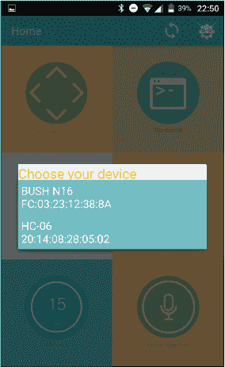

1.  你将使用语音控制功能，通过对智能手机说出特定命令来打开和关闭 LED。选择语音控制功能，系统将带你进入设置菜单，如图 24-6 所示。选择**语音命令配置**。我们将使用这个来定义输入和输出功能。

    **图 24-6：** 选择语音命令配置设置

    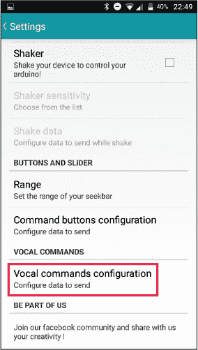

1.  选择**语音命令 n°1**，如图 24-7 所示。

    **图 24-7：** 设置你的第一个语音命令

    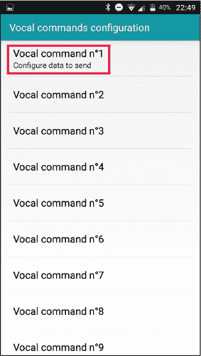

1.  在这里，你提供触发第一个功能的输入。输入 `light on` 作为文本，如图 24-8 左侧屏幕所示。应用程序将询问你在输入命令时要发送到 Arduino 的输出数据。在这个屏幕上，输入 `1` 来开启 LED 或输入 `HIGH`，正如我们在之前的 LED 项目中看到的那样（如图 24-8 右侧屏幕所示）。当应用程序通过手机接收到语音命令`light on`时，数字 `1` 将作为输入发送到 Arduino，电源将供应给 LED，从而点亮它。

1.  执行相同的步骤，定义语音命令 n°2，输入为 `light off`，输出数据为 `0`，如图 24-9 所示。此命令将关闭 LED。

现在你已经配置了命令，按下语音命令功能并点击屏幕上的麦克风按钮后，应用程序将监听你的命令，并根据输入内容切换 LED 的开关。

**图 24-8：** 配置我们通过语音命令“light on”打开 LED

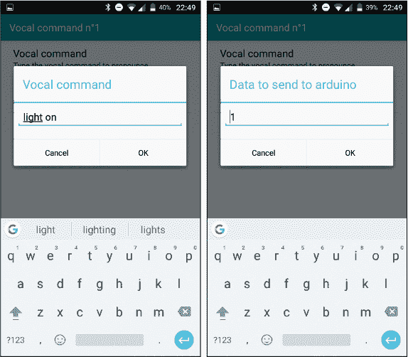

**图 24-9：** 配置“light off”功能

这个应用程序还有一个功能，可以让你通过短信控制 Arduino。一旦应用程序启动并连接到 Arduino，你可以通过向与蓝牙模块配对的手机发送短信，将数据发送到 Arduino，只要配对的手机在模块的范围内。只需向连接到 Arduino 的手机发送`Arduino 1`，该手机将发送`1`到模块以点亮 LED。发送`Arduino 0`，则会发送`0`来关闭 LED。通过这种方式，你可以在全球任何地方通过蓝牙进行控制！

### 草图

这个项目的草图非常简单。它首先创建一个变量来保存来自蓝牙模块的数据。它将串口通信的数据传输速率设置为`9600`，并将 9 号引脚设置为输出，以控制我们的 LED。在循环中，它检查是否有数据从蓝牙模块发送到 Arduino。循环读取数据，并将其发送到串口监视器，以便我们检查它是否正常工作。如果 Arduino 从应用程序接收到`1`，9 号引脚将被设置为`HIGH`，这将点亮 LED。如果 Arduino 接收到`0`，9 号引脚将设置为`LOW`，LED 将关闭。

使用这些原理，你可以在 LED 的位置添加多个继电器，并开始从任何地方自动化你的家。你可以设置它，在你进入家之前打开客厅的灯，回家时设置恒温器，或者在你走进门时已经播放你最喜欢的音乐。

char data = 0; // 创建一个用于存储数据的变量

void setup() {

Serial.begin(9600); // 串口通信的数据传输速率

pinMode(9, OUTPUT); // 设置 9 号引脚为输出

}

void loop() {

if (Serial.available() > 0) { // 发送数据

data = Serial.read(); // 读取传入的数据并

// 将其存储到变量 data 中

Serial.print(data); // 将数据值打印到串口监视器

Serial.print("\n"); // 开始新的一行

if (data == '1') // 如果值为 1，点亮 LED

digitalWrite(9, HIGH);

else if (data == '0') // 如果值为 0，关闭 LED

digitalWrite(9, LOW);

}

}

### 故障排除

**问：** *代码编译通过，但 LED 没有亮。*

• 确保你已经将 Arduino 的 GND 和电源引脚连接到正确的面包板电源轨，并且 Arduino 已连接电源。

• 确保 LED 插入正确，较长的引脚连接到正电源，较短的引脚连接到 GND。检查电阻是否完全插入并与相应的 LED 引脚对齐。

• 在项目通电并连接到 PC 后，打开 Arduino IDE 的串口监视器，查看 Arduino 是否从应用程序接收数据。如果在串口监视器中没有看到数据流，检查模块的 TXD 是否连接到 Arduino 的 RX，模块的 RXD 是否连接到 Arduino 的 TX。

• 如果应用程序在智能手机上打开时无法正常工作，请检查手机与开发者网站上的应用程序的兼容性。你可能需要使用替代应用程序。

• 你应用中的数据集必须与草图中预期的数据匹配，因此确保使用`1`表示开启，`0`表示关闭。

## GPS 速度计**

在这个项目中，我们将连接一个 OLED 屏幕和 GPS 模块到 Arduino 上，创建一个简单的 GPS 速度计，用于通过卫星跟踪你的速度。

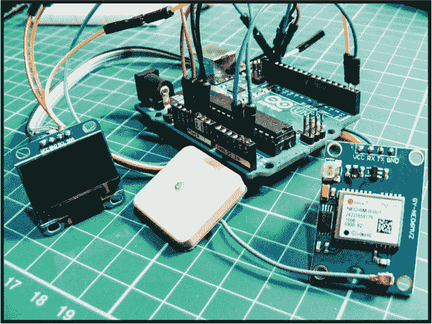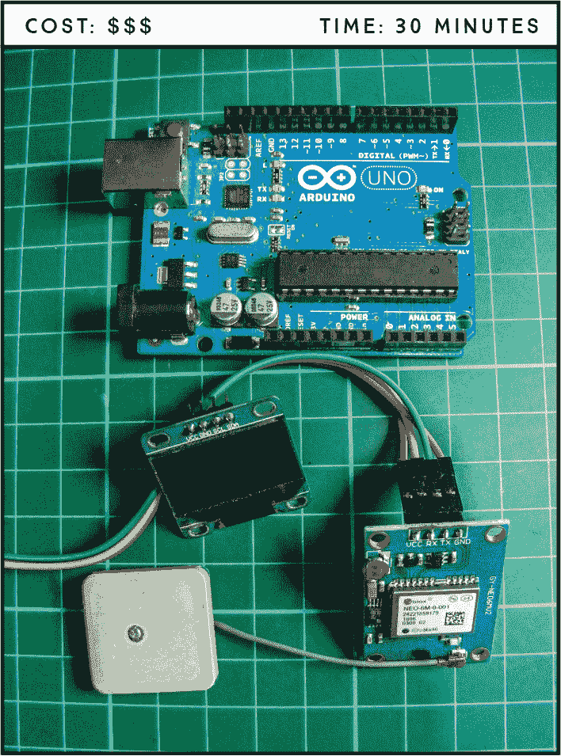

**所需零件**

**Arduino 板**

**母对公跳线**

**OLED 单色屏（128×64）**

**Ublox NEO-6M GPS 模块 航空器飞行控制器与天线**

**所需库**

**U8glib**

### 工作原理

本项目中使用的 Ublox NEO-6M GPS 模块（图 25-1）是一款廉价的设备，通常用于跟踪模型飞机或无人机的位置。该模块在供应商列表中有广泛的供应，供应商列表可以在《零售商列表》中找到，或你可以在网上搜索“Ublox NEO-6M GPS 模块”。请确保购买的模块也附带 GPS 天线，如图 25-2 所示。

**图 25-1：** Ublox NEO-6M GPS 模块

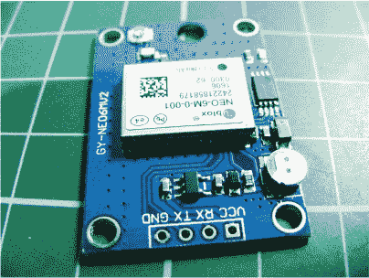

**图 25-2：** GPS 天线

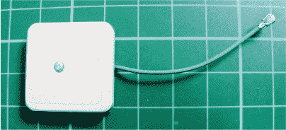

该模块使用*GPS（全球定位系统）*技术来确定 Arduino 的精确位置，并在 OLED 屏幕上以公里每小时为单位显示其速度（有关 OLED 屏幕的更多内容，请参见项目 19）。GPS 由 32 颗卫星组成，这些卫星环绕地球运转，并被广泛应用于日常技术中，如汽车卫星导航系统、智能手机和追踪器。

Navstar 全球定位系统最初由美国政府在 1970 年代创建，最初用于军事目的，但现在任何拥有 GPS 接收设备的人都可以自由使用该系统，如果你拥有智能手机，可能也包括你。为了定位接收器的位置，该系统使用卫星、地面控制站和你的设备来计算信号传送和接收的距离、速度和时间——通过这些，它可以确定你的位置信息。

Ublox NEO-6M GPS 模块持续接收卫星信号并将其发送到 Arduino，以确定你的位置信息。一旦你开始移动，你的速度将以公里每小时的单位发送到 OLED 屏幕，作为我们的速度计。

尽管这个项目的功能相当复杂，但构建过程非常简单。板子附带的针脚是分开的，因此在开始之前需要将它们焊接到位。如果你需要焊接指导，请参阅《快速焊接指南》中的内容，该指南位于第 12 页。该板已内置所有 GPS 电路，但你需要将 GPS 天线夹到板子上；我稍后会向你展示如何操作。

### 构建过程

1.  请使用图 25-3 中显示的 OLED 单色屏，并使用母对公跳线连接以下表格中的内容。由于 OLED 屏幕使用 3.3V 电压，请确保将其连接到 Arduino 的 3.3V，而不是 5V，否则可能会损坏屏幕。

    **图 25-3：** OLED 单色屏显示运动速度（右侧数字为时速，单位为公里/小时）。

    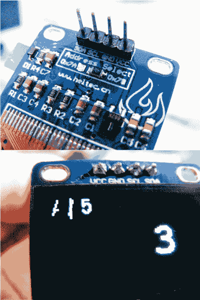

    | **OLED 屏幕** | **Arduino** |
    | --- | --- |
    | VCC | +3.3V |
    | GND | GND |
    | SCL | 引脚 A5 |
    | SDA | 引脚 A4 |

1.  GPS 模块使用 Arduino 的 RX 和 TX 引脚进行通信，但在从 PC 上传草图时，你也需要这些引脚。现在上传“草图”中的代码，该代码位于第 227 页，这样这些引脚就能空闲出来。将 Arduino 连接到你的 PC。记得首先下载 U8glib 库并将其添加到 Arduino IDE 的相关文件夹中。

1.  上传草图后，断开 Arduino 与电脑的连接，并将 GPS 的 VCC 连接到 Arduino 的 +5V，GND 连接到 GND，GPS 的 TX 连接到 Arduino 引脚 0 (RX)，GPS 的 RX 连接到 Arduino 引脚 1 (TX)，如下表所示。

    | **GPS 模块** | **Arduino** |
    | --- | --- |
    | VCC | +5V |
    | GND | GND |
    | TX | 引脚 0 (RX) |
    | RX | 引脚 1 (TX) |

1.  如图 25-4 所示，将天线的末端夹入模块的插座中。

    **图 25-4：** 将天线的末端夹到 GPS 模块的插座上。

    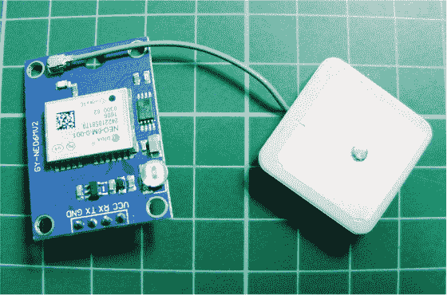

1.  确认你的连接与图 25-5 中的电路图一致。

    **图 25-5：** GPS 车速计的电路图

    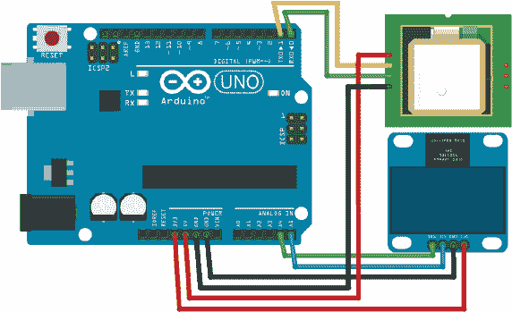

1.  给 Arduino 供电，GPS 车速计就可以开始使用了。天线需要朝上才能工作，如图 25-4 所示，最好在户外使用，因为 GPS 模块需要与轨道上的卫星保持视距才能正常工作（尽管我也在室内靠近窗户时成功过，所以可以试试看哪种方式适合你）。

1.  GPS 模块大约需要 30 秒左右连接卫星。当连接成功时，模块的 LED 灯会闪烁，OLED 屏幕左上角的符号会旋转。

### 草图

草图首先调用 U8glib 库，然后定义 OLED，以便我们可以控制屏幕。我们将 GPS 模块定义为串行连接，并告诉它我们希望从卫星接收哪些信息。

**注意**

*记得在上传草图之前断开 Arduino 0 (RX) 引脚连接，上传完成后再重新连接。*

代码的下一部分包含一个长列表的数据。这部分相当复杂，Ublox NEO-6M 的数据手册详细列出了模块可以接收到的所有信息，如果你感兴趣的话。对于我们的项目，➊处的代码包含相关数据：NAV-PVT 数据，包括模块连接的卫星数量和 GPS 测速仪的地面速度。其余的请求信息未被使用，设置为`关闭`。

接下来的部分定义了 NAV-PVT 设置，并通过一些计算检查从卫星接收到的数据是否有效。

草图结尾的循环检查是否接收到数据，如果有，则会在 OLED 的左上角动画化符号。第一个符号显示屏幕是否正确刷新，第二个符号显示是否从卫星接收到 GPS 数据包。屏幕还会显示连接到的卫星数量，位于左上方。

如果所有数据都按预期接收，地面速度将显示在屏幕右上方，以公里每小时为单位。

// 草图由 Chris Campbell 的友好许可复制作

/*

连接：

GPS TX -> Arduino 0 // 断开 Arduino 0 以上传此草图

GPS RX -> Arduino 1

屏幕 SDA -> Arduino A4

屏幕 SCL -> Arduino A5

*/

#include "U8glib.h" // 调用 U8glib 库以控制 OLED 屏幕

U8GLIB_SSD1306_128X64 u8g(U8G_I2C_OPT_DEV_0|U8G_I2C_OPT_NO_ACK|U8G_I2C_OPT_FAST); // 快速 I2C/TWI

#define GPS Serial // 将串口连接定义为 GPS 模块

const unsigned char UBLOX_INIT[] PROGMEM = {

// 这些代码行请求来自卫星的数据。大多数已禁用并关闭。

// 禁用 NMEA

0xB5,0x62,0x06,0x01,0x08,0x00,0xF0,0x00,0x00,0x00,0x00,0x00,0x00,0x01,0x00,0x24, // GxGGA 关闭

0xB5,0x62,0x06,0x01,0x08,0x00,0xF0,0x01,0x00,0x00,0x00,0x00,0x00,0x01,0x01,0x2B, // GxGLL 关闭

0xB5,0x62,0x06,0x01,0x08,0x00,0xF0,0x02,0x00,0x00,0x00,0x00,0x00,0x01,0x02,0x32, // GxGSA 关闭

0xB5,0x62,0x06,0x01,0x08,0x00,0xF0,0x03,0x00,0x00,0x00,0x00,0x00,0x01,0x03,0x39, // GxGSV 关闭

0xB5,0x62,0x06,0x01,0x08,0x00,0xF0,0x04,0x00,0x00,0x00,0x00,0x00,0x01,0x04,0x40, // GxRMC 关闭

0xB5,0x62,0x06,0x01,0x08,0x00,0xF0,0x05,0x00,0x00,0x00,0x00,0x00,0x01,0x05,0x47, // GxVTG 关闭

// 禁用 UBX

0xB5,0x62,0x06,0x01,0x08,0x00,0x01,0x07,0x00,0x00,0x00,0x00,0x00,0x00,0x17,0xDC, // NAV-PVT 关闭

0xB5,0x62,0x06,0x01,0x08,0x00,0x01,0x02,0x00,0x00,0x00,0x00,0x00,0x00,0x12,0xB9, // NAV-POSLLH 关闭

0xB5,0x62,0x06,0x01,0x08,0x00,0x01,0x03,0x00,0x00,0x00,0x00,0x00,0x00,0x13,0xC0, // NAV-STATUS 关闭

// 启用 UBX——这是我们需要的关键信息

➊   0xB5,0x62,0x06,0x01,0x08,0x00,0x01,0x07,0x00,0x01,0x00,0x00,0x00,0x00,0x18,0xE1, //NAV-PVT 开启

//0xB5,0x62,0x06,0x01,0x08,0x00,0x01,0x02,0x00,0x01,0x00,0x00,0x00,0x00,0x13,0xBE, //NAV-POSLLH 开启

//0xB5,0x62,0x06,0x01,0x08,0x00,0x01,0x03,0x00,0x01,0x00,0x00,0x00,0x00,0x14,0xC5, //NAV-STATUS 开启

// 频率

0xB5,0x62,0x06,0x08,0x06,0x00,0x64,0x00,0x01,0x00,0x01,0x00,0x7A,0x12,    // （10Hz）

// 0xB5,0x62,0x06,0x08,0x06,0x00,0xC8,0x00,0x01,0x00,0x01,0x00,0xDE,0x6A, // （5Hz）

// 0xB5,0x62,0x06,0x08,0x06,0x00,0xE8,0x03,0x01,0x00,0x01,0x00,0x01,0x39  // （1Hz）

};

常量无符号字符 UBX_HEADER[] = { 0xB5, 0x62 };

结构体 NAV_PVT { // 设定 GPS 导航数据

无符号字符 cls;

无符号字符 id;

无符号短整型 len;

无符号长整型 iTOW; // 导航周期的 GPS 时间周（毫秒）

无符号短整型 year;     // 年份 (UTC)

无符号字符 month;     // 月份，范围 1..12 (UTC)

无符号字符 day;        // 月日，范围 1..31 (UTC)

无符号字符 hour;      // 小时，范围 0..23 (UTC)

无符号字符 minute;    // 分钟，范围 0..59 (UTC)

无符号字符 second;    // 分钟中的秒数，范围 0..60 (UTC)

字符 valid;            // 有效性标志（见下图）

无符号长整型 tAcc;      // 时间精度估计（UTC）（纳秒）

长整型 nano;               // 秒的小数部分，范围 -1e9 .. 1e9 (UTC)（纳秒）

无符号字符 fixType;   // GNSS 修复类型，范围 0..5

字符 flags;            // 修复状态标志

无符号字符 reserved1; // 保留

无符号字符 numSV;     // 导航解算中使用的卫星数量

长整型 lon;           // 经度（度）

长整型 lat;           // 纬度（度）

长整型 height;        // 椭球体以上的高度（毫米）

长整型 hMSL;          // 平均海平面以上的高度（毫米）

无符号长整型 hAcc; // 水平精度估计（毫米）

无符号长整型 vAcc; // 垂直精度估计（毫米）

长整型 velN;            // NED 北向速度（毫米/秒）

长整型 velE;            // NED 东向速度（毫米/秒）

长整型 velD;            // NED 向下速度（毫米/秒）

长整型 gSpeed;            // 地面速度（2-D）（毫米/秒）

长整型 heading;            // 运动的航向 2-D（度）

无符号长整型 sAcc;       // 速度精度估计

无符号长整型 headingAcc; // 航向精度估计

无符号短整型 pDOP;      // 位置精度衰减

短整型 reserved2;          // 保留

无符号长整型 reserved3;  // 保留

};

NAV_PVT pvt;

无返回类型 calcChecksum(无符号字符* CK) {

memset(CK, 0, 2);

对于 (int i = 0; i < (int)sizeof(NAV_PVT); i++) {

CK[0] += ((无符号字符*)(&pvt))[i];

CK[1] += CK[0];

}

}

长整型 numGPSMessagesReceived = 0;

布尔类型 processGPS() {

静态整型 fpos = 0;

静态无符号字符 checksum[2];

常量整型 payloadSize = sizeof(NAV_PVT);

当 GPS.available() 时 {

字节 c = GPS.read();

如果 ( fpos < 2 ) {

如果 ( c == UBX_HEADER[fpos] )

fpos++;

否则

fpos = 0;

}

否则 {

如果 ( (fpos-2) < payloadSize )

((无符号字符*)(&pvt))[fpos-2] = c;

fpos++;

如果 ( fpos == (payloadSize+2) ) {

calcChecksum(checksum);

}

否则如果 ( fpos == (payloadSize+3) ) {

如果 ( c != checksum[0] )

fpos = 0;

}

否则如果 ( fpos == (payloadSize+4) ) {

fpos = 0;

如果 ( c == checksum[1] ) {

返回 true;

}

}

否则如果 ( fpos > (payloadSize+4) ) {

fpos = 0;

}

}

}

返回 false;

}

无返回类型 setup() {

GPS.begin(9600);

u8g.setColorIndex(1);

// 通过 UBX 协议发送配置数据

for (unsigned int i = 0; i < sizeof(UBLOX_INIT); i++) {

GPS.write( pgm_read_byte(UBLOX_INIT+i) );

delay(5); // 模拟 38400 波特率的速度（或更低）

// 或者设备未接受命令

}

}

long gSpeed = 0;

int numSV = 0;

unsigned long lastScreenUpdate = 0;

char speedBuf[16];

char satsBuf[16];

char* spinner = "/-\\|"; // 屏幕上的旋转符号

// 显示通信状态

byte screenRefreshSpinnerPos = 0;

byte gpsUpdateSpinnerPos = 0;

void loop() {

if (processGPS()) {

numSV = pvt.numSV;

gSpeed = pvt.gSpeed;

gpsUpdateSpinnerPos = (gpsUpdateSpinnerPos + 1) % 4;

}

unsigned long now = millis();

if (now - lastScreenUpdate > 100) {

updateScreen();

lastScreenUpdate = now;

screenRefreshSpinnerPos = (screenRefreshSpinnerPos + 1) % 4;

}

}

void draw() {

u8g.setFont(u8g_font_courB24);

u8g.drawStr( 36, 45, speedBuf);

u8g.setFont(u8g_font_fur11);

u8g.drawStr( 2, 12, satsBuf);

}

void updateScreen() {

int kmh = gSpeed * 0.0036;

sprintf(speedBuf, "%3d", kmh);

sprintf(satsBuf, "%c %c %d", spinner[screenRefreshSpinnerPos], spinner[gpsUpdateSpinnerPos], numSV);

u8g.firstPage();

do {

draw();

} while( u8g.nextPage() );

}

### 故障排除

**Q.** *代码编译通过，但预期信息未显示在屏幕上。*

• 如果 OLED 屏幕上什么都没有显示，请重新检查接线是否与图 25-5 一致；TX 和 RX 线很容易接错。

• 屏幕左上角的符号会旋转，表示屏幕工作正常并且 GPS 模块正在接收数据。如果最左边的符号旋转而 GPS 符号没有旋转，说明你的 TX 和 RX 线接错了；请重新检查模块的接线。

• GPS 模块在户外效果最佳，应该能看到绕地球轨道的卫星，所以请尝试重新放置模块，直到获得信号读取。稳定信号的获取可能需要 30 到 60 秒。

• 请记住，OLED 屏幕应连接到 3.3V，而不是 5V。
