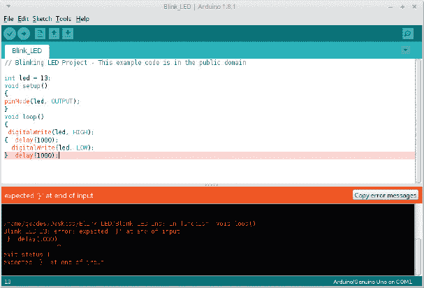
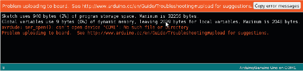
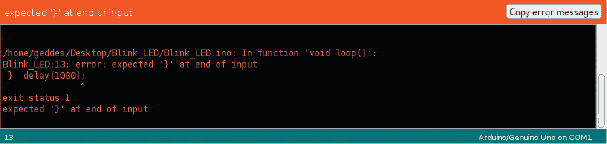
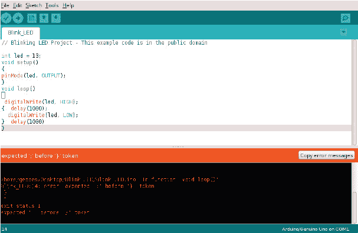
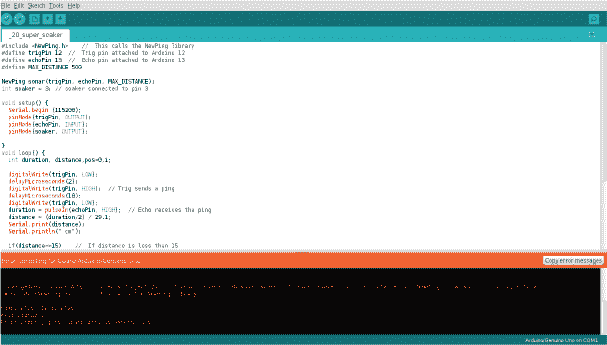

## 第八章：常见错误的故障排除提示

本书中所有项目的草图都可以从 [`www.nostarch.com/arduinohandbook2/`](https://www.nostarch.com/arduinohandbook2/) 下载，并且已经过验证可以正常工作。然而，当你在 Arduino IDE 中编译一个草图时，可能会遇到一些问题。

本节将介绍三种最常见的错误类型，解释它们的原因以及如何修复。当出现错误时，IDE 底部的监视框会高亮显示导致错误的代码行，如 图 A-1 所示。此信息对于修复代码非常有价值。

**图 A-1：** IDE 将高亮显示出错的代码行。

### 上传错误

当你上传代码时，你会看到类似于 图 A-2 中的错误信息，内容如下：

avrdude: ser_open(): 无法打开设备 "COM1"：没有此文件或目录

目录

**图 A-2：** 错误信息“上传到板子时出现问题”

#### 解决方案

这个错误通常意味着 IDE 无法找到你的 Arduino 板。尝试以下解决方案之一：

• 检查你的 USB 连接是否已牢固插入 PC 的 USB 端口。

• 在 IDE 中，打开 **工具** 标签并选择 **端口**。从下拉菜单中，你应该看到一个 COM 端口被高亮显示。如果这不是你的 Arduino 所连接的端口，请选择正确的端口。

• 如果正确的端口已经被高亮显示，验证是否选择了正确的板类型：打开 **工具** 标签，选择 **板**，从下拉菜单中确保你连接的 Arduino 板被高亮显示。默认设置为 Arduino Uno。

• 你还可以查看 Arduino 文档以获取更多可能的解决方案： *[`www.arduino.cc/en/Guide/Troubleshooting#upload`](http://www.arduino.cc/en/Guide/Troubleshooting#upload)*。

### 代码验证错误 #1

当你验证代码时，你会收到类似于 图 A-3 中的错误信息，内容如下：

expected '}' at end of input

**图 A-3：** 错误信息“expected `'}'` at end of input”

#### 解决方案

检查每个开括号 (`{`) 是否都有一个闭括号 (`}`)，如果没有，则添加闭括号。大括号定义了代码块的开始和结束，每个打开的括号都需要有一个闭括号来完成一个函数或循环。在这种情况下，你需要在代码末尾添加一个闭括号。

### 代码验证错误 #2

当验证代码时，你会收到如 图 A-4 中所示的错误信息，内容如下：

expected ';' before '}' token

**图 A-4：** 错误信息“expected `';'` before `'}'` token”

#### 解决方案

这个错误是你最常遇到的错误之一，它表示你在某行末尾漏掉了一个分号（`;`）。请在 IDE 中高亮的那一行上方添加一个分号。

### 缺少库错误

在验证代码时，你会收到类似这样的错误：

致命错误：#NewPing.h 没有这个文件或目录

图 A-5 中的示例来自项目 20，该项目使用了 NewPing 库。

**图 A-5：** 错误信息“为板子 Arduino/Genuino Uno 编译时出错”

#### 解决方案

这个错误也很常见，意味着 IDE 无法在库文件夹中找到预期的库。请按照“安装库”中的说明，在第 8 页确保你已安装代码中所需的库，尤其是那些 IDE 默认未包含的库。记住，仅仅下载这些库是不够的，你还需要安装它们。

本书中的每个项目都会在章节开始时列出所需的库。你可以从*[`www.nostarch.com/arduinohandbook2/`](https://www.nostarch.com/arduinohandbook2/)*下载那些 IDE 中未包含的库。
