## 第九章：元件

本节提供了本书中使用的元件的更多信息。每个元件都附有照片和一些简要细节，方便快速参考和识别。最后，我还附上了一个方便的零售商列表，您可以通过这些零售商购买所需的零件，并且提供了一节关于读取电阻值的简易课程。

### 元件指南

这些元件按它们在书中的出现顺序列出。许多物品可以通过在 eBay 和 Amazon 等网站上进行简单搜索找到，但也提供了一个专业供应商列表，您可以在 第 249 页的 “零售商列表” 中找到。

#### Arduino Uno R3

Arduino Uno R3 微控制器板是本书的主要元件，是所有项目的“大脑”。

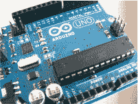

• 数量：1

• 连接：14

• 项目：所有项目

#### 9V 电池包

9V 电池包配有 2.1 毫米插孔，适用于 6 个 AA 电池，可以插入 Arduino 的电源端口，为您的项目供电。请注意，Arduino 还可以通过 USB 电缆供电。

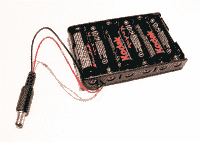

• 数量：1

• 连接：1

• 项目：所有项目可选

#### 面包板

面包板是用于将元件连接在一起以创建项目的原型板。有关更多详细信息，请参阅简介。

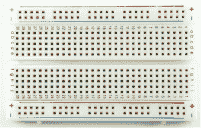

• 数量：1 个全尺寸板，1 个半尺寸板，1 个迷你板

• 连接：全尺寸板上 940 个，半尺寸板上 420 个，迷你板上 170 个

• 项目：除了项目 4, 6, 7, 16, 19, 22 和 25 外的所有项目

#### LED

LED，或称 *发光二极管*，是一种小型灯泡，当低电流通过它时会发光。它有两根引脚，其中较长的是正极连接。LED 通常需要电阻，否则可能会烧坏。LED 是有极性的，这意味着电流只能单向流动。

• 数量：40 个（10 个红色，10 个蓝色，10 个黄色，10 个绿色）

• 连接：2

• 项目：1, 2, 9, 15, 17, 21, 23, 24

#### 电阻

电阻限制电流流过电路的量，以防止元件过载。电阻看起来像一个带有彩色带和每端都有一根引线的圆柱体。电阻值通过色码表示——有关更多详细信息，请参阅 “解码电阻值” 在 第 250 页。请仔细检查电阻值，因为选择错误的电阻可能很容易。电阻有四带、五带和六带的不同类型，因此请注意，例如，一个四带 220 欧姆的电阻可能与一个五带的相同值电阻略有不同。

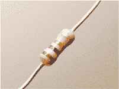

• 数量：9 个 220 欧姆，4 个 10k 欧姆，8 个 1k 欧姆

• 连接：2

• 项目：1–3, 5, 8–10, 15, 17, 18, 21, 23, 24

#### 七段显示器

七段 LED 显示屏通过 LED 段组成数字或字符，通常用于显示计数器、时钟或定时器中的数字。你可以购买单数位到八数位的显示屏，而四位数显示屏通常用于数字时钟。

• 数量：1

• 连接数：10

• 项目：3

#### 8×8 LED Maxim 7219 矩阵模块

这个预装的 8×8 LED 矩阵模块只需要将五个引脚连接到 Arduino 就能工作。

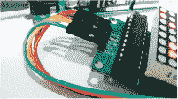

• 数量：1

• 连接数：5

• 项目：4

#### RGB LED

RGB LED 结合了红色、绿色和蓝色三种颜色，可以制造任何一种彩虹色。它是一个四脚的透明 LED，每个引脚都需要一个电阻来限制电流，以防止 LED 烧坏。最长的引脚是公共阴极或阳极。

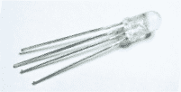

• 数量：1

• 连接数：4

• 项目：5

#### RGB LED 带状灯条（WS2812B 5V 32-LED 灯条）

LED 灯条有单色和多色两种，可以在控制方式上有所不同。单色或*不可寻址的多色*灯条一次只能亮一种颜色。RGB 多色灯条通常是*可寻址的*，这意味着每个 LED 都有自己的芯片，可以单独控制，允许多个颜色同时亮起。

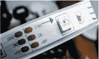

• 数量：1

• 连接数：3

• 项目：6

#### Adafruit NeoPixel 环形带有 16 个 RGB LED

Adafruit NeoPixel 环形带有 16 个 RGB 表面贴装 LED，每个 LED 都是可寻址的，允许你单独控制每个 LED。

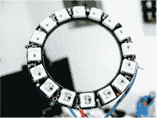

• 数量：1

• 连接数：3

• 项目：7

#### HMC5883L 三轴传感器

HMC5883L 三轴传感器是一个多芯片模块，用于感知磁场——我们用它来检测磁北以作为指南针。该模块可能需要你焊接头针。

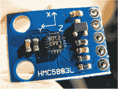

• 数量：1

• 连接数：4

• 项目：7

#### 按钮

按钮是一个简单的开关，按下时会连接电路。也叫瞬时开关，按钮按下时会接通电路，松开时弹簧恢复，断开连接。按钮的尺寸各异，但大多数有四个引脚。

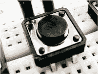

• 数量：8

• 连接数：4

• 项目：8

#### 声压蜂鸣器

声压蜂鸣器是一种非常基础的扬声器，常用于廉价玩具中。电流脉冲使其极快地发出点击声，一连串脉冲则发出音调。声压蜂鸣器通常看起来像一个带有两根线的小黑盒子。取出外壳后，它看起来像一个小小的金色圆盘。

• 数量：1

• 连接数：2

• 项目：8，15

#### 3.5 毫米女性耳机插孔

3.5 毫米女性耳机插孔是一个简单的插孔，允许你将音频设备连接到你的 Arduino 上。它可以单独购买，或者从一台一美元商店的收音机中回收。

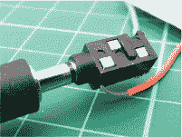

• 数量：1

• 连接数：3

• 项目：9

#### 伺服电机

伺服电机是一种带有臂部附件的电机，你可以通过向伺服电机发送编码信号来将其定位到特定的角度。电机位于一个小盒子中，配有三根电线和一个输出轴，你可以将臂部（称为*舵机臂*）连接到该输出轴。

本书使用的是 Tower Pro SG90 9g 伺服电机，它的转动角度为 180 度；其他类型的伺服电机是连续转动的，能完成 360 度的全旋转。

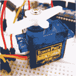

• 数量：1

• 连接：3

• 项目：10，21，22

#### 光敏电阻

光敏电阻，也叫*光敏电阻*或*二极管*，通过根据照射到其上的光线强度改变电阻值来检测光线水平。它有不同的类型，通常看起来像一个小的透明椭圆形，带有波浪线和两根引脚。你需要对光敏电阻进行校准，以确定光线水平，然后才能在程序中使用它。

• 数量：1

• 连接：2

• 项目：10

#### 28BYJ-48 步进电机配 ULN2003 驱动模块

步进电机是一种直流电动机，它将完整的 360 度旋转分为若干均匀的步进，从而提供更精确的控制。我们使用的是 28BYJ-48 步进电机，它配有一个 ULN2003 驱动模块来进行控制。

• 数量：1

• 连接：5

• 项目：11

#### LM35 温度传感器

LM35 温度传感器可以检测温度并将读数以电压值的形式发送给 Arduino，从而可以测量温度。

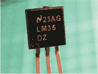

• 数量：1

• 连接：3

• 项目：12，14

#### 12V 迷你计算机冷却风扇

12V 迷你计算机冷却风扇是计算机内部使用的冷却风扇。我们使用的是一个 4 厘米 × 4 厘米的风扇，但如果需要，你也可以使用更大的风扇。你也可以回收一台旧电脑上的风扇，只要它不再使用。

• 数量：1

• 连接：2

• 项目：12

#### 5V 单通道继电器模块

继电器是一种电子控制开关，在本例中，继电器使用电磁铁通过机械方式打开或关闭电路。

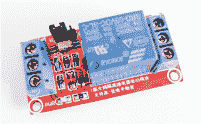

• 数量：1

• 连接：6

• 项目：12

#### 电位器

电位器是一种电阻器，其电阻值可以调节，从而控制通过它的电压，进而控制传输到组件的功率。它有一个旋钮可以调节，并且底部有三个插脚。中间的插脚是控制脚，电源连接在两侧。电位器通常用于控制输出设备，例如收音机的音量。你可以将电源连接到第 1 和第 3 插脚，连接方式不重要。

• 数量：2 50k-欧姆，1 10k-欧姆

• 连接：3

• 项目：11，13–15，18

#### LCD 屏幕

LCD（液晶显示器）屏幕是一种用于输出字符或图像的显示屏。它由两片偏振材料组成，中间夹有液晶溶液。通过电流流经液晶，液晶变得不透明，从而在背光下形成图像。

屏幕有不同的尺寸。此处展示的是一个 HD44780 16×2（16 字符×2 行）屏幕，有 16 个连接。

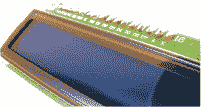

• 数量：1

• 连接数：16

• 项目：13–16

#### 超声波传感器

超声波传感器发送一个信号（通常称为*ping*），该信号会反射到物体上并返回到传感器。根据信号返回的时间计算距离。本书中使用的超声波传感器是 HC-SR04 超声波传感器，它是一个带有两个圆形传感器和四个引脚的模块板。

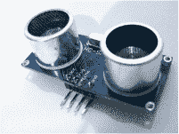

• 数量：1

• 连接数：4

• 项目：13, 17, 20, 22

#### 键盘

一个 3×4 的膜式键盘本质上是一系列开关。此处展示的示例有 12 个串联的按钮，但也有 16 个按钮版本可供选择。七个连接中，四个控制行，三个控制列。Arduino 将复制按下的按钮的数字。

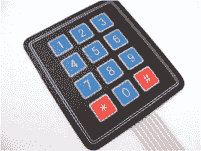

• 数量：1

• 连接数：7

• 项目：15

#### 串口 LCD 屏幕模块

这款 16×2 的 LCD 屏幕附带了一个串口模块，因此只需要连接电源和两个引脚到 Arduino 即可。

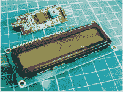

• 数量：1

• 连接数：4

• 项目：16

#### 诺基亚 5110 LCD 屏幕

这是一个诺基亚 84×48 像素的屏幕，考虑到字符之间的间隙，它给我们提供了一个 12×6 字符的屏幕。它的工作原理类似于项目 13 中的 LCD 屏幕，通过 Arduino 将电流传送到液晶的特定像素点，从而形成字母或图像。

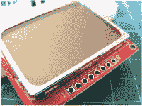

• 数量：1

• 连接数：8

• 项目：18

#### OLED 单色屏幕（128×64）

OLED（有机发光二极管）屏幕是一种发光技术，由一层薄薄的多层有机薄膜组成，置于阳极和阴极之间。本书中使用的 OLED 屏幕尺寸为 128×64。

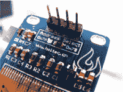

• 数量：1

• 连接数：4

• 项目：19, 25

#### Keyes MQ3 酒精传感器模块

MQ3 是一个对酒精和乙醇敏感的气体传感器。我们在项目 19 中的酒精测试仪中使用了它。

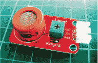

• 数量：1

• 连接数：3

• 项目：19

#### WLToys V959-18 水射流手枪

V959-18 水射流手枪包括一个小水箱用于储水，并有一个迷你水泵将水通过喷嘴喷出。

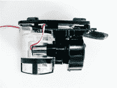

• 数量：1

• 连接数：2

• 项目：20

#### 光学指纹传感器（ZFM-20 系列）

ZFM-20 指纹传感器是一个指纹比对模块，能够拍摄指纹照片并将其添加到数据库中，从而允许检查新指纹是否与存储的指纹匹配。该传感器可以存储最多 162 个指纹。

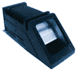

• 数量：1

• 连接：4

• 项目：21

#### L293d 电机扩展板

L293d 电机扩展板是一个用于控制电机的模块，我们在项目 22 中用到它来控制机器人。

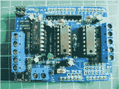

• 数量：1

• 连接：安装在 Arduino 顶部

• 项目：22

#### 机器人底盘套件

如果你在线搜索“Arduino 机器人套件”，应该能找到一个包含两个直流电机和轮子、底板、电池组、中心轮以及组装 Arduino 机器人所需配件的套件。我购买的套件专门命名为“2WD 智能电机机器人车底盘套件 for Arduino 1:48”。

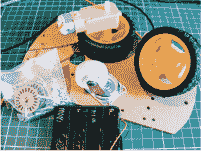

• 数量：1

• 连接：4（每个电机 2 个）

• 项目：22

#### 以太网扩展板 W5100 LAN

以太网扩展板 W5100 LAN 直接安装在 Arduino 顶部，提供额外的功能，比如 Web 服务器或客户端，使得 Arduino 可以连接到网络。

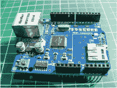

• 数量：1

• 连接：多个

• 项目：23

#### 以太网电缆

以太网电缆用于在互联网连接或网络与设备之间传输数据。

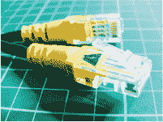

• 数量：1

• 连接：1

• 项目：23

#### HC-06 蓝牙模块

HC-06 模块提供蓝牙无线功能，使得 Arduino 能够通过短距离交换数据的方式传输无线电波。智能手机、笔记本电脑和多媒体设备如扬声器都使用蓝牙技术作为常见标准。

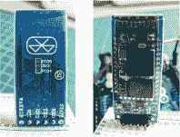

• 数量：1

• 连接：4

• 项目：24

#### Ublox NEO-6M GPS 模块 飞行器飞控和天线

Ublox NEO-6M GPS 模块是一种追踪设备，能够连接到顶级 GPS 卫星，通常用于追踪模型飞机或无人机的位置。该模块在此处列出的来源中广泛有售，或者你可以直接在线搜索“Ublox NEO-6M GPS 模块”。确保购买一个同时附带 GPS 天线的模块。

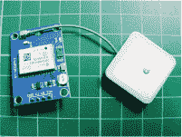

• 数量：1

• 连接：5，包括天线

• 项目：25

### 零售商列表

如前所述，大部分电子元件可以在 Amazon 或 eBay 等通用网站上找到，但如果你在找东西时遇到困难，列出的零售商应该能够提供帮助。

#### 美国零售商

**Adafruit** *[`www.adafruit.com/`](https://www.adafruit.com/)*

**DigiKey** *[`www.digikey.com/`](http://www.digikey.com/)*

**Jameco Electronics** *[`www.jameco.com/`](http://www.jameco.com/)*

**MCM** *[`www.mcmelectronics.com/`](http://www.mcmelectronics.com/)*

**Newark** *[`www.newark.com/`](http://www.newark.com/)*

**RS 组件** *[`www.rs-components.com/`](http://www.rs-components.com/)*

**Seeed Studio** *[`www.seeedstudio.com/`](https://www.seeedstudio.com/)*

**SparkFun** *[`www.sparkfun.com/`](https://www.sparkfun.com/)*

#### 澳大利亚零售商

**Core Electronics** *[`core-electronics.com.au/arduino.html`](https://core-electronics.com.au/arduino.html)*

**Little Bird Electronics** *[`www.littlebirdelectronics.com.au/`](http://www.littlebirdelectronics.com.au/)*

#### 欧洲零售商

**Electronic Sweet Pea’s** *[`www.sweetpeas.se/`](http://www.sweetpeas.se/)*

**Element 14** *[`www.element14.com/`](http://www.element14.com/)*

**Farnell** *[`www.farnell.com/`](http://www.farnell.com/)*

#### 英国零售商

**4tronix** *[`www.4tronix.co.uk/store/`](http://www.4tronix.co.uk/store/)*

**Cool Components** *[`www.coolcomponents.co.uk/`](http://www.coolcomponents.co.uk/)*

**CPC** *[`cpc.farnell.com/`](http://cpc.farnell.com/)*

**爱好者组件** *[`www.hobbycomponents.com/`](https://www.hobbycomponents.com/)*

**Mallinson Electrical** *[`www.mallinson-electrical.com/shop/`](http://www.mallinson-electrical.com/shop/)*

**Maplin** *[`www.maplin.co.uk/`](http://www.maplin.co.uk/)*

**Oomlout** *[`oomlout.co.uk/`](http://oomlout.co.uk/)*

**The Pi Hut** *[`thepihut.com/`](http://thepihut.com/)*

**Proto-pic** *[`proto-pic.co.uk/`](http://proto-pic.co.uk/)*

**Rapid Electronics** *[`www.rapidonline.com/`](http://www.rapidonline.com/)*

**RS** *[`uk.rs-online.com/web/`](http://uk.rs-online.com/web/)*

**Spiratronics** *[`spiratronics.com/`](http://spiratronics.com/)*

### 解码电阻值

在本书的大多数项目中，我们使用了*电阻器*。电阻器是限制电流通过电路的电气组件（以欧姆为单位）。它们用于保护像 LED 这样易受过载和烧坏影响的组件。电阻器的数值通过电阻器上的彩色带来识别。电阻器可以有四个、五个或六个彩色带。

能够确定电阻的数值非常重要，这样你就能确保在项目中使用正确的电阻。让我们试着确定 图 B-1 中显示的四环电阻的值。

**图 B-1：** 四环电阻

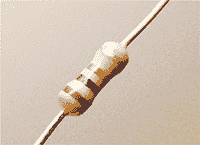

查看电阻时，银色或金色带位于右侧，注意从左到右的颜色顺序。如果电阻没有银色或金色带，确保有三个彩色带的一侧在左边。

使用 表 B-1 来确定电阻值。

**表 B-1：** 计算电阻值

| **颜色** | **第一环** | **第二环** | **第三环** | **乘数** | **公差** |
| --- | --- | --- | --- | --- | --- |
| 黑色 | 0 | 0 | 0 | 1Ω |  |
| 棕色 | 1 | 1 | 1 | 10Ω | +/–1% |
| 红色 | 2 | 2 | 2 | 100Ω | +/–2% |
| 橙色 | 3 | 3 | 3 | 1KΩ |  |
| 黄色 | 4 | 4 | 4 | 10KΩ |  |
| 绿色 | 5 | 5 | 5 | 100KΩ | +/–0.5% |
| 蓝色 | 6 | 6 | 6 | 1MΩ | +/–0.25% |
| 紫色 | 7 | 7 | 7 | 10MΩ | +/–0.10% |
| 灰色 | 8 | 8 | 8 |  | +/–0.05% |
| 白色 | 9 | 9 | 9 |  |  |
| 金色 |  |  |  | 0.1Ω | +/–5% |
| 银色 |  |  |  | 0.01Ω | +/–10% |

第一条和第二条带给出了数字值，第三条带告诉你要加多少个零，第四条带告诉你*公差*——即实际值与目标值之间可以有多大的偏差。

**注意**

*尽管表示公差的带通常是银色或金色，但它也可以是其他带有公差百分比的颜色。如果你有一个公差带不是银色或金色的电阻，值带和公差带之间应该有一个小间隙，这样你就可以知道它是什么颜色。*

所以，对于图 B-1 中的电阻：

• 第一条带为棕色（1）= 1。

• 第二条带为黑色（0）= 0。

• 第三条带为红色（2）= 00（2 是零的数量）。

• 第四条带为金色，所以公差（精度）为+ / – 5%。

所以这个电阻是 1,000 欧姆或 1 千欧姆，公差为 5%，这意味着实际值可以比 1 千欧姆多或少 5%。我们也可以对五条或六条带的电阻进行相同的计算。

如果你不确定电阻的值，可以通过快速在线搜索电阻表面上的彩色带来查找。只需要确保按正确的顺序列出颜色，从左到右读取，公差带在右侧。
