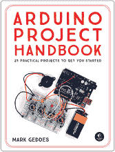
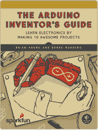
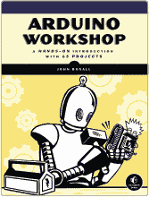
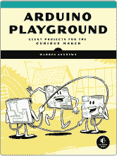

## 第十章：Arduino 引脚参考

没有过多的细节，这一部分为你提供了 Arduino Uno 上引脚的参考、它们的技术名称和功能。引脚的详细信息会在它们被使用的项目中进一步解释，所以在你完成一些项目后，这些信息可能会变得更加清晰。

|  **ARDUINO PIN**  | **功能与标签** | **附加功能** |
| --- | --- | --- |
| 0 | RX—用于接收 TTL 串行数据 |  |
| 1 | TX—用于传输 TTL 串行数据 |  |
| 2 | 外部中断 |  |
| 3 | 外部中断 | 脉宽调制 |
| 4 | XCK/TO—外部时钟输入/输出（定时器/计数器 0） |  |
| 5 | T1（定时器/计数器 1） | 脉宽调制 |
| 6 | AIN0—模拟比较器正输入 | 脉宽调制 |
| 7 | AIN1—模拟比较器负输入 |  |
| 8 | ICP1—输入捕获 |  |
| 9 | OC1A—定时器寄存器 | 脉宽调制 |
| 10 | SS—从设备选择（串行数据），用于 SPI 通信 | 脉宽调制 |
| 11 | MOSI—主设备输出从设备输入（数据输入），用于 SPI 通信 | 脉宽调制 |
| 12 | MISO—主设备输入从设备输出（数据输出），用于 SPI 通信 |  |
| 13 | SCK—串行时钟（主设备输出），用于 SPI 通信 |  |
| AREF | 模拟输入的参考电压 |  |
| A0 | 模拟输入可以给出 1,024 种不同的值。 |  |
| A1 | 模拟输入可以给出 1,024 种不同的值。 |  |
| A2  | 模拟输入可以给出 1,024 种不同的值。 |  |
| A3 | 模拟输入可以给出 1,024 种不同的值。 |  |
| A4 | 模拟输入可以给出 1,024 种不同的值。 | SDA（串行数据线）引脚支持 TWI（双线接口），可通过 Wire 库与 I2C 组件配合使用。 |
| A5 | 模拟输入可以给出 1,024 种不同的值。 | SCL（串行时钟线）引脚支持 TWI，可通过 Wire 库与 I2C 组件配合使用。 |
| RESET | 可用于重置微控制器 |  |
| 3.3V | 3.3 伏输出，用于低电压组件。这是唯一的 3.3V 电源。数字和模拟引脚在 5V 下工作。 |  |
| 5V | 标准 +5V 输出 |  |
| GND | 地/负电源 |  |
| Vin | 9V 电源可以通过此处输入，或通过电源插孔访问。 |  |

**串行：0（RX）和 1（TX）** 这些引脚用于接收（RX）和传输（TX）晶体管-晶体管逻辑（TTL）串行数据。在项目 21、24 和 25 中，我们使用了 TX 和 RX 引脚。

**外部中断：2 和 3** 这些引脚可以配置为在低电平、*上升*或*下降沿*（信号从低到高或从高到低）或值发生变化时触发中断。*中断*是一个信号，告诉 Arduino 在检测到外部事件（如按下按钮）时暂停并执行另一个功能。

**PWM：3、5、6、9、10 和 11** 这些引脚可以通过 `analogWrite()` 函数使用脉宽调制。关于这一点，项目 5 中有更多信息。

**SPI: 10（SS）、11（MOSI）、12（MISO）、13（SCK）** 这些引脚支持使用 SPI 库的 SPI 通信，并在项目 4 中使用。

**LED: 13** 引脚 13 上有一个内置 LED。当引脚为`HIGH`时，LED 亮；当引脚为`LOW`时，LED 灭。引脚 13 上的内置 LED 用于显示板载 ATmega328p 引导程序正在运行，通常在 Arduino 启动时会亮起。

**AREF** 这是模拟输入的参考电压；它与`analogReference()`一起使用。我们可以输入 0 到 5V 之间的电压，因此，如果你的传感器需要低于 5V 的电压，可以使用这个引脚提高分辨率，从而获得更精确的读数。

**模拟输入：A0–A5** Uno 有六个模拟输入，每个输入提供 1024 个不同的值。

**TWI: A4 和 A5** 这些引脚支持使用 Wire 库的*TWI（双线接口）*通信。用于控制和与 I2C 设备进行通信，例如串口 LCD 屏幕，只需两根线。

**RESET** 将此设置为`LOW`以重置微控制器。通常用来添加一个重置按钮。

如果你现在觉得这些信息对你没什么意义，不用担心。你可能会在未来的 Arduino 项目中用到它，随着你完成书中的项目，你也可以参考这些信息。

*Arduino 项目手册，第 2 卷* 使用了 Helvetica Neue、Montserrat、True North 和 TheSansMono Condensed 字体。

**更新**

访问*[`www.nostarch.com/arduinohandbook2/`](https://www.nostarch.com/arduinohandbook2/)*获取更新、勘误和其他信息。

更多实用的书籍来自  **NO STARCH PRESS**

**ARDUINO 项目手册，第 1 卷**

25 个实用项目，帮助你入门

*作者* MARK GEDDES 2016 年 6 月，272 页，$24.95 ISBN 978-1-59327-690-4 *全彩色*

**ARDUINO 发明家指南**

通过制作 10 个精彩项目来学习电子学

*作者* BRIAN HUANG *和* DEREK RUNBERG 2017 年 6 月，336 页，$29.95 ISBN 978-1-59327-652-2 *全彩色*

**ARDUINO 工作坊**

通过 65 个项目的动手实践来进行入门介绍

*作者* JOHN BOXALL 2013 年 5 月，392 页，$29.95 ISBN 978-1-59327-448-1

**制造商的僵尸末日指南**

使用简单的电路、Arduino 和 Raspberry Pi 来保护你的基地

*作者* SIMON MONK 2015 年 10 月，296 页，$24.95 ISBN 978-1-59327-667-6

**ARDUINO PLAYGROUND**

面向经验丰富的创客的极客项目

*作者* WARREN ANDREWS 2017 年 3 月，344 页，$29.95 ISBN 978-1-59327-744-4

**电气学的漫画指南**

*作者* KAZUHIRO FUJITAKI, MATSUDA, *和* TREND-PRO CO., LTD. 2009 年 3 月，224 页，$19.95 ISBN 978-1-59327-197-8

**电话：**

1.800.420.7240 或

1.415.863.9900

**电子邮件：**

SALES@NOSTARCH.COM

**网站：**

[WWW.NOSTARCH.COM](http://WWW.NOSTARCH.COM)
