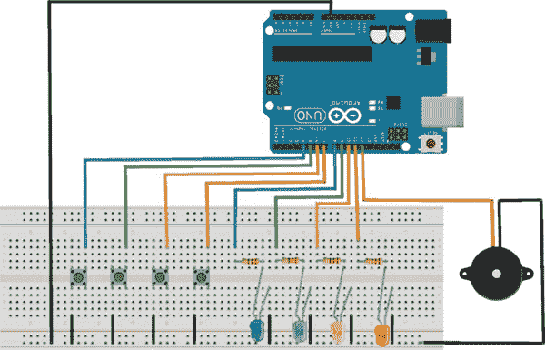

## 前言

Arduino 是一款小型、廉价的计算机，可以通过编程控制无数的创作，唯一的限制就是你的想象力。正如你很快会看到的，Arduino 可以用于制作各种项目，比如鬼魂探测器、摇杆控制的激光器、电子骰子、激光触发警报器、运动传感器警报器、密码键盘系统等等。这些项目都很容易制作，而且有一个共同点——它们都使用了 Arduino 的强大功能。

在 1980 年代初，我在一家本地书店发现了一本很棒的企鹅出版的平装书，书名大概是*小玩意和小工具*。书中的项目很简单，比如用手电筒灯泡制作一个工作中的灯塔，或者用旧钟表做一个旋转展示台。那本书里的创意激发了我的想象力，从那时起我就一直在进行创作。

我的好奇心促使我拆解各种电器产品进行实验，看看它们是如何工作的。我通常很难把它们重新组装起来，但也积累了许多可以进行实验的零部件。（顺便说一句，这是收集零件的一个好方法。）

我记得曾经将一串小型手电筒灯泡连接起来，为我的 Subbuteo 桌面足球游戏制作聚光灯，还创建了一个扬声器系统，在比赛的中场休息时播放音乐。我甚至设法从一款《星球大战》玩具中取出了几个 LED 灯，但因为当时不理解什么是电阻器，结果把它们烧坏了。我使用小马达、蜂鸣器和太阳能电池制作入侵警报器和超快速小车，也烧坏了几个马达！

大约在同一时期（1983 年），英国的 Sinclair Research 推出了 ZX Spectrum 48k 微型计算机，将家庭计算机引入了英国大众市场。（美国有它的 Commodore 64。）尽管 ZX Spectrum 本来是作为一台严肃的计算机推出的，但由于它包含了简单的编程语言 BASIC，它意外地更适合用于游戏。因此，软件公司如雨后春笋般在全国各地的卧室里涌现，人们争相为 ZX Spectrum 开发游戏。

这激发了我对编程的兴趣，但那时我无法将我的两个爱好结合起来。物理计算，软件和硬件与物理世界互动的领域，早在 80 年代就存在，但它局限于非常高端的计算和机器人技术，大多数家庭无法接触到。如今，30 多年过去了，随着 Arduino 的问世，我再次沉迷于电子技术，但这次我可以通过编程让我的项目栩栩如生。

### Arduino 革命

简单来说，Arduino 是一台可以编程的小型计算机，用来连接和控制各种电子元件。Arduino 有多个引脚，可以设置为 *输入*，意味着它们可以接收来自开关、按钮和传感器等物品的数据，或者设置为 *输出*，意味着它们会发送数据来控制马达、灯光和蜂鸣器等设备。这种可编程开发板更常被称为 *微控制器*。

Arduino 项目始于 2005 年的意大利伊夫雷亚，目的是创建一种比当时其他原型系统更便宜的设备，用来控制学生构建的互动设计项目。创始人 Massimo Banzi 和 David Cuartielles 将项目命名为 Arduino，灵感来自一个当地的酒吧（该名字来源于意大利男性名字，意为“强大的朋友”）。

Arduino 主板由两个主要元素组成：硬件或微控制器，它是主板的大脑，以及你用来将程序发送到大脑的软件。这个软件叫做 Arduino *集成开发环境（IDE）*，可以免费下载安装。

IDE 是一个简单的界面，适用于运行 Windows、OS X 或 Linux 的计算机。你使用 IDE 创建一个 *草图*（Arduino 程序），然后通过 PC 和 USB 电缆将其上传到 Arduino 主板。草图告诉硬件该做什么。在接下来的几章中，我会更详细地讲解硬件和软件。

Arduino 可以通过电池、USB 或外部电源供电。一旦 Arduino 被编程，它可以从计算机断开连接，并通过电源或电池独立运行。

### 关于本书

是什么促使我写这本书？互联网上充满了关于 Arduino 和潜在项目的教程、视频和文章，但许多内容缺乏详细的视觉效果或构建这些项目所需的代码。就像多年前激励我的 *《小玩意与小工具》* 一书一样，本书旨在帮助你构建简单的项目，激发你使用所学的技能和技巧创造自己的装置。

本书将重点介绍如何在面包板上创建你的项目。这是了解电路工作原理的最佳方法，因为连接并不是永久性的；如果你犯了错误，只需拔掉电线或元件并重新尝试。每个项目都有逐步的连接主组件的说明，并附有帮助你布线的照片。大多数项目都使用表格作为快速参考。

项目将提供电路图，以清晰地显示连接方式，如 图 1 所示。这些电路图是通过 Fritzing 程序（* [`www.fritzing.org/`](http://www.fritzing.org/)*）创建的，这是一个免费的开源程序，用于创建项目的可视化原理图。

**图 1：**

Fritzing 图示示例

每个项目都包含了编程 Arduino 所需的代码，因此你在开始之前不需要担心学习编程。早期的项目会简单地解释代码中的内容，帮助你理解编程过程，并让你在需要时能够自行修改代码。如果你不想手动输入所有的代码，可以从 *[`www.nostarch.com/arduinohandbook/`](http://www.nostarch.com/arduinohandbook/)* 下载程序。

本书的项目从基础开始，逐步进展到更复杂的设计。也就是说，本书不会深入讲解电子理论或编程，但我会给你一个良好的起点。我写这本书是为了教你如何创造自己的小工具。通过提供必要的技术知识，我让你可以专注于创意设计部分。我们的理念是，学习电路的功能能够激发你的想象力，帮助你在实际应用中使用这些电路。

本书提供了实用的信息，你可以参考引脚连接，并在需要时在不同的项目中复用它们。你还可以将项目结合起来，制作更复杂和有趣的小工具。

许多 Arduino 书籍侧重于编程元素，这对某种学习方式来说是很好的，但我认为也有即插即用电子设备的学习空间。通过跟随这些项目中的步骤，你将边做边学。

### 本书结构

本书的内容按以下顺序从简单到复杂的项目进展，帮助你提升技能并了解各个元件：

**第一部分：LED** 你将从学习如何使用按钮和可变电阻控制简单的 LED 开始，然后将不同的组件组合起来，制作迪斯科闪光灯、植物监测器来告诉你何时给植物浇水，甚至是一个幽灵探测器。

**第二部分：声音** 在这一部分，你将了解压电蜂鸣器，这是一种非常实用的设备，既可以发出声音，也可以检测声音。你将使用 Arduino Melody 制作音乐，创建一个简单有趣的记忆游戏，并设置一个可以检测敲击音量的密码锁系统。

**第三部分：伺服电机** 这些项目都使用伺服电机，这是一种带有机械臂的小型电机，可以用于各种用途。你将构建一个摇杆控制的激光器，并解码遥控器，以便用遥控器上的按钮来控制伺服电机。

**第四部分：LCD 显示器** LCD 屏幕在许多项目中都非常有用，可以显示信息和结果。在这一部分，你将学习如何设置 LCD 屏幕，建立一个天气站来报告天气情况，并设置两个游戏：占卜游戏和反应计时游戏。

**第五部分：数字计数器** 在这一部分，你将使用 LED 数字显示器，制作一个电子骰子和一个火箭发射倒计时系统，点燃引信。

**第六部分：安全** 这些更复杂的项目将向你展示如何通过安装触发线和入侵者追踪器、触发警报或哨兵导弹的运动传感器，以及使用键盘和卡片读取器的安全系统来保护你的空间，防止未经授权的人进入。

**第七部分：进阶** 在最后这一部分，你将把 Arduino 与一个灯光矩阵结合，创造出彩虹灯光秀。接着，你将通过构建属于你自己的 Arduino，为未来的项目打下基础。

这些项目不必按顺序构建，因此如果你看到自己喜欢的内容，并且有足够的信心去尝试，你可以直接跳到那个部分。不过，我还是建议你先尝试一些早期的项目，因为你会在其中找到对更复杂项目有用的信息。

我写下了这本我在刚开始使用 Arduino 时所寻找但找不到的书籍。我希望你在阅读和动手做这些项目时能像我写书一样享受其中的乐趣。
