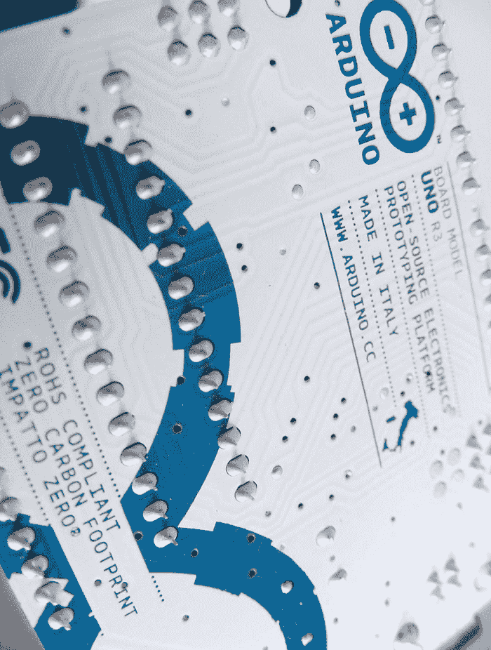

## 第一章：项目 0：入门

**在开始使用 ARDUINO 构建项目之前，你需要了解并完成一些准备工作。让我们看看本书所需的硬件和软件，以及如何设置工作站。然后，你将通过一个简单的 LED 项目来测试 Arduino，并学习一些实用的技巧，如焊接和下载有用的代码库。**

### 硬件

首先，让我们看看 Arduino Uno 板以及在几乎所有项目中都会使用的一些硬件。

#### Arduino Uno

市面上有许多种类的 Arduino 板，但本书将专门使用最流行的一款——Arduino Uno，如图 0-1 所示。Arduino Uno 是开源的（意味着它的设计可以自由复制），因此除了官方板（大约 25 美元），你还可以找到许多兼容的克隆板，价格大约 15 美元。

让我们来了解一下 Arduino Uno 的不同组成部分。

**图 0-1：**

Arduino Uno 板

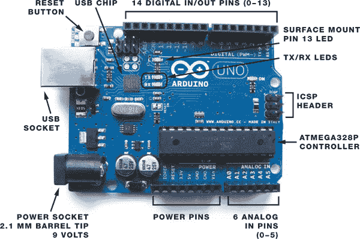

Arduino 通过将信息发送给你连接到它的组件（如电机或 LED）来控制它们，这些信息称为*输出*（从 Arduino 发送*出去*的信息）。Arduino 从传感器读取的数据是*输入*（进入 Arduino 的*信息*）。Arduino 有 14 个数字输入/输出引脚（引脚 0–13），每个引脚可以设置为输入或输出，附录 B 中有完整的引脚参考表。

#### 电源

当你将 Arduino Uno 板连接到计算机上传程序时，它会通过计算机的 USB 端口供电。如果 Arduino 没有连接到计算机，你可以通过连接一个 9 伏特的交流适配器或 9 伏特电池包（带有 2.1 毫米插孔，插孔的中心针连接到正极线）来独立运行，如图 0-2 所示。只需将插头插入 Arduino 的电源插座即可。

**图 0-2：**

一个 9 伏特电池包，你可以将其插入 Arduino 以提供电源

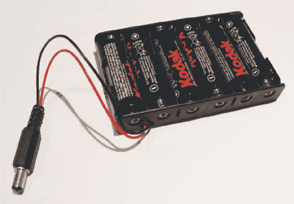

#### 面包板

*面包板*是电子原型制作的构建基座。本书中的所有项目都使用面包板，而不是焊接。

“面包板”这个词来源于早期电子项目的制作方式，当时电子项目是通过将钉子钉入木板并将电线绕在钉子上来连接组件，而不使用焊接。今天的面包板，如图 0-3 所示，由塑料制成，表面有预钻孔（称为*连接点*），你可以将组件或电线插入这些孔中，夹子会将它们固定在位置。孔之间通过一条条导电材料连接，这些导电条位于板的下方。

**图 0-3：**

面包板连接

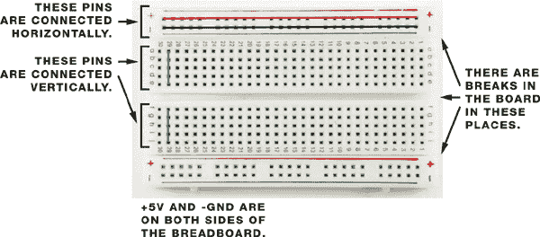

面包板有不同的尺寸。为了完成本书中的项目，你将需要四个面包板：两个全尺寸面包板，通常有 830 个孔；一个半尺寸面包板，拥有 420 个孔；以及一个迷你面包板，拥有 170 个孔。全尺寸面包板非常适合使用 LCD 屏幕或有很多元件的项目，而半尺寸和迷你面包板则更适合小型项目。我建议你购买与图 0-3 所示相似的面包板，带有红蓝线和孔之间的中心断开。

**提示**

*传统上，使用红色线连接 5V 电源，黑色线连接地线（GND），这样你就能轻松区分哪根线是哪个。其余的线可以根据你自己的喜好选择颜色。*

主板区域有 30 列连接点，它们是垂直连接的，如图 0-3 所示。板中间有一个断开，你通常需要用元件跨越它以完成电路。这个断开有助于将引脚单独连接，这样它们就不会意外地短接在一起，否则可能会导致项目失败，甚至损坏元件。

顶部和底部的蓝红线是*电源轨*，你可以用它们为插入主面包板区域的元件供电（见图 0-4）。电源轨将轨道中的所有孔水平连接；红线用于正电源，蓝线用于负电源（或*地线*，你常会看到它被这样称呼）。

**图 0-4：**

正负电源轨

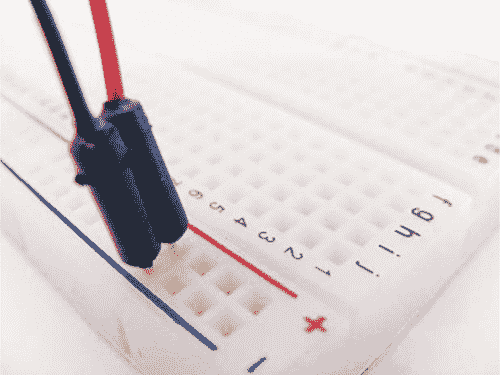

#### 跳线

你将使用*跳线*来在面包板上进行连接。跳线是实心导线，每端都有一个塑料模具夹，方便插入和移除导线。（你可以使用自己有的导线，但确保使用实心导线，因为绞合导线不够强劲，无法有效地插入孔夹中。）

当你将跳线插入面包板的孔中时，它会通过一个小的弹簧夹固定在板下，这样就形成了电气连接，通常这一行包含五个孔。然后，你可以将元件放入相邻的孔中，以帮助创建电路，如图 0-5 所示。

**图 0-5：**

一个示例面包板电路

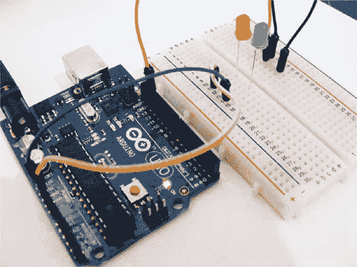

### 编程 Arduino

为了让我们的项目按预期工作，我们需要编写程序来给 Arduino 下指令。我们通过一个叫做 Arduino *集成开发环境（IDE）*的工具来实现。Arduino IDE 可以免费下载，支持 Windows、OS X 和 Linux 操作系统。它使你能够编写计算机程序（在 Arduino 世界中称为*草图*），然后通过 USB 线将其上传到 Arduino。Arduino 根据与外界的互动执行这些指令。

**注意**

*由于 IDE 版本可能会很快发生变化，我不会带你一步步安装它们，但你应该会发现安装过程很简单。所有版本的 IDE 和有关如何为你的操作系统安装的详细信息都可以在线找到，网址是* [`www.arduino.cc/`](http://www.arduino.cc/)。

#### IDE 界面

当你打开 Arduino IDE 时，它应该看起来非常类似于图 0-6。

IDE 界面分为顶部的工具栏，其中包含最常用功能的按钮；中间的代码或草图窗口，你将在其中编写或查看程序；以及底部的串行输出窗口。串行输出窗口显示你电脑和 Arduino 之间的通信信息，如果你的草图没有正确编译，还会列出任何错误。

**图 0-6：**

Arduino IDE

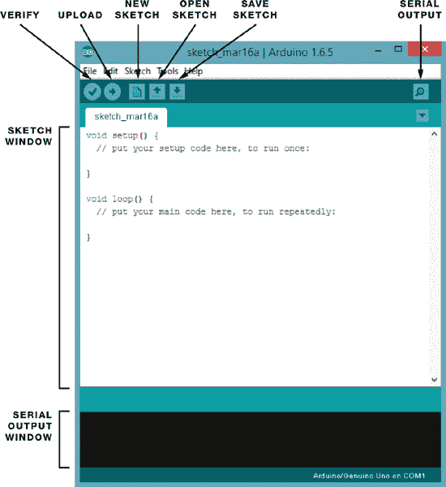

#### Arduino 草图

我会在每个相关项目中提供草图，并在那里进行讲解。所有草图都可以从 *[`www.nostarch.com/arduinohandbook/`](http://www.nostarch.com/arduinohandbook/)* 下载。

像所有程序一样，草图是一组非常严格的指令，并且对错误非常敏感。为了确保你正确复制了草图，请按下屏幕顶部的绿色勾选按钮。这是“验证”按钮，它会检查是否有错误，并告诉你草图是否正确编译。如果遇到问题，你可以随时下载草图并将其复制粘贴到 IDE 中。

#### 库文件

在 Arduino 世界中，*库* 是一小段执行特定功能的代码。你无需在草图中反复输入相同的代码，而是可以添加一条命令，从库中借用代码。这种快捷方式节省时间，并使你能够轻松连接到传感器、显示器或模块等设备。

Arduino IDE 包含了许多内置库，例如 LiquidCrystal 库，它可以方便地与 LCD 显示器进行通信，还有更多的库可以在线获取。为了制作书中的项目，你需要导入以下库：RFID、Tone、Pitches、Keypad、Password、Ultrasonic、NewPing、IRRemote 和 DHT。你可以在*[`www.nostarch.com/arduinohandbook/`](http://www.nostarch.com/arduinohandbook/)*找到所有需要的库。

一旦你下载了库文件，你需要安装它们。要在 Arduino 版本 1.0.6 及更高版本中安装库，请按照以下步骤操作：

1.  选择 **Sketch  Include Library  Add .ZIP Library**。

1.  浏览到你下载的 ZIP 文件并选择它。对于较旧版本的 Arduino，你需要解压库文件，并将整个文件夹及其内容放入 Linux 系统中的 *sketchbook/libraries* 文件夹，Windows 系统中的 *My Documents\Arduino\Libraries* 文件夹，或 OS X 系统中的 *Documents/Arduino/libraries* 文件夹。

要手动安装库，请转到包含库的 ZIP 文件并解压。例如，如果你正在安装一个名为 *keypad* 的库，它压缩在 *keypad.zip* 文件中，你需要解压 *keypad.zip*，它将展开为一个名为 *keypad* 的文件夹，文件夹中包含 *keypad.cpp* 和 *keypad.h* 等文件。ZIP 文件解压后，将 *keypad* 文件夹拖到操作系统中的 *libraries* 文件夹：在 Linux 中是 *sketchbook/libraries*，在 Windows 中是 *My Documents\Arduino\Libraries*，在 OS X 中是 *Documents/Arduino/libraries*。然后重新启动 Arduino 应用程序。

库会列在草图的开始部分，并且很容易识别，因为它们以 `#include` 命令开头。库用尖括号 `<>` 包围，并以 `.h` 结尾，以下是调用 Servo 库的示例：

```
#include <Servo.h>
```

现在安装项目所需的库，以便以后节省一些时间。

### 测试你的 Arduino：闪烁 LED

现在你已经了解了硬件和软件，让我们开始经典的第一个 Arduino 项目：闪烁一个 *发光二极管 (LED)*。这不仅是确保你的 Arduino 正常工作的最简单方法，而且它还会让你接触到一个简单的草图。正如我之前提到的，草图只是运行在计算机上的一系列指令。Arduino 一次只能保存一个草图，因此一旦你将草图上传到 Arduino，每次打开 Arduino 时，那个草图都会运行，直到你上传新的草图。

在这个项目中，我们将使用 Arduino IDE 中自带的 *闪烁* 示例草图。这个程序每隔 1 秒打开 LED，然后再关闭 1 秒，循环重复。LED 在通过电流时会发光。LED 只能在一个方向上通电，因此较长的引线必须连接到正电源。LED 还需要一个限流电阻，否则它们可能会烧毁。Arduino 的 13 号引脚已经内置了一个电阻。

按照以下步骤设置测试：

1.  将 LED 的长正极脚（也称为 +5V 或 *阳极*）插入 Arduino 的 13 号引脚，如图 0-7 所示。将短负极脚（也称为 *阴极*）连接到 13 号引脚旁边的 GND 引脚。

    **图 0-7：**

    *闪烁*项目设置

    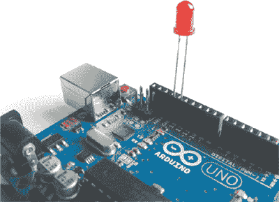

1.  使用 USB 电缆将 Arduino 连接到计算机。

1.  在 IDE 中输入以下草图。

    ```
    ➊ // Blinking LED Project
    ➋ int led = 13;
    ➌ void setup() {
    ➍   pinMode(led, OUTPUT);
       }
    ➎ void loop() {
    ➏   digitalWrite(led, HIGH);
    ➐   delay(1000);
    ➑   digitalWrite(led, LOW);
    ➒   delay(1000);
    ➓ }
    ```

1.  点击**验证**按钮（看起来像一个勾号），确认草图是否正常工作。

1.  现在点击**上传**按钮，将草图发送到你的 Arduino。

#### 理解草图

下面是草图中每行代码的作用：

➊ 这是一个注释。你程序中的任何以 `//` 开头的行都只供用户阅读，Arduino 会忽略它们，所以可以使用这种方式来输入注释并描述你的代码（称为 *注释代码*）。如果注释超过一行，第一行以 `/*` 开始，最后一行以 `*/` 结束。中间的所有内容都会被 Arduino 忽略。

➋ 这将引脚 13 命名为 `led`。草图中每次提到 `led` 都是指引脚 13。

➌ 这意味着紧随其后的 `{}` 中的代码将在程序开始时运行一次。开括号 `{` 开始了设置代码。

➍ 这告诉 Arduino 引脚 13 是一个输出引脚，表示我们要为 LED 提供电源。闭合大括号 `}` 结束了设置代码。

➎ 这创建了一个循环。大括号 `{}` 中的所有内容会在 Arduino 开机时运行一次，然后重复执行，直到断电为止。

➏ 这告诉 Arduino 将 `led`（引脚 13）设置为 `HIGH`，这会给该引脚提供电源。可以把它看作是打开该引脚。在这个草图中，这会点亮 LED。

➐ 这告诉 Arduino 等待 1 秒钟。Arduino 上的时间以毫秒为单位，因此 1 秒 = 1,000 毫秒。

➑ 这告诉 Arduino 将 `led`（引脚 13）设置为 `LOW`，这会切断电源并关闭该引脚。这会关闭 LED。

➒ 同样，Arduino 被告知再等 1 秒钟。

➓ 这个闭合的大括号结束了循环。所有在 `setup` 后面的代码都必须被大括号括起来。草图中常见的错误是缺少开括号或闭括号，这会导致草图无法正确编译。在这个大括号后，草图会返回到循环的起始位置 ➎。

运行此代码应该会让你的 LED 闪烁。现在你已经测试了你的 Arduino 并了解了草图的工作原理以及如何上传它，接下来我们将看看你需要哪些组件来完成本书中的所有项目。附录 A 提供了关于每个组件、它的外观和作用的更多细节。

### 项目组件清单

这是你完成本书中的项目所需的所有物品的完整列表。当然，最重要的部分是 Arduino 板本身——所有项目都使用 Arduino Uno R3 版本。如前所述，只有官方板才叫做 Arduino，但与软件兼容的克隆板可以从像 SlicMicro、Sainsmart 和 Adafruit 这样的公司购买，并且会被称为 Uno R3 或兼容 Arduino Uno R3。（你可以在*[`arduino.cc/en/Main/Buy/`](http://arduino.cc/en/Main/Buy/)*找到官方供应商的列表。）

每个项目都会先列出所需的物品，因此，如果你只想完成其中的一些项目，可以翻到你感兴趣的项目并只获取那些组件。虽然你可以单独购买每一项物品，但我建议购买一个电子爱好者入门套件或 Arduino 套件。你可以在网上找到许多此类套件，附录 A 中列出了推荐的供应商。标有星号 (*) 的组件都可以在 Arduino Bare Bones Kit 中找到，这可以节省你一些时间和金钱。

1 个 Arduino Uno R3（或兼容的替代品）

1 个带 2.1 mm 插头的 9V 电池包

2 块全尺寸面包板

1 块半尺寸面包板

1 个迷你面包板

50 根公对公跳线

10 根母对母跳线

30 个 220 欧姆电阻

10 个 330 欧姆电阻

1 个 470 欧姆电阻

1 个 10k 欧姆电阻

1 个 1M 欧姆电阻

40 个 5 mm LED 灯：红色、绿色、黄色、蓝色（每种颜色 10 个）

1 个 50k 欧姆电位器

4 个瞬时触觉四针按钮

1 个 HL-69 湿度计土壤湿度传感器

1 个压电蜂鸣器

1 个 3.5 mm 手机插孔

2 个 Tower Pro SG90 9g 伺服电机

1 个光敏电阻（也称为光电阻，或 LDR）

1 个模拟五针、双轴操纵杆模块

1 个全景摇摆模块

1 个四针 HC-SR04 超声波测距传感器

1 个 4×4 薄膜键盘

1 个七段 LED 显示器

1 个四位七段式串行显示器

1 个 DHT11 湿度传感器

1 个 16x2 LCD 屏幕（与 Hitachi HD44780 兼容）

1 个倾斜球开关

1 个 8×8 RGB LED 矩阵

1 个 38 kHz 红外（IR）传感器

1 个 HC SR501 PIR（被动红外）传感器

1 个 Mifare RFID RC-522 读卡器、卡片和钥匙扣

4 个 74HC595 移位寄存器

1 支低功率激光指示笔

1 个 WLToys RC V959 导弹发射器

1 个 ATMEL ATmega328p 芯片*

1 个 16 MHz 晶体振荡器（HC-495）*

1 个 L7805cv 5V 稳压器*

2 个 100 μF 电解电容*

1 个 PP3 9V 电池夹*

2 个 22 pF 磁盘电容*

9V 电池*

### 设置工作空间

为了充分利用 Arduino，您应该创建一个既能让你的想象力自由发挥，又能保持组织有序的工作空间。如果可能的话，最好是一个专用空间，像图 0-8 中展示的那样；一些项目可能需要几个小时才能完成，因此你可能没有时间一次性完成它们，而且没有什么比不得不停下来整理一遍然后下次再重新拿出来更糟的了。

**图 0-8：**

一个示例工作空间

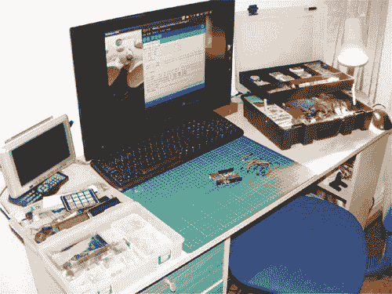

工作空间可以设在任何地方，但你需要的主要是一个桌子或足够大的平面，既能放下你的电脑或笔记本（方便使用 IDE 并上传程序），也能让你进行实际的构建工作。

你可能还需要一些空间来放置你的元件以及可能需要的工具，比如电烙铁、剥线钳、手工刀、手工钻等。将所有工具和材料一直放在外面可能不太实际，因此购买一些手工或工艺储物箱来存放零件是个不错的主意。我用一个大箱子来存放设备，如电烙铁或电线剪，另外的小箱子则用来存放元件。塑料渔具箱或工艺用的箱子非常适合存放元件（见图 0-9），而悬臂工具箱非常适合放置电烙铁和其他小设备（见图 0-10）。小型塑料盒子，通常设计用于存放珠宝或工艺用品，也是存放非常小的元件的好方法（见图 0-11）。

**图 0-9：**

渔具盒或工艺盒非常适合存放元件。

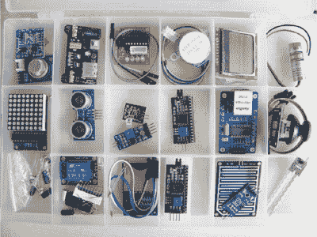

**图 0-10：**

悬臂工具箱非常适合存放电烙铁和其他小工具。

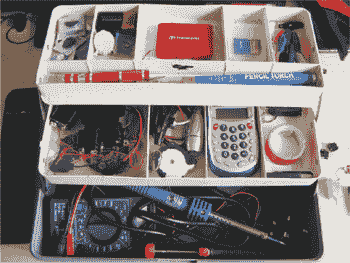

**图 0-11：**

塑料珠宝盒非常适合整理非常小的物品。

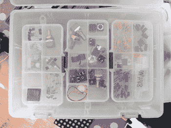

考虑购买一块账本大小的切割垫，作为一个定义明确的*非导电*工作空间（不会导电的空间），这样你就不必担心短路敏感的电子元件。

### 设备和工具指南

虽然这些设备对于本书中的项目并非必需，但以下是一些在设置工作空间时可能考虑购买的有用设备。

• 帮手—用于固定物品

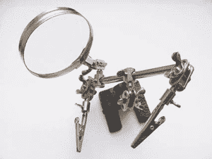

• 大账本尺寸的非导电切割垫

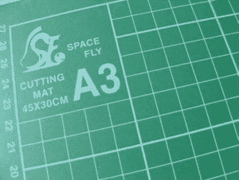

• 钳嘴钳

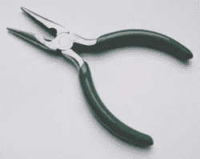

• 电线剪

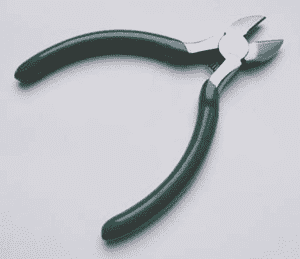

• 30 瓦电烙铁和焊锡（参见快速焊接指南第 18 页）

• 焊锡吸取器，用来吸取焊锡！

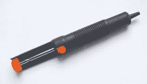

• 剥线钳—特别适用于制作跳线

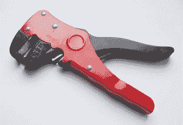

• 用于 Arduino 的 USB A 对 B 电缆

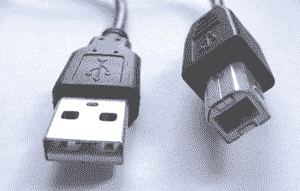

• 数字万用表

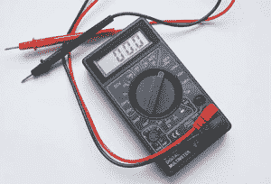

• 螺丝刀

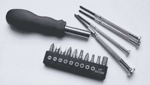

• 旋转工具及附件

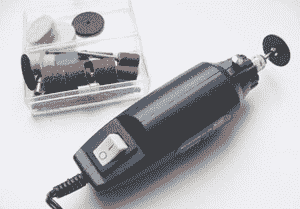

• 热熔胶枪

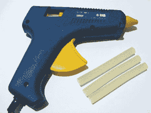

### 快速焊接指南

一些你需要的元件可能在运输时没有附带头针（图 0-12），你需要将它们焊接到位。头针是你附加到元件上的一排引脚，以便使用跳线连接或插入面包板。它们通常以条状形式出售，可以轻松折断到所需的大小，通常被插入元件上为其设计的孔中。

**图 0-12：**

头针

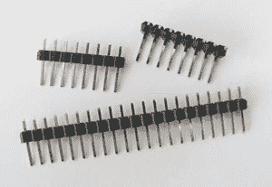

例如，在第二十三章中使用的 RFID 模块没有附带引脚，因此我将演示如何将其焊接到位，作为快速焊接指南。如果你需要更深入的指导，可以参考这个有用的漫画焊接指南：* [`mightyohm.com/files/soldercomic/FullSolderComic_EN.pdf`](https://mightyohm.com/files/soldercomic/FullSolderComic_EN.pdf) *。

首先，你需要一把焊接烙铁（图 0-13）。一把 30 瓦的通用焊接烙铁，带有细尖，应该能够满足你的需求。购买一个包含烙铁、支架和焊锡的套件是值得的。

**图 0-13：**

焊接烙铁和焊锡丝

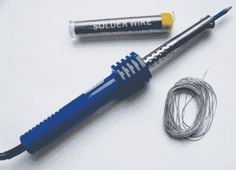

焊接时，使用烙铁加热你要焊接的区域——例如，引脚和元件接触的地方——然后将焊锡丝涂到加热的区域；焊锡丝会迅速熔化，冷却后，它应能形成两个焊接物之间的干净连接。这里有一个示范。

1.  插入焊接烙铁，并等待至少五分钟，让它达到工作温度。

1.  根据你的组件，断开正确数量的头针。对于第二十三章中的 RFID 模块，我们需要一排八个引脚。按照图 0-14 所示插入它们到模块中。

    **图 0-14：**

    将头针插入模块。

    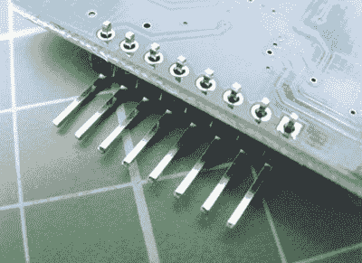

    **注意**

    *你不应该将焊锡直接涂到烙铁上，只能涂到你正在焊接的接头上。*

1.  现在我们将焊接引脚到位。从最左边的引脚开始。将加热的烙铁尖端同时接触到引脚和模块。只需保持大约两秒钟。保持烙铁不动的同时，向该区域加焊锡；焊锡应会熔化并形成接头。

1.  快速移除烙铁和焊锡——超过几秒钟可能会损坏你的元件。等待接头冷却。

一个好的焊接点应该像一个闪亮的锥形体（图 0-15）。只要稍加练习，你很快就能掌握焊接技巧。

**图 0-15：**

焊接点应该像这样。

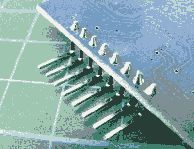

#### 安全第一

焊接烙铁非常非常热，使用时需要非常小心，并且不应由无人看管的儿童使用。这里有一些安全小贴士：

• 确保使用支架，切勿将热烙铁直接放在桌子上。

• 在通风良好的房间进行焊接。熔化焊锡释放的烟雾可能对健康有害。

• 将易燃物品远离工作区域。

• 将设备放在儿童接触不到的地方。

• 戴上护目镜。

• 在存放烙铁之前，务必让它完全冷却。
