# 第一部分


**LED**

## 项目 1：按钮控制的 LED

**在本项目中，你将向 LED 电路中添加一个按钮开关，用来控制 LED 何时亮起。**

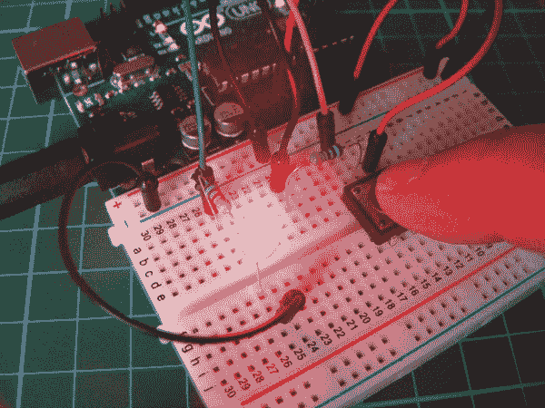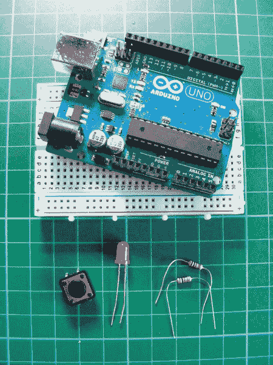

**所需部件**

• Arduino 板

• 面包板

• 跳线

• LED

• 瞬时触觉四脚按钮开关

• 10k 欧姆电阻

• 220 欧姆电阻

本项目将带你了解开关的基础知识，开关将在本书中大量使用。几乎所有电气设备都使用开关来控制元件的开与关。开关的种类很多，你现在将使用的是一个按钮开关（图 1-1）。

**图 1-1：**

一个按钮开关

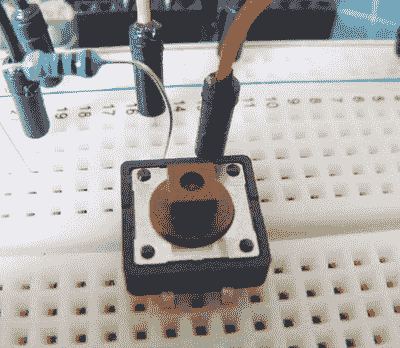

### 如何工作

按下按钮时，按钮完成电路连接，电路开启。一旦释放按钮，连接将恢复原状并断开电路，电路关闭。按钮开关也叫做*瞬时*开关或*常开*开关，常见于计算机键盘中。这与*翻转开关*不同，后者无论处于开还是关的位置，都会保持不变，直到你切换它，类似于灯光开关。

这种按钮开关有四个引脚，但你通常只会用其中两个进行连接。在本项目中，你将使用上面的连接，虽然下面的两个未使用的引脚也能完成相同的功能。如图 1-2 所示，这些引脚工作在电路中。引脚 A 和 C 总是连接的，B 和 D 也是如此。当按钮按下时，电路就完成了。

**图 1-2：**

一个按钮开关的不完整电路

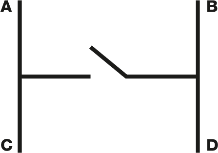

### 构建

1.  如图 1-3 所示，将按钮开关放置到面包板上。

    **图 1-3：**

    放置按钮开关

    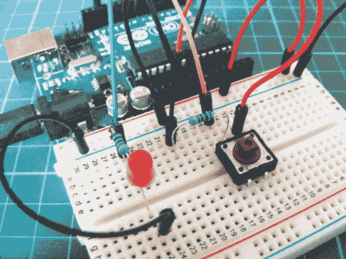

1.  将引脚 A 连接到一个 10k 欧姆电阻的一端，并将该电阻的另一端连接到 Arduino 的引脚 2。将电阻的另一端连接到 GND 轨道，并将 GND 轨道连接到 Arduino 的 GND。将按钮开关的引脚 B 连接到+5V 轨道，并将此轨道连接到 Arduino 的+5V。

    | **按钮开关** | **ARDUINO** |
    | --- | --- |
    | 引脚 A | 通过 10k 欧姆电阻连接至 GND 和引脚 2 |
    | 引脚 B | +5V |

1.  将 LED 放置到面包板上，将较长的正极脚通过 220 欧姆电阻连接到 Arduino 的引脚 13，将较短的负极脚连接到 GND。

    | **LED** | **ARDUINO** |
    | --- | --- |
    | 正极 | 通过 220 欧姆电阻连接至引脚 13 |
    | 负极 | GND |

1.  确认你的电路设置与图 1-4 中的电路图相符，然后上传位于第 27 页的“草图”代码。

    **图 1-4：**

    按钮控制的 LED 电路图

    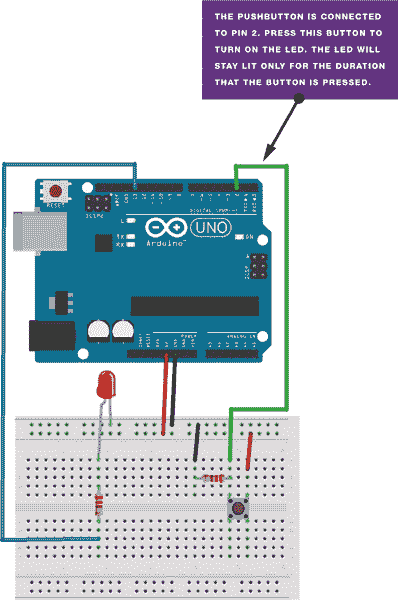

### 草图

在这个草图中，你为按钮分配一个引脚并将其设置为 `INPUT`，为 LED 分配一个引脚并将其设置为 `OUTPUT`。代码告诉 Arduino 只要按钮被按下（完成电路），就打开 LED，并且在按钮未被按下时将 LED 关闭。当按钮被释放时，电路断开，LED 会再次关闭。

```
/* by DojoDave <http://www.0j0.org>
   modified 30 Aug 2011 by Tom Igoe
   This example code is in the public domain.
   http://www.arduino.cc/en/Tutorial/Button
*/

const int buttonPin = 2;      // Pin connected to pushbutton
const int ledPin = 13;        // Pin connected to LED
int buttonState = 0;          // Give pushbutton a value

void setup() {
  pinMode(ledPin, OUTPUT);    // Set LED pin as output
  pinMode(buttonPin, INPUT);  // Set pushbutton pin as input
}

void loop() {
  buttonState = digitalRead(buttonPin); // Read input from pin 2
  if (buttonState == HIGH) { // If pushbutton is pressed, set as HIGH
    digitalWrite(ledPin, HIGH); // Turn on LED
  }
  else {
    digitalWrite(ledPin, LOW);  // Otherwise, turn off LED
  }
}
```

## 项目 2：光调光器

**在这个项目中，你将通过添加一个电位器来控制 LED 的亮度，从而创建一个调光开关。**

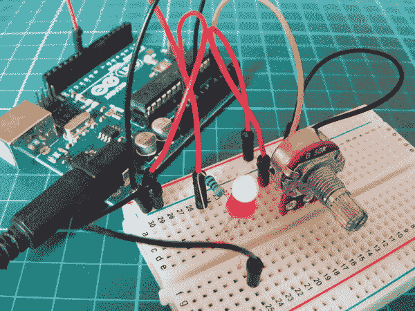

**所需零件**

• Arduino 板

• 面包板

• 跳线

• LED

• 50k 欧姆电位器

• 470 欧姆电阻

*电位器*是一个可变电阻器，带有一个旋钮，允许你在旋转时改变电位器的电阻。它通常用于音频设备中的音量控制等电子设备中。本项目使用的是一个 50k 欧姆的电位器。

### 工作原理

电位器操控一个连续的*模拟*信号，表示物理测量值。人类通过模拟感知世界；我们看到和听到的一切都是信息以连续的形式传输到我们的感官。这种连续流就是定义模拟数据的方式。另一方面，数字信息通过仅使用数字来估算模拟数据。为了逼近电位器的连续模拟数据，Arduino 必须将信号表示为一系列离散的数字——在此情况下为电压。电位器的中间引脚将信号发送到 Arduino 的模拟输入——任何 A0 到 A5 的引脚——以读取该值。

LED 实际上是被开关快速切换的，但这个切换速度非常快，以至于我们的眼睛可以补偿，从而看到一个持续点亮的 LED，在不同的光照水平下变化。这就是所谓的*视觉保持效果*。

为了创造视觉保持效果，Arduino 使用一种叫做*脉宽调制（PWM）*的技术。Arduino 通过非常快速地开关电源来创建脉冲。电源开启或关闭的持续时间（称为*脉冲宽度*）在周期中决定了平均输出，通过变化这个脉冲宽度，模式可以模拟从完全开启（5 伏）到关闭（0 伏）之间的电压。如果 Arduino 的信号在一半时间内是开启的，另一半时间是关闭的，那么平均输出将是 2.5 伏，介于 0 伏和 5 伏之间。如果信号开启 80% 的时间，关闭 20% 的时间，那么平均电压就是 4 伏，依此类推。你可以通过旋转电位器来改变信号，从而改变脉冲宽度，增加或减少电阻。

使用这种技术，你可以改变发送到 LED 的电压，使其变得更暗或更亮，以匹配来自电位器的模拟信号。只有 Arduino 的 3、5、6、9、10 或 11 引脚可以使用 PWM。图 2-1 给出了 PWM 作为波形的示例。

**图 2-1：**

脉宽调制作为波形

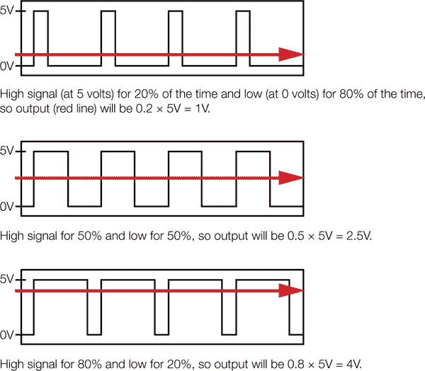

### 搭建

1.  将电位器插入面包板，并将中间的脚连接到 Arduino 的 A0 引脚。将一个外侧脚连接到面包板的 +5V 排，另一个外侧脚连接到面包板的 GND（实际上外侧电位器脚的连接顺序并不重要；这些说明仅反映本项目中的电路图），如图 2-2 所示。

    **图 2-2：**

    将电位器连接到 Arduino

    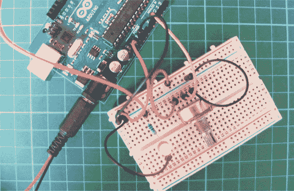

    | **电位器** | **ARDUINO** |
    | --- | --- |
    | 左脚 | +5V |
    | 中心脚 | A0 |
    | 右脚 | GND |

1.  将 LED 插入面包板。将正极脚（较长的脚）通过 470 欧姆电阻连接到 Arduino 的引脚 9，将负极脚连接到 GND，如图 2-3 所示。

    | **LED** | **ARDUINO** |
    | --- | --- |
    | 正极 | 引脚 9 |
    | 负极脚 | 通过 470 欧姆电阻连接 GND |

    **图 2-3：**

    调光电路图

    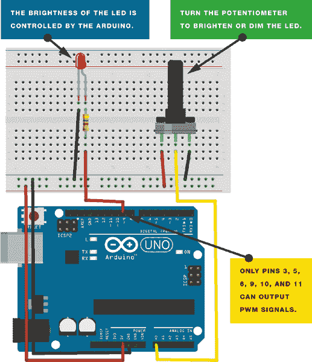

1.  上传下方 “The Sketch” 中的代码。

1.  转动电位器来控制 LED 的亮度。

这个项目有很多潜在的用途：你可以将多个 LED 集合在一起，制作一个可调节的手电筒、夜灯、展示柜灯光，或者任何需要调光灯的设备。

### 草图

这个草图的工作原理是将引脚 A0 设置为电位器，将引脚 9 设置为 `OUTPUT` 来为 LED 提供电源。然后你运行一个循环，不断读取电位器的数值，并将该数值作为电压传送给 LED。电压值在 0 至 5 伏之间，LED 的亮度会随之变化。

```
/* http://arduino.cc/en/Reference/AnalogWrite by Tom Igoe
   from http:itp.nyu.edu/physcomp/Labs/AnalogIn */

int potPin = A0; // Analog input pin connected to the potentiometer
int potValue = 0; // Value that will be read from the potentiometer
int led = 9; // Pin 9 (connected to the LED) is capable of PWM

// Runs once at beginning of the program
void setup() {
  pinMode(led, OUTPUT); // Set pin 9 to output
}

// Loops continuously
void loop() {
  potValue = analogRead(potPin); // Read potentiometer value
                                 // from A0 pin
  analogWrite(led, potValue/4);  // Send potentiometer value to LED
                                 // to control brightness with PWM
  delay(10);                     // Wait for 10 ms
}
```

## 项目 3：条形图

**在这个项目中，你将结合之前在 LED 项目中学到的知识，制作一个可以通过电位器控制的 LED 条形图。**

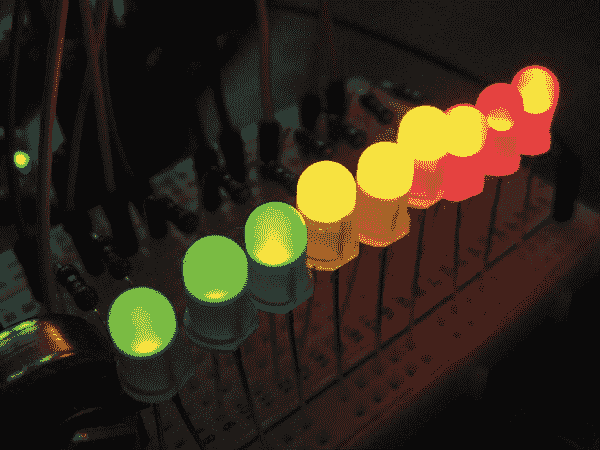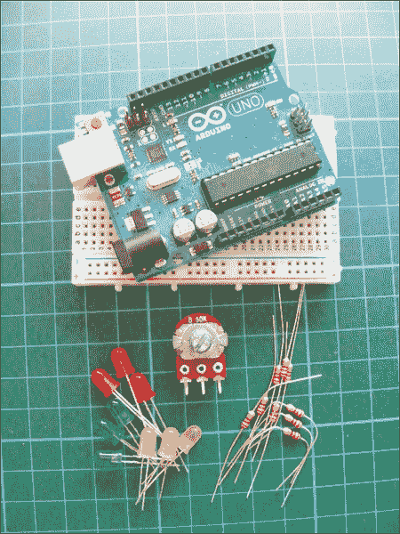

**所需零件**

• Arduino 主板

• 面包板

• 跳线

• 9 个 LED

• 50k 欧姆电位器

• 9 个 220 欧姆电阻

### 工作原理

条形图是由一排 LED 组成的，类似于你在音频显示器上看到的那种。它由一排 LED 和一个模拟输入（如电位器或麦克风）构成。在这个项目中，你使用电位器的模拟信号来控制点亮的 LED。当你朝一个方向转动电位器时，LED 会按顺序依次点亮，如图 3-1(a)所示，直到全部点亮，如图 3-1(b)所示。当你朝另一个方向转动时，它们会按顺序熄灭，如图 3-1(c)所示。

**图 3-1：**

随着你转动电位器，LED 会按顺序点亮和熄灭。

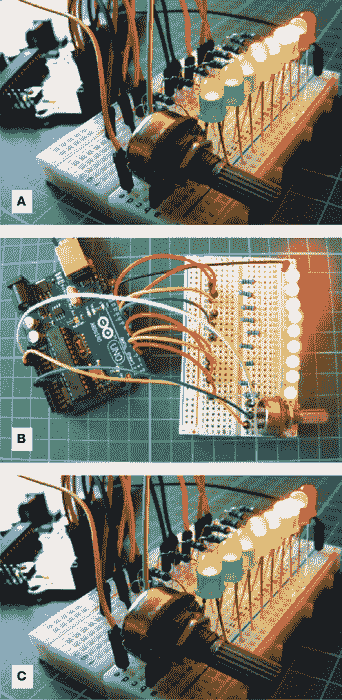

### 构建过程

1.  将 LED 插入面包板，将其较短的负极脚插入 GND 排，并通过跳线将此排连接到 Arduino 的 GND。

1.  将每个 LED 插入 220 欧姆电阻，并将电阻的一条引脚连接到 LED 的正极脚。将电阻的另一条引脚依次连接到数字引脚 2–10，如图 3-2 所示。电阻必须跨接面包板中的断点，如图所示。

    | **LED** | **Arduino** |
    | --- | --- |
    | 正极脚 | 通过 220 欧姆电阻连接到 2–10 号引脚 |
    | 负极脚 | GND |

    **图 3-2：**

    条形图电路图

    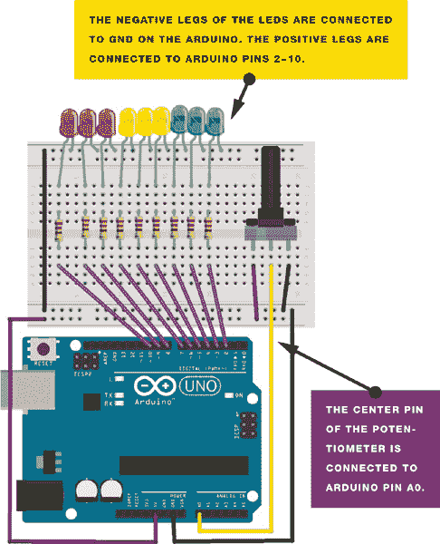

    **注意**

    *如项目 2 中所述，外部电位器引脚的连接方向其实并不重要，但我在这里给出了说明以配合图像。*

1.  将电位器放入面包板，并将中间引脚连接到 Arduino A0 引脚。将右侧外引脚连接到+5V，将左侧电位器引脚连接到 GND。

    | **电位器** | **Arduino** |
    | --- | --- |
    | 左侧引脚 | GND |
    | 中间引脚 | A0 |
    | 右侧引脚 | +5V |

1.  上传下面的“草图”代码。

### 草图

草图首先读取电位器的输入。它将输入值映射到输出范围，在本例中为九个 LED。然后它在输出上设置一个`for`循环。如果系列中 LED 的输出编号低于映射的输入范围，则 LED 点亮；否则，LED 熄灭。明白了吗？很简单！如果你将电位器旋转到右侧，LED 将依次亮起。将电位器旋转到左侧，它们将依次熄灭。

```
/* By Tom Igoe. This example code is in the public domain.
   http://www.arduino.cc/en/Tutorial/BarGraph */

const int analogPin = A0; // Pin connected to the potentiometer
const int ledCount = 9;   // Number of LEDs
int ledPins[] = {2,3,4,5,6,7,8,9,10}; // Pins connected to the LEDs

void setup() {
  for (int thisLed = 0; thisLed < ledCount; thisLed++) {
    pinMode(ledPins[thisLed], OUTPUT); // Set the LED pins as output
  }
}

// Start a loop
void loop() {
  int sensorReading = analogRead(analogPin); // Analog input
  int ledLevel = map(sensorReading, 0, 1023, 0, ledCount);
  for (int thisLed = 0; thisLed < ledCount; thisLed++) {
    if (thisLed < ledLevel) { // Turn on LEDs in sequence
      digitalWrite(ledPins[thisLed], HIGH);
    }
    else { // Turn off LEDs in sequence
      digitalWrite(ledPins[thisLed], LOW);
    }
  }
}
```

## 项目 4：迪斯科频闪灯

**在本项目中，你将应用在项目 3 中学到的技能，制作一个具有可调速度设置的频闪灯。**

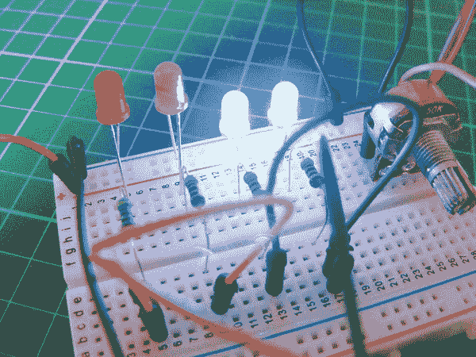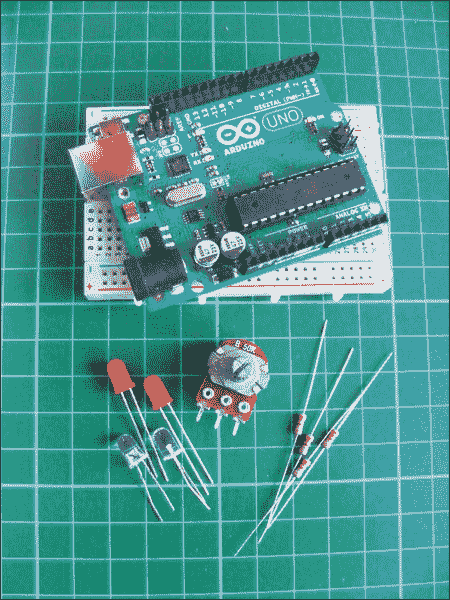

**所需零件**

• Arduino 板

• 面包板

• 跳线

• 2 个蓝色 LED

• 2 个红色 LED

• 50k 欧姆电位器

• 4 个 220 欧姆电阻

### 工作原理

旋转电位器的旋钮可以改变闪烁灯光的速度，产生频闪效果。你可以使用红色和蓝色的 LED 来模拟闪烁的警灯效果（见图 4-1）。将相同颜色的 LED 连接到同一个 Arduino 引脚，这样它们就会一起点亮。如果你制作一个外壳来放置 LED，你就拥有了一个移动的频闪灯。你最多可以添加 10 个 LED，只需更新草图以包括你的输出引脚和新的 LED 数量。

**图 4-1：**

红色和蓝色的 LED 模拟警车的灯光。

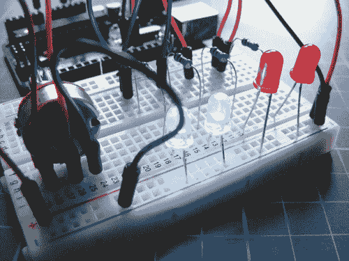

### 搭建过程

1.  将你的 LED 插入面包板，将较短的负极引脚连接到 GND 轨道，然后将该轨道连接到 Arduino GND。

    **注意**

    *记得为面包板加电。*

1.  将电阻插入面包板，并将它们连接到 LED 的较长正极脚。使用跳线将两颗红色 LED 和两颗蓝色 LED 通过电阻连接在一起，如图 4-2 所示；这允许相同颜色的 LED 通过单个引脚控制。

    **图 4-2：**

    使用跳线连接 LED

    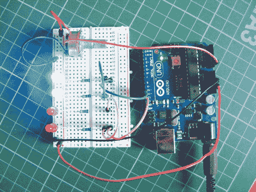

1.  将红色 LED 连接到 Arduino 引脚 12，将蓝色 LED 连接到 Arduino 引脚 11。

    | **LEDs** | **Arduino** |
    | --- | --- |
    | 负极脚 | GND |
    | 正极脚（红色） | 引脚 12 |
    | 正极脚（蓝色） | 引脚 11 |

1.  将电位器放置在面包板上，并将中间引脚连接到 Arduino 的 A0，引脚左侧连接到 GND，右侧连接到 +5V。

    | **电位器** | **Arduino** |
    | --- | --- |
    | 左引脚 | GND |
    | 中间引脚 | A0 |
    | 右引脚 | +5V |

1.  确认您的设置与 图 4-3 中的设置一致，然后上传 第 43 页 中的 "程序草图" 代码。

    **图 4-3：**

    迪斯科频闪灯电路图

    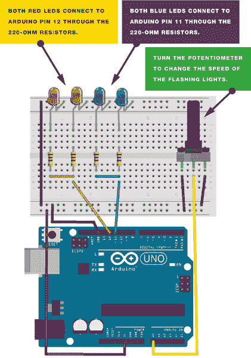

### 程序草图

程序草图的工作原理是将电位器的模拟信号作为输入传递到 Arduino，将连接到 LED 的引脚作为输出。Arduino 读取来自电位器的模拟输入，并将该值作为 *延迟值*——即 LED 状态改变前的时间量（无论是开还是关）。这意味着 LED 会根据电位器的值开关，改变此值会改变闪烁的速度。程序草图通过 LED 间的切换来产生频闪效果。

```
const int analogInPin = A0; // Analog input pin connected to the
                            // potentiometer
int sensorValue = 0;        // Value read from the potentiometer
int timer = 0;              // Delay value

// Set digital pins 12 and 11 as outputs
void setup() {
  pinMode(12, OUTPUT);
  pinMode(11, OUTPUT);
}

// Start a loop to turn LEDs on and off with a delay in between
void loop() {
  sensorValue = analogRead(analogInPin); // Read value from the
                                         // potentiometer
  timer = map(sensorValue, 0, 1023, 10, 500); // Delay 10 to 500 ms
  digitalWrite(12, HIGH); // LED turns on
  delay(timer);           // Delay depending on potentiometer value
  digitalWrite(12, LOW);  // LED turns off
  delay(timer);
  digitalWrite(12, HIGH);
  delay(timer);
  digitalWrite(12, LOW);
  digitalWrite(11, HIGH);
  delay(timer);
  digitalWrite(11, LOW);
  delay(timer);
  digitalWrite(11, HIGH);
  delay(timer);
  digitalWrite(11, LOW);
}
```

## 项目 5：植物监测器

**在这个项目中，我将介绍一种新型的模拟传感器，它能够检测湿度水平。你将建立一个光照和声音报警系统，用来告诉你何时给植物浇水。**

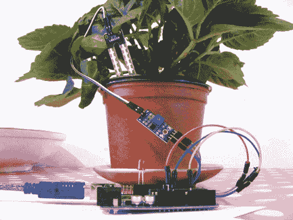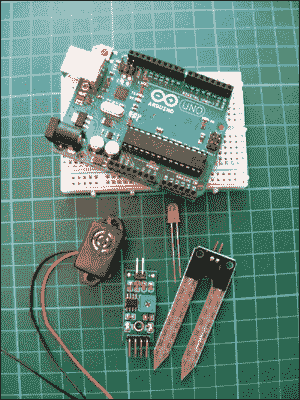

**所需零件**

• Arduino 板

• 跳线

• LED

• HL-69 湿度计土壤湿度传感器

• 蜂鸣器

### 工作原理

您将使用 HL-69 湿度传感器，它可以在网上购买到，价格仅为几美元，或从 附录 A 中列出的零售商处购买。传感器的探针通过土壤传递电流并测量电阻，从而检测周围土壤的湿度。潮湿的土壤导电性好，因此电阻较低，而干燥的土壤导电性差，电阻较高。

传感器由两部分组成，如 图 5-1 所示：实际的探针传感器 (a) 和控制器 (b)。传感器上的两个引脚需要连接到控制器上的两个单独的引脚（通常会提供连接线）。控制器的另一侧有四个引脚，其中三个连接到 Arduino。

**图 5-1：**

HL-69 湿度传感器的探针 (a) 和控制器 (b)

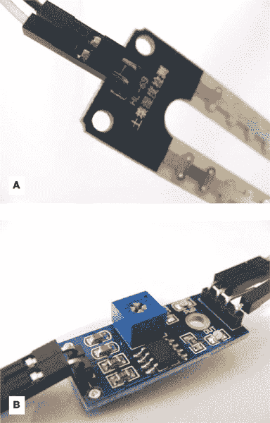

四个引脚从左到右分别是 AO（模拟输出）、DO（数字输出）、GND 和 VCC（见 图 5-2）。当控制器连接到计算机时，您可以通过 IDE 读取控制器的数值。这个项目不使用面包板，所以所有连接都直接连接到 Arduino 上。

**图 5-2：**

模块底部标有引脚位置

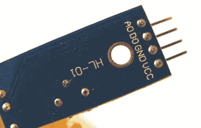

低读数表示检测到更多的湿气，高读数表示干燥。如果读数超过 900，说明植物非常缺水。如果植物太干，LED 灯将亮起，压电蜂鸣器会发出声音。*压电*蜂鸣器价格便宜，更多细节请参考项目 7。

### 构建过程

1.  将传感器的两个引脚通过提供的连接线连接到控制器上的+和–引脚，如图 5-3 所示。

    **图 5-3：**

    连接传感器到控制器

    

1.  将控制器的三个引脚直接连接到 Arduino 上的+5V、GND 和 A0 引脚，如下表所示。DO 引脚未使用。

    | **传感器控制器** | **ARDUINO** |
    | --- | --- |
    | VCC | +5V |
    | GND | GND |
    | A0 | A0 |
    | DO | 未使用 |

1.  将 LED 直接连接到 Arduino，短的负极腿连接到 GND，长的正极腿连接到 Arduino 的 13 号引脚，如图 5-4 所示。

    **图 5-4：**

    将 LED 连接到 Arduino

    

    | **LED** | **ARDUINO** |
    | --- | --- |
    | 正极 | 13 号引脚 |
    | 负极 | GND |

1.  将压电蜂鸣器的黑色线连接到 GND，将红色线连接到 Arduino 的 11 号引脚。

    | **压电蜂鸣器** | **ARDUINO** |
    | --- | --- |
    | 红色线 | 11 号引脚 |
    | 黑色线 | GND |

1.  检查你的设置是否与图 5-5 中的一致，然后上传“代码”中的代码到第 51 页。

    **图 5-5：**

    植物监测器的电路图

    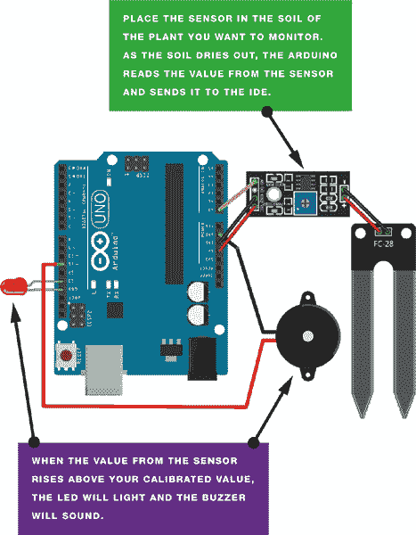

1.  使用 USB 电缆将 Arduino 连接到计算机。打开 IDE 中的串口监视器，查看传感器的读数——这也将帮助你校准植物监测器。IDE 会显示传感器的读数。我的传感器干燥且未插入土壤时读数为 1000，所以我知道这是最高和最干燥的值。要校准此值，可以顺时针旋转控制器上的电位器来增加电阻，逆时针旋转则减少电阻（参见图 5-5）。

    当传感器插入湿润的土壤中时，读数会降至大约`400`。随着土壤逐渐干燥，传感器的读数会上升；当读数达到`900`时，LED 灯会亮起，蜂鸣器会响起。

    **图 5-6：**

    调节电位器以校准植物监测器。

    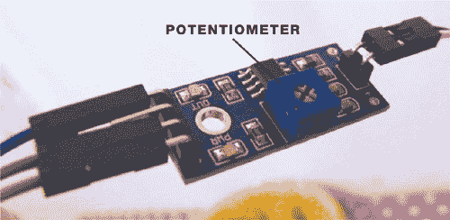

### 代码

代码首先定义了 Arduino 的 A0 引脚，用于读取湿度传感器的值。然后定义 Arduino 的 11 号引脚为蜂鸣器的输出引脚，13 号引脚为 LED 的输出引脚。使用`Serial.Println()`函数将传感器的读数发送到 IDE，以便在屏幕上查看。

修改以下行中的值

```
if(analogRead(0) > 900){
```

根据传感器干燥时的读数（这里是 900）。当土壤潮湿时，读数会低于 900，因此 LED 和蜂鸣器将保持关闭。当读数超过 900 时，表示土壤正在干燥，LED 和蜂鸣器会提醒你给植物浇水。

```
const int moistureAO = 0;
int AO = 0;       // Pin connected to A0 on the controller
int tmp = 0;      // Value of the analog pin
int buzzPin = 11; // Pin connected to the piezo buzzer
int LED = 13;     // Pin connected to the LED

void setup () {
  Serial.begin(9600); // Send Arduino reading to IDE
  Serial.println("Soil moisture sensor");
  pinMode(moistureAO, INPUT);
  pinMode(buzzPin, OUTPUT); // Set pin as output
  pinMode(LED, OUTPUT);     // Set pin as output
}

void loop () {
  tmp = analogRead( moistureAO );
  if ( tmp != AO ) {
    AO = tmp;
    Serial.print("A = "); // Show the resistance value of the sensor
                          // in the IDE
    Serial.println(AO);
  }
  delay (1000);
  if (analogRead(0) > 900) { // If the reading is higher than 900,
    digitalWrite(buzzPin, HIGH); // the buzzer will sound
    digitalWrite(LED, HIGH);     // and the LED will light
    delay(1000); // Wait for 1 second
    digitalWrite(buzzPin, LOW);
    digitalWrite(LED, HIGH);
  }
  else {
    digitalWrite(buzzPin, LOW); // If the reading is below 900,
                                // the buzzer and LED stay off
    digitalWrite(LED, LOW);
  }
}
```

## 项目 6：鬼魂探测器

**谁不想做一个鬼魂探测器呢？这个项目非常简单，组装起来也不需要太长时间，所以你可以立刻开始探测鬼魂。**

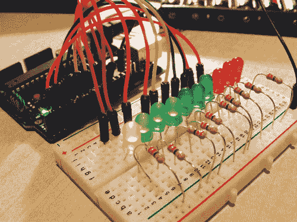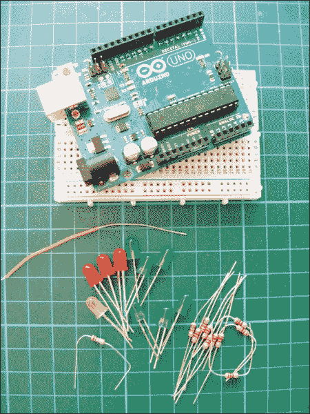

**所需零件**

• Arduino 板

• 面包板

• 跳线

• 3 个红色 LED

• 1 个黄色 LED

• 6 个绿色 LED

• 10 个 220 欧姆电阻

• 20 厘米单芯线

• 1M 欧姆电阻

### 工作原理

好吧，可能我有点夸张地称这个项目为鬼魂探测器。这个项目实际上是检测*电磁场*，但许多人相信这就是判断是否有鬼魂或灵体的方法。

在这个项目中，你将设置一个鬼魂探测天线和 LED 条形图系统，用来检测附近是否有较强的电磁活动。裸线作为天线，在两米的半径范围内拾取电磁场。根据信号的强度，LED 会按顺序亮起：信号越强，亮起的 LED 越多。启动 Arduino 后，将探测器指向一个房间，查看是否有异常存在。需要注意的是，电视等电器设备会使探测器发生反应，因为它们发射的信号。

### 构建过程

1.  将 LED 插入面包板，确保 LED 的引脚位于中心分隔线的两侧（有关面包板布局的更多信息，请参阅 Breadboards 章节，见第 4 页），如图 6-1 所示。我从一个黄色 LED 开始，然后使用六个绿色 LED 和三个红色 LED，按照从左到右的顺序排列。你可以使用任何颜色的 LED，并按你喜欢的顺序排列它们。

    **图 6-1：**

    放置 LED

    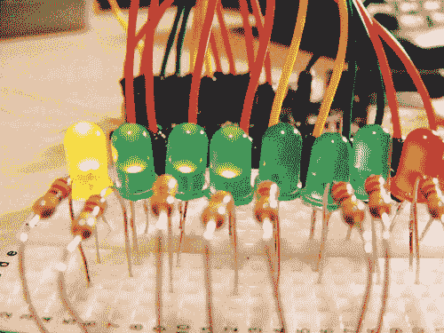

    **电磁场**

    *电场*是由电压差异产生的：电压越高，产生的电场越强。*磁场*是当电流流动时产生的：电流越大，磁场越强。*电磁场（EMF）*可以被看作是两者的结合体。

    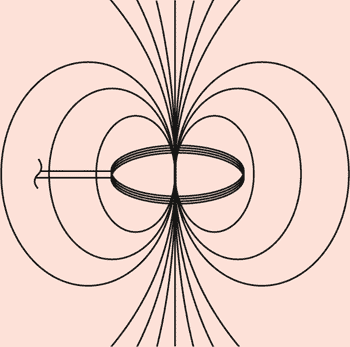

    电磁场在环境中随处可见，但人眼无法直接看到。电场是由大气中局部积累的电荷产生的，并与雷暴相关联。地球持续发出磁场，鸟类和鱼类用它来导航，它还会使指南针指向北方。

1.  将 220 欧姆电阻的一端连接到每个负极 LED 引脚，另一端插入面包板的 GND 排针（见图 6-2）。依次将每个正极 LED 引脚连接到数字引脚 2 至 11。

    | **LED 灯** | **Arduino** |
    | --- | --- |
    | 正极引脚 | 引脚 2–11 |
    | 负极引脚 | 通过 220 欧姆电阻接地 |

    **图 6-2：**

    将 LED 灯连接到面包板

    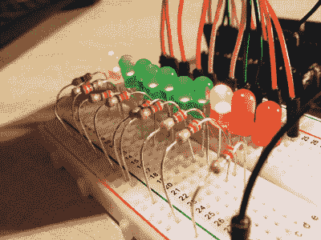

1.  取一段 20 厘米长的单股电线，用剥线钳从一端剥去约 1 厘米的绝缘层。将这端连接到 Arduino 的 A5 引脚。然后从另一端剥去约 7 厘米的绝缘层——这个裸露的线头就是你的天线，用来拾取电磁信号（见图 6-3）。

    **图 6-3：**

    剥线制作天线

    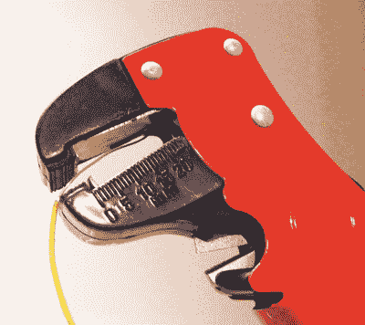

1.  将 1M 欧姆电阻的一端直接连接到 Arduino 的 GND，另一端连接到 Arduino 的 A5 引脚；这将增加设备的灵敏度。

1.  检查你的设置是否与图 6-4 相符，然后上传第 59 页的“代码”。

    **图 6-4：**

    幽灵探测器的电路图

    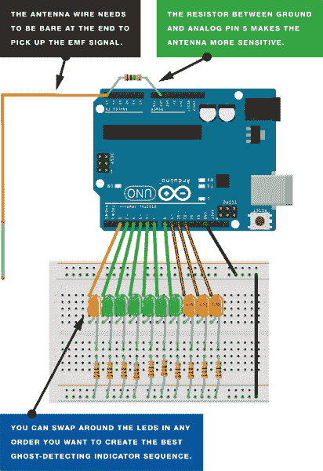

### 代码

裸线从大气中的电磁场拾取信号，并将 0 到 1023 之间的值发送到 Arduino。代码会评估模拟引脚的读取值，以确定有多少个 LED 灯按照顺序开关，以表示电磁信号的强度。例如，1023 是最高值，所有 LED 灯都会点亮；而 550 的读数则点亮五个 LED 灯。代码会不断循环读取模拟输入，LED 灯会不断移动以显示读数。如果你发现电磁场（EMF）读数每次都会让 LED 灯序列达到最大级别，可以通过降低`senseLimit`值来补偿。代码每次循环会取 25 次读数的平均值，并使用该平均值来减少可能导致 LED 灯过快点亮的大幅波动。

**注意**

*完成幽灵探测器后，试着加入一些根据读数变化的声音效果，例如随着读数增加，声音的速度或音量也会增大。为项目制作外壳，打造你自己的手持传感器，带着它去探险。你还可以尝试使用不同类型和厚度的电线，或者去掉电阻来实现不同的灵敏度。*

```
// Code by James Newbould used with kind permission
#define NUMREADINGS 25 // Raise number to increase data smoothing
int senseLimit = 1023; // Raise number to decrease sensitivity of
                       // the antenna (up to 1023 max)
int probePin = 5; // Set analog pin 5 as the antenna pin
int val = 0;      // Reading from probePin

// Pin connections to LED bar graph with resistors in series
int LED1 = 11;
int LED2 = 10;
int LED3 = 9;
int LED4 = 8;
int LED5 = 7;
int LED6 = 6;
int LED7 = 5;
int LED8 = 4;
int LED9 = 3;
int LED10 = 2;
int readings[NUMREADINGS]; // Readings from the analog input
int index = 0;             // Index of the current reading
int total = 0;             // Running total
int average = 0;           // Final average of the probe reading

void setup() {
  pinMode(2, OUTPUT); // Set LED bar graph pins as outputs
  pinMode(3, OUTPUT);
  pinMode(4, OUTPUT);
  pinMode(5, OUTPUT);
  pinMode(6, OUTPUT);
  pinMode(7, OUTPUT);
  pinMode(8, OUTPUT);
  pinMode(9, OUTPUT);
  pinMode(10, OUTPUT);
  pinMode(11, OUTPUT);
 Serial.pinMode(9600); // Initiate serial connection with IDE for
                        // debugging and so on
  for (int i = 0; i < NUMREADINGS; i++)
    readings[i] = 0; // Initialize all readings to 0
}

void loop() {
  val = analogRead(probePin); // Take a reading from probe
  if (val >= 1) {             // If the reading isn't zero, proceed
    val = constrain(val, 1, senseLimit); // If the reading is
                                         // higher than the current
                                         // senseLimit value, update
                                         // senseLimit value with
                                         // higher reading
    val = map(val, 1, senseLimit, 1, 1023); // Remap the constrained
                                            // value within a 1 to
                                            // 1023 range
    total -= readings[index]; // Subtract the last reading
    readings[index] = val;    // Read from the sensor
    total += readings[index]; // Add the reading to the total
    index = (index + 1);      // Advance to the next index
    if (index >= NUMREADINGS) // If we're at the end of the array
      index = 0;              // loop around to the beginning
    average = total / NUMREADINGS; // Calculate the average reading
    if (average > 50) { // If the average reading is higher than 50
      digitalWrite(LED1, HIGH); // turn on the first LED
    }
    else {                        // If it's not
      digitalWrite(LED1, LOW);    // turn off that LED
    }
    if (average > 150) {          // And so on
      digitalWrite(LED2, HIGH);
    }
    else {
      digitalWrite(LED2, LOW);
    }
    if (average > 250) {
      digitalWrite(LED3, HIGH);
    }
    else {
      digitalWrite(LED3, LOW);
    }
    if (average > 350) {
      digitalWrite(LED4, HIGH);
    }
    else {
      digitalWrite(LED4, LOW);
    }
    if (average > 450) {
      digitalWrite(LED5, HIGH);
    }
    else {
      digitalWrite(LED5, LOW);
    }
    if (average > 550) {
      digitalWrite(LED6, HIGH);
    }
    else {
      digitalWrite(LED6, LOW);
    }
    if (average > 650) {
      digitalWrite(LED7, HIGH);
    }
    else {
      digitalWrite(LED7, LOW);
    }
    if (average > 750) {
      digitalWrite(LED8, HIGH);
    }
    else {
      digitalWrite(LED8, LOW);
    }
    if (average > 850) {
      digitalWrite(LED9, HIGH);
    }
    else {
      digitalWrite(LED9, LOW);
    }
    if (average > 950) {
      digitalWrite(LED10, HIGH);
    }
    else {
      digitalWrite(LED10, LOW);
    }
    Serial.println(val);   // Use output to aid in calibrating
  }
}
```
