# 第二部分


**声音**

## 项目 7：Arduino 旋律

**到目前为止，所有项目都是视觉项目，现在是时候制作一些音乐了。在这个项目中，我们将使用压电蜂鸣器来播放一些旋律。**

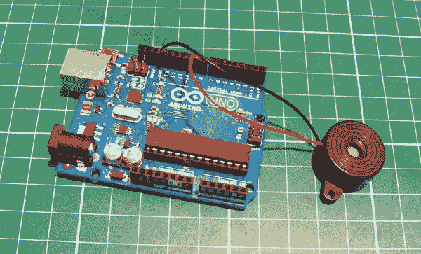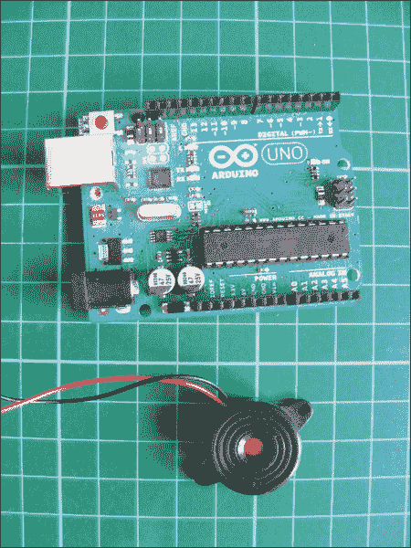

**所需组件**

• Arduino 主板

• 压电蜂鸣器

### 工作原理

Arduino 旋律使用压电蜂鸣器产生类似于可辨认音符的频率。你可以使用 Arduino IDE 来指定音符的顺序、速率和时长，以播放特定的旋律。

*压电元件*是便宜的蜂鸣器，通常用于小型玩具。没有塑料外壳的压电元件看起来像一个金色的金属圆盘，带有连接的正极（通常为红色）和负极（通常为黑色）导线。压电元件只能发出“咔嗒”声，我们通过施加电压来产生这个声音。我们可以通过让压电元件在每秒钟以特定频率点击数百次来发出可辨认的音符，因此首先我们需要知道我们想要的不同音调的频率。表 7-1 显示了音符及其对应的频率。*周期*是以微秒为单位的时间长度，用于创建该频率。我们将这个数字除以二，得到`timeHigh`值，该值在代码中用于生成音符。

**表 7-1：**

音符及其对应的频率

| **音符** | **频率** | **周期** | **timeHigh** |
| --- | --- | --- | --- |
| C | 261 Hz | 3,830 | 1915 |
| D | 294 Hz | 3,400 | 1700 |
| E | 329 Hz | 3,038 | 1519 |
| F | 349 Hz | 2,864 | 1432 |
| G | 392 Hz | 2,550 | 1275 |
| A | 440 Hz | 2,272 | 1136 |
| B | 493 Hz | 2,028 | 1014 |
| C | 523 Hz | 1,912 | 956 |

该代码向压电元件发送适当频率的方波，生成相应的音调（有关波形的更多内容，请参见项目 2）。这些音调通过以下公式计算：

```
timeHigh = period / 2 = 1 / (2 * toneFrequency)
```

这个项目的设置非常简单，只需要两根连接到 Arduino 的导线。

### 构建

1.  将压电元件的黑线直接连接到 Arduino 的 GND 引脚，红线连接到 Arduino 的引脚 9。

    | **压电元件** | **Arduino** |
    | --- | --- |
    | 红线 | 引脚 9 |
    | 黑线 | GND |

1.  检查你的设置是否与图 7-1 中的一致，然后上传接下来在“草图”中显示的代码。

    **图 7-1**

    Arduino 旋律的电路图

    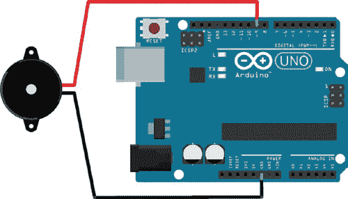

### 草图

我们将从一段简单的旋律开始。在 ➊ 处，我们告诉 IDE 这段旋律由 15 个音符组成。然后，我们将旋律的音符按演奏顺序存储在字符数组中，音符播放的时长则存储在另一个整数数组中。如果你想改变旋律，你可以在 ➋ 处修改数组中的音符，在 ➌ 处修改每个音符的拍数。最后，在 ➍ 处我们设置旋律的演奏速度。将这些组合在一起，它会播放什么？

```
   // Melody (cleft) 2005 D. Cuartielles for K3

   int speakerPin = 9; // Pin connected to the piezo
➊ int length = 15; // Number of notes
➋ char notes[] = "ccggaagffeeddc "; // A space represents a rest
➌ int beats[] = { 1, 1, 1, 1, 1, 1, 2, 1, 1, 1, 1, 1, 1, 2, 4 };
➍ int tempo = 300;
 void playTone(int tone, int duration) {
     for (long i = 0; i < duration * 1000L; i += tone * 2) {
       digitalWrite(speakerPin, HIGH);
       delayMicroseconds(tone);
       digitalWrite(speakerPin, LOW);
       delayMicroseconds(tone);
     }
   }

   // Set timeHigh value to specific notes
   void playNote(char note, int duration) {
     char names[] = { 'c', 'd', 'e', 'f', 'g', 'a', 'b', 'C' };
     int tones[] = { 1915, 1700, 1519, 1432, 1275, 1136, 1014, 956 };
     for (int i = 0; i < 8; i++) { // Play tone that corresponds
                                   // to note name
       if (names[i] == note) {
         playTone(tones[i], duration);
       }
     }
   }

   void setup() {
     pinMode(speakerPin, OUTPUT); // Set speakerPin as output
   }

   // Play the tune
   void loop() {
     for (int i = 0; i < length; i++) {
       if (notes[i] == ' ') {
         delay(beats[i] * tempo); // Rest
       }
       else {
         playNote(notes[i], beats[i] * tempo);
       }
       delay(tempo / 2); // Pause between notes
     }
   }
```

## 项目 8：记忆游戏

**在本项目中，我们将使用四个 LED、四个按键开关、一个蜂鸣器以及一些电阻和跳线，制作一个名为“Touch Me”的 Atari 游戏记忆游戏版本。**

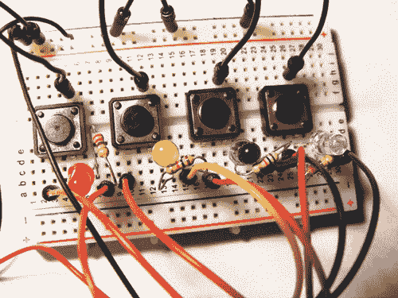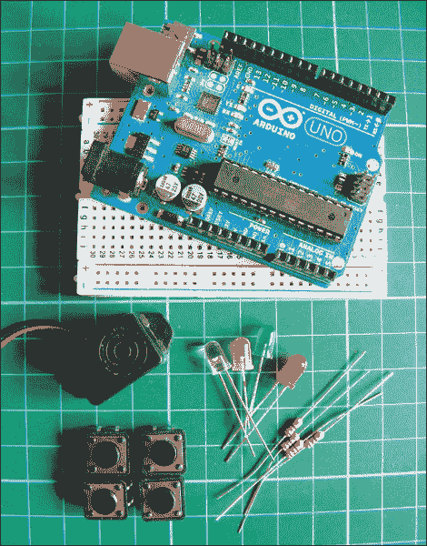

**所需零件**

• Arduino 板

• 面包板

• 跳线

• 蜂鸣器

• 4 个瞬时触觉四脚按键

• 4 个 LED

• 4 个 220 欧姆电阻

**所需库**

• 音调

### 工作原理

原始的 Atari 游戏有四个彩色面板，每个面板上都有一个 LED，以特定的模式亮起，玩家需要按这个模式重复（见图 8-1）。

**图 8-1：**

原始的*Touch Me*游戏

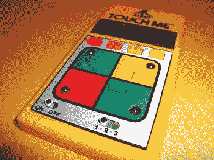

这个记忆游戏会播放一段简短的介绍音调并闪烁一个 LED。当你按下正确的对应按钮时，灯光会在一个更长的序列中再次闪烁。每当你正确地重复这个序列时，游戏会增加一个额外的步骤，使序列变得更具挑战性。当你犯错时，游戏会重置。  

### 制作过程

1.  将按键放置在面包板上，使其跨越中央断点，A 和 B 引脚在断点的一侧，C 和 D 引脚在另一侧，如图 8-2 所示。（参见项目 1 了解按键的更多信息。）

    **图 8-2：**

    一个按键有四个引脚。

    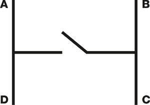

1.  将每个按键的 B 引脚连接到面包板的 GND 轨道，再将轨道连接到 Arduino 的 GND。

1.  将每个按键的 D 引脚按顺序连接到 Arduino 的数字引脚 2 至 5。

1.  将 LED 插入面包板，短的负极脚连接到每个按键的 C 引脚，长的正极脚插入右侧的孔，如图 12-3 所示。

    | **按键** | **Arduino/LED** |
    | --- | --- |
    | 引脚 B | GND |
    | 引脚 C | LED 负极脚 |
    | 引脚 D | Arduino 引脚 2–5 |

1.  将一个 220 欧姆的电阻插入面包板，一端连接到每个 LED 的正极脚，电阻的另一端连接到 Arduino，如下所示。

    | **LED** | **Arduino/按键** |
    | --- | --- |
    | 正极脚 | Arduino 引脚 8–11，通过 220 欧姆电阻 |
    | 负极脚 | 按键 C 引脚 |

    确保连接到针脚 11 的红色 LED 与连接到针脚 5 的按钮配对，连接到针脚 10 的黄色 LED 与连接到针脚 4 的按钮配对，连接到针脚 9 的绿色 LED 与连接到针脚 3 的按钮配对，连接到针脚 8 的蓝色 LED 与连接到针脚 2 的按钮配对。

1.  将压电元件的黑色线直接连接到 Arduino 的 GND，红色线连接到 Arduino 的针脚 12。

    | **压电元件** | **Arduino** |
    | --- | --- |
    | 红色线 | 针脚 12 |
    | 黑色线 | GND |

1.  根据图 8-3 检查你的设置，然后上传第 73 页中“草图”中的代码。

    **图 8-3：**

    记忆游戏电路图

    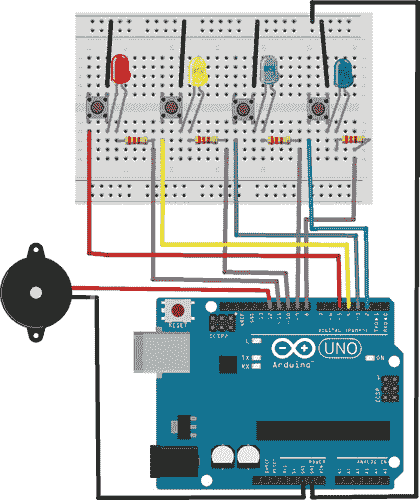

### 草图

该草图生成一个随机序列，LED 会按此顺序点亮；在模式循环中生成的随机值`y`决定了哪个 LED 被点亮（例如，如果 y 是 2，则连接到针脚 2 的 LED 将点亮）。你需要跟随并重复这个模式才能进入下一关。

在每一关中，前面的灯光会重复，并且会随机添加一个新的灯光。每个灯光都与压电元件的不同音调相关联，所以每次你都会听到不同的旋律。当你输入的顺序错误时，草图将重新开始，并生成一个不同的随机序列。为了使草图能够正确编译，你需要安装 Tone 库（可从* [`nostarch.com.com/arduinohandbook/`](http://nostarch.com.com/arduinohandbook/) *下载）。详细信息请参见第 7 页的“库”部分。

```
// Used with kind permission from Abdullah Alhazmy www.Alhazmy13.net

#include <Tone.h>
Tone speakerpin;
int starttune[] = {NOTE_C4, NOTE_F4, NOTE_C4, NOTE_F4, NOTE_C4,
                   NOTE_F4, NOTE_C4, NOTE_F4, NOTE_G4, NOTE_F4,
                   NOTE_E4, NOTE_F4, NOTE_G4};
int duration2[] = {100, 200, 100, 200, 100, 400, 100, 100, 100, 100,
                   200, 100, 500};
int note[] = {NOTE_C4, NOTE_C4, NOTE_G4, NOTE_C5, NOTE_G4, NOTE_C5};
int duration[] = {100, 100, 100, 300, 100, 300};
boolean button[] = {2, 3, 4, 5}; // Pins connected to
                                 // pushbutton inputs
boolean ledpin[] = {8, 9, 10, 11}; // Pins connected to LEDs
int turn = 0;         // Turn counter
int buttonstate = 0;  // Check pushbutton state
int randomArray[100]; // Array that can store up to 100 inputs
int inputArray[100];

void setup() {
  Serial.begin(9600);
  speakerpin.begin(12); // Pin connected to piezo buzzer
  for (int x = 0; x < 4; x++) {
    pinMode(ledpin[x], OUTPUT); // Set LED pins as output
  }
  for (int x = 0; x < 4; x++) {
    pinMode(button[x], INPUT); // Set pushbutton pins as inputs
    digitalWrite(button[x], HIGH); // Enable internal pullup;
                                   // pushbuttons start in high
                                   // position; logic reversed
  }
  // Generate "more randomness" with randomArray for the output
  // function so pattern is different each time
  randomSeed(analogRead(0));
  for (int thisNote = 0; thisNote < 13; thisNote ++) {
    speakerpin.play(starttune[thisNote]); // Play the next note
    if (thisNote == 0 || thisNote == 2 || thisNote == 4 ||
        thisNote == 6) { // Hold the note
      digitalWrite(ledpin[0], HIGH);
    }
    if (thisNote == 1 || thisNote == 3 || thisNote == 5 ||
        thisNote == 7 || thisNote == 9 || thisNote == 11) {
      digitalWrite(ledpin[1], HIGH);
    }
    if (thisNote == 8 || thisNote == 12) {
      digitalWrite(ledpin[2], HIGH);
    }
    if (thisNote == 10) {
      digitalWrite(ledpin[3], HIGH);
    }
    delay(duration2[thisNote]);
    speakerpin.stop(); // Stop for the next note
    digitalWrite(ledpin[0], LOW);
    digitalWrite(ledpin[1], LOW);
    digitalWrite(ledpin[2], LOW);
    digitalWrite(ledpin[3], LOW);
    delay(25);
  }
  delay(1000);
}

void loop() {
  // Generate the array to be matched by the player
  for (int y = 0; y <= 99; y++) {
    digitalWrite(ledpin[0], HIGH);
    digitalWrite(ledpin[1], HIGH);
    digitalWrite(ledpin[2], HIGH);
    digitalWrite(ledpin[3], HIGH);
    // Play the next note
    for (int thisNote = 0; thisNote < 6; thisNote ++) {
      speakerpin.play(note[thisNote]); // Hold the note
      delay(duration[thisNote]);       // Stop for the next note
      speakerpin.stop();
      delay(25);
    }
    digitalWrite(ledpin[0], LOW);
    digitalWrite(ledpin[1], LOW);
    digitalWrite(ledpin[2], LOW);
    digitalWrite(ledpin[3], LOW);
    delay(1000);
    // Limited by the turn variable
    for (int y = turn; y <= turn; y++) {
      Serial.println("");
      Serial.print("Turn: ");
      Serial.print(y);
      Serial.println("");
      randomArray[y] = random(1, 5); // Assign a random number (1-4)
      // Light LEDs in random order
      for (int x = 0; x <= turn; x++) {
        Serial.print(randomArray[x]);
        for (int y = 0; y < 4; y++) {
          if (randomArray[x] == 1 && ledpin[y] == 8) {
            digitalWrite(ledpin[y], HIGH);
            speakerpin.play(NOTE_G3, 100);
            delay(400);
            digitalWrite(ledpin[y], LOW);
            delay(100);
          }
          if (randomArray[x] == 2 && ledpin[y] == 9) {
            digitalWrite(ledpin[y], HIGH);
            speakerpin.play(NOTE_A3, 100);
            delay(400);
            digitalWrite(ledpin[y], LOW);
            delay(100);
          }
          if (randomArray[x] == 3 && ledpin[y] == 10) {
            digitalWrite(ledpin[y], HIGH);
            speakerpin.play(NOTE_B3, 100);
            delay(400);
            digitalWrite(ledpin[y], LOW);
            delay(100);
          }
          if (randomArray[x] == 4 && ledpin[y] == 11) {
            digitalWrite(ledpin[y], HIGH);
            speakerpin.play(NOTE_C4, 100);
            delay(400);
            digitalWrite(ledpin[y], LOW);
            delay(100);
          }
        }
      }
    }
    input();
  }
}

// Check whether input matches the pattern
void input() {
  for (int x = 0; x <= turn;) {
    for (int y = 0; y < 4; y++) {
      buttonstate = digitalRead(button[y]); // Check for button push
      if (buttonstate == LOW && button[y] == 2) {
        digitalWrite(ledpin[0], HIGH);
        speakerpin.play(NOTE_G3, 100);
        delay(200);
        digitalWrite(ledpin[0], LOW);
        inputArray[x] = 1;
        delay(250);
        Serial.print(" ");
        Serial.print(1);
        // Check if value of user input matches the generated array
        if (inputArray[x] != randomArray[x]) {
          fail(); // If not, fail function is called
        }
        x++;
      }
      if (buttonstate == LOW && button[y] == 3) {
        digitalWrite(ledpin[1], HIGH);
        speakerpin.play(NOTE_A3, 100);
        delay(200);
        digitalWrite(ledpin[1], LOW);
        inputArray[x] = 2;
        delay(250);
        Serial.print(" ");
        Serial.print(2);
        if (inputArray[x] != randomArray[x]) {
          fail();
        }
        x++;
      }
      if (buttonstate == LOW && button[y] == 4) {
        digitalWrite(ledpin[2], HIGH);
        speakerpin.play(NOTE_B3, 100);
        delay(200);
        digitalWrite(ledpin[2], LOW);
        inputArray[x] = 3;
        delay(250);
        Serial.print(" ");
        Serial.print(3);
        if (inputArray[x] != randomArray[x]) {
          fail();
        }
        x++;
      }
      if (buttonstate == LOW && button[y] == 5) {
        digitalWrite(ledpin[3], HIGH);
        speakerpin.play(NOTE_C4, 100);
        delay(200);
        digitalWrite(ledpin[3], LOW);
        inputArray[x] = 4;
        delay(250);
        Serial.print(" ");
        Serial.print(4);
        if (inputArray[x] != randomArray[x]) {
          fail();
        }
        x++;
      }
    }
  }
  delay(500);
  turn++; // Increment turn count
}

// Function used if player fails to match the sequence
void fail() {
  for (int y = 0; y <= 2; y++) { // Flash lights to indicate failure
    digitalWrite(ledpin[0], HIGH);
    digitalWrite(ledpin[1], HIGH);
    digitalWrite(ledpin[2], HIGH);
    digitalWrite(ledpin[3], HIGH);
    speakerpin.play(NOTE_G3, 300);
    delay(200);
    digitalWrite(ledpin[0], LOW);
    digitalWrite(ledpin[1], LOW);
    digitalWrite(ledpin[2], LOW);
    digitalWrite(ledpin[3], LOW);
    speakerpin.play(NOTE_C3, 300);
    delay(200);
  }
  delay(500);
  turn = -1; // Reset turn value to start the game again
}
```

## 项目 9：秘密敲击锁

**数百年来，秘密组织一直使用秘密敲击来防止未经授权的进入。让我们将这个系统带入现代，创造属于我们的电子门卫。**

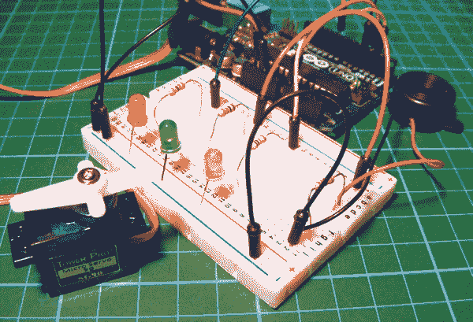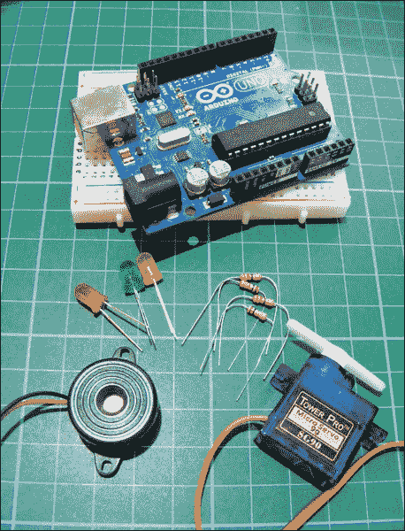

**所需零件**

• Arduino 板

• 面包板

• 跳线

• Tower Pro SG90 9g 伺服电机

• 压电蜂鸣器

• 3 个 LED

• 1M 欧姆电阻

• 3 个 220 欧姆电阻

**所需库**

• 伺服电机

### 工作原理

在这个项目中，你将制作一个电路，当你输入正确的秘密敲击时，伺服臂将移动以解锁一个盒子或门。到目前为止，我们只使用压电蜂鸣器发出声音，但我们也可以将它用作传感器来检测声音——在这种情况下，是敲击声。当压电元件被敲击时，它像铃铛一样响起，但它不会产生声音，而是输出电压，电压的数值取决于敲击的力度。我们将以数字形式测量这个电压，如果敲击的电压在某个范围内，Arduino 会将其识别为正确的。如果检测到三次正确电压的敲击，你就破解了密码，伺服臂将移动解锁盒子或门。

下面是我们将在草图中稍后使用的两行代码，用于设置电压的范围；如果电压在 10 到 100 之间，敲击将被识别为有效。

```
const int quietKnock = 10;
const int loudKnock = 100;
```

如果敲击太轻或太重，敲击将无法被识别。你需要进行三次“正确”的敲击才能触发伺服臂的移动。当正确的敲击顺序和力度被识别时，伺服臂将摆动 90 度，从而“解锁”设置好的设备。LED 灯（如图 9-1 所示）作为锁状态的指示灯：红色 LED 表示敲击不正确且伺服臂没有移动（即箱子或门仍然被锁住）；黄色 LED 闪烁时表示敲击被识别且正确的代码被检测到；绿色 LED 亮起且伺服电机在三次正确敲击后开始运动。

**图 9-1：**

LED 设置

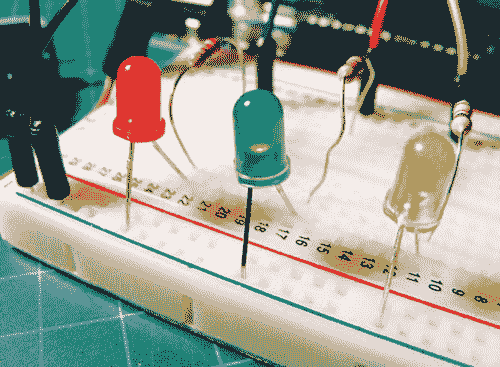

为了获得最佳效果，将压电元件从外壳中取出并将其直接固定在盒子的内部或门的外部，以便它更敏感地响应敲击的震动。

### 搭建过程

1.  在面包板上插入一个 1M 欧姆电阻，并将压电元件的红色线连接到一端，黑色线连接到另一端。将黑色线连接到 GND 轨，红色线连接到 Arduino 的 A0 引脚。

    | **压电元件** | **ARDUINO** |
    | --- | --- |
    | 红色线 | 通过 1M 欧姆电阻连接到 A0 |
    | 黑色线 | 通过 1M 欧姆电阻连接到 GND |

1.  将伺服电机的黄色信号线直接连接到 Arduino 的 9 号引脚，棕色线连接到 GND，红色线连接到+5V。

    | **伺服电机** | **ARDUINO** |
    | --- | --- |
    | 黄色线 | 9 号引脚 |
    | 红色线 | +5V |
    | 棕色线 | GND |

1.  将 LED 插入面包板，短的负极引脚连接到 GND，正极引脚通过 220 欧姆电阻与引脚连接，具体连接如下：黄色连接到 Arduino 的 3 号引脚，绿色连接到 4 号引脚，红色连接到 5 号引脚。

    | **LED 灯** | **ARDUINO** |
    | --- | --- |
    | 正极引脚 | 通过 220 欧姆电阻连接到 3–5 号引脚 |
    | 负极引脚 | GND |

1.  将 Arduino 的 2 号引脚连接到正电源轨。在我们的设置中，这个电源始终处于开启状态，但你也可以在 Arduino 2 号引脚和电源轨之间添加一个开关，以便在项目不使用时节省电量。

1.  将面包板的电源轨连接到 Arduino 的 GND 和+5V。

1.  确保你的设置与图 9-2 中的电路图一致，然后上传第 82 页中“草图”的代码。

    **图 9-2：**

    秘密敲击锁的电路图

    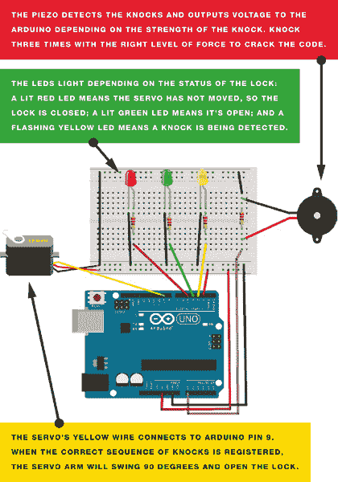

### 草图

我们首先调用 Servo 库，并将 Arduino 引脚 9 设置为控制舵机。LED 灯连接到 Arduino 引脚 3、4 和 5，根据敲击的有效性，这些灯会亮起。压电传感器在本项目中充当传感器，而不是蜂鸣器，并连接到 Arduino 引脚 A0。当有人敲击时，敲击会被压电传感器感知，并根据敲击的力度，发送一个电压值到 Arduino 的 A0 模拟引脚——敲击越强，电压值越高。一个值低于 10 的敲击被认为太轻，一个值高于 100 的敲击则太响，因此这两者都不会被认为是有效敲击。如果敲击无效，则红色 LED 灯亮起；如果敲击有效，则黄色 LED 灯亮起。任何值在 10 到 100 之间的敲击都会被接受为有效敲击并计数，如果接收到三个有效敲击，舵机就会移动，并且绿色 LED 灯会亮起。

如前所述，这两行代码设置了测量电压的参数：

```
const int quietKnock = 10;
const int loudKnock = 100;
```

如果你想特别保密，你可以将这个范围设得更紧一些，这样代码就更难破解。下面是草图：

```
/* Created 18 September 2012 by Scott Fitzgerald
   Thanks to Federico Vanzati for improvements
   http://arduino.cc/starterKit
   This example code is part of the public domain.
*/

#include <Servo.h>
Servo servo9; // Pin connected to servo mpo

const int piezo = A0;    // Pin connected to piezo
const int switchPin = 2; // Pin connected to servo
const int yellowLed = 3; // Pin connected to yellow LED
const int greenLed = 4;  // Pin connected to green LED
const int redLed = 5;    // Pin connected to red LED

int knockVal;   // Value for the knock strength
int switchVal;

const int quietKnock = 10; // Set min value that will be accepted
const int loudKnock = 100; // Set max value that will be accepted
boolean locked = false;    // A true or false variable
int numberOfKnocks = 0;    // Value for number of knocks

void setup() {
  servo9.attach(9);
  pinMode(yellowLed, OUTPUT);   // Set LED pins as outputs
  pinMode(greenLed, OUTPUT);
  pinMode(redLed, OUTPUT);
  pinMode(switchPin, INPUT);    // Set servo pin as input
  Serial.begin(9600);
  digitalWrite(greenLed, HIGH); // Green LED is lit when the
                                // sequence is correct
  servo9.write(0);
  Serial.println("The box is unlocked!");
}

void loop() {
  if (locked == false) {
    switchVal = digitalRead(switchPin);
    if (switchVal == HIGH) {
      locked = true;
      digitalWrite(greenLed, LOW);
      digitalWrite(redLed, HIGH);
      servo9.write(90);
      Serial.println("The box is locked!");
      delay(1000);
    }
  }
  if (locked == true) {
    knockVal = analogRead(piezo); // Knock value is read by analog pin
    if (numberOfKnocks < 3 && knockVal > 0) {
      if (checkForKnock(knockVal) == true) { // Check for correct
                                             // number of knocks
        numberOfKnocks++;
      }
      Serial.print(3 - numberOfKnocks);
      Serial.println(" more knocks to go");
    }
    if (numberOfKnocks >= 3) { // If 3 valid knocks are detected,
                               // the servo moves
      locked = false;
      servo9.write(0);
      delay(20);
      digitalWrite(greenLed, HIGH);
      digitalWrite(redLed, LOW);
      Serial.println("The box is unlocked!");
    }
  }
}

boolean checkForKnock(int value) { // Checks knock value
  if (value > quietKnock && value < loudKnock) { // Value needs to be
                                                 // between these
    digitalWrite(yellowLed, HIGH);
    delay(50);
    digitalWrite(yellowLed, LOW);
    Serial.print("Valid knock of value ");
    Serial.println(value);
    return true;
  }
  else { // If value is false then send this to the IDE serial
    Serial.print("Bad knock value ");
    Serial.println(value);
    return false;
  }
}
```
