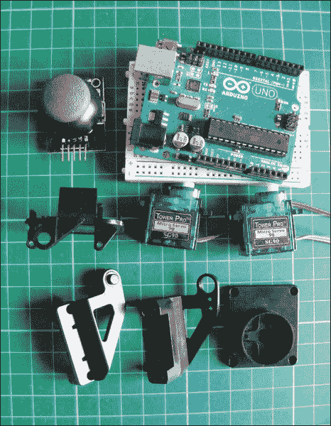
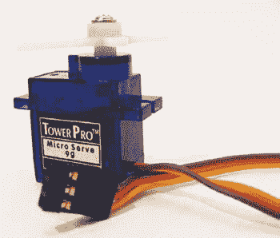
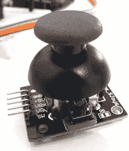
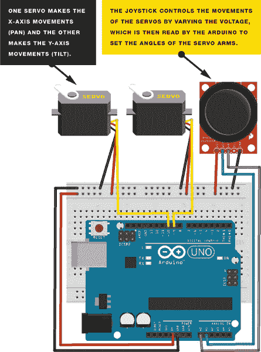
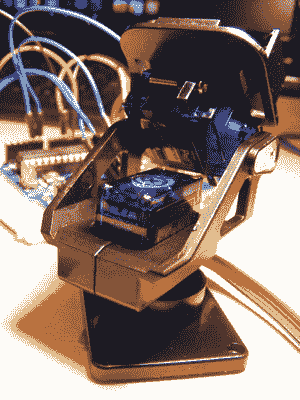
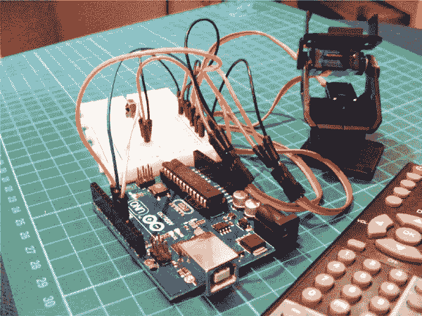
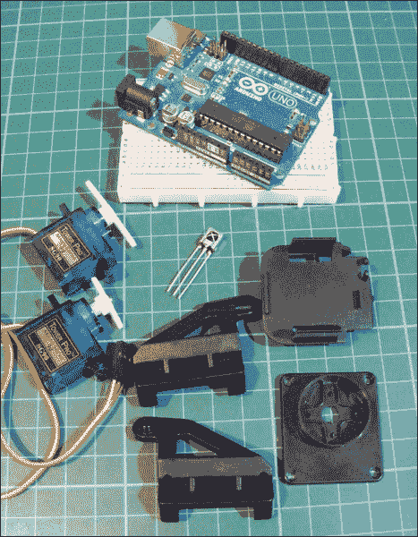
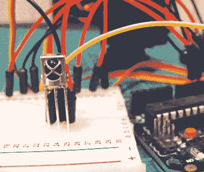
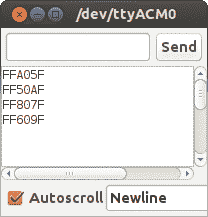
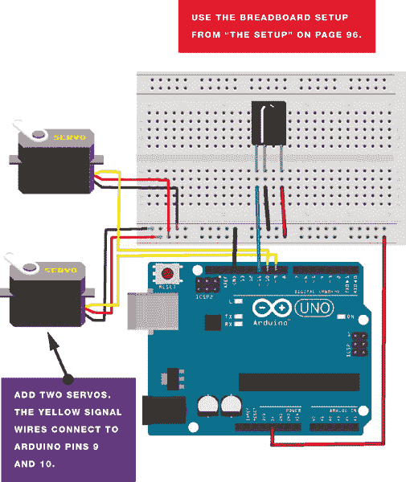

# 第三部分


**舵机**

## 项目 10：操纵杆控制激光

**在本项目中，我们通过将两个舵机连接到操纵杆，并使用这个设置作为激光指示器的平移和俯仰控制器，来创建一个操纵杆控制的激光。**



**所需零件**

• Arduino

• 面包板

• 跳线

• 2 个 Tower Pro SG90 9g 舵机

• 模拟五针、双轴操纵杆模块

• 平移和俯仰支架模块

**所需库**

• 舵机

### 工作原理

舵机是小型电动机，可以精确地将其臂旋转到 0 到 180 度之间的位置。在本项目中，我们将舵机安装在一个倾斜和旋转支架中。倾斜和旋转支架是一个值得投资的模块，因为它使得将激光器安装到舵机上变得更加容易。在这里，我们控制的是激光器，但你也可以轻松地用一个网络摄像头或其他小型设备替代激光器。我们使用两个舵机：一个用于左右移动，另一个用于上下移动。正如你可能记得的，舵机有三根线，如图 10-1 所示：正电源线（红色）、负电源线或地线（黑色或棕色）和信号线（通常为黄色、橙色或白色）。

**图 10-1：**

舵机有三根线。



在我们开始构建之前，你需要了解一下操纵杆是如何工作的。图 10-2 中显示的操纵杆基本上由两个电位器和一个按钮组成，这些元件可以让我们在二维空间中测量摇杆的运动。

**图 10-2：**

这个操纵杆有两个电位器和一个按钮，用于测量运动。



电位器是可变电阻器，作为传感器根据设备围绕其轴的旋转来提供一个变化的电压。所以，当你移动操纵杆时，它的电阻值—也就是输出值—会发生变化。电位器的输出是模拟信号，因此在 Arduino 的模拟引脚读取时，它的值只能在 0 到 1,023 之间。这一数值会发送一个脉冲给 Arduino，Arduino 再控制舵机移动的距离。（有关电位器的更多内容，请参见项目 2）。

一个操纵杆通常有五根引脚：VRx（x 轴信号），VRy（y 轴信号），SW（一个我们在本项目中不会使用的按钮），以及 GND 和+5V 用于电源。

当操纵杆的 x 轴向左或向右移动时，相应的舵机会朝那个方向移动；当操纵杆的 y 轴向上或向下移动时，另一个舵机会向上或向下移动。

### 构建

1.  将两个舵机的红色线连接到+5V 轨道，将它们的棕色线连接到面包板的 GND。

1.  将其中一个舵机的黄色信号线直接连接到 Arduino 的 9 号引脚，另一个舵机的信号线直接连接到 Arduino 的 10 号引脚，如图 10-4 所示的电路图所示。

    | **舵机** | **Arduino** |
    | --- | --- |
    | 红色线 | +5V |
    | 棕色线 | GND |
    | 黄色线 1 | 引脚 9 |
    | 黄色线 2 | 引脚 10 |

1.  将操纵杆模块的 GND 连接到 Arduino 的 GND 轨道，将 +5V 连接到 Arduino 的 +5V 轨道。将 VRx 引脚直接连接到 Arduino A0，将 VRy 引脚直接连接到 Arduino A1。再次强调，SW 开关连接在此项目中没有使用。

    | **操纵杆** | **Arduino** |
    | --- | --- |
    | +5V | +5V |
    | GND | GND |
    | VRx | A0 |
    | VRy | A1 |
    | SW | 未使用 |

1.  将面包板的轨道连接到 Arduino GND 和 +5V，然后检查你的设置是否与 图 10-3 一致。

    **图 10-3：**

    该电路图展示了操纵杆控制激光器的电路。注意，这个电路图中的操纵杆品牌与项目中使用的不同，但连接方式相同，因此项目中的说明是有效的。

    

### 激光器安装

对于这个项目，我将舵机安装到云台模块中；你应该能在 eBay 上通过搜索“Arduino 云台舵机套件”找到这个模块或类似的模块，价格相对合理。你可能需要自己组装，但按照附带的说明很容易完成。

将激光二极管安装在模块的顶部；我建议使用热熔胶枪进行永久固定，但如果需要临时固定，可以使用胶带。现在你可以通过操控操纵杆来控制激光器。舵机会夹入云台模块，如 图 10-5 所示。

**图 10-4：**

将舵机夹入云台模块


移动操纵杆向左和向右将控制 x 轴舵机，移动操纵杆向上和向下将控制 y 轴舵机。完整的组装如图 10-6 所示。

**图 10-5：**

完整的组装



### 草图

草图首先调用 Servo 库，然后将两个舵机定义为 `tilt` 和 `pan`。操纵杆的 x 轴连接到 Arduino 引脚 A0，y 轴连接到 Arduino A1，这些是我们的 `输入`。然后将 x 轴和 y 轴设置为用于运动的变量。`tilt` 舵机连接到 Arduino 引脚 9，`pan` 舵机连接到 Arduino 引脚 10，这些是我们的 `输出`。Arduino 然后读取来自操纵杆的 `输入`，并将该电压转换为 `输出`，根据选择的方向来移动舵机。

```
// Used with kind permission from http://learn.explorelabs.com/
// Creative Commons 4.0 Share Alike (CC by SA 4.0) license

#include <Servo.h>
Servo tilt, pan;  // Create servo object
int joyX = A0;    // Analog pin connected to x-axis servo
int joyY = A1;    // Analog pin connected to y-axis servo
int x, y;         // Variables to read values

void setup() {
  tilt.attach(9); // Attach tilt servo on pin 9 to the servo object
  pan.attach(10); // Attach pan servo on pin 10 to the servo object
}

void loop() {
  x = joyX; // Read value of x-axis (between 0 and 1023)
  y = joyY; // Read value of y-axis (between 0 and 1023)
  x = map(analogRead(joyX), 0, 1023, 900, 2100); // Scale it to use
                                                 // with servo between
                                                 // 900 to 2100
                                                 // microseconds
  y = map(analogRead(joyY), 0, 1023, 900, 2100);
  tilt.write(x); // Set servo position according to scaled value
  pan.write(y);
  delay(15);     // Wait for servos to get to new position
}
```

## 项目 11：遥控舵机

**在这个项目中，我们将使用 Arduino 检查和解码遥控器的信号，然后使用这些代码来控制舵机。**



**所需部件**

• Arduino 板

• 面包板

• 跳线

• 38 kHz 红外接收器

• 遥控器

• 2 个 Tower Pro SG90 9g 舵机

• 云台模块

**所需库**

• 舵机

• IRremote

### 工作原理

首先，我们将使用红外接收器解码遥控器。红外接收器有三个针脚：OUT、GND 和 VCC（如 图 11-1 所示，从左到右）。检查你购买的接收器的数据表，确保它与这个针脚布局匹配。在极少数情况下，你可能会发现接收器的针脚布局不同，但你仍然可以使用针脚图来接线。

**图 11-1：**

红外接收器——从左到右，针脚依次为 OUT、GND 和 VCC



你还需要一个遥控器。你可以使用任何类型的遥控器，包括电视遥控器，但最好使用一个你不再需要的旧遥控器。当你按下遥控器上的按钮时，它会发送一个数字值，该值会被接收器接收。每个按钮的值都是不同的。我们将使用 Arduino 解码每个按钮的值，然后在草图中将它们分配给 Arduino 引脚来控制输出——在这种情况下是伺服电机。

通过根据解码的值个性化草图，你可以将特定的按钮与特定的指令连接，并使用遥控器控制伺服电机。如果你已经按照 项目 10 构建了倾斜和旋转机架模型，你可以在此复用它。否则，翻到 项目 10，查看设置说明。

我们将为倾斜和旋转机架中的伺服电机的方向移动分配一个按钮，因此总共四个按钮将控制所有的运动：左右控制 x 轴伺服电机，上下控制 y 轴伺服电机。短按按钮将使伺服电机以小增量移动，而长按将使伺服电机持续移动，直到达到最大或最小值。

### 硬件设置

1.  从*[`www.nostarch.com/arduinohandbook/`](http://www.nostarch.com/arduinohandbook/)*下载 IRremote 库，并将其添加到你的库文件夹中，具体操作请参见 “Libraries” 和 第 7 页。

1.  将红外接收器插入面包板。将接收器的 OUT 针脚连接到 Arduino 的引脚 11，GND 连接到 Arduino 的 GND，VCC 连接到 Arduino 的 +5V。同样，对于某些版本的 38 kHz 接收器，针脚顺序可能与这里显示的不同，因此请检查与你的组件相对应的数据表。

    | **IR RECEIVER** | **ARDUINO** |
    | --- | --- |
    | OUT | 引脚 11 |
    | GND | GND |
    | VCC | +5V |

1.  现在上传并运行以下代码。

    ```
    /* Copyright 2009 Ken Shirriff
       Used with kind permission
       http://arcfn.com
    */

    #include <IRremote.h> // Use library
    int receiver = 11;    // Pin connected to receiver

    IRrecv irrecv(receiver);
    decode_results results;
    void setup() {
      Serial.begin(9600);  // Show keypresses in IDE
      irrecv.enableIRIn(); // Start up receiver
    }

    void loop() {
      if (irrecv.decode(&results)) { // If there's an input, decode value
        Serial.println(results.value, HEX); // Display button value
                                            // on Serial Monitor in
                                            // hexadecimal format
        irrecv.resume(); // Receive next value
      }
    }
    ```

    草图首先调用 IRremote 库，该库从红外接收器读取数据并将相应的数据发送到 Arduino。红外接收器被分配到 Arduino 的引脚 11，草图开始与 Arduino IDE 通信，这样当按下按钮时，输入值会实时显示在串口监视器中。草图将持续运行，查找按钮按压，并将相应的值显示给 IDE。

1.  打开 IDE 中的串口监视器。

1.  将遥控器对准接收器，并尝试按下不同的按钮。它们将在串口监视器中以十六进制（HEX）格式解码为字母和数字，如图 11-2 所示。尝试快速而短促的按压以获得最佳效果。如果按住按钮时间过长，串口监视器将显示*F*，直到你松开按钮为止。

    **图 11-2：**

    当遥控器上的按钮被按下时，该按钮的 HEX 代码将在 Arduino IDE 的串口监视器中显示。

    

    记下显示的数字及其对应的按钮。你以后需要这些数字。

现在我们已经解码了遥控器按钮的信号，可以用它们来控制两个舵机。

### 搭建

1.  使用你在第 96 页第 2 步的面包板设置，接收器已连接，连接舵机到 Arduino。将每个舵机的棕色线连接到 GND，红色线连接到+5V。然后，将第一个舵机的黄色控制线连接到 Arduino 的引脚 10，将第二个舵机的黄色控制线连接到 Arduino 的引脚 9。

    | **舵机** | **Arduino** |
    | --- | --- |
    | 红色线 | +5V |
    | 棕色线 | GND |
    | 黄色线（舵机 1） | 引脚 10 |
    | 黄色线（舵机 2） | 引脚 9 |

1.  记得给面包板连接电源。

1.  检查你的设置是否与图 11-3 中的电路图相符，然后上传在草图第 99 页的代码。

    **图 11-3：**

    遥控器舵机的电路图

    

### 草图

确保在完成草图时使用在“设置”第 3 步中解码的值，而不是这里提供的值。更改草图中的值以匹配你自己的代码时，保持 0x 前缀，并在其后添加你的 HEX 代码。例如，对于我解码的第一个按钮，HEX 代码是 FFA05F，草图中的显示如下：

```
unsigned long Value1 = 0xFFA05F;
```

在这个项目中，我们控制的是舵机，但你可以稍微修改代码来远程控制任何需要设置为`HIGH`的设备，例如 LED 或压电蜂鸣器。

草图调用了 IRremote 库来读取接收器，调用了 Servo 库来驱动舵机。前两个按钮被分配给 x 轴舵机，控制角度最大可调为 70 度（向左转）或 160 度（向右转）。第三和第四个按钮被分配给 y 轴舵机，控制上下倾斜运动。

如果你想将此项目适配为其他输出，只需稍作修改代码：

```
servo.write
```

到：

```
digitalWrite(pin, HIGH)
```

按如下方式输入草图：

```
/* IR Library Copyright Ken Shirriff
   Used with kind permission
   http://arcfn.com
 */

#include <Servo.h>    // Include the Servo library
#include <IRremote.h> // Include the IRremote library

unsigned long Value1 = 0xFFA05F; // Change this to your value
unsigned long Value2 = 0xFF50AF; // Change this to your value
unsigned long Value3 = 0xFF807F; // Change this to your value
unsigned long Value4 = 0xFF609F; // Change this to your value

int RECV_PIN = 11;
IRrecv irrecv(RECV_PIN);
decode_results results;
Servo servo1;
Servo servo2;

void setup() {         // Set up routine
  Serial.begin(9600);
  irrecv.enableIRIn(); // Start the IR receiver
  servo1.attach(10);   // Pin connected to servo 1
  servo2.attach(9);    // Pin connected to servo 2
}

void loop() { // Loop routine runs forever
  if (irrecv.decode(&results)) {
    Serial.println(results.value, HEX);
    irrecv.resume(); // Receive the next value
  }
  if (results.value == Value1) { // If remote code matches value 1,
                                 // then move the servo
    servo1.write(160);
  }
  else if (results.value == Value2) { // If remote code matches
                                      // value 2, then move the
                                      // servo, and so on
    servo1.write(70);
  }
  else if (results.value == Value3) {
    servo2.write(70);
  }
  else if (results.value == Value4) {
    servo2.write(160);
  }
}
```
