# 第四部分


**LCD 屏幕**

## 项目 12：LCD 屏幕编程器

**不仅 LCD 屏幕显示你自己的信息很令人满足，而且它也非常有用。**

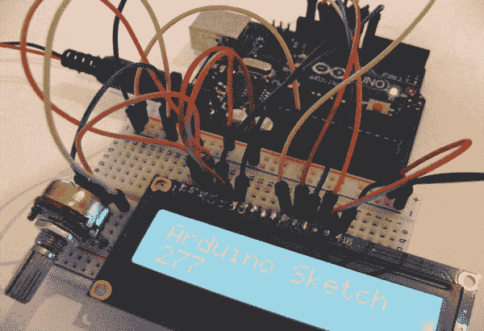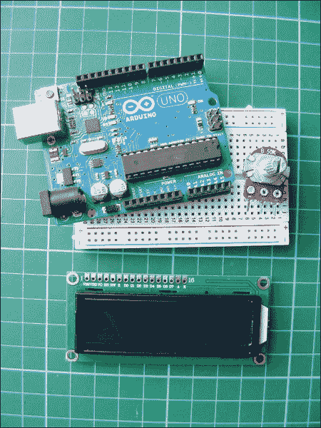

**所需零件**

• Arduino 主板

• 面包板

• 跳线

• 16×2 LCD 屏幕（兼容 Hitachi HD44780）

• 50k 欧姆电位计

**所需库**

• LiquidCrystal

### 工作原理

LCD（液晶显示）屏幕由两层偏振材料组成，中间夹着液晶溶液。电流通过溶液会形成图像或字符，在这个项目中就是字符。为了使 LCD 屏幕能够与 Arduino 一起工作，你需要一个与 Hitachi HD44780 驱动程序兼容的 LCD 屏幕——市场上有很多这样的屏幕，通常可以通过其 16 针接口来识别。

我们将使用 LiquidCrystal 库将字符发送到 LCD 屏幕。LiquidCrystal 库将字符映射并使用 `print.lcd` 命令将信息从草图复制到屏幕上。

在开始之前，你需要准备好你的 LCD 屏幕。

### 准备 LCD 屏幕

LCD 屏幕可能需要一些组装。你的屏幕应该有 16 个孔（如图 12-1 所示），并附带一排独立的插头引脚。

**图 12-1：**

LCD 屏幕的顶部有 16 个引脚。


拿起这排引脚并断开 16 个引脚的一排。将引脚的短侧插入 16 个 LCD 孔中。你需要将这些引脚焊接到位：首先焊接最右和最左的引脚来固定插头，等它们稳定后再焊接每个引脚。每个引脚的焊接时间不宜过长，只需几秒钟（如果你从未焊接过，可以查看快速焊接指南，见第 18 页）。

### 构建过程

1.  将 LCD 屏幕放入面包板中，将插头引脚插入面包板孔中。也将电位计放入面包板中，并使用面包板和跳线连接 LCD 屏幕、Arduino 和电位计，如下表所示以及图 12-2 中所示。LCD 模块有三个 GND 引脚连接，因此可以使用面包板上的 GND 排来完成这些连接。

    **图 12-2：**

    LCD 屏幕与 Arduino 之间的连接。LCD 屏幕的引脚 15 和 16 是背光的电源和地线。

    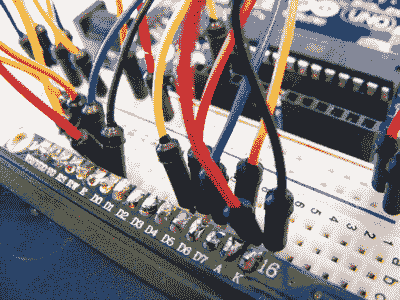

    | **LCD 屏幕** | **Arduino** |
    | --- | --- |
    | 1 VSS | GND |
    | 2 VDD | +5V |
    | 3 VO 对比度 | 电位计中心引脚 |
    | 4 RS | 引脚 7 |
    | 5 R/W | GND |
    | 6 使能 | 引脚 8 |
    | 7 D0 | 未使用 |
    | 8 D1 | 未使用 |
    | 9 D2 | 未使用 |
    | 10 D3 | 未使用 |
    | 11 D4 | 引脚 9 |
    | 12 D5 | 引脚 10 |
    | 13 D6 | 引脚 11 |
    | 14 D7 | 引脚 12 |
    | 15 A BcL+ | +5V |
    | 16 K BcL– | GND |

1.  50k 欧姆电位器的中心引脚连接到 LCD 的引脚 3（VO）。该电位器控制屏幕的对比度。旋转它直到你能清晰地看到屏幕上的字符。现在，将其中一个外侧引脚连接到 GND，另一个连接到+5V。

1.  背光 LCD 屏幕（见图 12-3）会内置电阻，但如果你使用的是非背光 LCD 屏幕，应该在 LCD 的引脚 15 和+5V 之间插入一个 220 欧姆电阻。（屏幕包装上会注明是否有背光。）

    **图 12-3：**

    一个背光 LCD 屏幕

    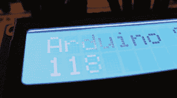

1.  你的设置应该像图 12-4 所示。对照图 12-5 中的电路图检查你的工作，然后上传代码，参见“草图”在第 107 页。

    **图 12-4：**

    完整的设置

    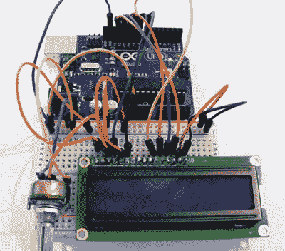

    **图 12-5：**

    LCD 屏幕编程的电路图

    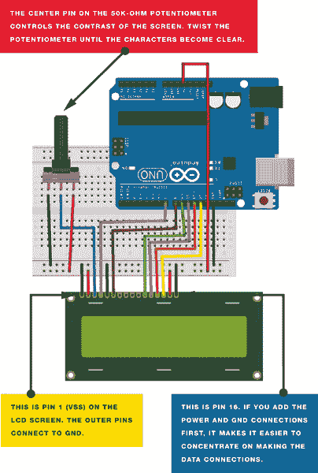

### 草图

这个草图包含在你的 IDE 示例中。通过 IDE 加载它，方法是依次点击**文件  示例  LiquidCrystal**，然后点击**滚动**。该草图使用内置在 Arduino IDE 中的 LiquidCrystal 库，将信息从 Arduino 发送到 LCD 屏幕。你可以通过将“`Arduino Sketch`”替换为其他文本来更改消息。

要使用这个电路设置与 Arduino IDE 中的示例草图，我们还需要在草图中更改 LCD 引脚（12, 11, 5, 4, 3, 2）到 7, 8, 9, 10, 11, 12，因为这些是我们分配的引脚。我在这里重新创建了草图，正如你在 IDE 中看到的一样，但已经做了这些更改。

```
   /*
   Library originally added 18 Apr 2008 by David A. Mellis
     library modified 5 Jul 2009 by Limor Fried (http://www.ladyada.net)
     example added 9 Jul 2009 by Tom Igoe
     modified 22 Nov 2010 by Tom Igoe
     This example code is in the public domain.
     http://www.arduino.cc/en/Tutorial/LiquidCrystal

   LiquidCrystal Library - scrollDisplayLeft() and scrollDisplayRight()

   Demonstrates the use of a 16x2 LCD display. The LiquidCrystal
   library works with all LCD displays that are compatible with the
   Hitachi HD44780 driver. There are many of them out there, and you
   can usually tell them by the 16-pin interface.

   This sketch prints "Arduino Sketch" to the LCD and uses the
   scrollDisplayLeft() and scrollDisplayRight() methods to scroll
   the text.
   */

   // Include the library code
   #include <LiquidCrystal.h>

   // Initialize the library with the numbers of the interface pins
➊ LiquidCrystal lcd(7, 8, 9, 10, 11, 12);

   void setup() {
     // Set up the LCD's number of columns and rows
     lcd.begin(16, 2);
     // Print a message to the LCD
➋   lcd.print("Arduino Sketch");
     delay(1000);
   }

   void loop() {
     // Scroll 13 positions (string length) to the left
     // to move it offscreen left
     for (int positionCounter = 0; positionCounter < 13;
   positionCounter++) {
       // Scroll one position left
       lcd.scrollDisplayLeft();
       // Wait a bit
       delay(150);
     }
     // Scroll 29 positions (string length + display length) to the right
     // to move it offscreen right
     for (int positionCounter = 0; positionCounter < 29;
   positionCounter++) {
       // Scroll one position right
       lcd.scrollDisplayRight();
       // Wait a bit
       delay(150);
     }
     // Scroll 16 positions (display length + string length) to the left
     // to move it back to center
     for (int positionCounter = 0; positionCounter < 16;
   positionCounter++) {
       // Scroll one position left
       lcd.scrollDisplayLeft();
       // Wait a bit
       delay(150);
     }
     // Delay at the end of the full loop
     delay(1000);
   }
```

## 项目 13：天气站

**在这个项目中，你将建立一个天气站来测量温度和湿度，并将数值显示在 LCD 屏幕上。**

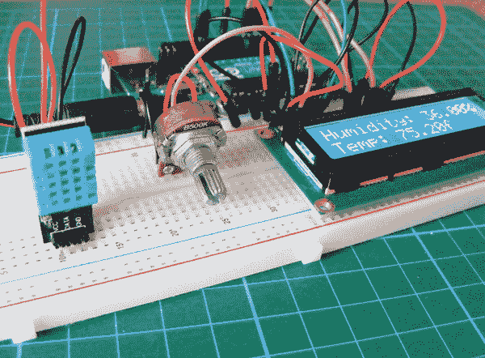

**所需部件**

• Arduino 开发板

• 面包板

• 跳线

• 50k 欧姆电位器

• 16x2 LCD 屏幕（兼容 Hitachi HD44780）

• DHT11 湿度传感器

**所需库**

• LiquidCrystal

• DHT

### 工作原理

本项目使用的湿度传感器是相对便宜的 DHT11，如图 13-1 所示，它可以测量湿度和温度。它使用电容式湿度传感器和电阻式温度传感器来读取环境数据。它将这些数据作为电压发送给 Arduino，Arduino 将其转换为可读的数值并显示在屏幕上。为了获得最佳效果，建议将传感器安装在外墙上，并确保周围有足够的开放空间。你应将 LCD 屏幕安装在室内，或者将其小心密封在一个清晰的防水袋或外壳中，以保护它免受外部环境的影响。

**图 13-1：**

DHT11 既测量温度也测量湿度。

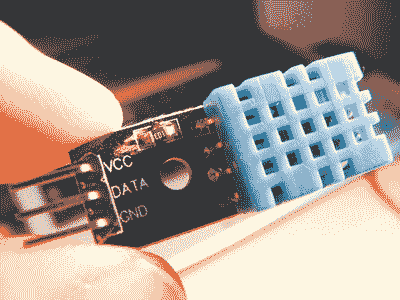

DHT11 传感器有四个脚或者三个脚。图 13-1 中显示的传感器有四个脚，但你可以使用任意版本的 DHT11 进行本项目，因为你不会使用第 3 脚。在书本开头查看零售商，了解在哪里购买 DHT11。

### 项目构建

1.  首先，按照“准备 LCD 屏幕”中的焊接说明准备 LCD 屏幕（见第 104 页）。将 DHT11 传感器插入面包板。当传感器正面朝向你时，DHT11 的引脚从左到右依次编号为 1 至 4（或 3）。将引脚 1 连接到+5V 电源轨，将引脚 2 直接连接到 Arduino 的引脚 8，将引脚 4（或 3）连接到 GND。

    | **DHT11** | **ARDUINO** |
    | --- | --- |
    | 引脚 1 | +5V |
    | 引脚 2 | 引脚 8 |
    | 引脚 3 | 未使用 |
    | 引脚 4 | GND |

1.  将 LCD 屏幕插入面包板，并按照下表以及图 13-2 所示连接引脚到 Arduino。GND 和+5V 电源轨将有多个连接。

    | **LCD 屏幕** | **ARDUINO** |
    | --- | --- |
    | 1 VSS | GND |
    | 2 VDD | +5V |
    | 3 VO 对比度 | 电位器中心脚 |
    | 4 RS | 引脚 12 |
    | 5 R/W | GND |
    | 6 使能 | 引脚 11 |
    | 7 D0 | 未使用 |
    | 8 D1 | 未使用 |
    | 9 D2 | 未使用 |
    | 10 D3 | 未使用 |
    | 11 D4 | 引脚 5 |
    | 12 D5 | 引脚 4 |
    | 13 D6 | 引脚 3 |
    | 14 D7 | 引脚 2 |
    | 15 A BcL + | +5V |
    | 16 K BcL – | GND |

    **图 13-2：**

    将 LCD 屏幕插入面包板

    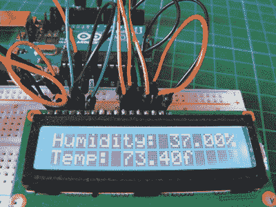

1.  如图 13-3 所示，将电位器插入面包板，并将中心脚连接到 LCD 的引脚 3。将一个外脚连接到+5V 电源轨，另一个外脚连接到 GND 电源轨。

    **图 13-3：**

    将电位器插入面包板

    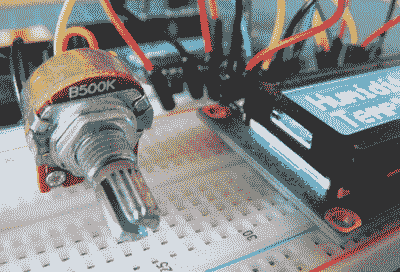

1.  记得将面包板的电源轨连接到 Arduino 的 GND 和+5V。确认你的布线与图 13-4 中的电路图相符，并上传第 116 页中的“草图”代码。

    **图 13-4：**

    天气站电路图

    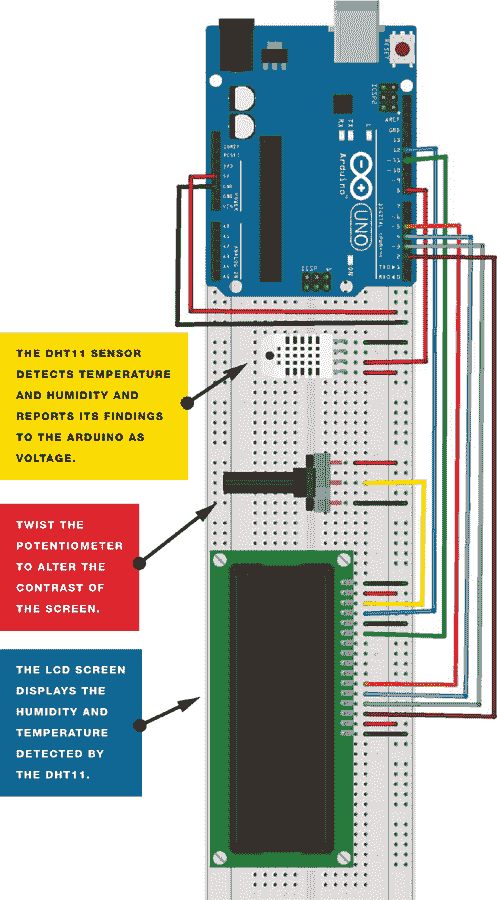

### 草图

此草图使用 LiquidCrystal 库，该库附带 Arduino IDE，还使用 DHT 库，您需要从*[`nostarch.com/arduinohandbook/`](http://nostarch.com/arduinohandbook/)*下载并安装（见第 7 页的“库文件”）。DHT 库控制传感器的功能，LCD 库则将读数显示在屏幕上。

```
/* Example testing sketch for various DHT humidity/temperature
sensors. Written by ladyada, public domain. */

#include <LiquidCrystal.h>
#include "DHT.h" // Call the DHT library
#define DHTPIN 8 // Pin connected to DHT
LiquidCrystal lcd(12, 11, 5, 4, 3, 2);
#define DHTTYPE DHT11  // Define the type of DHT module
DHT dht(DHTPIN, DHTTYPE); // Command to the DHT.h library

void setup() {
  dht.begin(); // Start the sensor
  lcd.begin(16, 2); // LCD screen is 16 characters by 2 lines
}

void loop() {
  float h = dht.readHumidity(); // Value for humidity
  float t = dht.readTemperature(); // Value for temperature
  t = t * 9 / 5 + 32; // Change reading from Celsius to Fahrenheit
  if (isnan(t) || isnan(h)) { // Check that DHT sensor is working
    lcd.setCursor(0, 0);
    lcd.print("Failed to read from DHT");  // If DHT is not working,
                                           // display this
  } else { // Otherwise show the readings on the screen
    lcd.clear();
    lcd.setCursor(0, 0);
    lcd.print("Humidity: ");
    lcd.print(h);
    lcd.print("%");
    lcd.setCursor(0, 1);
    lcd.print("Temp: ");
    lcd.print(t);
    lcd.print("f");
  }
}
```

## 项目 14：占卜师

**在这个项目中，我们将制作一个经典的占卜装置的电子版：魔法 8 球。**

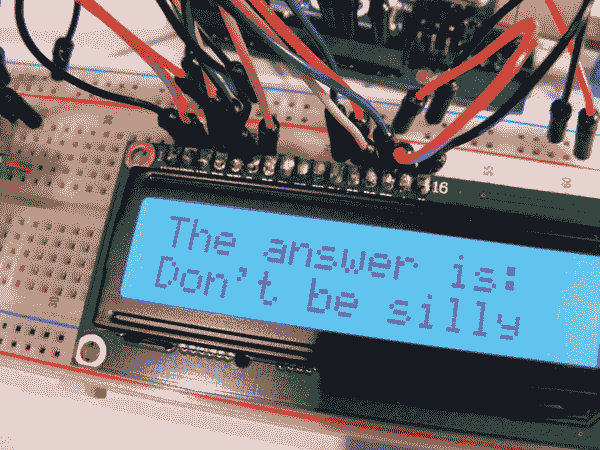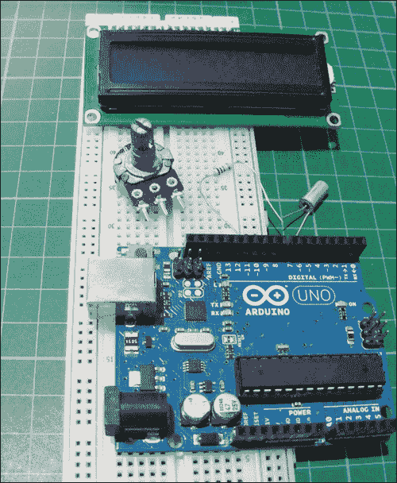

**所需零件**

• Arduino 开发板

• 面包板

• 跳线

• 16x2 LCD 屏幕（适用于日立 HD44780 兼容型）

• 倾斜球开关

• 50k 欧姆电位器

• 1k 欧姆电阻

**所需库文件**

• LiquidCrystal

### 工作原理

魔术 8 球是一种上世纪 50 年代创造的玩具，由一个空心球和浮动在酒精中的 20 面骰子组成。当你问球一个问题并摇动它时，骰子的一面会浮出并在球的窗口中显示你的答案。

在这个项目中，你将使用一个倾斜球开关，如 图 14-1 所示。倾斜球开关由一个金属球和金属外壳组成，当开关处于竖直位置时，金属球会接触并完成连接。如果你倾斜开关，金属球会移动，连接断开。有很多种倾斜开关可供选择，它们都能完成同样的工作。在这个项目中，你将提一个问题并摇动开关。当开关再次恢复竖直位置时，它会连接到 Arduino，Arduino 随后会从八个预设答案中随机选择一个，并在 LCD 屏幕上显示出来。

**图 14-1：**

倾斜球开关插入面包板

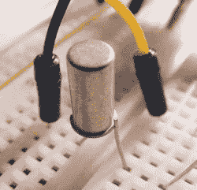

可变电阻控制 LCD 屏幕的对比度。

### 构建

1.  按照 “准备 LCD 屏幕” 中的焊接说明准备 LCD 屏幕，该说明在 第 104 页。

1.  将 LCD 屏幕放置在面包板上，将引脚插入面包板的孔中。同时将可变电阻也放置在面包板上，并使用面包板和跳线连接你的 LCD 屏幕、Arduino 和可变电阻。

    | **LCD 屏幕** | **ARDUINO** |
    | --- | --- |
    | 1 VSS | GND |
    | 2 VDD | +5V |
    | 3 VO 对比度 | 可变电阻的中间引脚 |
    | 4 RS | 引脚 12 |
    | 5 R/W | GND |
    | 6 Enable | 引脚 11 |
    | 7 D0 | 未使用 |
    | 8 D1 | 未使用 |
    | 9 D2 | 未使用 |
    | 10 D3 | 未使用 |
    | 11 D4 | 引脚 5 |
    | 12 D5 | 引脚 4 |
    | 13 D6 | 引脚 3 |
    | 14 D7 | 引脚 2 |
    | 15 A BcL + | +5V |
    | 16 K BcL – | GND |

1.  记得使用面包板导轨将多个连接连接到 Arduino 的 GND 引脚，如 图 14-2 所示。

    **图 14-2：**

    LCD 屏幕已连接到 Arduino。

    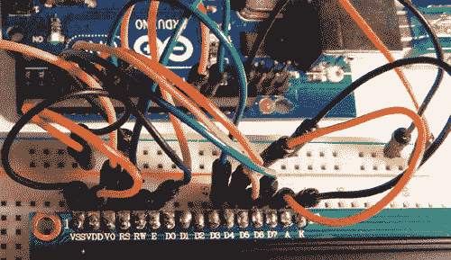

1.  你应该已经将 10k 欧姆可变电阻的中间引脚连接到 LCD 的引脚 3 (VO)。现在，将其中一个外部引脚连接到 GND，另一个连接到 +5V。这将控制 LCD 屏幕的对比度。

1.  将倾斜开关插入你的面包板，并通过一个 1k 欧姆电阻将一侧连接到 Arduino 的引脚 6，另一侧连接到 GND。

    | **倾斜球开关** | **ARDUINO** |
    | --- | --- |
    | 引脚 1 | 通过 1k 欧姆电阻连接到引脚 6 |
    | 引脚 2 | GND |

1.  将你的面包板导轨连接到 Arduino 的 +5V 和 GND 以供电。

1.  确认你的设置与 图 14-3 相匹配，并上传 “草图” 中的代码，该代码在 第 122 页。

    **图 14-3：**

    占卜器的电路图

    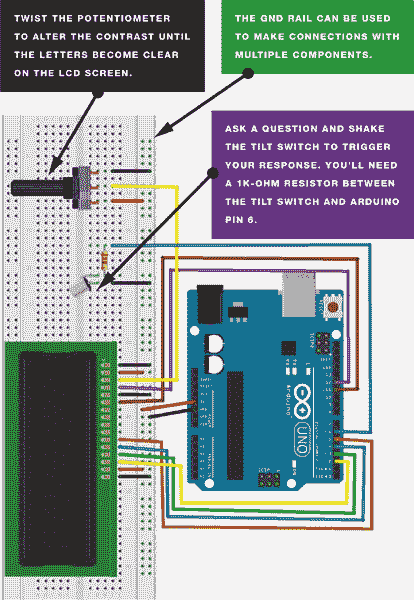

### 草图

这个项目的代码相当简单。当你打开 Arduino 时，LCD 屏幕显示消息`Ask a Question`。摇动倾斜开关激活草图，Arduino 从八个可用的答案（案例 0-7）中随机选择一个答案。

这是代码中实现此功能的那一行：

reply = random(8);

要加入你自己的响应，改变值`8`为可能的响应数量，然后以与其他响应相同的格式添加你的响应（或案例）：

case 8:

lcd.print("你敢打赌");

break;

这是完整的代码：

```
/* Created 13 September 2012 by Scott Fitzgerald
   http://arduino.cc/starterKit
   This example code is part of the public domain
*/

#include <LiquidCrystal.h>

LiquidCrystal lcd(12, 11, 5, 4, 3, 2); // Pins attached to LCD screen

const int switchPin = 6; // Pin attached to tilt switch
int switchState = 0;
int prevSwitchState = 0;
int reply;

void setup() {
  lcd.begin(16, 2);
  pinMode(switchPin, INPUT);   // Set tilt switch pin as an input
  lcd.print("FORTUNE TELLER"); // Print this on line 1
  lcd.setCursor(0, 1);
  lcd.print("Ask a Question"); // Print this on line 2
}

void loop() {
  switchState = digitalRead(switchPin); // Read tilt switch pin
  if (switchState != prevSwitchState) {
    if (switchState == LOW) { // If circuit is broken, give answer
      reply = random(8); // Reply is 1 of 8 random cases as below
      lcd.clear();
      lcd.setCursor(0, 0);
      lcd.print("The answer is: "); // Print this to the screen
      lcd.setCursor(0, 1);

      switch (reply) { // Reply will be one of the following cases
        case 0:
          lcd.print("Yes");
          break;

        case 1:
          lcd.print("Probably");
          break;

        case 2:
          lcd.print("Definitely");
          break;

        case 3:
          lcd.print("Don't be silly");
          break;

        case 4:
          lcd.print("Of course");
          break;

        case 5:
          lcd.print("Ask again");
          break;

        case 6:
          lcd.print("Doubtful");
          break;

        case 7:
          lcd.print("No");
          break;
      }
    }
  }
   prevSwitchState = switchState; // Reset the switch
}
```

## 项目 15：反应计时游戏

**在这个项目中，让我们将 LCD 屏幕与 RGB LED 和压电蜂鸣器结合起来，制作一个反应计时游戏。**

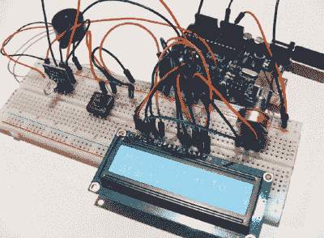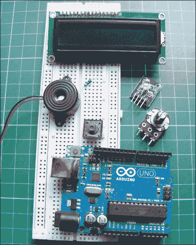

**所需零件**

• Arduino 主板

• 面包板

• 跳线

• 16x2 LCD 屏幕（兼容 Hitachi HD44780）

• RGB LED 模块

• 压电蜂鸣器

• 瞬时触觉四脚按钮

• 50k 欧姆电位器

• 220 欧姆电阻

**所需库**

• LiquidCrystal

### 工作原理

你通过按住按钮来开始游戏。RGB LED 亮起并逐渐变换为一些随机颜色。你的目标是尽可能快地做出反应，当 LED 变红时松开按钮。LCD 屏幕显示你的反应时间，单位是毫秒，从 LED 变红到松开按钮的时间（见图 15-1）。

**图 15-1：**

当你松开按钮时，你的反应时间将显示在 LED 屏幕上。

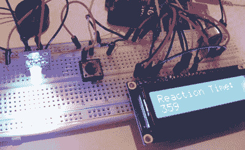

压电蜂鸣器通过发出随机声音来分散你的注意力。如果你太快松开按钮，LCD 屏幕会显示一个消息，告诉你重新开始。

正如其名称所示，RGB LED 实际上是三个 LED 的组合：红色、绿色和蓝色（见图 15-2）。

**图 15-2：**

RGB LED 可以是红色、绿色或蓝色。


RGB 是一种*加法*色彩模型，这意味着通过组合两种或更多颜色的光，我们可以创造出其他颜色。红色、绿色和蓝色是通常用作其他颜色基础的加法原色，如图 15-3 所示。

**图 15-3：**

RGB 色彩模型是加法的。


让我们更详细地看看 RGB LED。图 15-4 展示了一个清晰的共阴极 LED。注意，LED 有四根脚，而不是通常的两根：一根分别用于红色、绿色和蓝色，最后一根是阴极或阳极。在这种情况下，最长的引脚是阴极，它连接到地（GND）。

**图 15-4：**

一个 RGB LED 有四根脚，而不是通常的两根。

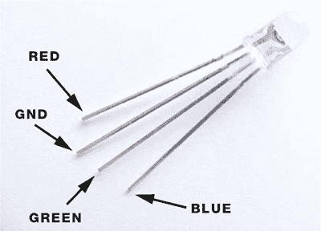

本项目中使用的 RGB LED 是一个带内建电阻的模块，这样可以节省面包板上的空间。

### 搭建过程

1.  按照《准备 LCD 屏幕》中的焊接说明，准备 LCD 屏幕，见第 104 页。

1.  将 LCD 屏幕放置在面包板上，将其头针插入面包板孔中。同时，将电位器放入面包板，并使用面包板和跳线将 LCD 屏幕、Arduino 和电位器连接起来。

    | **LCD 屏幕** | **ARDUINO** |
    | --- | --- |
    | 1 VSS | GND |
    | 2 VDD | +5V |
    | 3 VO 对比度 | 电位器中间引脚 |
    | 4 RS | 引脚 11 |
    | 5 R/W | GND |
    | 6 启用 | 引脚 12 |
    | 7 D0 | 未使用 |
    | 8 D1 | 未使用 |
    | 9 D2 | 未使用 |
    | 10 D3 | 未使用 |
    | 11 D4 | 引脚 5 |
    | 12 D5 | 引脚 4 |
    | 13 D6 | 引脚 3 |
    | 14 D7 | 引脚 2 |
    | 15 A BcL + | +5V |
    | 16 K BcL – | GND |

1.  你应该已经将 50 千欧电位器的中间引脚连接到 LCD 引脚 3（VO）。现在将一个外侧引脚连接到 GND，另一个连接到+5V。这个操作控制你的 LCD 屏幕的对比度。

1.  将按钮插入面包板，使其跨过中间的断开部分。我们将按图 15-5 标记引脚。

    **图 15-5：**

    按钮横跨中心断开。

    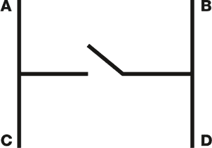

    将引脚 A 通过 220 欧姆电阻连接到地，C 引脚连接到 Arduino 引脚 9，D 引脚连接到+5V（更多关于按钮如何工作的内容请参见项目 1）。

    | **按钮** | **ARDUINO** |
    | --- | --- |
    | 引脚 A | 通过 220 欧姆电阻接地 |
    | 引脚 C | 引脚 9 |
    | 引脚 D | +5V |

1.  插入 RGB 模块，将红色引脚连接到 Arduino 引脚 8，绿色连接到引脚 6，蓝色连接到引脚 7，+连接到+5V。

    | **RGB LED** | **ARDUINO** |
    | --- | --- |
    | 红色 | 引脚 8 |
    | 绿色 | 引脚 6 |
    | 蓝色 | 引脚 7 |
    | + | +5V |

1.  将蜂鸣器的红线直接连接到 Arduino 引脚 13，黑线连接到 GND。

    | **蜂鸣器** | **ARDUINO** |
    | --- | --- |
    | 红线 | 引脚 13 |
    | 黑线 | GND |

1.  检查你的构建是否符合图 15-7，然后上传《草图》中的代码到第 130 页，开始游戏吧！

    **图 15-6：**

    反应计时器游戏的电路图。你可能会发现，先添加所有的 GND 和+5V 线再接数据线会更容易。

    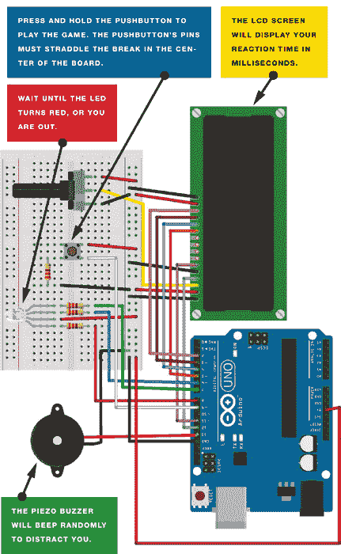

### 草图

当你按下并保持按钮时，LED 会闪烁随机颜色，最终变为红色。每种颜色显示的持续时间是随机的，灯光间的暂停时间也是随机的。这意味着你无法学习颜色的顺序，也无法预测 LED 何时变为红色。

你可以通过在草图中的以下代码行中增加间隔时间，使游戏变得更具挑战性：

```
PSE = random(500, 1200);
```

完整的草图如下：

```
// Created by Steven De Lannoy and reproduced with kind permission
// http://www.wingbike.nl
// Used an RGB LED with a common anode (3 cathodes: R, G, B)
#include <LiquidCrystal.h>
LiquidCrystal lcd(12, 11, 5, 4, 3, 2);
int LEDR = 8;   // Pin connected to red LED
int LEDB = 7;   // Pin connected to blue LED
int LEDGr = 6;  // Pin connected to green LED
int Button = 9; // Pin connected to pushbutton
int COLOR;      // Variable color
int Beep;
int PSE;        // Variable pause
int TME;        // Time
int RTME = 0;   // Reaction time

void setup() {
  lcd.begin(16, 2);
  pinMode(LEDR, OUTPUT);   // Set LED pins as output
  pinMode(LEDB, OUTPUT);
  pinMode(LEDGr, OUTPUT);
  pinMode(Button, INPUT);  // Set pushbutton as input
  digitalWrite(LEDR, LOW); // Switch on all LED colors
  digitalWrite(LEDB, LOW);
  digitalWrite(LEDGr, LOW);
}

void loop() {
  lcd.clear(); // Clear screen
  lcd.print("Hold Button to"); // Display message on LCD screen
  lcd.setCursor(0, 1); // Move to second line
  lcd.print("start.");
  while (digitalRead(Button) == LOW) { // Test does not start until
                                       // button is pushed (and held)
    tone(13, 1200, 30);
    delay(1400);
    noTone(13);
  }
 lcd.clear();
  digitalWrite(LEDR, HIGH); // Switch off start light
  digitalWrite(LEDB, HIGH);
  digitalWrite(LEDGr, HIGH);
  randomSeed(analogRead(0)); // Random noise from pin 0
  COLOR = random(1, 4); // Generate random color
  PSE = random(500, 1200); // Set random pause duration between lights
  // Repeat this loop while color is green or blue AND pushbutton
  // is held
  while (COLOR != 1 && digitalRead(Button) == HIGH) {
    digitalWrite(LEDGr, HIGH);
    digitalWrite(LEDB, HIGH);
    delay(PSE);
    randomSeed(analogRead(0));
    Beep = random(1, 4); // Select random beep from buzzer
                         // (buzzer beeps 1 in 3 times)
    PSE = random(750, 1200); // Select random pause duration between
                             // lights (to increase surprise effect)
    if (Beep == 1) {
      tone(13, 1600, 350);
      delay(750);
      noTone(13);
    }
    if (COLOR == 2) {
      digitalWrite(LEDGr, LOW);
    }
    if (COLOR == 3) {
      digitalWrite(LEDB, LOW);
    }
    delay(PSE);
    randomSeed(analogRead(0));
    COLOR = random(1, 4); // Select random color
  }
  // Execute this loop if color is red
  if (COLOR == 1 && digitalRead(Button) == HIGH) {
    digitalWrite(LEDGr, HIGH);
    digitalWrite(LEDB, HIGH);
    delay(PSE);
    TME = millis(); // Record time since program has started
    digitalWrite(LEDR, LOW);
    while (digitalRead(Button) == HIGH) { // Runs until button is
                                          // released, recording the
                                          // reaction time
      delay(1);
    }
    lcd.display();
    RTME = millis() - TME; // Reaction time in ms
    lcd.print("Reaction Time:"); // Display on LCD screen
    lcd.setCursor(0, 1);
    lcd.print(RTME);
  }

  // Execute if color is NOT red but the pushbutton is released
  if (COLOR != 1) {
    lcd.print("Released too");
    lcd.setCursor(0, 1); // Move to second line
    lcd.print("soon!!!");
    tone(13, 3000, 1500);
    delay(500);
    noTone(13);
  }
  // Test does not restart until the button is pushed once
  while (digitalRead(Button) == LOW) {
    delay(10);
  }
  digitalWrite(LEDR, LOW); // Reset all lights to begin again
  digitalWrite(LEDB, LOW);
  digitalWrite(LEDGr, LOW);
  lcd.clear();
  lcd.print("Hold Button to");
  lcd.setCursor(0, 1);
  lcd.print("start.");
  int Time = 0;
  delay(1000);
}
```
