# 第五部分


**数字计数器**

## 项目 16：电子骰子

**桌面游戏已经够危险了，别再争论掉落或丢失的骰子的数字了。完美的解决方案：电子骰子。**

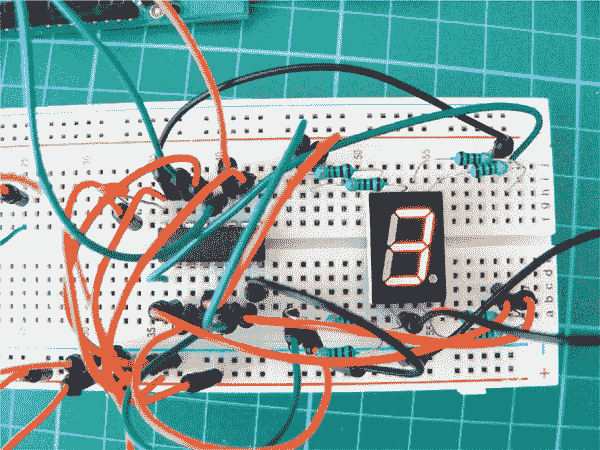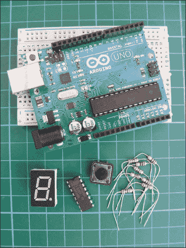

**所需部件**

• Arduino 板

• 面包板

• 跳线

• 8 个 220 欧姆电阻

• 七段 LED 显示器

• 74HC595 移位寄存器

• 瞬时触觉四脚按钮

### 工作原理

在这个项目中，我们将使用七段 LED 显示器创建一个骰子。当按钮被按下时，会向 Arduino 发送一个脉冲，LED 会“摇动”并显示一个 1 到 6 之间的随机数字。

该项目使用 74HC595 *移位寄存器*，这是一种小型集成电路（IC）和顺序逻辑计数器，允许 Arduino 通过“移位”和存储数据来比通常的引脚更多地进行连接。移位寄存器有 16 个引脚；在一端，您会看到一个点或半圆标记，表示引脚 1 在左侧。然后，按逆时针方向对引脚编号。图 16-1 显示了引脚排列，表 16-1 描述了每个引脚的功能。

**图 16-1：**

74HC595 移位寄存器的引脚排列

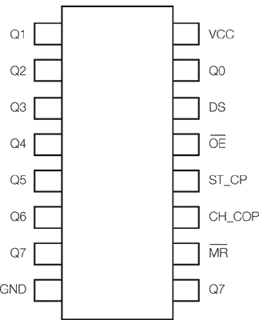

**表 16-1：**

74HC595 移位寄存器引脚

| **移位寄存器引脚** | **连接** | **引脚功能** |
| --- | --- | --- |
| 引脚 1–7，15 | Q0–Q7 | 输出引脚 |
| 引脚 8 | GND | 地线，VSS |
| 引脚 9 | Q7 | 串行输出 |
| 引脚 10 | MR | 主复位，低有效 |
| 引脚 11 | SH_CP | 移位寄存器时钟引脚（时钟引脚） |
| 引脚 12 | ST_CP | 存储寄存器时钟引脚（锁存引脚） |
| 引脚 13 | OE | 输出使能，低有效 |
| 引脚 14 | DS | 串行数据输入（数据引脚） |
| 引脚 16 | VCC | 正电源 |

连接到 Arduino 引脚 2 的线与我们的按钮相连，按下时会产生一个脉冲。为了使用骰子，按下按钮使骰子上的数字摇动并显示一个随机数字。

### 构建过程

1.  将七段 LED 插入面包板，确保它跨越中心断开区域；否则，相对的引脚将连接并短路。将引脚 3 连接到 GND 电源轨，并将 220 欧姆电阻连接到其余引脚，除了引脚 8，它未使用。电阻是必要的，以防止段式 LED 被烧毁。有关此设置，请参见 图 16-2。

    **图 16-2：**

    连接七段 LED

    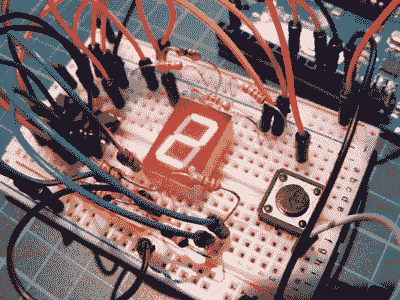

1.  将 74HC595 移位寄存器插入面包板时，IC 的半圆标记应在左侧。左下角的引脚应该是引脚 1。您的 IC 需要跨越中间的断开区域，如 图 16-3 所示。

    **图 16-3：**

    74HC595 移位寄存器应跨越面包板的中心断开区域。

    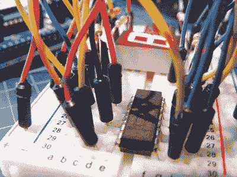

1.  小心连接七段 LED 显示器和 74HC595 移位寄存器之间的连接，如下表所示。

    | **七段数码管显示** | **移位寄存器** | **Arduino** |
    | --- | --- | --- |
    | 引脚 1 (E)* | 引脚 4 |  |
    | 引脚 2 (D)* | 引脚 3 |  |
    | 引脚 3 |  | GND |
    | 引脚 4 (C)* | 引脚 2 |  |
    | 引脚 5 (DP)* | 引脚 7 |  |
    | 引脚 6 (B)* | 引脚 1 |  |
    | 引脚 7 (A)* | 引脚 15 |  |
    | 引脚 8 |  | 不使用 |
    | 引脚 9 (F)* | 引脚 5 |  |
    | 引脚 10 (G)* | 引脚 6 |  |

    * 这些引脚需要一个 220 欧姆的电阻，在七段 LED 显示器和 74HC595 移位寄存器之间连接。

1.  现在，将剩余的移位寄存器引脚按下表所示连接到 Arduino。

    | **移位寄存器** | **Arduino** |
    | --- | --- |
    | 引脚 9 | 不使用 |
    | 引脚 10 | +5V |
    | 引脚 11 | 引脚 12 |
    | 引脚 12 | 引脚 8 |
    | 引脚 13 | GND |
    | 引脚 14 | 引脚 11 |
    | 引脚 16 | +5V |
    | 脉冲 | 引脚 2 |

1.  将按钮插入面包板，使引脚跨越中间断点，如图 16-4 所示。一侧连接到 Arduino 的引脚 2，另一侧连接到 GND。

    **图 16-4：**

    按钮也应跨越面包板的中心断点。

    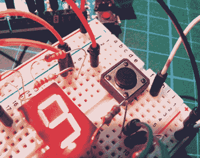

1.  确认你的设置与图 16-5 中的电路图一致，并上传代码“草图”到第 140 页。

    **图 16-5：**

    电子骰子的电路图

    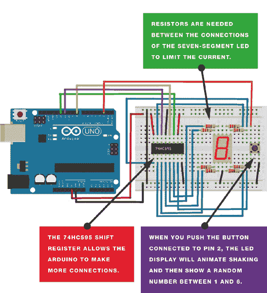

### 草图

草图首先设置引脚以控制驱动七段 LED 的 74HC595 芯片。当七段 LED 显示器通电时，点亮一个小点。当按下按钮时，LED 会以短暂的旋转动画点亮，表示骰子正在摇动。片刻后，1 到 6 之间的随机数将显示出来。再次按下按钮即可生成下一次骰子的结果。

```
// Code by Warrick A. Smith and reproduced with kind permission
// http://startingelectronics.com

const int latchPin = 8;   // Pins connected to shift register
const int clockPin = 12;
const int dataPin = 11;
const int buttonPin = 2;  // Pin connected to switch wire
// 1 to 6 and DP (decimal point) on 7-segment display
unsigned char lookup_7seg[] = {0x06, 0x5B, 0x4F, 0x66, 0x6D, 0x7D, 0x80};
// Shaking die pattern on 7-segment display
unsigned char shake_dice[] = {0x63, 0x5C};
// Rolling die on 7-segment display
unsigned char roll_dice[] = {0x1C, 0x58, 0x54, 0x4C};
// Vary duration of time before die number is received
int rand_seed;
int rand_num = 0;                // Generate random number
unsigned char shake_toggle = 0;  // For shaking dice animation
int index = 0;                   // For rolling dice animation
int shake_speed;                 // Accelerates dice shake speed

void setup() {
  pinMode(latchPin, OUTPUT);     // Output pins for controlling the
                                 // shift register
  pinMode(clockPin, OUTPUT);
  pinMode(dataPin, OUTPUT);
  pinMode(buttonPin, INPUT);     // Read switch wire state
  digitalWrite(latchPin, LOW);   // Display DP on 7-segment display
                                 // at startup
  shiftOut(dataPin, clockPin, MSBFIRST, lookup_7seg[6]);
  digitalWrite(latchPin, HIGH);
  randomSeed(analogRead(0));     // Generate random seed
}

void loop() {
  if (digitalRead(buttonPin)) {
    shake_speed = 150; // Reset die shaking speed
    delay(30);
    // Generate number for random speed and show shaking animation
    while (digitalRead(buttonPin)) {
      rand_seed++;      // Generate random number
      // Animate shaking die
      if (shake_toggle) {
        AnimateDice(0, shake_dice);
        shake_toggle = 0;
      }
      else {
        AnimateDice(1, shake_dice);
        shake_toggle = 1;
      }
      delay(80 + shake_speed);  // Accelerate animation speed
      if (shake_speed > 0) {
        shake_speed -= 10;
      }
    }
    // Animate rolling die
    for (int rolls = 0; rolls < (rand_seed % 10 + 14); rolls++) {
      AnimateDice(index, roll_dice);
      delay((1 + rolls) * 20);
      index++;
      if (index > 3) {
        index = 0;
      }
    }
    rand_num = random(0, 6);  // Generate number thrown on die
    DiceNumber(rand_num);
  }
}

// Display the die number on 7-segment display
void DiceNumber(unsigned char num) {
  digitalWrite(latchPin, LOW);
  shiftOut(dataPin, clockPin, MSBFIRST, lookup_7seg[num]);
  digitalWrite(latchPin, HIGH);
}

// Display one frame of the shaking or rolling dice
void AnimateDice(int seg, unsigned char *table) {
  digitalWrite(latchPin, LOW);
  shiftOut(dataPin, clockPin, MSBFIRST, table[seg]);
  digitalWrite(latchPin, HIGH);
}
```

## 项目 17：火箭发射器

**在这个项目中，我们将创建一个可编程倒计时计时器，当倒计时达到 0 时，点燃引线发射火箭。**

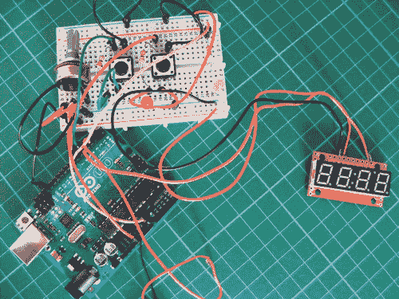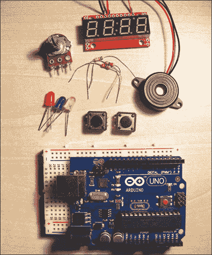

**所需材料**

• Arduino 板

• 面包板

• 跳线

• 四位数七段串行显示器

• 蜂鸣器

• 2 个短按式触觉四脚按钮

• 50k 欧姆电位器

• 3 个 LED（红色、绿色、黄色）

• 3 个 220 欧姆电阻

**所需库**

• SoftwareSerial

我们将使用一个四位数的七段串行显示器，它内置集成电路用于控制 LED，只需要三根线即可连接到 Arduino。在选择显示器时，请确保它具有 RX 输入，这样你只需要一根线就能控制它。

### 工作原理

你可以使用像这样的定时器来触发任何需要电力的设备，比如伺服电机、LED 或报警器。你将使用电位计来选择倒计时的持续时间（从 5 秒到 60 秒不等）。LED 屏幕将显示数字，让你可以看到倒计时设置的时间。我们将包括两个按钮：Arm 按钮和 Launch 按钮。一旦你选择了倒计时的时间，按下 Arm 按钮来准备定时器。红色 LED 灯显示定时器已准备好。（Arm 按钮是一个安全功能，防止你不小心启动发射器。）当火箭准备好后，按下 Launch 按钮开始倒计时。绿色 LED 灯表示它已准备好，倒计时开始。

当定时器倒计时时，蜂鸣器每秒发出一声。倒计时到五秒时，蜂鸣器的鸣叫逐渐加速，直到发射。当定时器到达 0 时，电源通过引脚 7 传输到你连接的任何输出设备——在这个例子中，它点亮了黄色 LED。你可以将这个定时器连接到蜂鸣器、伺服电机来解锁门，甚至是连接到火箭引信。稍后我将向你展示如何制作一个简单的引信点燃器。

### 构建过程

1.  将七段串行显示器的 RX 引脚连接到 Arduino 引脚 3，将 VCC 连接到 +5V，并通过面包板将 GND 连接到 Arduino 的 GND，如图 17-1 所示。你可能需要剥掉一些电线以便连接。

    | **七段串行显示器** | **ARDUINO** |
    | --- | --- |
    | RX | 引脚 3 |
    | VCC | +5V |
    | GND | GND |

    **图 17-1：**

    将七段显示器连接到 Arduino

    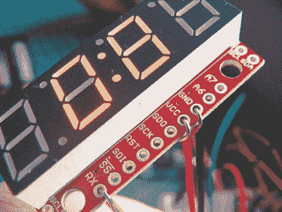

1.  将电位计插入面包板，将左侧针脚连接到 +5V，中间针脚连接到 Arduino 引脚 A0，右侧针脚连接到 GND，如图 17-2 所示。

    | **电位计** | **ARDUINO** |
    | --- | --- |
    | 左侧针脚 | +5V |
    | 中间针脚 | A0 |
    | 右针脚 | GND |

    **图 17-2：**

    将电位计放入面包板

    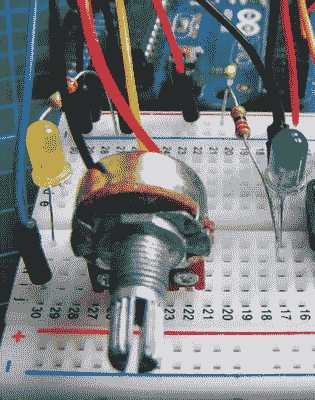

1.  将蜂鸣器的红线连接到 Arduino 引脚 4，将黑线连接到 GND，如图 17-3 所示。

    | **蜂鸣器** | **ARDUINO** |
    | --- | --- |
    | 红线 | 引脚 4 |
    | 黑线 | GND |

    **图 17-3：**

    连接蜂鸣器

    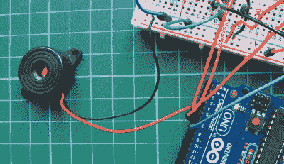

1.  将两个按钮插入面包板，其中 A 和 B 引脚在中心断开的同一侧，C 和 D 引脚在另一侧，按照图 17-4 中的配置。

    **图 17-4：**

    按钮的针脚连接

    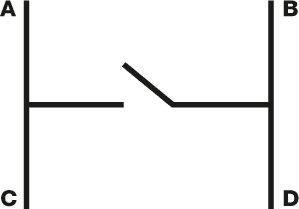

1.  接下来，我们将连接按钮，如图 17-5 所示。要创建 Arm 按钮，将第一个按钮的 C 引脚连接到 GND，D 引脚连接到 Arduino 引脚 5。要创建 Launch 按钮，将另一个按钮的 C 引脚连接到 GND，D 引脚连接到 Arduino 引脚 6。

    | **按钮** | **ARDUINO** |
    | --- | --- |
    | 臂针 C | GND |
    | 臂针 D | 引脚 5 |
    | 发射针 C | GND |
    | 发射针 D | 引脚 6 |

    **图 17-5：**

    连接按钮和 LED

    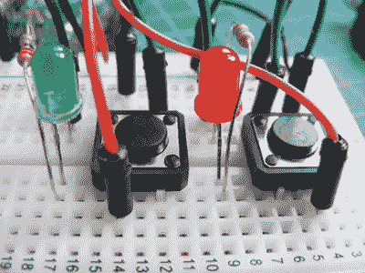

1.  将红色 LED 插入面包板，较短的负极脚连接到臂按钮的 B 引脚。将另一只脚连接到 220 欧姆电阻，电阻的另一端连接到+5V。然后将绿色 LED 插入面包板，负极脚连接到发射按钮的 B 引脚，正极脚通过 220 欧姆电阻连接到+5V。

    | **电阻器** | **Arduino** |
    | --- | --- |
    | 负极脚 | GND |
    | 正极脚 | 通过 220 欧姆电阻连接到+5V |

1.  连接点火器。我们暂时使用黄色 LED 作为点火指示器。将其插入面包板，负极脚连接到 GND，正极脚通过 220 欧姆电阻连接到 Arduino 的第 7 号引脚。（参见“制作工作保险丝”第 149 页，了解如何制作自己的点火器。）

    | **点火器** | **Arduino** |
    | --- | --- |
    | 负极脚 | GND |
    | 正极脚 | 通过 220 欧姆电阻连接到引脚 7 |

    当倒计时到达 0 时，引脚 7 被设置为`HIGH`，触发点火器。我们没有真正点燃保险丝，而是点亮黄色 LED 来表示点火。

1.  确认您的设置与图 17-6 中的电路图匹配，并上传“草图”中的代码（见第 151 页）。

    **图 17-6：**

    火箭发射器的电路图

    

### 制作工作保险丝

如果不使用 LED 来指示点火，您可以使用简单的圣诞树灯制作一个工作保险丝。制作保险丝时，请确保佩戴护眼设备。这些说明仅供娱乐用途，应仅由成年人执行。

**警告**

*在您的国家或州，可能会对发射爱好火箭或烟花有限制，因此请事先检查。确保项目使用符合法律规定是您的责任。*

1.  使用爱好钻头，在圣诞灯的玻璃外壳顶部施加轻微压力，将其切割掉（见图 17-7）。

    **图 17-7：**

    用爱好钻头切割尖端

    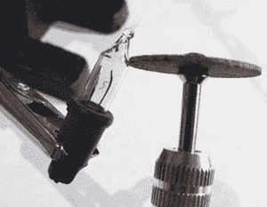

1.  在玻璃外壳的尖端附近切割，顶部应能轻松弹开（见图 17-8）。

    **图 17-8：**

    弹出尖端

    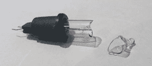

1.  现在切下木质火柴的火头（确保不要点燃它！），然后小心地将火柴头插入开口的灯泡内，注意不要损坏灯丝（见图 17-9）。

    **图 17-9：**

    将火柴头插入灯泡的下半部分

    

1.  最后，将灯泡的电线连接到点火电线。当电源送入灯泡时，灯丝会加热并点燃火柴头（见图 17-10），产生足够的能量点燃保险丝。

    **图 17-10：**

    点燃引信后

    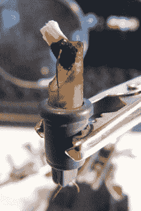

### 程序代码

程序首先定义了每个组件及其与 Arduino 的连接。SoftwareSerial 库控制四位七段串行 LED 显示器，而来自电位器的模拟输入则将显示的时间从 5 秒到 60 秒进行调整。按下 Arm 按钮时，它充当数字开关和安全功能，允许按下 Launch 按钮。如果在倒计时期间按下 Arm 按钮，倒计时会中止，显示器会重置。

程序中的`tone`命令按倒计时的节奏脉冲驱动压电蜂鸣器发出“哔”声。当倒计时到达 0 时，引信针脚（在此情况下连接到 LED）被设置为`HIGH`，并点亮 LED。

```
// Ardunaut Arduining.com, reproduced with kind permission

#define FuseTIME      1500   // Duration of fuse current in ms
#include <SoftwareSerial.h>  // Call the SoftwareSerial library

#define Fuse     7     // Pin connected to fuse (your LED or igniter)
#define GoButt   6     // Pin connected to Launch button
#define ArmButt  5     // Pin connected to Arm button
#define BuzzPin  4     // Pin connected to piezo buzzer
#define TXdata   3     // Pin connected to RX of display
#define RXdata   2     // Not used
#define SetPot   0     // Analog pin connected to potentiometer

SoftwareSerial mySerialPort(RXdata, TXdata);

void setup() {
  pinMode(TXdata, OUTPUT);
  pinMode(RXdata, INPUT);
  pinMode(Fuse, OUTPUT);
  pinMode(ArmButt, INPUT);       // Set Arm button pin to input
  pinMode(GoButt, INPUT);        // Set Launch button pin to input
  digitalWrite(Fuse, LOW);       // Open igniter circuit
  digitalWrite(ArmButt, HIGH);   // Turn on resistor
  digitalWrite(GoButt, HIGH);    // Turn on resistor
  mySerialPort.begin(9600);
  delay(10);                     // Wait for serial display startup
  mySerialPort.print("v");       // Reset the serial display
  mySerialPort.print("z");       // Brightness
  mySerialPort.write(0x40);      // 3/4 intensity
  mySerialPort.print("w");       // Decimal point control
  mySerialPort.write(0x10);      // Turn on colon in serial display
}

int DownCntr;   // Countdown (1/10 seconds)
int Go = 0;     // Stopped

void loop() {
  if (!digitalRead(GoButt) || !digitalRead(ArmButt)) {
    Go = 0;   // Abort the countdown
    tone(BuzzPin, 440, 1500);
    delay(1500);
  }

  if (Go == 0) {
    WaitARM();
    WaitGO();
  }
  ShowTimer();
  if (DownCntr > 50) {
    if (DownCntr % 10 == 0)tone(BuzzPin, 1000, 50); // One beep/sec
  }
  else if (DownCntr % 2 == 0)tone(BuzzPin, 1000, 50); // Beep faster

  if (DownCntr == 0) {
    tone(BuzzPin, 440, FuseTIME);  // Launch tone
    digitalWrite(Fuse, HIGH);      // Close the fuse circuit
    delay(FuseTIME);
    digitalWrite(Fuse, LOW);       // Open the fuse circuit
    Go = 0;
  }
  while (millis() % 100);          // Wait 50 ms
  delay(50);
  DownCntr--;
}

void WaitGO() {
  ShowTimer();
  while (digitalRead(GoButt));
  Go = 1;
  delay(20);
  while (!digitalRead(GoButt)); // Debounce Launch button
}

void ReadTimer() {
  DownCntr = map(analogRead(SetPot), 0, 1023, 5, 60);
  DownCntr *= 10;
}

void ShowTimer() {
  String seconds = String (DownCntr, DEC);
  while (seconds.length() < 3)seconds = "0" + seconds; // Format to
                                                       // 3 numbers
  mySerialPort.print(seconds); // Write to serial display
  mySerialPort.print(" ");     // Last digit off
}

void WaitARM() {
  while (digitalRead(ArmButt) == 1) {
    ReadTimer();
    delay(50);
    ReadTimer();
    ShowTimer();
    delay(150);
  }

  Go = 0;
  ShowTimer();
  tone(BuzzPin, 2000, 150);
  delay(200);
  tone(BuzzPin, 2000, 150);
  delay(200);
  tone(BuzzPin, 2000, 150);

  delay(20);
  while (!digitalRead(ArmButt)); // Debounce Arm button
}
```
