# 第六部分


**安全性**

## 项目 18：入侵者传感器

**在这个项目中，我们将使用超声波传感器来检测入侵者。**

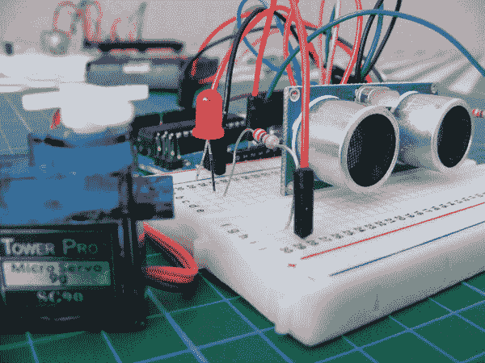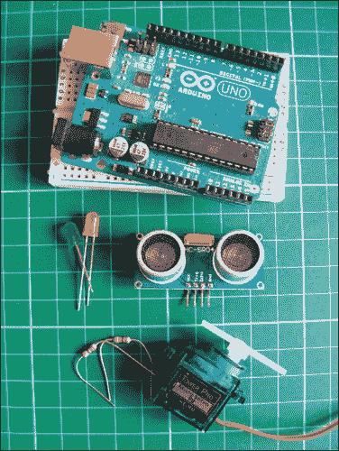

**所需部件**

• Arduino 开发板

• 面包板

• 跳线

• 四引脚 HC-SR04 超声波传感器

• 伺服电机

• 红色 LED

• 绿色 LED

• 2 个 220 欧姆电阻

我们将入侵者传感器与伺服电机和一些 LED 灯连接，这样当有人接近一定距离时，绿色 LED 会熄灭，红色 LED 会亮起，伺服电机也会移动（见图 18-1）。

**图 18-1：**

这些 LED 灯会提醒你有入侵者。


### 工作原理

这个项目非常灵活，可以以多种方式使用和改造。由于超声波传感器能够测量距离，你可以用它来定义一个区域，并在越过这个范围时触发警报。例如，它的工作原理类似于雷达：它发出一个超声波信号，或称为*ping*。当这个信号遇到物体时，会像回声一样反弹回来，ping 和回声之间的时间可以用来计算距离。Arduino 可以根据这个计算触发某些事件。

在这个项目中，当传感器检测到有入侵者接近预设范围时，红色 LED 会亮起，伺服电机臂将开始移动。你可以根据需要修改这个项目，使其在检测到入侵者时触发不同的事件，比如按下安全系统按钮或锁门。为了实现更友好的场景，你可以将距离设得非常近，这样当你在传感器前挥动手时，伺服电机会按下按钮释放糖果等奖励。

**注意**

*要使用这些图中展示的相同超声波传感器，请参见“零售商列表”中的第 240 页，或在线搜索* HC-SR04 超声波模块。

### 构建

1.  将超声波传感器插入面包板中。我们在这个项目中使用的传感器有四个引脚，如图 18-2 所示。将传感器的 GND 连接到 Arduino 的 GND 轨道，VCC 连接到 Arduino 的+5V 轨道，Trig 连接到 Arduino 的 12 号引脚，Echo 连接到 Arduino 的 13 号引脚。

    | **超声波传感器** | **Arduino** |
    | --- | --- |
    | GND | GND |
    | VCC | +5V |
    | Trig | 12 号引脚 |
    | Echo | 13 号引脚 |

    **图 18-2：**

    HC-SR04 超声波传感器

    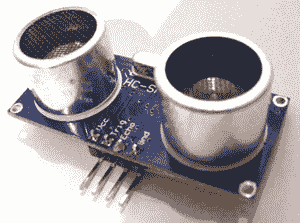

1.  将伺服电机的棕色（接地）线连接到 Arduino 的 GND 轨道，红色（电源）线连接到 Arduino 的+5V 轨道，黄色信号（控制）线连接到 Arduino 的 9 号引脚。

    | **伺服电机** | **Arduino** |
    | --- | --- |
    | 红色线 | +5V |
    | 棕色线 | GND |
    | 黄色线 | 9 号引脚 |

1.  将红色和绿色 LED 插入面包板，短的负极引脚接入 Arduino 的 GND 轨道。为每个正极引脚加上 220 欧姆的电阻，并将红色 LED 连接到 Arduino 的 2 号引脚，绿色 LED 连接到 3 号引脚，通过电阻连接。

    | **LED 灯** | **Arduino** |
    | --- | --- |
    | 负极引脚 | GND |
    | 正极（红色） | 通过 220 欧姆电阻连接到引脚 2 |
    | 正极（绿色） | 通过 220 欧姆电阻连接到引脚 3 |

1.  将面包板上的电源轨连接到 Arduino 的 +5V 和 GND。最终配置如 图 18-3 所示。

    **图 18-3：**

    完整的入侵传感器项目

    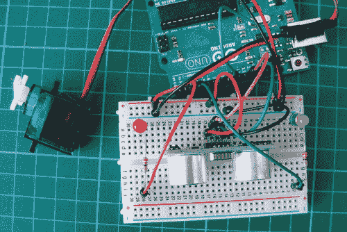

1.  检查你的设置是否与 图 18-4 一致，然后上传 “草图” 中的代码，代码位于 第 161 页。

    **图 18-4：**

    入侵传感器的电路图

    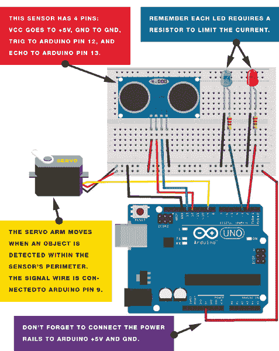

### 草图

当物体进入触发距离时，红色 LED 会亮起，伺服电机会转动 45 度。你可以在草图的以下行中改变传感器的探测距离：

```
if (distance <= 15)
```

在这个示例中，如果在 15 厘米内探测到物体，下一段代码将被执行。

传感器上的 Trig 引脚连接到 Arduino 引脚 12，发出超声波信号或 Ping。当信号到达物体时，会反弹回模块，这个回波会发送到 Arduino 引脚 13。两个信号之间的时间差给我们提供了距离读数。如果距离超过我们设定的最小值，绿色 LED 会保持亮起；如果不超过，红色 LED 会亮起，伺服电机会移动。

```
/* NewPing Library created by Tim Eckel teckel@leethost.com.
   Copyright 2012 License: GNU GPL v3
   http://www.gnu.org/licenses/gpl-3.0.html
*/

#include <NewPing.h> // Call NewPing library
#include <Servo.h>   // Call Servo library
#define trigPin 12   // Trig pin connected to Arduino 12
#define echoPin 13   // Echo pin connected to Arduino 13
#define MAX_DISTANCE 500
NewPing sonar(trigPin, echoPin, MAX_DISTANCE); // Library setting
int greenLed = 3, redLed = 2; // Set green LED to pin 3, red to pin 2
int pos = 20;
Servo myservo;

void setup() {
  Serial.begin (115200);
  pinMode(trigPin, OUTPUT);
  pinMode(echoPin, INPUT);
  pinMode(greenLed, OUTPUT);
  pinMode(redLed, OUTPUT);
  myservo.attach(9); // Servo attached to pin 9
}

void loop() {
  int duration, distance, pos = 0, i;
  digitalWrite(trigPin, LOW);
  delayMicroseconds(2);
  digitalWrite(trigPin, HIGH); // Trig pin sends a ping
  delayMicroseconds(10);
  digitalWrite(trigPin, LOW);
  duration = pulseIn(echoPin, HIGH); // Echo receives the ping
  distance = (duration / 2) / 29.1;
  Serial.print(distance);
  Serial.println(" cm");
  // If sensor detects object within 15 cm
  if (distance <= 15) {
    digitalWrite(greenLed, LOW); // Turn off green LED
    digitalWrite(redLed, HIGH);  // Turn on red LED
    myservo.write(180);          // Move servo arm 180 degrees
    delay(450);
    digitalWrite(redLed, LOW);   // Light the red LED
    myservo.write(90);
    delay(450);
    digitalWrite(redLed, HIGH);
    myservo.write(0);
    delay(450);
    digitalWrite(redLed, LOW);
    myservo.write(90);
  }
  // Otherwise
  else {
    digitalWrite(redLed, LOW);    // Turn off red LED
    digitalWrite(greenLed, HIGH); // Turn on green LED
    myservo.write(90);
  }
  delay(450);
}
```

## 项目 19：激光触发报警器

**在这个项目中，你将制作一个简单的激光触发报警器。**

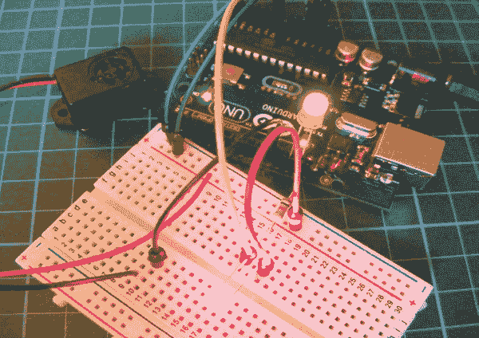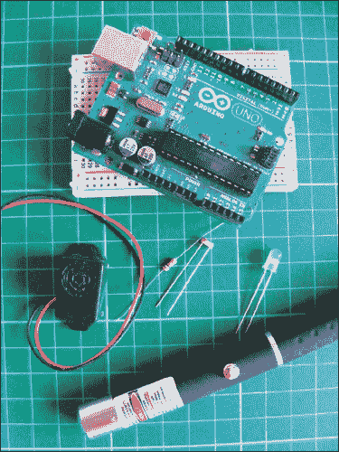

**所需组件**

• Arduino 主板

• 面包板

• 跳线

• 光敏电阻

• 压电蜂鸣器

• 绿色 LED

• 10k 欧姆电阻

• 激光笔

你可能见过这样的电影场景：一个珍贵的物品被激光束网格保护着。这些激光束看起来很酷，似乎很高科技，但它们背后的原理其实非常简单。

### 工作原理

当激光笔照射到光敏电阻上时，绿色 LED 会亮起，表示电路准备就绪。当激光束被打破时，LED 熄灭，蜂鸣器发出声音。

正如我们在 项目 13 和 18 中所知，光敏电阻根据照射到其传感器上的光线强度产生可变电阻。当光敏电阻没有检测到激光光线时，它会降低电阻并触发 Arduino 向控制蜂鸣器的引脚发送电压。

在白天或甚至在黑暗中可见的激光束非常强大，可能非常危险。在这个项目中，我们将使用一支低功率的激光笔代替（见 图 19-1）。

**图 19-1：**

激光笔仍然可能是危险的，绝对不应该将其对准任何人的眼睛！


### 构建过程

1.  将光敏电阻插入面包板。将一端连接到 +5V 电源轨，另一端连接到 10k 欧姆电阻，电阻的另一端连接到 Arduino 的 A0 和 GND 引脚。

    | **光敏电阻** | **Arduino** |
    | --- | --- |
    | 引脚 1 | +5V |
    | 引脚 2 | A0 通过 10kΩ 电阻和 GND |

1.  将蜂鸣器的红色（正极）线直接连接到 Arduino 的 11 引脚，黑色（GND）线连接到面包板的 GND。

    | **蜂鸣器** | **Arduino** |
    | --- | --- |
    | 黑线 | GND |
    | 红线 | 引脚 11 |

1.  将绿 LED 的长腿插入 Arduino 的 13 引脚，短腿插入 GND。

1.  将电源轨连接到面包板。

1.  在上传代码之前，你需要检查光敏电阻在环境光下的值。按照说明设置光敏电阻后，运行以下小程序。

    ```
    void setup() {
      pinMode(4, OUTPUT);
      Serial.begin(9600);
    }

    void loop() {
      digitalWrite(4, HIGH);
      Serial.println(analogRead(0));
    }
    ```

1.  打开 Arduino IDE 中的串行监视器。它将显示从光敏电阻读取的值——在图 19-2 中，它为 964——在正常光照条件下。记录下这个数字，它会根据你的光照条件有所不同。

    **图 19-2：**

    从光敏电阻读取数值

    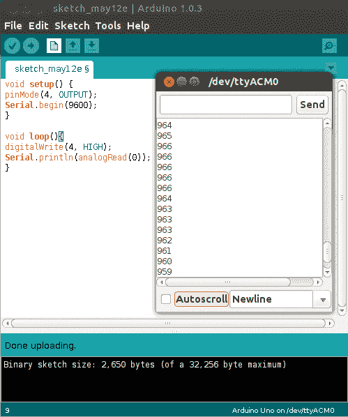

    现在将激光照射到电阻的光敏元件上，并记录下这个数值；我的读数是 620。这可能看起来有些反直觉，因为你会预期更多的光照会提供更高的数值，但这个数值实际上是在转换电阻——更多的光，电阻更小。你的数值可能与这里展示的不同，所以务必记录下你得到的两个读数。

1.  检查你的设置是否与图 19-3 相匹配，然后上传第 168 页中“草图”中的代码。

    **图 19-3：**

    激光触发报警器的电路图

    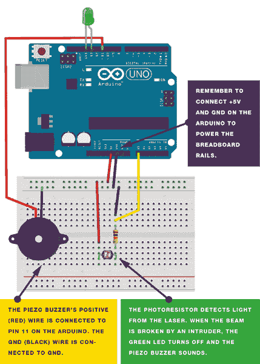

### 草图

草图首先将 Arduino 引脚 11 设置为蜂鸣器的 `输出`，将引脚 13 设置为 LED 的 `输出`。光敏电阻连接到 Arduino 的 A0 引脚。如果 A0 的模拟读取值超过 850（意味着光线较少且激光束被打破），蜂鸣器将被设置为 `高`，并开启，LED 将关闭。记得根据你的校准调整此行中的电阻值：

```
if (analogRead(0) > 850) {
```

如前所述，当激光照射到电阻时，读数约为 620，因此在代码中，我设置蜂鸣器只有在数值超过 850 时才会发出声音。这个数值介于激光值和非激光值之间，因此当数值达到 850 时，我们就知道激光束已经被打破。

```
int buzzPin = 11; // Pin connected to the piezo
int LED = 13;     // Pin connected to the LED

void setup() {
  pinMode(buzzPin, OUTPUT); // Set pin as output
  pinMode(LED, OUTPUT);     // Set pin as output
}

void loop() {
  if (analogRead(0) > 850) { // Set this value depending on the
                             // values of your photoresistor
    digitalWrite(buzzPin, HIGH); // If value is above 850,
                                 // turn the piezo ON
    digitalWrite(LED, LOW);      // If value is above 850,
                                 // turn the LED OFF
    delay(1000); // Wait for 1 second
    digitalWrite(buzzPin, LOW);
    digitalWrite(LED, LOW);
  } else {
    digitalWrite(buzzPin, LOW); // If value is 850 or below
                                // (light shining on photoresistor),
                                // the piezo is off
    digitalWrite(LED, HIGH);    // If value is 850 or below
                                // (light shining on photoresistor),
                                // the LED is on
  }
}
```

## 项目 20：自动瞄准枪

**自动瞄准枪是一种无人武器，能够通过超声波检测自主感知并对敌方目标进行射击。在本项目中，我们将制作这种枪的微型版本。**

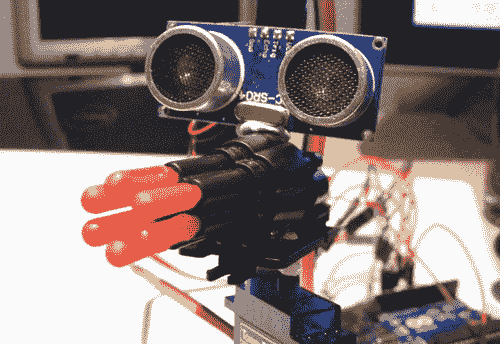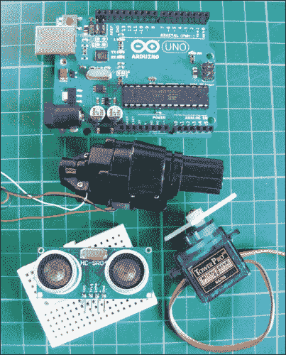

**所需组件**

• Arduino 板

• 小型面包板

• 跳线

• 公对公跳线

• 四针 HC-SR04 超声波传感器

• WLToys RC V959 导弹发射器

• Tower Pro SG90 9g 伺服电机

**所需库**

• 伺服电机

• NewPing

### 工作原理

我们将玩具导弹发射器和超声波传感器安装到舵机臂上（见图 20-1），这样舵机可以将枪和传感器在 180 度范围内来回扫动，使超声波传感器具有更广泛的探测范围。当检测到敌人时，Arduino 会触发警戒枪并发射导弹。有关超声波传感器的更多信息，请参见第 18 项项目。

**图 20-1：**

将玩具枪和超声波传感器安装到舵机臂上，使它们具有更广泛的探测和运动范围。

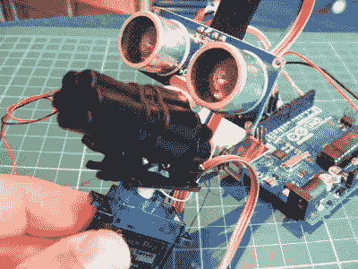

本项目的关键组件是 WLToys RC V959 导弹发射器，也被称为 Walkera 部件 RC V959-19 导弹发射器，设计用于遥控直升机（见图 20-2）。

**图 20-2：**

Walkera 部件 RC V959-19 导弹发射器

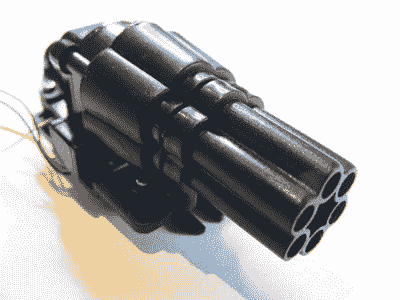

这个酷炫的部件非常便宜（大约 6 到 10 美元），并且在网上非常容易购买。这个发射器内部有一个小型舵机，通过旋转来发射导弹。控制这个舵机的电线是白色（GND）和黄色（+5V）。你还会看到黑色和红色电线，它们是用于单次发射的，但我们将只使用黄色和白色线，以实现持续的加特林枪效果。

### 构建过程

1.  首先我们准备好玩具导弹发射器。小心地将四根线从小塑料插座中拔出，它们应该会很容易地出来。你可以使用公对公跳线，按下塑料夹来帮助拔出。

1.  电线的核心是绞合的，非常脆弱，因此需要剥掉黄色和白色电线的末端，并将它们焊接到可以插入 Arduino 的独立实心线中，如图 20-3 所示。修剪黑色和红色电线，或者将它们用胶带固定在一旁。

    **图 20-3：**

    剥皮并焊接导弹发射器电线

    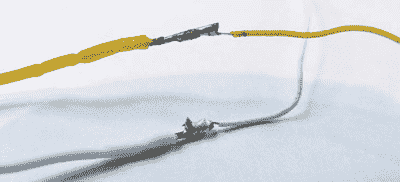

1.  将舵机电机的臂部粘贴到导弹发射器的底座上，如图 20-4 所示。

    **图 20-4：**

    粘贴舵机电机的臂部

    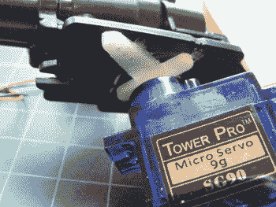

1.  将超声波传感器粘贴到发射器的顶部，如图 20-5 所示。你可以使用热熔胶枪来确保连接牢固，或者如果之后可能需要修改，可以暂时用胶带粘贴。

    **图 20-5：**

    安装超声波传感器

    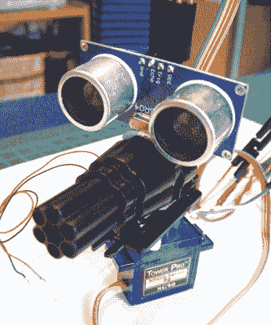

1.  使用跳线将超声波传感器连接到 Arduino：将 Trig 直接连接到 Arduino 引脚 13，将 Echo 直接连接到 Arduino 引脚 12。我们将使用迷你面包板来辅助多个电源连接到 Arduino +5V 和 GND。

    | **超声波传感器** | **Arduino** |
    | --- | --- |
    | VCC | +5V |
    | Trig | 引脚 13 |
    | Echo | 引脚 12 |
    | GND | GND |

1.  将舵机的棕色线连接到 Arduino GND，红色线通过迷你面包板连接到 +5V，黄色/白色线直接连接到 Arduino 引脚 9。

    | **舵机** | **Arduino** |
    | --- | --- |
    | 棕色线 | GND |
    | 红色线 | +5V |
    | 黄色线 | 引脚 9 |

1.  将发射器的白色电线连接到迷你面包板的 GND 轨道，黄色电线直接连接到 Arduino 的 3 号引脚。

    | **发射器** | **ARDUINO** |
    | --- | --- |
    | 白色电线 | GND |
    | 黄色电线 | 3 号引脚 |

1.  你的岗哨枪应当如图 20-6 所示。将导弹插入发射器。

    **图 20-6：**

    你的岗哨枪已经准备好发射了！

    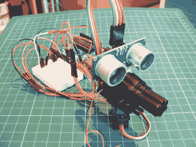

1.  确认你的完成设置与图 20-7 一致。在第 176 页上传"草图"中的代码。

    **图 20-7：**

    岗哨枪的电路图

    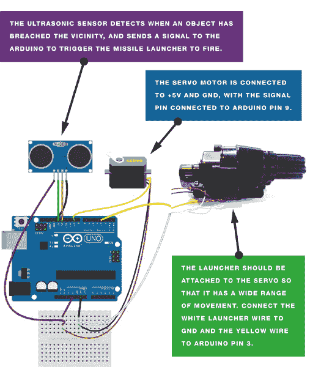

### 草图

草图首先调用了 NewPing 和 Servo 库，以访问控制伺服电机和超声波传感器所需的功能。（确保从*[`nostarch.com/arduinohandbook/`](http://nostarch.com/arduinohandbook/)*下载并将 NewPing 库保存在你的 Arduino 文件夹中。）伺服电机会先向一个方向旋转，再向另一个方向旋转，移动超声波传感器 180 度。传感器发出超声波信号或*ping*，当这个 ping 信号遇到物体时，它会反射回来，并给出一个时间值。Arduino 将这个时间值转换为传感器与物体之间的距离。当距离小于 15 厘米时，伺服电机会停止，并向发射器发送电力，向物体发射子弹。你可以在➊处更改这个触发距离（单位为厘米）。

```
   #include <NewPing.h> // Call NewPing library
   #include <Servo.h>   // Call Servo library
   #define trigPin 12   // Pin connected to ultrasonic sensor Trig
   #define echoPin 13   // Pin connected the ultrasonic sensor Echo
   #define MAX_DISTANCE 500

   NewPing sonar(trigPin, echoPin, MAX_DISTANCE);

   int blaster = 3; // Pin connected to the blaster

   int angle = 0; // Set servo position in degrees

   Servo servo;

   void setup() {
     Serial.begin (115200);
     pinMode(trigPin, OUTPUT);
     pinMode(echoPin, INPUT);
     pinMode(blaster, OUTPUT);
     servo.attach(9); // Pin connected to servo
   }

   void loop() {
     int duration, distance, pos = 0, i;
     digitalWrite(trigPin, LOW);
     delayMicroseconds(2);
     digitalWrite(trigPin, HIGH); // trigPin sends a ping
     delayMicroseconds(10);
     digitalWrite(trigPin, LOW);
     duration = pulseIn(echoPin, HIGH); // echoPin receives the ping
     distance = (duration / 2) / 29.1;
     Serial.print(distance);
     Serial.println(" cm");
➊   if (distance <= 15) { // If distance is fewer than 15 cm
       digitalWrite(blaster, HIGH); // Blaster will fire
       servo.write(90);
     }
     else {
       digitalWrite(blaster, LOW); // Otherwise, blaster won't activate
       for (angle = 0; angle < 180; angle++) { // Sweep the servo
         servo.write(angle);
         delay(15);
       }
       for (angle = 180; angle > 0; angle--) {
         servo.write(angle);
       }
       delay(450);
     }
   }
```

## 项目 21：运动传感器报警

**在本项目中，我们将使用一个被动红外（PIR）传感器来构建一个运动传感报警。**

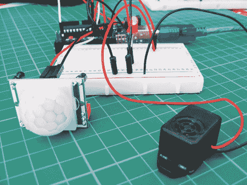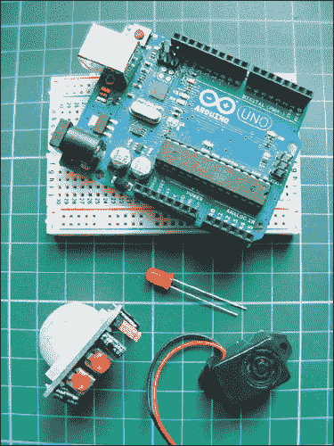

**所需零件**

• Arduino 板

• 面包板

• HC SR501 PIR 传感器

• LED

• 压电蜂鸣器

你可以使用这个报警器触发各种输出，例如灯光、电机，甚至当你靠近前门时播放“欢迎回家”的信息。

### 工作原理

本项目基于 HC SR501 PIR 传感器，它在网上可以以几美元的价格轻松购买。我们将设置它，当有人走过 PIR 传感器前时，LED 会亮起，压电蜂鸣器会发出声音（见图 21-1），但你也可以根据需要将其改编为其他输出方式。

**图 21-1：**

任何压电蜂鸣器都可以用于这个项目，但记得大多数蜂鸣器有极性，因此红色电线必须连接到+5V，黑色电线连接到 GND。

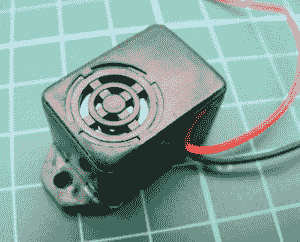

其他类似的 PIR 传感器也能与此代码一起使用，但重要的是要检查传感器的数据表中的引脚布局，因为这可能会有所不同。所有传感器应有+5V、GND 和输出引脚。在此型号上，引脚没有明确标记，但如果你简单地取下外层镜头（它是卡在位置上的，可以很容易地解开），你可以看到下面的引脚，如图 21-2 所示。

**图 21-2：**

移除镜头的 PIR 传感器

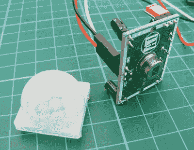

传感器上的两个橙色电位器表示有两个可调节的设置。当传感器直立时，如图 21-3 所示，左侧电位器控制当检测到物体时输出信号为 `HIGH` 的持续时间，设置范围是 5 到 200 秒。当我们将 LED 连接到输出时，LED 将根据设置的时间亮起 5 到 200 秒。右侧电位器调整检测范围，从 0 到 7 米。

**图 21-3：**

PIR 传感器的电位器。左侧控制输出为 `HIGH` 的持续时间（5-200 秒），右侧控制检测范围（0-7 米）。

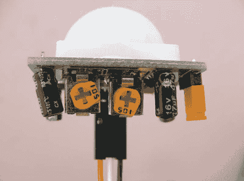

传感器通过检测红外辐射来工作，这些辐射来自产生热量的物体。传感器内部的晶体材料检测到红外辐射，当它检测到设定的阈值时，会触发传感器的输出信号。Arduino 读取此输出为电压，因此我们可以将其用作简单的开关来开启某个设备——在本项目中是一个 LED。

我们正在设置传感器，以便当传感器被触发时发出警报，但你可以通过其他方式自定义项目。例如，你可以通过连接一个舵机并设置它在朋友经过时释放一个橡皮筋来吓唬他们。

### 构建过程

1.  将 PIR 传感器的 +5V 和 GND 电线连接到面包板上的 +5V 和 GND 导轨，并将这些导轨连接到 Arduino。将 PIR 传感器的输出电线连接到 Arduino 引脚 2。（请参见图 21-4。）

    | **PIR 传感器** | **ARDUINO** |
    | --- | --- |
    | +5V | +5V |
    | GND | GND |
    | 输出 | 引脚 2 |

    **图 21-4：**

    PIR 传感器连接到电线

    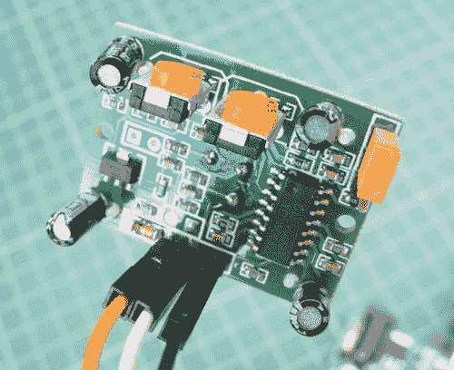

1.  将 LED 插入面包板，并将长的正极腿连接到 Arduino 引脚 13，短的负极腿连接到 GND。此项目中不需要为 LED 添加电阻。

    | **LED** | **ARDUINO** |
    | --- | --- |
    | 正极腿 | 引脚 13 |
    | 负极 | GND |

1.  通过将红色电线连接到 Arduino 引脚 10，黑色电线连接到 GND，连接蜂鸣器。

    | **蜂鸣器** | **ARDUINO** |
    | --- | --- |
    | 红色电线 | 引脚 10 |
    | 黑色电线 | GND |

1.  确保你的设置与图 21-5 中的电路图一致，然后上传 “草图” 中的代码，页面可以参考第 183 页。

    **图 21-5：**

    运动传感器报警的电路图

    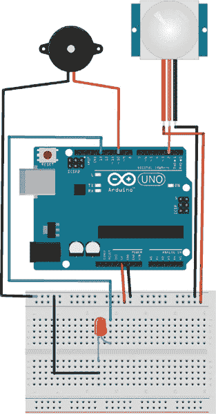

### 草图

草图通过将 Arduino 引脚 13 设置为 LED 输出、引脚 2 设置为 PIR 传感器输入、引脚 10 设置为蜂鸣器输出来工作。当 PIR 传感器被触发时，将发送一个 `HIGH` 信号到 Arduino，进而点亮 LED 并通过蜂鸣器发出声音。

```
int ledPin = 13;           // Pin connected to LED
int inputPin = 2;          // Pin connected to PIR sensor
int pirState = LOW;        // Start PIR state LOW with no motion
int val = 0;               // Variable for reading the pin status
int pinSpeaker = 10;       // Pin connected to piezo

void setup() {
  pinMode(ledPin, OUTPUT);  // Set LED as output
  pinMode(inputPin, INPUT); // Set sensor as input
  pinMode(pinSpeaker, OUTPUT);
  Serial.begin(9600);
}

void loop() {
  val = digitalRead(inputPin);   // Read PIR input value
  if (val == HIGH) {             // Check if input is HIGH
    digitalWrite(ledPin, HIGH);  // If it is, turn ON LED
    playTone(300, 160);
    delay(150);
    if (pirState == LOW) {
      // Print to the Serial Monitor if motion detected
      Serial.println("Motion detected!");

      pirState = HIGH;
    }
  } else {
      digitalWrite(ledPin, LOW); // If input is not HIGH,
                                 // turn OFF LED
      playTone(0, 0);
      delay(300);
      if (pirState == HIGH) {
      Serial.println("Motion ended!");
      pirState = LOW;
    }
  }
}

void playTone(long duration, int freq) { // Duration in ms,
                                         // frequency in Hz
    duration *= 1000;
    int period = (1.0 / freq) * 1000000;
    long elapsed_time = 0;
    while (elapsed_time < duration) {
      digitalWrite(pinSpeaker, HIGH);
      delayMicroseconds(period / 2);
      digitalWrite(pinSpeaker, LOW);
      delayMicroseconds(period / 2);
      elapsed_time += (period);
    }
}
```

## 项目 22：键盘输入系统

**现在是通过构建键盘输入系统将键盘引入你的 Arduino 的时候了。**

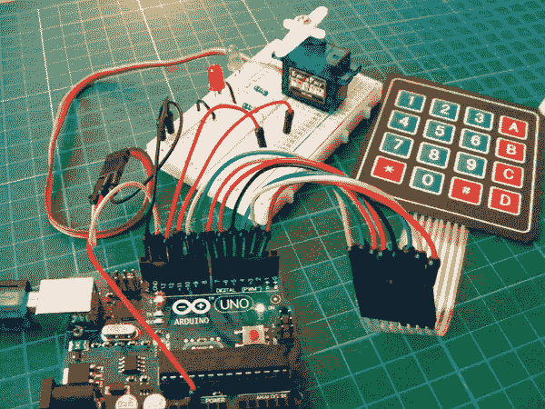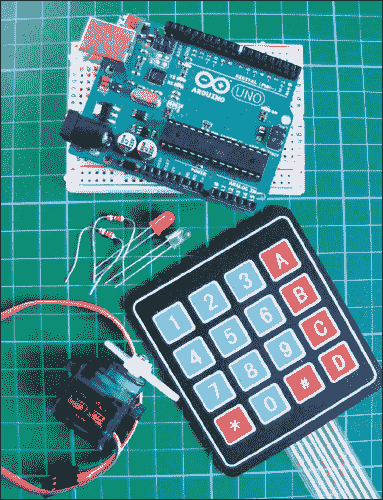

**所需零件**

• Arduino 板

• 面包板

• 跳线

• Tower Pro SG90 9g 伺服电机

• 绿色 LED

• 红色 LED

• 4×4 膜式键盘

• 2 个 220 欧姆电阻

**所需库**

• 键盘

• 伺服电机

• 密码

该项目使用一个 4×4 膜式键盘，底部有一条八根线的带状线，连接到一个伺服电机，用于转动解锁。

### 工作原理

键盘本质上是一系列按钮，根据按下的按钮输出数字或字符。将键盘面朝上时，线缆从左到右编号为 1–8。前四根线对应行，后四根线对应列。

您需要从 *[`nostarch.com/arduinohandbook/`](http://nostarch.com/arduinohandbook/)* 下载键盘库，并将其保存到您的 IDE 的 Arduino 库文件夹中。

我们将把这个键盘连接到伺服电机和一些 LED，创建一个像 项目 9 中的秘密敲击锁系统。使用此锁时，输入您的代码并按下星号（*）确认。如果代码与草图中定义的密码匹配，绿色 LED 将闪烁，伺服电机将移动 90 度。如果代码不正确，红色 LED 将闪烁。使用井号（#）键在输入代码之间重置。您可以将此伺服电机替换为更强大的伺服电机，用于解锁门上的较重死锁，或使用安装在外部的键盘和 LED 来解锁和锁定盒子内部。

### 测试键盘

首先，我们将使用以下代码测试键盘：

```
#include <Keypad.h>

const byte ROWS = 4;
const byte COLS = 4;
char keys[ROWS][COLS] = {
  {'1','2','3','A'},
  {'4','5','6','B'},
  {'7','8','9','C'},
  {'*','0','#','D'}
};
byte rowPins[ROWS] = {2,3,4,5};
byte colPins[COLS] = {6,7,8,9};

Keypad keypad = Keypad(makeKeymap(keys), rowPins, colPins,
                       ROWS, COLS);

void setup() {
  Serial.begin(9600);
}

void loop() {
  char key = keypad.getKey();
  if (key != NO_KEY){
    Serial.println(key);
  }
}
```

上传此代码，然后在您的 IDE 中打开串口监视器（图 22-1）。

**图 22-1：**

测试键盘

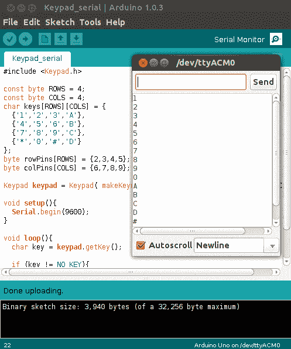

将键盘面朝上时，从左到右按顺序将线缆连接到 Arduino 数字引脚 9–2。当您上传完代码后，按几个键。每次按下键时，相应的字符应该出现在 Arduino IDE 的串口控制台中的单独一行上。

### 构建过程

1.  按照下图 图 22-2 中所示，直接将键盘引脚连接到 Arduino 引脚。

    | **键盘** | **ARDUINO** |
    | --- | --- |
    | 引脚 1 | 引脚 9 |
    | 引脚 2 | 引脚 8 |
    | 引脚 3 | 引脚 7 |
    | 引脚 4 | 引脚 6 |
    | 引脚 5 | 引脚 5 |
    | 引脚 6 | 引脚 4 |
    | 引脚 7 | 引脚 3 |
    | 引脚 8 | 引脚 2 |

    **图 22-2：**

    键盘引脚 1-8

    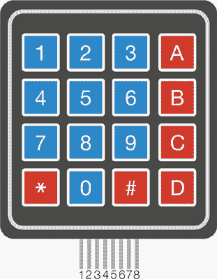

1.  将绿色 LED 和红色 LED 插入面包板，较短的负极腿连接到 Arduino GND 导轨。将 220 欧姆电阻连接到每个较长的正极腿。将连接到绿色 LED 的电阻连接到 Arduino 引脚 11，将连接到红色 LED 的电阻连接到 Arduino 引脚 12。

    | **LED 灯** | **ARDUINO** |
    | --- | --- |
    | 正极腿 | 通过 220 欧姆电阻连接到引脚 11 和 12 |
    | 负极腿 | GND |

1.  现在连接伺服电机（见 图 22-3）。将棕色线连接到 GND 排，红色线连接到 +5V 排，黄色/白色线直接连接到 Arduino 的 13 号引脚。

    | **伺服电机** | **Arduino** |
    | --- | --- |
    | 棕色线 | GND |
    | 红色线 | +5V |
    | 黄色线 | 引脚 13 |

    **图 22-3：**

    连接伺服电机

    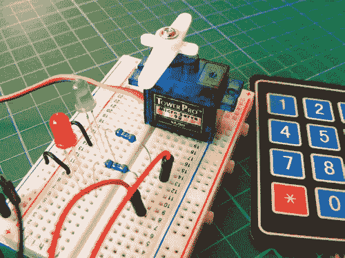

1.  确保你的设置与 图 22-4 中的设置一致，并上传 “草图” 中的代码，位于 第 192 页。

    **图 22-4：**

    键盘输入系统的电路图

    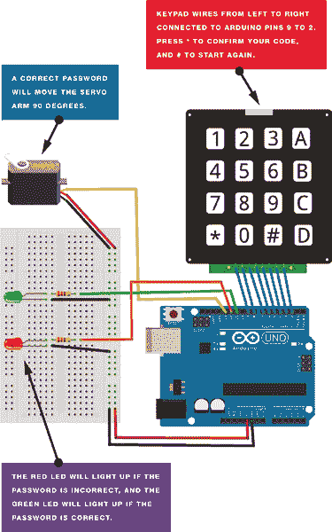

### 草图

首先，草图调用了 Keypad、Servo 和 Password 库。Servo 库已经包含在 IDE 中，但你需要下载 Keypad 和 Password 库（*[`nostarch.com/arduinohandbook/`](http://nostarch.com/arduinohandbook/)*）。然后，我们设置了八个引脚，用于从键盘获取输入，并将 Arduino 的引脚 11 和 12 设置为控制 LED，13 号引脚控制伺服电机。Arduino 等待你通过键盘输入代码，并在按下 * 确认输入后，草图会检查输入是否与代码中的密码匹配。如果输入不匹配密码，红色 LED 将被设置为 `HIGH` 并亮起；如果输入 *匹配* 密码，绿色 LED 将被设置为 `HIGH` 并亮起，伺服电机将开始转动。按下 # 将重置草图，准备接受另一个输入。

要更改密码，请修改以下行中的引号内的数字。

```
Password password = Password("2468");
```

草图中的默认密码是 2468。

```
/* Keypad Library for Arduino
   Authors: Mark Stanley, Alexander Brevig
   http://playground.arduino.cc/Main/KeypadTutorial
*/

#include <Password.h>
#include <Keypad.h>
#include <Servo.h>

Servo myservo;
Password password = Password("2468"); // Set password

const byte ROWS = 4; // Set four rows
const byte COLS = 4; // Set four columns

char keys[ROWS][COLS] = { // Define the keymap
  {'1','2','3','A'},
  {'4','5','6','B'},
  {'7','8','9','C'},
  {'*','0','#','D'}
};
byte rowPins[ROWS] = { 9,8,7,6 };  // Pins connected to keypad
                                   // ROW0, ROW1, ROW2 and ROW3
byte colPins[COLS] = { 5,4,3,2, }; // Pins connected to keypad
                                   // COL0, COL1 and COL2
// Create the keypad
Keypad keypad = Keypad(makeKeymap(keys), rowPins, colPins,
                       ROWS, COLS);
void setup() {
  Serial.begin(9600);
  delay(200);
  pinMode(11, OUTPUT); // Set green LED as output
  pinMode(12, OUTPUT); // Set red LED as output
  myservo.attach(13);  // Pin connected to servo
  keypad.addEventListener(keypadEvent); // Add an event listener to
                                        // detect keypresses
}

void loop() {
  keypad.getKey();
  myservo.write(0);
}

void keypadEvent(KeypadEvent eKey) {
  switch (keypad.getState()) {
    case PRESSED:
    Serial.print("Pressed: ");
    Serial.println(eKey);
    switch (eKey) {
      case '*': checkPassword(); break;
      case '#': password.reset(); break;
      default: password.append(eKey);
    }
  }
}

void checkPassword() {
  if (password.evaluate() ){
    Serial.println("Success"); // If the password is correct...
    myservo.write(90);         // Move servo arm 90 degrees
    digitalWrite(11, HIGH);    // Turn on green LED
    delay(500);                // Wait 5 seconds
    digitalWrite(11, LOW);     // Turn off green LED
  } else {
    Serial.println("Wrong");   // If the password is incorrect...
    myservo.write(0);
    digitalWrite(12, HIGH);    // Turn on red LED
    delay(500);                // Wait 5 seconds
    digitalWrite(12, LOW);     // Turn off red LED

  }
}
```

## 项目 23：无线 ID 卡门禁系统

**在这个项目中，我们将使用射频识别（RFID）读取器来构建一个无线 ID 卡门禁系统。**

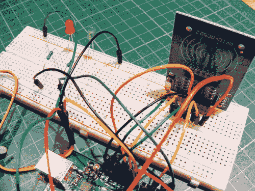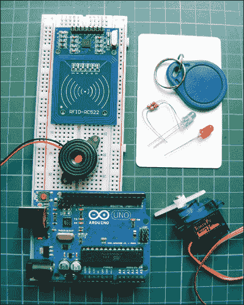

**所需组件**

• Arduino 主板

• 面包板

• 跳线

• Mifare RFID-RC522 模块

• Tower Pro SG90 9g 伺服电机

• 声音蜂鸣器

• 红色 LED

• 绿色 LED

• 2 个 220 欧姆电阻

**所需库**

• RFID

• SPI

• 电线

• 伺服电机

• 引脚

### 工作原理

RFID 读取器使用无线技术在没有接触的情况下识别卡片、标签或钥匙扣。当卡片靠近读取器时，读取器会响应。首先，我们需要读取器读取我们 RFID 卡的唯一编号，然后添加一个伺服电机，根据 RFID 读取器是否识别该卡来控制伺服电机的动作。我们可以将这个 ID 系统用于门锁或盒子锁之类的场景，就像在 项目 9 中的秘密敲门代码锁一样。

你可能在购买的物品上看到过类似图 23-1 的贴纸。这些贴纸使用 RFID 技术，让商店能够跟踪物品以防盗。如果你在未支付的情况下通过 RFID 区域，贴纸会触发警报。RFID 读卡器和卡片也常用于身份验证，允许进入受限制区域，如绝密实验室或封闭小区。

**图 23-1：**

一张 RFID 贴纸

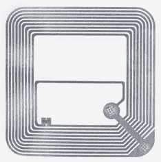

RFID 有两种类型：被动和主动。每个 RFID 系统使用无线频率在读卡器和标签或卡片之间交换信号。这个信号包含了标签或卡片的唯一代码，如果 RFID 读卡器识别到这个代码，它会做出相应的反应——例如，允许物品通过商店的探测器或解锁门锁。

在被动系统中，当两个设备靠得很近时，读卡器的无线信号为标签或卡片中的电路提供足够的电力，使它们能够交换数据。主动系统则有供电的读卡器和供电的标签，能够从更远的距离准确读取标签。主动系统价格昂贵，通常用于更复杂的应用，因此我们将使用被动 RFID 系统：Mifare RFID-RC522 读卡器，该读卡器附带一张空白卡和一个钥匙扣，如图 23-2 所示。该读卡器工作在 13.56 MHz 的频率下，这意味着它只能在距离卡片或钥匙扣几英寸以内时识别它们，因为这些设备都是由读卡器提供电力的。定位读卡器时，记住这一点非常重要。

**图 23-2：**

配有卡片和钥匙扣的 RFID 读卡器

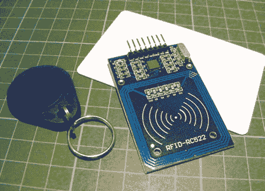

我们将创建一个 RFID 控制的舵机。当你将卡片放在 RFID 读卡器前时，它会读取卡片。如果模块识别到卡片并且卡片有访问权限，绿色 LED 灯会亮起，播放一段音调，舵机会旋转 180 度。如果模块未能识别卡片，红色 LED 灯会亮起，播放另一段音调，舵机不会转动。

表 23-1 描述了 RFID 读卡器的各种功能。

**表 23-1：**

RFID 读卡器引脚功能

| **RFID** | **详细信息** | **备注** |
| --- | --- | --- |
| 3.3V | 3.3 伏特 | 模块仅能使用此电压。 |
| RST | 重置 | 会将模块清除到初始状态。 |
| GND | 地 | 连接到 Arduino 的 GND 引脚。 |
| IRQ | 中断请求 | 在本项目中未使用。 |
| MISO | 主设备输入从设备输出 | 有时被称为“数据输入”。 |
| MOSI | 主设备输出从设备输入 | 有时被称为“数据输出”。 |
| SCK | 串行时钟 | 从主设备输出。这会产生一个脉冲，通常由主设备设置，用于同步数据。 |
| SDA/SS | 串行数据/从设备选择 | 模块将使用 SDA 或 SS，尽管它们是相同的。这是 Arduino 和模块之间共享数据并进行通信的方式。 |
| 引脚 16 | VCC | 正电源。 |

### 构建过程

1.  你可能需要先通过焊接插头引脚来设置模块。取下一个八个插头引脚的条形物。将每个插头引脚焊接到每个焊点上。确保焊接时保持焊枪只停留几秒钟，以免损坏电路。有关焊接的入门指南，请参阅“快速焊接指南”，该指南位于第 18 页。

1.  将你的 RFID 模块放入面包板中，如图 23-3 所示，然后将 RFID 引脚连接到下表所示的 Arduino 引脚。记得将 RFID 板连接到 Arduino 的 3.3V 电源（不是+5V），否则会损坏模块。

    **图 23-3：**

    将 RFID 模块放入面包板

    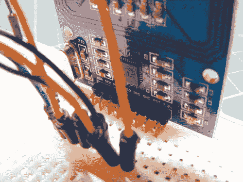

    | **RFID** | **ARDUINO** |
    | --- | --- |
    | 3.3V | 3.3V |
    | RST | 引脚 5 |
    | GND | GND |
    | IRQ | 未使用 |
    | MISO | 引脚 12 |
    | MOSI | 引脚 11 |
    | SCK | 引脚 13 |
    | SDA | 引脚 10 |

1.  现在我们需要检查 RFID 模块是否正常工作。从*[`www.nostarch.com/arduinohandbook/`](http://www.nostarch.com/arduinohandbook/)*下载 RFID 库，并将其保存到你的*libraries*目录（有关下载库的详细信息，请参见“库”，位于第 7 页）。上传以下 RFID 读卡器测试代码。确保将 PC 的 USB 线连接到 Arduino。

    ```
    // RFID Library Created by Miguel Balboa (circuitito.com)
    #include <SPI.h>
    #include <RFID.h>
    #define SS_PIN 10
    #define RST_PIN 9
    RFID rfid(SS_PIN, RST_PIN);

    // Setup variables
    int serNum0;
    int serNum1;
    int serNum2;
    int serNum3;
    int serNum4;

    void setup() {
      Serial.begin(9600);
      SPI.begin();
      rfid.init();
    }

    void loop() { // This loop looks for a card(s) to read
      if (rfid.isCard()) {
        if (rfid.readCardSerial()) {
          if (rfid.serNum[0] != serNum0
              && rfid.serNum[1] != serNum1
              && rfid.serNum[2] != serNum2
              && rfid.serNum[3] != serNum3
              && rfid.serNum[4] != serNum4
             ) {
            // When a card is found, the following code will run
            Serial.println(" ");
            Serial.println("Card found");
            serNum0 = rfid.serNum[0];
            serNum1 = rfid.serNum[1];
            serNum2 = rfid.serNum[2];
            serNum3 = rfid.serNum[3];
            serNum4 = rfid.serNum[4];

            // Print the card ID to the Serial Monitor of the IDE
            Serial.println("Cardnumber:");
            Serial.print("Dec: ");
            Serial.print(rfid.serNum[0], DEC);
            Serial.print(", ");
            Serial.print(rfid.serNum[1], DEC);
            Serial.print(", ");
            Serial.print(rfid.serNum[2], DEC);
            Serial.print(", ");
            Serial.print(rfid.serNum[3], DEC);
            Serial.print(", ");
            Serial.print(rfid.serNum[4], DEC);
            Serial.println(" ");
            Serial.print("Hex: ");
            Serial.print(rfid.serNum[0], HEX);
            Serial.print(", ");
            Serial.print(rfid.serNum[1], HEX);
            Serial.print(", ");
            Serial.print(rfid.serNum[2], HEX);
            Serial.print(", ");
            Serial.print(rfid.serNum[3], HEX);
            Serial.print(", ");
            Serial.print(rfid.serNum[4], HEX);
            Serial.println(" ");

          } else {
            // If the ID matches, write a dot to the Serial Monitor
            Serial.print(".");
          }
        }
      }
      rfid.halt();
    }
    ```

1.  打开你的 Arduino IDE 中的串口监视器。

1.  将你的卡片或钥匙扣放在 RFID 模块前面。唯一的编号应出现在串口监视器中，如图 23-4 所示。记下这个编号，因为你稍后会用到它。在这个例子中，我的卡号是 4D 55 AD D3 66。

    **图 23-4：**

    屏幕上以十六进制表示的 RFID 编号

    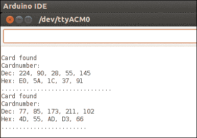

1.  将两个 LED 插入面包板，较短的负极线连接到 GND 轨道。将红色 LED 的较长正极线通过 220 欧姆电阻连接到 Arduino 引脚 3。将绿色 LED 的正极引脚通过另一个 220 欧姆电阻连接到引脚 2。

    | **LEDS** | **ARDUINO** |
    | --- | --- |
    | 负极引脚 | GND |
    | 正极（红色） | 引脚 3 通过 220 欧姆电阻 |
    | 正极引脚（绿色） | 引脚 2 通过 220 欧姆电阻 |

1.  通过将红线连接到+5V，棕色（或黑色）线连接到 GND，黄色线连接到 Arduino 引脚 9，来连接伺服电机到 Arduino。

    | **SERVO** | **ARDUINO** |
    | --- | --- |
    | 红线 | +5V |
    | 黑线 | GND |
    | 黄色电线 | 引脚 9 |

1.  通过将红线连接到 Arduino 的引脚 8，将黑线连接到 GND，来连接蜂鸣器到 Arduino。你的电路现在应该像图 23-5 那样。

    | **PIEZO** | **ARDUINO** |
    | --- | --- |
    | 红线 | 引脚 8 |
    | 黑线 | GND |

    **图 23-5：**

    完成的 RFID 项目

    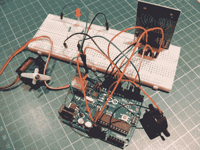

1.  打开 Arduino IDE 中的项目代码，并修改以下一行，使其与第 5 步中使用 RFID 读取器找到的卡片或钥匙扣的十六进制号码匹配。保持`0x`不变，但将其余部分填入你的号码。

    ```
    byte card[5] = {0x4D,0x55,0xAD,0xD3,0x66};
    ```

1.  确认你的设置与图 23-6 中的电路图匹配，然后将第 203 页中的“草图”代码上传到你的 Arduino。

    **图 23-6：**

    无线 ID 卡门禁系统的电路图

    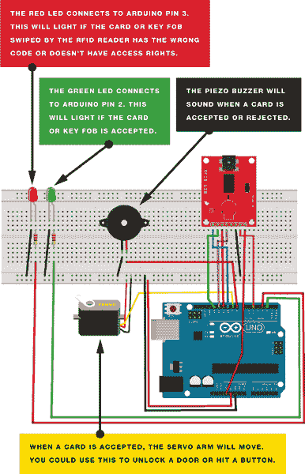

### 草图

草图首先调用 SPI、RFID、Servo、Pitches 和 Wire 库，以控制 Arduino、RFID 模块和舵机之间的通信。定义了两种旋律，一种是卡片读取正确时的旋律，另一种是读取错误时的旋律。绿色 LED 连接到 Arduino 的引脚 2，红色 LED 连接到引脚 3，压电蜂鸣器连接到引脚 8，舵机连接到引脚 9。

以下这一行是你添加卡片十六进制值的地方：

```
byte card[5] = {0x4D,0x55,0xAD,0xD3,0x66};
```

将卡片放在读卡器前。如果卡片上的十六进制代码与草图中的代码匹配，绿色 LED 灯会亮起，播放一段旋律，舵机会移动。读卡器会拒绝所有其他卡片，除非你将它们的号码添加到➊处的代码中。如果卡片被拒绝，红色 LED 灯亮起并播放另一段旋律，但舵机不会移动。

```
   #include <SPI.h>
   #include <RFID.h>
   #include <Servo.h>
   #include "pitches.h"
   #include <Wire.h>

   RFID rfid(10, 5); // Define the RFID

   // Replace this with the code from your card in hex form
➊ byte card[5] = {0x4D,0x55,0xAD,0xD3,0x66};
   // List any other codes for cards with access here

   byte serNum[5];
   byte data[5];

   // Define the melodies for successful access and denied access
   int access_melody[] = {NOTE_G4, 0, NOTE_A4, 0, NOTE_B4, 0, NOTE_A4,
   0, NOTE_B4, 0, NOTE_C5, 0};
   int access_noteDurations[] = {8, 8, 8, 8, 8, 4, 8, 8, 8, 8, 8, 4};
   int fail_melody[] = {NOTE_G2, 0, NOTE_F2, 0, NOTE_D2, 0};
   int fail_noteDurations[] = {8, 8, 8, 8, 8, 4};

   int LED_access = 2;   // Pin connected to green LED
   int LED_intruder = 3; // Pin connected to red LED
   int speaker_pin = 8;  // Pin connected to piezo buzzer
   int servoPin = 9;     // Pin connected to servo

   Servo doorLock; // Define the servomotor

   void setup() {
     doorLock.attach(servoPin); // Set servo as a pin
     Serial.begin(9600); // Start serial communication
     SPI.begin(); // Start serial communication between the RFID and PC
     rfid.init(); // Initialize the RFID
     Serial.println("Arduino card reader");
     delay(1000);
     pinMode(LED_access, OUTPUT);
     pinMode(LED_intruder, OUTPUT);
     pinMode(speaker_pin, OUTPUT);
     pinMode(servoPin, OUTPUT);
   }

   void loop() { // Create a variable for each user
     boolean card_card = true; // Define your card
     if (rfid.isCard()) {
       if (rfid.readCardSerial()) {
         delay(1000);
         data[0] = rfid.serNum[0];
         data[1] = rfid.serNum[1];
         data[2] = rfid.serNum[2];
         data[3] = rfid.serNum[3];
         data[4] = rfid.serNum[4];
       }
       Serial.print("Card found - code:");
       for (int i = 0; i < 5; i++) {
         // If it is not your card, the card is considered false
         if (data[i] != card[i]) card_card = false;
       }
       Serial.println();
       if (card_card) { // A card with access permission is found
         Serial.println("Hello!"); // Print to Serial Monitor
         for (int i = 0; i < 12; i++) { // Play welcome music
           int access_noteDuration = 1000 / access_noteDurations[i];
           tone(speaker_pin, access_melody[i], access_noteDuration);
           int access_pauseBetweenNotes = access_noteDuration * 1.30;
           delay(access_pauseBetweenNotes);
           noTone(speaker_pin);
         }
       }
       else { // If the card is not recognized
         // Print message to Serial Monitor
         Serial.println("Card not recognized! Contact administrator!");
         digitalWrite(LED_intruder, HIGH); // Turn on red LED
         for (int i = 0; i < 6; i++) { // Play intruder melody
           int fail_noteDuration = 1000 / fail_noteDurations[i];
           tone(speaker_pin, fail_melody[i], fail_noteDuration);
           int fail_pauseBetweenNotes = fail_noteDuration * 1.30;
           delay(fail_pauseBetweenNotes);
           noTone(speaker_pin);
         }
         delay(1000);
         digitalWrite(LED_intruder, LOW); // Turn off red LED
       }
    if (card_card) { // Add other users with access here
         Serial.println("Access granted.......Welcome!");
         digitalWrite(LED_access, HIGH); // Turn on green LED
         doorLock.write(180); // Turn servo 180 degrees
         delay(5000); // Wait for 5 seconds
         doorLock.write(0); // Turn servo back to 0 degrees
         digitalWrite(LED_access, LOW); // Turn off green LED
       }
       Serial.println();
       delay(500);
       rfid.halt();
     }
   }
```
