# 第七部分


**高级**

## 项目 24：彩虹灯光秀

**在这个项目中，我们将使用 8×8 RGB LED 矩阵创建彩虹灯光秀。我们还将使用移位寄存器扩展 Arduino 并控制矩阵。**

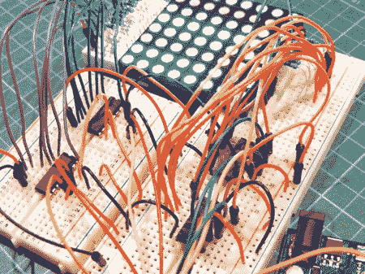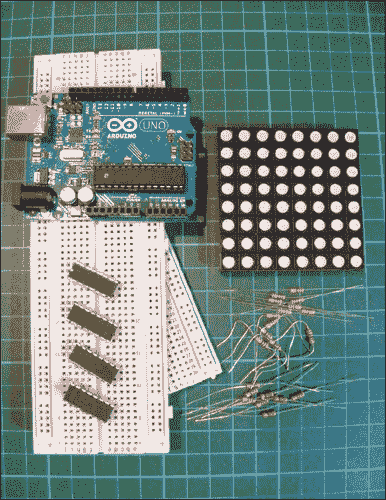

**所需零件**

• Arduino 板

• 2 块全尺寸面包板

• 跳线

• 8×8 RGB LED 矩阵

• 4 个 74HC595 移位寄存器

• 16 个 220 欧姆电阻

• 8 个 330 欧姆电阻

### 工作原理

一个 RGB LED 矩阵（图 24-1）是一个由 64 个红、绿、蓝 LED 组成的网格。你可以通过分别控制每个 LED 并将颜色混合在一起，创造出彩虹的颜色。

**图 24-1：**

一个 RGB LED 矩阵

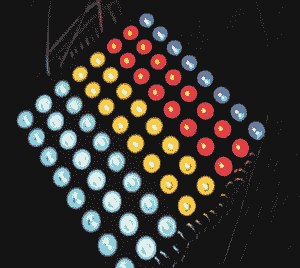

该 LED 矩阵共有 32 个引脚（图 24-2）；8 个引脚控制每个 LED 的公共阳极正极，另外 8 个引脚分别控制红、绿、蓝的亮度。在我们这里使用的矩阵中，17 到 20 和 29 到 32 为阳极引脚，9 到 16 控制红色，21 到 28 控制绿色，1 到 8 控制蓝色，但你的矩阵可能有不同的连接方式。引脚编号 1 将在图 24-2 的左下角标出——引脚编号按顺时针方向排列。

**图 24-2：**

RGB LED 矩阵的引脚

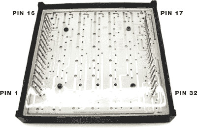

你的矩阵应该带有一份数据表，告诉你哪些引脚控制红、绿、蓝 LED。如果数据表中的引脚编号与表 24-1 中列出的不同，请按照数据表的说明连接移位寄存器和 Arduino。每个颜色的引脚都需要一个电阻，以防止过载和烧坏，但它们的电阻值略有不同——蓝色和绿色使用 220 欧姆电阻，红色使用 330 欧姆电阻。

**表 24-1：**

RGB LED 矩阵的引脚配置

| **矩阵引脚功能** | **矩阵引脚编号** |
| --- | --- |
| 公共阳极 (+) | 17, 18, 19, 20, 29, 30, 31, 32 |
| 红 LED | 9, 10, 11, 12, 13, 14, 15, 16 |
| 绿 LED | 21, 22, 23, 24, 25, 26, 27, 28 |
| 蓝 LED | 1, 2, 3, 4, 5, 6, 7, 8 |

布局看起来可能很复杂，但那只是因为我们使用了这么多不同的电线。只需记住，一步一步地完成项目。

由于连接非常多，我们将在 Arduino 板上用尽引脚，因此我们将使用*移位寄存器*扩展板。移位寄存器是一种数字存储电路，广泛应用于计算器、计算机和数据处理系统中。本项目使用 74HC595 移位寄存器，每次控制 8 个输出，只占用 Arduino 上的 3 个引脚。我们将多个寄存器连接在一起，以同时控制更多引脚，一个控制公共阳极，另外的每个控制 LED 的不同颜色。

移位寄存器的引脚布局见图 24-3，功能描述见表 24-2。在构建项目时，我们将参考移位寄存器的引脚编号和功能，帮助识别。

**图 24-3：**

移位寄存器引脚布局

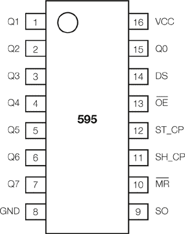

**表 24-2：**

移位寄存器引脚

| **移位寄存器** | **连接** | **引脚功能** |
| --- | --- | --- |
| 引脚 1–7, 15 | Q0–Q7 | 输出引脚 |
| 引脚 8 | GND | 地，VSS |
| 引脚 9 | SO | 串行输出 |
| 引脚 10 | MR | 主复位，低电平有效 |
| 引脚 11 | SH_CP | 移位寄存器时钟引脚（时钟引脚） |
| 引脚 12 | ST_CP | 存储寄存器时钟引脚（锁存引脚） |
| 引脚 13 | OE | 输出使能，低电平有效 |
| 引脚 14 | DS | 串行数据输入（数据引脚） |
| 引脚 16 | VCC | 正电源 |

### 构建过程

1.  将 8×8 RGB LED 矩阵插入两块全尺寸面包板。

1.  插入一个 330 欧姆电阻到每个红色 LED 引脚，插入一个 220 欧姆电阻到每个绿色或蓝色 LED 引脚。

1.  将第一个移位寄存器插入其中一块面包板，靠近 LED 矩阵的共阳引脚。按照图 24-4 所示，使寄存器跨越中央断裂处。将 LED 矩阵的共阳引脚连接到移位寄存器 1，如下所示。这些引脚不需要电阻。

    | **共阳引脚** | **移位寄存器 1 引脚** |
    | --- | --- |
    | **LED 矩阵** | **移位寄存器** | **移位寄存器** | **Arduino** |
    | --- | --- | --- | --- |
    | 32 | 15: Q0 | 8: GND | GND |
    | 31 | 1: Q1 | 9: SO | Shift 3 DS |
    | 30 | 2: Q2 | 10: MR | +5V |
    | 29 | 3: Q3 | 11: SH-CP | 13 |
    | 20 | 4: Q4 | 12: ST-CP | 10 |
    | 19 | 5: Q5 | 13: OE | GND |
    | 18 | 6: Q6 | 14: DS | Shift 2 SO |
    | 17 | 7: Q7 | 16: VCC | +5V |

    **图 24-4：**

    移位寄存器应跨越面包板的断裂处。

    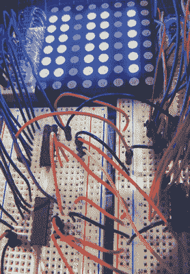

1.  现在插入其余的三个移位寄存器到面包板中。移位寄存器 2 控制绿色 LED，移位寄存器 3 控制蓝色 LED，移位寄存器 4 控制红色 LED。按照以下表格连接每个移位寄存器的电线。所有颜色的 LED 引脚都需要电阻。

    | **绿色 LED 引脚** | **移位寄存器 2 引脚** |
    | --- | --- |
    | **LED 矩阵** | **移位寄存器** | **移位寄存器** | **Arduino** |
    | --- | --- | --- | --- |
    | 28 | 15: Q0 | 8: GND | GND |
    | 27 | 1: Q1 | 9: SO | Shift 1 DS |
    | 26 | 2: Q2 | 10: MR | +5V |
    | 25 | 3: Q3 | 11: SH-CP | 13 |
    | 24 | 4: Q4 | 12: ST-CP | 10 |
    | 23 | 5: Q5 | 13: OE | GND |
    | 22 | 6: Q6 | 14: DS | 11 |
    | 21 | 7: Q7 | 16: VCC | +5V |
    | **蓝色 LED 引脚** | **移位寄存器 3 引脚** |
    | --- | --- |
    | **LED 矩阵** | **移位寄存器** | **移位寄存器** | **Arduino** |
    | --- | --- | --- | --- |
    | 1 | 15: Q0 | 8: GND | GND |
    | 2 | 1: Q1 | 9: SO | Shift 4 DS |
    | 3 | 2: Q2 | 10: MR | +5V |
    | 4 | 3: Q3 | 11: SH-CP | 13 |
    | 5 | 4: Q4 | 12: ST-CP | 10 |
    | 6 | 5: Q5 | 13: OE | GND |
    | 7 | 6：Q6 | 14：DS | 移位 1 SO |
    | 8 | 7：Q7 | 16：VCC | +5V |
    | **红色 LED 引脚** | **移位寄存器 4 引脚** |
    | --- | --- |
    | **LED 矩阵** | **移位寄存器** | **移位寄存器** | **Arduino** |
    | --- | --- | --- | --- |
    | 9 | 15：Q0 | 8：GND | GND |
    | 10 | 1：Q1 | 9：SO | 移位 3 DS |
    | 11 | 2：Q2 | 10：MR | +5V |
    | 12 | 3：Q3 | 11：SH-CP | 13 |
    | 13 | 4：Q4 | 12：ST-CP | 10 |
    | 14 | 5：Q5 | 13：OE | GND |
    | 15 | 6：Q6 | 14：DS | 移位 2 SO |
    | 16 | 7：Q7 | 16：VCC | +5V |

1.  Arduino 通过三个 PWM 引脚控制 LED，每个引脚分别用于时钟、数据和锁存。每个引脚的连接如下。

    | **移位寄存器** | **Arduino** | **功能** |
    | --- | --- | --- |
    | 引脚 9（移位寄存器 2） | 引脚 11 | 数据 |
    | 引脚 12（所有移位寄存器） | 引脚 10 | 锁存 |
    | 引脚 11（所有移位寄存器） | 引脚 13 | 时钟 |

1.  检查你的设置是否与图 24-5 中的电路图一致，然后上传下面的代码“草图”。

    **图 24-5：**

    彩虹制造器的电路图

    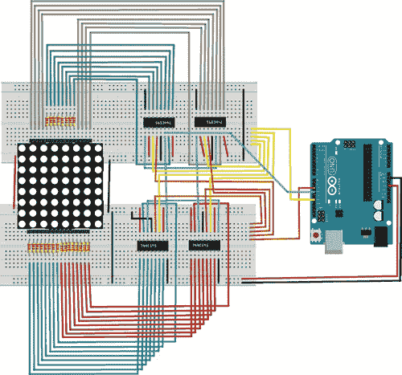

### 草图

草图首先定义了控制移位寄存器的三个 Arduino 引脚。锁存引脚定义为 Arduino 引脚 10，时钟引脚为 13，数据引脚为 11。我们定义了一些变量，范围从 0 到 255，用来控制 LED 颜色的亮度。草图随后逐个打开每个 LED，并将三种颜色组合在一起，创建彩虹的颜色。例如，当绿色亮起、蓝色熄灭、红色亮起时，显示的是黄色。草图最终通过循环随机颜色结束。

```
/* Example 18.1 - experimenting with RGB LED matrix
   CC by-sa 3.0
   http://tronixstuff.wordpress.com/tutorials
*/

int latchpin = 10; // Connect to pin 12 on all shift registers
int clockpin = 13; // Connect to pin 11 on all shift registers
int datapin = 11;  // Connect to pin 14 on shift register 2
int zz = 500; // Delay variable
int va[] = {
  1, 2, 4, 8, 16, 32, 64, 128, 255
};
int va2[] = {
  1, 3, 7, 15, 31, 63, 127, 255
};

void setup() {
  pinMode(latchpin, OUTPUT);
  pinMode(clockpin, OUTPUT);
  pinMode(datapin, OUTPUT);
  digitalWrite(latchpin, LOW);
  shiftOut(datapin, clockpin, MSBFIRST, 0);
  shiftOut(datapin, clockpin, MSBFIRST, 0);
  shiftOut(datapin, clockpin, MSBFIRST, 0);
  shiftOut(datapin, clockpin, MSBFIRST, 0);
  digitalWrite(latchpin, HIGH);
  randomSeed(analogRead(0));
}

void allRed() { // Turn on all red LEDs
  digitalWrite(latchpin, LOW);
  shiftOut(datapin, clockpin, MSBFIRST, 255); // Turn cathodes to full
  shiftOut(datapin, clockpin, MSBFIRST, 0); // Turn green to 0
  shiftOut(datapin, clockpin, MSBFIRST, 0); // Turn blue to 0
  shiftOut(datapin, clockpin, MSBFIRST, 255); // Turn red to full
  digitalWrite(latchpin, HIGH);
}

void allBlue() { // Turn on all blue LEDs
  digitalWrite(latchpin, LOW);
  shiftOut(datapin, clockpin, MSBFIRST, 255); // Turn cathodes to full
  shiftOut(datapin, clockpin, MSBFIRST, 0); // Turn green to 0
  shiftOut(datapin, clockpin, MSBFIRST, 255); // Turn blue to full
  shiftOut(datapin, clockpin, MSBFIRST, 0); // Turn red to 0
  digitalWrite(latchpin, HIGH);
}

void allGreen() { // Turn on all green LEDs
  digitalWrite(latchpin, LOW);
  shiftOut(datapin, clockpin, MSBFIRST, 255); // Cathodes
  shiftOut(datapin, clockpin, MSBFIRST, 255); // Green
  shiftOut(datapin, clockpin, MSBFIRST, 0); // Blue
  shiftOut(datapin, clockpin, MSBFIRST, 0); // Red
  digitalWrite(latchpin, HIGH);
}

void allOn() { // Turn on all LEDs
  digitalWrite(latchpin, LOW);
  shiftOut(datapin, clockpin, MSBFIRST, 255); // Cathodes
  shiftOut(datapin, clockpin, MSBFIRST, 255); // Green
  shiftOut(datapin, clockpin, MSBFIRST, 255); // Blue
  shiftOut(datapin, clockpin, MSBFIRST, 255); // Red
  digitalWrite(latchpin, HIGH);
}

void allYellow() { // Turn on green and red LEDs (yellow)
  digitalWrite(latchpin, LOW);
  shiftOut(datapin, clockpin, MSBFIRST, 255); // Cathodes
  shiftOut(datapin, clockpin, MSBFIRST, 255); // Green
  shiftOut(datapin, clockpin, MSBFIRST, 0); // Blue
  shiftOut(datapin, clockpin, MSBFIRST, 255); // Red
  digitalWrite(latchpin, HIGH);
}

void allAqua() { // Turn on green and blue LEDs (aqua)
  digitalWrite(latchpin, LOW);
  shiftOut(datapin, clockpin, MSBFIRST, 255); // Cathodes
  shiftOut(datapin, clockpin, MSBFIRST, 255); // Green
  shiftOut(datapin, clockpin, MSBFIRST, 255); // Blue
  shiftOut(datapin, clockpin, MSBFIRST, 0); // Red
  digitalWrite(latchpin, HIGH);
}

void allPurple() { // Turn on blue and red LEDs (purple)
  digitalWrite(latchpin, LOW);
  shiftOut(datapin, clockpin, MSBFIRST, 255); // Cathodes
  shiftOut(datapin, clockpin, MSBFIRST, 0); // Green
  shiftOut(datapin, clockpin, MSBFIRST, 255); // Blue
  shiftOut(datapin, clockpin, MSBFIRST, 255); // Red
  digitalWrite(latchpin, HIGH);
}

void clearMatrix() { // Turn off all LEDs
  digitalWrite(latchpin, LOW);
  shiftOut(datapin, clockpin, MSBFIRST, 0); // Cathodes
  shiftOut(datapin, clockpin, MSBFIRST, 0); // Green
  shiftOut(datapin, clockpin, MSBFIRST, 0); // Blue
  shiftOut(datapin, clockpin, MSBFIRST, 0); // Red
  digitalWrite(latchpin, HIGH);
}

void lostinspace() { // Random flashes of the LEDs
  for (int z = 0; z < 100; z++) {
    digitalWrite(latchpin, LOW);
    shiftOut(datapin, clockpin, MSBFIRST, va[random(8)]); // Cathodes
    shiftOut(datapin, clockpin, MSBFIRST, va[random(8)]); // Green
    shiftOut(datapin, clockpin, MSBFIRST, va[random(8)]); // Blue
    shiftOut(datapin, clockpin, MSBFIRST, va[random(8)]); // Red
    digitalWrite(latchpin, HIGH);
    delay(100);
  }
}

void displayLEDs(int rr, int gg, int bb, int cc, int dd) {
// Insert the base-10 values into the shiftOut functions
// and hold the display for dd milliseconds
  digitalWrite(latchpin, LOW);
  shiftOut(datapin, clockpin, MSBFIRST, cc); // Cathodes
  shiftOut(datapin, clockpin, MSBFIRST, gg); // Green
  shiftOut(datapin, clockpin, MSBFIRST, bb); // Blue
  shiftOut(datapin, clockpin, MSBFIRST, rr); // Red
  digitalWrite(latchpin, HIGH);
  delay(dd);
}

void loop() { // Light up the whole display in solid colors
  allOn();
  delay(zz);

  delay(zz);
  allRed();
  delay(zz);

  delay(zz);
  allGreen();
  delay(zz);

  delay(zz);
  allBlue();
  delay(zz);

  delay(zz);
  allPurple();
  delay(zz);

  delay(zz);
  allYellow();
  delay(zz);

  delay(zz);
  allAqua();
  delay(1000);
  // Light some individual LEDs using random values
  lostinspace(); // Scroll some horizontal and vertical lines
  for (int z = 0; z < 5; z++) {
    for (int q = 1; q < 129; q *= 2) {
      displayLEDs(255, 0, 0, q, 200);
    }
  }
  clearMatrix();
  delay(1000);

  for (int z = 0; z < 5; z++) {
    for (int q = 1; q < 129; q *= 2) {
      displayLEDs(0, 255, 0, q, 200);
      displayLEDs(q, 0, 0, 255, 200);
    }
  }
  clearMatrix();
  delay(1000);

  for (int z = 0; z < 5; z++) {
    for (int q = 1; q < 9; q++) {
      displayLEDs(0, 0, 255, va2[q], 200);
    }
  }
  clearMatrix();
  delay(1000);
}
```

## 项目 25：构建你自己的 Arduino！

**这个项目将教你如何使用最少的单独组件构建你自己的 Arduino。**

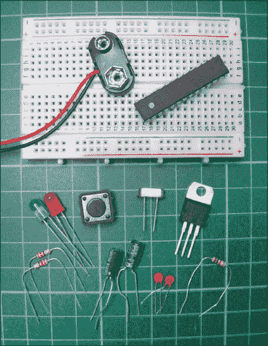

**所需组件**

• ATMEL ATmega328p 芯片

• 面包板

• 绿色 LED

• 红色 LED

• 3 个 220 欧姆电阻

• 16 MHz 晶振（HC-495）

• L7805cv 5V 稳压器

• 2 个 100 μF 电解电容

• PP3 9V 电池夹

• 瞬时触觉四脚按钮

• 2 个 22 pF 磁盘电容

• 跳线

• 9V 电池

这是一个有趣且廉价的小板，其功能与 Arduino 相同，因此可以作为永久项目的一部分，代替更贵的 Arduino 板。

### 工作原理

我们的项目板与 Arduino 板的工作方式完全相同。它的核心是 ATMEL ATmega328p 芯片（见图 25-1），我们将在其上连接其他组件。ATmega 芯片是 Arduino 的大脑，负责执行上传的草图中的指令。

**图 25-1：**

ATMEL ATmega328p 芯片

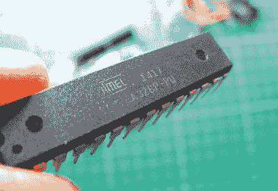

L7805cv 5V 稳压器调节电压，并将 9V 电池的电流限制为 5V，这是 ATmega 芯片的工作电压，从而保护芯片和其他组件。16 MHz 的晶体振荡器（参见图 25-2）使 Arduino 能够计算时间，电容器则作为滤波器平滑电压。

**图 25-2：**

16 MHz 的晶体振荡器

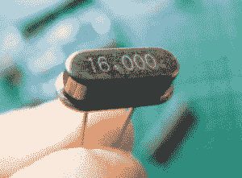

表 25-1 详细列出了 ATmega328p 芯片的引脚及其对应的 Arduino 引脚。例如，我们在“测试你的 Arduino：使 LED 闪烁”中使用的 Arduino 上的 13 号引脚，在实际芯片上对应的是 19 号引脚。芯片顶部可以通过小半圆形凹陷来识别（参见图 25-3）。引脚 1 位于这个凹陷下面，从这里开始引脚按逆时针方向编号 1 到 28。

**表 25-1：**

ATmega 芯片的引脚及其对应的 Arduino 引脚

| **ATMEGA 引脚** | **ARDUINO 功能** | **ATMEGA 引脚** | **ARDUINO 功能** |
| --- | --- | --- | --- |
| 1 | 复位 | 15 | 引脚 9 |
| 2 | 引脚 0 | 16 | 引脚 10 |
| 3 | 引脚 1 | 17 | 引脚 11 |
| 4 | 引脚 2 | 18 | 引脚 12 |
| 5 | 引脚 3 | 19 | 引脚 13 |
| 6 | 引脚 4 | 20 | BCC |
| 7 | VCC | 21 | AREF |
| 8 | GND | 22 | GND |
| 9 | 晶体 | 23 | A0 |
| 10 | 晶体 | 24 | A1 |
| 11 | 引脚 5 | 25 | A2 |
| 12 | 引脚 6 | 26 | A3 |
| 13 | 引脚 7 | 27 | A4 |
| 14 | 引脚 8 | 28 | A5 |

**图 25-3：**

芯片顶部标有半圆形的凹陷。

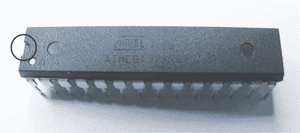

### 准备芯片

确保购买的 ATmega 芯片已安装 Arduino 引导加载程序，因为它还会预加载闪烁 LED 的草图，这是你这个项目所需要的。

我们自制的 Arduino 没有 USB 连接器，无法将芯片直接连接到电脑，因此，如果你想用这个 Arduino 面包板配合不同的草图（或者如果你的芯片没有预装引导加载程序），你需要使用现有的 Arduino 板作为主机，并按以下步骤将草图上传到 ATmega 芯片：

1.  小心地从现有的 Arduino 板上取下 ATmega 芯片（参见图 25-4），并将其替换为你的 ATmega 芯片。

    **图 25-4：**

    从 Arduino 中取出 ATmega 芯片

    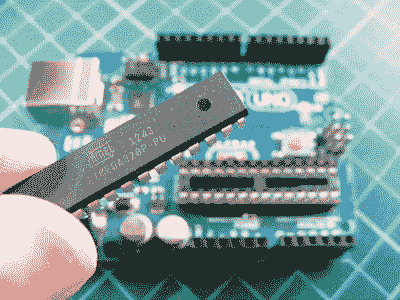

1.  使用 USB 线将 Arduino 连接到你的电脑。

1.  打开你电脑上的 Arduino IDE。

1.  将草图上传到芯片。

1.  一旦草图上传完成，断开 Arduino 与电脑的连接，小心地从电路板上取下这个芯片，并替换回原来的 Arduino ATmega 芯片。

新的 ATmega 芯片应该加载上所需的草图。通常你会希望将自己的 Arduino 构建成一个长期项目的一部分，因此不太需要频繁加载新的草图；你只需要在项目开始时加载一个草图，并从此一直使用这个草图。

现在你可以开始准备自己的电路板了。

### 构建 Arduino 电路

我通常在章节末尾展示电路图，但在这个实例中，先看电路图有助于参考布局并识别正在使用的组件（图 25-5）。

**图 25-5：**

完整电路图

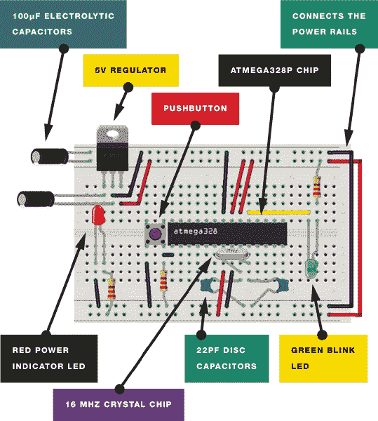

1.  将 ATmega 芯片插入面包板，使其引脚跨越面包板中心的间隔。你需要在两端留出一些空间以放置其他组件，因此大致按照图 25-6 所示放置。记住，ATmega328p 的第 1 引脚位于芯片上方小半圆形凹陷的正下方。从这里开始，引脚按逆时针方向编号为 1 到 28。用这个信息来正确定位芯片。半圆形应位于电路的左侧。

    **图 25-6：**

    放置 ATmega 芯片，使其跨越中心间隔

    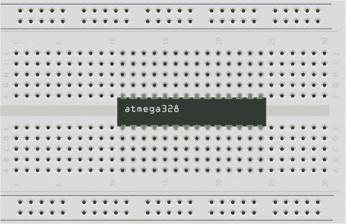

1.  将 ATmega 的第 7、20 和 21 引脚连接到面包板上最接近的正电源轨，将第 8 和 23 引脚连接到负电源轨。使用跳线将电路板两侧的正电源轨和 GND 电源轨连接，如图 25-7 所示。

    **图 25-7：**

    连接到电源轨

    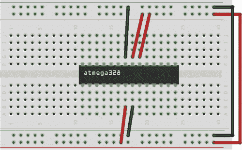

1.  将晶体振荡器的一只引脚连接到 ATmega 芯片的第 9 引脚，另一只引脚连接到第 10 引脚。将其中一个 22 pF 磁盘电容器的引脚连接到第 9 引脚和 GND，将另一个磁盘电容器的引脚连接到第 10 引脚和 GND，如图 25-8 所示。

    **图 25-8：**

    插入晶体振荡器和 22pF 磁盘电容器

    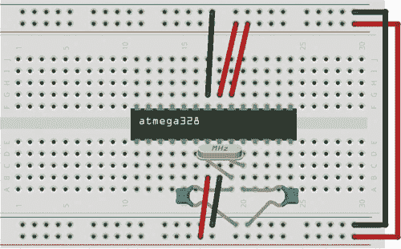

1.  将复位按钮插入面包板，位置在 ATmega 芯片的左侧，使其引脚跨越面包板的中心间隔。使用跳线将复位按钮的右下引脚连接到 ATmega 的第 1 引脚，左下引脚连接到 GND，如图 25-9 所示。将一只 220 欧姆电阻连接到右下引脚，并将电阻的另一端连接到 GND 电源轨。这个按钮将作为我们的复位按钮。

    **图 25-9：**

    插入复位按钮

    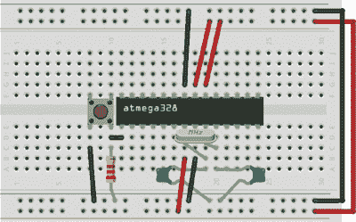

1.  将 L7805cv 5V 稳压器插入面包板的左上角，组件上的打印数字朝向你，按图 25-10 所示放置——引脚从左到右编号为 1 到 3。将一只 100 μF 电解电容器插入面包板的上方电源轨，一只引脚连接到正电源轨，另一只引脚连接到负电源轨。将第二只 100 μF 电解电容器连接到 5V 稳压器的第 1 和第 2 引脚。然后将稳压器的第 2 引脚连接到负电源轨，第 3 引脚连接到正电源轨。

    **图 25-10：**

    连接电解电容器和 L7805cv 5V 稳压器

    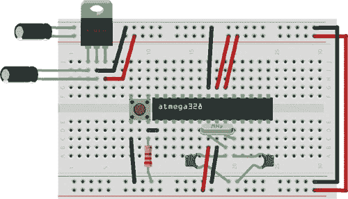

1.  将红色 LED 插入面包板，将长的正极引脚通过一个 220 欧姆电阻连接到正电源轨，将短的负极引脚连接到 GND。然后插入绿色 LED，将短的引脚连接到 ATmega 的 21 号引脚，长的引脚通过一个 220 欧姆电阻连接到正电源轨，如图 25-11 所示。将电池的正电源接到 5V 调节器的 1 号引脚，GND 接到调节器的 2 号引脚。

    **图 25-11：**

    插入 LED 并连接电池

    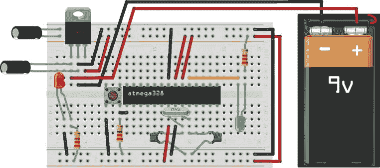

你的电路板现在已经完成，应该像图 25-12 所示那样。红色 LED 在面包板的电源轨接通时亮起，表示 Arduino 已开机并在正常工作，而绿色 LED 则响应加载到 ATmega 芯片上的“闪烁 LED”示例程序而亮起。

**图 25-12：**

完成的电路

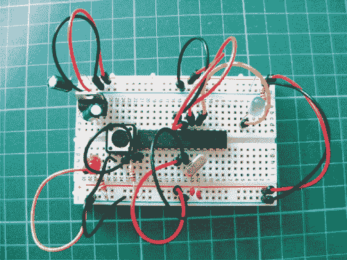

使用表 25-1 中的参考，你可以像使用 Arduino Uno 一样使用这个电路板，通过将组件连接到 ATmega 芯片的引脚，而不是 Arduino 的引脚。如果你想将本书中的某个项目做成永久性的，可以考虑自己构建一个 Arduino 来为其供电！记得首先通过真实的 Arduino 板将程序加载到 ATmega 芯片上。
