## 附录 A：组件

**本附录提供了关于本书中项目所用组件的更多信息。每个组件都附有一张照片和一些详细信息，供快速参考和识别，同时我还提供了一个方便的零售商列表，帮助你购买这些零件。你还将获得一个快速的电阻器值读取课程。**

### 组件指南

这里是你将使用的组件指南，附带了一些你可能觉得有用的细节。这些组件按书中的顺序列出。许多物品可以通过在 eBay 或 Amazon 等网站上的简单搜索找到，但第 240 页也提供了专业零售商的列表。

#### Arduino Uno R3

Arduino Uno R3 是本书的主要组件，也是所有项目的大脑。

| 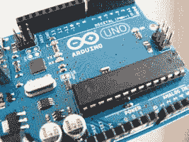 | • 数量：1 个• 连接：14 个• 项目：除项目 25 外的所有项目 |
| --- | --- |

#### 9V 电池组

9V 电池组通过插头连接到 Arduino，为你的项目提供电力。你需要连接电池，并将插头插入 Arduino 的端口，详细信息请参阅第 3 页的“电源”。请注意，Arduino 也可以通过 USB 电缆供电。

| 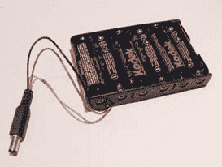 | • 数量：1 个• 连接：1 个• 项目：所有项目可选 |
| --- | --- |

#### 面包板

面包板是一种原型电路板，用于连接组件并创建你的项目。有关更多信息，请参阅第 4 页的“面包板”。

| 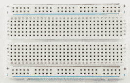 | • 数量：2 块全尺寸电路板，1 块半尺寸电路板，1 块迷你电路板 • 连接：全尺寸电路板 940 个连接，半尺寸电路板 420 个连接，迷你电路板 170 个连接 • 项目：除项目 7 外的所有项目 |
| --- | --- |

#### LED

当小电流通过 LED 时，它会发光。它看起来像一个小电灯泡，带有两条引脚。较长的引脚是正极连接。LED 通常需要一个电阻器，否则它们可能会烧坏。LED 是有极性的，这意味着电流只能在一个方向流动。

|  | • 数量：40 个（红色、蓝色、黄色、绿色各 10 个）• 连接：2 个• 项目：1–6，8，9，17，18，19，21，22，23，25 |
| --- | --- |

#### 电阻器

电阻器限制电流通过电路的量，以防止组件过载。它们看起来像带有彩色带和两端导线的圆柱体。电阻值由颜色编码表示——有关更多细节，请参阅第 241 页的“解码电阻值”。请仔细检查，因为选择错误的电阻值很容易。电阻器有两种、四种和五种带标记的版本，因此要注意，例如，四带 220 欧姆电阻器与同值的五带电阻器外观可能略有不同。

| 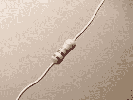 | • 数量：30 220 欧姆，10 330 欧姆，1 10k 欧姆，1 1m 欧姆电阻 • 接口：2 • 项目：1–4, 6, 8, 9, 16, 17, 18, 19, 22, 23, 24, 25 |
| --- | --- |

#### 按键

按键是一个简单的开关，按下时会使电路连接。这个开关在按下时连接电路，但松开时会弹回并切断连接。它也被称为瞬时开关。按键的大小各异，但大多数都有四个引脚。

| 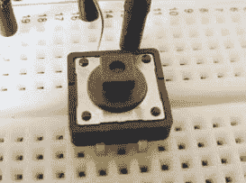 | • 数量：4 • 接口：4 • 项目：2, 8, 15, 16, 17, 25 |
| --- | --- |

#### 电位器

电位器是一种电阻器，你可以通过调节它的值来控制流经它的电压。它有一个可以旋转的旋钮和底部的三个引脚。中间的引脚是控制引脚，电源接在两侧（连接方向无所谓）。它常用于控制输出设备，如收音机的音量。

|  | • 数量：1 50k 欧姆电位器 • 接口：3 • 项目：2, 3, 4, 12, 13, 14, 15, 17 |
| --- | --- |

#### HL-69 土壤传感器

土壤传感器用于测量土壤的湿度。它有两个叉状触点和顶部的两个引脚。本书中使用的传感器是 HL-69 土壤湿度计。它配有一个驱动模块，你需要将它连接到 Arduino，而不是直接连接到传感器。

| 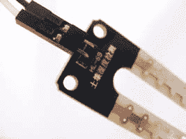 | • 数量：1 • 接口：2 • 项目：5 |
| --- | --- |

#### 蜂鸣器

蜂鸣器是一种非常基础的扬声器。电流脉冲使其非常快速地发出点击声，一连串的脉冲则会发出音调。它通常看起来像一个带有两根线的小黑盒子。取出外壳后，它看起来像一个小金色圆盘。它非常便宜，常用于廉价玩具中生成噪音（例如警报器）。它还可以作为噪音传感器使用，如在项目 9 中所示。

| 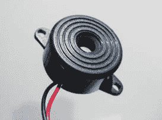 | • 数量：1 • 接口：2 • 项目：5, 7, 8, 9, 15, 17, 18, 19, 21, 23 |
| --- | --- |

#### 伺服电机

伺服电机是一种具有可以定位的臂的电机，你可以通过向伺服电机发送编码信号将其定位到特定角度。它是一个小盒子，带有三根线和一个输出轴，输出轴可以连接附件（称为喇叭）。红色线是电源或+5V，黑色/棕色线是地线或 GND，橙色/白色线是信号线，连接到 Arduino 的模拟引脚。本书中使用的 Tower Pro 9g 伺服电机可以旋转 180 度，但其他伺服电机是连续旋转的，可以转动完整的 360 度。

| 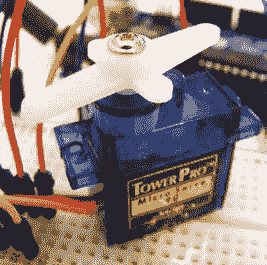 | • 数量：2 • 接口：3 • 项目：9, 10, 11, 18, 20, 22, 23 |
| --- | --- |

#### 摇杆

一个摇杆记录模拟输入，之后可以读取该输入并转换为数字输出。它基本上是两个电位器提供两个轴的信号：左右和上下。它有很多应用，如游戏或控制伺服电机。

| 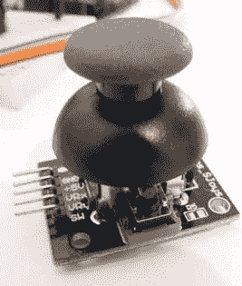 | • 数量：1 • 接口：5 • 项目：10 |
| --- | --- |

#### 红外 LED 接收器

红外（IR）LED 接收器从例如遥控器接收红外信号。它是一个小型外壳中的 LED，具有三个引脚：OUT、GND 和 +5V（正电源）。它是极性组件，因此需要正确连接。请查阅接收器的数据手册，以防连接方式不同。

| 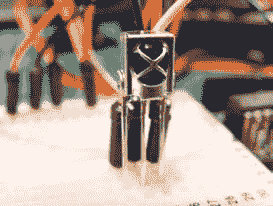 | • 数量：1 • 连接：3 • 项目：11 |
| --- | --- |

#### LCD 屏幕

LCD 屏幕是一种用于输出字符的显示屏。屏幕有各种尺寸。此处展示的是 HD44780（16 字符 × 2 行），具有 16 个连接。LCD 屏幕由两片偏振材料和其间的液晶溶液组成；电流通过液晶时会产生图像。

|  | • 数量：1 • 连接：16 • 项目：12, 13, 14, 15 |
| --- | --- |

#### DHT11 湿度传感器

DHT11 传感器用于测量湿度和温度。它是一个小型的蓝色或白色塑料盒子，带有四个引脚，虽然有时它被安装在只有三个引脚的模块板上。本书使用的是 DHT11 传感器，我们只使用其中的三个引脚：+5V、DATA 和 GND。

| 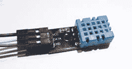 | • 数量：1 • 连接：4（但我们只使用 3 个） • 项目：13 |
| --- | --- |

#### 倾斜球开关

倾斜球开关是一个内部含有金属球的外壳，当开关处于竖直位置时，金属球会接通电路。倾斜开关时，连接会断开。

| 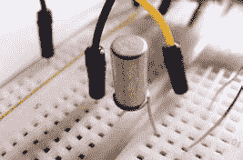 | • 数量：1 • 连接：2 • 项目：14 |
| --- | --- |

#### RGB LED

RGB LED 模块是三种颜色合一——红色、绿色和蓝色。通过组合这些颜色，你可以创造任何彩虹色。它是一个透明的 LED，具有四个引脚，有时会安装在带有内置电阻的模块板上，如图所示。你需要使用电阻来限制电流，否则 LED 会烧坏。最长的引脚要么是共阴极，要么是共阳极。

| 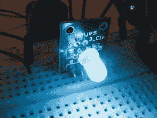 | • 数量：1 • 连接：4 • 项目：15 |
| --- | --- |

#### 七段 LED 显示器

七段 LED 显示器使用 LED 段显示数字或字符。它们通常用于显示计数器、时钟或定时器的数字。你可以购买单数字到八数字的显示器，而四位数显示器常用于数字时钟。

| 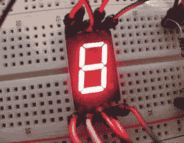 | • 数量：1 • 连接：10–12 • 项目：16, 17 |
| --- | --- |

#### 四位数七段串行显示器

这是一个四位数的七段 LED 显示器，内置了额外的电路，因此可以通过很少的连接来控制。这个串行模块是 SparkFun 版本，有不同的颜色可供选择。它有 10 个连接，但在 Arduino 上只需要使用 3 个（VCC、GND 和 RX）。

| 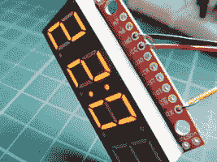 | • 数量：1 • 连接：10（但我们只使用 3 个） • 项目：17 |
| --- | --- |

#### 超声波传感器

超声波传感器发出一个信号（通常称为*ping*），该信号会反射到物体上并返回到传感器。通过计算信号返回的时间来确定距离。书中使用的超声波传感器是 HC-SR04 超声波传感器，它是一个带有两个圆形传感器和四个引脚的模块板。

| 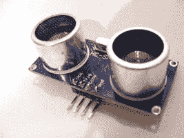 | • 数量：1 • 连接：4 • 项目：18, 20 |
| --- | --- |

#### 光敏电阻

光敏电阻，也称为光依赖电阻或二极管，根据照射在其上的光线强度产生可变的电阻值，并用于检测光线水平。它有不同的样式，但通常是一个小巧、透明的椭圆形，带有波浪状线条和两根引脚。在使用它进行编程之前，你需要对其进行校准，以确定光照强度。

|  | • 数量：1 • 连接：2 • 项目：19 |
| --- | --- |

#### RC V959 导弹发射器

WLToys RC V959 导弹发射器是为无线电控制直升机设计的，它是一个迷你加特林枪，能够快速连续发射六个塑料火箭。它有四根线，但我们只使用黄色和白色线来实现连续发射。

| 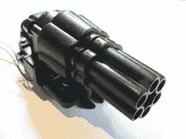 | • 数量：1 • 连接：4（但我们只使用 2 个） • 项目：20 |
| --- | --- |

#### PIR 传感器

PIR（被动红外）传感器可以检测其范围内的运动。书中使用的是 HC SR501，这是最常见的 PIR 传感器。模块的前面有一个高尔夫球型透镜，并有三个连接：+5V、OUTPUT 和 GND。橙色的立方体是可调电阻，用于改变距离范围和输出时序。

| 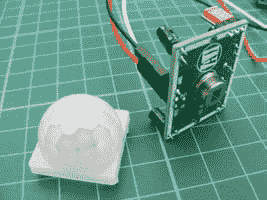 | • 数量：1 • 连接：3 • 项目：21 |
| --- | --- |

#### 键盘

4×4 键盘基本上是一系列开关。这里示例的键盘有 16 个串联的按钮，也有 12 按钮版本。八个连接中，四个控制行，四个控制列。Arduino 将复制按下按钮的数字。

| 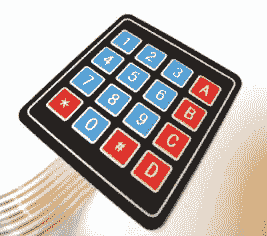 | • 数量：1 • 连接：8 • 项目：22 |
| --- | --- |

#### RFID 读卡器

RFID（射频识别）模块读取 RFID 卡和钥匙扣，根据卡的访问级别允许或拒绝操作。它是一个带有八个引脚和内置天线的小板。书中使用的模块是 Mifare RFID-RC522 模块，通常配有一张卡和钥匙扣。

| 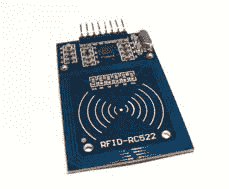 | • 数量：1 • 连接：8 • 项目：23 |
| --- | --- |

#### RGB 矩阵

8×8 RGB 矩阵是由 64 个 LED 组成的阵列，能够通过红色、绿色和蓝色的变化创造出彩虹的颜色。矩阵上有 32 个引脚：8 个控制每个 LED 的公共阳极，8 个控制红色，8 个控制绿色，8 个控制蓝色。每个控制颜色的引脚都需要电阻。

| 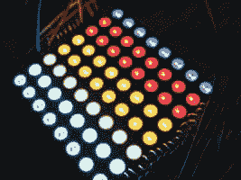 | • 数量：1 • 连接：32 • 项目：24 |
| --- | --- |

#### 移位寄存器

移位寄存器是一种小型集成电路和顺序逻辑计数器，它允许 Arduino 通过“移位”并存储数据来增加更多连接。它是一个小型黑色芯片，具有 16 根引脚。在一端，你会看到一个点或半圆—引脚 1 在这个标记的左侧。项目 16 中的电子骰子使用了 74HC595 移位寄存器。

| 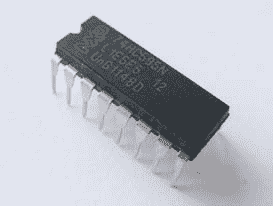 | • 数量: 1• 连接数: 16• 项目: 16, 24 |
| --- | --- |

#### ATmega328p 芯片

ATMEL ATmega328p 芯片是 Arduino 的大脑；它执行上传的草图中的指令。它是一个小型黑色芯片，具有 32 根引脚。在一端，你会看到一个点或半圆—引脚 1 在这个标记的左侧。

| 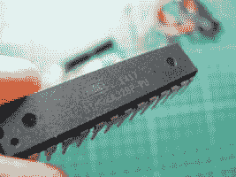 | • 数量: 1• 连接数: 32• 项目: 25 |
| --- | --- |

#### 16 MHz 晶体振荡器

16 MHz 晶体振荡器使 Arduino 能够计算时间。它是一个小型金属外壳，具有两根引脚，并且每根引脚上都需要一个电容器来帮助平滑电压。晶体的频率通常印刷在正面。

| 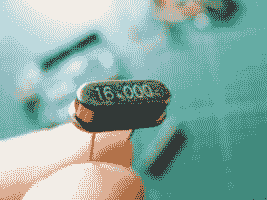 | • 数量: 1• 连接数: 2• 项目: 25 |
| --- | --- |

#### 5V 稳压器

L7805cv 5V 稳压器将 7 至 11 伏的电压降至稳定的 5 伏。

| 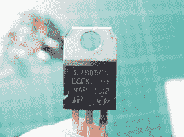 | • 数量: 1• 连接数: 3• 项目: 25 |
| --- | --- |

#### 电容器

电容器可以储存少量电能以备后用，并且可以用来平滑电压输出和流动。它们看起来像小型圆柱体，带有两根引脚，数值通常印刷在侧面。电容器有极性，需要正确插入。长引脚为正极，短引脚为负极；这通常在圆柱体上标明。市面上有多种类型；这里展示的是一种铝制的 100μF 电解电容。

| 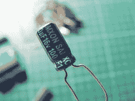 | • 数量: 2• 连接数: 2• 项目: 25 |
| --- | --- |

#### 片式电容

22pf 片式电容是另一种能够储存少量电能以备后用的电容器。它看起来像一个小圆盘，带有两根引脚，数值通常印刷在正面。市面上有多种类型；这里展示的是一种陶瓷版本。

|  | • 数量: 2• 连接数: 2• 项目: 25 |
| --- | --- |

#### 电池夹

PP3 9V 电池夹是一个简单的 9V 电池连接器。它是一个小型黑色夹子，带有两根线：黑色为地线，红色为正极。

| 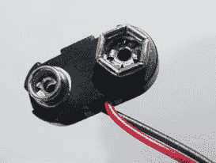 | • 数量: 1• 连接数: 2• 项目: 25 |
| --- | --- |

### 零售商列表

大多数电子元件可以在像 eBay 或 Amazon 这样的通用网站上找到，但如果你遇到找不到的元件，这里列出的零售商可能能够帮助你。

**美国零售商**

**Adafruit** *[`www.adafruit.com/`](https://www.adafruit.com/)*

**DigiKey** *[`www.digikey.com/`](http://www.digikey.com/)*

**Jameco Electronics** *[`www.jameco.com/`](http://www.jameco.com/)*

**Little Bird Electronics** *[`www.littlebirdelectronics.com/`](http://www.littlebirdelectronics.com/)*

**MCM** *[`www.mcmelectronics.com/`](http://www.mcmelectronics.com/)*

**Newark element14** *[`www.newark.com/`](http://www.newark.com/)*

**RadioShack** *[`www.radioshack.com/`](http://www.radioshack.com/)*

**RS Components** *[`www.rs-components.com/`](http://www.rs-components.com/)*

**Seeed Studio** *[`www.seeedstudio.com/depot/`](http://www.seeedstudio.com/depot/)*

**SparkFun** *[`www.sparkfun.com/`](https://www.sparkfun.com/)*

**欧洲零售商**

**Electronic Sweet Pea’s** *[`www.sweetpeas.se/`](http://www.sweetpeas.se/)*

**Element 14** *[`www.element14.com/`](http://www.element14.com/)*

**Farnell** *[`www.farnell.com/`](http://www.farnell.com/)*

**Jameco Electronics** *[`www.jameco.com/`](http://www.jameco.com/)*

**英国零售商**

**4tronix** *[`www.4tronix.co.uk/store/`](http://www.4tronix.co.uk/store/)*

**Cool Components** *[`www.coolcomponents.co.uk/`](http://www.coolcomponents.co.uk/)*

**CPC** *[`cpc.farnell.com`](http://cpc.farnell.com)*

**Hobby Components** *[`www.hobbycomponents.com/`](https://www.hobbycomponents.com/)*

**Mallinson Electrical** *[`www.mallinson-electrical.com/shop/`](http://www.mallinson-electrical.com/shop/)*

**Maplin** *[`www.maplin.co.uk/`](http://www.maplin.co.uk/)*

**Oomlout** *[`oomlout.co.uk/`](http://oomlout.co.uk/)*

**The Pi Hut** *[`thepihut.com/`](http://thepihut.com/)*

**Proto-pic** *[`proto-pic.co.uk/`](http://proto-pic.co.uk/)*

**Rapid Electronics** *[`www.rapidonline.com/`](http://www.rapidonline.com/)*

**RS** *[`uk.rs-online.com/web/`](http://uk.rs-online.com/web/)*

**Spiratronics** *[`spiratronics.com/`](http://spiratronics.com/)*

### 解码电阻值

在本书的大多数项目中，我们使用了*电阻器*，这是一种限制电流通过电路的电气元件（以欧姆为单位）。它们用于保护像 LED 这样的元件，防止过载和烧毁。电阻器的值通过其外壳上的彩色带标识。电阻器可以有四、五或六个彩色带。

确定电阻器的值非常重要，这样你就可以确保在项目中使用了正确的电阻器。让我们尝试确定图 A-1 中显示的四环电阻器的值。

**图 A-1：**

四环电阻

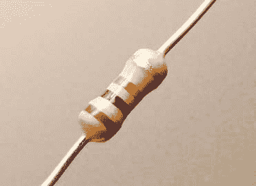

查看电阻器时，将带有银色或金色带的那一侧朝右，注意从左到右的颜色顺序。如果电阻器没有银色或金色带，请确保带有三个彩色带的一侧在左边。

使用表 A-1 来确定电阻器的值。

**表 A-1：**

计算电阻值

| **颜色** | **第一带** | **第二带** | **第三带** | **倍数** | **容差** |
| --- | --- | --- | --- | --- | --- |
| 黑 | 0 | 0 | 0 | 1Ω |  |
| 棕 | 1 | 1 | 1 | 10Ω | +/-1% |
| 红 | 2 | 2 | 2 | 100Ω | +/-2% |
| 橙 | 3 | 3 | 3 | 1KΩ |  |
| 黄 | 4 | 4 | 4 | 10KΩ |  |
| 绿 | 5 | 5 | 5 | 100KΩ | +/-0.5% |
| 蓝 | 6 | 6 | 6 | 1MΩ | +/-0.25% |
| 紫 | 7 | 7 | 7 | 10MΩ | +/-0.10% |
| 灰 | 8 | 8 | 8 |  | +/-0.05% |
| 白 | 9 | 9 | 9 |  |  |
| 金 |  |  |  | 0.1Ω | +/-5% |
| 银 |  |  |  | 0.01Ω | +/-10% |

**注意**

*表示公差的带通常是银色或金色的，尽管它也可以是任何列有百分比的颜色。如果你的电阻器的公差带不是银色或金色的，那么在数值带和公差带之间应该有一个小间隙，以便你能区分它们。*

对应于第一和第二条带的数值给出数字值，第三条带告诉你需要在该数字后添加多少个零，第四条带则告诉你*公差*—即实际值与目标值的差异范围。对于图 A-1 中的电阻器：

• 第一条带是棕色的（1）= 1。

• 第二条带是黑色的（0）= 0。

• 第三条带是红色的（2）= 00（2 是零的个数）。

• 第四条带是金色的，因此公差（精度）为+/- 5%。

所以这个电阻器是 1,000 欧姆或 1 千欧，公差为 5%，意味着实际值可能比 1 千欧大或小 5%。我们也可以对五条或六条带的电阻器进行相同的计算。

如果你不确定电阻器的数值，快速在线查找电阻器本体上的色带将帮助你；只需确保按正确的顺序列出颜色，从左到右读取，公差带在右侧。
