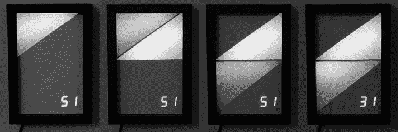
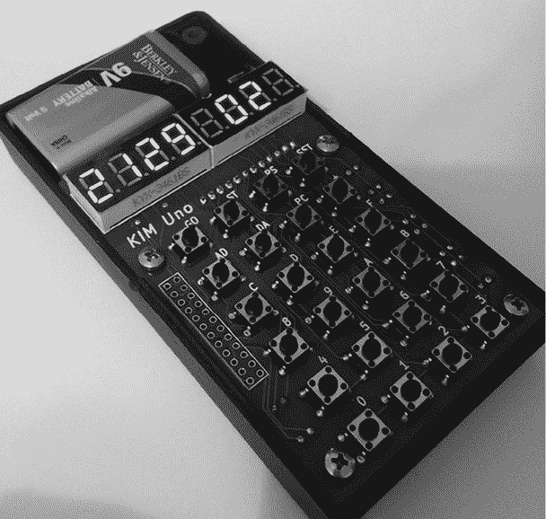
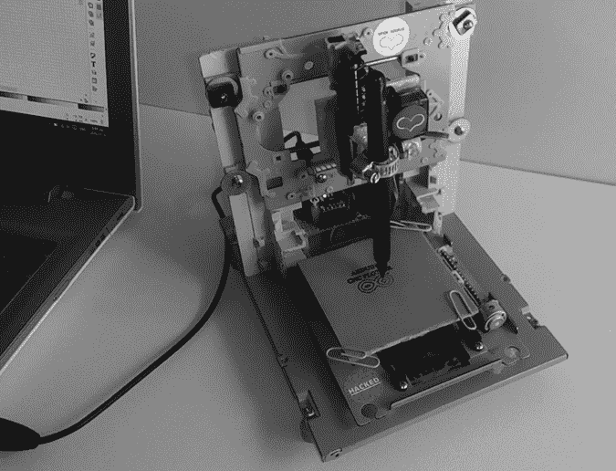
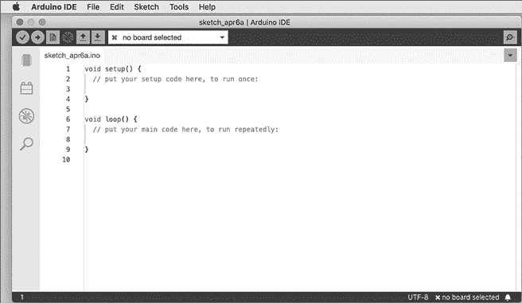

# 第一章：入门

你是否曾经看过某个小工具，并想知道它是如何*真正*工作的？也许它是遥控船、电梯、自动售货机，或是一款电子玩具。或者，你是否曾想过自己制作一个机器人，或为模型铁路制作电子信号？又或者你可能想要捕捉并分析天气数据？你该从哪里开始，如何开始？

Arduino 微控制器板（如图 1-1 所示）可以帮助你通过动手操作的方式解答一些电子学的奥秘。Arduino 系统由马西莫·班齐（Massimo Banzi）和大卫·库尔蒂埃尔斯（David Cuartielles）最初创立，提供了一种廉价的方式来构建互动项目，比如遥控机器人、GPS 跟踪系统和电子游戏。

自 2005 年推出以来，Arduino 项目迅猛发展。它现在已经成为一个蓬勃发展的产业，得到了一个共同致力于创造新事物的社区的支持。你会发现个人和团体，从小型俱乐部到地方黑客空间，再到教育机构，都在尝试使用 Arduino 制作各种物品。

图 1-1：Arduino 板

想要了解各种 Arduino 项目的多样性，只需搜索互联网。在那里，你将发现大量的项目、博客、经验和创意，展示了 Arduino 可以实现的可能性。

## 可能性无穷无尽

浏览本书，你会发现 Arduino 可以用来做一些简单的事情，比如让一个小灯闪烁，也可以做一些复杂的事情，比如与手机互动——以及介于两者之间的许多不同的事情。

例如，看看贝基·斯特恩（Becky Stern）的 Wi-Fi 天气显示器，不同的示例显示在图 1-2 中。它使用一块兼容 Arduino 的板子和 Wi-Fi 接口来接收本地天气预报。然后，它会显示当天的最高气温，并点亮一个彩色三角形来表示当天的天气预报。

图 1-2：天气预报显示设备的各种示例

由于可以轻松查询各种基于互联网的信息服务，你可以用它来显示天气以外的数据。欲了解更多信息，请访问[`www.instructables.com/id/WiFi-Weather-Display-With-ESP8266/`](https://www.instructables.com/id/WiFi-Weather-Display-With-ESP8266/)。

如何重现过去经典的计算机？得益于 Arduino 内置处理器的强大功能，你可以模拟过去的计算机。一个例子是奥斯卡·维尔梅伦（Oscar Vermeulen）的 KIM Uno，如图 1-3 所示，它模拟了 1976 年的 KIM-1 计算机。访问[`en.wikipedia.org/wiki/KIM-1`](https://en.wikipedia.org/wiki/KIM-1)了解更多信息。

图 1-3：一台 Arduino 驱动的 KIM-1 模拟器

通过构建这个项目，用户可以理解早期微处理器的工作原理，这将为理解现代计算机打下基础。你可以用不到 50 美元的成本重建 Kim Uno，这个低廉的价格使得这个项目成为与有技术兴趣的其他人分享的理想工具。欲了解更多信息，请访问 [`obsolescence.wixsite.com/obsolescence/kim-uno-summary-c1uuh/`](https://obsolescence.wixsite.com/obsolescence/kim-uno-summary-c1uuh/)。

还有 Michalis Vasilakis，他也喜欢自己动手制作工具，而且预算有限。他的一个很好的示例是他的 Arduino Mini CNC 绘图仪。这个项目使用了 Arduino、旧 CD 驱动器的机制和其他廉价物品，创建了一个计算机数控（CNC）设备，可以在平面表面上精确绘图（见 图 1-4）。欲了解更多信息，请访问 [`www.ardumotive.com/new-cnc-plotter.html`](http://www.ardumotive.com/new-cnc-plotter.html)。

图 1-4：Arduino Mini CNC 绘图仪

这些只是使用 Arduino 实现的一些随机示例。你可以轻松地创建自己的简单项目——而且在完成本书的学习后，更复杂的项目肯定也在你的能力范围之内。

## 人多力量大

如果你是一个更倾向于社交学习，喜欢以课堂为导向的环境，可以在网上搜索本地的黑客空间或爱好者小组，看看人们正在制作什么，并找到与 Arduino 相关的团体。Arduino 小组的成员可以做很多事情，比如从艺术家的角度介绍 Arduino 世界，或共同制作一个小型 Arduino 兼容板。这些小组可能非常有趣，能让你结识有趣的人，并与你他人分享你的 Arduino 知识。

## 部件与配件

与其他电子设备一样，Arduino 在许多零售商处都有售，提供各种产品和配件。购物时，一定要购买正品 Arduino 或高质量的衍生产品。否则，你可能会收到有缺陷或性能不佳的商品。为什么要拿你的项目去冒险，使用一个劣质的板子，最终可能会让你在长期使用中付出更多代价呢？要查看授权的 Arduino 经销商列表，请访问 [`arduino.cc/en/Main/Buy/`](http://arduino.cc/en/Main/Buy/)。

下面是我推荐的当前供应商（按字母顺序排列），适合购买与 Arduino 相关的部件和配件：

+   Adafruit Industries ([`www.adafruit.com/`](http://www.adafruit.com/))

+   Arduino Store USA ([`store.arduino.cc/usa/`](https://store.arduino.cc/usa/))

+   PMD Way ([`pmdway.com/`](https://pmdway.com/))

+   SparkFun Electronics ([`sparkfun.com/`](https://sparkfun.com/))

你可以在本书网站上下载本书中使用的零件清单并查看任何更新：[`nostarch.com/arduino-workshop-2nd-edition/`](https://nostarch.com/arduino-workshop-2nd-edition/)。所有所需的零件都可以从上面列出的各个零售商处轻松购买，当然也可以通过其他你可能已经熟悉的零售商购买。

但不要急于购物。花些时间阅读前几章，了解你所需的东西，这样你就不会浪费钱购买不必要的物品。

## 所需软件

你应该可以用几乎任何计算机来编程你的 Arduino。你将首先安装一款叫做*集成开发环境（IDE）*的软件。要运行该软件，你的计算机需要有互联网连接，并安装以下操作系统之一：

+   macOS 10.14 64 位或更高版本

+   Windows 10 Home 32 位或 64 位，或更高版本

+   Linux 32 位或 64 位（如 Ubuntu）

IDE 自 2005 年以来一直在持续开发，目前版本为 2.*x*（具体数字可能会变化，但本书中的说明应该依然适用）。与版本 1.*x* 相比，版本 2.*x* 增加了一些功能，使得编写和编辑草图变得更容易，包括互动自动完成、改进的草图导航以及更友好的板卡和库管理器。此外，实时调试器允许你与某些 Arduino 板卡一起互动启动和停止 Arduino 草图。然而，如果你是 Arduino 新手，不需要担心这些功能。只需记住，Arduino 团队和社区始终在进行改进。

现在是下载并安装 IDE 的好时机，所以跳转到与你操作系统匹配的章节并按照说明进行操作。确保你有或购买适配的 USB 数据线，最好从供应商那里购买。如果你还没有 Arduino 板卡，你仍然可以下载并体验 IDE。

### macOS

本节中，你将找到如何在 macOS 上下载和配置 Arduino IDE 的说明。

1.  访问软件下载页面（[`www.arduino.cc/en/software/`](https://www.arduino.cc/en/software/)）并下载适合你操作系统的最新版本 IDE。

1.  双击 Arduino *.dmg* 文件，位于你的*下载*文件夹中。当安装窗口弹出时，将 Arduino 图标拖入*应用程序*文件夹。

1.  打开 IDE，如图 1-5 所示。

    图 1-5：macOS 中的 IDE

1.  现在配置 IDE 以支持 Arduino Uno 板卡。点击 IDE 左侧边栏顶部的图标，打开 Boards Manager。在列表中找到包含 Arduino Uno 的选项并点击**安装**。

1.  在 IDE 顶部展开下拉菜单，点击“No Board Selected”，然后选择**Select Other Board & Port**。接着，从板卡列表中选择 Arduino Uno。

    你可能会被提示安装 Apple 的命令行开发工具。

现在你的硬件和软件已经准备好，可以开始使用。接下来，继续阅读第 8 页的“安全使用 Arduino”部分。

### Windows 10

在本节中，你将找到关于在 Windows 中下载和配置 IDE 的说明。

1.  访问软件下载页面([`arduino.cc/en/software/`](http://arduino.cc/en/software/))，下载适合你操作系统的最新版本 IDE。

1.  你的浏览器可能会询问你是否保存或运行下载的文件。点击**运行**，这样安装程序将在下载完成后自动启动。否则，可以在*下载*文件夹中启动 Arduino *.exe*文件来安装 IDE。安装完成后，运行 IDE。

1.  现在配置 IDE 以支持 Arduino Uno 板卡。点击 IDE 左侧边栏顶部的图标，打开板卡管理器。找到包含 Arduino Uno 的选项并点击**安装**。

1.  展开 IDE 顶部的下拉菜单，选择“未选择板卡”，然后选择**选择其他板卡和端口**。接着从板卡列表中选择 Arduino Uno。

现在你的 Arduino IDE 已经设置好，可以继续阅读第 8 页的“安全使用 Arduino”部分。

### Ubuntu Linux

如果你正在使用 Ubuntu Linux，下面是下载和设置 Arduino IDE 的说明。

1.  访问软件下载页面([`arduino.cc/en/software/`](http://arduino.cc/en/software/))，下载适合你操作系统的最新版本 IDE。

1.  如果出现提示，选择**保存文件**并点击**确定**。

1.  在归档管理器中找到 Arduino *.zip*文件并解压，保存到桌面。

1.  在终端中导航到解压后的文件夹，输入`./arduino-ide`启动 IDE。

1.  现在开始配置 IDE。使用 USB 数据线将 Arduino 连接到你的电脑。

1.  在 IDE 中选择**工具**▶ **端口**，选择**/dev/ttyACM*****x***端口，其中*x*是一个数字（应该只有一个端口名称类似这样）。

现在你的硬件和软件已经准备好，可以开始使用。

## 安全使用 Arduino

就像任何爱好或手工艺一样，你需要自己照顾自己以及周围的人。正如你在本书中将看到的，我会讨论使用基本手工具、电池供电的电气设备、锋利的刀具和切割工具——有时还会使用烙铁。在你的项目中，绝不应该接触到家庭电网电流。这个工作交给受过训练的持证电工来做。记住，接触墙壁电源可能会致命。

## 展望未来

你即将开始一段有趣的旅程，创造出一些你以前可能从未想过的东西。本书中有 65 个 Arduino 项目，从简单到相对复杂的都有。所有项目都旨在帮助你学习并制作一些有用的东西。那么，让我们开始吧！
