# 第二章：探索 Arduino 开发板和 IDE

在本章中，你将探索 Arduino 开发板以及你将用于创建和上传 Arduino *草图*（Arduino 对其程序的称呼）的 IDE 软件。你将学习草图的基本框架和一些可以在草图中实现的基本功能，并且你将创建并上传你的第一个草图。

## Arduino 开发板

Arduino 究竟是什么？根据 Arduino 官网 ([`www.arduino.cc/`](http://www.arduino.cc/)) 的定义，它是：

> 基于易于使用的硬件和软件的开源电子平台。它适用于任何制作互动项目的人。

简单来说，Arduino 是一个微型计算机系统，可以通过编程来与各种输入和输出设备进行交互。当前的 Arduino 开发板型号——Uno，相对于成人的手来说非常小，正如你在图 2-1 中所看到的那样。

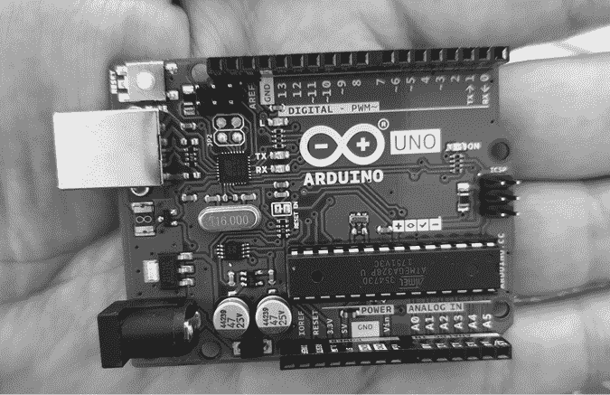

图 2-1：Arduino Uno 相当小。

尽管对于初学者来说，它看起来可能不太起眼，但 Arduino 系统允许你创造能够与周围世界互动的设备。借助几乎无限范围的输入和输出设备，如传感器、指示灯、显示器、电动机等，你可以编程实现所需的精确交互，创造一个功能齐全的设备。例如，艺术家创造了响应路人动作的闪烁灯光装置，高中生制作了能够检测火焰并熄灭它的自动化机器人，地理学家设计了监测温度和湿度的系统，并通过短信将数据传输回办公室。实际上，快速的互联网搜索将会出现几乎无限数量的基于 Arduino 的设备示例。

让我们更详细地探索一下我们的 Arduino Uno *硬件*（换句话说，"物理部分"），看看它有什么。不要太担心理解你在这里看到的内容，因为所有这些内容将在后续章节中详细讨论。

从开发板的左侧开始，你会看到两个连接器，如图 2-2 所示。

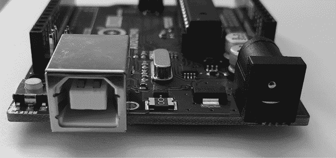

图 2-2：USB 和电源连接器

左侧是通用串行总线（USB）连接器。这个连接器将板子与电脑连接，原因有三：为板子提供电源，上传指令到 Arduino，以及向电脑发送和接收数据。右侧是电源连接器。通过这个连接器，你可以用标准的墙壁电源适配器为 Arduino 供电（当然是降压至 5 伏）。

在板子的中下部是板子的核心：微控制器，如图 2-3 所示。

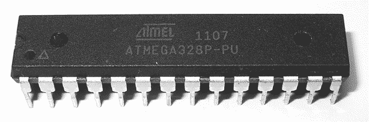

图 2-3：微控制器

*微控制器*是 Arduino 的“大脑”。它是一个微型计算机，包含执行指令的处理器，具有各种类型的内存来存储我们的程序中的数据和指令，并提供多种途径来发送和接收数据。微控制器下方是两组小插座，如图 2-4 所示。

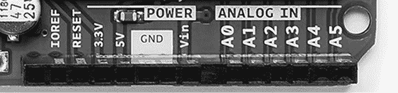

图 2-4：电源和模拟插座

左侧的那组提供了电源连接和使用外部 RESET 按钮的能力。右侧的那组提供了六个模拟输入，用于测量电压变化的电信号。此外，A4 和 A5 引脚也可用于与其他设备发送和接收数据。

板子顶部还有另外两组插座，如图 2-5 所示。

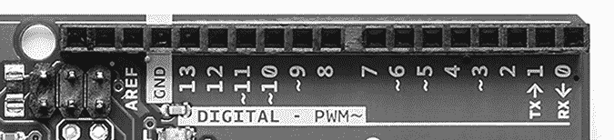

图 2-5：数字输入/输出引脚

编号为 0 到 13 的插座（或*引脚*）是数字输入/输出（I/O）引脚。它们可以检测电信号是否存在，或根据命令生成信号。0 号和 1 号引脚也被称为*串口*，用于与其他设备交换数据，例如通过 USB 连接电路与计算机连接。标有波浪号（~）的引脚也可以生成变化的电信号（在示波器上看起来像海浪—因此使用波浪号）。这对于创建灯光效果或控制电动机等用途非常有用。

Arduino 有一些非常有用的设备，叫做*发光二极管（LED）*；这些非常小的设备在电流通过时会发光。Arduino 板上有四个 LED 灯：一个位于最右边，标有 ON，用于指示板子是否有电，另外三个在另一组中，如图 2-6 所示。

标有*TX*和*RX*的 LED 分别在数据通过串口和 USB 在 Arduino 与附加设备之间传输或接收时亮起。*L* LED 供你自己使用（它连接到数字 I/O 引脚 13 号）。LED 左侧的小黑色方块是一个微型控制器，控制着 USB 接口，允许你的 Arduino 与计算机之间传输数据，但你通常无需关心它。

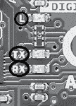

图 2-6：板载 LED

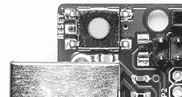

图 2-7：RESET 按钮

最后，RESET 按钮如图 2-7 所示。

与普通计算机一样，Arduino 有时也可能出现问题。当其他方法都失败时，你可能需要重置系统并重新启动 Arduino。板上的简单 RESET 按钮用于重启系统，解决这些问题。

Arduino 系统的一个巨大优势是其易于扩展——也就是说，添加更多硬件功能非常简单。Arduino 两侧的两排插座允许连接*扩展板*，这是一块带有引脚的电路板，可以将其插入到 Arduino 中。例如，图 2-8 中显示的扩展板包含一个以太网接口，使 Arduino 能够通过网络和互联网进行通信。

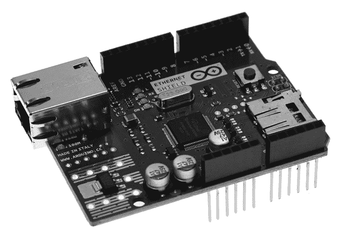

图 2-8：Arduino 以太网接口扩展板

请注意，以太网扩展板也有一排排插座。这些插座允许你在上面插入一个或多个扩展板。例如，图 2-9 显示了一个包含大型数字显示器、温度传感器、额外数据存储空间和大 LED 的扩展板。

如果你在设备中使用 Arduino 扩展板，你需要记住哪个扩展板使用哪个单独的输入和输出，以确保不会发生“冲突”。你还可以购买完全空白的扩展板，允许你添加自己的电路。有关详细内容将在第七章进一步说明。

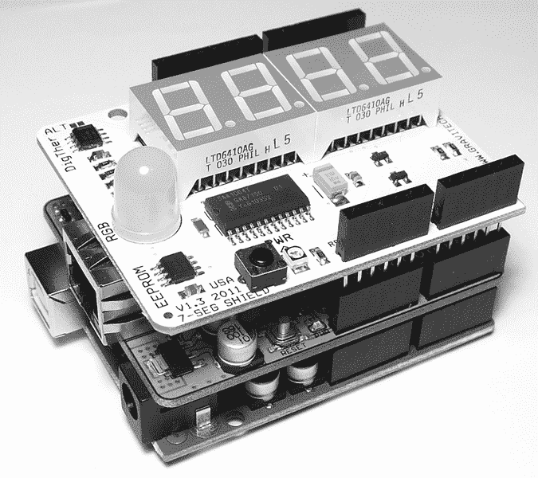

图 2-9：数字显示和温度扩展板

Arduino 硬件的伴侣是*软件*，一组指令告诉硬件该做什么以及如何做。

在第一章中，你已将 IDE 软件安装到个人计算机上，并将其配置为你的 Arduino 使用。现在，你将更仔细地查看 IDE，然后编写一个简单的程序——称为*草图*——来为 Arduino 编程。

## 浏览 IDE

如图 2-10 所示，Arduino IDE 类似于一个简单的文字处理器。IDE 分为三个主要区域：命令区、文本区和消息窗口区。

### 命令区

命令区，如图 2-10 所示，包含标题栏、菜单项和图标。标题栏显示草图的文件名（例如*Blink*），以及 IDE 的版本（例如*Arduino 2.0.0-beta.4*）。下面是一系列菜单项（文件、编辑、草图、工具和帮助）和图标，具体描述如下。

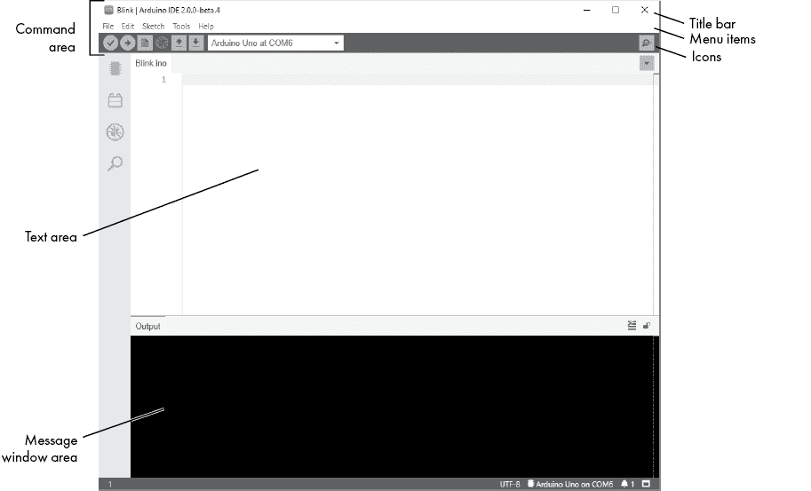

图 2-10：Arduino IDE

#### 菜单项

与任何文字处理器或文本编辑器一样，你可以点击某个菜单项来显示其各种选项：

1.  **文件** 包含保存、加载和打印草图的选项；一套完整的示例草图供打开使用；以及首选项子菜单

1.  **编辑** 包含任何文字处理器常见的复制、粘贴和搜索功能

1.  **草图** 包含在上传草图到板子之前验证草图的功能，以及一些草图文件夹和导入选项

1.  **工具** 包含各种功能以及选择 Arduino 板类型和 USB 端口的命令

1.  **帮助** 包含指向各种相关主题的链接以及 IDE 的版本信息

#### 图标

菜单工具栏下方是六个图标。将鼠标悬停在每个图标上可显示其名称。图标从左到右依次如下：

1.  **验证** 点击此处检查 Arduino 草图是否有效，并且没有任何编程错误。

1.  **上传** 点击此处验证并上传您的草图到 Arduino 板。

1.  **新建** 点击此处以在新窗口中打开一个新的空白草图。

1.  **调试** 用于更复杂的 Arduino 板进行实时调试。

1.  打开 点击此处打开一个已保存的草图。

1.  保存 点击此处保存打开的草图。如果草图没有名称，您将被提示创建一个名称。

1.  **串行监视器** 点击此处以打开一个新窗口，用于在 Arduino 和 IDE 之间发送和接收数据。

### 文本区域

文本区域显示在图 2-10 的中央。这是您将创建草图的地方。当前草图的名称显示在文本区域左上角的标签中。（默认名称为当前日期。）您将在这里输入草图内容，像在任何文本编辑器中一样。

### 输出窗口

输出窗口显示在图 2-10 的底部。来自 IDE 的消息出现在黑色区域。您看到的消息会有所不同，包括验证草图、状态更新等信息。

在输出窗口的右下角，您应该能够看到您的 Arduino 板类型及其连接的 USB 端口——此案例中为*Arduino/Genuino Uno，COM4*。

## 在 IDE 中创建您的第一个草图

Arduino 草图是一组指令，用来完成特定的任务；换句话说，草图就是一个*程序*。在本节中，您将创建并上传一个简单的草图，使 Arduino 的 LED（见图 2-11）反复闪烁，通过每秒开启一次然后关闭来实现。

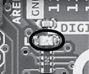

图 2-11：Arduino 板上的 LED 灯，位于大写字母*L*旁边

首先，用 USB 线将 Arduino 连接到计算机。然后打开 IDE 并从下拉菜单中选择您的板类型（Arduino Uno）和 USB 端口类型，如图 2-12 所示。这样可以确保 Arduino 板正确连接。

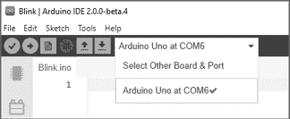

图 2-12：选择 Arduino Uno 板

### 注释

首先，输入一条注释，以提醒您的草图将用于什么目的。草图中的*注释*是为用户提供的备注。注释可以是给自己或他人的提示，也可以包含说明或任何其他细节。当为您的 Arduino 创建草图时，最好添加一些关于代码意图的注释；这些注释在以后查看草图时会非常有用。

要在单行上添加注释，请输入两个斜杠，然后是注释，如下所示：

```
// Blink LED sketch by Mary Smith, created 07/01/2021
```

两个斜杠告诉 IDE 在*验证*草图时忽略该行文本，验证是指检查是否一切编写正确，没有错误。

若要输入跨越两行或更多行的注释，请在注释前的行中输入字符`/*`，并在下一行的末尾使用字符`*/`结束注释，如下所示：

```
/*
Arduino Blink LED Sketch 
by Mary Smith, created 07/01/2021
*/
```

`/*` 和 `*/`告诉 IDE 忽略它们括起来的文本。

使用以下方法之一输入描述您 Arduino 草图的注释。然后通过选择**文件**▶**另存为**来保存草图。为您的草图输入一个简短的名称（例如*blinky*），然后点击**确定**。

Arduino 草图的默认文件扩展名是*.ino*，并且 IDE 应自动添加此扩展名。您草图的名称应该是*blinky.ino*，并且应该能够在您的草图本中看到它。

### setup()函数

创建任何草图的下一阶段是填写`void setup()`函数。该函数包含一组指令，供 Arduino 在每次重置或开机时仅执行一次。要创建`setup()`函数，请在注释后将以下几行添加到您的草图中：

```
**void setup()****{****}**
```

### 控制硬件

我们的程序将使 Arduino 上的用户 LED 闪烁。用户 LED 连接到 Arduino 的数字引脚 13。数字引脚可以检测电信号，也可以按命令生成电信号。在这个项目中，我们将生成一个电信号来点亮 LED。

将以下内容输入到您的草图中的大括号（`{` 和 `}`）之间：

```
**pinMode(13, OUTPUT); // set digital pin 13 to output**
```

清单中的数字`13`表示您正在操作的数字引脚。您将此引脚设置为`OUTPUT`，这意味着它将生成一个电信号。如果您希望它检测输入的电信号，则应将引脚的模式设置为`INPUT`。请注意，`pinMode()`行的末尾有一个分号（`;`）。在您的 Arduino 草图中的每一行指令后面都将有一个分号。

此时保存您的草图，以确保不会丢失任何工作。

### loop()函数

请记住，我们的目标是让 LED 反复闪烁。为此，我们将创建一个`loop()`函数，告诉 Arduino 重复执行一条指令，直到断电或有人按下 RESET 按钮。

在以下代码清单中，将加粗显示的代码输入到`void setup()`部分，以创建一个空的`loop()`函数。确保在此新部分的末尾添加另一个大括号（`}`），然后再次保存您的草图：

```
/*
Arduino Blink LED Sketch 
by Mary Smith, created 07/01/21
*/ 
void setup()
{ pinMode(13, OUTPUT); // set digital pin 13 to output
}**void loop()****{****// place your main loop code here:****}**
```

接下来，将实际的函数输入到`void loop()`中，供 Arduino 执行。

将以下内容输入到`loop()`函数的大括号之间。然后点击**验证**以确保您输入的内容正确：

```
**digitalWrite(13, HIGH); // turn on digital pin 13****delay(1000);            // pause for one second****digitalWrite(13, LOW);  // turn off digital pin 13****delay(1000);            // pause for one second**
```

我们来逐步分析。`digitalWrite()`函数控制从数字引脚输出的电压：在这种情况下，引脚 13 与 LED 连接。通过将此函数的第二个参数设置为`HIGH`，我们告诉引脚输出一个“高”数字电压；电流将从引脚流出，LED 将点亮。

`delay()`函数使草图在一段时间内不执行任何操作——在这种情况下，LED 被点亮，`delay(1000)`使其保持亮灯 1,000 毫秒，或 1 秒。

接下来，我们通过`digitalWrite(13, LOW);`关闭 LED 的电压。电流停止流过 LED，灯光熄灭。最后，我们再次暂停 1 秒钟，当 LED 关闭时，使用`delay(1000);`。

完整的草图应该是这样的：

```
/*
Arduino Blink LED Sketch 
by Mary Smith, created 07/01/21
*/ 
void setup()
{ pinMode(13, OUTPUT); // set digital pin 13 to output
} 
void loop()
{ digitalWrite(13, HIGH); // turn on digital pin 13 delay(1000);            // pause for one second digitalWrite(13, LOW);  // turn off digital pin 13 delay(1000);            // pause for one second
}
```

在继续之前，保存你的草图！

### 验证你的草图

当你验证你的草图时，你确保它已经正确编写，以便 Arduino 能理解。要验证你的完整草图，在 IDE 中点击**验证**并稍等片刻。草图验证完成后，输出窗口应该会显示一条注释，如图 2-13 所示。

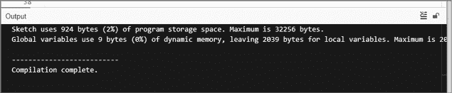

图 2-13：草图已被验证。

这个“编译完成”消息告诉你草图可以上传到你的 Arduino 上。它还显示了草图将使用的内存量（在这种情况下是 924 字节），以及 Arduino 上可用的总内存（32,256 字节）。

但是如果你的草图有问题呢？例如，你忘记在第二个`delay(1000)`函数的末尾加上分号。如果草图有问题，那么当你点击**验证**时，消息窗口应该显示类似于图 2-14 所示的验证错误信息。

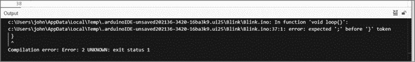

图 2-14：带有验证错误的消息窗口

IDE 会自动显示错误（例如`error: expected ';' before'}' token`描述的缺少分号）。它还会突出显示错误的位置，或者就在其之后的位置。这可以帮助你轻松找到并修正错误。

### 上传并运行你的草图

一旦你确认草图正确输入，保存它。然后确保你的 Arduino 板与计算机连接，并在 IDE 中点击**上传**。IDE 将再次验证你的草图，然后将其上传到 Arduino 板。在此过程中，你的板子上的 TX/RX LED（如图 2-6 所示）应该会闪烁，表示信息正在 Arduino 和计算机之间传输。

现在是决定性时刻：你的 Arduino 应该开始运行草图。如果你做对了，LED 应该每秒闪烁一次！

恭喜你。现在你已经掌握了如何输入、验证和上传 Arduino 草图的基本操作。

### 修改你的草图

在运行你的草图之后，你可能想要通过调整 LED 的开关延迟时间等方式改变它的操作方式。因为 IDE 很像一个文字处理器，你可以打开保存的草图，调整数值，然后再次保存草图并上传到 Arduino。例如，要提高闪烁的速度，可以更改两个`delay`函数，将 LED 的闪烁时间调整为四分之一秒，通过将延迟时间调整为`250`，像这样：

```
**delay(250); // pause for one-quarter of one second**
```

然后再次上传草图。LED 现在应该会更快地闪烁，每次闪烁持续四分之一秒。

## 展望未来

拥有了如何输入、编辑、保存和上传 Arduino 草图的新知识后，你已经准备好进入下一章节，在那里你将学习如何使用更多功能，实施良好的项目设计，构建基本的电子电路，以及做更多的事情。
