# 第三章：初步步骤

在本章中，您将

+   学习良好项目设计的概念

+   学习电的基本性质

+   介绍电阻器、发光二极管（LED）、晶体管、整流二极管和继电器

+   使用无焊面包板来构建电路

+   学习如何使用整数变量、`for`循环和数字输出来创建各种 LED 效果

现在您将开始让您的 Arduino 活起来。正如您将看到的，与仅仅是板子本身一起使用 Arduino 还有更多内容。您将学习如何计划项目，以使您的想法变为现实，然后进行电力的快速入门。电力是本书中我们所做的一切的驱动力，了解基础知识对于创造自己的项目至关重要。您还将查看将真实项目带到生活的组件。最后，您将研究一些作为 Arduino 草图构建块的新功能。

## 规划您的项目

在开始您的前几个项目时，您可能会有冲动在想出新主意后立即编写草图。但在开始写作之前，需要进行一些基本的准备工作。毕竟，您的 Arduino 板不是读心者；它需要精确的指令，即使这些指令可以由 Arduino 执行，如果您忽略了一个细节，结果可能不会是您预期的。

无论您是创建一个简单闪烁灯光的项目还是控制自动化模型铁路信号的项目，如果您有一个详细的计划，您将更加成功。在设计您的 Arduino 项目时，请遵循以下基本步骤：

1.  **定义您的目标。** 确定您想要实现的目标。

1.  **编写您的算法。** *算法*是一组说明，描述如何实现您的目标。您的算法将列出实现项目目标所需的步骤。

1.  **选择您的硬件。** 确定您的硬件将如何连接到 Arduino。

1.  **编写您的草图。** 创建告诉 Arduino 该做什么的初始程序。

1.  **连接它。** 将您的硬件连接到 Arduino 板。

1.  **测试和调试。** 它是否工作？在这个阶段，您将识别错误并找出其原因，无论是在草图、硬件还是算法中。

计划项目花费的时间越多，在测试和调试阶段就会越轻松。

## 关于电力

既然您很快将开始在 Arduino 项目中构建电子电路，让我们花点时间讨论一下电。简单来说，*电*是一种能量形式，我们可以利用它并将其转化为热能、光能、动能和电能。电具有三个主要属性，对我们在项目中构建过程中很重要：电流、电压和功率。

### 电流

电能的流动被称为*电流*。电流通过*电路*（电流的通道）从电源的正极流向电源的负极。例如，电池就是一个电源。这种流动叫做*直流电（DC）*。（在本书中，我们将不讨论*交流电*，或*AC*。）在一些电路中，负极被称为*接地（GND）*。电流的单位是*安培*或“安”(*A*)；1 安培等于每秒通过某一点的 6.2415 × 10¹⁸个电子。较小的电流用*毫安（mA）*来衡量，1,000 毫安等于 1 安培。

### 电压

*电压*是电路正负两端之间潜在能量差的衡量标准，单位为*伏特（V）*。如果你将电子流动比作水流，那么电压就相当于压力：电压越大，电流在电路中的流动速度越快。

### 功率

*功率*是衡量电气设备将能量从一种形式转换为另一种形式的速度。功率的单位是*瓦特（W）*。例如，100 W 的灯泡比 60 W 的灯泡亮，因为功率更高的灯泡将更多的电能转换为光能。

电压、电流和功率之间有一个简单的数学关系：

1.  功率（*W*）= 电压（*V*）× 电流（*A*）

## 电子组件

现在你对电的基础知识有了一些了解，我们来看看它是如何与各种电子组件和设备互动的。电子*组件*是控制电路中电流流动的各种部件。就像汽车引擎的各个部件共同工作以存储燃料、过滤燃料、泵送燃料和喷射燃料，帮助我们驾驶一样，电子组件协同工作来控制和利用电流的流动，帮助我们创造有用的设备。

在本书中，我会在我们使用的过程中解释一些专用组件。以下部分描述了一些基本的组件。

### 电阻器

各种组件，如 Arduino 的 LED，只需要少量电流就能工作——通常约为 10 mA。当 LED 接收到的电流超过其需求时，它会将多余的电流转化为热量——过多的热量可能会损坏 LED。为了减少流向 LED 等组件的电流，我们可以在电压源和组件之间添加一个*电阻器*。电流可以在普通铜线中自由流动，但当它遇到电阻器时，流动会被减慢。部分电流会转化为少量的热量，转化的热量与电阻器的数值成正比。图 3-1 显示了一些常用的电阻器。

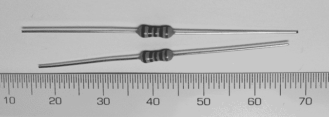

图 3-1：典型电阻器

#### 电阻

电阻的大小可以是固定的，也可以是可变的。电阻的单位是*欧姆*（Ω），其范围从零到数千欧姆（*千欧姆*，或 kΩ），甚至到数百万欧姆（*兆欧姆*，或 MΩ）。

#### 读取电阻值

尽管你可以用万用表测试电阻值，也可以直接从物理电阻中读取电阻值。我们将使用的电阻器物理尺寸非常小，因此通常无法在电阻器上打印其电阻值。常见的表示组件电阻的方法是使用一系列从左到右阅读的彩色编码带，如下所示：

1.  **第一个电阻带** 代表电阻的第一位数字

1.  **第二个电阻带** 代表电阻的第二位数字

1.  **第三个电阻带** 代表倍数（对于四带电阻）或第三个数字（对于五带电阻）

1.  **第四个电阻带** 代表倍数（对于五带电阻）或*公差*，即元件电阻的精度（对于四带电阻）

1.  **第五个电阻带** 显示五带电阻的公差

表 3-1 列出了电阻的颜色及其对应的值。

由于电阻器的制造精度问题，选择一个误差范围作为购买电阻时的百分比。对于五带电阻，位于第五位置的棕色带表示 1%的公差，金色表示 5%，银色表示 10%的公差。

图 3-2 展示了一个电阻示意图。黄色、紫色和橙色的电阻带分别表示 4、7 和 3，具体内容列于表 3-1。第三个电阻带表示倍数；在这个例子中，47 被乘以 10 的 3 次方，得出 47,000 Ω的值，通常读作 47 kΩ。棕色电阻带表示一个非常精确的电阻，其公差应在 1%以内。

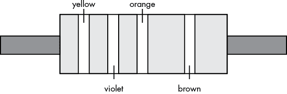

图 3-2：电阻示意图

表 3-1：电阻上的带标值，单位为欧姆

| **颜色** | **欧姆值** |
| --- | --- |
| 黑色 | 0 |
| 棕色 | 1 |
| 红色 | 2 |
| 橙色 | 3 |
| 黄色 | 4 |
| 绿色 | 5 |
| 蓝色 | 6 |
| 紫色 | 7 |
| 灰色 | 8 |
| 白色 | 9 |

#### 芯片电阻

表面贴装芯片电阻显示一个打印的数字和字母代码，如图 3-3 所示，而不是彩色条纹。前两位数字表示一个单独的数字，第三位数字表示跟随该数字后的零的个数。例如，图 3-3 中的电阻值为 10,000 Ω，或 10 kΩ。

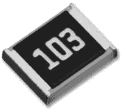

图 3-3：表面贴装电阻

#### 功率额定值

电阻的*功率额定值*是它在过热或损坏之前能够承受的功率，以瓦特为单位。图 3-1 中所示的电阻是 1/4W 电阻，这是 Arduino 系统中最常用的电阻。在本书的项目中，你只需要 1/4W 的电阻。

选择电阻时，考虑功率、电流和电压之间的关系。设计中的电流和/或电压越大，电阻的功率额定值应越大。

通常，电阻器的功率额定值越大，其物理尺寸也越大。例如，图 3-5 所示的电阻器是一个 5W 电阻器，其主体长度为 22 毫米，宽度为 10 毫米。

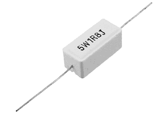

图 3-5：一个 5W 电阻器

### 发光二极管

LED 是一种非常常见、用途广泛的组件，可以将电流转化为光。LED 有各种形状、尺寸和颜色。图 3-6 显示了一个常见的 LED。

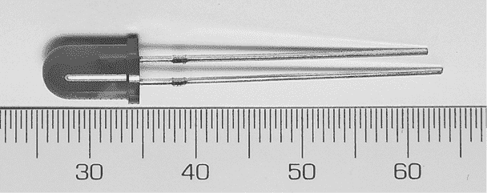

图 3-6：一个红色 LED，直径 5 毫米

在电路中连接 LED 时需要小心，因为它们是*有极性的*；这意味着电流只能在一个方向上进入和离开 LED。电流通过*阳极*（正）端进入，通过*阴极*（负）端离开，如 图 3-7 所示。任何试图让电流反向流过 LED 的做法都会损坏该元件。

幸运的是，LED 的设计使得你可以分辨其端点。阳极端的引脚较长（你可以将“正”端想象成“加长”了），而 LED 底部的边缘在阴极端是平的，如 图 3-8 所示。

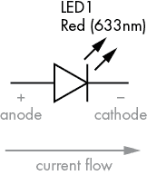

图 3-7：LED 中的电流流动

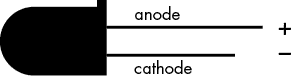

图 3-8：LED 设计指示阳极（较长引脚）和阴极（平边缘）端

在项目中添加 LED 时，需要考虑其工作电压和电流。例如，常见的红色 LED 需要大约 1.7 V 的电压和 5 到 20 毫安的电流。这对我们来说有点问题，因为 Arduino 输出的是 5 V 的固定电压和一个更高的电流。幸运的是，我们可以使用限流电阻来减少流入 LED 的电流。但我们该选择哪个数值的电阻器呢？这就需要用到欧姆定律。

要计算 LED 所需的限流电阻，请使用以下公式：

*R* = (*V*[s] − *V*[f]) ÷ *I*

其中 *V*[s] 是电源电压（Arduino 输出 5 V），*V*[f] 是 LED 的正向电压降（假设为 1.7 V），*I* 是 LED 所需的电流（10 毫安）。（*I* 的单位必须是安培，所以 10 毫安转换为 0.01 A。）

现在，让我们将这个公式应用到我们的 LED 上，使用 *V*[s] = 5 V，*V*[f] = 1.7 V 和 *I* = 0.01 A。将这些数值代入公式中，得出 *R* 的值为 330 Ω。然而，当电流低于 10 毫安时，LED 也能正常发光。为了保护敏感的电子元件，最好尽量使用较小的电流，因此我们将使用 560 Ω、1/4W 的电阻器与我们的 LED 配合使用，这样可以使电流流过约 6 毫安。

### 无焊面包板

我们不断变化的电路需要一个基础——一个将它们连接在一起并构建其上的平台。一个很好的工具就是*无焊接面包板*。面包板是一个带有电气连接插座的塑料基座（只是不可以用它切面包）。它们有多种尺寸、形状和颜色，如图 3-10 所示。

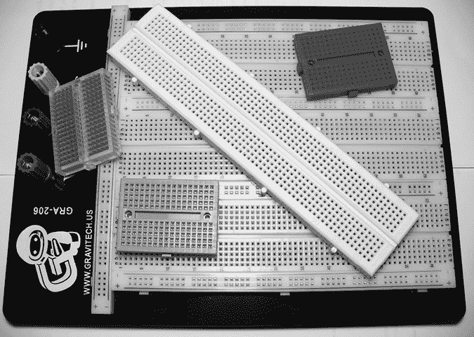

图 3-10：各种形状和尺寸的面包板

使用面包板的关键是了解插座的连接方式——是按短列连接，还是按沿边缘或中央的长行连接。连接方式因面包板而异。例如，在图 3-11 顶部所示的面包板中，五个孔的列是垂直连接的，但水平方向上是隔离的。如果你将两根导线插入同一垂直行，它们就会被电气连接。同理，位于水平线之间的中央长行也是水平连接的。你经常需要将电路连接到电源电压和地线，这些长的水平孔线非常适合这个目的。

当你在构建更复杂的电路时，面包板会变得拥挤，你并不总能将组件放置在你想要的地方。然而，使用短连接线很容易解决这个问题。销售面包板的零售商通常也会销售各种长度的小盒子电线，例如在图 3-12 中所示的那种。

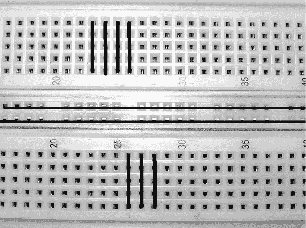

图 3-11：面包板内部连接

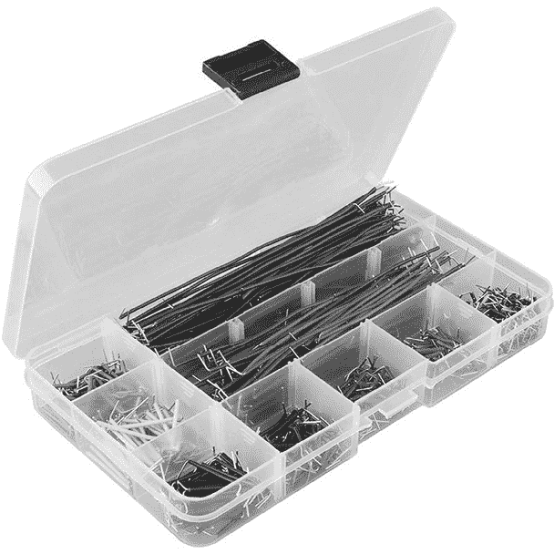

图 3-12：各种面包板连接线

## 项目 #1：创建一个闪烁的 LED 波动

让我们来用一些 LED 和电阻器。在这个项目中，我们将使用五个 LED 来模拟电视节目《骑士杀手》中的著名车辆 KITT 的前端，创建一种波动的光模式。

### 算法

这是我们这个项目的算法：

1.  打开 LED 1。

1.  等待半秒钟。

1.  关闭 LED 1。

1.  打开 LED 2。

1.  等待半秒钟。

1.  关闭 LED 2。

1.  继续，直到 LED 5 被打开，此时过程会从 LED 5 反向到 LED 1。

1.  无限重复。

### 硬件

这是你创建这个项目所需的材料：

+   五个 LED

+   五个 560 Ω 电阻器

+   一块面包板

+   各种连接线

+   Arduino 和 USB 电缆

我们将通过 560 Ω 限流电阻器，将 LED 连接到数字引脚 2 到 6。

### 原理图

现在让我们来构建电路。电路布局可以通过几种方式描述。在本书的前几个项目中，我们将使用类似于图 3-13 所示的物理布局图。

通过将接线图与草图中的功能进行对比，你可以开始理解电路。例如，当我们使用`digitalWrite(2, HIGH)`时，5V 的高电压从数字引脚 2 流出，通过限流电阻，再通过 LED 的阳极和阴极，最终回到 Arduino 的 GND 插槽，完成电路。然后，当我们使用`digitalWrite(2, LOW)`时，电流停止，LED 熄灭。

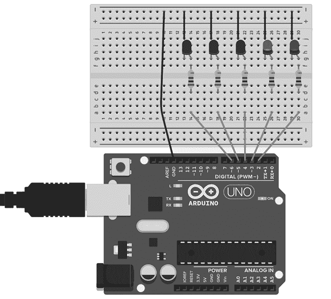

图 3-13：Project 1 的电路布局

### 草图

现在是草图的部分。将以下代码输入到 IDE 中：

```
// Project 1 - Creating a Blinking LED Wave1 void setup()
{ pinMode(2, OUTPUT);	// LED 1 control pin is set up as an output pinMode(3, OUTPUT);	// same for LED 2 to LED 5 pinMode(4, OUTPUT); pinMode(5, OUTPUT); pinMode(6, OUTPUT);
} 2 void loop()
{ digitalWrite(2, HIGH); // Turn LED 1 on delay(500); // wait half a second digitalWrite(2, LOW);  // Turn LED 1 off digitalWrite(3, HIGH); // and repeat for LED 2 to 5 delay(500); digitalWrite(3, LOW); digitalWrite(4, HIGH); delay(500); digitalWrite(4, LOW); digitalWrite(5, HIGH); delay(500); digitalWrite(5, LOW); digitalWrite(6, HIGH); delay(500); digitalWrite(6, LOW); digitalWrite(5, HIGH); delay(500); digitalWrite(5, LOW);    digitalWrite(4, HIGH); delay(500); digitalWrite(4, LOW); digitalWrite(3, HIGH); delay(500); digitalWrite(3, LOW);
// The loop() will now loop around and start from the top again
}
```

在`void setup()`中的第 1 行，数字 I/O 引脚被设置为输出，因为我们希望它们根据需求向 LED 发送电流。我们通过在草图的`void loop()`部分的第 2 行使用`digitalWrite()`函数来指定何时开启每个 LED。

### 运行草图

现在连接你的 Arduino 并上传草图。过一两秒后，LED 应该会从左到右闪烁，然后再返回。成功是件美妙的事——拥抱它吧！

如果什么都没有发生，那么立即拔掉 Arduino 的 USB 电缆，检查你是否正确输入了草图。如果发现错误，修正它并重新上传草图。如果草图完全匹配且 LED 仍然不闪烁，检查面包板上的接线。

你现在已经知道如何用 Arduino 使 LED 闪烁，但这个草图有些低效。例如，如果你想修改它让 LED 闪烁得更快，你就需要更改每个`delay(500)`。有一种更好的方法。

## 使用变量

在计算机程序中，我们可以使用*变量*来存储数据。Project 1 的草图存在一个问题，因为它没有使用变量，所以不够灵活。例如，我们使用`delay(500)`函数来保持 LED 亮着。如果我们想更改延迟时间，就必须手动更改每个条目。为了解决这个问题，我们将创建一个变量来表示`delay()`函数的值。

将以下行输入到 Project 1 的草图中，位于`void setup()`函数之前，并紧跟在初始注释之后：

```
**int d = 250;**
```

这将数字`250`赋给一个名为`d`的变量。`int`表示该变量包含一个整数——一个介于-32,768 到 32,767 之间的整数。简单来说，任何整数值都没有小数部分。

接下来，将草图中的每个`500`更改为`d`。现在，当草图运行时，Arduino 将使用`d`中的值来执行`delay()`函数。上传修改后的草图后，LED 将以更快的速度闪烁，因为延迟值变得更小。

现在，如果你想更改延迟，只需更改草图开始处的变量声明。例如，输入`100`作为延迟值将使得 LED 闪烁得更快：

```
**int d = 100;**
```

尝试修改草图，或许可以改变延时和 `HIGH`、`LOW` 的顺序。可以尽情尝试一下。不过，暂时别拆解电路；我们将在本章的更多项目中继续使用它。

## 项目 #2：使用 `for` 循环进行重复

在设计草图时，常常需要重复同一个函数。你可以简单地复制粘贴函数来重复它，但这样效率低下，浪费了 Arduino 的程序内存。相反，你可以使用 `for` 循环。使用 `for` 循环的好处是你可以决定循环内部代码的重复次数。

要查看 `for` 循环的工作方式，请输入以下代码作为新的草图：

```
// Project 2 - Repeating with for Loops
int d = 100; 
void setup()
{ pinMode(2, OUTPUT); pinMode(3, OUTPUT); pinMode(4, OUTPUT); pinMode(5, OUTPUT); pinMode(6, OUTPUT);
} 
void loop()
{ for ( int a = 2; a < 7 ; a++ ) { digitalWrite(a, HIGH); delay(d); digitalWrite(a, LOW); delay(d); }
}
```

`for` 循环将在大括号内的代码只要某个条件为真时就会重复执行。在这里，我们使用了一个新的整数变量 `a`，其初始值为 `2`。每次执行代码时，`a++` 会将 `a` 的值增加 1。只要 `a` 的值小于 7（*条件*），循环就会继续。当 `a` 的值等于或大于 7 时，Arduino 会继续执行 `for` 循环之后的代码。

`for` 循环执行的循环次数也可以通过从较大的数字倒数到较小的数字来设置。为演示这一点，请在第一个 `for` 循环之后，向项目 2 的草图中添加以下循环：

```
1 for ( int a = 5 ; a > 1 ; a-- )
{ digitalWrite(a, HIGH); delay(d); digitalWrite(a, LOW); delay(d);
}
```

在这里，`for` 循环在 1 时将 `a` 的值设置为 5，并在每次循环后通过 `a--` 将其减 1。只要 `a` 的值大于 1（`a > 1`），循环就会继续，直到 `a` 的值降到 1 或小于 1 为止。

我们现在用更少的代码重新创建了项目 1。上传草图并亲自体验一下吧！

## 使用脉宽调制（PWM）调整 LED 亮度

与其仅使用 `digitalWrite()` 快速地打开和关闭 LED，我们可以通过调整每个 LED 开关状态之间的时间来定义 LED 的亮度级别，方法是使用 *脉宽调制（PWM）*。PWM 可以通过快速开关 LED（每秒约 500 次）来创造 LED 在不同亮度级别的假象。我们感知到的亮度取决于数字输出引脚开启的时间与关闭的时间——即 LED 点亮或熄灭的时间。由于我们的眼睛无法看到每秒 50 次以上的闪烁，LED 看起来就像是常亮的。

*占空比* 越大（即每个周期内引脚保持开启的时间越长），连接到数字输出引脚的 LED 显得越亮。

图 3-14 显示了不同的 PWM 占空比。填充的灰色区域表示灯亮的时间。从图中可以看到，灯亮的时间随着占空比的增大而增加。

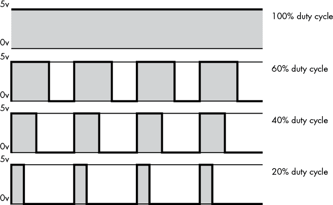

图 3-14：不同的 PWM 占空比

只有常规 Arduino 板上的数字引脚 3、5、6、9、10 和 11 可以用于 PWM。它们在 Arduino 板上标有波浪线（~），如图 3-15 所示。

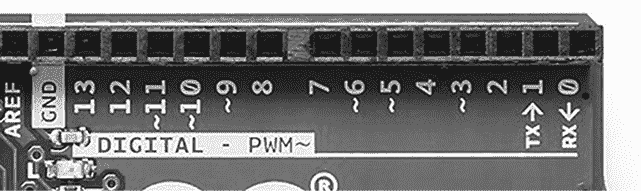

图 3-15：PWM 引脚标有波浪线（~）。

要创建一个 PWM 信号，我们使用函数 `analogWrite(``x``,` `y``)`，其中 `x` 是数字引脚，`y` 是占空比的值。`y` 可以是 0 到 255 之间的任何值，其中 0 表示 0% 的占空比，255 表示 100% 的占空比。

## 项目 #3：演示 PWM

现在让我们在项目 2 的电路基础上尝试一下。将以下草图输入 IDE，并上传到 Arduino：

```
// Project 3 - Demonstrating PWM
int d = 5;
void setup(){ pinMode(3, OUTPUT); // LED control pin is 3, a PWM-capable pin
} 
void loop()
{ for ( int a = 0 ; a < 256 ; a++ ) { analogWrite(3, a); delay(d); } for ( int a = 255 ; a >= 0 ; a-- ) { analogWrite(3, a); delay(d); } delay(200);
}
```

数字引脚 3 上的 LED 将展示“呼吸效果”，即占空比增加和减少时，LED 的亮度逐渐增大，直到完全亮起，然后反向直到变暗。换句话说，LED 会亮起，亮度逐渐增强，直到完全亮起，然后再反向直到熄灭。你可以在草图和电路中进行实验。例如，可以让所有五个 LED 同时呼吸，或者让它们依次进行呼吸效果。

## 更多电气组件

你通常会发现，计划让数字输出完成某项工作时，未考虑到控制所需的电流大小。创建项目时，请记住，Arduino Uno 上的每个数字输出引脚最多可以提供 40 mA 的电流，所有引脚的总电流最大为 200 mA。然而，接下来讨论的三种电子硬件组件可以帮助你提高 Arduino 的电流处理能力。

### 晶体管

几乎每个人都听说过*晶体管*，但大多数人并不真正理解它是如何工作的。为了简洁起见，我将尽量简单地解释。晶体管可以打开或关闭比 Arduino Uno 能处理的电流更大的电流流动。然而，我们可以使用 Arduino 数字输出引脚安全地控制晶体管。一个常用的晶体管是 BC548，如图 3-16 所示。

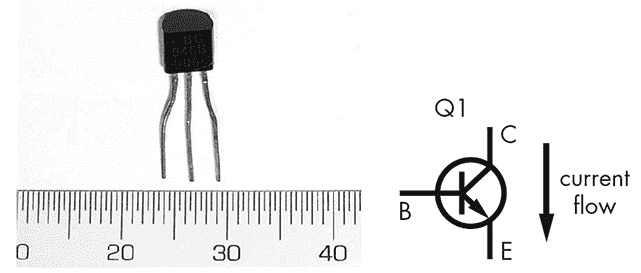

图 3-16：典型的晶体管：BC548

与 LED 类似，晶体管的引脚也有独特的功能，并需要按照正确的方向连接。将晶体管的平面部分朝向你（如图 3-16 左侧所示），BC548 的引脚从左到右分别称为*集电极*（C）、*基极*（B）和*发射极*（E）。(注意，这种引脚顺序或*引脚排列*是针对 BC548 晶体管的；其他晶体管的排列方式可能不同。) 当在基极施加小电流时，例如来自 Arduino 数字 I/O 引脚，小电流会使我们希望开关的大电流通过集电极进入。在集电极流入后，电流与来自基极的小电流合并，然后通过发射极流出。当基极的控制电流被关闭时，晶体管中就不会有电流流动。

BC548 可在最大 30 V 的电压下切换最多 100 mA 的电流——远高于 Arduino 的数字输出。在本书后续的项目中，你将更详细地了解晶体管。

### 整流二极管

*二极管* 是一种非常简单但又非常有用的元件，它只允许电流单向流动。它看起来和电阻器很相似，如图 3-17 所示。


图 3-17：1N4004 型整流二极管

本书中的项目将使用 1N4004 型整流二极管。电流通过二极管的阳极进入，通过阴极流出，阴极处有一个环形标记在二极管的主体上。这些二极管可以保护电路的部分免受反向电流的影响，但也有代价：二极管会导致大约 0.7 V 的电压下降。1N4004 二极管的额定值为 1 A 和 400 V，远高于我们实际使用的电流和电压。它是一种耐用、常见且低成本的二极管。

### 继电器

*继电器* 与晶体管使用的原因相同——用于控制大电流和大电压。继电器的优点是它与控制电路*电气隔离*，使得 Arduino 可以切换非常大的电流和电压，而无需直接接触这些电压，从而避免损坏 Arduino。继电器内部有一对有趣的组件：机械开关触点和一个低电压线圈，如图 3-18 所示。

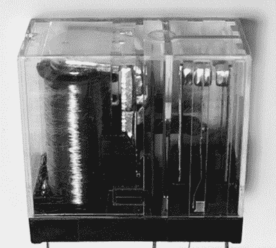

图 3-18：典型继电器内部结构

当电流作用于继电器时，线圈变成了电磁铁，吸引一根金属条，金属条的作用就像开关的拨动器。当电流接通时，磁铁会将金属条拉向一个方向，而当电流断开时，它会让金属条落回去，从而根据电流的接通或断开控制开关的开关状态。这一运动会发出独特的“咔哒”声，你可能从老式汽车的转向信号灯中听到过这个声音。

## 高电压电路

现在你已经了解了一些关于晶体管、整流二极管和继电器的知识，让我们将它们结合起来控制更高的电流和电压。例如，你可能希望打开或关闭一个大功率电动机。连接这些组件非常简单，如图 3-19 所示。

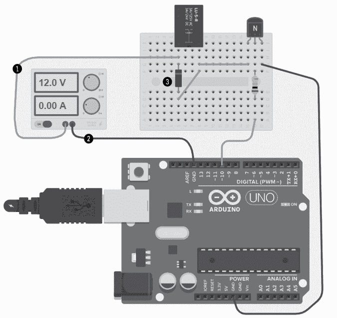

图 3-19：继电器控制电路

这个简单的示例电路控制一个 12V 线圈的继电器。这个电路的一种用途可能是控制连接到继电器切换触点的灯泡或冷却风扇。Arduino 的数字引脚 10 通过一个 1 kΩ的电阻连接到晶体管的基极。晶体管通过开关继电器线圈来控制电流的通断。当你观察晶体管的平面时，记住引脚顺序是*C*、*B*，然后是*E*。面包板左侧位置 1 上的物体代表继电器线圈的 12V 电源。位置 2 的 12V 电源的负极或地线、晶体管的发射极引脚和 Arduino 的 GND 都连接在一起。最后，一个 1N4004 整流二极管连接在继电器线圈的 3 号位置，阴极接在正电源侧。你可以查阅继电器的数据表来确定接触点的引脚，并将受控设备正确连接。

二极管的作用是保护电路。当继电器线圈从开到关时，线圈中会短暂地残留一些游离电流，这些电流会形成一个高压尖峰，需要释放。二极管允许这些游离电流通过线圈回路，直到它以微量热量的形式被耗散掉。它可以防止关闭尖峰损坏晶体管或 Arduino 引脚。

## 展望未来

现在第三章接近尾声。希望你在尝试示例和实验 LED 效果时玩得开心。在本章中，你通过多种方式创建了 Arduino 上的闪烁 LED，做了一些黑客实验，并学习了如何使用函数和循环来高效地控制连接到 Arduino 的组件。学习了这一章，为接下来的章节打下了更成功的基础。

第四章将会非常有趣。你将创建一些更先进的项目，包括交通信号灯、温度计、电池测试器等——所以当你准备好迎接更高挑战时，翻到下一页吧！
