# 第四章：构建模块

在本章中，你将

+   学习如何阅读原理图，这是电子电路的“语言”

+   了解电容器

+   使用输入引脚

+   使用算术和测试值

+   使用`if`语句做决策

+   学习模拟与数字的区别

+   在不同的精度水平下测量模拟电压源

+   了解可变电阻器、压电蜂鸣器和温度传感器

+   通过制作交通灯、电池测试仪和温度计来巩固你的知识

本章的内容将帮助你理解 Arduino 的潜力。我们将继续学习电子学，包括如何阅读原理图（电子电路的“路线图”）。我们还将探索一些新的元件和我们可以测量的信号类型。然后我们将讨论更多 Arduino 功能，如存储值、执行数学运算和做决策。最后，我们将审视一些其他元件，并在一些有用的项目中加以使用。

## 使用原理图

第三章描述了如何使用物理布局图来构建电路，这些布局图代表了面包板及其上安装的元件。虽然这种物理布局图看起来是绘制电路的最简单方式，但你会发现，随着更多元件的加入，直接表示的图纸会变得非常混乱。因为我们的电路将变得更加复杂，所以我们将开始使用*原理图*（也称为*电路图*）来说明它们，如图 4-1 所示。

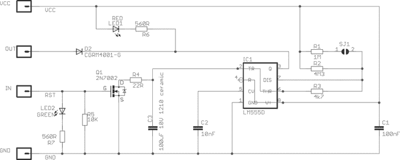

图 4-1：原理图示例

原理图只是电路的路线图，显示了电流在各个元件中流动的路径。与显示元件和电线不同，原理图使用符号和线条来表示。

### 识别元件

一旦你知道这些符号的含义，读取原理图就变得容易了。首先，让我们来看看我们已经使用过的元件符号。

#### Arduino

图 4-2 展示了 Arduino 本身的符号。如你所见，所有 Arduino 的连接都被显示并清晰标记。

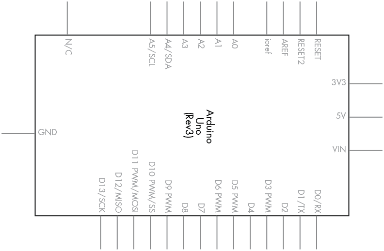

图 4-2：Arduino Uno 符号

#### 电阻器

电阻器符号如图 4-3 所示。

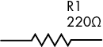

图 4-3：电阻器符号

在电阻符号旁边显示电阻值和元件标识符（例如此处的 220 Ω和 R1）是一个很好的做法。这使得每个人在理解原理图时都更加轻松（包括你自己）。你常常会看到电阻值以*R*表示——例如 220 R。

#### 整流二极管

整流二极管符号如图 4-4 所示。

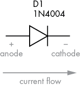

图 4-4：整流二极管符号

回顾第三章，整流二极管是有极性的，电流从阳极流向阴极。在图 4-4 所示的符号中，阳极位于左侧，阴极位于右侧。记住这一点的一个简单方法是想象电流只会流向三角形的尖端。电流不能反向流动，因为垂直条形“阻止”它。

#### LED

LED 符号如图 4-5 所示。

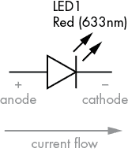

图 4-5：LED 符号

二极管家族的所有成员都有一个共同的符号：三角形和垂直线。然而，LED 符号显示两个平行箭头指向三角形的外侧，表示光正在发出。

#### 晶体管

晶体管符号如图 4-6 所示。我们将用这个符号表示我们的 BC548。

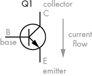

图 4-6：晶体管符号

符号顶部的垂直线（标记为*C*）表示集电极，左侧的水平线表示基极（标记为*B*），底部的线表示发射极（标记为*E*）。符号内的箭头指向下方和右侧，告诉我们这是一个*NPN*型晶体管，因为 NPN 晶体管允许电流从集电极流向发射极。（*PNP*型晶体管允许电流从发射极流向集电极。）

在编号晶体管时，我们使用字母*Q*，就像我们用*R*来编号电阻器一样。

#### 继电器

继电器符号如图 4-7 所示。

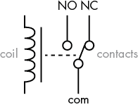

图 4-7：继电器符号

继电器符号可以有多种变体，且可能有多组触点，但所有继电器符号都有一些共同的元素。第一个是*线圈*，即左侧的弯曲垂直线。第二个元素是继电器*触点*。*COM*（公共端）触点通常用作输入，而标记为*NO*（常开）和*NC*（常闭）的触点通常用作输出。

继电器符号总是显示在继电器处于断开状态，且线圈未*通电*的情况下——也就是说，COM 和 NC 引脚连接在一起。当继电器线圈通电时，符号中 COM 和 NO 引脚将连接。

### 原理图中的电线

当电线在原理图中交叉或连接时，它们会按照特定的方式绘制，如下例所示。

#### 交叉但未连接的电线

当两根电线交叉但未连接时，交叉可以通过两种方式表示，如图 4-8 所示。没有一种正确的方法，这取决于个人偏好。


图 4-8：未连接的交叉电线

#### 连接的电线

当电线要物理连接时，会在连接点绘制*连接点*，如图 4-9 所示。

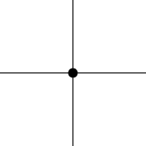

图 4-9：连接的两根电线

#### 连接到地的电线

当一根线连接回地线（GND）时，标准方法是使用图 4-10 所示的符号。

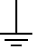

图 4-10：GND 符号

本书中原理图中线路末端的 GND 符号告诉你，这根线与 Arduino 的 GND 引脚物理连接。

### 解读原理图

现在你已经了解了各种元件及其连接的符号，接下来让我们分析我们将在第三章第 33 页为项目 1 绘制的原理图。回想一下，你让五个 LED 前后闪烁。

比较图 4-11 所示的原理图与第三章第 34 页的图 3-13，你会发现使用原理图是一种更简便的方式来描述电路。

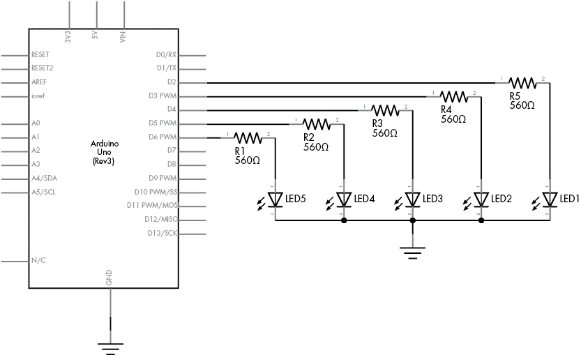

图 4-11：项目 1 的原理图

从现在开始，我们将使用原理图来描述电路，并且在引入新元件时，我会向你展示它们的符号。

## 电容器

*电容器*是一种存储电荷的设备。它由两块导电板夹着一个绝缘层组成，允许电荷在两板之间积聚。当电流被切断时，电荷保持在电容器内，并可以在电容器中储存的电压遇到电流的新路径时（称为*放电*）流出。

### 测量电容器的容量

电容器能存储的电荷量以*法拉*（farad）为单位，一法拉实际上是一个非常大的数值。因此，通常电容器的容量以皮法（pF）或微法（μF）为单位进行标注。一*皮法*（pF）是法拉的 0.000000000001 倍，而一*微法*（μF）是法拉的 0.000001 倍。电容器也有额定的最大电压值。在本书中，我们只会使用低电压，因此我们不会使用额定电压超过 10 V 的电容器；然而，通常可以在低电压电路中使用高电压电容器。常见的电压额定值为 10、16、25 和 50 V。

### 阅读电容器数值

阅读陶瓷电容器的数值需要一些练习，因为其数值是以某种代码方式打印的。前两位数字代表皮法拉（pF）的数值，第三位数字是以十为倍数的乘数。例如，图 4-12 所示的电容器标注为*104*。这相当于 10 后面跟着四个零，即 100,000 pF（即 100 纳法（nF）或 0.1 微法（μF））。

### 电容器类型

我们的项目将使用两种类型的电容器：陶瓷电容器和电解电容器。

#### 陶瓷电容器

*陶瓷电容器*，例如图 4-12 所示的电容器，非常小，因此储存的电荷量也很小。它们是非极性的，可以用于电流双向流动。非极性电容器的原理图符号如图 4-13 所示。

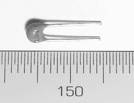

图 4-12：一个 0.1 µF 陶瓷电容器

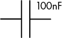

图 4-13：非极性电容器电路符号，电容器的数值显示在右上角

陶瓷电容器在高频电路中表现优异，因为它们可以由于较小的电容而非常快速地充放电。

#### 电解电容器

*电解电容器*，如图 4-14 所示，物理尺寸大于陶瓷类型，提供更大的电容，并且是极性的。外壳上的标记显示了正（+）极或负（–）极。在图 4-14 中，你可以看到条纹和标识负极的小负号（–）符号。像电阻一样，电容器的数值也有一定的公差。图 4-14 中的电容器公差为 20%，电容值为 100 μF。

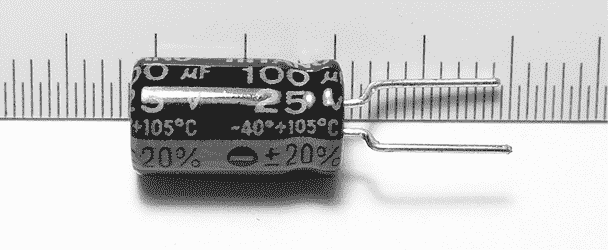

图 4-14：电解电容器

电解电容器的电路符号，如图 4-15 所示，包含+符号以表示电容器的极性。

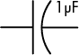

图 4-15：极性电容器电路符号

电解电容器常用于存储较大的电荷并平滑电源电压。像一个小型的临时电池，它们可以平滑电源并提供在快速从电源抽取大电流的电路或部件附近的稳定性。这可以防止电路中出现不必要的掉电和噪声。幸运的是，电解电容器的数值清晰地印刷在外面，不需要解码或解释。

你已经有了一些使用 LED 生成基本输出的经验。现在是时候学习如何通过数字输入将外部世界的信息传入 Arduino，并根据这些输入做出决策。

## 数字输入

在第三章中，我们使用数字 I/O 引脚作为输出，控制 LED 的开关。我们可以使用这些相同的引脚接受用户的输入——只要我们将信息限制为两种状态，高电平和低电平。

数字输入的最简单形式是*按钮*；图 4-16 中展示了几个按钮。你可以将其中一个按钮直接插入无焊面包板并将其连接到 Arduino 引脚。当按钮被按下时，电流通过开关流入数字输入引脚，后者检测到电压的存在。

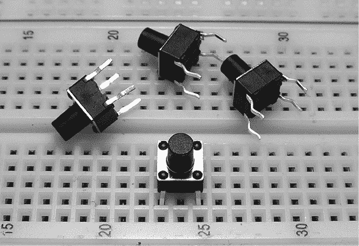

图 4-16：面包板上的基本按钮

注意，图底部的按钮已插入面包板，桥接了第 23 行和第 25 行。当按钮被按下时，它将连接这两行。该按钮的电路符号如图 4-17 所示。符号代表按钮的两侧，两侧的编号以*S*为前缀。当按钮被按下时，线路桥接两部分，允许电压或电流通过。

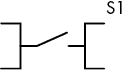

图 4-17：按钮电路符号

## 项目 #4：演示数字输入

我们在这个项目中的目标是创建一个按钮，当按下时，点亮 LED 半秒钟。

### 算法

这是我们的算法：

1.  测试按钮是否被按下。

1.  如果按钮已被按下，点亮 LED 半秒钟，然后将其关闭。

1.  如果按钮未被按下，则不执行任何操作。

1.  无限重复。

### 硬件部分

以下是你需要的物品来创建这个项目：

+   一个按钮开关

+   一个 LED

+   一个 560 Ω 电阻

+   一个 10 kΩ 电阻

+   一个 100 nF 电容器

+   各种连接线

+   一个面包板

+   Arduino 和 USB 电缆

### 电路图

首先，我们根据 图 4-19 中的电路图在面包板上搭建电路。注意，10 kΩ 电阻连接在 GND 和数字引脚 7 之间。我们称之为 *下拉电阻*，因为它将数字引脚的电压几乎拉到零。此外，通过在 10 kΩ 电阻两端添加 100 nF 电容器，我们创建了一个简单的 *去抖动* 电路，帮助滤除开关抖动。当按钮按下时，数字引脚立即变为高电平。但是当按钮松开时，数字引脚 7 通过 10 kΩ 电阻被拉到 GND，并且 100 nF 电容器产生了一个小的延迟。这有效地覆盖了抖动脉冲，减缓了电压下降到 GND 的速度，从而消除了大部分由于浮动电压和按钮不稳定行为引起的错误读取。

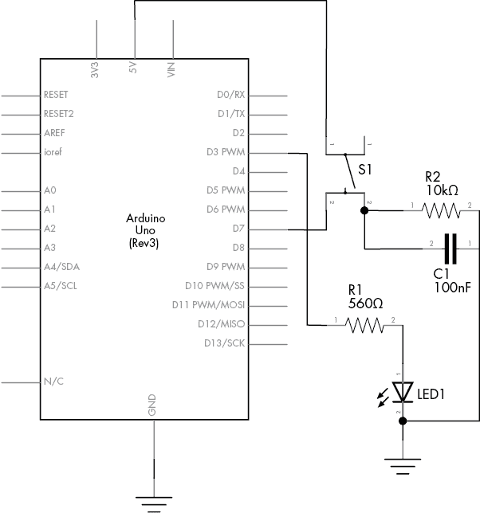

图 4-19：项目 4 的电路图

因为这是你第一次根据电路图搭建电路，所以请按照这些逐步说明来完成电路图的操作；这将帮助你理解各个组件如何连接：

1.  将按钮插入面包板，如 图 4-20 所示。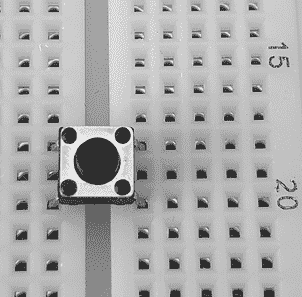

    图 4-20：按钮插入面包板

1.  现在插入 10 kΩ 电阻、一根短接电线和电容器，如 图 4-21 所示。

    图 4-21：添加 10 kΩ 电阻和电容器

1.  从 Arduino 5 V 引脚连接一根电线到面包板上按钮的右上行。再连接另一根电线从 Arduino GND 引脚到与电线连接和电阻的左侧相连的同一垂直行。这如 图 4-22 所示。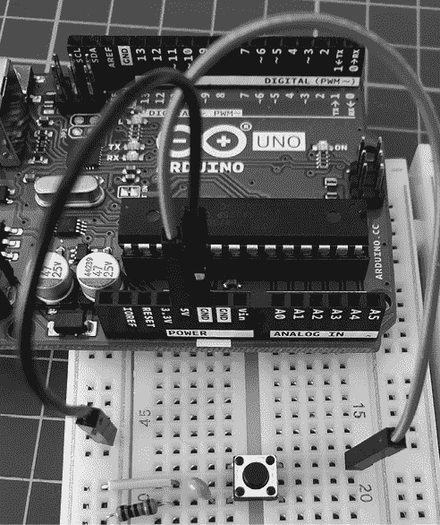

    图 4-22：连接 5 V（红色）和 GND（黑色）电线

1.  从 Arduino 数字引脚 7 连接一根电线到面包板上按钮的右下行，如 图 4-23 所示。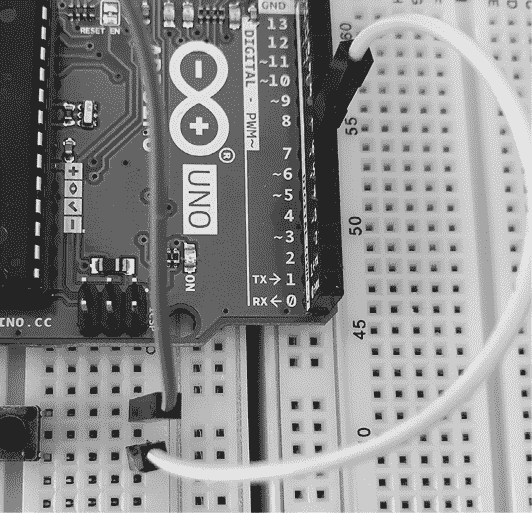

    图 4-23：将按钮连接到数字输入

1.  将 LED 插入面包板，将短腿（阴极）连接到 GND 列，长腿（阳极）插入右侧的某一行。接着，将 560 Ω电阻连接到 LED 的右侧，如图 4-24 所示。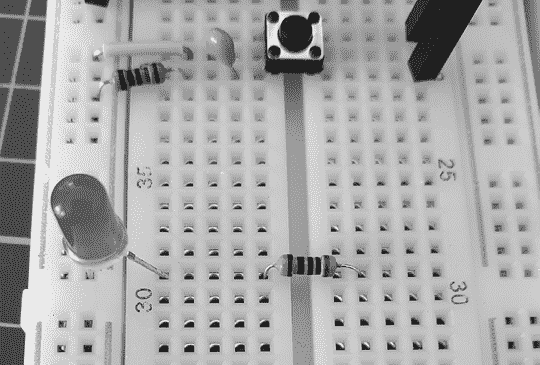

    图 4-24：插入 LED 和 560 Ω电阻

1.  将一根导线从 560 Ω电阻的右侧连接到 Arduino 数字引脚 3，如图 4-25 所示。


图 4-25：将 LED 分支连接到 Arduino

在继续之前，查看该电路的原理图，检查你的元件是否正确连接。将原理图与实际电路连接进行对比。

### 草图

对于草图，输入并上传列表 4-1。

```
// Listing 4-1, Project 4 - Demonstrating a Digital Input1 #define LED 3 
#define BUTTON 7
void setup()
{2    pinMode(LED, OUTPUT);   // output for the LED  pinMode(BUTTON, INPUT); // input for the button
} 
void loop()
{ if ( digitalRead(BUTTON) == HIGH ) { digitalWrite(LED, HIGH); // turn on the LED delay(500);              // wait for 0.5 seconds digitalWrite(LED, LOW);  // turn off the LED }
}
```

列表 4-1：数字输入

上传草图后，短按按钮。LED 应该保持亮起约半秒钟。

### 理解草图

让我们来检查项目 4 草图中的新内容——特别是`#define`、数字输入引脚和`if`语句。

#### 使用`#define`创建常量

在`void setup()`之前，我们使用`#define`语句在第 1 行创建固定值：当草图被编译时，IDE 会将定义的单词的每个实例替换为它后面的数字。例如，当 IDE 在第 2 行看到`LED`时，它会将其替换为数字`3`。请注意，我们在`#define`值后面不使用分号。

我们基本上是使用`#define`语句在草图中给 LED 和按钮的数字引脚加标签。这样标注引脚编号和其他固定值（例如时间延迟）是一个好主意，因为如果该值在草图中被重复使用，你就不需要多次编辑相同的项。在这个例子中，`LED`在草图中使用了三次，但如果我们要更改这个值，只需在`#define`语句中的定义进行一次编辑。

#### 读取数字输入引脚

为了读取按钮的状态，我们首先在`void setup()`中定义一个数字 I/O 引脚作为输入，使用如下代码：

```
pinMode(BUTTON, INPUT); // input for button
```

接下来，为了发现按钮是否将电压连接到数字输入（即按钮被按下），我们使用`digitalRead(``pin``)`，其中`pin`是要读取的数字引脚编号。该函数返回`HIGH`（引脚上的电压接近 5V）或`LOW`（引脚上的电压接近 0V）。

#### 使用`if`做决策

使用`if`，我们可以在我们的草图中做出决策，并告诉 Arduino 根据决策运行不同的代码。例如，在项目 4 的草图中，我们使用了列表 4-2。

```
// Listing 4-2
if (digitalRead(BUTTON) == HIGH)
{ digitalWrite(LED, HIGH); // turn on the LED delay(500);              // wait for 0.5 seconds digitalWrite(LED, LOW);  // turn off the LED
}
```

列表 4-2：一个简单的`if-then`例子

这段代码的第一行以`if`开始，因为它测试某个条件。如果条件为真（即电压为`HIGH`），则表示按钮被按下。Arduino 接着会执行花括号内的代码。

为了确定按钮是否被按下（`digitalRead(BUTTON)` 设置为 `HIGH`），我们使用了一个*比较运算符*，即双等号（`==`）。如果我们将 `==` 替换为 `!=`（不等于），那么当按钮被按下时，LED 会熄灭。试试看吧。

一旦你取得了一些成功，试着改变灯亮的时间，或者回到第三章第 38 页的项目 3，添加一个按钮控制。（不过不要拆解这个电路，我们将在下一个例子中再次使用它。）

### 修改你的草图：使用 if-else 进行更多决策

你可以通过使用 `else` 为 `if` 语句添加另一个动作。例如，如果我们通过添加 `else` 子句来重写 示例 4-1，如 示例 4-3 所示，那么当按钮被按下时，LED 将点亮，*否则* 它会熄灭。使用 `else` 会强制 Arduino 在 `if` 语句中的测试不为真时运行另一段代码。

```
// Listing 4-3
#define LED 3
#define BUTTON 7 
void setup()
{ pinMode(LED, OUTPUT);   // output for the LED pinMode(BUTTON, INPUT); // input for the button
} 
void loop()
{ if ( digitalRead(BUTTON) == HIGH ) { digitalWrite(LED, HIGH); } **else** { digitalWrite(LED, LOW); }
}
```

示例 4-3：添加 `else`

## 布尔变量

有时你需要记录某物是否处于两种状态中的任意一种，例如开或关，或热或冷。*布尔变量* 就是计算机中的“位”，它的值只能是零（0，假）或一（1，真）。与其他变量一样，我们需要声明它才能使用：

```
boolean raining = true; // create the variable "raining" and first make it true
```

在草图中，你可以通过简单的重新赋值来改变布尔值的状态，例如这样：

```
raining = false;
```

由于布尔变量只能取真或假的值，它们非常适合用于 `if` 语句进行决策。真假布尔比较与比较运算符 `!=` 和 `==` 配合得很好。以下是一个示例：

```
if ( raining == true )
{ if ( summer != true ) { // it is raining and not summer }
}
```

### 比较运算符

我们可以使用各种运算符来判断两个或多个布尔变量或其他状态。这些运算符包括 *非*（`!`）、*与*（`&&`）和 *或*（`||`）。

#### 非运算符

*非* 运算符用感叹号（`!`）表示。这个运算符用于简化检查某事是否*不为真*。以下是一个示例：

```
if ( !raining )
{ // it is not raining (raining == false)
}
```

#### 与运算符

逻辑*与*运算符用 `&&` 表示。使用 *与* 运算符有助于减少单独的 `if` 测试次数。以下是一个示例：

```
if (( raining == true ) && ( !summer ))
{ // it is raining and not summer (raining == true and summer == false)
}
```

#### 或运算符

逻辑*或*运算符用 `||` 表示。使用 *或* 运算符相当直观。以下是一个示例：

```
if (( raining == true ) || ( summer == true ))
{ // it is either raining or summer
}
```

### 进行两个或更多比较

你还可以使用相同的 `if` 语句进行两个或多个比较。这里有一个示例：

```
if ( snow == true && rain == true && !hot )
{ // it is snowing and raining and not hot
}
```

你还可以使用括号来设置操作的顺序。在下一个示例中，括号中的比较首先会被检查，并得到一个真假状态，然后该条件会接受 `if` 语句中的剩余测试：

```
if (( snow == true || rain == true ) && hot == false))
{
// it is either snowing or raining, and not hot
}
```

最后，就像之前使用 `!` 运算符对值进行的示例一样，简单的真假测试可以在不需要在每次测试中写 `== true` 或 `== false` 的情况下执行。以下代码与之前的示例效果相同：

```
if (( snow || rain ) && !hot )
{ // it is either snowing or raining, and not hot // ( snow is true OR rain is true ) AND it is not hot
}
```

如你所见，使用布尔变量和比较运算符，Arduino 可以做出多种决策。随着你进行更复杂的项目，这将变得非常有用。

## 项目 #5：控制交通

现在让我们通过解决一个假设问题来运用我们新学到的知识。作为一个乡村县城的城镇规划师，我们面临一个单车道桥梁的问题。每周，在夜间，疲劳驾驶的司机匆忙穿越桥梁，而没有先停下来检查道路是否畅通，这时经常发生一到两起事故。我们建议安装交通信号灯，但市长希望在签署购买合同前看到信号灯的演示。我们可以租用临时信号灯，但它们非常昂贵。于是，我们决定使用 LED 和 Arduino 构建一个带有工作交通信号灯的桥梁模型。

### 目标

我们的目标是在单车道桥梁的每一端安装三色交通灯。该灯只允许交通一次按一个方向流动。当桥梁两端的传感器检测到红灯前等待的车辆时，交通灯会改变，并允许交通向相反方向流动。

### 算法

我们将使用两个按钮来模拟桥梁两端的车辆传感器。每组灯都会有红、黄、绿三种 LED。初始时，系统将允许西向的交通流向东，因此西向的交通灯设为绿灯，东向的交通灯设为红灯。

当车辆接近桥梁（通过按下按钮来模拟）且红灯亮起时，系统会将对面方向的交通信号灯从绿灯变为黄灯，再变为红灯，并等待一定时间，以允许已经在桥上的车辆完成通行。接下来，等待车辆一侧的黄灯会闪烁，作为对驾驶员的“准备好”提示，最后灯会变为绿灯。绿灯会一直保持，直到另一侧的车辆接近，此时整个过程会重复。

### 硬件

这是你创建此项目所需的物品：

+   两个红色 LED（LED1 和 LED2）

+   两个黄色 LED（LED3 和 LED4）

+   两个绿色 LED（LED5 和 LED6）

+   六个 560 Ω 电阻（R1 至 R6）

+   两个 10 kΩ 电阻（R7 和 R8）

+   两个 100 nF 电容（C1 和 C2）

+   两个按键（S1 和 S2）

+   一个中型面包板

+   Arduino 和 USB 数据线

+   各种连接线

### 原理图

由于我们只控制六个 LED 并接收来自两个按钮的输入，设计不会太复杂。图 4-26 显示了我们项目的原理图。

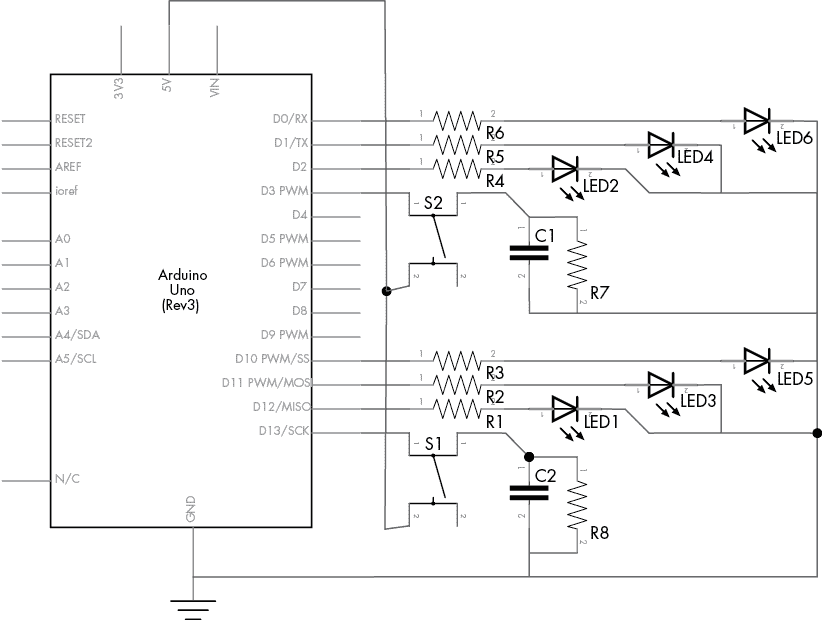

图 4-26：项目 5 的原理图

这个电路基本上是项目 4 中按钮和 LED 电路的一个更复杂版本，增加了电阻器、更多的 LED 和另一个按钮。

确保 LED 插入的方向正确：电阻连接到 LED 阳极，LED 阴极连接到 Arduino 的 GND 引脚，如图 4-27 所示。


图 4-27：完成的电路

### 草图

现在来看一下草图。你能看到它是如何与我们的算法匹配的吗？

```
// Project 5 - Controlling Traffic 
// define the pins that the buttons and lights are connected to:1 #define westButton 3 
#define eastButton 13
#define westRed 2
#define westYellow 1 
#define westGreen 0
#define eastRed 12
#define eastYellow 11
#define eastGreen 10 
#define yellowBlinkTime 500 // 0.5 seconds for yellow light blink 2 boolean trafficWest = true; // west = true, east = false3 int flowTime = 10000;       // amount of time to let traffic flow4 int changeDelay = 2000;     // amount of time between color changes 
void setup()
{ // set up the digital I/O pins pinMode(westButton, INPUT); pinMode(eastButton, INPUT); pinMode(westRed, OUTPUT); pinMode(westYellow, OUTPUT); pinMode(westGreen, OUTPUT); pinMode(eastRed, OUTPUT); pinMode(eastYellow, OUTPUT); pinMode(eastGreen, OUTPUT); // set initial state for lights - west side is green first digitalWrite(westRed, LOW); digitalWrite(westYellow, LOW); digitalWrite(westGreen, HIGH);  digitalWrite(eastRed, HIGH); digitalWrite(eastYellow, LOW); digitalWrite(eastGreen, LOW);
} 
void loop()
{ if ( digitalRead(westButton) == HIGH ) // request west>east traffic flow { if ( trafficWest != true )  // only continue if traffic flowing in the opposite (east) direction { trafficWest = true; // change traffic flow flag to west>east delay(flowTime);    // give time for traffic to flow  digitalWrite(eastGreen, LOW); // change east-facing lights from green  // to yellow to red digitalWrite(eastYellow, HIGH); delay(changeDelay); digitalWrite(eastYellow, LOW); digitalWrite(eastRed, HIGH); delay(changeDelay);  for ( int a = 0; a < 5; a++ ) // blink yellow light { digitalWrite(westYellow, LOW); delay(yellowBlinkTime); digitalWrite(westYellow, HIGH); delay(yellowBlinkTime); } digitalWrite(westYellow, LOW); digitalWrite(westRed, LOW); // change west-facing lights from red // to green digitalWrite(westGreen, HIGH);  } } if ( digitalRead(eastButton) == HIGH ) // request east>west traffic flow { if ( trafficWest == true )  // only continue if traffic flow is in the opposite (west) direction { trafficWest = false; // change traffic flow flag to east>west delay(flowTime);     // give time for traffic to flow  digitalWrite(westGreen, LOW);  // change west-facing lights from green to yellow to red digitalWrite(westYellow, HIGH); delay(changeDelay); digitalWrite(westYellow, LOW); digitalWrite(westRed, HIGH); delay(changeDelay);  for ( int a = 0 ; a < 5 ; a++ ) // blink yellow light  { digitalWrite(eastYellow, LOW); delay(yellowBlinkTime); digitalWrite(eastYellow, HIGH); delay(yellowBlinkTime); }  digitalWrite(eastYellow, LOW);  digitalWrite(eastRed, LOW); // change east-facing lights from red // to green digitalWrite(eastGreen, HIGH);  } }
}
```

我们的草图首先通过在第 1 行使用`#define`来将数字引脚号与所有使用的 LED 标签以及两个按钮的标签关联。我们有红色、黄色和绿色 LED，以及每个桥面东西两侧的一个按钮。布尔变量`trafficWest`在第 2 行用于跟踪交通流向——`true`表示西到东，`false`表示东到西。

整型变量`flowTime`在第 3 行是车辆必须通过桥梁的最短时间。当车辆停在红灯前时，系统会延长此时间，以便对面来车有时间通过桥梁。整型变量`changeDelay`在第 4 行表示从绿色到黄色再到红色的颜色变化之间的经过时间。

在草图进入`void loop()`部分之前，它已经在`void setup()`中设置为从西向东的交通流向。

### 运行草图

一旦开始运行，草图将不做任何操作，直到按下其中一个按钮。当按下东侧按钮时，代码行：

```
if ( trafficWest == true )
```

确保只有当交通流向相反方向时，交通灯才会改变。`void loop()`部分的其余代码是由简单的等待序列组成，然后是开启和关闭各种 LED 以模拟交通灯的工作。

## 模拟信号与数字信号

在这一部分，你将学习数字信号和模拟信号的区别，并学习如何使用模拟输入引脚来测量模拟信号。

到目前为止，我们的草图一直在使用数字电信号，只有两个离散的电平。具体来说，我们使用了`digitalWrite(``pin``, HIGH)`和`digitalWrite(``pin``, LOW)`来闪烁 LED，并使用`digitalRead()`来测量数字引脚是否有电压（`HIGH`）或没有（`LOW`）。图 4-28 是数字信号的视觉表示，信号在高低电平之间交替。

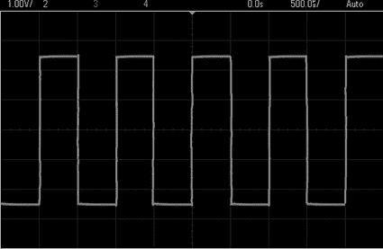

图 4-28：数字信号，顶部的水平线表示高电平，底部表示低电平

与数字信号不同，模拟信号可以在高低之间变化，且变化步数是无限的。例如，图 4-29 显示了正弦波的模拟信号。注意，随着时间的推移，电压在高低电平之间流动得非常平滑。

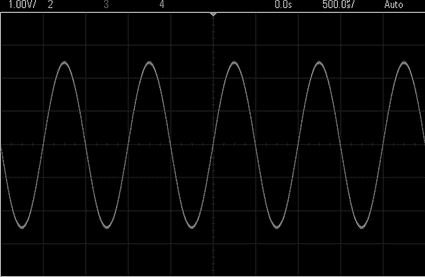

图 4-29：正弦波的模拟信号

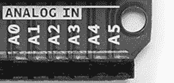

图 4-30：Arduino Uno 上的模拟输入

在我们的 Arduino 中，高电平接近 5 V，低电平接近 0 V 或 GND。我们可以使用图 4-30 中显示的六个模拟输入来测量模拟信号的电压值。这些模拟输入可以安全地测量从 0（GND）到最多 5 V 的电压。

如果使用`analogRead()`函数，则 Arduino 将根据应用于模拟引脚的电压返回一个介于 0 和 1,023 之间的数字。例如，您可以使用`analogRead()`将模拟引脚 0 的值存储在整数变量`a`中，如下所示：

```
a = analogRead(0); // read analog input pin 0 (A0)
// returns 0 to 1023, which is usually 0.000 to 4.995 volts
```

## 项目#6：创建单节电池测试仪

尽管电池的流行度和使用率有所下降，但大多数家庭仍然拥有一些设备，如遥控器、时钟或儿童玩具，这些设备使用 AA、AAA、C 或 D 型电池。这些电池的电压远低于 5 V，因此我们可以使用 Arduino 测量电池的电压，从而判断电池的状态。在这个项目中，我们将创建一个电池测试仪。

### 目标

单节电池（如 AA 电池）通常在新电池时电压约为 1.6 V，使用和老化后电压会降低。我们将测量电压，并通过 LEDs 以视觉方式显示电池状态。我们将使用`analogRead()`的读取值，并将其转换为电压值。最大可读取的电压是 5 V，因此我们将 5 除以 1,024（可能的值的数量），得到 0.0048。我们将`analogRead()`返回的值乘以这个数字，以获取电压值。例如，如果`analogRead()`返回 512，则将该读取值乘以 0.0048，得到 2.4576 V。

### 算法

这是我们电池测试仪的算法：

1.  从模拟引脚 0 读取数据。

1.  将读取值乘以 0.0048 以创建电压值。

1.  如果电压大于或等于 1.6 V，则短暂点亮绿色 LED。

1.  如果电压大于 1.4 V *且*小于 1.6 V，则短暂点亮黄色 LED。

1.  如果电压小于 1.4 V，则短暂点亮红色 LED。

1.  无限重复。

### 硬件

这是您需要的材料来创建这个项目：

+   三个 560 Ω的电阻（R1 到 R3）

+   一个绿色 LED（LED1）

+   一个黄色 LED（LED2）

+   一个红色 LED（LED3）

+   一个面包板

+   各种连接线

+   Arduino 和 USB 电缆

### 电路图

单节电池测试仪电路的原理图见图 4-31。左侧有两个端子，标记为*+*和*-*。将待测试的单节电池的*匹配*端连接到这些端子上。正极应连接到正极，负极应连接到负极。

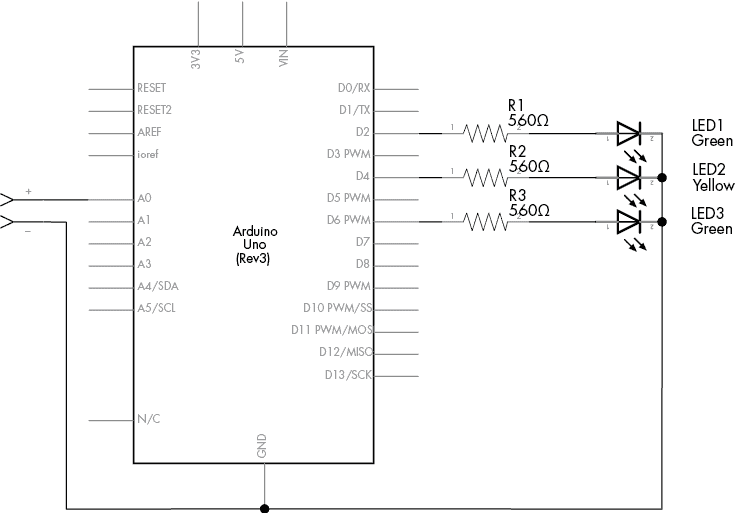

图 4-31：项目 6 的电路图

### 草图

现在是草图部分。由于模拟值可能会在整数之间波动，我们将使用一种新的变量类型——*float*，它可以包含小数或分数值：

```
// Project 6 - Creating a Single-Cell Battery Tester
#define newLED 2 // green LED 
#define okLED 4  // yellow LED 
#define oldLED 6 // red LED 
int analogValue = 0;1 float voltage = 0; 
int ledDelay = 2000; 
void setup()
{ pinMode(newLED, OUTPUT); pinMode(okLED, OUTPUT); pinMode(oldLED, OUTPUT);
} 
void loop()
{2    analogValue = analogRead(0); 3    voltage = 0.0048*analogValue; 4    if ( voltage >= 1.6 )  { digitalWrite(newLED, HIGH); delay(ledDelay); digitalWrite(newLED, LOW); } 5    else if ( (voltage < 1.6) && (voltage) > 1.4 )  { digitalWrite(okLED, HIGH); delay(ledDelay); digitalWrite(okLED, LOW); } 6     else if ( voltage <= 1.4 )  { digitalWrite(oldLED, HIGH); delay(ledDelay); digitalWrite(oldLED, LOW); }
}
```

在这个草图中，Arduino 获取模拟引脚 0 在 2 处测量的值，并在 3 处将其转换为电压值。您将在下一节中了解更多关于新类型变量`float`的内容，下一节将讨论如何使用 Arduino 进行算术运算，并使用比较运算符来比较数字。

## 使用 Arduino 进行算术运算

像口袋计算器一样，Arduino 可以执行乘法、除法、加法和减法等计算。以下是一些示例：

```
a = 100;
b = a + 20;
c = b - 200;
d = c + 80; // d will equal 0
```

### 浮动变量

当你需要处理带小数点的数字时，可以使用 `float` 变量类型。`float` 变量可以存储的值范围在 3.4028235 × 10³⁸ 和 −3.4028235 × 10³⁸ 之间，通常精度限制在六到七位小数。你可以在计算中混合使用整数和 `float` 数字。例如，你可以将 `float` 数字 `f` 加到整数 `a` 上，并将结果存储为 `float` 变量 `g`：

```
int a = 100;
float f;
float g; 
f = a / 3; // f = 33.333333
g = a + f; // g = 133.333333
```

### 计算的比较运算符

我们在项目 5 中使用了 `==` 和 `!=` 等比较运算符与 `if` 语句以及数字输入信号。除了这些运算符外，我们还可以使用以下运算符来比较数字或数值变量：

1.  `<` 小于

1.  `>` 大于

1.  `<=` 小于或等于

1.  `>=` 大于或等于

我们在项目 6 的草图中，使用了这些运算符来比较第 4、5 和 6 行的数字。

## 使用参考电压提高模拟测量精度

如项目 6 中所示，`analogRead()` 函数返回一个与 0 到 5 V 电压成比例的值。上限值（5 V）是*参考电压*，即 Arduino 模拟输入将接受并返回最高值（1,023）的最大电压。

为了在读取更低电压时提高精度，我们可以使用较低的参考电压。例如，当参考电压为 5 V 时，`analogRead()` 的值范围是 0 到 1,023。然而，如果我们只需要测量最大为 2 V 的电压，那么我们可以调整 Arduino 输出，使其在 0 到 1,023 的范围内表示 2 V，从而实现更精确的测量。你可以使用外部或内部参考电压来做到这一点，具体内容将在下文中讨论。

### 使用外部参考电压

使用参考电压的第一种方法是通过 *AREF*（*a*nalog *ref*erence）引脚，如图 4-32 所示。

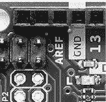

图 4-32：Arduino Uno 的 AREF 引脚

我们可以通过将电压连接到 AREF 引脚并将匹配的 GND 连接到 Arduino 的 GND 来引入新的参考电压。请注意，这样做可以降低参考电压，但不能提高它，因为连接到 Arduino Uno 的参考电压不得超过 5 V。设置较低参考电压的一种简单方法是使用两个电阻器构成*电压分压器*，如图 4-33 所示。

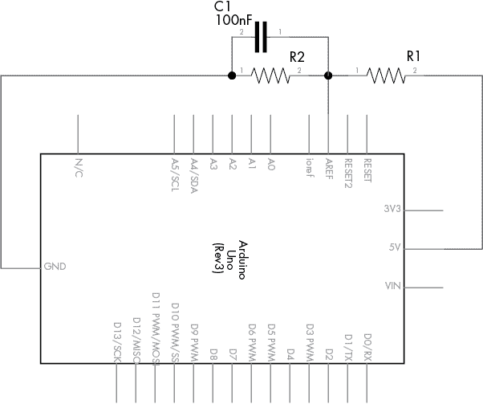

图 4-33：电压分压电路

根据图 4-34 中的公式，*R1* 和 *R2* 的值将决定参考电压。

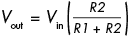

图 4-34：参考电压公式

在该公式中，*V*[out] 是参考电压，*V*[in] 是输入电压—在本例中为 5 V。*R1* 和 *R2* 是电阻值，单位为欧姆。

分压的最简单方法是将*V*[in]一分为二，将*R1*和*R2*设为相同值——例如，每个 10 kΩ。在进行此操作时，最好使用精度最低的电阻器，例如 1% 的误差；用万用表确认它们的实际电阻值，并在计算中使用这些确认的值。此外，最好在 AREF 和 GND 之间放置一个 100 nF 的电容器，以避免 AREF 噪声并防止模拟读取不稳定。

使用外部参考电压时，请在您的草图的`void setup()`部分插入以下代码行：

```
**analogReference(EXTERNAL); // select AREF pin for reference voltage**
```

### 使用内部参考电压

Arduino Uno 还具有内部 1.1 V 参考电压。如果这满足您的需求，则无需更改硬件。只需在`void setup()`中添加以下代码行：

```
**analogReference(INTERNAL); // select internal 1.1 V reference voltage**
```

## 可变电阻器

可变电阻器，也称为*电位器*，通常可以调节从 0 Ω 到其额定值。其电路符号如图 4-35 所示。

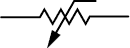

图 4-35：可变电阻器（电位器）符号

可变电阻器有三个引脚连接：一个在中央引脚，另两个分别在两侧。当可变电阻器的轴旋转时，它会增加中心与一侧之间的电阻，并减少中心与另一侧之间的电阻。

可变电阻器可以是*线性*型或*对数*型。线性模型的电阻随着旋转以恒定的速度变化，而对数模型的电阻最初变化缓慢，然后迅速增加。对数电位器更常用于音频放大电路，因为它们模拟了人类的听觉反应。您通常可以通过后面的标记来识别电位器是对数型还是线性型。大多数电位器会在电阻值旁标有*A*或*B*：*A*表示对数型，*B*表示线性型。大多数 Arduino 项目使用线性可变电阻器，如图 4-36 所示。

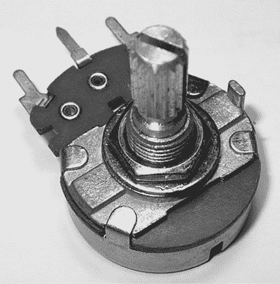

图 4-36：典型的线性可变电阻

您还可以获得小型的可变电阻器，称为*微调电位器*或*调节器*（参见图 4-37）。由于其体积小，微调电位器非常适合用于电路调整，但它们在面包板工作中也非常有用，因为它们可以插入使用。

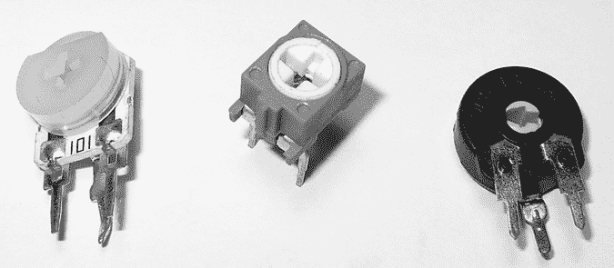

图 4-37：各种微调电位器

## 压电蜂鸣器

*压电元件*（简称*压电*），或蜂鸣器，是一种小型圆形设备，可用于产生响亮且令人烦恼的声音，适合用于报警——或用于娱乐。图 4-38 展示了一个常见的例子，TDK PS1240，旁边放着一枚美国一角硬币，以便让您了解其大小。

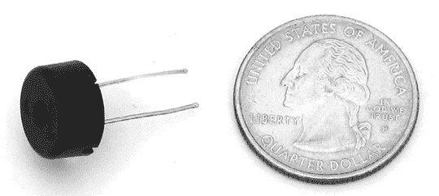

图 4-38：TDK PS1240 压电器

压电元件内部包含一个非常薄的板，当电流通过时，这个板会发生移动。当施加脉冲电流（例如开……关……开……关）时，板会振动并产生声波。

使用 Arduino 控制压电元件非常简单，因为它们可以像 LED 一样开关。压电元件没有极性，可以任意方向连接。

### 压电元件原理图

压电元件的原理图符号类似于扬声器（见图 4-39），这使得它容易识别。

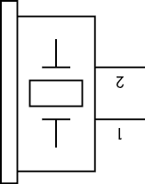

图 4-39：压电元件原理图符号

## 项目 #7：尝试使用压电蜂鸣器

如果你手头有一个压电元件并且想尝试，首先将其连接到 Arduino 的 GND 和数字引脚 D3 到 D0（包括）之间。然后将以下演示草图上传到你的 Arduino：

```
// Project 7 - Trying Out a Piezo Buzzer
#define PIEZO 3 // pin 3 is capable of PWM output to drive tones
int del = 500;
void setup()
{ pinMode(PIEZO, OUTPUT);
} 
void loop()
{1    analogWrite(PIEZO, 128);  // 50 percent duty cycle tone to the piezo delay(del); digitalWrite(PIEZO, LOW); // turn the piezo off delay(del);
}
```

此草图使用数字引脚 3 上的脉宽调制（PWM）。如果你在 `analogWrite()` 函数中更改占空比（当前是 128，即 50% 开），你可以改变蜂鸣器的声音。

要增加蜂鸣器的音量，可以增加施加到蜂鸣器上的电压。目前电压限制为 5 V，但在 9 V 或 12 V 时蜂鸣器会更响。由于 Arduino 无法提供更高的电压，你需要使用外部电源为蜂鸣器供电，如 9 V 电池，然后使用 BC548 晶体管作为电子开关来控制蜂鸣器的电源。你可以使用与图 4-40 所示原理图相同的草图。

原理图中标记为 12 V 的部分将是高功率电源的正极，负极将连接到 Arduino 的 GND 引脚。

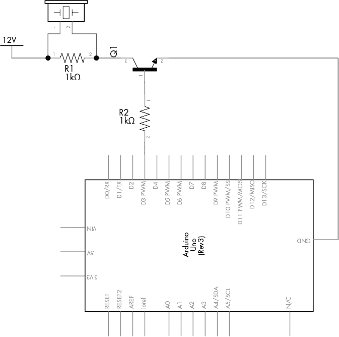

图 4-40：项目 7 原理图

## 项目 #8：创建一个快速读取温度计

温度可以通过模拟信号表示。我们可以使用模拟设备公司（Analog Devices）生产的 TMP36 电压输出温度传感器来测量温度（[`www.analog.com/tmp36/`](http://www.analog.com/tmp36/)），该传感器如图 4-41 所示。

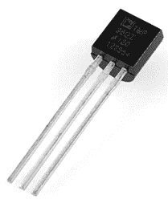

图 4-41：TMP36 温度传感器

请注意，TMP36 看起来就像我们在第三章继电器控制电路中使用的 BC548 晶体管。TMP36 输出与温度成比例的电压，因此你可以通过简单的转换来确定当前温度。例如，在 25 摄氏度时，输出电压为 750 mV，每增加 1 摄氏度，电压会变化 10 mV。TMP36 可以测量从 −40 到 125 摄氏度的温度。

函数`analogRead()`将返回一个介于 0 和 1,023 之间的值，这对应于一个介于 0 到接近 5,000 毫伏（5 V）之间的电压。如果我们将`analogRead()`的输出值乘以(5,000/1,024)，我们就能得到传感器返回的实际电压。接下来，我们减去 500（TMP36 使用的偏移量，用于处理低于 0 度的温度），然后除以 10，最后得到摄氏度的温度。如果你使用华氏度，则将摄氏值乘以 1.8，并加上 32。

### 目标

在这个项目中，我们将使用 TMP36 创建一个快速读取温度的温度计。当温度低于 20 摄氏度时，蓝色 LED 灯亮起；当温度在 20 到 26 摄氏度之间时，绿色 LED 灯亮起；当温度高于 26 摄氏度时，红色 LED 灯亮起。

### 硬件

以下是你需要创建这个项目所需的组件：

+   三个 560 Ω电阻（R1 至 R3）

+   一个红色 LED 灯（LED1）

+   一个绿色 LED 灯（LED2）

+   一个蓝色 LED 灯（LED3）

+   一个 TMP36 温度传感器

+   一个面包板

+   各种连接线

+   Arduino 和 USB 线

### 原理图

电路很简单。当你看到 TMP36 的标记面时，左侧的引脚连接到 5 V 输入，中间的引脚是电压输出，右侧的引脚连接到地（GND），如图 4-42 所示。

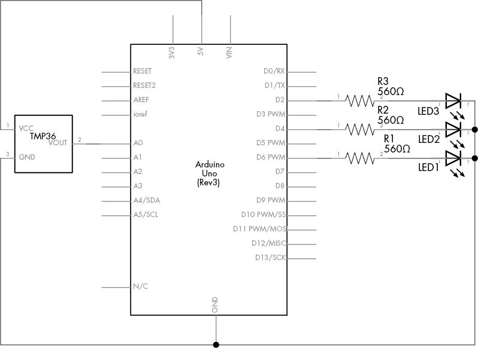

图 4-42：项目 8 的原理图

### 草图

现在是草图部分：

```
// Project 8 - Creating a Quick-Read Thermometer 
// define the pins that the LEDs are connected to:
#define HOT 6
#define NORMAL 4
#define COLD 2 
float voltage = 0;
float celsius = 0;
float hotTemp = 26;
float coldTemp = 20;
float sensor = 0; 
void setup()
{ pinMode(HOT, OUTPUT); pinMode(NORMAL, OUTPUT); pinMode(COLD, OUTPUT);
} 
void loop(){ // read the temperature sensor and convert the result to degrees Celsius1    sensor = analogRead(0);  voltage = ( sensor * 5000 ) / 1024; // convert raw sensor value to // millivolts voltage = voltage - 500; // remove voltage offset celsius = voltage / 10;  // convert millivolts to Celsius // act on temperature range2    if ( celsius < coldTemp )  { digitalWrite(COLD, HIGH); delay(1000);  digitalWrite(COLD, LOW); }3    else if ( celsius > coldTemp && celsius <= hotTemp )  { digitalWrite(NORMAL, HIGH); delay(1000); digitalWrite(NORMAL, LOW); } else { // celsius is > hotTemp digitalWrite(HOT, HIGH); delay(1000); digitalWrite(HOT, LOW); }
}
```

草图首先从 TMP36 读取电压，并将其转换为摄氏度温度，如步骤 1 所示。接着，在步骤 2 和 3 中，使用`if-else`语句，代码将当前温度与冷热的值进行比较，并打开相应的 LED 灯。`delay(1000)`语句用于防止灯光在温度迅速在两个范围之间波动时闪烁得太快。

你可以通过向传感器吹冷空气来让温度降低，或者通过用两根手指摩擦 TMP36 的表面来产生热量，进行实验。

## 展望未来

第四章到此结束。现在你有了更多的工具可以使用，包括数字输入和输出、新类型的变量以及各种数学函数。在下一章，你将更深入地玩转 LED，学习如何创建自己的函数，制作计算机游戏和电子骰子，等等。
