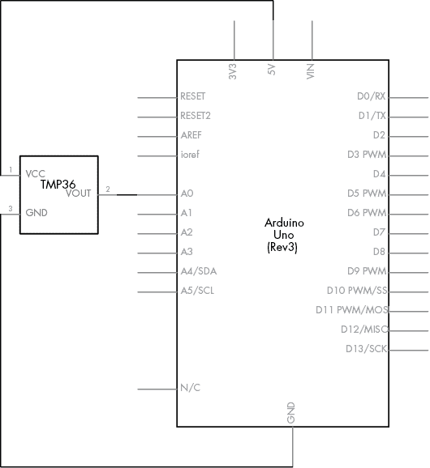
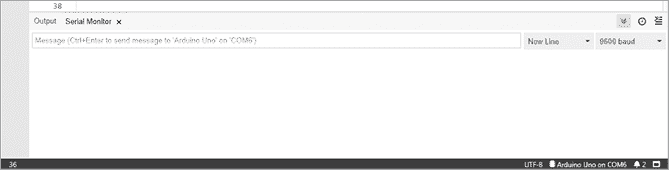
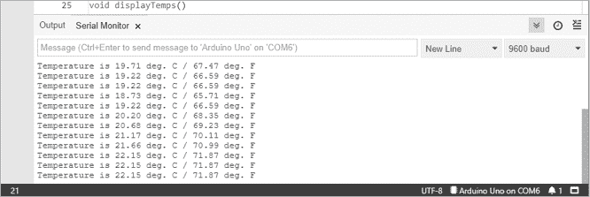
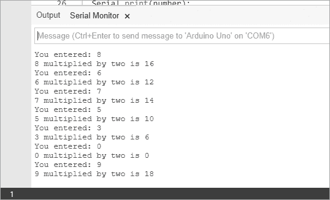
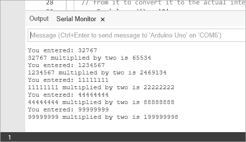

# 第五章：使用函数

在本章中，您将

+   创建您自己的函数

+   学习使用`while`和`do-while`进行决策

+   在您的 Arduino 和串口监视器窗口之间发送和接收数据

+   学习关于`long`变量的知识

您可以通过创建自己的函数，使您的 Arduino 草图更易于阅读并简化设计。您还可以创建可在后续项目中重复使用的模块化代码。除了这些内容，本章还将介绍一种让 Arduino 做出决策并控制代码块的方法，您将了解一种名为`long`的整数变量类型。您还将使用自己的函数创建一种新的温度计类型。

一个*函数*由一组指令组成，作为一个单元打包并赋予名称，您可以在任何地方使用它。尽管许多函数已经在 Arduino 语言中可用，但有时您找不到适合您特定需求的函数——或者您可能需要反复运行程序的一部分以使函数工作，这会浪费内存。在这两种情况下，您可能会希望有一个更合适的函数来完成任务。好消息是，您可以自己创建这样的函数。

## 项目 #9：创建一个重复执行某个操作的函数

您可以编写简单的函数来按需重复执行操作。例如，以下函数将在 1 和 3 时打开内置 LED（开），在 2 和 4 时关闭内置 LED（关），并重复两次：

```
void blinkLED() 
{1     digitalWrite(13, HIGH); delay(1000);2     digitalWrite(13, LOW); delay(1000);3     digitalWrite(13, HIGH); delay(1000);4     digitalWrite(13, LOW); delay(1000);
}
```

以下是这个函数在完整草图中的使用方式，您可以将其上传到 Arduino：

```
// Project 9 - Creating a Function to Repeat an Action
#define LED 13
#define del 200
void setup()
{ pinMode(LED, OUTPUT);
}
void blinkLED() 
{ digitalWrite(LED, HIGH); delay(del); digitalWrite(LED, LOW); delay(del); digitalWrite(LED, HIGH); delay(del); digitalWrite(LED, LOW); delay(del);
}
void loop()
{1   blinkLED(); delay(1000);
}
```

当在`void loop()`中的 1 处调用`blinkLED()`函数时，Arduino 将执行`void blinkLED()`部分中的命令。换句话说，您已经创建了自己的函数，并在需要时使用了它。

## 项目 #10：创建一个设置闪烁次数的函数

我们刚刚创建的函数功能非常有限。如果我们想设置闪烁次数和延迟时间怎么办？没问题——我们可以创建一个允许我们修改这些值的函数，如下所示：

```
void blinkLED(int cycles, int del) 
{ for ( int z = 0 ; z < cycles ; z++ ) { digitalWrite(LED, HIGH); delay(del); digitalWrite(LED, LOW); delay(del); }
}
```

我们新的`void blinkLED()`函数接受两个整数值：`cycles`（我们想要的 LED 闪烁次数）和`del`（LED 开关之间的延迟时间）。因此，如果我们想让 LED 闪烁 12 次，每次延迟 100 毫秒，我们将使用`blinkLED(12, 100)`。在 IDE 中输入以下代码，尝试这个函数：

```
// Project 10 - Creating a Function to Set the Number of Blinks
#define LED 13
void setup()
{ pinMode(LED, OUTPUT);
}
void blinkLED(int cycles, int del) 
{ for ( int z = 0 ; z < cycles ; z++ ) { digitalWrite(LED, HIGH); delay(del); digitalWrite(LED, LOW); delay(del); }
}
void loop()
{1   blinkLED(12, 100);  delay(1000);
}
```

如 1 所示，`12`和`100`这两个值——分别代表闪烁次数和延迟时间——被传递到我们自定义的`blinkLED()`函数中。因此，LED 将闪烁 12 次，每次闪烁之间有 100 毫秒的延迟。然后显示暂停 1,000 毫秒，即 1 秒，然后`loop()`函数重新开始。

## 创建一个返回值的函数

除了创建接受作为参数输入的值的函数（如项目 10 中的 `void blinkLED()`），你还可以创建返回值的函数，方法与 `analogRead()` 测量模拟输入时返回介于 0 到 1,023 之间的值相同，如项目 8 中演示的那样（请参见第四章第 91 页）。

到目前为止，我们看到的所有函数都以 `void` 开头。这告诉 Arduino 函数不返回任何值，仅仅是一个空的 void。但我们可以创建返回任何类型值的函数。例如，如果我们想要一个返回整数值的函数，我们会使用 `int` 来创建。如果我们希望它返回一个浮动点值，则函数将以 `float` 开头。让我们创建一些返回实际值的有用函数。

这是一个将摄氏度转换为华氏度的函数：

```
float convertTemp(float celsius)
{ float fahrenheit = 0; fahrenheit = (1.8 * celsius) + 32; return fahrenheit;
}
```

在第一行，我们定义了函数名（`convertTemp`）、返回值类型（`float`）以及我们可能想要传递给函数的任何变量（`float celsius`）。要使用这个函数，我们将其传递一个现有的值。例如，如果我们想将 40 摄氏度转换为华氏度，并将结果存储在一个名为 `tempf` 的 `float` 变量中，我们可以这样调用 `convertTemp()`：

```
 float tempf = convertTemp(40);
```

这将把 `40` 放入 `convertTemp()` 变量 `celsius` 并在 `convertTemp()` 函数中使用计算 `fahrenheit() = (1.8 * celsius) + 32`。结果会返回到变量 `tempf`，通过 `convertTemp()` 行 `return fahrenheit;`。

## 项目 #11：创建一个快速读取的温度计，它会根据温度闪烁

现在你已经知道如何创建自定义函数，我们将使用第四章中的 TMP36 温度传感器和 Arduino 内建的 LED 来制作一个快速读取的温度计。如果温度低于 20 摄氏度，LED 会闪烁两次然后暂停；如果温度介于 20 到 26 摄氏度之间，LED 会闪烁四次然后暂停；如果温度高于 26 摄氏度，LED 会闪烁六次。

我们将通过将草图分解为独立的、可重复使用的函数，使得草图更加模块化，同时也更容易理解。我们的温度计将执行两个主要任务：测量并分类温度，以及根据温度闪烁 LED 指定的次数。

### 硬件

所需的硬件很少：

+   一个 TMP36 温度传感器

+   一个面包板

+   各种连接电线

+   Arduino 和 USB 数据线

### 原理图

电路非常简单，如 图 5-1 所示。



图 5-1：项目 11 原理图

### 草图

我们需要为草图创建两个函数。第一个函数将从 TMP36 读取值，将其转换为摄氏度，然后返回 `2`、`4` 或 `6`，对应 LED 应该闪烁的次数。我们将从第 8 项中的草图开始，并做一些小的调整。

对于我们的第二个函数，我们将使用来自项目 9 的`blinkLED()`。我们的`void`循环将按顺序调用这些函数，然后暂停 2 秒钟再重新启动。

将此代码输入到 IDE 中：

```
// Project 11 - Creating a Quick-Read Thermometer That Blinks the Temperature
#define LED 13
int blinks = 0;
void setup()
{ pinMode(LED, OUTPUT);
}
int checkTemp()
{ float voltage  = 0; float celsius  = 0; float hotTemp  = 26; float coldTemp = 20; float sensor   = 0; int result; // read the temperature sensor and convert the result to degrees Celsius sensor = analogRead(0);       voltage = (sensor * 5000) / 1024; // convert raw sensor value to millivolts voltage = voltage - 500;          // remove voltage offset celsius = voltage / 10;           // convert millivolts to Celsius // act on temperature range if (celsius < coldTemp) { result = 2; }  else if (celsius >= coldTemp && celsius <= hotTemp) { result = 4; } else { result = 6;    // (celsius > hotTemp) } return result;
}
void blinkLED(int cycles, int del) 
{ for ( int z = 0 ; z < cycles ; z++ ) { digitalWrite(LED, HIGH); delay(del); digitalWrite(LED, LOW); delay(del); }
}1 void loop()
{ blinks = checkTemp(); blinkLED(blinks, 500); delay(2000);
}
```

因为我们使用了自定义函数，所以我们只需要在`void_loop()`中的第 1 行调用它们并设置延迟。函数`checkTemp()`返回一个值给整数变量`blinks`，然后`blinkLED()`将使 LED 闪烁`blinks`次，延迟 500 毫秒。草图然后暂停 2 秒钟再重复。

上传草图并观察 LED，看看这个温度计是如何工作的。和之前一样，看看你是否可以通过吹气或将它夹在手指之间来改变传感器的温度。一定要保持电路组装好，因为我们将在接下来的项目中使用它。

## 在串行监视器中显示来自 Arduino 的数据

到目前为止，我们已经将草图上传到 Arduino，并用 LED 显示输出（比如温度和交通信号）。闪烁的 LED 让我们容易从 Arduino 获得反馈，但闪烁的灯光只能告诉我们这么多信息。在本节中，你将学习如何使用 Arduino 的电缆连接和 IDE 的串行监视器窗口来显示来自 Arduino 的数据，并通过计算机键盘将数据发送到 Arduino。

### 串行监视器

要打开串行监视器，启动 IDE 并点击工具栏上的串行监视器图标，如图 5-2 所示。它会以一个新标签的形式出现在 IDE 中，包含输出窗口，并且应该看起来类似于图 5-3。


图 5-2：IDE 工具栏上的串行监视器图标



图 5-3：串行监视器

如图 5-3 所示，串行监视器在顶部显示一个输入框，由一行和一个发送按钮组成，下面是输出窗口，显示来自 Arduino 的数据。当勾选“自动滚动”框（时钟图标旁边的箭头按钮）时，最新的输出将显示在屏幕上，一旦屏幕满了，旧的数据会滚出屏幕，新的输出会覆盖它。如果你取消勾选“自动滚动”，可以使用垂直滚动条手动查看数据。

#### 启动串行监视器

在我们可以使用串行监视器之前，需要通过在`void setup()`中添加这个函数来激活它：

```
 Serial.begin(9600);
```

值`9600`是数据在计算机和 Arduino 之间传输的速度，也叫做*波特率*。这个值必须与串行监视器右下角的速度设置相匹配，如图 5-3 所示。

#### 发送文本到串行监视器

要将文本从 Arduino 发送到串行监视器并在输出窗口中显示，你可以使用`Serial.print()`：

```
 Serial.print("Arduino for Everyone!");
```

这会将引号中的文本发送到串行监视器的输出窗口。

你还可以使用`Serial.println()`来显示文本，并强制任何后续的文本开始于下一行：

```
 Serial.println("Arduino for Everyone!");
```

#### 显示变量的内容

你还可以在串口监视器中显示变量的内容。例如，这将显示变量 `results` 的内容：

```
 Serial.println(results); 
```

如果变量是 `float` 类型，则显示默认保留两位小数。你可以通过在变量名后输入第二个参数来指定小数位数，范围从 0 到 6。例如，要将 `float` 类型的变量 `results` 显示为四位小数，你可以输入以下代码：

```
 Serial.print(results,4);
```

## 项目 #12：在串口监视器中显示温度

使用项目 8 中的硬件，我们将在串口监视器窗口中显示摄氏度和华氏度的温度数据。为此，我们将创建一个函数来确定温度值，另一个函数来在串口监视器中显示这些值。

将此代码输入到 IDE 中：

```
// Project 12 - Displaying the Temperature in the Serial Monitor 
float celsius    = 0;
float fahrenheit = 0;
void setup()
{ Serial.begin(9600);
}1 void findTemps() 
{ float voltage = 0; float sensor  = 0; // read the temperature sensor and convert the result to degrees C and F sensor  = analogRead(0);       voltage = (sensor * 5000) / 1024;  // convert the raw sensor value to // millivolts voltage = voltage - 500;           // remove the voltage offset celsius = voltage / 10;            // convert millivolts to Celsius fahrenheit = (1.8 * celsius) + 32; // convert Celsius to Fahrenheit
}2 void displayTemps() { Serial.print("Temperature is "); Serial.print(celsius, 2); Serial.print(" deg. C / "); Serial.print(fahrenheit, 2); Serial.println(" deg. F");   // use .println here so the next reading starts on a new line
}
void loop()
{ findTemps(); displayTemps(); delay(1000);
}
```

这个示例中发生了很多事情，但我们创建了两个函数，`findTemps()` 在 1 处和 `displayTemps()` 在 2 处，以简化问题。这些函数在 `void loop()` 中被调用，`void loop()` 本身很简单。因此，你可以看到创建自定义函数的一个原因：使得你的草图更容易理解，代码也更模块化，甚至可能可重用。

上传草图后，等待几秒钟，然后打开串口监视器。你所在区域的温度应该以类似 图 5-4 所示的方式显示。



图 5-4：项目 12 的结果

### 使用串口监视器进行调试

你可以使用串口监视器帮助*调试*（定位和修复草图中的错误）。例如，如果你在草图中插入 `Serial.println();` 语句，并包含有关其位置的简短注释，那么你可以看到 Arduino 是否经过了每个语句的位置。例如，你可能会使用以下代码：

```
 Serial.println("now in findTemps()");
```

在 `findTemps()` 函数内插入语句，让你知道 Arduino 正在运行该函数。

## 使用 `while` 语句进行决策

你可以在草图中使用 `while` 语句来重复执行指令，只要给定的条件（*while*）为真。

### while

条件总是在执行 `while` 语句中的代码之前进行测试。例如，`while ( temperature > 30 )` 将测试 `temperature` 的值是否大于 30。你可以在括号内使用任何比较运算符或布尔变量来创建条件。

在以下草图中，Arduino 会计数到 10 秒，然后继续其程序：

```
int a = 0; // an integer
while ( a < 10 )
{ a = a + 1; delay(1000);
}
```

该草图首先将变量 `a` 设置为 `0`。然后它检查 `a` 的值是否小于 `10`（`while ( a < 10 )`），如果是，它会将该值加 1，等待 1 秒钟（`delay(1000)`），然后再次检查该值。它会重复这个过程，直到 `a` 的值为 10。一旦 `a` 等于 10，`while` 语句中的条件为假；因此，Arduino 会继续执行 `while` 循环后的代码。

### do-while

与`while`不同，`do-while`结构将测试放在`do-while`语句内部代码执行之后。以下是一个示例：

```
int a = 0; // an integer
do
{ delay(1000); a = a + 1;
} while ( a < 100 );
```

在这种情况下，大括号之间的代码会在测试条件（`while ( a < 100 )`）检查之前执行。结果，即使条件未满足，循环也会运行一次。你将在设计具体项目时决定是使用`while`语句还是`do-while`语句。

## 从串口监视器向 Arduino 发送数据

要从串口监视器向 Arduino 发送数据，我们需要让 Arduino 监听*串口缓冲区*——这是 Arduino 用来通过串口引脚（数字引脚 0 和 1）接收外部数据的部分，这些串口引脚也与计算机的 USB 接口相连接。串口缓冲区存储来自串口监视器输入窗口的传入数据。

## 项目 #13：将数字乘以二

为了演示通过串口监视器发送和接收数据的过程，让我们分析以下草图。该草图接受用户输入的单个数字，将其乘以 2，然后将结果显示在串口监视器的输出窗口中。在上传草图后，当你打开串口监视器窗口时，选择窗口下拉菜单中的**无行结束**选项。在串口监视器中输入数据时，你需要按 CTRL-ENTER 来将数据发送到 Arduino（而不仅仅是按 ENTER）。

```
// Project 13 - Multiplying a Number by Two
int number;
void setup()
{ Serial.begin(9600);
}
void loop()
{ number = 0;     // set the variable to zero, ready for a new read Serial.flush(); // clear any "junk" out of the serial buffer before waiting1   while (Serial.available() == 0) { // do nothing until something enters the serial buffer } 2   while (Serial.available() > 0) { number = Serial.read() - '0'; 
// read the number in the serial buffer and 
// remove the ASCII text offset for zero: '0' } // Show me the number! Serial.print("You entered: "); Serial.println(number); Serial.print(number); Serial.print(" multiplied by two is "); number = number * 2; Serial.println(number);
}
```

第一个`while`语句中的`Serial.available()`测试在 1 处返回 `0`，表示用户尚未向串口监视器输入任何内容。换句话说，它告诉 Arduino：“在用户输入数据之前，不做任何操作。”接下来的`while`语句在 2 处检测串口缓冲区中的数字，并将文本代码转换为整数。之后，Arduino 会显示来自串口缓冲区的数字和乘法结果。

`Serial.flush()`函数在草图开始时清空串口缓冲区，以防其中有任何意外数据，从而准备好接收下一个可用数据。图 5-5 展示了草图运行后串口监视器窗口的样子。



图 5-5：项目 13 的输入输出示例

尽管现在可以将数值数据输入到串口监视器中让 Arduino 进行处理，但它目前仅接受一位数字的输入。即使没有这个限制，使用整数变量也会限制可用数字的范围。我们可以使用`long`类型变量来增加这个范围，下面将讨论这一点。

## long 类型变量

为了让串口监视器接收多位数字，我们需要在程序中添加一些新的代码，稍后你会看到。然而，在处理更大的数字时，`int`变量类型可能会有所限制，因为它的最大值为 32,767。幸运的是，我们可以通过使用`long`变量类型来扩展这一限制。`long`变量是一个整数，范围在−2,147,483,648 到 2,147,483,647 之间，比`int`变量的范围（−32,768 到 32,767）要大得多。

## 项目 #14：使用 long 变量

我们将使用串口监视器来接受`long`变量和大于一位的数字。这个程序接受一个多位数，将其乘以 2，然后将结果返回到串口监视器：

```
// Project 14 - Using long Variables
long number = 0;
long a = 0;void setup()
{ Serial.begin(9600);
}
void loop()
{ number = 0;     // zero the incoming number ready for a new read Serial.flush(); // clear any "junk" out of the serial buffer before waiting while (Serial.available() == 0) { // do nothing until something comes into the serial buffer-  // when something does come in, Serial.available will return how many // characters are waiting in the buffer to process } // one character of serial data is available, begin calculating while (Serial.available() > 0) { // move any previous digit to the next column on the left;  // in other words, 1 becomes 10 while there is data in the buffer number = number * 10;  // read the next number in the buffer and subtract the character 0  // from it to convert it to the actual integer number a = Serial.read() - '0'; // add this value a into the accumulating number number = number + a; // allow a short delay for more serial data to come into Serial.available delay(5); } Serial.print("You entered: "); Serial.println(number); Serial.print(number); Serial.print(" multiplied by two is "); number = number * 2; Serial.println(number);
}
```

在这个例子中，两个`while`循环允许 Arduino 从串口监视器接收多个数字。当输入第一个数字时（输入数字的最左边一位），它会被转换成数字并加到总变量`number`中。如果这是唯一的数字，程序就继续执行。如果输入了另一个数字（例如，42 中的 2），总数会乘以 10，移动第一个数字到左边，然后将新的数字加到总数中。这个循环会一直重复，直到最右边的数字被加到总数中。不要忘记在串口监视器窗口选择**无行结束符**。

图 5-6 显示了这个程序的输入和输出。



图 5-6：项目 14 的输入和输出示例

## 展望未来

创建自定义函数的能力是一项重要的技能，它将简化你的程序并节省时间和精力。你将在下一章中很好地运用这项知识，学习如何在 Arduino 上做更多的数学运算，包括制作一个游戏。
