# 第六章：数字、变量与算术

本章你将学习：

+   生成随机数

+   创建电子骰子

+   学习二进制数字

+   使用移位寄存器集成电路（IC）获取更多的数字输出引脚

+   通过测验测试你对二进制数字的了解

+   学习变量数组

+   在七段 LED 模块上显示数字

+   学习如何使用取模数学函数

+   创建一个数字温度计

你将学习到许多有用的新函数，这些函数将创造更多项目选项，包括随机数生成、新类型的数学函数和变量存储在称为 *数组* 的有序列表中。此外，你还将学习如何使用 LED 显示模块以数字形式显示数据和简单的图像。最后，我们将结合这些工具来创建一个游戏，一个数字温度计等等。

## 生成随机数

程序生成随机数的能力在游戏和效果中非常有用。例如，你可以使用随机数来玩骰子或彩票游戏，创建 LED 灯光效果，或为 Arduino 的测验游戏创建视觉或听觉效果。不幸的是，Arduino 本身不能选择纯随机的数字。你需要通过提供一个 *种子* 来帮助它，这个种子是用于计算生成随机数的任意起始数字。

### 使用环境电流生成随机数

使用 Arduino 生成随机数的最简单方法是编写一个程序，读取来自空闲（断开连接的）模拟引脚的电压（例如，模拟引脚 0），在 `void setup()` 中加入以下这一行：

```
 randomSeed(analogRead(0));
```

即使在 Arduino 的模拟输入上没有任何接线，环境中的静电也会产生微小的、可测量的电压。这个电压的量是相当随机的。我们可以利用这种环境电压作为随机数生成的种子，然后通过 `random(``lower, upper``)` 函数将其分配给一个整数变量。此外，我们可以使用参数 `lower` 和 `upper` 来设置随机数范围的下限和上限。例如，要生成一个介于 100 和 1,000 之间的随机数，你可以使用以下代码：

```
int a = 0;
a = random(100, 1001);
```

我们使用数字 1,001 而不是 1,000，因为上限是 *不包括* 在内的，即它不在范围内。

要生成一个介于 0 和某个数字之间的随机数，你只需要输入上限。以下是如何生成一个介于 0 和 6 之间的随机数：

```
 a = random(7);
```

列表 6-1 中的示例草图将生成一个介于 0 和 1,000 之间的随机数，和另一个介于 10 和 50 之间的随机数。

```
// Listing 6-1
int r = 0;
void setup()
{ randomSeed(analogRead(0)); Serial.begin(9600);
}
void loop(){ Serial.print("Random number between zero and 1000 is: "); r = random(0, 1001); Serial.println(r); Serial.print("Random number between ten and fifty is: "); r = random(10, 51); Serial.println(r); delay(1000);
}
```

列表 6-1：一个随机数生成器

图 6-1 显示了 列表 6-1 在串行监视器中的结果。

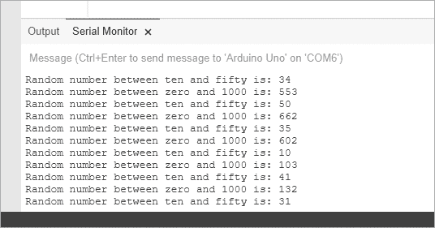

图 6-1：来自 列表 6-1 的输出

现在你已经知道如何生成随机数，让我们通过创建电子骰子来好好利用这项知识。

## 项目 #15：创建一个电子骰子

我们的目标是随机点亮六个 LED 中的一个，模拟投掷骰子的过程。我们将选择一个介于 1 和 6 之间的随机数字，然后点亮相应的 LED 来表示结果。我们将创建一个函数，随机选择 Arduino 上的六个 LED 中的一个，并让该 LED 保持亮起一段时间。当运行草图的 Arduino 打开或重置时，它应该快速显示随机的 LED 一段指定的时间，然后逐渐减慢闪烁，直到最终 LED 被点亮。与结果匹配的随机选择的 LED 将保持亮起，直到 Arduino 被重置或关闭。

### 硬件

要构建这个骰子，我们需要以下硬件：

+   六个任意颜色的 LED（LED1 到 LED6）

+   一个 560 Ω 电阻（R1）

+   各种连接线

+   一个中型面包板

+   Arduino 和 USB 电缆

### 原理图

由于一次只有一个 LED 会亮起，所以可以在 LED 的阴极和 GND 之间放置一个限流电阻。图 6-2 显示了我们的骰子原理图。

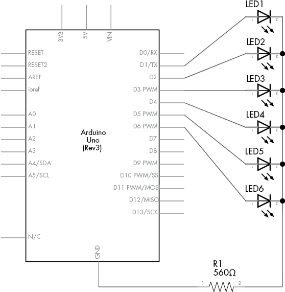

图 6-2：项目 15 的原理图

### 草图

这是我们骰子的草图：

```
// Project 15 - Creating an Electronic Die
void setup()
{ randomSeed(analogRead(0));      // seed the random number generator for ( int z = 1 ; z < 7 ; z++ ) // LEDs on pins 1-6 are output { pinMode(z, OUTPUT); }
}void randomLED(int del)
{ int r; r = random(1, 7);      // get a random number from 1 to 6 digitalWrite(r, HIGH); // output to the matching LED on digital pin 1-6 if (del > 0) {1     delay(del);          // hold the LED on for the delay received }2     else if (del == 0) { do                   // delay entered was zero, hold the LED on forever {}3     while (1);  } digitalWrite(r, LOW);  // turn off the LED
}
void loop()
{ int a; // cycle the LEDs around for effect for ( a = 0 ; a < 100 ; a++ )  { randomLED(50); } // slow down4   for ( a = 1 ; a <= 10 ; a++ )  { randomLED(a * 100); } // and stop at the final random number and LED randomLED(0);
}
```

在这里，我们在 `void setup()` 中使用循环来激活数字输出引脚。`randomLED()` 函数接收一个整数，该整数用于 `delay()` 函数中的延迟 1，确保 LED 在选定的时间内保持亮起。如果在延迟 2 中接收到的值是 `0`，则该函数将使 LED 永远保持亮起，因为我们使用的是

```
 do {} while (1);
```

在第 3 行，它会无限循环，因为 1 始终为 1。

要“投掷骰子”，我们重置 Arduino 来重新启动草图。为了在最终值显示之前逐渐减慢 LED 的变化，我们首先以每次 50 毫秒的间隔随机显示一个 LED 100 次。然后，在第 4 行，我们通过将 LED 闪烁之间的延迟从 100 毫秒增加到 1,000 毫秒来减慢闪烁，每次闪烁持续 100 毫秒。这样做的目的是模拟骰子“减速”的过程，直到它最终停留在某个值上。最后一行，Arduino 通过保持一个 LED 点亮来显示投掷结果：

```
 randomLED(0);
```

### 修改草图

我们可以以多种方式修改这个项目。例如，我们可以再增加六个 LED 来同时投掷两个骰子，或者仅用内置 LED 显示结果，通过闪烁若干次来表示投掷的结果。或者使用按钮重新投掷骰子。发挥你的想象力和新技能，来玩得开心吧！

## 二进制快速入门

大多数孩子使用十进制系统来学习计数，但计算机（包括 Arduino）使用二进制数字系统来计数。

### 二进制数字

*二进制数字* 仅由 1 和 0 组成——例如，10101010。在二进制中，从右到左的每个数字代表该列数字的 2 的幂（从右到左依次增加）。每一列的积相加后，得到数字的值。

例如，考虑二进制数 10101010，如 表 6-1 所示。要将二进制数 10101010 转换为十进制，我们将表格底行中列出的每一列的总和相加：

128 + 0 + 32 + 0 + 8 + 0 + 2 + 0

总和为 170，因此二进制数 10101010 在十进制中等于 170。一个有八列（或 *位*）的二进制数包含 1 个 *字节* 的数据；1 字节的数据可以有从 0 到 255 的数值。最左边的位被称为 *最重要位（MSB）*，最右边的是 *最不重要位（LSB）*。

表 6-1：二进制到十进制数字转换示例

| **2⁷** | **2⁶** | **2⁵** | **2⁴** | **2³** | **2²** | **2¹** | **2⁰** |  |
| --- | --- | --- | --- | --- | --- | --- | --- | --- |
| 1 | 0 | 1 | 0 | 1 | 0 | 1 | 0 | 二进制 |
| 128 | 64 | 32 | 16 | 8 | 4 | 2 | 1 | 十进制 |

二进制数非常适合存储某些类型的数据，例如 LED 的开/关模式、真/假设置以及数字输出的状态。二进制数是计算机中所有类型数据的构建块。

### 字节变量

存储二进制数的一种方法是使用 *字节变量*。例如，我们可以使用以下代码创建字节变量 `outputs`：

```
byte outputs = B11111111;
```

`B` 前缀告诉 Arduino 将数字作为二进制数读取（在此情况下为 11111111），而不是其十进制等价物 255。 列表 6-2 进一步演示了这一点。

```
// Listing 6-2
byte a; 
void setup()
{ Serial.begin(9600);
}
void loop()
{ for ( int count = 0 ; count < 256 ; count++ ) { a = count; Serial.print("Base-10 = ");1     Serial.print(a, DEC); Serial.print(" Binary = ");2     Serial.println(a, BIN); delay(1000); }
}
```

列表 6-2：二进制数演示

我们可以通过 `DEC` 1 以十进制数显示字节变量，或者通过 `BIN` 2 以二进制数显示字节变量，作为 `Serial.print()` 函数的一部分。上传代码后，您应该能在串口监视器中看到类似于 图 6-3 所示的输出。


图 6-3：列表 6-2 输出

## 使用移位寄存器增加数字输出

Arduino 板有 13 个数字引脚可以用作输出——但有时候 13 个不够用。为了增加输出，我们可以使用 *移位寄存器*，并且仍然可以在 Arduino 上留下大量空余空间用于输出。移位寄存器是一个集成电路（IC），它具有八个数字输出引脚，可以通过向 IC 发送一字节的数据来控制它。在我们的项目中，我们将使用 图 6-4 中显示的 74HC595 移位寄存器。

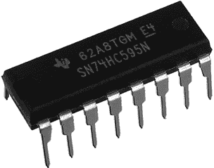

图 6-4：74HC595 移位寄存器 IC

74HC595 移位寄存器具有八个数字输出，可以像 Arduino 数字输出引脚一样操作。移位寄存器本身占用了三个 Arduino 数字输出引脚，因此净增的是五个输出引脚。

移位寄存器的原理很简单：我们向移位寄存器发送 1 字节数据（8 位），它根据该 1 字节数据的值打开或关闭相应的八个输出。数据的位与输出引脚按从高到低的顺序匹配，因此数据的最左边位表示移位寄存器的输出引脚 7，最右边的位表示输出引脚 0。例如，如果我们将`B10000110`发送到移位寄存器，它将打开输出 1、2 和 7，并关闭输出 0 和 3 到 6，直到接收到下一个字节数据或电源被关闭。

可以将多个移位寄存器连接在一起，为每个连接到相同三个 Arduino 引脚的移位寄存器提供额外的八个数字输出引脚；当你需要控制大量 LED 时，移位寄存器非常方便。现在让我们通过创建一个二进制数字显示来实现这一点。

## 项目#16：创建一个 LED 二进制数字显示器

在这个项目中，我们将使用八个 LED 来显示从 0 到 255 的二进制数字。我们的草图将使用一个`for`循环从 0 到 255 计数，并将每个值发送到移位寄存器，移位寄存器将使用 LED 显示每个数字的二进制等效值。

### 硬件

需要以下硬件：

+   一个 74HC595 移位寄存器 IC

+   八个 LED（LED1 至 LED8）

+   八个 560Ω电阻（R1 至 R8）

+   一个面包板

+   各种连接线

+   Arduino 和 USB 连接线

### 电路图

图 6-5 展示了 74HC595 的电路符号。

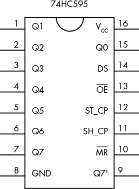

图 6-5：74HC595 电路符号

我们的移位寄存器有 16 个引脚：

+   引脚 15 和 1 到 7 是我们控制的八个输出引脚（分别标记为*Q0*到*Q7*）。

+   Q7 输出发送到移位寄存器的第一个位，Q0 输出最后一个位。

+   引脚 8 连接到 GND。

+   引脚 9 称为*数据输出*，用于将数据发送到另一个移位寄存器（如果存在的话）。

+   引脚 10 始终连接到 5V（例如，Arduino 上的 5V 连接器）。

+   引脚 11 和 12 分别称为*时钟*和*锁存*。

+   引脚 13 称为*输出使能*，通常连接到 GND。

+   引脚 14 用于接收来自 Arduino 的输入位数据。

+   引脚 16 用于电源：来自 Arduino 的 5V 电压。

为了让你了解引脚的布局，移位寄存器 IC 左端的半圆形凹槽位于引脚 1 和 16 之间，正如图 6-4 所示。

引脚按顺时针方向依次编号，正如在图 6-6 所示，这张图展示了我们的 LED 二进制数字显示电路图。

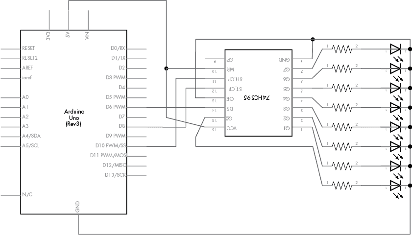

图 6-6：项目 16 的电路图

### 程序草图

接下来是草图：

```
// Project 16 – Creating an LED Binary Number Display
#define DATA  6          // digital 6 to pin 14 on the 74HC595
#define LATCH 8          // digital 8 to pin 12 on the 74HC595
#define CLOCK 10         // digital 10 to pin 11 on the 74HC595
void setup()
{ pinMode(LATCH, OUTPUT); pinMode(CLOCK, OUTPUT); pinMode(DATA, OUTPUT);
}
void loop()
{ int i; for ( i = 0; i < 256; i++ ) { digitalWrite(LATCH, LOW); shiftOut(DATA, CLOCK, MSBFIRST, i); digitalWrite(LATCH, HIGH); delay(200); }
}
```

在这个草图中，我们在`void setup()`中将连接到移位寄存器的三个引脚设置为输出，然后在`void loop()`中添加一个从 0 到 255 的循环并重复。当我们在`for`循环中将一个数据字节（例如，240，或`B11110000`）发送到移位寄存器时，发生了三件事：

+   锁存引脚 12 设置为`LOW`（即，从 Arduino 数字输出引脚 8 提供一个低电平信号）。这是为将输出引脚 12 设置为`HIGH`做准备，当`shiftOut()`完成其任务后，数据将被锁存到输出引脚。

+   我们将数据字节（例如，`B11110000`）从 Arduino 数字引脚 6 发送到移位寄存器，并告诉`shiftOut()`函数从哪个方向解释该数据字节。例如，如果我们选择了`LSBFIRST`，那么 LED 1 到 4 会亮起，其它的会熄灭。如果我们使用`MSBFIRST`，那么 LED 5 到 8 会亮起，其它的会熄灭。

+   最后，锁存引脚 12 设置为`HIGH`（为其提供 5 V 电压）。这告诉移位寄存器所有的位已经移入并且准备好了。在此时，移位寄存器会调整其输出，以匹配接收到的数据。

## 项目 #17：制作二进制问答游戏

在这个项目中，我们将使用随机数、串口监视器以及项目 16 中创建的电路来制作一个二进制问答游戏。Arduino 将通过 LED 显示一个随机的二进制数，然后你将使用串口监视器输入该二进制数的十进制版本。串口监视器将告诉你答案是否正确，游戏将继续进行并显示一个新的数字。

### 算法

该算法可以分为三个函数。`displayNumber()`函数将使用 LED 显示一个二进制数。`getAnswer()`函数将从串口监视器接收一个数字并显示给用户。最后，`checkAnswer()`函数将用户输入的数字与生成的随机数进行比较，并显示正确/错误状态，如果猜测错误，还会显示正确答案。

### 草图

这个草图会生成一个介于 0 和 255 之间的随机数，使用 LED 以二进制形式显示它，要求用户给出答案，然后在串口监视器中显示结果。你已经见过草图中使用的所有函数，虽然这里有很多代码，但它应该看起来很熟悉。我们将在草图中通过注释和以下的解释来分析它：

```
// Project 17 - Making a Binary Quiz Game
#define DATA   6                 // connect to pin 14 on the 74HC595
#define LATCH  8                 // connect to pin 12 on the 74HC595
#define CLOCK 10                 // connect to pin 11 on the 74HC595
int number = 0;
int answer = 0;1 void setup()
{ pinMode(LATCH, OUTPUT);        // set up the 74HC595 pins pinMode(CLOCK, OUTPUT); pinMode(DATA, OUTPUT); Serial.begin(9600); randomSeed(analogRead(0));     // initialize the random number generator displayNumber(0);              // clear the LEDs
}2 void displayNumber(byte a)
{ // send byte to be displayed on the LEDs digitalWrite(LATCH, LOW); shiftOut(DATA, CLOCK, MSBFIRST, a); digitalWrite(LATCH, HIGH);
}3 void getAnswer()
{ // receive the answer from the player int z = 0; Serial.flush(); while (Serial.available() == 0) { // do nothing until something comes into the serial buffer } // one character of serial data is available, begin calculating while (Serial.available() > 0) { // move any previous digit to the next column on the left; in  // other words, 1 becomes 10 while there is data in the buffer answer = answer * 10; // read the next number in the buffer and subtract the character '0'  // from it to convert it to the actual integer number z = Serial.read() - '0'; // add this digit into the accumulating value answer = answer + z; // allow a short delay for any more numbers to come into Serial.available delay(5); } Serial.print("You entered: "); Serial.println(answer);
}4 void checkAnswer()
{ // check the answer from the player and show the results if (answer == number)    // Correct! { Serial.print("Correct! "); Serial.print(answer, BIN); Serial.print(" equals "); Serial.println(number); Serial.println(); } else                     // Incorrect { Serial.print("Incorrect, "); Serial.print(number, BIN); Serial.print(" equals "); Serial.println(number); Serial.println();     } answer = 0; delay(10000); // give the player time to review their answer
}5 void loop(){ number = random(256); displayNumber(number); Serial.println("What is the binary number in base 10? "); getAnswer();   checkAnswer();
}
```

让我们回顾一下这个草图是如何工作的。在 1，`void setup()`配置了数字输出引脚以使用移位寄存器，启动了串行监视器，并为随机数生成器提供了种子。在 2，定制函数`displayNumber()`接受一个字节的数据并将其发送到移位寄存器，后者通过连接的 LED 以二进制形式显示该字节（如在项目 16 中）。在 3，定制函数`getAnswer()`通过串行监视器接受用户输入的数字（如第五章项目 14 中所示），并显示出来，如图 6-7 所示。

在 4，函数`checkAnswer()`将玩家在`getAnswer()`中输入的数字与草图在`void loop()`中生成的随机数字进行比较。然后，程序会根据二进制和十进制值提示玩家是否答对。最后，在程序运行的主`void loop()`中，Arduino 生成用于测验的随机二进制数，调用匹配的函数通过硬件显示出来，然后接收并检查玩家的答案。

图 6-7 展示了串行监视器中的游戏画面。


图 6-7：项目 17 进行中

## 数组

*数组*是一组变量或值，它们被分组在一起，以便可以作为一个整体来引用。当处理大量相关数据时，使用数组来保持数据的组织是一个不错的主意。

### 定义一个数组

数组中的每一项称为*元素*。例如，假设有六个`float`变量，存储过去六小时内的温度数据；与其为每个变量命名，我们可以定义一个名为`temperatures`的数组，包含六个元素，代码如下：

```
float temperatures[6];
```

我们也可以在定义数组时插入值。这样做时，我们不需要定义数组的大小。以下是一个例子：

```
float temperatures[]={11.1, 12.2, 13.3, 14.4, 15.5, 16.6};
```

请注意，这次我们没有在方括号（`[]`）内显式定义数组的大小；相反，它的大小是根据花括号（`{}`）内设置的元素数量来推断的。请注意，任何大小的数组只能包含一种类型的变量。

### 引用数组中的值

我们从左开始，以 0 为起点来计数数组中的元素；`temperatures[]`数组的元素编号从 0 到 5。我们可以通过在方括号中插入元素的编号来引用数组中的单个值。例如，要将`temperatures[]`中的第一个元素（当前值为`11.1`）更改为`12.34`，我们可以使用以下代码：

```
 temperatures[0] = 12.34;
```

### 向数组写入和从数组读取

在列表 6-3 中，我们演示了向一个包含五个元素的数组写入和读取值。草图中的第一个`for`循环将一个随机数写入数组的每个元素，第二个`for`循环检索这些元素并在串行监视器中显示它们。

```
// Listing 6-3
void setup()
{ Serial.begin(9600); randomSeed(analogRead(0)); 
}
int array[5];    // define our array of five integer elements
void loop()
{ int i; Serial.println(); for ( i = 0 ; i < 5 ; i++ )   // write to the array { array[i] = random(10);      // random numbers from 0 to 9 } for ( i = 0 ; i < 5 ; i++ )   // display the contents of the array { Serial.print("array["); Serial.print(i); Serial.print("] contains "); Serial.println(array[i]);  } delay(5000);
}
```

列表 6-3：数组读写演示

图 6-8 展示了该草图在串行监视器中的输出。

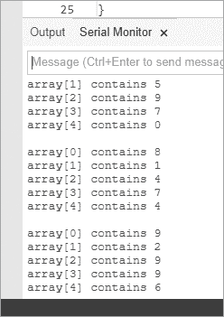

图 6-8：清单 6-3 运行示例

现在你已经了解了如何使用二进制数、移位寄存器和数组，是时候将这些知识付诸实践了。在我们的下一个项目中，我们将连接一些数字显示器。

## 七段 LED 显示器

LED 很有趣，但显示单一灯光的数据种类是有限的。在这一部分中，我们将开始使用七段 LED 显示器显示数字，如图 6-9 所示。

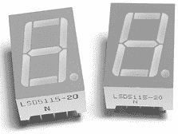

图 6-9：七段显示模块

这些显示器非常适合显示数字，这就是为什么你会在数字闹钟、速度计等设备中看到它们的原因。每个七段 LED 显示模块由八个 LED 组成，模块也有不同的颜色。为了减少显示器使用的引脚数量，所有 LED 的正极或负极都连接在一起——这些模块分别称为*共阳极*或*共阴极*模块。我们的项目将使用共阴极模块。

显示器的 LED 被标记为*A* 到 *G* 和 *DP*（表示小数点）。每个 LED 段都有一个正极引脚，而负极连接到一个公共负极引脚。七段 LED 显示的布局始终按照图 6-10 中所示的方式描述，LED 段 A 在顶部，B 在其右侧，以此类推。因此，例如，如果你想显示数字 7，则需要给 A、B 和 C 段供电。

每个 LED 显示模块的引脚可能会有所不同，具体取决于制造商，但它们总是遵循图 6-10 中显示的基本模式。当你使用这些模块时，务必从零售商那里获取模块的数据手册，以帮助你节省确定哪些引脚是哪个的时间。

我们将使用图 6-11 中显示的原理图符号来表示我们的七段 LED 显示模块。

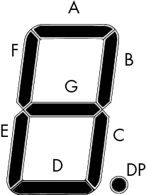

图 6-10：典型七段显示模块的 LED 图

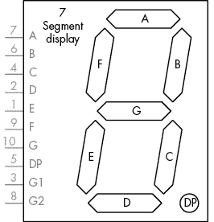

图 6-11：七段显示模块的原理图符号

### 控制 LED

我们将使用在项目 17 中讨论的方法，通过将引脚 A 到 DP 连接到移位寄存器输出 Q0 到 Q7 来控制 LED 显示。使用表 6-2 中显示的矩阵作为指南，帮助确定哪些段需要打开或关闭，以显示特定的数字或字母。

矩阵的第一行是控制第二行段的移位寄存器输出引脚。下面的每一行显示的是可以显示的数字，并包含发送到移位寄存器的相应二进制和十进制值。

表 6-2：显示段矩阵

| **SR** | **Q0** | **Q1** | **Q2** | **Q3** | **Q4** | **Q5** | **Q6** | **Q7** |  |
| --- | --- | --- | --- | --- | --- | --- | --- | --- | --- |
| **段** | **A** | **B** | **C** | **D** | **E** | **F** | **G** | **DP** | **小数点** |
| --- | --- | --- | --- | --- | --- | --- | --- | --- | --- |
| **0** | 1 | 1 | 1 | 1 | 1 | 1 | 0 | 0 | 252 |
| **1** | 0 | 1 | 1 | 0 | 0 | 0 | 0 | 0 | 96 |
| **2** | 1 | 1 | 0 | 1 | 1 | 0 | 1 | 0 | 218 |
| **3** | 1 | 1 | 1 | 1 | 0 | 0 | 1 | 0 | 242 |
| **4** | 0 | 1 | 1 | 0 | 0 | 1 | 1 | 0 | 102 |
| **5** | 1 | 0 | 1 | 1 | 0 | 1 | 1 | 0 | 182 |
| **6** | 1 | 0 | 1 | 1 | 1 | 1 | 1 | 0 | 190 |
| **7** | 1 | 1 | 1 | 0 | 0 | 0 | 0 | 0 | 224 |
| **8** | 1 | 1 | 1 | 1 | 1 | 1 | 1 | 0 | 254 |
| **9** | 1 | 1 | 1 | 1 | 0 | 1 | 1 | 0 | 246 |
| **A** | 1 | 1 | 1 | 0 | 1 | 1 | 1 | 0 | 238 |
| **B** | 0 | 0 | 1 | 1 | 1 | 1 | 1 | 0 | 62 |
| **C** | 1 | 0 | 0 | 1 | 1 | 1 | 0 | 0 | 156 |
| **D** | 0 | 1 | 1 | 1 | 1 | 0 | 1 | 0 | 122 |
| **E** | 1 | 0 | 0 | 1 | 1 | 1 | 1 | 0 | 158 |
| **F** | 1 | 0 | 0 | 0 | 1 | 1 | 1 | 0 | 142 |

例如，要显示数字 7，如 图 6-12 所示，我们需要点亮 LED 段 A、B 和 C，它们分别对应移位寄存器的输出 Q0、Q1 和 Q2。因此，我们将字节 `B1110000` 发送到移位寄存器（`shiftOut()` 设置为 `LSBFIRST`），以点亮与所需的 LED 相匹配的前 3 个输出。

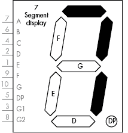

图 6-12：显示数字 7

在我们的下一个项目中，我们将创建一个电路，依次显示数字 0 到 9，然后显示字母 A 到 F。循环会重复，并且小数点 LED 会亮起。

## 项目 #18：创建一个单数字显示器

在这个项目中，我们将组装一个电路来使用单数字显示器。

### 硬件

以下硬件是必需的：

+   一个 74HC595 移位寄存器 IC

+   一个共阴极七段 LED 显示器

+   一个 560 Ω 电阻（R1）

+   一个大号面包板

+   各种连接电线

+   Arduino 和 USB 电缆

### 原理图

原理图如 图 6-13 所示。

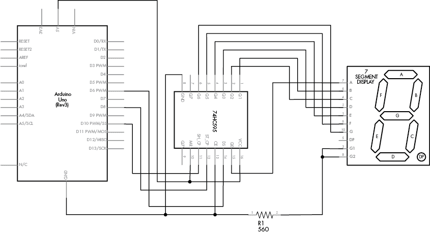

图 6-13：项目 18 的原理图

当你将 LED 模块接线到移位寄存器时，LED 引脚 A 到 G 分别连接到 Q0 到 Q6 引脚，而 DP 连接到 Q7。

### 草图

在项目 18 的草图中，我们将十进制值（见 表 6-2）存储在 `int digits[]` 数组中。在 `void loop()` 中，我们按顺序将这些值发送到移位寄存器，首先是 1，然后通过在发送到移位寄存器的值上加 1 来重复该过程并开启小数点：

```
// Project 18 - Creating a Single-Digit Display
#define DATA  6                       // connect to pin 14 on the 74HC595
#define LATCH 8                       // connect to pin 12 on the 74HC595
#define CLOCK 10                      // connect to pin 11 on the 74HC595
// set up the array with the segments for 0 to 9, A to F (from Table 6-2)
int digits[] = {252, 96, 218, 242, 102, 182, 190, 224, 254, 246, 238, 62, 156, 122, 158, 142};
void setup()
{ pinMode(LATCH, OUTPUT); pinMode(CLOCK, OUTPUT); pinMode(DATA, OUTPUT);
}
void loop()
{ int i; for ( i = 0 ; i < 16 ; i++ )   // display digits 0-9, A-F { digitalWrite(LATCH, LOW);1 shiftOut(DATA, CLOCK, LSBFIRST, digits[i]); digitalWrite(LATCH, HIGH); delay(250); } for ( i = 0 ; i < 16 ; i++ )   // display digits 0-9, A-F with DP { digitalWrite(LATCH, LOW);2 shiftOut(DATA, CLOCK, LSBFIRST, digits[i]+1); // +1 is to turn on the DP bit digitalWrite(LATCH, HIGH); delay(250); }
}
```

七段 LED 显示器亮度高，易于阅读。例如，图 6-14 显示了此草图在请求显示数字 9 时的结果，带有小数点。

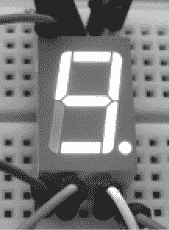

图 6-14：项目 18 显示的数字

### 修改草图：显示双位数字

要使用多个移位寄存器来控制额外的数字输出，请将 74HC595 的 9 号引脚（接收来自 Arduino 的数据）连接到第二个移位寄存器的 14 号引脚。一旦完成此连接，两个字节的数据将被发送：第一个字节控制第二个移位寄存器，第二个字节控制第一个移位寄存器。以下是一个示例：

```
 digitalWrite(LATCH, LOW); shiftOut(DATA, CLOCK, MSBFIRST, 254); // data for second 74HC595 shiftOut(DATA, CLOCK, MSBFIRST, 254); // data for first 74HC595 digitalWrite(LATCH, HIGH);
```

## 项目#19：控制两个七段 LED 显示模块

该项目将向您展示如何控制两个七段 LED 显示模块，从而能够显示两位数字。

### 硬件

以下硬件是必需的：

+   两个 74HC595 移位寄存器 IC

+   两个共阴极七段 LED 显示器

+   两个 560Ω电阻（R1 到 R2）

+   一个大型面包板或两个较小的单元

+   各种连接线

+   Arduino 和 USB 电缆

### 原理图

图 6-15 显示了两个显示模块的原理图。

请注意，移位寄存器的数据和时钟引脚相互连接，然后连接到 Arduino。来自 Arduino 数字引脚 6 的数据线连接到移位寄存器 1，然后从移位寄存器 1 的 9 号引脚连接到移位寄存器 2 的 14 号引脚。

为了显示 0 到 99 之间的数字，我们需要一个更复杂的草图。如果数字小于 10，我们只需发送该数字后跟一个 0，因为右侧的数字将显示该数字，而左侧的数字将显示 0。然而，如果数字大于 10，那么我们需要确定该数字的两位数字，并将它们分别发送到移位寄存器。为了简化这一过程，我们将使用数学函数模运算。

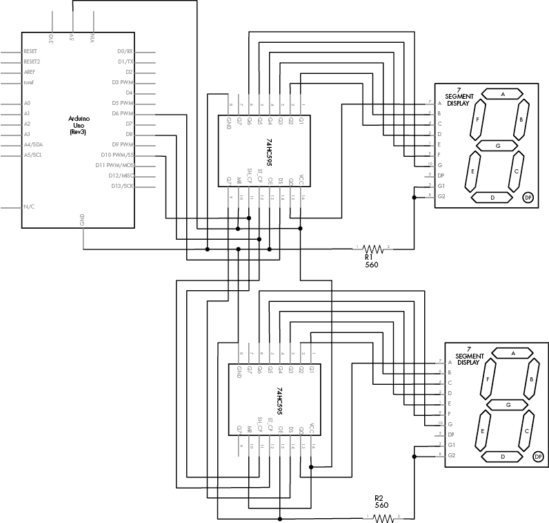

图 6-15：项目 19 的原理图

### 模运算

*模运算*是一个返回除法操作余数的函数。例如，10 模（或*mod*）7 等于 3——换句话说，10 除以 7 的余数是 3。我们使用百分号（`%`）表示模运算。以下示例在草图中使用了模运算：

```
int a = 8;
int b = 3;
int c = a % b;
```

在这个示例中，`c`的值将是`2`。因此，要确定两位数字的右侧数字，我们使用模运算函数*，*它返回除以两个数字后的余数。

为了自动化显示单个或双位数字，我们将为我们的草图创建函数`displayNumber()`。我们在该函数中使用模运算来分离两位数字的每一位。例如，若要显示数字 23，我们首先通过将 23 除以 10 来提取左侧数字，结果是 2（我们可以忽略的小数部分）。为了提取右侧数字，我们执行 23 模 10 运算，结果是 3：

```
// Project 19 - Controlling Two Seven-Segment LED Display Modules
// set up the array with the segments for 0 to 9, A to F (from Table 6-2)
#define DATA  6            // connect to pin 14 on the 74HC595
#define LATCH 8            // connect to pin 12 on the 74HC595
#define CLOCK 10           // connect to pin 11 on the 74HC595
void setup()
{ pinMode(LATCH, OUTPUT); pinMode(CLOCK, OUTPUT); pinMode(DATA, OUTPUT);
}
int digits[] = {252, 96, 218, 242, 102, 182, 190, 224, 254, 246, 238, 62, 156, 122, 158, 142};
void displayNumber(int n)
{ int left, right=0;1   if (n < 10) { digitalWrite(LATCH, LOW); shiftOut(DATA, CLOCK, LSBFIRST, digits[n]); shiftOut(DATA, CLOCK, LSBFIRST, 0);   digitalWrite(LATCH, HIGH); } else if (n >= 10) {2     right = n % 10; // remainder of dividing the number to display by 10 left = n / 10;  // quotient of dividing the number to display by 10 digitalWrite(LATCH, LOW); shiftOut(DATA, CLOCK, LSBFIRST, digits[right]); shiftOut(DATA, CLOCK, LSBFIRST, digits[left]);     digitalWrite(LATCH, HIGH); }
}3 void loop()
{ int i; for ( i = 0 ; i < 100 ; i++ ) { displayNumber(i); delay(100); }
}
```

在 1 处，函数检查要显示的数字是否小于 10。如果是，它将数字数据和一个空白数字发送到移位寄存器。但是，如果数字大于 10，函数将在 2 处使用模运算和除法来分离数字，然后将它们分别发送到移位寄存器。最后，在`void loop()`的 3 处，我们设置并调用函数来显示从 0 到 99 的数字。

## 项目 #20：制作数字温度计

在这个项目中，我们将把第四章项目 8 中创建的 TMP36 温度传感器，添加到项目 19 中构建的双数字电路上，制作一个能够显示 0 度及以上温度的数字温度计。算法非常简单：我们读取 TMP36 返回的电压（使用第五章项目 12 中的方法），并将读取值转换为摄氏度。

### 硬件

以下硬件是必需的：

+   项目 19 中的双数字电路

+   一个 TMP36 温度传感器

将 TMP36 的中心输出引脚连接到模拟引脚 5，左侧引脚连接到 5V，右侧引脚连接到 GND，这样你就可以开始测量了。

### 草图

这是草图：

```
// Project 20 - Creating a Digital Thermometer
#define DATA  6             // connect to pin 14 on the 74HC595
#define LATCH 8             // connect to pin 12 on the 74HC595
#define CLOCK 10            // connect to pin 11 on the 74HC595 
int temp = 0;
float voltage = 0;
float celsius = 0;
float sensor = 0;
int digits[]={ 252, 96, 218, 242, 102, 182, 190, 224,  254, 246, 238, 62, 156, 122, 158, 142
};
void setup()
{ pinMode(LATCH, OUTPUT); pinMode(CLOCK, OUTPUT); pinMode(DATA, OUTPUT);
}
void displayNumber(int n)
{ int left, right = 0; if (n < 10) { digitalWrite(LATCH, LOW); shiftOut(DATA, CLOCK, LSBFIRST, digits[n]); shiftOut(DATA, CLOCK, LSBFIRST, digits[0]);     digitalWrite(LATCH, HIGH); } if (n >= 10) { right = n % 10; left = n / 10; digitalWrite(LATCH, LOW); shiftOut(DATA, CLOCK, LSBFIRST, digits[right]); shiftOut(DATA, CLOCK, LSBFIRST, digits[left]);     digitalWrite(LATCH, HIGH); }
}
void loop()
{ sensor = analogRead(5);       voltage = (sensor * 5000) / 1024; // convert raw sensor value to millivolts voltage = voltage - 500;          // remove voltage offset celsius = voltage / 10;           // convert millivolts to Celsius temp = int(celsius); // change the floating-point temperature to an int displayNumber(temp); delay(500);
}
```

如图所示，这个草图借用了之前项目的代码：来自项目 19 的 `displayNumber()` 和来自项目 12 的温度计算。草图倒数第二行的 `delay(500)` 函数使得温度波动时，显示不会变化得太快。

## 展望未来

在这一章节中，你已经学习了很多基本技能，这些技能你将在自己的项目中反复使用。LED 显示屏相对耐用，因此可以尽情地进行实验。然而，它们能用来展示的效果是有限的，所以在下一章节中，我们将使用更为详细的文本和图形显示方法。
