# 第七章：扩展你的 Arduino

本章内容：

+   了解各种 Arduino 扩展板

+   使用 ProtoShield 制作自己的 Arduino 扩展板

+   了解 Arduino 库如何扩展可用功能

+   使用存储卡模块记录可以在电子表格中分析的数据

+   构建一个温度记录设备

+   学习如何使用`micros()`和`millis()`制作秒表

+   理解 Arduino 中断及其用途

扩展 Arduino 功能的另一种方式是使用扩展板。*扩展板*是通过引脚连接到 Arduino 两侧插座的电路板。在本章的第一个项目中，你将学习如何制作自己的扩展板。随着你在电子学和 Arduino 方面的实验，你可以通过将电路构建到*ProtoShield*上来使电路更加永久化，ProtoShield 是一个空白的印刷电路板，你可以用它安装定制电路。

接下来，我将介绍存储卡模块。我们将在本章中使用它来创建一个温度记录设备，用于记录随时间变化的温度；该扩展板将用于记录来自 Arduino 的数据，并将其转移到其他地方进行分析。

你将学习`micros()`和`millis()`函数，这两个函数在计时方面非常有用，正如你在秒表项目中看到的那样。最后，我们将研究中断。

## 扩展板

你可以通过连接扩展板来为你的 Arduino 板添加功能。市场上有数百种扩展板，它们可以组合或堆叠在一起协同工作。例如，一个流行的项目将 GPS 扩展板与 microSD 存储卡扩展板结合在一起，创建一个记录和存储位置的设备，记录的内容可以是汽车的行驶轨迹或新的徒步旅行路径的位置。其他项目包括以太网适配器，允许 Arduino 连接互联网（图 7-1）。

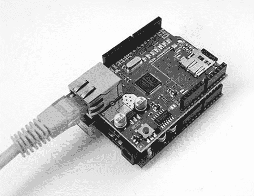

图 7-1：Arduino Uno 上的以太网扩展板

GPS 卫星接收器可以让你跟踪 Arduino 的位置（图 7-2）。MicroSD 存储卡接口让 Arduino 将数据存储到存储卡上（图 7-3）。

图 7-4 显示了一个堆叠的组合，包括一个 Arduino Uno，一个可以记录数据的 microSD 存储卡扩展板，一个用于连接互联网的以太网扩展板，以及一个用于显示信息的 LCD 扩展板。

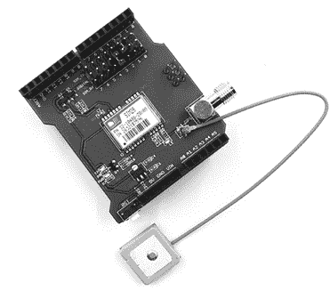

图 7-2：一个 GPS 接收器扩展板（带有单独的 GPS 模块）

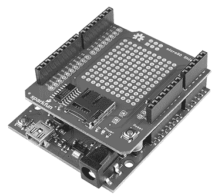

图 7-3：MicroSD 卡扩展板

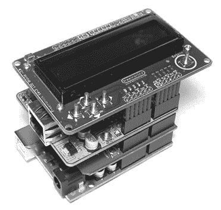

图 7-4：一个堆叠的扩展板组合，包含一个 Arduino Uno

## ProtoShields

你可以在线购买各种扩展板，或者使用 ProtoShield 自己制作扩展板。ProtoShield 是一个空白电路板，你可以用它制作自己的永久 Arduino 扩展板。ProtoShields 有预组装版或套件形式，类似于图 7-5 中展示的那种。

ProtoShield 还可以作为无焊接面包板的良好基础，因为它可以将小电路保持在你 Arduino 创作的物理边界内（如图 7-6 所示）。较小的无焊接面包板适合放置在插座的行内，可以使用可重复使用的 Blu Tack 胶泥暂时固定在电路板上，或者使用双面胶带更加永久性地安装。ProtoShield 还可以作为在面包板上测试过的电路的更永久性基础。

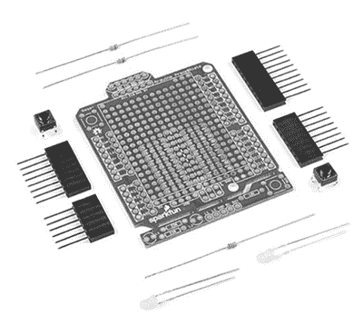

图 7-5：ProtoShield 套件

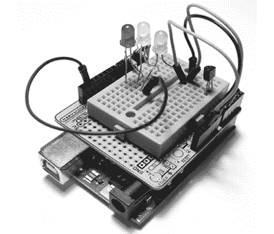

图 7-6：安装在 ProtoShield 无焊接面包板上的小项目示例

在 ProtoShield 上构建自定义电路需要一些前期规划。你需要设计电路，制作原理图，然后规划组件在 ProtoShield 上的布局。最后，你将电路焊接到你的自定义 Shield 上，但你应该始终先使用无焊接面包板进行测试，以确保电路正常工作。有些 ProtoShield 附带 PDF 原理图文件，可以下载并打印，专门用于绘制你的项目原理图。

## 项目#21：创建自定义 Shield

在这个项目中，你将创建一个包含两个 LED 和限流电阻的自定义 Shield。这个自定义 Shield 将使你在数字输出上实验 LED 变得更加容易。

### 硬件

本项目所需的硬件如下：

+   一个空白 Arduino ProtoShield，带有堆叠头

+   两个任何颜色的 LED

+   两个 560Ω电阻

+   两个 10kΩ电阻

+   两个按键

+   两个 100nF 电容

### 原理图

电路原理图见图 7-7。

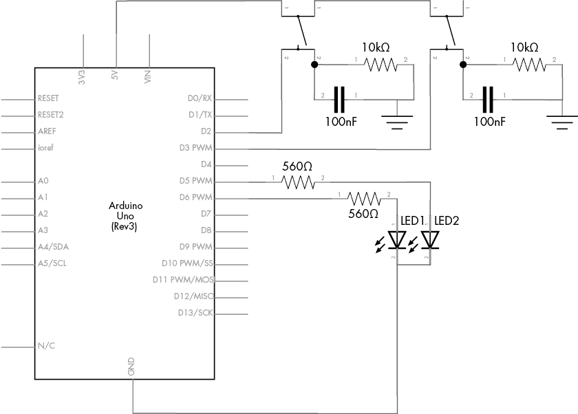

图 7-7：项目 21 的原理图

### ProtoShield 板的布局

下一步是了解 ProtoShield 上孔的布局。ProtoShield 上的孔的行列通常与无焊接面包板的行列匹配。然而，每个 ProtoShield 可能有所不同，因此请花时间确定孔的连接方式。在图 7-8 中展示的示例 ProtoShield 上，某些孔是连接的，正如孔之间的实线所示，但许多孔没有连接。这种设计为你使用 ProtoShield 提供了很大的灵活性。

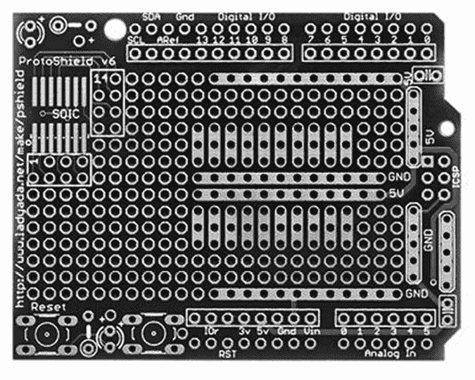

图 7-8：从上方展示的空白 ProtoShield

注意 ProtoShield 顶部和底部被矩形包围的两组孔：这是我们焊接堆叠头的位置，使 ProtoShield 能够插入 Arduino 板。

### 设计

你需要将图 7-7 所示的电路转换为适合你 ProtoShield 的物理布局。一个很好的方法是使用图纸布局电路，如图 7-9 所示。然后，你可以在图纸上标记连接的孔，并轻松地进行实验，直到找到适合你特定 ProtoShield 的布局。如果你没有图纸，可以在 [`www.printfreegraphpaper.com/.`](http://www.printfreegraphpaper.com/.) 上生成并打印自己的图纸。

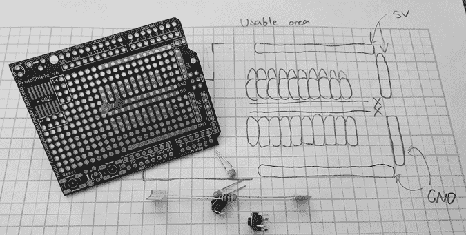

图 7-9：规划我们的定制扩展板

在你为电路绘制了计划图后，将元件进行测试安装，以确保它们能够安装进去且不会过于拥挤。如果 ProtoShield 上有空间放置复位按钮，最好添加一个，因为该扩展板会挡住你的 Arduino 上的 RESET 按钮。

### 焊接元件

一旦你对在 ProtoShield 上的电路布局感到满意，并且已经测试过电路以确保它正常工作，你就可以开始焊接元件了。使用焊接铁并不难，而且你不需要购买昂贵的焊接站来完成这类工作。一个额定功率为 25 到 40 瓦的简单焊接铁，比如图 7-10 中所示的那种，就足够用了。

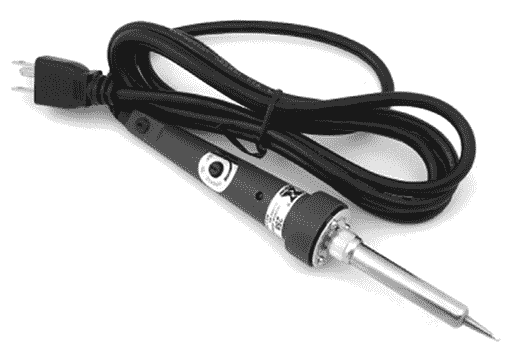

图 7-10：焊接铁

在焊接元件时，你可能需要使用少量的焊锡和剪下的导线将它们连接起来，如图 7-11 所示。

在进行焊接时，检查每个焊接点，因为在项目完成*之前*，错误更容易被发现并修复。当需要焊接四个插座或插针时，可以通过使用现有的扩展板来保持它们对齐，如图 7-12 所示。


图 7-11：焊接桥

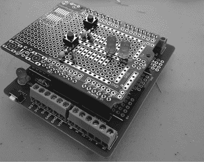

图 7-12：焊接插针

图 7-13 显示了完成的产品：一个带有两个 LED 和两个按钮的定制 Arduino 扩展板。

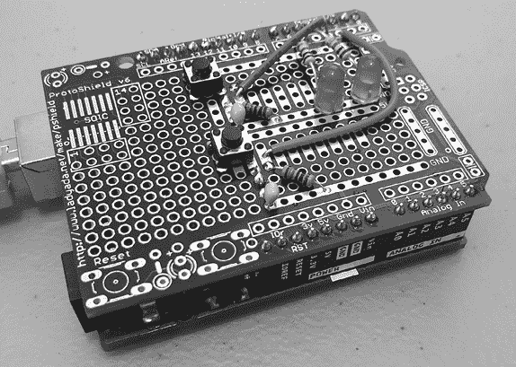

图 7-13：完成的定制扩展板

### 测试你的 ProtoShield

在继续之前，最好先测试 ProtoShield 的按钮和 LED。图 Listing 7-1 中的草图使用两个按钮来开关 LED。

```
// Listing 7-1: ProtoShield test
void setup() 
{ pinMode(2, INPUT); pinMode(3, INPUT); pinMode(5, OUTPUT); pinMode(6, OUTPUT);
}
void loop() 
{ if (digitalRead(2) == HIGH) { digitalWrite(5, HIGH); digitalWrite(6, HIGH); } if (digitalRead(3) == HIGH) { digitalWrite(5, LOW); digitalWrite(6, LOW); }
}
```

Listing 7-1：测试 ProtoShield 的按钮和灯光

## 使用库扩展草图

正如 Arduino 扩展板可以扩展我们的硬件一样，*库*可以为我们的草图添加有用的功能。这些功能允许我们使用特定制造商扩展板的硬件。任何人都可以创建库，就像各种 Arduino 扩展板的供应商经常编写他们自己的库来匹配他们的硬件一样。

Arduino IDE 已经包含了一些预安装的库。要在你的草图中使用它们，请选择 **Sketch**▶**Include Library**。你应该会看到一个包含 Ethernet、LiquidCrystal、Servo 等名称的预安装库集合。这些名称大多数都是自解释的。（如果本书中的项目需要使用某个库，将在这些页面中详细说明。）

如果你购买了一件新硬件，通常需要从硬件供应商的站点或提供的链接下载并安装其库。有两种方法可以安装 Arduino 库：下载库的 ZIP 文件或使用 Arduino 库管理器。我们通过演示下载 microSD 卡扩展板所需的库来看看这两种方法如何工作（图 7-3）。

### 下载 Arduino 库作为 ZIP 文件

首先，我们来尝试下载并安装一个 ZIP 格式的库。你将下载一个用于存储卡模块的高级库，以便读取和写入 microSD 和 SD 卡的数据：

1.  访问 [`github.com/greiman/SdFat/`](https://github.com/greiman/SdFat/) 并点击 **Code**。确保选择了 **HTTPS**，然后点击 **Download ZIP**，如图 7-14 所示。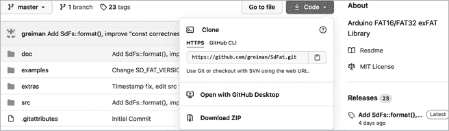

    图 7-14：库下载页面

1.  稍等片刻，*SdFat-master.zip* 文件将出现在你的 *Downloads* 文件夹中，如图 7-15 所示。如果你使用的是 Apple 电脑，ZIP 文件可能会自动解压。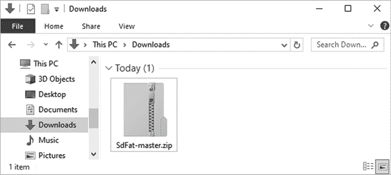

    图 7-15：包含 *SdFat-master.zip* 的 *Downloads* 文件夹

1.  打开 Arduino IDE，选择 **Sketch**▶**Include Library**▶**Add .ZIP Library**，如图 7-16 所示。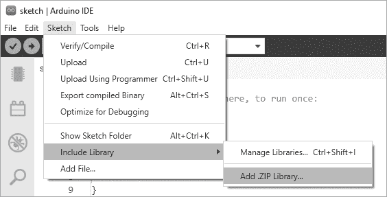

    图 7-16：开始库安装过程

    系统将显示一个文件管理对话框，如图 7-17 所示。导航到你的 *Downloads* 文件夹（或你保存 ZIP 文件的位置），然后点击 **Open**。

    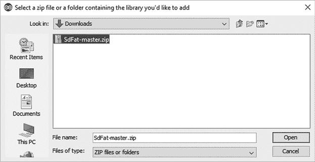

    图 7-17：定位 ZIP 文件

    现在，Arduino IDE 将负责库的安装。片刻之后，IDE 输出窗口将显示一条消息，通知你库已安装，如图 7-18 所示。

    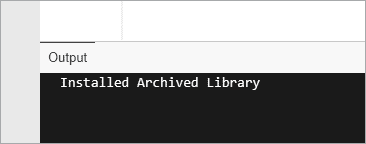

    图 7-18：Arduino 库安装成功

1.  你可以通过 IDE 的库管理器来验证 SdFat 库是否已安装并可用。为此，点击 IDE 左侧垂直组中的库管理器图标，然后在顶部的搜索框中搜索，或向下滚动直到看到你的库。例如，在图 7-19 中，你可以看到 SdFat 已出现在库管理器中。

    图 7-19：SdFat 库安装成功

### 使用库管理器导入 Arduino 库

安装 Arduino 库的另一种方式是通过 Arduino IDE 的内置库管理器。这个工具用于访问一个在线的库仓库，这些库对公众开放，且经过 Arduino 团队的个人批准，或者是非常流行的。通常，在硬件供应商的指示下，你会使用库管理器。

作为示例，我们将下载 FastLED Arduino 库，它是用于流行类型 RGB LED 的库。

为此，打开 Arduino IDE（如果还没有打开的话），然后打开库管理器。在管理器顶部的搜索框中输入**FastLED**，如图 7-20 所示。当你输入时，管理器会返回与你的搜索数据匹配的库，你会看到所需的库已经出现。

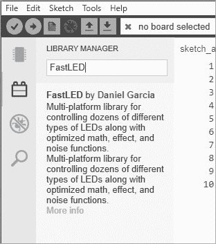

图 7-20：在库管理器中搜索

一旦在库管理器中找到并显示库，移动鼠标光标到库描述上。你可能会有选择版本号的选项。一般来说，默认会显示最新版本，你只需点击**安装**并等待安装完成。安装进度会在输出窗口中显示，如图 7-21 所示。

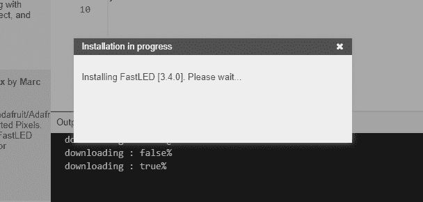

图 7-21：库安装过程

你可以使用本章前面描述的方法检查库是否已安装。

## SD 存储卡

通过使用 SD 或 microSD 卡与 Arduino，你可以从许多来源捕获数据，例如我们在第四章中使用的 TMP36 温度传感器。你还可以使用这些卡片存储网页服务器数据或你的项目可能需要的任何文件。为了记录和存储你收集的数据，你可以使用像图 7-22 所示的存储卡。

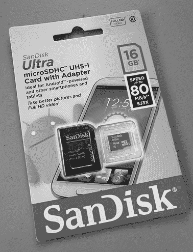

图 7-22：一张 16GB 容量的 microSD 卡

microSD 和 SD 存储卡都可以与 Arduino 一起使用。

### 连接卡模块

在使用存储卡之前，你需要将六根电缆从卡片读取器模块连接到 Arduino。两种卡片读取器类型（microSD 和 SD）都具有相同的引脚，这些引脚应该像图 7-23 所示标记。

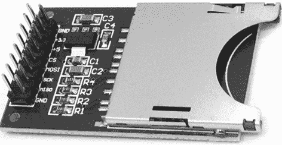

图 7-23：SD 卡模块

按照表 7-1 所示，连接你的 Arduino 和卡片读取器。

表 7-1：卡模块与 Arduino 之间的连接

| **模块引脚标签** | **Arduino 引脚** | **模块引脚功能** |
| --- | --- | --- |
| 5 V 或 Vcc | 5 V | 电源 |
| GND | GND | 地 |
| CS | D10 | 芯片选择 |
| MOSI | D11 | 数据输入到 Arduino |
| MISO | D12 | 数据输出到 Arduino |
| SCK | D13 | 时钟 |

### 测试你的 SD 卡

在你完成将卡模块连接到 Arduino 后——并且你拥有一张新的或新格式化的卡——现在是时候确保卡片正常工作了。为此，按照以下步骤操作：

1.  将内存卡插入卡模块，然后通过 USB 电缆将模块连接到 Arduino，再将 Arduino 连接到你的电脑。

1.  打开 IDE 并选择**文件**▶**示例**▶**SdFat**▶**SdInfo**。这将加载一个示例草图。

1.  滚动到草图中的第 36 行，将`const int chipSelect`的值从`4`更改为`10`，如图 7-24 所示。这是必要的，因为使用的引脚会根据 SD 卡硬件而有所不同。现在将这个草图上传到你的 Arduino 上。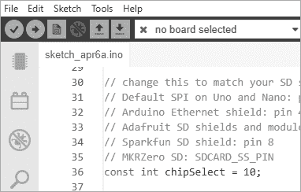

    图 7-24：修改测试草图

1.  最后，打开串口监视器窗口，将其设置为 9,600 波特率，按下键盘上的任意键，然后按回车键。片刻之后，你应该能看到一些关于 microSD 卡的数据，如图 7-25 所示。

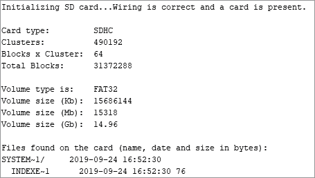

图 7-25：成功的内存卡测试结果

如果测试结果没有出现在串口监视器中，请尝试以下方法：

+   从 Arduino 中拔出 USB 电缆，取出并重新插入 microSD 卡。

+   确保接线连接与表 7-1 中的匹配。

+   检查串口监视器的波特率是否设置为 9,600，并确保使用的是普通的 Arduino Uno 兼容板。Mega 及其他一些板子上的 SPI 引脚位置不同。

+   重新格式化你的内存卡。

+   如果其他方法都无效，尝试使用一个新的品牌内存卡。

最后，在插入或移除内存卡之前，确保整个项目已断开与 USB 和/或电源的连接。

## 项目#22：向内存卡写入数据

在这个项目中，你将使用内存卡来存储数据——特别是乘法表。

### 草图

要向内存卡写入数据，请连接你的扩展板，插入 microSD 卡，然后输入并上传以下草图：

```
// Project 22 - Writing Data to the Memory Card
#include <SD.h>
int b = 0;
void setup()
{ Serial.begin(9600); Serial.println("Initializing SD card..."); pinMode(10, OUTPUT); // check that the memory card exists and is usable if (!SD.begin(10)) { Serial.println("Card failed, or not present"); // stop sketch return; } Serial.println("memory card is ready");
}
void loop()
{1   // create the file for writing File dataFile = SD.open("DATA.TXT", FILE_WRITE); // if the file is ready, write to it: if (dataFile) 2   { for ( int a = 0 ; a < 11 ; a++ ) { dataFile.print(a); dataFile.print(" multiplied by two is "); b = a * 2;3       dataFile.println(b, DEC); }4     dataFile.close(); // close the file once the system has finished with it  // (mandatory) }   // if the file isn't ready, show an error: else { Serial.println("error opening DATA.TXT"); } Serial.println("finished"); do {} while (1);
}
```

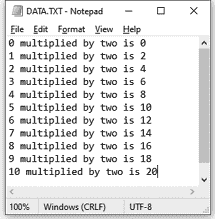

图 7-26：项目 22 的输出

该草图在 microSD 卡上创建一个名为*DATA.TXT*的文本文件，如图 7-26 所示。

让我们回顾一下草图中的`void loop()`部分，看看它是如何创建文本文件的。`void loop()`中 1 和 2 之间的代码用于创建并打开文件以供写入。要将文本写入文件，我们使用`dataFile.print()`或`dataFile.println()`。

这段代码的工作方式与`Serial.println()`类似，因此你可以像写入串口监视器那样写入它。在 1 处我们设置了创建的文本文件的名称，该名称必须是八个字符或更少，后跟一个点和三个字符，如*DATA.TXT*。

在 3 中，我们使用`DEC`作为第二个参数。这表示该变量是十进制数字，并应以这种方式写入文本文件。如果我们要写入的是`float`变量，则需要使用一个数字来指定小数位数（最多六位）。

当我们完成向文件写入数据时，在第 4 步，我们使用 `dataFile.close()` 来关闭文件。如果没有执行这一步，计算机将无法读取创建的文本文件。

## 项目 #23：创建一个温度记录设备

现在您已经知道如何记录数据，我们来使用第二十二章中的存储卡设置和第四章介绍的 TMP36 温度传感器电路，每分钟测量并记录 8 小时的温度。

### 硬件

以下硬件是必需的：

+   一个 TMP36 温度传感器

+   一块面包板

+   各种连接线

+   存储卡和模块

+   Arduino 和 USB 电缆

将 microSD 卡插入扩展板，然后将扩展板插入 Arduino。将 TMP36 的左侧（5 V）引脚连接到 Arduino 的 5 V，中央引脚连接到模拟输入，右侧引脚连接到 GND。

### 草图

输入并上传以下草图：

```
// Project 23 - Creating a Temperature-Logging Device
#include <SD.h>
float sensor, voltage, celsius;
void setup()
{ Serial.begin(9600); Serial.println("Initializing SD card..."); pinMode(10, OUTPUT); // check that the memory card exists and can be used if (!SD.begin(10)) { Serial.println("Card failed, or not present"); // stop sketch return; } Serial.println("memory card is ready");
}
void loop(){ // create the file for writing File dataFile = SD.open("DATA.TXT", FILE_WRITE); // if the file is ready, write to it: if (dataFile)  { for ( int a = 0 ; a < 481 ; a++ ) // 480 minutes in 8 hours { sensor = analogRead(0); voltage = (sensor * 5000) / 1024; // convert raw sensor value to // millivolts voltage = voltage - 500; celsius = voltage / 10; dataFile.print(" Log: "); dataFile.print(a, DEC);     dataFile.print(" Temperature: "); dataFile.print(celsius, 2); dataFile.println(" degrees C"); delay(599900); // wait just under one minute } dataFile.close(); // mandatory  Serial.println("Finished!"); do {} while (1); }
}
```

这个草图完成需要大约 8 小时，但您可以通过降低 `delay(599900)` 中的值来改变此时间。

完成草图后，从 Arduino 中取出 microSD 卡，插入计算机，并在文本编辑器中打开日志文件，如图 7-27 所示。

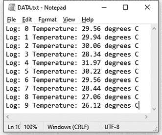

图 7-27：项目 23 的结果

为了对捕获的数据进行更为严谨的分析，可以用空格或冒号分隔写入日志文件的文本行，这样文件就可以轻松导入到电子表格中。例如，您可以将文件导入 OpenOffice Calc 或 Excel，生成类似于图 7-28 所示的电子表格。

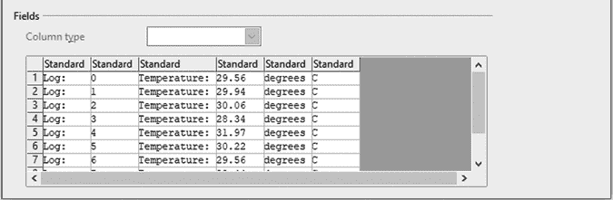

图 7-28：将数据导入电子表格

然后，您可以轻松地对数据进行一些统计分析，如图 7-29 所示。

温度示例可以根据您的数据分析项目进行修改。您可以使用相同的概念记录任何 Arduino 系统生成的数据。

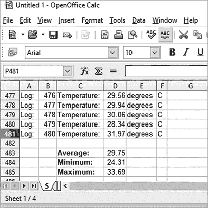

图 7-29：温度分析

## 使用 millis() 和 micros() 的计时应用

每次 Arduino 开始运行草图时，它也会使用毫秒和微秒记录时间的流逝。1 毫秒是 1/1000 秒（0.001），1 微秒是 1/1000000 秒（0.000001）。您可以使用这些值来测量运行草图时的时间流逝。

以下函数将访问存储在 `unsigned long` 变量中的时间值：

```
 unsigned long a,b; a = micros(); b = millis();
```

由于 `unsigned long` 变量类型的限制（只能存储正值），当值达到 4,294,967,295 后将重置为 0，这意味着使用 `millis()` 可以持续约 50 天的计时，而使用 `micros()` 则可以持续约 70 分钟。此外，由于 Arduino 微处理器的限制，`micros()` 值始终是 4 的倍数。

让我们使用这些值来看看 Arduino 将一个数字引脚从低电平转为高电平以及反向的时间。为此，我们将分别在`digitalWrite()`函数调用前后读取`micros()`的值，找出差值并在串口监视器中显示。所需的硬件只有你的 Arduino 和电缆。

输入并上传列表 7-2 中展示的草图。

```
// Listing 7-2
unsigned long starting, finished, elapsed;
void setup()
{ Serial.begin(9600); pinMode(3, OUTPUT); digitalWrite(3, LOW);
}
void loop()
{1   starting = micros();  digitalWrite(3, HIGH);2   finished = micros();3   elapsed = finished – starting;  Serial.print("LOW to HIGH: "); Serial.print(elapsed); Serial.println(" microseconds"); delay(1000);4   starting = micros(); digitalWrite(3, LOW); finished = micros(); elapsed = finished - starting; Serial.print("HIGH to LOW: "); Serial.print(elapsed); Serial.println(" microseconds"); delay(1000);
}
```

列表 7-2：使用`micros()`定时数字引脚状态变化

该草图在`digitalWrite(HIGH)`函数调用前后，分别在 1 和 2 处读取`micros()`的值，然后计算它们的差值，并在 3 处显示在串口监视器中。对于相反的功能，这一过程在 4 处重复。

现在打开串口监视器查看结果，如图 7-30 所示。

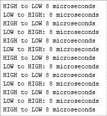

图 7-30：列表 7-2 的输出

由于分辨率为 4 微秒，如果值为 8 微秒，我们知道持续时间大于 4 且小于或等于 8。

## 项目#24：创建一个秒表

现在我们可以测量两个事件之间的经过时间，接下来我们可以使用 Arduino 创建一个简单的秒表。我们的秒表将使用两个按钮：一个用于启动或重置计数，另一个用于停止计数并显示经过的时间。该草图将持续检查每个按钮的状态。当启动按钮被按下时，`millis()`值将被存储，当停止按钮被按下时，新的`millis()`值将被存储。自定义函数`displayResult()`将把经过的时间从毫秒转换为小时、分钟和秒。最后，时间将在串口监视器中显示。

### 硬件

使用本章前面描述的 ProtoShield 以及以下附加硬件：

+   一个面包板

+   两个按键（S1 和 S2）

+   两个 10 kΩ电阻（R1 和 R2）

+   各种连接线

+   Arduino 和 USB 电缆

### 原理图

电路原理图如图 7-31 所示。

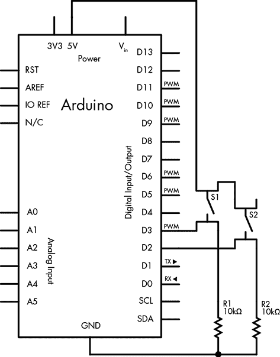

图 7-31：项目 24 的原理图

### 草图

输入并上传此草图：

```
// Project 24 – Creating a Stopwatch
unsigned long starting, finished, elapsed;
void setup() 
{ Serial.begin(9600); 1   pinMode(2, INPUT); // the start button pinMode(3, INPUT); // the stop button Serial.println("Press 1 for Start/reset, 2 for elapsed time");}
void displayResult()
{ float h, m, s, ms; unsigned long over;2   elapsed = finished - starting; h    = int(elapsed / 3600000); over = elapsed % 3600000; m    = int(over / 60000); over = over % 60000; s    = int(over / 1000); ms   = over % 1000; Serial.print("Raw elapsed time: "); Serial.println(elapsed); Serial.print("Elapsed time: "); Serial.print(h, 0); Serial.print("h "); Serial.print(m, 0); Serial.print("m "); Serial.print(s, 0); Serial.print("s "); Serial.print(ms, 0); Serial.println("ms"); Serial.println(); 
}
void loop() 
{3   if (digitalRead(2) == HIGH) { starting = millis(); delay(200); // for debounce Serial.println("Started..."); }4   if (digitalRead(3) == HIGH) { finished = millis(); delay(200); // for debounce      displayResult(); }
}
```

我们的秒表的基本原理很简单。在 1 处，我们设置了用于启动和停止按钮的数字输入引脚。在 3 处，如果启动按钮被按下，Arduino 将记录`millis()`的值，待停止按钮在 4 处按下后，我们使用该值来计算经过的时间。停止按钮按下后，经过的时间会在函数`displayResult()`中计算出来，在 2 处显示，并在串口监视器窗口中展示。

你应该在串口监视器中看到类似图 7-32 中的结果。

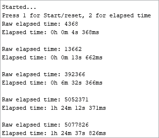

图 7-32：项目 24 的输出

## 中断

在 Arduino 中，*中断*基本上是一个信号，允许在程序中的任何时刻调用一个函数——例如，当数字输入引脚的状态发生变化，或触发计时器事件时。中断非常适合调用函数以中断程序的正常运行，例如当按钮被按下时。这类函数通常被称为*中断处理程序*。

当中断被触发时，程序的正常操作和运行会暂时中止，直到中断函数被调用并执行完毕。然后，当中断函数退出时，程序会继续从中断前的状态恢复执行。

中断函数应简短且简单。它们应该快速退出，并且要记住，如果中断函数执行的操作与主循环已经在做的操作相同，那么中断函数将暂时覆盖主循环的活动，直到主循环恢复。例如，如果主循环定期通过串口发送*Hello*，而中断函数在触发时发送*---*，那么你可能会在串口看到以下任何一种输出：*H----ello*、*He----llo*、*Hel----lo*、*Hell----o*或*Hello----*。

Arduino Uno 提供了两个中断，可以通过数字引脚 2 和 3 使用。当正确配置时，Arduino 将监控应用到引脚的电压。当电压以某种特定方式变化时（例如，当按钮被按下时），中断被触发，导致相应的函数执行——可能是发送“Stop Pressing Me!”。

### 中断模式

四种变化（或*模式*）中的任意一种都可以触发一个中断：

1.  `LOW` 没有电流应用到中断引脚。

1.  `CHANGE` 电流发生变化，无论是开关之间变化，还是关闭与打开之间变化。

1.  `RISING` 电流从关闭状态变化为 5V 的开启状态。

1.  `FALLING` 电流从 5V 的开启状态变化为关闭状态。

例如，要检测连接到中断引脚的按钮是否被按下，你可以使用`RISING`模式。或者，例如，如果你在花园里铺设了一条电动防护绳（连接在 5V 和中断引脚之间），你可以使用`FALLING`模式来检测当防护绳被触发并断开时。

### 配置中断

要配置中断，请在`void setup()`中使用以下内容：

```
 attachInterrupt(0, *function*, *mode*); attachInterrupt(1, *function*, *mode*); 
```

这里，`0` 对应数字引脚 2，`1` 对应数字引脚 3，`function` 是在中断触发时要调用的函数名称，`mode` 是触发中断的四种模式之一。

### 激活或停用中断

有时你可能不想在程序中使用中断。你可以通过以下命令停用单个中断：

```
detachInterrupt(digitalPinToInterrupt*(pin)*)
```

其中 `pin` 是所用的数字引脚编号。或者，你也可以使用以下命令停用所有中断：

```
noInterrupts(); // deactivate interrupts
```

然后通过以下方式重新激活它们：

```
interrupts(); // reactivate interrupts
```

中断工作快速且非常敏感。这些特点使它们非常适合时间关键型应用或项目中的“紧急停止”按钮。

## 项目 #25：使用中断

我们将使用项目 24 中的电路来演示中断的使用。我们的示例将每 500 毫秒闪烁内置 LED，在此期间，将监控两个中断引脚。当按下中断 0 上的按钮时，`micros()`的值将在串口监视器中显示；当按下中断 1 上的按钮时，`millis()`的值将显示出来。

### 草图

输入并上传以下草图：

```
// Project 25 – Using Interrupts
#define LED 13
void setup()
{ Serial.begin(9600); pinMode(13, OUTPUT); attachInterrupt(0, displayMicros, RISING); attachInterrupt(1, displayMillis, RISING); 
}1 void displayMicros()
{ Serial.write("micros() = "); Serial.println(micros());
}2void displayMillis()
{ Serial.write("millis() = "); Serial.println(millis());
}3 void loop()
{ digitalWrite(LED, HIGH); delay(500); digitalWrite(LED, LOW); delay(500);
}
```

这个草图将根据`void loop()`中的代码以 3 的频率闪烁板载 LED。当中断 0 被触发时，将调用函数`displayMicros()`（见 1）；当中断 1 被触发时，将调用函数`displayMillis()`（见 2）。无论哪个函数完成，草图都将恢复运行`void loop()`中的代码。

打开串口监视器窗口，按下两个按钮以查看`millis()`和`micros()`的值，如图 7-33 所示。

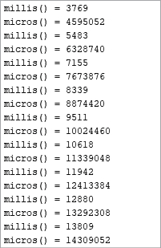

图 7-33：项目 25 输出

## 展望未来

本章为你提供了更多工具和选项，您可以根据需要进行调整，以创建和改进自己的项目。在未来的章节中，我们将使用更多的 Arduino 扩展板，利用中断进行定时项目，并在其他数据记录应用中使用存储卡模块。
