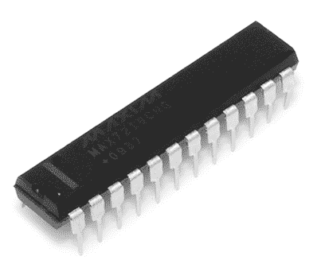
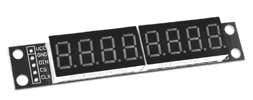
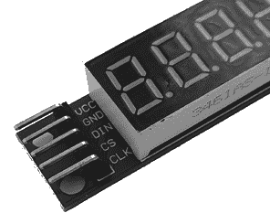
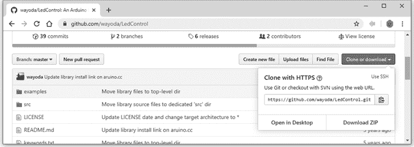
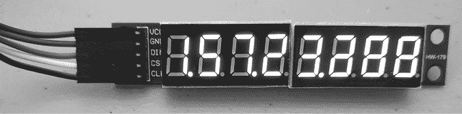
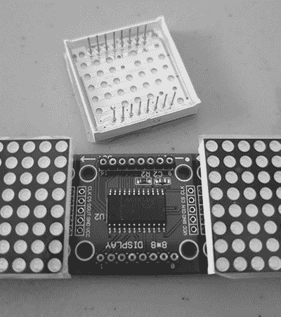
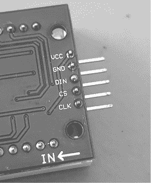
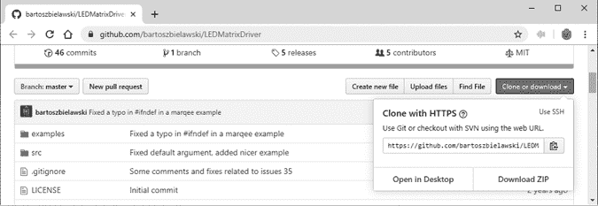
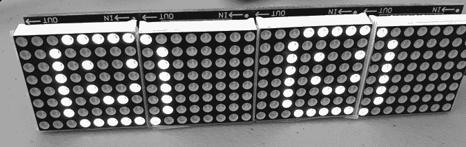

# 第八章：LED 数字显示和矩阵

在本章中，您将

+   使用基于 MAX7219 的数字 LED 显示

+   自建数字秒表计时器

+   使用基于 MAX7219 的 LED 矩阵模块

+   构建滚动文本 LED 显示

尽管 LED 数字显示器（例如现代数字闹钟中使用的那种）可能不是最前沿的显示技术，但它们易于阅读，而且——更重要的是——与我们的 Arduino 板兼容，使用起来非常简单。

您在第六章中已经学习了如何使用一位和两位数字的 LED 显示器。然而，同时使用超过两位数字可能会变得杂乱无章——需要更多的接线、更复杂的控制 IC 等。幸运的是，有一种流行的集成电路（IC）可以通过三根控制线从我们的 Arduino 控制最多 64 个 LED（八位数字显示器）：MAX7219 LED 驱动 IC，来自 Maxim Integrated 公司。

MAX7219 有穿孔封装类型，这意味着它具有金属引脚，可以插入电路板或无焊接面包板（如图 8-1 所示），也有表面贴装封装类型（如图 8-2 所示）。



图 8-1：MAX7219 的穿孔封装类型


图 8-2：MAX7219 的表面贴装封装类型

在本章中，您将学习如何使用 MAX7219 控制最多八个数字 LED。您还将学习如何使用 MAX7219 控制有趣的 LED 矩阵模块，这些模块支持滚动文本显示。

## LED 数字显示

使用 MAX7219 的 LED 数字显示有很多形状和尺寸，通常模块上装有四到八位数字。对于我们的示例，我们使用的是一个八位数字模块，价格实惠且性价比高（见图 8-3）。



图 8-3：八位数字 LED 模块

这些模块的背面有 MAX7219 的表面贴装版本，如图 8-2 所示。模块通常包含一些内联的插头引脚，以便连接控制线。如果您还没有这样做，请将它们焊接到模块上，如图 8-4 所示。



图 8-4：内联插头引脚连接到八位数字 LED 模块

在您使用数字显示器之前，您需要将五根线连接到显示器和 Arduino。这可以通过将公对母跳线连接到您已焊接到板上的插头引脚来轻松完成。按照表 8-1 中所示的方式进行连接。

表 8-1：显示模块与 Arduino 之间的连接

| **模块引脚标签** | **Arduino 引脚** | **模块引脚功能** |
| --- | --- | --- |
| Vcc | 5V | 电源（+） |
| GND | GND | 电源（−）或地面 |
| DIN | D12 | 数据输入 |
| CS | D10 | 芯片选择 |
| CLK | D11 | 时钟信号 |

### 安装库

有几种 Arduino 库可以用于 MAX7219。这些库根据使用的显示模块配置不同而有所不同。我们将使用 LedControl 库。你需要从*https://github.com/wayoda/LedControl/*下载库的 ZIP 文件。点击**克隆或下载**，然后点击**下载 ZIP**，如图 8-5 所示。



图 8-5：下载 LedControl 库

一旦你有了 ZIP 文件，按照第七章的描述进行安装。接下来，为了使用显示模块，我们将首先检查一个示例程序，使用所需的函数。输入并上传清单 8-1 中显示的基本示例。

```
// Listing 8-11 #include "LedControl.h"   // need the library
LedControl lc = LedControl(12, 11, 10, 1);
void setup()
{2   lc.shutdown(0, false);  // enable display lc.setIntensity(0, 3);  // set brightness lc.clearDisplay(0);     // clear screen
}
void loop()
{ // numbers with decimal point for (int a = 0; a < 8; a++) {3     lc.setDigit(0, a, a, true); delay(500); lc.clearDisplay(0) ;  // clear screen } // dashes for (int a = 0; a < 8; a++) {4     lc.setChar(0, a, '-', false); delay(500); lc.clearDisplay(0) ;  // clear screen } // numbers without decimal point for (int a = 0; a < 8; a++) { lc.setDigit(0, a, a, false); delay(500); lc.clearDisplay(0) ;  // clear screen }5   // display "abcdef" lc.setDigit(0, 5, 10, false); lc.setDigit(0, 4, 11, false); lc.setDigit(0, 3, 12, false); lc.setDigit(0, 2, 13, false); lc.setDigit(0, 1, 14, false); lc.setDigit(0, 0, 15, false); delay(500); lc.clearDisplay(0) ;    // clear screen
}
```

清单 8-1：显示模块演示示例

让我们来看看清单 8-1 中的示例是如何工作的。在第 1 步，我们包含了用于加载显示模块库的必要代码。`LedControl()`函数有四个参数：

```
LedControl lc = LedControl(12, 11, 10, 1);
```

前三个参数指定了连接的数字引脚（见表 8-1），第四个参数是连接到 Arduino 的显示模块数量——在此例中为一个。（你可以串联多个模块。）

在第 2 步，我们有三个函数来控制显示的各个方面。第一个函数用来开启或关闭显示：

```
lc.shutdown(0, false); 
```

第一个参数是显示器。我们使用 0，因为只连接了一个显示器。如果你连接了多个显示器，第二个参数是显示器 1，第三个是显示器 2，依此类推。第二个参数指定显示器的开关状态：`false`表示开启，`true`表示关闭。

第二个函数用于设置显示器中 LED 的亮度：

```
lc.setIntensity(0, 3); 
```

第一个参数是显示器编号。第二个是亮度，范围从 0 到 15（包含）。

第三个函数简单地将所有 LED 关闭：

```
lc.clearDisplay(0); 
```

这对于清除之前显示的数据非常有用。

在第 3 步，我们使用`setDigit()`在屏幕上显示一个数字：

```
lc.setDigit(0, a, b, true);
```

第一个参数是显示器编号。第二个是数字在显示器上的物理位置；对于一个八位数显示器，这个值从 7（最左边的数字）到 0（最右边的数字）。第三个参数是要显示的实际数字（0 到 9）。如果使用 10 到 16，你可以显示字母 A 到 F，就像我们在第 5 步中做的那样。最后，第四个参数控制小数点：`true`表示开启，`false`表示关闭。

你还可以使用`setChar()`写入字符 A 到 F、H、L、P、破折号、句点和下划线，如第 4 步所示：

```
lc.setChar(0, a, '-', false);
```

参数相同，唯一不同的是你用单引号括起来字符。

现在我们已经了解了所有用于在显示器上显示数字和字符的命令，接下来让我们将它们付诸实践。

## 项目#26：数字秒表

你在第七章的项目 24 中学习了定时方法，现在你刚刚学会了如何使用显示模块，因此你可以将这些概念结合起来创建一个数字秒表。虽然它的准确性无法与奥林匹克计时水平相媲美，但这是一个有趣且实用的项目。你的秒表将能够显示毫秒、秒、分钟以及最多九个小时。

你需要连接 ProtoShield（或等效电路），正如第七章中所描述的，并与本章早些时候使用的数字显示连接。然后只需上传以下草图：

```
// Project 26 – Digital Stopwatch 
#include "LedControl.h"   // need the library
LedControl lc = LedControl(12, 11, 10, 1);
unsigned long starting, finished, elapsed;
void setup()
{ pinMode(2, INPUT);      // the start button pinMode(3, INPUT);      // the stop button lc.shutdown(0, false);  // enable display lc.setIntensity(0, 3);  // set brightness lc.clearDisplay(0);     // clear screen starting = millis();
}1 void displayResultLED()
{ float h, m, s, ms; int m1, m2, s1, s2, ms1, ms2, ms3; unsigned long over; finished = millis(); elapsed = finished - starting;2   h = int(elapsed / 3600000); over = elapsed % 3600000; m = int(over / 60000); over = over % 60000; s = int(over / 1000); ms = over % 1000; 3   // display hours lc.setDigit(0, 7, h, true);  // display minutes m1 = m / 10; m2 = int(m) % 10; lc.setDigit(0, 6, m1, false); lc.setDigit(0, 5, m2, true);  // display seconds s1 = s / 10; s2 = int(s) % 10; lc.setDigit(0, 4, s1, false); lc.setDigit(0, 3, s2, true);  // display milliseconds (1/100 s) ms1 = int(ms / 100); ms2 = (int((ms / 10)) % 10); ms3 = int(ms) % 10; lc.setDigit(0, 2, ms1, false); lc.setDigit(0, 1, ms2, false); lc.setDigit(0, 0, ms2, false);
}
void loop()
{4   if (digitalRead(2) == HIGH)  // reset count { starting = millis(); delay(200);                // for debounce }5   if (digitalRead(3) == HIGH)  // display count for five seconds then resume { finished = millis(); delay(5000);               // for debounce } displayResultLED();
}
```

在草图上传后的短短一会儿，显示器将开始计数，如图 8-6 所示。



图 8-6：秒表工作中的样子

正如我们在项目 24 中所做的那样，在这个草图中，我们使用`millis()`来追踪经过的时间。我们将时间计算和显示放在了`void displayResultLED()`函数中 1。

在图 2 中，你可以看到毫秒数是如何被拆分为小时、分钟、秒和毫秒的。然后，显示器的每一位数字从左到右填充相应的时间值，从小时 3 开始。秒表的控制非常简单：当用户按下连接到数字输入 2 的按钮时，计数器会通过将起始时间设置为`millis()`函数当前返回的值来重置为零 4。当按下连接到数字输入 3 的按钮时，显示会被冻结 5；这个功能非常适合用于记录圈速。然而请注意，计时仍会继续，显示在大约五秒后会恢复。

这个项目可以很容易地修改为以更简单的格式显示数据——比如小时、分钟和秒——或者用于更长的时间段，例如最多 24 小时。但现在，让我们继续进行一个更复杂的项目，涉及 LED 矩阵显示板。

## 项目 #27：使用 LED 矩阵模块

MAX7219 可以控制最多 64 个 LED。在上一个项目中，我们展示了这些数字。这里，我们将使用以 8 × 8 矩阵形式排列 LED 的模块，这种形式非常适合更有趣的应用，比如显示固定或滚动的文本。

LED 矩阵模块通常以单独单元或四个一组的形式出售；两种形式如图 8-7 所示。

这些也可能作为套件出售；然而，节省的成本微乎其微，因此建议选择预组装版本来节省时间。LED 显示器可以插入模块上的插座引脚，如图 8-8 所示，使得更换颜色变得容易。


图 8-7：LED 矩阵模块



图 8-8：可拆卸的 LED 矩阵

在将 LED 矩阵插入模块时要小心，因为有些 LED 矩阵的引脚容易弯曲。经验表明，你仍然需要将直排针焊接到矩阵模块上。不过，这些引脚通常会随模块一起提供，并且如图 8-9 所示，能够整齐地适配。



图 8-9：与矩阵模块连接的内联头引脚

再次强调，在使用矩阵模块之前，你需要像连接数字显示器那样，将五根线连接到模块和 Arduino。按照表 8-2 所示进行连接。

表 8-2：矩阵模块与 Arduino 之间的连接

| **模块引脚标签** | **Arduino 引脚** | **模块引脚功能** |
| --- | --- | --- |
| Vcc | 5V | 电源（+） |
| GND | GND | 电源（−）或地 |
| DIN | D11 | 数据输入 |
| CS | D9 | 芯片选择 |
| CLK | D13 | 时钟信号 |

### 安装库

你将为这些模块使用与 MAX7219 不同的库。要获取该库，请访问[`github.com/bartoszbielawski/LEDMatrixDriver/`](https://github.com/bartoszbielawski/LEDMatrixDriver/)，点击**克隆或下载**，然后选择**下载 ZIP**，如图 8-10 所示。



图 8-10：下载 LEDMatrixDriver 库

下载 ZIP 文件后，按照第七章的描述进行安装。接着输入并上传以下草图。（在此，我想提醒一下，书中所有的代码都可以从[`nostarch.com/arduino-workshop-2nd-edition/`](https://nostarch.com/arduino-workshop-2nd-edition/)下载。）

```
// Project 27 - Using LED Matrix Modules1 #include <LEDMatrixDriver.hpp>
const uint8_t LEDMATRIX_CS_PIN = 9;
// Number of matrix modules you are connecting
const int LEDMATRIX_SEGMENTS = 4;
const int LEDMATRIX_WIDTH = LEDMATRIX_SEGMENTS * 8;
LEDMatrixDriver lmd(LEDMATRIX_SEGMENTS, LEDMATRIX_CS_PIN);
// Text to display2 char text[] = "** LED MATRIX DEMO! ** (1234567890) ++ \"ABCDEFGHIJKLMNOPQRSTUVWXYZ\" ++ <$%/=?'.@,> --";
// scroll speed (smaller = faster)3 const int ANIM_DELAY = 30;
void setup() {4 // init the display lmd.setEnabled(true); lmd.setIntensity(2);   // 0 = low, 10 = high
}
int x = 0, y = 0; // start top left
// font definition5 byte font[95][8] = { {0, 0, 0, 0, 0, 0, 0, 0},      // SPACE {0x10, 0x18, 0x18, 0x18, 0x18, 0x00, 0x18, 0x18}, // EXCL {0x28, 0x28, 0x08, 0x00, 0x00, 0x00, 0x00, 0x00}, // QUOT {0x00, 0x0a, 0x7f, 0x14, 0x28, 0xfe, 0x50, 0x00}, // # {0x10, 0x38, 0x54, 0x70, 0x1c, 0x54, 0x38, 0x10}, // $ {0x00, 0x60, 0x66, 0x08, 0x10, 0x66, 0x06, 0x00}, // % {0, 0, 0, 0, 0, 0, 0, 0},                         // & {0x00, 0x10, 0x18, 0x18, 0x08, 0x00, 0x00, 0x00}, // ' {0x02, 0x04, 0x08, 0x08, 0x08, 0x08, 0x08, 0x04}, // ( {0x40, 0x20, 0x10, 0x10, 0x10, 0x10, 0x10, 0x20}, // ) {0x00, 0x10, 0x54, 0x38, 0x10, 0x38, 0x54, 0x10}, // * {0x00, 0x08, 0x08, 0x08, 0x7f, 0x08, 0x08, 0x08}, // + {0x00, 0x00, 0x00, 0x00, 0x00, 0x18, 0x18, 0x08}, // COMMA {0x00, 0x00, 0x00, 0x00, 0x7e, 0x00, 0x00, 0x00}, // - {0x00, 0x00, 0x00, 0x00, 0x00, 0x00, 0x06, 0x06}, // DOT {0x00, 0x04, 0x04, 0x08, 0x10, 0x20, 0x40, 0x40}, // / {0x00, 0x38, 0x44, 0x4c, 0x54, 0x64, 0x44, 0x38}, // 0 {0x04, 0x0c, 0x14, 0x24, 0x04, 0x04, 0x04, 0x04}, // 1 {0x00, 0x30, 0x48, 0x04, 0x04, 0x38, 0x40, 0x7c}, // 2 {0x00, 0x38, 0x04, 0x04, 0x18, 0x04, 0x44, 0x38}, // 3 {0x00, 0x04, 0x0c, 0x14, 0x24, 0x7e, 0x04, 0x04}, // 4 {0x00, 0x7c, 0x40, 0x40, 0x78, 0x04, 0x04, 0x38}, // 5 {0x00, 0x38, 0x40, 0x40, 0x78, 0x44, 0x44, 0x38}, // 6 {0x00, 0x7c, 0x04, 0x04, 0x08, 0x08, 0x10, 0x10}, // 7 {0x00, 0x3c, 0x44, 0x44, 0x38, 0x44, 0x44, 0x78}, // 8 {0x00, 0x38, 0x44, 0x44, 0x3c, 0x04, 0x04, 0x78}, // 9 {0x00, 0x18, 0x18, 0x00, 0x00, 0x18, 0x18, 0x00}, // : {0x00, 0x18, 0x18, 0x00, 0x00, 0x18, 0x18, 0x08}, // ; {0x00, 0x10, 0x20, 0x40, 0x80, 0x40, 0x20, 0x10}, // < {0x00, 0x00, 0x7e, 0x00, 0x00, 0xfc, 0x00, 0x00}, // = {0x00, 0x08, 0x04, 0x02, 0x01, 0x02, 0x04, 0x08}, // > {0x00, 0x38, 0x44, 0x04, 0x08, 0x10, 0x00, 0x10}, // ? {0x00, 0x30, 0x48, 0xba, 0xba, 0x84, 0x78, 0x00}, // @ {0x00, 0x1c, 0x22, 0x42, 0x42, 0x7e, 0x42, 0x42}, // A {0x00, 0x78, 0x44, 0x44, 0x78, 0x44, 0x44, 0x7c}, // B {0x00, 0x3c, 0x44, 0x40, 0x40, 0x40, 0x44, 0x7c}, // C {0x00, 0x7c, 0x42, 0x42, 0x42, 0x42, 0x44, 0x78}, // D {0x00, 0x78, 0x40, 0x40, 0x70, 0x40, 0x40, 0x7c}, // E {0x00, 0x7c, 0x40, 0x40, 0x78, 0x40, 0x40, 0x40}, // F {0x00, 0x3c, 0x40, 0x40, 0x5c, 0x44, 0x44, 0x78}, // G {0x00, 0x42, 0x42, 0x42, 0x7e, 0x42, 0x42, 0x42}, // H {0x00, 0x7c, 0x10, 0x10, 0x10, 0x10, 0x10, 0x7e}, // I {0x00, 0x7e, 0x02, 0x02, 0x02, 0x02, 0x04, 0x38}, // J {0x00, 0x44, 0x48, 0x50, 0x60, 0x50, 0x48, 0x44}, // K {0x00, 0x40, 0x40, 0x40, 0x40, 0x40, 0x40, 0x7c}, // L {0x00, 0x82, 0xc6, 0xaa, 0x92, 0x82, 0x82, 0x82}, // M {0x00, 0x42, 0x42, 0x62, 0x52, 0x4a, 0x46, 0x42}, // N {0x00, 0x3c, 0x42, 0x42, 0x42, 0x42, 0x44, 0x38}, // O {0x00, 0x78, 0x44, 0x44, 0x48, 0x70, 0x40, 0x40}, // P {0x00, 0x3c, 0x42, 0x42, 0x52, 0x4a, 0x44, 0x3a}, // Q {0x00, 0x78, 0x44, 0x44, 0x78, 0x50, 0x48, 0x44}, // R {0x00, 0x38, 0x40, 0x40, 0x38, 0x04, 0x04, 0x78}, // S {0x00, 0x7e, 0x90, 0x10, 0x10, 0x10, 0x10, 0x10}, // T {0x00, 0x42, 0x42, 0x42, 0x42, 0x42, 0x42, 0x3e}, // U {0x00, 0x42, 0x42, 0x42, 0x42, 0x44, 0x28, 0x10}, // V {0x80, 0x82, 0x82, 0x92, 0x92, 0x92, 0x94, 0x78}, // W {0x00, 0x42, 0x42, 0x24, 0x18, 0x24, 0x42, 0x42}, // X {0x00, 0x44, 0x44, 0x28, 0x10, 0x10, 0x10, 0x10}, // Y {0x00, 0x7c, 0x04, 0x08, 0x7c, 0x20, 0x40, 0xfe}, // Z
};6 void drawString(char* text, int len, int x, int y)
{ for ( int idx = 0; idx < len; idx ++ ) { int c = text[idx] - 32; // stop if char is outside visible area if ( x + idx * 8  > LEDMATRIX_WIDTH ) return; // only draw if char is visible if ( 8 + x + idx * 8 > 0 ) drawSprite( font[c], x + idx * 8, y, 8, 8 ); }
}7 void scrollText(){ int len = strlen(text); drawString(text, len, x, 0); lmd.display(); delay(ANIM_DELAY); if ( --x < len * -8 ) { x = LEDMATRIX_WIDTH; }
}
void loop()
{ scrollText();
}
```

上传草图后过一会儿，你应该能看到文字从右到左滚动显示在 LED 显示模块上。

现在让我们深入了解一下这个草图是如何工作的。代码量很大，但不要因此感到害怕。从 1 开始，我们调用所需的函数来使用库并设置显示器。在 2 处，一个字符数组包含了要显示在显示模块上的文本。你可以稍后修改它。如果需要，你还可以通过改变 3 处的数值来调整滚动速度：数字越小，滚动速度越快。

在 4 处，我们有两个函数。这个函数用于开关显示：

```
lmd.setEnabled(true);
```

这个设置了显示模块中 LED 的亮度：

```
lmd.setIntensity(*x*);
```

`setIntensity()`函数的值介于 0（暗）和 9（亮）之间。

显示器使用的字体定义在 5 处的一个巨大数组中。我们将在下一节中详细介绍它。最后，`drawstring()` 6 和`scrollText()` 7 函数是显示操作所必需的。

### 编辑显示字体

你可以通过更改`byte font`数组 5 中的数据，轻松指定哪些字符可以在显示中使用。首先，回顾一下，每个矩阵模块由八行八个 LED 组成。这意味着你有 64 个 LED 可用于创建任何字符。

每一行 LED 由一个十六进制数定义，八个这样的十六进制数代表一个字符。例如，字母 N 由以下方式定义：

```
{0x00, 0x42, 0x42, 0x62, 0x52, 0x4a, 0x46, 0x42}, // N
```

为了显示字符，我们将十六进制数字转换为二进制。例如，我们的字母 N 从十六进制转换为二进制如下：

```
0 0 0 0 0 0 0 0 = 0x00
0 1 0 0 0 0 1 0 = 0x42
0 1 0 0 0 0 1 0 = 0x42
0 1 1 0 0 0 1 0 = 0x62
0 1 0 1 0 0 1 0 = 0x52
0 1 0 0 1 0 1 0 = 0x4a
0 1 0 0 0 1 1 0 = 0x46
0 1 0 0 0 0 1 0 = 0x42
```

你可以看到 1 表示字符与 0 的场域，其中 1 代表点亮的 LED，0 代表熄灭的 LED。因此，要创建自己的字符，只需反转这一过程。例如，一个漂亮的笑脸可以表示为：

```
0 1 1 1 1 1 1 0 = 0x7e
1 0 0 0 0 0 0 1 = 0x81
1 0 1 0 0 1 0 1 = 0xa5
1 0 0 0 0 0 0 1 = 0x81
1 0 1 0 0 1 0 1 = 0xa5
1 0 0 1 1 0 0 1 = 0x99
1 0 0 0 0 0 0 1 = 0x81
0 1 1 1 1 1 1 0 = 0x7e
```

这将在数组中表示为：

```
{0x7e,0x81,0xa5,0x81,0xa5,0x99,0x81,0x7e} // smiley
```

你可以用新的数据替换`font`数组中现有的某一行，或者将数据作为另一个元素添加到数组末尾。如果添加另一行，你需要增加`byte`声明中的第一个参数，使其等于已定义字符的数量（在本例中为 96）：

```
byte font[96][8]
```

你现在可能在想如何在草图中引用你的自定义字符。显示库使用的是 ASCII 图表中的字符顺序，可以在[`www.arduino.cc/en/Reference/ASCIIchart/`](https://www.arduino.cc/en/Reference/ASCIIchart/)找到。

如果在草图中的最后一个字符（默认是 Z）后添加另一个字符，则下一个字符表中的字符是[。因此，要在显示器上滚动三个笑脸，你需要将显示文本的行设置为：

```
char text[] = " [ [ ";
```

这种输出的示例可以在[图 8-11 中看到。



图 8-11：使用自定义字符显示笑脸

## 展望未来

现在你知道如何使用它们了，操作 LED 数字和矩阵显示器将变得轻松。 However, 还有更多种类的显示器，接下来翻到下一章了解另一种：液晶显示器。
