# 第九章：液晶显示器

在本章中，您将

+   使用字符 LCD 模块显示文本和数字数据

+   创建自定义字符以在字符 LCD 模块上显示

+   使用彩色 LCD 模块显示文本和数据

+   创建温度历史图表显示

对于一些项目，您可能希望将信息显示在除桌面计算机显示器以外的地方。显示信息的最简单且多用途的方式之一是使用液晶显示屏（LCD）模块和您的 Arduino。您可以使用字符 LCD 模块显示文本、自定义字符和数字数据，使用图形 LCD 模块显示彩色图形。

## 字符 LCD 模块

显示字符（如文本和数字）的 LCD 模块是所有 LCD 中最便宜且最简单使用的。它们可以购买多种尺寸，尺寸按它们能显示的字符行数和列数来衡量。一些模块包括背光，并允许您选择字符的颜色和背景颜色。任何具有 HD44780 或 KS0066 兼容接口并带有 5V 背光的 LCD 都应能与您的 Arduino 配合使用。我们将使用的第一个 LCD 是一个 16 字符×2 行的 LCD 模块，带有背光，如图 9-1 所示。

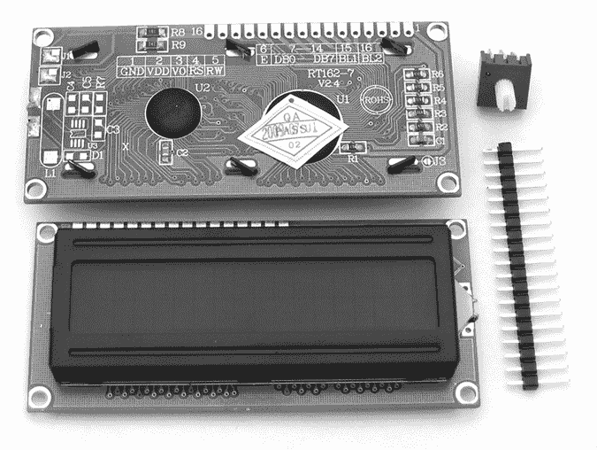

图 9-1：带调节电位器和引脚的 LCD 模块示例

调节电位器（用于 LCD 的可变电阻）值为 10 kΩ，用于调整显示对比度。如果 LCD 顶部的孔排未焊接上引脚，则需要先焊接，以便轻松插入面包板。

LCD 顶部的孔排编号从 1 到 16。第 1 号孔靠近模块的角落，在图 9-2 中标记为 VSS（连接到 GND）。我们将参考此原理图进行本书中的所有 LCD 示例。在一些罕见情况下，您可能会遇到具有 4.2 V 背光的 LCD，而不是 5 V 背光。（如果不确定，请与您的供应商确认。）如果是这种情况，将 1N4004 二极管串联在 Arduino 的 5V 与 LCD 的 LED+引脚之间。

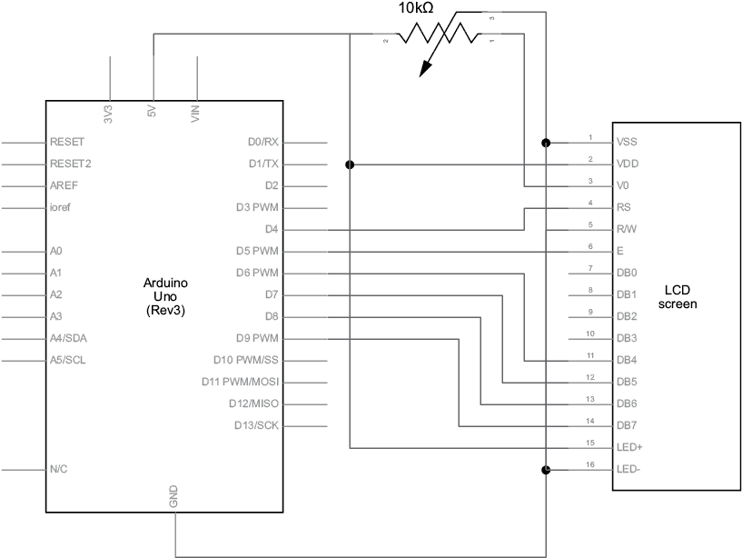

图 9-2：基本 LCD 原理图

### 在草图中使用字符 LCD

要使用图 9-1 中显示的字符 LCD，我们将首先通过一些简单的演示来探索所需的函数及其工作原理。在继续之前，您需要通过库管理器安装所需的 Arduino 库。按照第七章中描述的方法，搜索并安装“LiquidCrystal by Arduino, Adafruit”库。然后，您可以输入并上传清单 9-1 中显示的基本草图。

```
// Listing 9-1
#include <LiquidCrystal.h>
LiquidCrystal lcd(4, 5, 6, 7, 8, 9);  // pins for RS, E, DB4, DB5, DB6, DB7
void setup()
{ lcd.begin(16, 2); lcd.clear();
}
void loop(){ lcd.setCursor(0, 5); lcd.print("Hello"); lcd.setCursor(1, 6); lcd.print("world!"); delay(10000);
}
```

清单 9-1：LCD 演示草图

图 9-3 显示了清单 9-1 的结果。

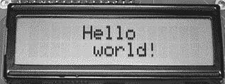

图 9-3：LCD 演示：“Hello world！”

接下来，看看代码清单 9-1 中的草图是如何工作的。首先，我们需要添加一行代码，目的是引入 LCD 模块的库（该库会随着 Arduino IDE 自动安装）。然后，我们需要告诉库哪些引脚连接到 Arduino。为此，我们在`void setup()`方法之前添加以下代码：

```
#include <LiquidCrystal.h>
LiquidCrystal lcd(4, 5, 6, 7, 8, 9);  // pins for RS, E, DB4, DB5, DB6, DB7
```

输入到 LiquidCrystal 函数中的数字与 LCD 上标记的引脚相对应。如果你不确定 LCD 的引脚排列，请联系供应商。

如果你需要使用 Arduino 上的不同数字引脚，可以在这段代码的第二行调整引脚编号。

接下来，在`void setup()`中，我们告诉 Arduino LCD 的列数和行数。例如，下面是如何告诉 Arduino LCD 有 2 行，每行 16 个字符：

```
 lcd.begin(16, 2);
```

### 显示文本

完成 LCD 设置后，使用以下代码清除 LCD 的显示：

```
 lcd.clear(); 
```

然后，为了定位光标，也就是文本的起始点，可以使用以下代码：

```
 lcd.setCursor(`x`, `y`);
```

这里，`x`是列（0 到 15），`y`是行（0 或 1）。接下来，若要显示单词*text*，例如，可以输入以下代码：

```
 lcd.print("text");
```

现在你已经可以定位和显示文本，接下来让我们看看如何显示变量数据。

### 显示变量或数字

要在 LCD 屏幕上显示变量的内容，请使用以下代码：

```
 lcd.print(`variable`);
```

如果你要显示一个`float`变量，你可以指定使用的小数位数。例如，`lcd.print(pi, 3)`会告诉 Arduino 显示π的值，保留三位小数，如图 9-4 所示：

```
 float pi = 3.141592654; lcd.print("pi: "); lcd.print(pi, 3); 
```

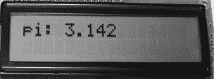

图 9-4：LCD 显示浮点数

当你要在 LCD 屏幕上显示一个整数时，可以选择以十六进制或二进制形式显示，如代码清单 9-2 所示。

```
// Listing 9-2 int zz = 170; lcd.setCursor(0, 0); lcd.print("Binary: ");       lcd.print(zz, BIN);    // display 170 in binary lcd.setCursor(0, 1); lcd.print("Hexadecimal: "); lcd.print(zz, HX);     // display 170 in hexadecimal
```

代码清单 9-2：显示二进制和十六进制数字的函数

LCD 将显示图 9-5 中的文本。

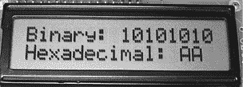

图 9-5：代码清单 9-2 中的代码结果

## 项目#28：定义自定义字符

除了使用键盘上可用的标准字母、数字和符号外，你还可以在每个草图中定义最多八个自定义字符。注意，在 LCD 模块中，每个字符由八行五个点或*像素*组成。图 9-6 显示了特写。

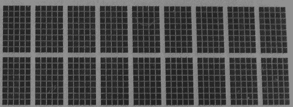

图 9-6：每个字符由八行五个像素组成。

要显示你自定义的字符，必须首先使用*数组*定义每个字符。例如，要创建一个微笑的表情符号，你可以使用以下代码：

```
byte a[8] = {  B00000,  B01010, B01010,  B00000,  B00100,  B10001,  B01110,  B00000  };
```

数组中的每个数字表示显示器中的一个像素。0 表示关闭一个像素，1 表示打开它。数组中的元素表示显示器中像素的行；最上面的元素是顶行，接下来的元素是第二行，以此类推。

在这个例子中，由于第一个元素是`B00000`，顶部行的所有像素都被关闭。在下一个元素`B01010`中，每隔一个像素被点亮，1 的部分形成了眼睛的上方。接下来的行继续填充这个字符。

接下来，将数组（定义你新字符的内容）分配给`void setup()`中的第一个自定义字符插槽，方法如下：

```
 lcd.createChar(0, a); // assign the array a[8] to custom character slot 0
```

最后，要显示字符，在`void loop()`中添加以下内容：

```
 lcd.write(byte(0)); 
```

要显示我们的自定义字符，我们将使用以下代码：

```
// Project 28 - Defining Custom Characters
#include <LiquidCrystal.h>
LiquidCrystal lcd(4, 5, 6, 7, 8, 9);  // pins for RS, E, DB4, DB5, DB6, DB7
byte a[8] = {  B00000,  B01010, B01010,  B00000,  B00100,  B10001,  B01110,  B00000  };
void setup()
{ lcd.begin(16, 2); lcd.createChar(0, a);
}
void loop()
{ lcd.write(byte(0));  // write the custom character 0 to the next cursor  // position
}
```

图 9-7 显示了 LCD 屏幕上的笑脸。

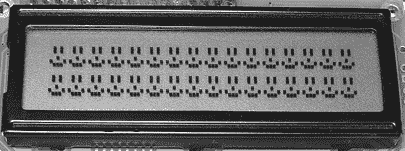

图 9-7：项目 28 的结果

字符 LCD 模块使用简单且有一定的多功能性。例如，利用你所学的内容，你可以将此 LCD 与第六章第 122 页项目 20 中的温度测量部分结合，制作一个详细的数字温度计。然而，如果你需要显示大量数据或图形项，你将需要使用*图形 LCD 模块*。

## 图形 LCD 模块

图形 LCD 模块比字符模块更大且更昂贵，但它们也更具多功能性。你不仅可以用它们显示文本，还可以绘制线条、点、圆圈等，创建视觉效果。本书中使用的图形 LCD 是一个 128 × 160 像素的彩色模块，具有 ST7735 兼容接口，如图 9-8 所示。

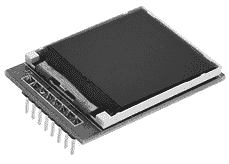

图 9-8：图形 LCD 模块

### 连接图形 LCD

在使用图形 LCD 之前，你需要将 LCD 与 Arduino 之间连接八根线。这可以通过公对母跳线轻松完成，因为 LCD 的连接引脚在工厂时已预焊接。按照表 9-1 所示进行连接。

表 9-1：图形 LCD 模块与 Arduino 之间的连接

| **LCD 引脚标签** | **连接到 Arduino 引脚** | **LCD 引脚功能** |
| --- | --- | --- |
| Vcc | 5 V | VDD |
| GND | GND | VSS (GND) |
| CS | D10 | 片选 |
| RST | D8 | 重置 |
| A0（或 DC） | D9 | 控制 |
| SDA | D11 | 数据输入 |
| SCK | D13 | 时钟输入 |
| LED | 3.3 V | 背光 LED |

### 使用 LCD

在继续之前，你需要通过库管理器安装所需的 Arduino 库。使用第七章中描述的方法，搜索并安装“TFT by Arduino, Adafruit”库。

要使用 LCD，在`void setup()`之前插入以下三行：

```
#include <TFT.h>               // include the graphics LCD library
#include <SPI.h>               // include the library for the SPI data bus
TFT TFTscreen = TFT(10, 9, 8); // allocate pins to LCD
#include <SPI.h>               // library for SPI data bus
```

（不要对“SPI 数据总线”感到慌张；目前为止，上面的内容已经足够了解。我们将在第十九章更详细地讨论 SPI 总线。）

然后，在`void setup()`中添加以下几行，以准备显示：

```
 TFTscreen.begin();             // activate LCD   TFTscreen.background(0, 0, 0); // clear the LCD screen
```

### 控制显示

你可以选择五种文本大小，如图 9-9 和 9-10 所示。

你首先需要考虑的是你生成的显示内容的背景色。可以通过以下设置来完成：

```
 TFTscreen.background(b, g, r); // set background color
```

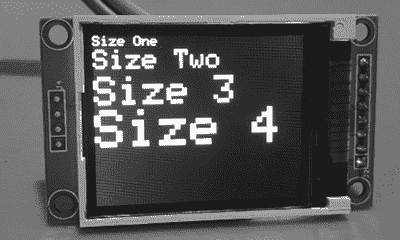

图 9-9：LCD 上可用的五种文本大小中的四种

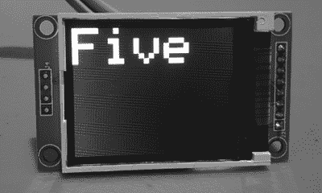

图 9-10：LCD 上可用的五种文本大小中最大的一种

你使用 RGB（红色、绿色、蓝色）值设置背景颜色，值范围为 0 到 255。例如，白色背景会是最大红色、最大绿色和最大蓝色—也就是 255、255、255。纯红色背景则红色值为 255，绿色和蓝色值为 0。黑色背景则三个值都为零。（你可以在[`www.rapidtables.com/web/color/RGB_Color.html`](https://www.rapidtables.com/web/color/RGB_Color.html)找到一个有用的 RGB 颜色表。）

接下来，如果你是第一次在 LCD 上写文本，或者需要在绘图过程中更改文本大小，你需要设置文本大小。为此，请使用：

```
TFTscreen.setTextSize(`x`);
```

其中，`x`是 1 到 5 之间的数字，匹配图 9-9 和 9-10 中显示的文本大小。

然后，使用以下函数设置文本的颜色：

```
TFTscreen.stroke(`B`, `G`, `R`);
```

其中，`B`、`G`和`R`分别是你设置的蓝色、绿色和红色的对应值。

最后，使用以下函数将文本写入屏幕：

```
TFTscreen.text("Hello, world!", `x`, `y`);
```

这将显示文本“Hello, world!”，并将文本的左上角定位在 LCD 的`x`，`y`位置。

这对于静态文本非常有效。然而，如果你想显示一个数字变量，你需要做更多的工作。该变量需要从数字类型转换为字符数组，数组的大小应与可能的最大值匹配。例如，如果你正在读取 Arduino 的模拟输入 0 并想显示该值，可以使用以下代码：

```
char analogZero[4];
```

然后在绘图过程中，在将模拟值发送到 LCD 之前，将值转换为字符串，如下所示：

```
String sensorVal = String(analogRead(A0));
```

这个字符串会被转换并插入到字符数组中：

```
sensorVal.toCharArray(analogZero, 4);
```

最后，为了在 LCD 上显示值，我们可以像往常一样使用`.text()`命令：

```
TFTscreen.text(`analogZero`, `x`, `y`);
```

其中，`analogZero`的值将在`x`，`y`位置显示，文本的左上角位置为`x`，`y`。

现在我们已经了解了所有用于在 LCD 上显示文本的命令，让我们在下一个项目中实际应用它们。

## 项目#29：实际演示文本功能

在这个项目中，你将使 LCD 显示五种文本大小以及从 Arduino 模拟输入 0 读取的数字值。

### 绘图

按照表 9-1 的描述连接你的 LCD，然后上传以下绘图：

```
// Project 29 - Seeing the Text Functions in Action
#include <TFT.h>  // Arduino TFT LCD library
#include <SPI.h>  // SPI bus library
TFT TFTscreen = TFT(10, 9, 8);     // allocate digital pins to LCD
char analogZero[4];
void setup()
{ TFTscreen.begin();               // activate LCD TFTscreen.background(0, 0, 0);   // set display to black
}
void loop()
{ TFTscreen.stroke(255, 255, 255); // white text TFTscreen.setTextSize(1); TFTscreen.text("Size One", 0, 0); TFTscreen.setTextSize(2); TFTscreen.text("Size Two", 0, 10); TFTscreen.setTextSize(3); TFTscreen.text("Size 3", 0, 30); TFTscreen.setTextSize(4); TFTscreen.text("Size 4", 0, 55); delay(2000); TFTscreen.background(0, 0, 0);   // set display to black TFTscreen.setTextSize(5); TFTscreen.text("Five", 0, 0); delay(2000); TFTscreen.background(0, 0, 0);   // set display to black TFTscreen.stroke(255, 255, 255); // white text TFTscreen.setTextSize(1); TFTscreen.text("Sensor Value :\n ", 0, 0); TFTscreen.setTextSize(3); String sensorVal = String(analogRead(A0)); // convert the reading to a char array sensorVal.toCharArray(analogZero, 4); TFTscreen.text(analogZero, 0, 20); delay(2000); TFTscreen.background(0, 0, 0);   // set display to black
}
```

### 运行绘图

你应该看到五种文本大小显示在 LCD 的两个屏幕上。然后你应该看到一个第三个屏幕，显示来自模拟输入 0 的值，如图 9-11 所示。

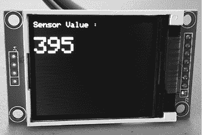

图 9-11：在 TFT LCD 上显示的模拟输入值

## 使用图形函数创建更复杂的显示效果

现在让我们来看看我们可以使用的函数来创建各种显示效果。请记住，图形 LCD 屏幕的分辨率是 160 列和 128 像素，但当我们在草图中的函数中引用这些列和像素时，它们是从 0 到 159 横向计数，0 到 127 纵向计数。此外，和之前的文本示例一样，我们仍然需要使用“在草图中使用字符 LCD”一节中提到的五行代码来初始化显示。

有许多不同的函数可以让你在显示屏上显示点（单个像素）、线条、矩形和圆形。根据项目需求，再加上一些想象力，可以创造出色且实用的显示效果。我们现在将介绍这些函数，之后你可以通过示例草图看到它们的实际应用。

在绘制任何对象之前，你需要定义它的颜色。可以使用

```
TFTscreen.stroke(`B`, `G`, `R`);
```

`B`、`G`和`R`分别是蓝色、绿色和红色颜色级别的对应值。

要在显示屏上绘制一个单独的点，我们使用

```
TFTscreen.point(`X`, `Y`);
```

`X`和`Y`是点的水平和垂直坐标。对于我们的 LCD，`X`的范围是 0 到 159，`Y`的范围是 0 到 127。

要从一个点绘制到另一个点，我们使用

```
TFTscreen.line(`X1`, `Y1`, `X2`, `Y2`);
```

`X1`和`Y1`是起始点的坐标，`X2`和`Y2`是线段的结束坐标。

要绘制一个圆，我们使用

```
TFTscreen.circle(`X`, `Y`, `R`);
```

`X`和`Y`是圆心的坐标，`R`是圆的半径，单位为像素。如果你希望填充圆形（或稍后会描述的矩形）以颜色，而不仅仅是绘制轮廓，可以在`circle()`函数前加上

```
TFTscreen.fill(`B`, `G`, `R`);
```

`B`、`G`和`R`分别是蓝色、绿色和红色填充级别的对应值。请注意，填充颜色不会改变形状的轮廓，所以你仍然需要在形状函数前加上`stroke()`函数。

如果你希望绘制多个填充项，你只需使用一次`fill()`命令。如果你随后希望关闭填充并仅返回轮廓，可以使用以下命令：

```
TFTscreen.noFill();
```

最后，你可以使用以下函数绘制矩形：

```
TFTscreen.rect(`X1`, `Y1`, `X2`, `Y2`);
```

`X1`、`Y1`是矩形左上角的坐标，`X2`、`Y2`是矩形右下角的坐标。

## 项目 #30：图形功能的实际展示

现在我们已经了解了所有用于 LCD 图形功能的命令，接下来让我们在这个项目中实际运用它们。

### 草图

按照表 9-1 中的说明连接你的 LCD，然后上传以下草图：

```
// Project 30 - Seeing the Graphic Functions in Action
#include <TFT.h>                 // Arduino TFT LCD library
#include <SPI.h>                 // SPI bus library
TFT TFTscreen = TFT(10, 9, 8);   // allocate digital pins to LCD
int a;
void setup()
{ TFTscreen.begin(); // activate LCD TFTscreen.background(0, 0, 0); // set display to black randomSeed(analogRead(0));     // for random numbers
}
void loop()
{ // random dots for (a = 0; a < 100; a++) { TFTscreen.stroke(random(256), random(256), random(256)); TFTscreen.point(random(160), random(120)); delay(10); } delay(1000); TFTscreen.background(0, 0, 0); // set display to black // random lines for (a = 0; a < 100; a++) { TFTscreen.stroke(random(256), random(256), random(256)); TFTscreen.line(random(160), random(120), random(160), random(120)); delay(10); } delay(1000); TFTscreen.background(0, 0, 0); // set display to black // random circles for (a = 0; a < 50; a++) { TFTscreen.stroke(random(256), random(256), random(256)); TFTscreen.circle(random(160), random(120), random(50)); delay(10); } delay(1000); TFTscreen.background(0, 0, 0); // set display to black // random filled circles for (a = 0; a < 50; a++) { TFTscreen.fill(random(256), random(256), random(256)); TFTscreen.stroke(random(256), random(256), random(256)); TFTscreen.circle(random(160), random(120), random(50)); delay(10); } delay(1000); TFTscreen.background(0, 0, 0); // set display to black // random rectangles TFTscreen.noFill(); for (a = 0; a < 50; a++) { TFTscreen.stroke(random(256), random(256), random(256)); TFTscreen.rect(random(160), random(120), random(160), random(120)); delay(10); } delay(1000); TFTscreen.background(0, 0, 0); // set display to black // random filled rectangles TFTscreen.noFill(); for (a = 0; a < 50; a++) { TFTscreen.fill(random(256), random(256), random(256)); TFTscreen.stroke(random(256), random(256), random(256)); TFTscreen.rect(random(160), random(120), random(160), random(120)); delay(10); } delay(1000); TFTscreen.background(0, 0, 0); // set display to black
}
```

上传草图后，显示屏将执行我们在本章中讨论的所有图形功能。例如，你应该能看到图 9-12 中展示的线条。

利用到目前为止讨论的函数和一些想象力，你可以创建各种显示效果或将数据以图形方式展示。在下一部分中，我们将基于我们的快速读取温度计项目，使用 LCD 屏幕和这些函数来扩展功能。

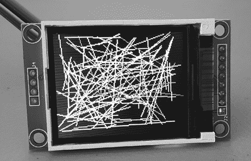

图 9-12：LCD 上的随机线条

## 项目 #31：创建温度历史监控器

在这个项目中，我们的目标是每隔 20 分钟测量一次温度，并以点图的形式显示最近 120 次读数。每个读数将表示为一个像素，纵轴为温度，横轴为时间。

最新的读数将出现在左侧，显示屏将不断地从左到右滚动显示读数。当前温度也会作为数字显示。

### 算法

尽管这个项目听起来可能很复杂，但实际上它非常简单，只需要两个函数。第一个函数从 TMP36 温度传感器获取温度读数，并将其存储在一个包含 120 个值的数组中。每当获取新的读数时，前 119 个值会向数组下方移动，为新读数腾出位置，并删除最旧的读数。

第二个函数用于在 LCD 屏幕上绘制图形。它显示当前温度、图表的刻度以及每个像素的位置，用于展示温度数据随时间变化的情况。

### 硬件

下面是你创建这个项目所需的内容：

+   一个 160 × 128 像素的 ST7735 TFT LCD 模块，如本章所使用的。

+   一个 TMP36 温度传感器

+   各种连接线

+   一块面包板

+   Arduino 和 USB 线

按照表 9-1 的描述连接图形 LCD，并将 TMP36 传感器连接到 5V、模拟 5 和 GND，正如你在第六章的项目 20 中所做的那样。

### 草图

我们的草图结合了第六章中用于测量温度的代码，以及本章前面描述的图形函数。输入并上传以下草图，其中包含有关所使用函数的相关注释：

```
// Project 31 - Creating a Temperature History Monitor
#include <TFT.h>  // Arduino TFT LCD library
#include <SPI.h>  // SPI bus library
TFT TFTscreen = TFT(10, 9, 8); 
// allocate digital pins to LCD
int tcurrent = 0;
int tempArray[120];
char currentString[3];
void getTemp() // function to read temperature from TMP36
{ float sum = 0; float voltage = 0; float sensor = 0; float celsius; // read the temperature sensor and convert the result to degrees C sensor   = analogRead(5); voltage  = (sensor * 5000) / 1024; voltage  = voltage - 500; celsius  = voltage / 10; tcurrent = int(celsius); // insert the new temperature at the start of the array of past temperatures for (int a = 119 ; a >= 0 ; --a ) { tempArray[a] = tempArray[a - 1]; } tempArray[0] = tcurrent;
}
void drawScreen() // generate TFT LCD display effects{ int q; // display current temperature TFTscreen.background(0, 0, 0);   // clear screen to black TFTscreen.stroke(255, 255, 255); // white text TFTscreen.setTextSize(2); TFTscreen.text("Current:", 20, 0); String tempString = String(tcurrent); tempString.toCharArray(currentString, 3); TFTscreen.text(currentString, 115, 0); // draw scale for graph TFTscreen.setTextSize(1); TFTscreen.text("50", 0, 20); TFTscreen.text("45", 0, 30); TFTscreen.text("40", 0, 40); TFTscreen.text("35", 0, 50); TFTscreen.text("30", 0, 60); TFTscreen.text("25", 0, 70); TFTscreen.text("20", 0, 80); TFTscreen.text("15", 0, 90); TFTscreen.text("10", 0, 100); TFTscreen.text(" 5", 0, 110); TFTscreen.text(" 0", 0, 120); TFTscreen.line(20, 20, 20, 127); // plot temperature data points for (int a = 25 ; a < 145 ; a++) { // convert the temperature value to a suitable y-axis position on the LCD q = (123 - (tempArray[a - 25] * 2)); TFTscreen.point(a, q); }
}
void setup()
{ TFTscreen.begin();             // activate LCD TFTscreen.background(0, 0, 0); // set display to black
}
void loop()
{ getTemp(); drawScreen(); for (int a = 0 ; a < 20 ; a++) // wait 20 minutes until the next reading { delay(60000);                // wait 1 minute }
}
```

### 运行草图

最终的显示效果应该类似于图 9-13。

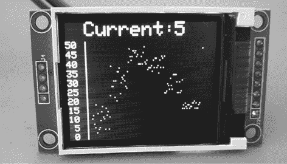

图 9-13：项目 31 的结果

### 修改草图

不同的人在看到不同的视觉格式呈现数据时，能更好地理解数据。出于这个原因，你可能希望改为创建一个条形图，垂直线表示不同的数值。

这种类型的项目也可以用来显示其他类型的数据，例如通过模拟输入引脚测量的各种传感器的电压。或者你可以添加另一个温度传感器，显示两个传感器的值。几乎任何返回值的东西都可以使用图形 LCD 模块进行显示。

## 展望未来

现在你已经有了使用 LCD 的经验，你可以看到 Arduino 实际上是一个小型计算机：它可以接收并处理输入数据，并将其显示到外部世界。但这仅仅是开始。在下一章中，你将更加深入地研究库，学习编写自己的库，然后在之前的项目中使用你新创建的库与温度传感器一起工作。
