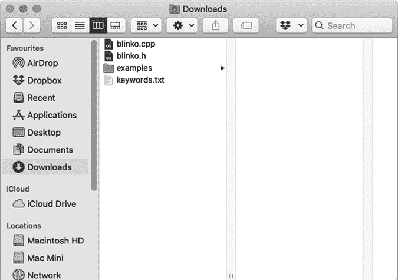
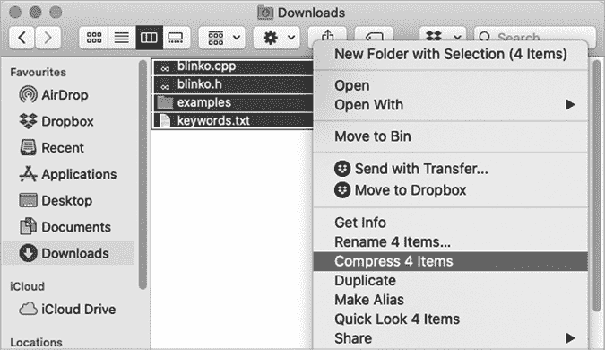
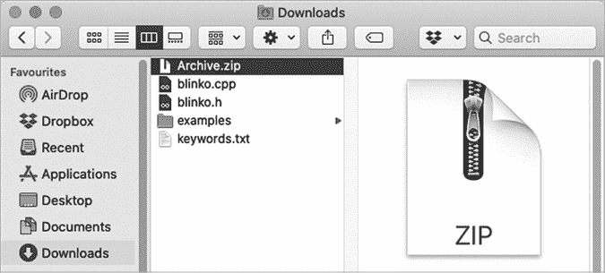
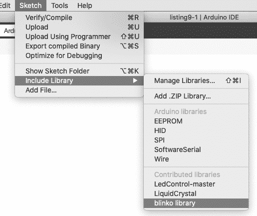
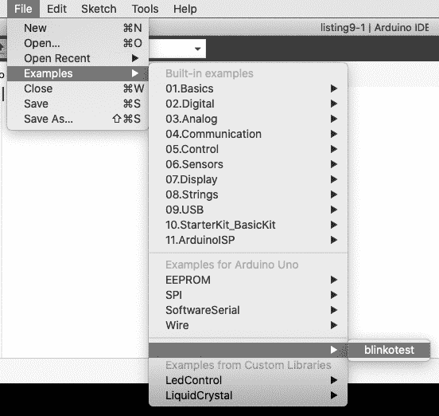
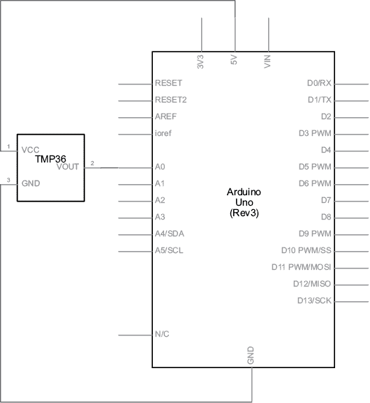
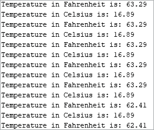

# 第十章：创建你自己的 Arduino 库

在本章中你将

+   了解 Arduino 库的组成部分

+   为重复任务创建一个简单的库

+   学习如何在 Arduino IDE 中安装库

+   创建一个接受值并执行功能的库

+   创建一个处理传感器数据并以易于使用的形式返回值的库

回想一下第七章中描述的第 22 个项目，你安装了一个 Arduino 库，该库包括将数据保存到 SD 卡所需的函数。使用这个库减少了编写草图所需的时间，因为该库提供了与卡模块相关的函数。

将来，当你编写草图来解决自己的问题和执行自己的任务时，你可能会发现自己重复使用某些已创建的函数。此时，创建自己的 Arduino 库将是明智之举，你可以轻松地在草图中安装和使用它。

在本章中，你将学习如何将函数转换为 Arduino 库。通过这里提供的示例，你将了解创建自定义库所需的知识。现在让我们开始吧。

## 创建你的第一个 Arduino 库

在我们的第一个示例中，参考清单 10-1。它包含两个函数，`blinkSlow()` 和 `blinkFast()`，分别用于以慢速或快速的速度闪烁 Arduino 的板载 LED。

```
// Listing 10-1
void setup() 
{ pinMode(13, OUTPUT); // using onboard LED
}
void blinkSlow()
{ for (int i = 0; i < 5; i++) { digitalWrite(13, HIGH); delay(1000); digitalWrite(13, LOW); delay(1000); }
}
void blinkFast()
{ for (int i = 0; i < 5; i++) { digitalWrite(13, HIGH); delay(250); digitalWrite(13, LOW); delay(250); }
}
void loop()
{ blinkSlow(); delay(1000); blinkFast(); delay(1000);
}
```

清单 10-1：闪烁 Arduino 板载 LED

如果没有库，每次你编写新的草图并想使用 `blinkSlow()` 和 `blinkFast()` 函数时，都必须手动输入它们。另一方面，如果你将这些函数的代码放入一个库，从那时起，你只需要在草图的开始处调用该库，只用一行代码。

### Arduino 库的构成

一个 Arduino 库由三个文件组成，此外还可以包含一些可选的示例草图，展示如何使用该库。每个 Arduino 库必备的三个文件如下：

1.  ***<library>.h*** 头文件

1.  ***<library>.cpp*** 源文件

1.  ***KEYWORDS.TXT*** 关键字定义

在前两个文件名中，你将用库的实际名称替换 *<library>*。对于我们的第一个示例，我们将把 Arduino 库命名为 blinko。因此，我们的两个文件将是 *blinko.h* 和 *blinko.cpp*。

### 头文件

*blinko.h* 文件被称为*头文件*，因为它包含了库内部使用的函数、变量等的定义。blinko 库的头文件见于清单 10-2。

```
// Listing 10-2
/*1 blinko.h - Library for flashing an Arduino's onboard LED connected to D13
*/2 #ifndef blinko_h
#define blinko_h3 #include "Arduino.h" // gives library access to standard types and constants // of the Arduino language4 class blinko // functions and variables used in the library
{ public: blinko();    void slow();  void fast();
};5 #endif
```

清单 10-2：blinko 库头文件

头文件与典型的 Arduino 草图有一些相似之处，但也有一些区别。在第 1 行，有一个关于库用途的有用注释。虽然这样的注释不是必需的，但它们应该包含在内，以便让别人更容易使用这个库。

在第 2 行，代码检查库是否已经在主草图中声明。在第 3 行，包含了标准 Arduino 库，以便我们的 blinko 库可以访问标准 Arduino 草图函数、类型和常量。

然后，在第 4 行，我们创建了一个类。你可以将 *类* 理解为一个地方，集中包含了库所需的所有变量和函数，包括库的名称。在类中，可以有公共变量和函数，草图需要使用库时可以访问这些；也可以有私有变量和函数，这些只能在类内部使用。最后，每个类都有一个与类同名的 *构造函数*，用于创建类的实例。这个概念可能听起来有点复杂。然而，在本章中的示例进行复习并自己制作几个库后，你会对这些结构有信心。

在我们的类中，你可以看到我们有库的构造函数 `blinko()` 和两个库中的函数：`slow()` 和 `fast()`。它们位于 `public:` 声明之后，意味着任何访问 blinko 库的用户（“任何公众成员”）都可以使用这些函数。

最后，在第 5 行，我们结束了头文件的定义。通过将头文件定义包裹在 `if` 语句中，我们确保头文件不会被加载两次。

### 源文件

接下来，让我们看一下 *blinko.cpp* 文件。*.cpp* 文件被称为 *源文件*，因为它包含了在使用库时会运行的代码。blinko 库的源文件见 清单 10-3。

```
// Listing 10-3
/*1 blinko.cpp - Library for flashing an Arduino's onboard LED connected to D13
*/2 #include “Arduino.h” // gives library access to standard types and constants // of the Arduino language
#include "blinko.h"3 blinko::blinko()     // things to do when library is activated
{
	pinMode(13, OUTPUT);
}4 void blinko::slow()
{
	for (int i=0; i<5; i++)
	{ 		digitalWrite(13, HIGH);
		delay(1000);
		digitalWrite(13, LOW);
		delay(1000); 
	}
}4 void blinko::fast()
{
	for (int i=0; i<5; i++)
	{
		 digitalWrite(13, HIGH); delay(250); 		 digitalWrite(13, LOW);
		 delay(250); 
	}
}
```

清单 10-3：blinko 库源文件

源文件包含了我们编写的函数，这些函数我们希望可以重复使用。此外，这里还需要一些新的结构元素。在第 2 行，我们让库访问标准的 Arduino 函数、类型和常量，以及我们自己的库头文件。

在第 3 行，我们有构造函数的定义。构造函数包含了在使用库时应该发生的事情。在我们的例子中，我们已将数字引脚 13 设置为输出，因为我们正在使用 Arduino 的板载 LED。

从第 4 行开始，我们列出了想要包含在此库中的函数。它们就像你在独立的草图中创建的函数，只不过有一个重要的区别：它们的定义以库类名和两个冒号开头。例如，不是输入 `void fast()`，而是输入 `void blinko::fast()`。

### KEYWORDS.TXT 文件

最后，我们需要创建 *KEYWORDS.TXT* 文件。Arduino IDE 使用该文件来确定库中的关键字，并在 IDE 中高亮显示这些词。清单 10-4 是我们 blinko 库的 *KEYWORDS.TXT* 文件。

```
// Listing 10-4
blinko		KEYWORD1
slow		KEYWORD2
fast		KEYWORD2
```

清单 10-4：blinko 库关键字文件

第一行是库的名称，称为`KEYWORD1`。库的函数被称为`KEYWORD2`。请注意，关键字与其定义之间的空格必须通过按下 Tab 键而非空格键来创建。

此时，你已经拥有了工作库所需的三个文件。包含一个示例草图是个不错的主意，这样用户可以理解函数的功能。列表 10-5 是我们的 blinko 库的示例草图。

```
// Listing 10-5, blinkotest.ino1 #include <blinko.h>2 blinko ArduinoLED;
void setup() {
}
void loop(){3   ArduinoLED.slow();  // blink LED slowly, once every second delay(1000);4   ArduinoLED.fast();  // blink LED rapidly, four times per second delay(1000);
}
```

列表 10-5：我们的 blinko 库的示例草图

如你所见，草图是基础的。它仅展示了我们库中`slow()`和`fast()`两个函数的使用。最终用户在安装库之后所需做的，就是包含库 1，创建实例 2，然后在需要时调用这两个函数，如 3 和 4 所示。

## 安装你的新 Arduino 库

现在你已经创建了一个新的 Arduino 库，一个简便的存储和分发方式是创建一个 ZIP 文件。未来的用户获得 ZIP 文件后，可以像第七章中演示的那样轻松安装库。

### 使用 Windows 7 及更高版本创建 ZIP 文件

要使用 Windows 创建 ZIP 文件，请按照以下说明操作。

首先，将三个库文件和示例草图（存储在自己的文件夹中，就像所有草图一样）放置在同一个位置。图 10-1 展示了一个示例。


图 10-1：我们的 Arduino 库文件在一个文件夹中

选择所有文件，右键点击高亮显示的文件中的任意位置，选择**发送到**▶**压缩（ZIP）文件夹**，如图 10-2 所示。

文件夹中会出现一个新文件，扩展名为*.zip*，且启用了文件名编辑。对于我们的库，将名称更改为*blinko*，然后按回车键，如图 10-3 所示。

现在，你可以继续阅读第 193 页的“安装你的新库”部分。


图 10-2：压缩库文件


图 10-3：更改库 ZIP 文件名称

### 使用 Mac OS X 或更高版本创建 ZIP 文件

要使用 Mac OS X 创建 ZIP 文件，请将三个库文件和示例草图（存储在自己的文件夹中，就像所有草图一样）放置在同一个位置。图 10-4 展示了一个示例。



图 10-4：我们的 Arduino 库文件

选择所有文件，右键点击文件中的任意位置，选择**压缩 4 个项目**，如图 10-5 所示。



图 10-5：压缩库文件

一会儿后，名为*Archive.zip*的新文件将出现在文件夹中，如图 10-6 所示。



图 10-6：文件已经被压缩。

点击*Archive.zip*文件夹并将其名称更改为*blinko.zip*，如图 10-7 所示。


图 10-7：我们的 Arduino 库安装 ZIP 文件

现在，您已经拥有一个库 ZIP 文件，您可以轻松地将其分发给他人或自己安装。

### 安装您的新库

目前，您可以使用 ZIP 文件方法安装您的库，该方法在第七章第 134 页的《下载 Arduino 库作为 ZIP 文件》一节中有详细介绍。安装文件后，重新启动 Arduino IDE，选择**草图**▶**包含库**，即可看到您的库列出，如图 10-8 所示。



图 10-8：我们的 Arduino 库，现在可以在 IDE 中使用

此外，您现在可以轻松访问示例草图；选择**文件**▶**示例**▶**blinko**，如图 10-9 所示。



图 10-9：我们的 Arduino 库示例草图已经安装。

## 创建一个接受值以执行功能的库

现在，您已经掌握了创建基本 Arduino 库的知识，可以进入下一个层次：创建一个能够接受值并对此进行操作的库。我们将再次查看草图中的示例函数，并将其转换为一个更有用的库。

请参考 Listing 10-6 中的草图。它使用了函数`void blinkType()`，该函数告诉 Arduino 需要多少次闪烁板载 LED，并设置开/关周期。

```
// Listing 10-6
void setup() { pinMode(13, OUTPUT); // use onboard LED
}
void blinkType(int blinks, int duration)
// blinks - number of times to blink the LED
// duration – blink duration in milliseconds
{ for (int i = 0; i < blinks; i++) { digitalWrite(13, HIGH); delay(duration); digitalWrite(13, LOW); delay(duration); }
}
void loop()
{ // blink LED 10 times, with 250 ms duration blinkType(10, 250); delay(1000); // blink LED three times, with 1 second duration blinkType(3, 1000); delay(1000);
}
```

Listing 10-6：`blinkType()`函数的演示草图

如您所见，函数`void blinkType()`接受两个值，并据此执行操作。第一个值是打开和关闭板载 LED 的次数，第二个值是每次闪烁的延迟时间（以毫秒为单位）。

让我们将这个函数转换为一个名为 blinko2 的 Arduino 库。Listing 10-7 显示了这个库的头文件。

```
// Listing 10-7
/* blinko2.h - Blinking the Arduino's onboard LED on D13 Accepts number of blinks and on/off delay
*/
#ifndef blinko2_h#define blinko2_h
#include "Arduino.h"
class blinko2
{ public: blinko2();    void blinkType(int blinks, int duration); 1   private: int blinks; int duration;
};
#endif
```

Listing 10-7：blinko2 库的头文件

头文件与原始 blinko 库的头文件结构相同。然而，在第 1 行有一个新的部分叫做`private`。在`private`部分声明的变量仅供库内部使用，不能被更大的 Arduino 草图使用。您可以在 Listing 10-8 所示的库源文件中看到这些变量的使用。

```
// Listing 10-8
/* blinko2.cpp - Blinking the Arduino's onboard LED on D13 Accepts number of blinks and on/off delay
*/
#include "Arduino.h" 
#include "blinko2.h"
blinko2::blinko2() 
{1   pinMode(13, OUTPUT);
}2 void blinko2::blinkType(3int blinks, 4int duration)
{ for (int i=0; i<blinks; i++) { digitalWrite(13, HIGH); delay(duration); digitalWrite(13, LOW); delay(duration);   }
}
```

Listing 10-8：blinko2 库源文件

blinko2 的源文件保持与原始 blinko 库源文件相同的结构。

我们将数字引脚 13 设置为输出（见 1）。在 2 处，我们声明了函数`blinkType()`，它接受三次闪烁的次数（见 3）和延迟时间（见 4）。您可以通过我们库的示例草图在 Listing 10-9 中看到这一操作。

```
// Listing 10-9
#include <blinko2.h>
blinko2 ArduinoLED;
void setup() {}
void loop() 
{ ArduinoLED.blinkType(3,250); 
// blink LED three times, with a duration of 250 ms delay(1000); ArduinoLED.blinkType(10,1000); 
// blink LED 10 times, with a duration of 1 second delay(1000);
}
```

Listing 10-9：我们 blinko2 库的示例草图

接下来，我们需要为新的 blinko2 库创建关键词文件。不要忘记在单词之间使用制表符，而不是空格。以下是我们的*KEYWORDS.TXT*文件：

```
blinko2          KEYWORD1
blinkType        KEYWORD2
```

现在创建你的 ZIP 文件，并使用本章前面描述的方法安装库。然后打开并运行 blinko2 示例草图，体验它的工作方式。

## 创建一个处理和显示传感器值的库

在我们的 Arduino 库最终示例中，我们将重新回顾多个早期项目中使用的模拟设备 TMP36 温度传感器。我们的 ArduinoTMP36 示例库将从 TMP36 获取原始值，并通过串口监视器显示摄氏度和华氏度的温度。

首先，通过连接你的 TMP36 与 Arduino，按照图 10-10 中的示意图进行连接。



图 10-10：ArduinoTMP36 库使用示意图

清单 10-10 是我们希望将其转换为库的一个草图。它使用两个函数，`readC()`和`readF()`，从 TMP36 传感器通过模拟引脚 0 获取原始读数，将其转换为摄氏度和华氏度，并返回结果。

```
// Listing 10-10
// display temperature from TMP36 sensor in C and F 
float temperature;
float readC()
{ float tempC; tempC = analogRead(0); tempC = tempC = (tempC * 5000) / 1024; tempC = tempC - 500; tempC = tempC / 10; return tempC;
}
float readF()
{ float tempC; float tempF; tempC = analogRead(0); tempC = tempC = (tempC * 5000) / 1024; tempC = tempC - 500; tempC = tempC / 10; tempF = (tempC * 1.8) + 32; return tempF;
}
void setup()
{ Serial.begin(9600);
}
void loop()
{ Serial.print("Temperature in Celsius is: "); temperature = readC(); Serial.println(temperature); Serial.print("Temperature in Fahrenheit is: "); temperature = readF(); Serial.println(temperature); delay(1000);
}
```

清单 10-10：TMP36 演示草图

温度转换函数是包括在库中的理想候选项，我们将其命名为 ArduinoTMP36。头文件如清单 10-11 所示。

```
// Listing 10-111 #ifndef ArduinoTMP36_h
#define ArduinoTMP36_h
#include "Arduino.h"
class ArduinoTMP36
{2   public: ArduinoTMP36(); float readC(); float readF();3   private: float tempC; float tempF;
};
#endif
```

清单 10-11：ArduinoTMP36 库头文件

此时，你可能已经认识到头文件的结构。我们在第一部分设置了定义。在第二部分的`class`内部，我们声明了公共项，包括构造函数以及`readC()`和`readF()`函数。我们还在第三部分声明了私有项；这些包括库中使用的两个变量。

接下来是库源文件，见清单 10-12。

```
// Listing 10-12
#include "Arduino.h" 
#include "ArduinoTMP36.h"
ArduinoTMP36::ArduinoTMP36() 
{
}
float ArduinoTMP36::readC()
{ float tempC; tempC = analogRead(0); tempC = tempC=(tempC*5000)/1024; tempC = tempC-500; tempC = tempC/10; return tempC;
}
float ArduinoTMP36::readF()
{ float tempC; float tempF; tempC = analogRead(0); tempC = tempC=(tempC*5000)/1024; tempC = tempC-500; tempC = tempC/10; tempF = (tempC*1.8)+32; return tempF;
}
```

清单 10-12：ArduinoTMP36 库源文件

源文件包含用于计算温度的两个函数。它们被定义为`float`类型，因为它们返回浮动值。温度是使用与第四章第 8 个项目相同的公式计算的。

最后，我们需要为新的 ArduinoTMP36 库创建关键词文件。不要忘记在单词之间使用制表符，而不是空格。我们的*KEYWORDS.TXT*文件如下所示：

```
ArduinoTMP36             KEYWORD1
readC                    KEYWORD2
readF                    KEYWORD2
```

现在创建你的 ZIP 文件，并使用本章前面描述的方法安装库。然后打开并运行 ArduinoTMP36 示例草图，见清单 10-13。

```
// Listing 10-131 #include <ArduinoTMP36.h>
ArduinoTMP36 thermometer;2 float temperature;
void setup()
{ Serial.begin(9600);
}
void loop()
{ Serial.print("Temperature in Celsius is: ");3   temperature=thermometer.readC(); Serial.println(temperature); Serial.print("Temperature in Fahrenheit is: ");4   temperature=thermometer.readF(); Serial.println(temperature); delay(1000);
}
```

清单 10-13：ArduinoTMP36 库示例草图

只需包含库并在第 1 步创建实例。然后，在第 2 步声明一个变量来接收来自库的输出。之后，温度会在第 3 和第 4 步分别以摄氏度和华氏度返回。

打开串口监视器窗口，并将数据传输速度设置为 9600 波特率，你应该会看到一个滚动更新的当前温度列表，显示的温度单位为摄氏度和华氏度，如图 10-11 所示。



图 10-11：ArduinoTMP36 库输出示例

现在你可以体会到，通过使用库而不是每次创建新草图时都包含函数，节省了多少时间和草图大小。

## 展望未来

既然你已经有了编写 Arduino 库的经验，你可以创建自己的库。这将帮助你更深入地理解其他来源提供的库。你也可以通过为你已经完成的书中的项目创建库来进行练习。

在下一章，你将学习如何处理通过数字键盘输入的用户输入，所以翻到下一页开始吧。
