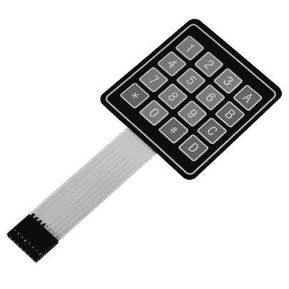
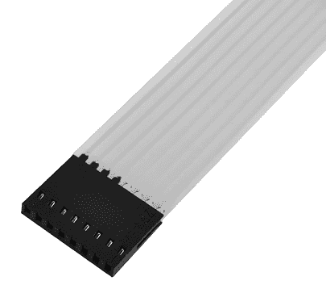
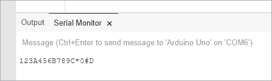
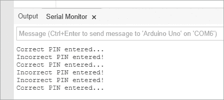

# 第十一章：数字键盘

在本章中，你将

+   学习如何将数字键盘连接到你的 Arduino

+   从键盘读取值并在草图中使用

+   使用 `switch case` 语句扩展决策系统

+   创建一个 PIN 码控制的锁或开关

## 使用数字键盘

随着你的项目变得更加复杂，当 Arduino 未连接到带键盘的设备时，你可能需要接受用户的数字输入。例如，你可能希望通过输入一个秘密数字来开启或关闭某个设备。一种选择是将 10 个或更多的按钮接入不同的数字输入引脚（对应数字 0 到 9），但使用一个数字键盘要更简单，就像图 11-1 所示。



图 11-1：数字键盘

使用键盘的好处之一是，它只需使用 8 个引脚就能支持 16 个活动按钮，并且借助一个聪明的 Arduino 库，你无需像在第四章那样为去抖动添加下拉电阻。

此时，你需要下载并安装 Arduino 键盘库，该库可从[`github.com/Chris--A/Keypad/archive/master.zip`](https://github.com/Chris--A/Keypad/archive/master.zip)获取。

### 键盘接线

将键盘接线到 Arduino 上很简单。将键盘正面朝上，看看带状电缆的末端。你会看到一排八个女性连接器，如图 11-2 所示。



图 11-2：键盘连接器

从左到右读取插座，编号从 8 到 1。对于本书中的所有键盘项目，你将按照表 11-1 中所示，将键盘引脚插入 Arduino 引脚。

表 11-1：键盘与 Arduino 连接

| **键盘引脚编号** | **Arduino 引脚** |
| --- | --- |
| 8 | 数字 9 |
| 7 | 数字 8 |
| 6 | 数字 7 |
| 5 | 数字 6 |
| 4 | 数字 5 |
| 3 | 数字 4 |
| 2 | 数字 3 |
| 1 | 数字 2 |

### 为键盘编程

当你为键盘编写草图时，必须包括一些代码行来启用键盘，这些代码在清单 11-1 中有说明。所需的代码从第 1 行开始，到第 5 行结束。

```
// Listing 11-11 // Beginning of keypad configuration code
#include <Keypad.h>
const byte ROWS = 4; // set display to four rows
const byte COLS = 4; // set display to four columns2 char keys[ROWS][COLS] = { {'1','2','3','A'}, {'4','5','6','B'}, {'7','8','9','C'}, {'*','0','#','D'}
};3 byte rowPins[ROWS] = {9, 8, 7, 6}; 4 byte colPins[COLS] = {5, 4, 3, 2}; 
Keypad keypad = Keypad( makeKeymap(keys), rowPins, colPins, ROWS, COLS );5 // End of keypad configuration code
void setup()
{ Serial.begin(9600);
} 
void loop(){ char key = keypad.getKey();  if (key){ Serial.print(key); }
}
```

清单 11-1：数字键盘示范草图

在第 2 行，我们介绍了 `keys`，这是一个字符变量数组，包含一个或多个可以通过计算机键盘生成的字母、数字或符号。在这个例子中，它包含了你的 Arduino 可以从键盘接收到的数字和符号。

第 3 行和第 4 行的代码定义了在 Arduino 上使用的数字引脚。通过这些代码和表 11-1，如果你想改变用于输入的数字引脚，可以进行修改。

### 测试草图

上传草图后，打开串口监视器并按下键盘上的一些按键。你按下的按键字符将显示在串口监视器中，如图 11-3 所示。



图 11-3：按下键盘上的按键后的结果

## 使用`switch case`做决策

当你需要将两个或更多变量与另一个值进行比较时，使用`switch case`语句通常会比使用`if then`语句更容易且更简洁，因为`switch case`语句可以进行任意次数的比较，并在比较为真时执行代码。例如，如果我们有一个整数变量`xx`，其可能的值为`1`、`2`或`3`，并且我们希望根据值为`1`、`2`或`3`来运行不同的代码，我们可以使用以下代码来替换`if then`语句：

```
switch(xx)
{ case 1: // do something when the value of xx is 1 break;  // finish and move on with sketch case 2: // do something when the value of xx is 2 break; case 3: // do something when the value of xx is 3 break; default: // do something if xx is not 1, 2 or 3 // default is optional
}
```

这个代码段末尾的可选`default:`部分允许你选择在`switch case`语句中没有有效比较时运行某些代码。

## 项目 #32：创建一个键盘控制的锁

在这个项目中，我们将开始创建一个键盘控制的锁。我们将使用清单 11-1 中描述的基本设置，但还会包含一个六位数的秘密代码，用户需要在键盘上输入。串口监视器会告诉用户他们输入的代码是否正确。

秘密代码存储在草图中，但不会显示给用户。根据输入的代码（PIN）是否正确，草图将调用不同的函数。为了激活和解除激活锁，用户必须按下`*`，然后输入秘密号码，再按`#`。

### 草图

输入并上传此草图：

```
// Project 32 - Creating a Keypad-Controlled Lock
// Beginning of necessary code
#include <Keypad.h>
const byte ROWS = 4; // set display to four rows
const byte COLS = 4; // set display to four columns
char keys[ROWS][COLS] = { {'1','2','3','A'}, {'4','5','6','B'}, {'7','8','9','C'}, {'*','0','#','D'}
};
byte rowPins[ROWS] = {9, 8, 7, 6}; 
byte colPins[COLS] = {5, 4, 3, 2}; 
Keypad keypad = Keypad( makeKeymap(keys), rowPins, colPins, ROWS, COLS );
// End of necessary code1 char PIN[6]={'1','2','3','4','5','6'}; // our secret number
char attempt[6]={0,0,0,0,0,0};
int z=0;
void setup(){ Serial.begin(9600);
}
void correctPIN()   // do this if the correct PIN is entered
{ Serial.println("Correct PIN entered...");
}
void incorrectPIN() // do this if an incorrect PIN is entered
{ Serial.println("Incorrect PIN entered!");
}
void checkPIN()
{ int correct=0; 2   for (int i = 0;  i < 6 ;  i++ ) {
// Goes step-by-step through the 6-character array. 
// If each char matches each char in the PIN, increments the 
// counter.
if (attempt[i]==PIN[i]) { correct++; } } if (correct==6) {3     correctPIN(); }  else {4     incorrectPIN(); } for (int i=0; i<6; i++) // removes previously entered code attempt  { attempt[i]=0; }
}
void readKeypad()
{ char key = keypad.getKey(); if (key != NO_KEY) {5     switch(key) { case '*': z=0; break; case '#': delay(100); // removes the possibility of switch bounce checkPIN(); break; default: attempt[z]=key; z++; } }
}
void loop()
{6   readKeypad();
}
```

### 理解草图

在完成常规的初始化例程后（如清单 11-1 所示），草图会不断地“监听”键盘，通过运行第 6 行的`readKeypad()`函数来实现。按下按键后，Arduino 会使用第 5 行的`switch case`语句检查按下的按键值。Arduino 会将按下的按键值存储在`attempt`数组中，当用户按下`#`时，Arduino 会调用`checkPIN()`函数。

在第 2 行，Arduino 将按键值与存储在`PIN`数组中的 PIN 值进行比较。如果输入的序列正确，函数`correctPIN()`将在第 3 行被调用，你可以在其中添加自己的代码进行执行。如果输入的序列错误，则调用第 4 行的`incorrectPIN()`函数。最后，一旦用户的输入被检查完毕，代码会从内存中删除输入值，以便为下一个测试做好准备。

### 测试草图

在将草图上传到 Arduino 后，打开串口监视器窗口，按下数字键盘上的星号（`*`），输入秘密号码，然后按下井号（`#`）。尝试输入正确和错误的数字。你的结果应类似于图 11-4 中显示的输出。

这个示例为你自己的 PIN 激活设备（如锁、警报或任何你能想象的设备）提供了一个完美的基础。只需确保在`correctPIN()`和`incorrectPIN()`中替换你希望在输入正确或错误的序列时执行的代码。



图 11-4：输入正确和错误的 PIN 后的结果

## 展望未来

你已经学会了另一种为你的 Arduino 收集输入的方式。你还掌握了创建一个有用的方法来通过数字键盘控制草图的基础知识，以及创建一个组合锁来访问你 Arduino 能控制的任何内容的基础知识。此外，你还学会了非常有用的`switch case`语句。在下一章中，你将学习另一种输入形式：触摸屏。
