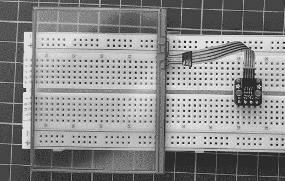
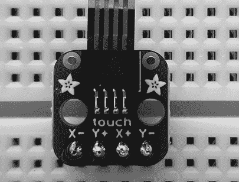
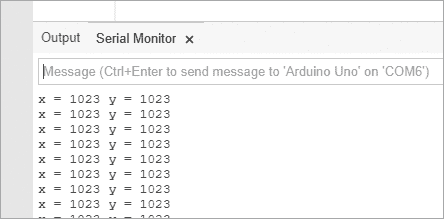
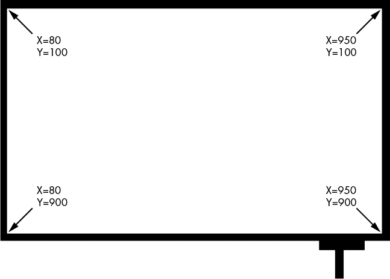
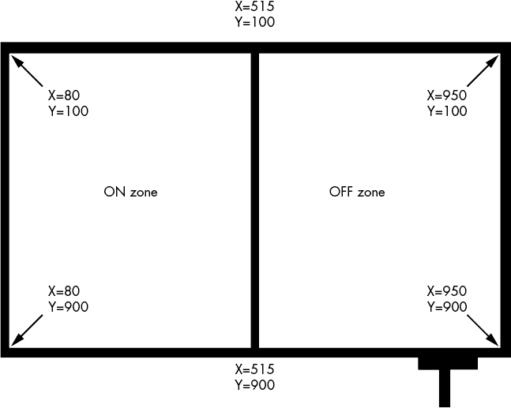
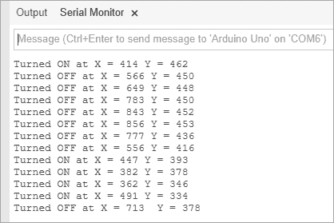
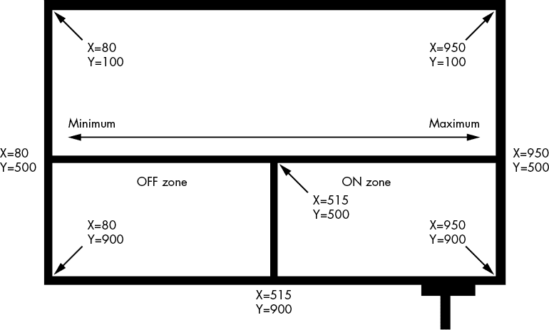

# 第十二章：接受触摸屏的用户输入

在本章中，你将

+   学习如何将电阻式触摸屏连接到 Arduino

+   探索触摸屏可以返回的值

+   创建一个简单的开关

+   学习如何使用 `map()` 函数

+   创建一个带有调光控制的开关

如今，我们随处可见触摸屏：在智能手机、平板电脑甚至便携式游戏机上。那么为什么不使用触摸屏来接收 Arduino 用户的输入呢？

## 触摸屏

触摸屏可能相当昂贵，但我们将使用一款价格便宜的型号，来自 Adafruit（零件号 333 和 3575），最初为 Nintendo DS 游戏机设计。

这个触摸屏的尺寸大约是 2.45 x 3 英寸，如 图 12-1 所示。



图 12-1：安装在无焊接面包板上的触摸屏

注意右侧小电路板上连接的水平排线。这个 *扩展板* 用来将 Arduino 和面包板连接到触摸屏。扩展板附带的插针需要在使用前进行焊接。图 12-2 显示了扩展板的特写。



图 12-2：触摸屏扩展板

### 连接触摸屏

按照 表 12-1 中的说明将触摸屏扩展板连接到 Arduino。

表 12-1：触摸屏扩展板连接

| **扩展板引脚** | **Arduino 引脚** |
| --- | --- |
| X− | A3 |
| Y+ | A2 |
| X+ | A1 |
| Y− | A0 |

## 项目 #33：在触摸屏上处理区域

触摸屏有两层电阻涂层，位于上层塑料膜和下层玻璃之间。一层涂层作为 x 轴，另一层作为 y 轴。当电流通过每层涂层时，涂层的电阻会根据触摸位置的不同而变化；通过测量电流，可以确定触摸区域的 x 和 y 坐标。

在这个项目中，我们将使用 Arduino 来记录触摸屏上的触摸位置。我们还将把触摸信息转换为表示屏幕区域的整数。

### 硬件

以下硬件是必需的：

+   一块 Adafruit 触摸屏，零件号 333

+   一块 Adafruit 扩展板，零件号 3575

+   公对公跳线

+   一个无焊接面包板

+   Arduino 和 USB 电缆

按照 表 12-1 中的说明连接触摸屏，并通过 USB 电缆将 Arduino 连接到 PC。

### 草图

输入并上传以下草图：

```
// Project 33 - Addressing Areas on the Touchscreen
int x,y = 0;1 int readX() // returns the value of the touchscreen's x-axis
{ int xr=0; pinMode(A0, INPUT); pinMode(A1, OUTPUT); pinMode(A2, INPUT); pinMode(A3, OUTPUT); digitalWrite(A1, LOW);  // set A1 to GND digitalWrite(A3, HIGH); // set A3 as 5V delay(5); xr=analogRead(0);       // stores the value of the x-axis return xr;
}2 int readY() // returns the value of the touchscreen's y-axis
{ int yr=0; pinMode(A0, OUTPUT); pinMode(A1, INPUT);  pinMode(A2, OUTPUT); pinMode(A3, INPUT);   digitalWrite(14, LOW);  // set A0 to GND digitalWrite(16, HIGH); // set A2 as 5V delay(5); yr=analogRead(1);       // stores the value of the y-axis return yr; 
}
void setup()
{ Serial.begin(9600);
}
void loop()
{ Serial.print(" x = "); x=readX();3   Serial.print(x); y=readY(); Serial.print(" y = ");4   Serial.println(y); delay (200);
}
```

函数 `readX()` 和 `readY()` 在 1 和 2 位置读取触摸屏电阻层的电流，使用 `analogRead()` 测量并返回读取的值。该草图快速运行这两个函数，以提供触摸的屏幕区域的实时位置，并在 3 和 4 位置的串口监视器中显示这些信息。（每个函数中的 `delay(5)` 是必要的，以允许输入/输出引脚有时间改变其状态。）

### 测试草图

测试草图时，触摸屏幕并观察串口监视器窗口，注意当你在屏幕上移动手指时，x 和 y 的值是如何变化的。同时注意当屏幕未被触摸时显示的值，如 图 12-3 所示。



图 12-3：触摸屏未触摸时显示的值

你可以在草图中使用当未触摸屏幕时显示的值，来检测屏幕是否未被触摸。此外，显示可能会略有不同，因此映射出你自己设备的显示范围非常重要。

### 映射触摸屏

你可以通过触摸屏幕的每个角并记录返回的值，来绘制触摸屏每个角的坐标，如 图 12-4 所示。



图 12-4：触摸屏地图

创建了触摸屏地图后，你可以将其数学上划分为更小的区域，然后使用 `if` 语句根据触摸屏幕的位置来触发特定的操作。在项目 34 中我们会这么做。

## 项目 #34：创建一个双区开/关触摸开关

在这个项目中，我们将使用触摸屏地图来创建一个开/关开关。首先，像 图 12-5 所示，垂直地将触摸屏分成两半。

Arduino 将通过将触摸记录的坐标与屏幕每一半的边界进行比较，来确定触摸的是屏幕的哪个区域。当区域确定后，代码通过返回 `on` 或 `off` 来响应（尽管它也可以向设备发送开或关的信号）。



图 12-5：开/关开关地图

### 草图

输入并上传以下草图：

```
// Project 34 - Creating a Two-Zone On/Off Touch Switch
int x,y = 0;
void setup()
{ Serial.begin(9600); pinMode(10, OUTPUT);
}
void switchOn()
{ digitalWrite(10, HIGH); Serial.print("Turned ON at X = "); Serial.print(x); Serial.print(" Y = "); Serial.println(y); delay(200);
}
void switchOff()
{ digitalWrite(10, LOW); Serial.print("Turned OFF at X = "); Serial.print(x); Serial.print(" Y = "); Serial.println(y); delay(200);
}
int readX() // returns the value of the touchscreen's x-axis
{ int xr=0; pinMode(A0, INPUT); pinMode(A1, OUTPUT); pinMode(A2, INPUT); pinMode(A3, OUTPUT); digitalWrite(A1, LOW);  // set A1 to GND digitalWrite(A3, HIGH); // set A3 as 5V delay(5); xr=analogRead(0); return xr;
}
int readY() // returns the value of the touchscreen's y-axis
{ int yr=0; pinMode(A0, OUTPUT); pinMode(A1, INPUT); pinMode(A2, OUTPUT); pinMode(A3, INPUT); digitalWrite(A0, LOW);  // set A0 to GND digitalWrite(A2, HIGH); // set A2 as 5V delay(5); yr=analogRead(1); return yr;
}
void loop()
{ x=readX(); y=readY();1   // test for ON if (x<=515 && x>=80) { switchOn(); }2   // test for OFF if (x<950 && x>=516) { switchOff(); }
}
```

### 理解草图

在 `void loop()` 中使用的两个 `if` 语句检查屏幕左侧或右侧的触摸。如果左侧被触摸，则触摸被检测为“开”按下（1）。如果右侧被触摸（“关”按下），则触摸被检测为（2）。

### 测试草图

该草图的输出如 图 12-6 所示。开关的状态和坐标在每次触摸屏幕后显示。



图 12-6：项目 34 的输出

## 使用 map() 函数

有时你可能需要将一个整数从一个范围转换为另一个范围。例如，触摸屏的 x 值可能从 100 到 900，但你可能需要将其转换为 0 到 255 的范围，以控制一个 8 位输出。

为了做到这一点，我们使用 `map()` 函数，其布局如下：

```
map(`value`, `fromLow`, `fromHigh`, `toLow`, `toHigh`);
```

例如，要将触摸屏上的 450 转换到 0-255 范围，你可以使用以下代码：

```
x = map(450, 100, 900, 0, 255);
```

这将给`x`一个值 95。你将在项目 35 中使用 `map()` 函数。

## 项目 #35：创建三区触摸开关

在这个项目中，我们将为数字引脚 3 上的 LED 创建一个三区触摸开关，它可以控制 LED 的开关状态并通过 PWM 调节亮度，从 0 到 255（如第三章所述）。

### 触摸屏地图

我们的触摸屏地图如图 12-7 所示。



图 12-7：三区触摸开关的触摸屏地图

触摸屏地图分为关机区、开机区和亮度控制区。我们测量触摸屏返回的值，以确定哪个区域被触摸，然后作出相应反应。

### 草图

输入并上传以下草图：

```
// Project 35 - Creating a Three-Zone Touch Switch
int x,y = 0;
void setup()
{ pinMode(3, OUTPUT); Serial.begin(9600);
}
void switchOn()
{ digitalWrite(3, HIGH); delay(200);
}
void switchOff()
{ digitalWrite(3, LOW); delay(200);
}
void setBrightness(){ int PWMvalue;1   PWMvalue=map(x, 80, 950, 0, 255); analogWrite(3, PWMvalue);
}
int readX() // returns the value of x-axis
{ int xr=0; pinMode(A0, INPUT); pinMode(A1, OUTPUT); pinMode(A2, INPUT); pinMode(A3, OUTPUT); digitalWrite(A1, LOW);  // set A1 to GND digitalWrite(A3, HIGH); // set A3 as 5V delay(5); xr=analogRead(0); return xr;
}
int readY() // returns the value of y-axis
{ int yr=0; pinMode(A0, OUTPUT);  pinMode(A1, INPUT);  pinMode(A2, OUTPUT); pinMode(A3, INPUT);  digitalWrite(A0, LOW);  // set A0 to GND digitalWrite(A2, HIGH); // set A2 as 5V delay(5); yr=analogRead(1); return yr;
}
void loop()
{ x=readX(); y=readY();2   // test for ON if (x<=950 && x>=515 && y>= 500 && y>900) { switchOn(); }3   // test for OFF if (x>80 && x<515 && y>= 500 && y>900) { switchOff(); } // test for brightness4   if (y>=100 && y<=500) { setBrightness(); } Serial.println(x);
}
```

### 理解草图

与两区地图的草图类似，这个草图将检查在开机区和关机区的触摸（现在更小，因为一半屏幕已分配给亮度控制区），分别在 2 和 3 处检查，同时在水平分隔线以上的任何触摸我们用来确定亮度，在 4 处检查。如果触摸屏触摸到了亮度区域，则使用 `map()` 函数在 1 处将 x 轴上的位置转换为相对值，用于 PWM 控制，LED 将根据 `setBrightness()`* 函数进行调节。

你可以使用这些相同的函数来创建任意数量的开关或滑块，使用这个简单且便宜的触摸屏。此外，你还可以创建自己的库，以便轻松返回 X 和 Y 值，并在未来写的任何草图中控制亮度。

## 展望未来

本章介绍了触摸屏，另一种接受用户数据并控制 Arduino 的方式。在下一章，我们将重点讲解 Arduino 板本身，了解一些不同版本的 Arduino，并在无焊接面包板上创建我们自己的版本。
