# 第十三章：认识 Arduino 家族

在本章中，你将

+   学习如何在无焊面包板上构建自己的 Arduino 电路

+   探索各种兼容 Arduino 的板卡的特性和优势

+   了解开源硬件

我们将 Arduino 设计分解为一组零件，然后你将在无焊面包板上构建自己的 Arduino 电路。自己制作电路可以节省费用，特别是当你处理不断变化的项目和原型时。你还将了解一些新组件和电路。接着，我们将探索不需要额外硬件就能上传草图到你自制的 Arduino 的方法。最后，我们将考察 Arduino Uno 的一些常见替代方案，并探索它们之间的差异。

## 项目 #36：创建你自己的面包板 Arduino

随着你的项目和实验变得越来越复杂或数量增加，购买每个任务所需的 Arduino 板的成本可能会迅速失控，尤其是当你喜欢同时处理多个项目时。此时，将 Arduino 板的电路集成到你的项目中，通过在无焊面包板上构建 Arduino 电路，并根据你的特定项目需求进行扩展，会更加便宜和方便。将基本的 Arduino 电路复制到面包板上（如果不太过粗暴使用，面包板通常是可以重复使用的）所需的零件费用通常不会超过 10 美元。如果你的项目有很多外部电路，自己制作更为简便，因为这样可以省去将许多线路从 Arduino 拉到面包板的麻烦。

### 硬件

要构建一个简约的 Arduino，你需要以下硬件：

+   一个面包板

+   各种连接线

+   一个 7805 线性电压调节器

+   一个 16 MHz 晶体振荡器

+   一个带 Arduino 启动加载程序的 ATmega328P-PU 微控制器

+   一个 1 µF，25 V 电解电容（C1）

+   一个 100 µF，25 V 电解电容（C2）

+   两个 22 pF，50 V 陶瓷电容（C3 和 C4）

+   一个 100 nF，50 V 陶瓷电容（C5）

+   两个 560 Ω 电阻（R1 和 R2）

+   一个 10 kΩ 电阻（R3）

+   两个你选择的 LED（LED1 和 LED2）

+   一个按键开关（S1）

+   一个六脚连接器

+   一个 PP3 型电池快扣

+   一个 9 V PP3 型电池

其中一些零件可能对你来说是新的。在接下来的章节中，我将解释每个零件，并展示每个零件的示例和原理图。

#### 7805 线性电压调节器

一个 *线性电压调节器* 包含一个简单的电路，可以将一种电压转换为另一种电压。零件列表中包含的调节器是 7805 型，它可以将 7 到 30 V 之间的电压转换为固定的 5 V，最大电流为 1 A，非常适合驱动我们的面包板 Arduino。图 13-1 显示了一个 TO-220 封装的 7805 示例，旁边放有一个标有毫米刻度的尺子。

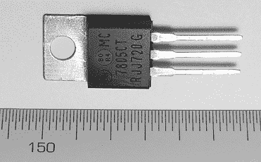

图 13-1：带有以毫米为单位的标尺的 7805 线性电压调节器


图 13-2：7805 电路符号

图 13-2 显示了 7805 的原理图符号。当你看到 7805 的标记面时，左侧的引脚（在字母 J 下方）是输入电压引脚，中央引脚连接到 GND，右侧的引脚（在字母 G 下方）是 5V 输出连接。顶部的金属片经过钻孔，可以连接到一个较大的金属件，称为*散热器*。当电路需要拉取最多 1A 的电流时，我们使用散热器，因为在这种使用情况下，7805 会变得非常温暖，就像一杯热咖啡。金属片也连接到 GND。我们的示例中需要一个 7805 稳压器。

#### 16 MHz 晶体振荡器

更常见的名字是*晶体*，晶体振荡器产生一个非常精确频率的电信号。在这种情况下，频率为 16 MHz。我们将使用的晶体如图 13-3 所示。

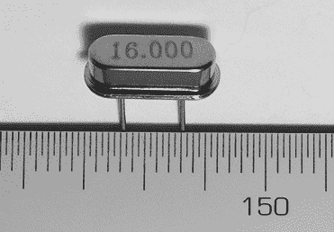

图 13-3：带有毫米标尺的晶体振荡器

将这张图与您 Arduino 板上的晶体进行比较。它们的形状和大小应该完全相同。

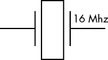

图 13-4：晶体振荡器原理图符号

晶体是非极化的。其原理图符号如图 13-4 所示。

晶体决定了微控制器的运行速度。例如，我们将要组装的微控制器电路运行在 16 MHz，这意味着它每秒可以执行 1600 万条处理器指令。然而，这并不意味着它能那么快执行程序的每一行或函数，因为解释一行代码需要许多处理器指令。

#### Atmel ATmega328P-PU 微控制器 IC

如第二章所述，微控制器是一个微小的计算机，是我们面包板 Arduino 的“大脑”。它包含一个处理器，用于执行指令，包含多种类型的内存以存储来自我们程序的指令和数据，并且有多种方法用于发送和接收数据。图中的 ATmega328P-PU 示例如图 13-5 所示。观察 IC 时，注意引脚编号 1 位于 IC 的左下角，并由一个小点标记。

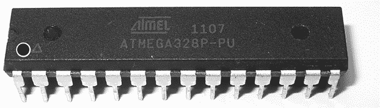

图 13-5：ATmega328P-PU

微控制器的原理图符号如图 13-6 所示。

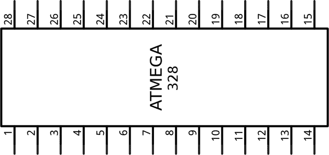

图 13-6：微控制器原理图符号

并不是所有的微控制器都包含 Arduino 的*引导程序*，这个软件使其能够等待 Arduino IDE 发送新的程序供其运行。当选择微控制器以集成到自制的 Arduino 时，务必选择已经包含引导程序的微控制器。这些通常可以在与销售 Arduino 板的零售商（如 Adafruit、PMD Way 和 SparkFun）购买到。

### 原理图

图 13-7 显示了电路原理图。

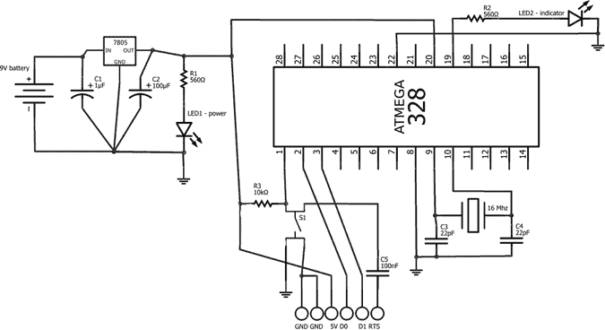

图 13-7：项目 36 的原理图

电路图包含两个部分。左侧是电源部分，能够将电压降至平稳的 5V。你会看到一个 LED，当电源开启时它会亮起。右侧部分由微控制器、重置按钮、编程引脚和另一个 LED 组成。这个 LED 连接到用作 Arduino 引脚 13 的 ATmega328P-PU 引脚。

使用电路图连接你的 Arduino。别忘了将电线接到六孔引脚头（如图 13-8 所示），它由电路图底部的六个圆圈表示。我们将在本章稍后使用此连接上传一个草图到我们的自制 Arduino。

电路将使用 9 V 电池和匹配的快接连接器供电，如图 13-9 所示。将电池快接连接器的红色线连接到电路左侧的正极（+）点，黑色线连接到负极（–）点。

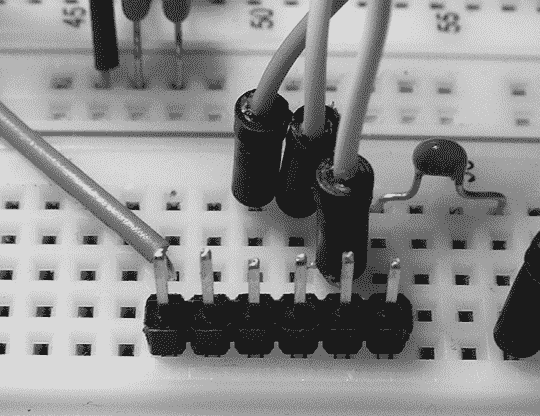

图 13-8：六孔引脚头

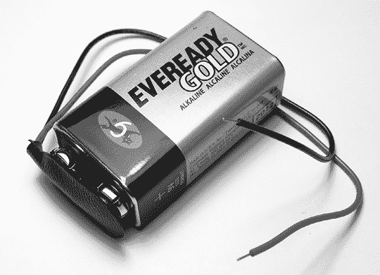

图 13-9：9 V 电池和快接连接器

#### 确认 Arduino 引脚

我们的自制 Arduino 上有哪些 Arduino 引脚？在普通的 Arduino 板上的所有模拟、数字及其他可用引脚，在我们的面包板版本中也都可以使用；你只需要直接连接到微控制器。

在我们的面包板 Arduino 中，R2 和 LED2 连接在数字引脚 13 上。表 13-1 列出了左侧的 Arduino 引脚和右侧匹配的 ATmega328P-PU 引脚。

表 13-1：ATmega328P-PU 的引脚

| **Arduino 引脚名称** | **ATmega328P-PU 引脚** |
| --- | --- |
| RST | 1 |
| RX/D0 | 2 |
| TX/D1 | 3 |
| D2 | 4 |
| D3 | 5 |
| D4 | 6 |
| (5 V only) | 7 |
| GND | 8 |
| D5 | 11 |
| D6 | 12 |
| D7 | 13 |
| D8 | 14 |
| D9 | 15 |
| D10 | 16 |
| D11 | 17 |
| D12 | 18 |
| D13 | 19 |
| (5 V only) | 20 |
| AREF | 21 |
| GND | 22 |
| A0 | 23 |
| A1 | 24 |
| A2 | 25 |
| A3 | 26 |
| A4 | 27 |
| A5 | 28 |

为了避免混淆，零售商如 Adafruit 和 Freetronics 出售可以粘贴在微控制器上的标签，类似于图 13-10 中显示的标签（可在[`www.freetronics.com.au/collections/arduino/products/microcontroller-labels-arduino-pinout/`](https://www.freetronics.com.au/collections/arduino/products/microcontroller-labels-arduino-pinout/)购买）。

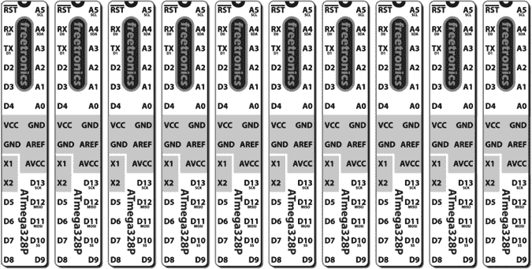

图 13-10：引脚标签

### 运行草图

现在是时候上传一个草图了。我们将首先上传一个简单的草图来闪烁 LED：

```
// Project 36 - Creating Your Own Breadboard Arduino
void setup() 
{                 pinMode(13, OUTPUT); 
}
void loop() 
{ digitalWrite(13, HIGH); delay(1000);            digitalWrite(13, LOW);  delay(1000); 
}
```

你可以通过三种方式上传草图。

#### 使用微控制器交换方法

上传草图的最便宜方法是从现有的 Arduino 上移除微控制器，将自制 Arduino 的微控制器插入，上传草图，然后再交换微控制器。

为了安全地从 Arduino 上移除微控制器，请使用 IC 取出器，如图 13-11 所示。

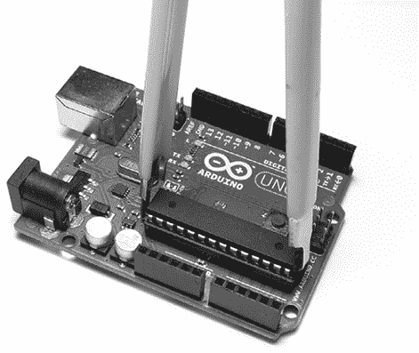

图 13-11：使用 IC 拔取器取出微控制器

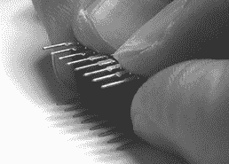

图 13-12：弯曲微控制器引脚

在取出微控制器时，一定要均匀且缓慢地*同时*拔出两端——并且要有耐心！取出这个组件可能会有点困难，但最终微控制器会被取出。

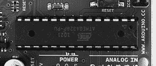

图 13-13：微控制器在 Arduino 中的正确放置方向

当将微控制器插入面包板或 Arduino 时，可能需要稍微弯曲引脚，使其与微控制器主体垂直，这样才能轻松滑入。为此，可以将组件的一侧放在平坦的表面上，然后轻轻向下按压；然后在另一侧重复这个动作，如图 13-12 所示。

最后，当你将原来的微控制器放回 Arduino 板时，记得带有缺口的一端应该朝右侧，如图 13-13 所示。

#### 连接到现有的 Arduino 板

你还可以使用 Arduino Uno 的 USB 接口向面包板 Arduino 上的微控制器上传程序。使用这种方法可以减少 Arduino 板插座的磨损，并节省你的开支，因为你不需要购买额外的 USB 编程线缆。

以下是如何通过 USB 接口向微控制器上传程序：

1.  从 Arduino Uno 中移除微控制器并拔下 USB 线。

1.  从面包板 Arduino 电路中移除电源（如果已连接）。

1.  将一根线从 Arduino 的数字引脚 0 连接到面包板上 ATmega328P-PU 的引脚 2；将另一根线从 Arduino 的数字引脚 1 连接到 ATmega328P-PU 的引脚 3。

1.  将 5V 和 GND 从 Uno 连接到面包板上的相应区域。

1.  将一根线从 Arduino 的 RST 引脚连接到 ATmega328P-PU 的引脚 1。

1.  将 USB 线缆插入 Arduino Uno 板。

此时，计算机应该表现得像一个普通的 Arduino Uno，因此你应该能够正常向面包板电路中的微控制器上传程序，并在必要时使用串口监视器。

#### 使用 FTDI 编程线缆

最后这种方法是最简单的，但它需要购买一个 USB 编程线缆，称为*FTDI 线缆*（仅仅是因为里面的 USB 接口电路是由一家名为 FTDI 的公司制造的）。购买 FTDI 线缆时，请确保选择 5V 型号，因为 3.3V 型号不能正常工作。这个线缆（见图 13-14）一端是 USB 插头，另一端是带有六根线的插座。该线缆的 USB 端包含的电路等同于 Arduino Uno 板上的 USB 接口。六根线的插座连接到图 13-7 和图 13-8 中所示的插针。

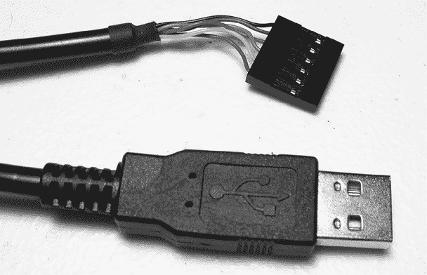

图 13-14：FTDI 线缆

连接电缆时，请确保黑线的一侧连接到面包板的 GND 引脚。一旦电缆连接好，它还会为电路供电，就像普通的 Arduino 板一样。

在上传草图或使用串行监视器之前，通过选择**工具**▶**板**并选择正确的微控制器（图 13-15）来更改板类型为 Arduino Duemilanove 或 Diecimila。

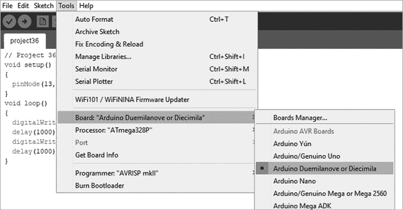

图 13-15：在 IDE 中更改板类型

一旦选择了上传方法，通过上传项目 36 的草图来进行测试。现在，你应该能够仅使用面包板设计更复杂的电路，这将使你以更少的资金创造更多的项目。如果你学会了制作自己的印刷电路板，你甚至可以从零开始构建更持久的项目。

## 多种 Arduino 及替代板

尽管在本书中我们一直专注于使用 Arduino Uno 板，但你可以选择许多替代板。这些板的物理大小、输入输出引脚数量、草图存储空间和价格各不相同。

板之间的一个关键区别是使用的微控制器。目前的板通常使用 ATmega328 或 ATmega2560 微控制器，而 Due 使用另一款更强大的版本，名为 SAM3X8E。它们之间的主要区别（包括两种 ATmega328 版本）总结在表格 13-2 中。

表格 13-2：微控制器比较表

|  | **ATmega328P-PU** | **ATmega328P SMD** | **ATmega2560** | **SAM3X8E** |
| --- | --- | --- | --- | --- |
|  |  | 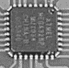 | 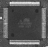 | 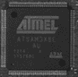 |
| 用户可更换？ | 是 | 否 | 否 | 否 |
| 处理速度 | 16 MHz | 16 MHz | 16 MHz | 84 MHz |
| 工作电压 | 5 V | 5 V | 5 V | 3.3 V |
| 数字引脚数量 | 14（6 个支持 PWM） | 14（6 个支持 PWM） | 54（14 个支持 PWM） | 54（12 个支持 PWM） |
| 模拟输入引脚数量 | 6 | 8 | 16 | 12 |
| 每个 I/O 引脚的直流电流 | 40 mA | 40 mA | 40 mA | 3–15 mA |
| 可用闪存 | 31.5KB | 31.5KB | 248KB | 512KB |
| EEPROM 大小 | 1KB | 1KB | 4KB | 无 EEPROM |
| SRAM 大小 | 2KB | 2KB | 8KB | 96KB |

用于比较各种 Arduino 兼容板的主要参数是它们包含的内存类型和每种类型的数量。以下是三种类型的内存：

+   *Flash memory*是用于存储编译并通过 IDE 上传的草图的空间。

+   *EEPROM（电可擦可编程只读存储器）*是一个小的存储空间，可以存储字节变量，正如你将在第十九章中学到的那样。

+   *SRAM*是用于存储程序变量的空间。

让我们来探讨一下可用的板的范围。

### Arduino Uno

Uno 目前被认为是标准的 Arduino 板。所有曾经制作的 Arduino 扩展板都应该与 Uno 兼容。由于它内置了 USB 接口和可拆卸的微控制器，Uno 被认为是最容易使用的 Arduino 板。

### Freetronics Eleven

市场上有许多电路板模拟 Arduino Uno 的功能，其中一些甚至在标准设计的基础上进行了改进。其中之一就是 Freetronics Eleven，见图 13-16。

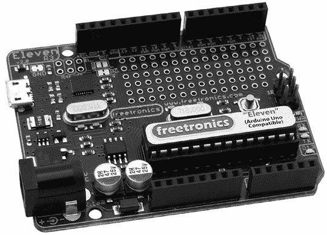

图 13-16：Freetronics Eleven

尽管 Eleven 与 Arduino Uno 完全兼容，但它提供了几项改进，使其成为值得购买的产品。首先是位于数字 I/O 引脚下方的大型原型区域。这个区域允许你直接在主板上构建自己的电路，这样可以节省空间和金钱，因为你不需要购买单独的原型扩展板。

其次，传输器/接收器（TX/RX）、电源和 D13 LED 位于板的最右侧；这种布局使得它们即使在安装了扩展板的情况下也能可见。最后，Eleven 使用微型 USB 接口，比 Uno 上使用的标准 USB 接口要小得多。这使得设计自己的扩展板变得更简单，因为你不需要担心连接会碰到 USB 接口。Eleven 可以从[`www.freetronics.com.au/products/eleven/`](http://www.freetronics.com.au/products/eleven/)购买。

### Adafruit Pro Trinket

Adafruit Pro Trinket（见图 13-17）是 Arduino Uno 的微型版本，专为无焊面包板、可穿戴电子设备或任何需要更小电路板的情况而设计。


图 13-17：Adafruit Pro Trinket

它与 Arduino Uno 存在一些微小的差异（例如，除非使用外部 FTDI 电缆，否则没有串口输出）；然而，考虑到价格，这款板具有很高的性价比。Pro Trinket 可以从[`www.adafruit.com/trinket/`](http://www.adafruit.com/trinket/)购买。

### Arduino Nano

当你需要一块紧凑型、组装好的兼容 Arduino 的板时，Nano 应该是一个不错的选择。Nano（见图 13-18）也设计为可以在无焊面包板上使用，是一款小巧而强大的 Arduino。

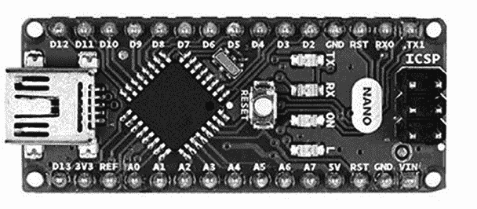

图 13-18：Arduino Nano

Nano 的尺寸仅为 0.7 英寸×1.77 英寸（17.8 mm×44.9 mm），但它具备经典 Arduino Duemilanove 的所有功能。此外，它使用了 ATmega328P 的 SMD 版本，因此它有两个额外的模拟输入引脚（A6 和 A7）。Nano 可以从[`store.arduino.cc/usa/arduino-nano/`](https://store.arduino.cc/usa/arduino-nano/)购买。

### LilyPad

LilyPad 设计用于集成到创意项目中，例如可穿戴电子设备。事实上，您实际上可以用水和温和的洗涤剂清洗 LilyPad，因此它非常适合用于点亮运动衫等。例如，板的设计独特，如 图 13-19 所示。

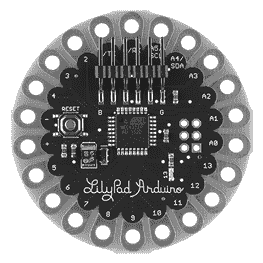

图 13-19：一款 Arduino LilyPad

LilyPad 上的 I/O 引脚需要将导线焊接到板子上，因此 LilyPad 更适用于永久性项目。作为其极简设计的一部分，它没有电压调节电路，因此用户需要提供 2.7 至 5.5 V 之间的电源。LilyPad 还缺少 USB 接口，因此需要使用 5 V 的 FTDI 电缆来上传草图。您可以从几乎任何 Arduino 零售商那里购买 Arduino LilyPad 或兼容板。

### Arduino Mega 2560

当您的 Arduino Uno 上的 I/O 引脚用完或需要更多空间来处理更大的草图时，可以考虑使用 Mega 2560，如 图 13-20 所示。它的物理尺寸比 Uno 大得多，尺寸为 4.3 英寸 x 2.1 英寸（109.2 毫米 x 53.4 毫米）。

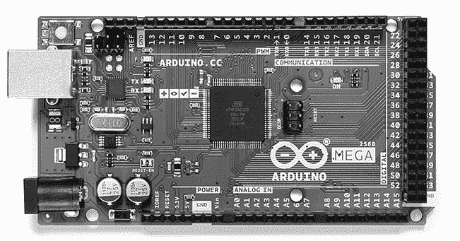

图 13-20：一款 Arduino Mega 2560

尽管 Mega 2560 板比 Uno 大得多，但您仍然可以使用大多数 Arduino 扩展板，且有 Mega 尺寸的原型扩展板可用于 Uno 无法容纳的大型项目。由于 Mega 使用 ATmega2560 微控制器，其内存空间和 I/O 能力（如 表 13-2 所描述）远大于 Uno。此外，四条独立的串行通信线路增强了其数据传输能力。您可以从几乎任何 Arduino 零售商那里购买 Mega 2560 板。

### Freetronics EtherMega

当您需要一个 Arduino Mega 2560、一个 microSD 卡扩展板和一个以太网扩展板来连接互联网时，最好的选择是 EtherMega（如 图 13-21 所示），因为它将所有这些功能集成在一个板子上，且比单独购买每个组件便宜。EtherMega 可以通过 [`www.freetronics.com/em/`](http://www.freetronics.com/em/) 购买。

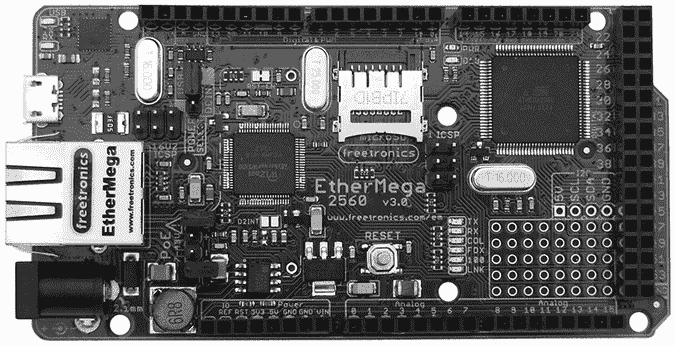

图 13-21：一款 Freetronics EtherMega

### Arduino Due

由于搭载 84 MHz 的处理器，可以让您的草图运行得更快，这是迄今为止发布的最强大的 Arduino 板。如 图 13-22 所示，该板与 Arduino Mega 2560 非常相似，但它有一个额外的 USB 端口供外部设备使用，并且引脚标签也不同。

此外，Due 的内存是 Uno 板的 16 倍多，因此您可以创建非常复杂和详细的草图。然而，Due 仅在 3.3 V 下工作——因此，连接到模拟或数字引脚的任何电路、扩展板或其他设备的电压不能大于 3.3 V。虽然您需要注意这些限制，但一般来说，使用 Due 的好处超过了硬件的变化。

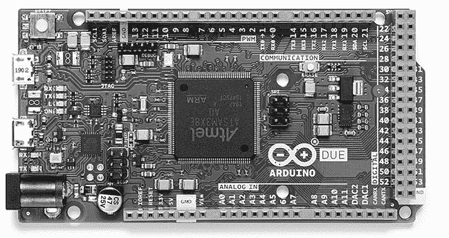

图 13-22：一块 Arduino Due

## 展望未来

本章为你展示了可用硬件的更广泛概况，并介绍了你自己搭建的面包板 Arduino 的概念。你已经了解了构成 Arduino 设计的各个部分，并学会了如何使用无焊接面包板搭建自己的 Arduino。现在，你知道如何制作多个基于 Arduino 的原型，而无需购买更多的电路板。你还了解了市场上各种 Arduino 电路板的情况，应该能够选择最适合你需求的电路板。最后，你对开源运动和 Arduino 在其中的参与有了更深的了解。

在下一章，你将学习如何使用各种电机，并开始制作你自己的 Arduino 控制的电动机器人！
