# 第十四章：电机与运动

在本章中你将

+   使用伺服电机创建一个模拟温度计

+   学习如何控制直流电动机的速度和方向

+   学习如何控制小型步进电机

+   使用 Arduino 电机扩展板

+   开始制作一辆电动机器人

+   使用简单的微动开关进行碰撞避免

+   使用红外和超声波距离传感器进行碰撞避免

## 使用伺服电机进行小范围运动

一个*伺服电机*（*伺服机构*的简称）是一个带有内建传感器的电动机。它可以被命令旋转到特定的角度位置。通过将伺服电机的轴连接到其他机器（如车轮、齿轮和杠杆），你可以精确地控制外部世界中的物体。例如，你可以使用伺服电机来控制遥控车的转向，通过将伺服电机连接到一个*角度盘*（一个小臂或杆，伺服电机旋转它）。一个角度盘的例子是模拟钟表上的时针。图 14-1 展示了伺服电机和三种类型的角度盘。

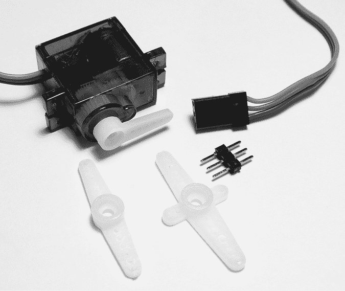

图 14-1：伺服电机和各种角度盘

### 选择伺服电机

在选择伺服电机时，考虑几个参数：

1.  速度：伺服电机旋转所需的时间，通常以每角度度数的秒数、每分钟转速（RPM）或每 60 度的秒数来衡量。

1.  旋转范围：伺服电机可以旋转的角度范围——例如，180 度（半圈旋转）或 360 度（完整旋转）。

1.  电流：伺服电机所消耗的电流。在使用伺服电机与 Arduino 时，你可能需要为伺服电机使用外部电源。

1.  扭矩：伺服电机旋转时能施加的力。扭矩越大，伺服电机能够控制的物体就越重。产生的扭矩通常与所用电流成正比。

图 14-1 中展示的伺服电机是一个常见的 SG90 型号。它价格便宜，最多可以旋转 180 度，如图 14-2 所示。

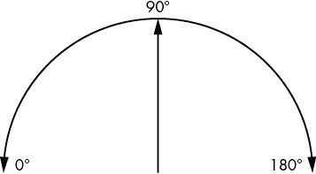

图 14-2：伺服电机旋转范围示例

### 连接伺服电机

将伺服电机连接到 Arduino 非常简单，因为它只需要三根线。如果你使用的是 SG90 型号，最深色的线连接到 GND，中间的线连接到 5V，最浅色的线（*脉冲*或*数据*线）连接到数字引脚。如果你使用的是其他型号的伺服电机，请查阅其数据表，了解正确的接线方式。

### 使用伺服电机

现在让我们开始使用伺服电机。在这个草图中，伺服电机会在其旋转范围内旋转。按照上述方法将伺服电机连接到 Arduino，脉冲线连接到数字引脚 4，然后输入并上传 Listing 14-1 中的草图。

```
// Listing 14-1
#include <Servo.h>
Servo myservo; 
void setup()
{ myservo.attach(4); 
}
void loop()
{ myservo.write(180); delay(1000); myservo.write(90); delay(1000); myservo.write(0); delay(1000);
}
```

Listing 14-1：伺服电机演示草图

在这个草图中，我们使用了 Servo 库，需要进行安装。请按照第七章中的说明操作。在库管理器中，找到并安装“Servo by Michael Margolis, Arduino”库。使用以下代码创建伺服电机实例：

```
#include <Servo.h>
Servo myservo;
```

然后，在`void setup()`中，我们告诉 Arduino 哪个数字引脚用于控制伺服电机：

```
myservo.attach(4); // control pin on digital 4
```

现在我们只需用以下代码来控制伺服电机：

```
myservo.write(*x*);
```

在这里，`x`是一个介于 0 和 180 之间的整数，表示伺服电机将要移动的角度位置。当运行清单 14-1 中的草图时，伺服电机会跨越其最大范围旋转，停在极端位置（0 度和 180 度）以及中间位置（90 度）。查看你的伺服电机时，注意 180 度的位置在左侧，0 度的位置在右侧。

除了推拉物体之外，伺服电机还可以像模拟仪表一样用来传输数据。例如，你可以使用伺服电机作为模拟温度计，就像在项目 37 中展示的那样。

## 项目#37：构建模拟温度计

使用我们之前章节中的伺服电机和 TMP36 温度传感器，我们将制作一个模拟温度计。我们将测量温度，然后将该测量值转换为 0 到 180 度之间的角度，以指示 0 到 30 摄氏度之间的温度。伺服电机会旋转到与当前温度相匹配的角度。

### 硬件

所需的硬件非常简单：

+   一个 TMP36 温度传感器

+   一个面包板

+   一个小型伺服电机

+   各种连接线

+   Arduino 和 USB 电缆

### 电路图

电路也非常简单，如图 14-3 所示。

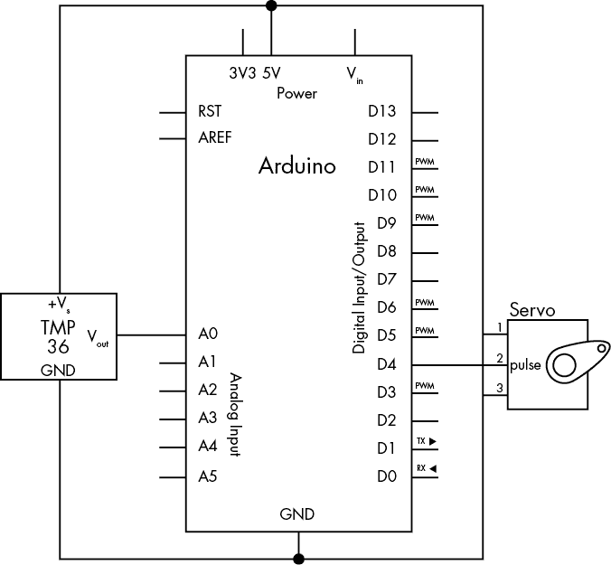

图 14-3：项目 37 的电路图

### 草图

该草图将使用与第四章第 8 项目中相同的方法来确定温度。然后，它将把温度转换为伺服电机的角度旋转值。

输入并上传以下草图：

```
// Project 37 - Building an Analog Thermometer
float voltage = 0;
float sensor = 0;
float currentC = 0;
int      angle = 0;
#include <Servo.h> 
Servo myservo;
void setup() 
{ myservo.attach(4);
}1 int calculateservo(float temperature) 
{ float resulta; int resultb; resulta = -6 * temperature; resulta = resulta + 180; resultb = int(resulta);                return resultb;
}
void loop() 
{ // read current temperature sensor = analogRead(0);        voltage = (sensor*5000)/1024;  voltage = voltage-500;         currentC = voltage/10;         // display current temperature on servo 1  angle = calculateservo(currentC);  // convert temperature to a servo position if (angle>=0 && angle <=30) { myservo.write(angle); // set servo to temperature delay(1000);  }
}
```

到此为止，这个草图的大部分内容应该都很清楚，但 1 处的`calculateservo()`函数是新的。此函数根据以下公式将温度转换为伺服电机使用的匹配角度：

angle = (–6 × temperature) + 180

你可能会发现制作一个*背板*来显示伺服电机所显示的温度范围很有用，可以加一个小箭头来增强真实感。示例见图 14-4。你可以从本书的网站下载可打印版本的背板：[`nostarch.com/arduino-workshop-2nd-edition/`](https://nostarch.com/arduino-workshop-2nd-edition/)。

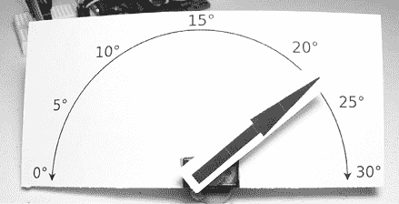

图 14-4：背板显示我们的温度计上的温度。

## 使用电动马达

我们控制电机的下一步是使用小型电动马达。小型电动马达广泛应用于各种领域，从小风扇到玩具车，再到模型铁路。

### 选择一个马达

与伺服电机类似，选择电动机时需要考虑多个参数：

1.  工作电压：电动机设计的工作电压。这可以变化，从 3 V 到超过 12 V。

1.  无负载电流：电动机在自由旋转时使用的电流，即在电动机轴上没有任何连接物的情况下的工作电流。

1.  卡死电流：电动机在试图旋转时，因为负载的存在而无法转动时所消耗的电流。

1.  工作电压下的转速：电动机在 RPM 中的转速。

我们的示例将使用一款小型且价格便宜的电动机，其在 3 V 下运行时的转速为 8,540 转/分钟，类似于图 14-5 中所示的电动机。

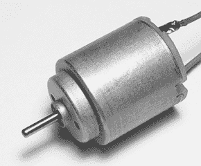

图 14-5：我们的微型电动机

为了控制电动机，我们将使用一个晶体管，详情见第三章。由于我们的电动机使用最多 0.7 A 的电流（超过 BC548 晶体管的承载能力），因此我们将在本项目中使用一个名为达林顿的晶体管。

### TIP120 达林顿晶体管

*达林顿晶体管*不过是两个晶体管连接在一起。它能处理高电流和高电压。TIP120 达林顿晶体管能够通过最多 5 A 的电流，且工作电压为 60 V，足以控制我们的微型电动机。TIP120 使用与 BC548 相似的电路符号，如图 14-6 所示，但 TIP120 晶体管的体积比 BC548 大。

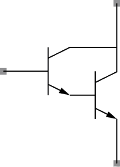

图 14-6：TIP120 电路符号

TIP120 使用 TO-220 外壳样式，如图 14-7 所示。

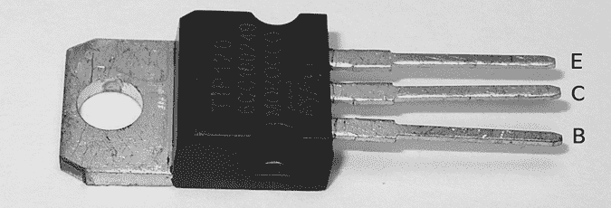

图 14-7：TIP120

当你从标记的一侧查看 TIP120 时，针脚从左到右分别是基极（B）、集电极（C）和发射极（E）。金属散热片也连接到集电极。

## 项目 #38：控制电动机

在这个项目中，我们将通过调整电动机的速度来控制它。

### 硬件

需要以下硬件：

+   一个小型 3 V 电动机

+   一个 1 kΩ 电阻（R1）

+   一块面包板

+   一个 1N4004 二极管

+   一个 TIP120 达林顿晶体管

+   一个单独的 3 V 电源

+   各种连接线

+   Arduino 和 USB 电缆

必须为电动机使用单独的电源，因为 Arduino 在所有情况下都无法提供足够的电流。如果电动机卡住，它将拉取其*卡死电流*，这可能超过 1 A。这超过了 Arduino 所能提供的电流，如果 Arduino 尝试提供这么多电流，它可能会被永久损坏。

一个单独的电池座是一个简单的解决方案。对于 3 V 电源，一个带飞线的两节 AA 电池座就足够了，如图 14-8 所示。

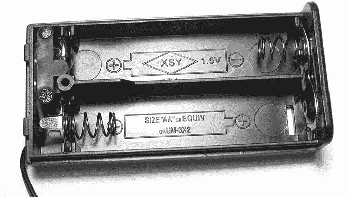

图 14-8：一个两节 AA 电池座

### 电路图

按照图 14-9 中的电路图组装电路。

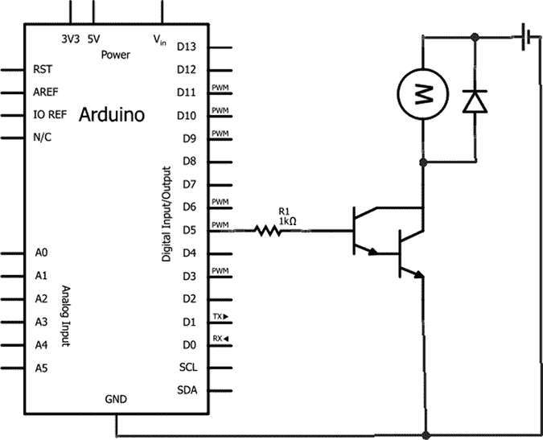

图 14-9：项目 38 的原理图

### 草图

在这个项目中，我们将调整电机的速度，从停止（零速）到最大速度，然后再减速回零。输入并上传以下草图：

```
// Project 38 - Controlling the Motor
void setup() 
{ pinMode(5, OUTPUT);
}
void loop() 
{1   for (int a=0; a<256; a++)  { analogWrite(5, a);2     delay(100);  }3   delay(5000);4   for (int a=255; a>=0; a--) { analogWrite(5,a); delay(100); } delay(5000);
}
```

我们通过脉宽调制来控制电机的速度（如第三章项目 3 中所示）。回想一下，我们只能在数字引脚 3、5、6、9、10 和 11 上执行此操作。使用这种方法，电流会以短时脉冲的方式施加到电机上：脉冲持续时间越长，电机的速度越快，因为电机在设定的时间内“开启”的时间比“关闭”的时间多。因此，在 1 时，电机的速度从零开始，逐渐加速；你可以通过改变 2 处的`delay`值来控制加速。3 时，电机以最快的速度运行并保持该速度 5 秒钟。然后，从 4 开始，过程反转，电机逐渐减速直至停止。

二极管的使用方式与图 3-19（第 42 页）中描述的继电器控制电路相同，用于保护电路。当电机的电流被切断时，电机线圈内会存在短暂的剩余电流，这些电流必须消耗掉。二极管允许这些剩余电流在电机线圈内循环，直到以微小的热量形式消散掉。

## 使用小型步进电机

步进电机与普通直流电机的不同之处在于，它们将电机的完整旋转分为固定数量的步伐。它们通过使用两个独立控制的线圈绕组来实现这一点。因此，不同于通过改变电压来控制旋转的普通直流电机，步进电机通过按照一定模式打开或关闭线圈，旋转轴在任意方向上旋转设定次数。这种控制方式使得步进电机非常适合需要精确电机定位的任务。它们在从计算机打印机到先进制造设备等各种设备中都有广泛应用。

我们将使用 28BYJ-48 型号的步进电机演示其操作，如图 14-10 所示。这种步进电机可以控制电机转到 4,096 个位置之一；也就是说，一整圈的旋转被分为 4,096 步。

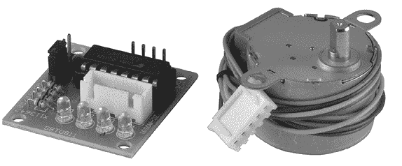

图 14-10：步进电机及控制板

电机旁边的板子作为 Arduino 与步进电机之间的接口，方便快捷地进行连接。通常它会和步进电机一起提供。它的特写图见图 14-11。

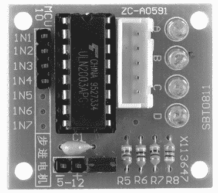

图 14-11：步进电机控制板

现在将步进电机连接到 Arduino。按照表 14-1 中的示意图进行连接。

表 14-1：步进电机控制板与 Arduino 之间的连接

| **控制板引脚标签** | **Arduino 引脚** |
| --- | --- |
| IN1 | D8 |
| IN2 | D9 |
| IN3 | D10 |
| IN4 | D11 |
| 5–12 V+ | 5 V |
| 5–12 V− | GND |

如果没有其他设备从 Arduino 获取电源，你可以简单地使用 Arduino 提供的电源来运行步进电机。然而，这并不推荐。建议使用外部 5V 电源，如插头包或其他便捷的电源。由于控制板没有直流插座，你可以使用带端子块的外部插座来实现简便、免焊接的连接，如图 14-12 所示。

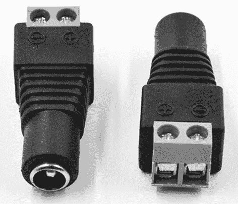

图 14-12：直流插座端子块

然后，你可以将跳线从端子块的+和–连接器连接到步进电机控制板的对应端子。为了简化在 Arduino 草图中控制步进电机，你可以使用一个叫做 CheapStepper 的简洁 Arduino 库。你可以从[`github.com/tyhenry/CheapStepper/archive/master.zip`](https://github.com/tyhenry/CheapStepper/archive/master.zip)下载它，并按照第七章中描述的方法安装。

一旦你成功安装了库并按照之前的描述连接了步进电机，就可以输入并上传列表 14-2。

```
// Listing 14-21 #include <CheapStepper.h>2 CheapStepper stepper (8, 9, 10, 11);3 boolean clockwise = true;
boolean cclockwise = false;4 void setup()
{ stepper.setRpm(20); Serial.begin(9600);
}
void loop()
{ Serial.println("stepper.moveTo (Clockwise, 0)");5   stepper.moveTo (clockwise, 0); delay(1000); Serial.println("stepper.moveTo (Clockwise, 1024)");5   stepper.moveTo (clockwise, 1024); delay(1000); Serial.println("stepper.moveTo (Clockwise, 2048)"); stepper.moveTo (clockwise, 2048); delay(1000); Serial.println("stepper.moveTo (Clockwise, 3072)"); stepper.moveTo (clockwise, 3072); delay(1000); Serial.println("stepper.moveTo (CClockwise, 512)");5   stepper.moveTo (cclockwise, 512); delay(1000); Serial.println("stepper.moveTo (CClockwise, 1536)");5   stepper.moveTo (cclockwise, 1536); delay(1000); Serial.println("stepper.moveTo (CClockwise, 2560)"); stepper.moveTo (cclockwise, 2560); delay(1000); Serial.println("stepper.moveTo (CClockwise, 3584)"); stepper.moveTo (cclockwise, 3584); delay(1000);
}
```

列表 14-2：测试步进电机

步进电机的操作非常简单。我们首先在第 1 行包含库，并在第 2 行创建电机的实例。（如果你希望更改控制板使用的数字引脚，请在此处更新。）控制函数使用`true`和`false`分别表示顺时针和逆时针旋转，因此我们在第 3 行将它们分配给布尔变量，以便更加清晰。最后，电机可以通过以下函数旋转到 4,096 个位置中的一个：

```
Stepper.moveTo(*direction*, *location*);
```

其中，方向要么是`顺时针`，要么是`逆时针`，位置是介于 0 和 4,095 之间的一个值。这个过程从 5 开始，并重复直到草图结束。

此外，在`void setup()`的第 4 行中，我们通过以下代码将电机的转速设置为 20 RPM：

```
stepper.setRpm(20);
```

这是我们步进电机的推荐速度。其他电机的速度可能不同，因此你应该向供应商咨询这些细节。

在你上传草图后不久，步进电机将开始旋转到不同的位置，你可以在串口监视器中看到回显的命令，如图 14-13 所示。

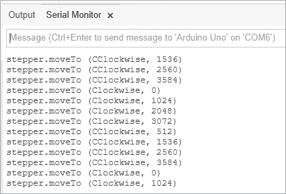

图 14-13：发送到步进电机的命令

## 项目#39：构建和控制机器人车辆

尽管控制一个直流电机的速度非常有用，但让我们进入更有趣的领域，同时控制四个直流电机并影响它们的速度*和*方向。我们的目标是构建一个四轮车辆风格的机器人，接下来的章节中我们将继续开发它。在这里，我将描述我们的机器人构建和基本控制。

我们的机器人有四个电机，每个电机控制一个车轮，使其能够以不同的速度行驶并在原地旋转。你将能够控制行驶的速度和方向，还将学会如何添加零件来实现避障和远程控制。完成本书中的项目后，你将为创造自己的机器人版本并将创意付诸实践打下坚实的基础。

### 硬件

你将需要以下硬件：

+   配备四个直流电机和车轮的机器人车辆底盘

+   四节 AA 电池座（带有接线输出）

+   四节碱性 AA 电池

+   L293D 电机驱动扩展板（适用于 Arduino）

+   Arduino 和 USB 电缆

#### 底盘

任何机器人的基础都是一个坚固的底盘，包含电机、传动系统和电源。一个由 Arduino 驱动的机器人还需要有足够的空间来安装 Arduino 和各种外部部件。

你可以从市面上众多的底盘模型中进行选择。为了简化操作，我们使用了一个价格便宜的机器人底盘，包含四个小型直流电机，工作电压大约为 6V DC，并配有相应的车轮，如 图 14-14 所示。

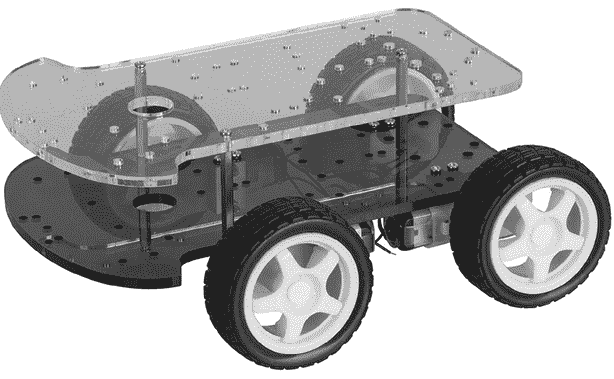

图 14-14：我们的机器人底盘

机器人底盘的物理组装任务因模型不同而有所不同，你可能需要一些基本工具，如螺丝刀和钳子。如果你对最终设计不确定，但仍然希望让机器人开始移动，常用的一种技巧是使用粘性产品（如 Blu Tack）将电子元件固定到底盘上。

#### 电源

机器人底盘包含的电机通常工作在大约 6V DC，因此我们将使用一个四节 AA 电池座为机器人供电，如 图 14-15 所示。


图 14-15：四节 AA 电池的电池座

一些 AA 电池座可能没有连接到我们项目所需的线路，而是配有 9V 电池卡扣的连接（如我们在 图 14-15 中的单元所示）。在这种情况下，你需要像 图 14-16 中的电池卡扣一样的设备。

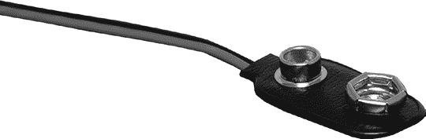

图 14-16：用于将电池座连接到 Arduino 的电池线缆

### 电路图

最后的要求是创建电路来控制底盘中的四个电机。虽然我们可以为每个电机使用 图 14-9 中显示的电路，但这不能让我们控制电机的方向，且连接起来可能会稍显不便。相反，我们将使用一个*电机扩展板*。电机扩展板包含了处理电机所需的高电流的电路，并接受 Arduino 发出的命令来控制电机的速度和方向。对于我们的机器人，我们将使用 L293D 电机驱动扩展板，如 图 14-17 所示。

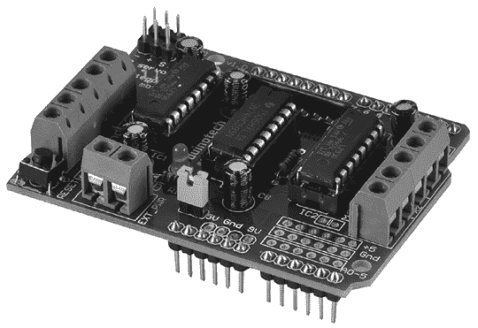

图 14-17：Arduino 的 L293D 电机驱动扩展板

### 连接电机扩展板

连接电机扩展板所需的接线非常简单：将电池盒的电线连接到扩展板左下角的接线端子，如图 14-18 所示。黑色电线（负极）必须连接到右侧，红色电线连接到左侧。

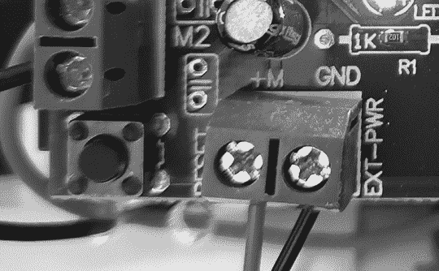

图 14-18：直流电源连接

接下来需要将每个直流电机连接到电机扩展板。我们将底盘前部的两个直流电机分别称为电机 2（左）和电机 1（右），底盘后部的两个直流电机分别称为电机 3（左）和电机 4（右）。每个电机都有一根红色和一根黑色电线，将它们连接到电机扩展板左侧和右侧相应的接线端子，如图 14-19 所示。

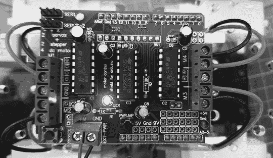

图 14-19：连接电机

连接直流电机的电线时，请注意黑色电线连接到接线端子的外侧，红色电线连接到内侧。此外，每个接线端子上都有相应的电机编号（M1、M2、M3 和 M4）以便参考。

如果你的电机电线没有颜色编码，可能需要在第一次运行后交换电线，以确定哪个方向是前进或后退。

在将电源和电机电线连接到扩展板并将扩展板连接到 Arduino 后，机器人应该类似于图 14-20 所示的样子。

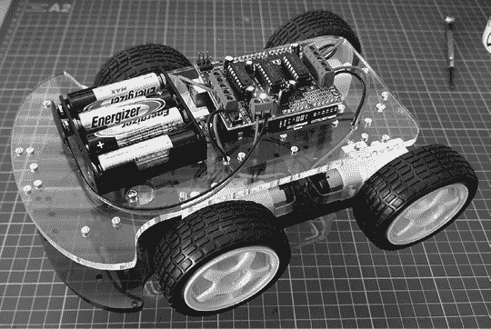

图 14-20：我们的机器人准备好行动了！

### 草图

现在开始让机器人动起来。为了简化操作，我们首先需要下载并安装用于电机驱动扩展板的 Arduino 库。按照第七章中的说明操作。在库管理器中，找到并安装“Adafruit Motor Shield library by Adafruit”。

稍等片刻，Adafruit Motor Shield 库 v1 会出现。点击**安装**并等待库安装完成。然后你可以关闭库管理器窗口。

现在我们将创建一些函数来操作我们的机器人。由于涉及到两个电机，我们需要四个动作：

+   前进运动

+   反向运动

+   顺时针旋转

+   逆时针旋转

因此，我们需要在草图中创建四个函数来匹配我们的四个动作：`goForward()`、`goBackward()`、`rotateLeft()`和`rotateRight()`。每个函数接受一个毫秒值，表示操作所需的时间，以及一个介于 0 到 255 之间的 PWM 值。例如，要以全速前进 2 秒，我们可以使用`goForward(255,2000)`。

输入并保存以下草图（但暂时不要上传）：

```
// Project 39 - Building and Controlling a Robot Vehicle
#include <AFMotor.h>1 AF_DCMotor motor1(1); // set up instances of each motor
AF_DCMotor motor2(2);
AF_DCMotor motor3(3);
AF_DCMotor motor4(4);2 void goForward(int speed, int duration)
{ motor1.setSpeed(speed); motor2.setSpeed(speed); motor3.setSpeed(speed); motor4.setSpeed(speed); motor1.run(FORWARD); motor2.run(FORWARD); motor3.run(FORWARD); motor4.run(FORWARD); delay(duration); motor1.run(RELEASE); motor2.run(RELEASE); motor3.run(RELEASE); motor4.run(RELEASE);
}2 void goBackward(int speed, int duration){ motor1.setSpeed(speed); motor2.setSpeed(speed); motor3.setSpeed(speed); motor4.setSpeed(speed); motor1.run(BACKWARD); motor2.run(BACKWARD); motor3.run(BACKWARD); motor4.run(BACKWARD); delay(duration); motor1.run(RELEASE); motor2.run(RELEASE); motor3.run(RELEASE); motor4.run(RELEASE);
}2 void rotateLeft(int speed, int duration)
{ motor1.setSpeed(speed); motor2.setSpeed(speed); motor3.setSpeed(speed); motor4.setSpeed(speed); motor1.run(FORWARD); motor2.run(BACKWARD); motor3.run(BACKWARD); motor4.run(FORWARD); delay(duration); motor1.run(RELEASE); motor2.run(RELEASE); motor3.run(RELEASE); motor4.run(RELEASE);
}2 void rotateRight(int speed, int duration)
{ motor1.setSpeed(speed); motor2.setSpeed(speed); motor3.setSpeed(speed); motor4.setSpeed(speed); motor1.run(BACKWARD); motor2.run(FORWARD); motor3.run(FORWARD); motor4.run(BACKWARD); delay(duration); motor1.run(RELEASE); motor2.run(RELEASE); motor3.run(RELEASE); motor4.run(RELEASE);
}
void setup(){ delay(5000);
}
void loop()
{ goForward(127,5000); delay(1000); rotateLeft(127,2000); delay(1000); goBackward(127,5000); delay(1000); rotateRight(127,5000); delay(5000);
}
```

由于草图中包含了四个自定义函数，因此控制机器人非常简单。每个自定义函数利用了用于控制电机的库函数。在使用这些函数之前，需要为每个电机创建一个实例，如 1 所示。

每个电机的运动方向可以通过以下方式设置：

```
Motor.run(*direction*)
```

`direction`的值可以是`FORWARD`（前进）、`REVERSE`（后退）或`RELEASE`（释放），分别表示设置电机的旋转方向为前进或后退，或切断电机的电源。

要设置电机的速度，我们使用：

```
Motor.setSpeed(*speed*)
```

`speed`的值在`0`和`255`之间；它是用于控制电机转速的 PWM 范围。

因此，在我们四个自定义函数中的每一个（见第 2 点）中，我们使用电机速度和方向控制的组合来同时控制四个电机。每个自定义函数接受两个参数：`speed`（我们的 PWM 值）和`duration`（电机运行的时间）。

上传草图，移除 USB 电缆，然后将电池电缆连接到 Arduino 的电源插座。接着将机器人放在地毯或清洁的表面上，让它开始移动。通过实验草图中的运动功能来控制你的机器人，这将帮助你熟悉时间延迟以及它们与行驶距离的关系。

## 连接额外硬件到机器人

一些 Arduino 的电机驱动扩展板可能没有堆叠头插座，无法让你在上面再放一个扩展板，而且它们可能不方便连接传感器等设备的电线。在这种情况下，你应该使用适用于 Arduino 的*端子扩展板*，其示例如图 14-21 所示。


图 14-21：Arduino 的端子扩展板

端子扩展板可以方便地将硬件或传感器接入 Arduino 的输入和输出引脚，而无需焊接，并且它们还可以用于构建你自己的电路，方便以后做更多持久性的应用。

## 碰撞检测

现在我们的机器人能够移动了，我们可以开始添加传感器。这些传感器将告诉机器人何时碰到障碍物，或者它们将测量机器人与路径中物体之间的距离，以便它能够避免碰撞。我们将使用三种碰撞避免方法：微动开关、红外线和超声波。

## 项目 #40：使用微动开关检测机器人碰撞

*微动开关*可以像我们在第四章中使用的简单按钮一样工作，但微动开关的组件在物理上更大，并且包括一个作为执行器的大金属杆（见图 14-22）。

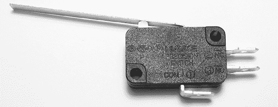

图 14-22：微动开关

使用微动开关时，你将一根电线连接到底部接触点，另一根电线连接到标有 NO（常开）的接触点，以确保电流只有在金属杆被按下时才会流动。我们将在机器人的前面安装微动开关，这样当机器人撞到物体时，金属杆就会被按下，导致电流流动，并使机器人改变方向或采取其他行动。

### 原理图

微动开关硬件的接线方式类似于一个简单的按钮，如图 14-23 所示。

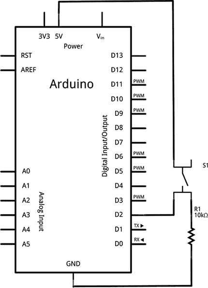

图 14-23：项目 40 的原理图

### 草图

我们将微动开关连接到一个中断端口（数字引脚 2）。虽然你可能认为我们应该有一个由中断调用的函数来让机器人倒退几秒钟，但这是不可能的，因为`delay()`函数无法在中断调用的函数内部运行。在这种情况下，我们必须换个思路。

相反，函数`goForward()`将在满足变量`crash`和布尔值`move`的两个条件时启动电机。如果`crash`为`true`，电机将在较慢的速度下反向 2 秒，以避开碰撞。

我们不能使用`delay()`，因为有中断的存在，所以我们通过读取开始时的`millis()`值并与当前的`millis()`值进行比较来测量电机运行的时间。当差值大于或等于所需的持续时间时，`move`被设置为`false`，电机停止。

输入并上传以下草图：

```
// Project 40 – Detecting Robot Vehicle Collisions with a Microswitch
#include <AFMotor.h>
AF_DCMotor motor1(1); // set up instances of each motor
AF_DCMotor motor2(2);
AF_DCMotor motor3(3);
AF_DCMotor motor4(4);
boolean crash = false;
void goBackward(int speed, int duration)
{ motor1.setSpeed(speed); motor2.setSpeed(speed); motor3.setSpeed(speed); motor4.setSpeed(speed); motor1.run(BACKWARD); motor2.run(BACKWARD); motor3.run(BACKWARD); motor4.run(BACKWARD); delay(duration); motor1.run(RELEASE); motor2.run(RELEASE); motor3.run(RELEASE); motor4.run(RELEASE);
}1 void backOut()
{ crash = true;
}
void goForward(int duration, int speed){ long a, b; boolean move = true;2   a = millis(); do { if (crash == false) { motor1.setSpeed(speed); motor2.setSpeed(speed); motor3.setSpeed(speed); motor4.setSpeed(speed); motor1.run(FORWARD); motor2.run(FORWARD); motor3.run(FORWARD); motor4.run(FORWARD); } if (crash == true) {3       goBackward(200, 2000); crash = false; }4     b = millis() - a; if (b >= duration) { move = false; } } while (move != false); // stop motors motor1.run(RELEASE); motor2.run(RELEASE); motor3.run(RELEASE); motor4.run(RELEASE);
}
void setup()
{ attachInterrupt(0, backOut, RISING); delay(5000);
}
void loop()
{ goForward(5000, 127); delay(2000);
} 
```

这个草图使用了一种高级的前进方法，即在机器人运动过程中使用两个变量来监控运动。第一个是布尔变量`crash`。如果机器人碰到某物并触发了微动开关，则会调用一个中断，运行第 1 步的函数`backOut()`。在这里，变量`crash`的值将从`false`更改为`true`。第二个被监控的变量是布尔变量`move`。在`goForward()`函数中，我们在第 2 步使用`millis()`不断计算机器人是否已完成所需时间（由参数`duration`设置）的移动。

在第 4 步，函数计算经过的时间是否小于所需时间，如果是，则变量`move`被设置为`true`。因此，机器人只有在没有发生碰撞且没有耗尽时间的情况下才能向前移动。如果检测到碰撞，第 3 步的函数`goBackward()`将被调用，此时机器人将慢慢后退 2 秒，然后恢复正常。

## 红外距离传感器

我们的下一种避碰方法使用红外（IR）距离传感器。该传感器通过将红外光信号从其前方表面反射回来，并返回一个与传感器与表面之间的距离相关的电压值。红外传感器在避碰检测中非常有用，因为它们价格低廉，但并不适合*精确*的距离测量。我们将在项目中使用 Sharp GP2Y0A21YK0F 模拟传感器，如图 14-24 所示。

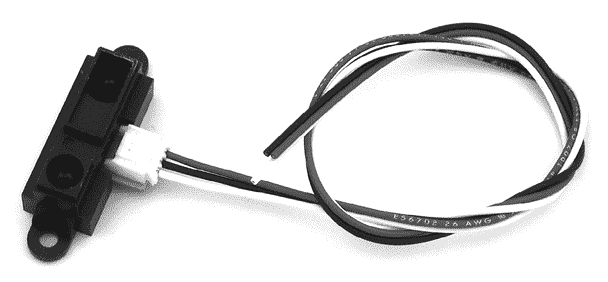

图 14-24：Sharp IR 传感器

### 连接线路

要连接传感器，将传感器上的红色和黑色线分别连接到 5V 和 GND，白色线连接到你的 Arduino 的模拟输入引脚。我们将使用`analogRead()`来测量传感器返回的电压。图 14-25 中的图表显示了测量的距离与输出电压之间的关系。

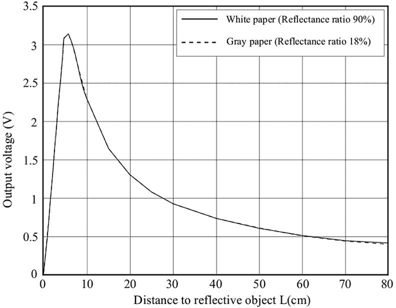

图 14-25：红外传感器距离与输出电压的图表

### 测试红外距离传感器

由于距离和输出之间的关系无法通过公式简单表示，我们将把读数分成 5 cm 的阶段。为了演示这一点，我们将使用一个简单的示例。将红外传感器的白色引线连接到模拟引脚 0，红色引线连接到 5 V，黑色引线连接到 GND。然后输入并上传 Listing 14-3 中显示的草图。

```
// Listing 14-3
float sensor = 0;
int cm = 0;
void setup()
{ Serial.begin(9600);
}
void loop()
{1   sensor = analogRead(0); 2   if (sensor<=90) { Serial.println("Infinite distance!"); } else if (sensor<100) // 80 cm { cm = 80; } else if (sensor<110) // 70 cm { cm = 70; } else if (sensor<118) // 60 cm { cm = 60; } else if (sensor<147) // 50 cm { cm = 50; } else if (sensor<188) // 40 cm { cm = 40; } else if (sensor<230) // 30 cm { cm = 30; } else if (sensor<302) // 25 cm { cm = 25; } else if (sensor<360) // 20 cm { cm = 20; } else if (sensor<505) // 15 cm { cm = 15; } else if (sensor<510) // 10 cm { cm = 10; } else if (sensor>=510) // too close! { Serial.println("Too close!"); }  Serial.print("Distance: "); Serial.print(cm); Serial.println(" cm"); delay(250); 
}
```

Listing 14-3：红外传感器演示草图

该草图首先读取红外传感器的电压，然后通过一系列的 `if` 语句来选择返回的近似距离。我们通过传感器返回的电压使用两个参数来确定距离。第一个是电压与距离的关系，如 图 14-25 所示。然后，利用知识（来自第四章的项目 6），`analogRead()` 返回一个介于 0 和 1,023 之间的值，与 0 V 到大约 5 V 之间的电压成比例，我们可以计算出传感器返回的近似距离。

上传草图后，打开串口监视器，尝试通过将手或纸张在不同的距离处移动来进行实验。串口监视器应返回近似的距离，如 图 14-26 所示。

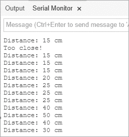

图 14-26：Listing 14-3 的结果

## 项目 #41：使用红外距离传感器检测机器人车辆碰撞

现在让我们用红外传感器替代微型开关，配合我们的机器人车。我们将使用一个略微修改过的第 40 项目版本。我们不使用中断，而是创建一个 `checkDistance()` 函数，当红外传感器测量的距离大约为 20 cm 或更小时，将变量 `crash` 改为 `true`。我们将在 `goForward()` 前进动作的 `do-while` 循环中使用它。

### 草图

将红外传感器连接到你的机器人，然后输入并上传以下草图：

```
// Project 41 - Detecting Robot Vehicle Collisions with an IR Distance Sensor
#include <AFMotor.h>
AF_DCMotor motor1(1); // set up instances of each motor
AF_DCMotor motor2(2);
AF_DCMotor motor3(3);
AF_DCMotor motor4(4);
boolean crash = false;
void goBackward(int speed, int duration)
{ motor1.setSpeed(speed); motor2.setSpeed(speed); motor3.setSpeed(speed); motor4.setSpeed(speed); motor1.run(BACKWARD); motor2.run(BACKWARD); motor3.run(BACKWARD); motor4.run(BACKWARD); delay(duration); motor1.run(RELEASE); motor2.run(RELEASE); motor3.run(RELEASE); motor4.run(RELEASE);
}
void checkDistance()
{1   if (analogRead(0) > 460) { crash = true; }
}
void goForward(int duration, int speed)
{ long a, b; boolean move = true; a = millis(); do { checkDistance(); if (crash == false) { motor1.setSpeed(speed); motor2.setSpeed(speed); motor3.setSpeed(speed); motor4.setSpeed(speed); motor1.run(FORWARD); motor2.run(FORWARD); motor3.run(FORWARD); motor4.run(FORWARD); } if (crash == true) { goBackward(200, 2000); crash = false; } b = millis() - a; if (b >= duration) { move = false; } } while (move != false); // stop motors motor1.run(RELEASE); motor2.run(RELEASE); motor3.run(RELEASE); motor4.run(RELEASE);
}
void setup(){ delay(5000);
}
void loop()
{ goForward(5000, 255); delay(2000);
}
```

这个草图使用了与第 40 项目中相同的方法，唯一的区别是这个版本不断地在 1 处进行距离测量，并且如果红外传感器与物体之间的距离小于约 20 cm，就将 `crash` 变量设置为 `true`。

### 修改草图：添加更多传感器

在运行机器人并使用此传感器后，你应该能够看到使用非接触式碰撞传感器的好处。向同一机器人添加更多传感器也非常简单，例如在前后或每个角落安装传感器。你应该能够添加代码，逐一检查每个传感器，并根据返回的距离值做出决策。

## 超声波距离传感器

我们的最终碰撞避免方法使用*超声波距离传感器*。该传感器将超高频声波（人耳无法听到的）从表面反射回来，并测量声音返回传感器所需的时间。我们将在这个项目中使用常见的 HC-SR04 型超声波距离传感器，如图 14-27 所示，因为它价格便宜且精度高，约为 2 厘米。

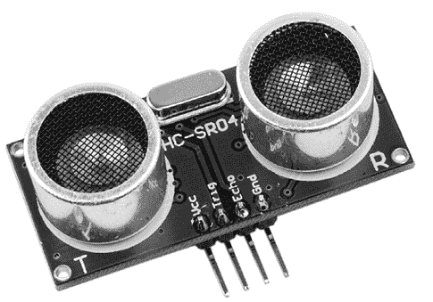

图 14-27：HC-SR04 超声波距离传感器

超声波传感器的准确性和范围意味着它可以测量大约 2 到 450 厘米之间的距离。然而，由于声波需要反射回传感器，传感器的角度必须与运动方向小于 15 度。

### 连接超声波传感器

要连接传感器，将 Vcc（5V）和 GND 引脚连接到电机驱动屏蔽板上的相应连接器，将 Trig 引脚连接到数字引脚 D2，将 Echo 引脚连接到数字引脚 D13。我们选择 D2 和 D13 是因为这些引脚不被电机驱动屏蔽板使用。不过，如果你只是单独测试或实验传感器而不使用机器人，可以直接将电线连接到 Arduino 板上。

为了简化传感器的操作，请从[`github.com/Martinsos/arduino-lib-hc-sr04/archive/master.zip`](https://github.com/Martinsos/arduino-lib-hc-sr04/archive/master.zip)下载 Arduino 库，并按照第七章的说明进行安装。安装完成后，你可以运行列表 14-4 中的测试草图，查看传感器的工作效果。

```
// Listing 14-4
#include <HCSR04.h>1 UltraSonicDistanceSensor HCSR04(2, 13); // trig - D2, echo - D132 float distance;
void setup () 
{ Serial.begin(9600);
}
void loop () 
{3   distance = HCSR04.measureDistanceCm(); Serial.print("Distance: "); Serial.print(distance); Serial.println(" cm"); delay(500);
}
```

列表 14-4：超声波传感器演示草图

由于库的帮助，从传感器中获取距离变得非常简单。在 1 中，我们创建了一个实例并声明与传感器连接的数字引脚。然后在 2 中，我们使用一个浮动变量来存储从传感器库函数返回的距离。最后，在 3 中，生成的距离会显示在串口监视器中。

### 测试超声波传感器

上传草图后，打开串口监视器，并将物体靠近或移开传感器。传感器应返回物体的距离，单位为厘米。查看其工作原理，请参考图 14-28。

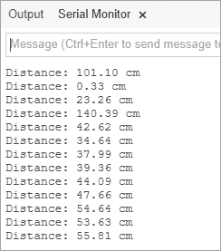

图 14-28：列表 14-4 中的测试结果

## 项目#42：使用超声波距离传感器检测碰撞

现在你已经了解了传感器的工作原理，我们来将它与机器人一起使用。

### 草图

在以下草图中，我们检查机器人与物体之间的距离是否小于或等于 5 厘米，这将促使机器人后退。输入并上传以下草图，亲自体验：

```
// Project 42 - Detecting Collisions with an Ultrasonic Distance Sensor
#include <AFMotor.h>
#include <HCSR04.h>
// set up instances of each motor
AF_DCMotor motor1(1); 
AF_DCMotor motor2(2);
AF_DCMotor motor3(3);
AF_DCMotor motor4(4);
// set up ultrasonic sensor
UltraSonicDistanceSensor HCSR04(2, 13); // trig - D2, echo - D13
boolean crash=false;
void checkDistance()
{ float distance; distance = HCSR04.measureDistanceCm();1   if (distance < 5) // crash distance is 5 cm or less { crash = true; }
}
void goBackward(int speed, int duration){ motor1.setSpeed(speed); motor2.setSpeed(speed); motor3.setSpeed(speed); motor4.setSpeed(speed); motor1.run(BACKWARD); motor2.run(BACKWARD); motor3.run(BACKWARD); motor4.run(BACKWARD); delay(duration); motor1.run(RELEASE); motor2.run(RELEASE); motor3.run(RELEASE); motor4.run(RELEASE);
}
void goForward(int duration, int speed)
{ long a, b; boolean move = true; a = millis(); do { checkDistance(); if (crash == false) { motor1.setSpeed(speed); motor2.setSpeed(speed); motor3.setSpeed(speed); motor4.setSpeed(speed); motor1.run(FORWARD); motor2.run(FORWARD); motor3.run(FORWARD); motor4.run(FORWARD); } if (crash == true) { goBackward(200, 2000); crash = false; } b = millis() - a; if (b >= duration) { move = false; } } while (move != false); // stop motors motor1.run(RELEASE); motor2.run(RELEASE); motor3.run(RELEASE); motor4.run(RELEASE);
}
void setup(){ delay(5000);
}
void loop()
{ goForward(1000, 255);
}
```

这个草图的操作应该已经非常熟悉了。我们再次不断测量距离，当超声波传感器与路径中的物体之间的距离小于 5 厘米时，我们将变量 `crash` 更改为 `true`。看到机器人神奇地避开障碍物，或者和宠物进行智力较量，真的非常令人惊讶。

## 展望未来

在本章中，您学习了如何将基于 Arduino 的项目引入到运动的世界。通过使用简单的电机或一对电机，并配合电机扩展板，您可以创建能够自主移动甚至避开障碍物的项目。我们使用了三种类型的传感器，展示了不同的精度和传感器成本，因此您现在可以根据需求和项目预算做出决策。

到现在为止，我希望您已经体验并享受到了设计和构建这些项目的乐趣。但这还不止于此。在下一章中，我们将走到户外，利用卫星导航的力量。
