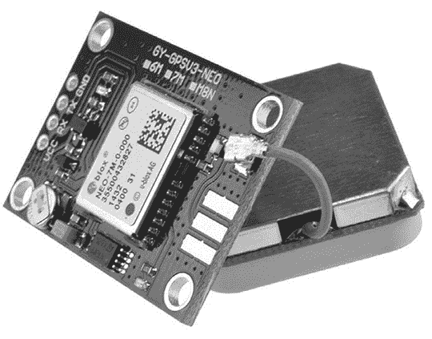
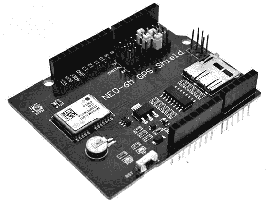
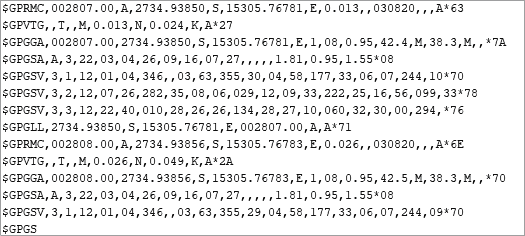
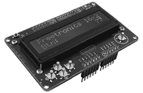
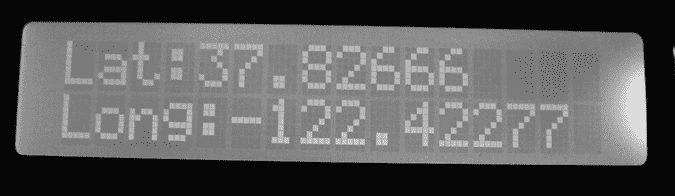
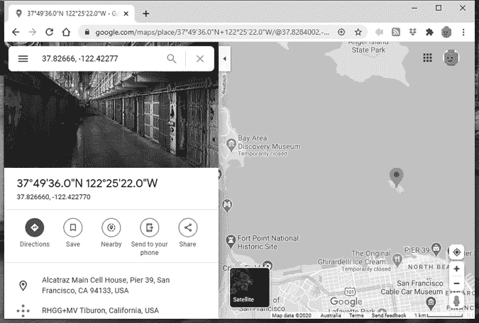
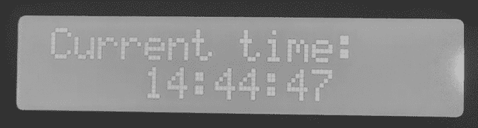
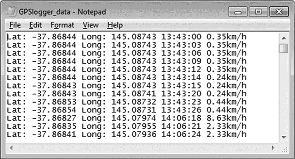
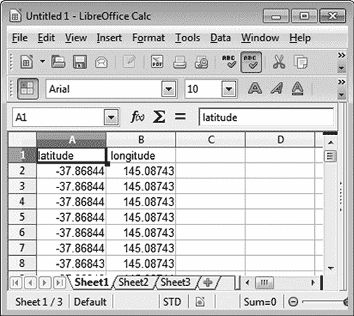
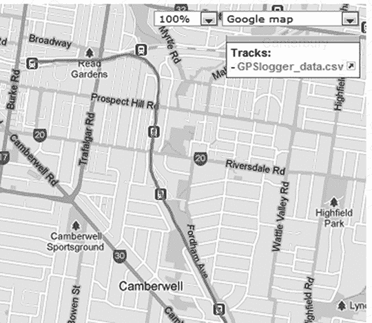

# 第十五章：使用 GPS 与 Arduino 配合

本章内容包括：

+   学习如何连接 GPS 扩展板

+   创建一个简单的 GPS 坐标显示

+   在地图上显示 GPS 坐标的实际位置

+   构建一个精确的时钟

+   记录移动物体随时间变化的位置

您将学习如何使用一种便宜的 GPS 扩展板来确定位置，创建一个精确的时钟，并制作一个记录设备，将您设备的位置随时间记录到 microSD 卡上，之后可以将其绘制在地图上，显示移动历史。

## 什么是 GPS？

*全球定位系统（GPS）* 是一个基于卫星的导航系统，它通过绕地球轨道运行的卫星向地面上的 GPS 接收器发送数据，接收器可以利用这些数据确定地球上任何位置的当前坐标和时间。您可能已经熟悉用于汽车或智能手机的 GPS 导航设备。

尽管我们无法使用 Arduino 创建详细的地图导航系统，但您可以使用 GPS 模块来确定您的位置、时间以及近似速度（如果您正在移动）。在购买 GPS 模块时，通常有两种类型可供选择。第一种是独立的、便宜的 GPS 接收器模块，带有外部天线，如图 15-1 所示。



图 15-1：GPS 接收模块

您将遇到的第二种类型是适用于 Arduino 的 GPS 扩展板，如图 15-2 所示。这些扩展板非常方便，因为所有接线已经为您做好；它们还包括一个 microSD 卡插槽，非常适合记录数据，如本章稍后演示的那样。

确保您的 GPS 扩展板支持将 GPS 接收器的 TX 和 RX 线路连接到 Arduino 数字引脚 D2 和 D3，或者具有跳线可以手动设置这些连接（如图 15-2 所示的扩展板）。更多详情请咨询供应商。您可以在本章中使用这两种设备。不过，我强烈推荐使用扩展板，尤其是您可以轻松地将 LCD 扩展板连接到 GPS 扩展板上，作为显示器使用。



图 15-2：适用于 Arduino 的 GPS 扩展板

## 测试 GPS 扩展板

在购买 GPS 套件后，确保它能正常工作并接收 GPS 信号是个好主意。GPS 接收器需要与天空保持视距，但信号可以穿透窗户。所以，虽然最好在户外进行此测试，但您的 GPS 接收器通过无遮挡的窗户或天窗通常也能正常工作。为了测试接收效果，您需要设置扩展板或模块，并运行一个基本的草图，显示接收到的原始数据。

如果您使用的是 GPS 扩展板，请确保 GPS 的 TX 引脚连接到 Arduino 数字引脚 D2，RX 引脚连接到 Arduino 数字引脚 D3。如果您使用的是 GPS 模块，如图 15-1 所示，请将 Vcc 和 GND 分别连接到 Arduino 的 5V 和 GND；然后将 TX 连接到 Arduino 数字引脚 D2，RX 连接到 Arduino 数字引脚 D3。

要进行测试，请输入并上传 清单 15-1 中的草图。

```
// Listing 15-1
#include <SoftwareSerial.h>
// GPS TX to D2, RX to D3
SoftwareSerial Serial2(2, 3);
byte gpsData;
void setup() 
{
// Open the Arduino Serial Monitor Serial.begin(9600);
// Open the GPS1   Serial2.begin(9600);
}
void loop() 
{2   while (Serial2.available() > 0) { // get the byte data from the GPS gpsData = Serial2.read();3     Serial.write(gpsData); }
}
```

清单 15-1：基本的 GPS 测试草图

该草图在第 2 行监听软件串口，当从 GPS 模块或扩展板接收到一个字节的数据时，它会将数据发送到第 3 行的串口监视器。（注意，我们在第 1 行以 9,600 波特率启动软件串口，以匹配 GPS 接收器的数据速率。）

上传草图后，可能需要等待大约 30 秒；这是为了让 GPS 接收器有时间开始接收来自一个或多个 GPS 卫星的信号。GPS 扩展板或模块上将有一个内置 LED，当接收器开始找到 GPS 信号时，LED 将开始闪烁。LED 开始闪烁后，打开 IDE 中的串口监视器窗口，并将数据速率设置为 9,600 波特率。你应该看到类似于 图 15-3 中所示的持续数据流。



图 15-3：来自 GPS 卫星的原始数据

数据从 GPS 接收器按字符逐个发送到 Arduino，然后再发送到串口监视器。但是这些原始数据（称为*GPS 句子*）本身并不太有用，因此我们需要使用一个新的库，从原始数据中提取信息并将其转换为可用的格式。为此，请按照第七章中的方法下载并安装 TinyGPS 库，网址为 [`www.arduiniana.org/libraries/tinygps/`](http://www.arduiniana.org/libraries/tinygps/)。

## 项目 #43：创建一个简单的 GPS 接收器

我们将从创建一个简单的 GPS 接收器开始。因为你通常会在户外使用 GPS——为了让事情变得稍微简单一点——我们将添加一个 LCD 模块来显示数据，类似于 图 15-4 中所示的。



图 15-4：Freetronics LCD & Keypad 扩展板

结果将是一个非常基本的便携式 GPS，它可以由 9V 电池和连接器供电，并在 LCD 上显示你当前的位置坐标。

### 硬件

所需的硬件非常简单：

+   Arduino 和 USB 电缆

+   LCD 模块或 Freetronics LCD & Keypad 扩展板

+   一根 9V 电池至直流插座电缆

+   GPS 模块和 Arduino 用螺丝扩展板或 Arduino 用 GPS 扩展板

### 草图

输入并上传以下草图：

```
// Project 43 - Creating a Simple GPS Receiver1 #include <LiquidCrystal.h>
LiquidCrystal lcd(8, 9, 4, 5, 6, 7);
#include <TinyGPS.h>
#include <SoftwareSerial.h>
// GPS TX to D2, RX to D3
SoftwareSerial Serial2(2, 3);
TinyGPS gps;
void getgps(TinyGPS &gps);
byte gpsData;2 void getgps(TinyGPS &gps)
// The getgps function will display the required data on the LCD
{ float latitude, longitude; // decode and display position data3   gps.f_get_position(&latitude, &longitude); lcd.setCursor(0, 0); lcd.print("Lat:"); lcd.print(latitude, 5); lcd.print(" "); lcd.setCursor(0, 1); lcd.print("Long:"); lcd.print(longitude, 5); lcd.print(" "); delay(3000); // wait for 3 seconds lcd.clear();
}
void setup(){ Serial2.begin(9600);
}
void loop()
{ while (Serial2.available() > 0) { // get the byte data from the GPS gpsData = Serial2.read(); if (gps.encode(gpsData)) {4       getgps(gps); } }
}
```

从第 1 到第 2 行，草图引入了 LCD 和 GPS 所需的库。在 `void loop()` 中，我们将从 GPS 接收器接收到的字符发送到 4 处的 `getgps()` 函数。通过在 3 处使用 `gps.f_get_position()` 获取数据，并将位置值插入到字节变量 `&latitude` 和 `&longitude` 中，然后将其显示在 LCD 上。

### 运行草图

上传草图并且 GPS 开始接收数据后，你的当前经纬度位置应该会显示在 LCD 上，如 图 15-5 所示。



图 15-5：来自项目 43 的纬度和经度显示

但是这个位置在地球上哪里呢？我们可以通过使用 Google Maps ([`maps.google.com/`](http://maps.google.com/)) 精确确定它的位置。在网站上，输入纬度和经度，用逗号和空格分隔，Google Maps 将返回该位置。例如，使用图 15-5 中返回的坐标可以生成如图 15-6 所示的地图。



图 15-6：在图 15-5 中显示的 GPS 坐标将我们定位到阿尔卡特拉兹岛。

## 项目 #44：创建一个基于 GPS 的精确时钟

使用 GPS 不仅仅是为了找到位置；系统还会传输时间数据，这些数据可以用来制作一个非常精确的时钟。

### 硬件

对于这个项目，我们将使用与项目 43 中相同的硬件。

### 草图

输入并上传以下草图以构建 GPS 时钟：

```
// Project 44 - Creating an Accurate GPS-Based Clock
#include <LiquidCrystal.h>
#include <TinyGPS.h>
#include <SoftwareSerial.h>
LiquidCrystal lcd(8, 9, 4, 5, 6, 7);
// GPS RX to D3, GPS TX to D2
SoftwareSerial Serial2(2, 3);
TinyGPS gps;
void getgps(TinyGPS &gps);
byte gpsData;
void getgps(TinyGPS &gps){ byte month, day, hour, minute, second, hundredths;1   gps.crack_datetime(&year,&month,&day,&hour,&minute,&second,&hundredths);2   hour=hour+10; // change the offset so it is correct for your time zone if (hour>23) { hour=hour-24; } lcd.setCursor(0,0); // print the date and time3   lcd.print("Current time: "); lcd.setCursor(4,1); if (hour<10) { lcd.print("0"); } lcd.print(hour, DEC); lcd.print(":"); if (minute<10) { lcd.print("0"); } lcd.print(minute, DEC); lcd.print(":"); if (second<10) { lcd.print("0"); } lcd.print(second, DEC);
}
void setup()
{ Serial2.begin(9600);
}
void loop()
{ while (Serial2.available() > 0) { // get the byte data from the GPS gpsData = Serial2.read(); if (gps.encode(gpsData)) { getgps(gps); } }
}
```

这个示例的工作方式与项目 43 中的草图类似，不同之处在于它提取的是时间数据（始终为格林威治标准时间，也称为 UTC），而不是位置数据。在步骤 1 中，系统会提取时间。在步骤 2 中，您可以加上或减去一定小时数，将时钟调整为您所在时区的时间。然后，时间应清晰地格式化，并在步骤 3 的 LCD 屏幕上显示。图 15-7 展示了时钟的示例。



图 15-7：项目 44 正在进行中

## 项目 #45：记录移动物体随时间变化的位置

现在我们知道如何接收 GPS 坐标并将其转换为普通变量，我们可以利用这些信息结合第七章介绍的 microSD 或 SD 卡来构建 GPS 记录仪。我们的记录仪将通过记录 GPS 数据随时间变化来记录我们的位置。增加内存卡将使您能够记录汽车、卡车、船只或任何其他能够接收 GPS 信号的移动物体的运动；之后，您可以在计算机上查看这些信息。

### 硬件

如果您有 Arduino 的 GPS 屏蔽板，正如本章前面推荐的那样，所需的硬件与之前示例中使用的是相同的，只是可以移除 LCD 屏蔽板。如果您使用的是 GPS 接收模块，您将需要螺丝屏蔽板，以便连接 GPS 和 SD 卡模块。无论使用哪种方法，您都需要为这个项目提供外部电源。在我们的示例中，我们将记录时间、位置信息和估算的旅行速度。

### 草图

在组装好硬件后，输入并上传以下草图：

```
// Project 45 - Recording the Position of a Moving Object over Time
#include <TinyGPS.h>
#include <SoftwareSerial.h>
#include <SD.h>
// GPS TX to D2, RX to D3
SoftwareSerial Serial2(2, 3);
TinyGPS gps;void getgps(TinyGPS &gps);
byte gpsData;
void getgps(TinyGPS &gps)
{ float latitude, longitude; int year; byte month, day, hour, minute, second, hundredths; // create/open the file for writing File dataFile = SD.open("DATA.TXT", FILE_WRITE); // if the file is ready, write to it:1   if (dataFile) {2     gps.f_get_position(&latitude, &longitude); dataFile.print("Lat: "); dataFile.print(latitude, 5); dataFile.print(" "); dataFile.print("Long: "); dataFile.print(longitude, 5); dataFile.print(" "); // decode and display time data gps.crack_datetime(&year, &month, &day, &hour, &minute, &second, &hundredths); // correct for your time zone as in Project 44 hour = hour + 10; if (hour > 23) { hour = hour - 24; } if (hour < 10) { dataFile.print("0"); } dataFile.print(hour, DEC); dataFile.print(":"); if (minute < 10) { dataFile.print("0"); } dataFile.print(minute, DEC); dataFile.print(":"); if (second < 10) { dataFile.print("0"); } dataFile.print(second, DEC); dataFile.print(" "); dataFile.print(gps.f_speed_kmph());3     dataFile.println("km/h"); dataFile.close();4     delay(15000); // record a measurement around every 15 seconds } // if the file isn't ready, show an error: else { Serial.println("error opening DATA.TXT"); }
}
void setup()
{ Serial.begin(9600); Serial2.begin(9600); Serial.println("Initializing SD card..."); pinMode(10, OUTPUT); // check that the memory card exists and is usable if (!SD.begin(10)) { Serial.println("Card failed, or not present"); // stop sketch return; } Serial.println("memory card is ready");
}
void loop()
{ while (Serial2.available() > 0) { // get the byte data from the GPS gpsData = Serial2.read(); if (gps.encode(gpsData)) {5       getgps(gps); } }
}
```

这个示例使用了在项目 43 和 44 中相同的代码，在`void loop()`中接收 GPS 接收器的数据并传递给其他函数。在 5 处，GPS 接收器的数据被传入 TinyGPS 库以解码为有用的变量。在 1 处，检查存储卡以确认是否可以写入数据，在 2 到 3 处，将相关的 GPS 数据写入到 microSD 卡上的文本文件中。因为每次写入后文件都会关闭，你可以在不通知示例的情况下断开 Arduino 的电源，并且在插入或移除 microSD 卡之前应先断开电源。最后，你可以通过更改`delay()`函数中的值来设置数据记录之间的间隔。

### 运行示例

在操作 GPS 日志器后，生成的文本文件应类似于图 15-8。



图 15-8：项目 45 的结果

一旦你得到了这些数据，你可以手动将其输入到 Google Maps 中，逐点查看 GPS 日志器的行进路线。但更有趣的方法是将整个路线显示在一张地图上。为此，打开文本文件作为电子表格，分离位置数据，并添加一个标题行，如图 15-9 所示。然后将其保存为 *.csv* 文件。



图 15-9：捕获的位置信息

现在访问 GPS Visualizer 网站（[`www.gpsvisualizer.com/`](http://www.gpsvisualizer.com/)）。在“Get Started Now”框中，点击**Choose File**并选择你的数据文件。选择**Google Maps**作为输出格式，然后点击**Map It**。你的 GPS 日志器的运动轨迹应该会显示在类似于图 15-10 的地图上，你可以进一步调整并探索。



图 15-10：映射的 GPS 日志器数据

## 展望未来

如你所见，原本你可能认为复杂的事情，如使用 GPS 接收器，通过 Arduino 就能变得简单。继续沿着这个主题，下一章你将学会如何创建自己的无线数据链接并通过遥控控制设备。
