# 第十六章：无线数据

在这一章节中，你将学习如何使用各种类型的无线传输硬件发送和接收指令和数据。具体来说，你将学习如何

+   使用低成本无线模块发送数字输出信号

+   创建一个简单且廉价的无线遥控系统

+   使用 LoRa 无线数据接收器和收发器

+   创建一个遥控温度传感器

## 使用低成本无线模块

使用两台由 Arduino 控制的系统之间的无线链接传送单向文本信息是很容易的，这两台系统配备了廉价的射频（RF）数据模块，例如图 16-1 所示的发射器和接收器模块。这些模块通常是成对出售的，通常被称为*RF Link*模块或套件。良好的例子包括 PMD Way 的 44910433 零件，或者 SparkFun 的 WRL-10534 和 WRL-10532 零件。在我们的项目中，我们将使用最常见的、工作在 433 MHz 射频上的模块类型。

图 16-2 中发射器底部的连接端口从左到右依次为：数据输入、5V 和 GND。外部天线的连接端口位于板子的右上角。天线可以是单根导线，或者如果传输距离较短，也可以完全省略。（每种品牌的模块可能会有所不同，因此在继续操作之前，请检查你特定设备的连接方式。）

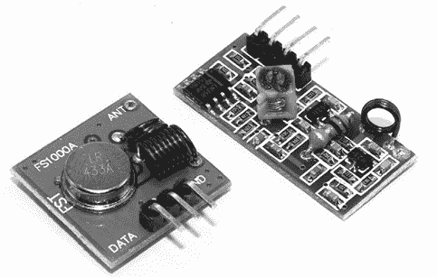

图 16-1：RF Link 发射器和接收器套件

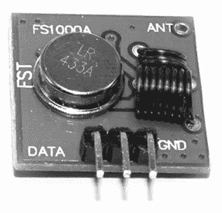

图 16-2：发射器 RF Link 模块

图 16-3 展示了接收器模块，它比发射器模块稍大。

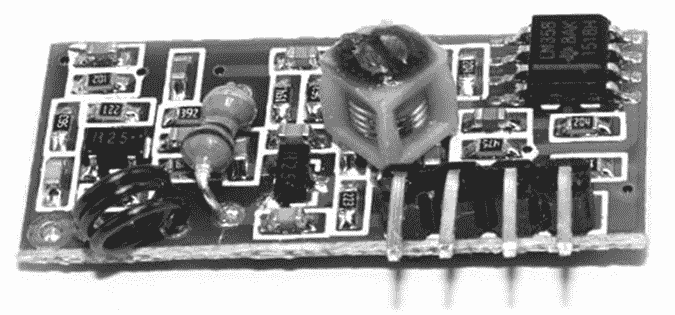

图 16-3：接收器 RF Link 模块

接收器上的连接很简单：V+和 V−针脚分别连接到 5V 和 GND，DATA 连接到分配给接收数据的 Arduino 针脚。这些针脚通常标注在模块的另一侧。如果没有标注，或者你不确定，可以查看模块的数据手册或联系供应商。

在你可以使用这些模块之前，你还需要从[`www.airspayce.com/mikem/arduino/VirtualWire/`](http://www.airspayce.com/mikem/arduino/VirtualWire/)下载并安装最新版本的 VirtualWire 库，安装方法在第七章中有详细说明。此库也包含在本书的草图下载文件中，下载链接是[`nostarch.com/arduino-workshop-2nd-edition/`](https://nostarch.com/arduino-workshop-2nd-edition/)。安装完库之后，你就可以进入下一部分了。

## 项目 #46：创建一个无线遥控器

我们将远程控制两个数字输出：您将按下连接到一个 Arduino 板的按钮，以控制位于远处的另一个 Arduino 上的匹配数字输出引脚。这个项目将向您展示如何使用 RF Link 模块。您还将学会如何确定您能离多远并远程控制 Arduino。在使用这些模块执行更复杂任务之前，了解这一点非常重要。（在开阔地，您通常可以达到大约 100 米的距离，但在室内或模块之间有障碍物时，距离会更短。）

### 发射器电路硬件

发射器电路需要以下硬件：

+   Arduino 和 USB 电缆

+   AA 电池座和接线（如第十四章所用）

+   一个 433 MHz RF Link 发射模块

+   两个 10 kΩ 电阻（R1 和 R2）

+   两个 100 nF 电容（C1 和 C2）

+   两个按钮

+   一个面包板

### 发射器原理图

发射器电路由两个带有去抖电路的按钮组成，连接到数字引脚 2 和 3，以及之前描述过的发射模块（见图 16-4）。

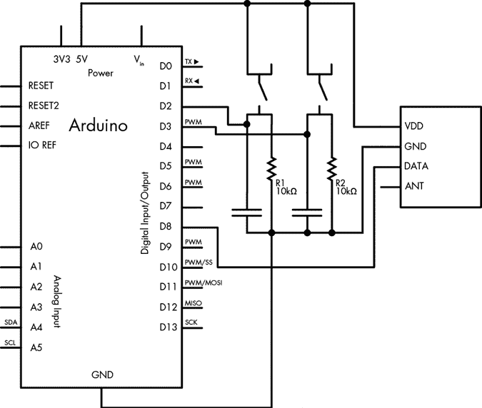

图 16-4：项目 46 的发射器原理图

### 接收器电路硬件

接收器电路需要以下硬件：

+   Arduino 和 USB 电缆

+   AA 电池座和接线（如第十四章所用）

+   一个 433 MHz RF Link 接收模块

+   一个面包板

+   两个您选择的 LED

+   两个 560 Ω 电阻（R1 和 R2）

### 接收器原理图

接收器电路由两个数字引脚 6 和 7 上的 LED 和连接到数字引脚 8 的 RF Link 接收模块数据引脚组成，如图 16-5 所示。

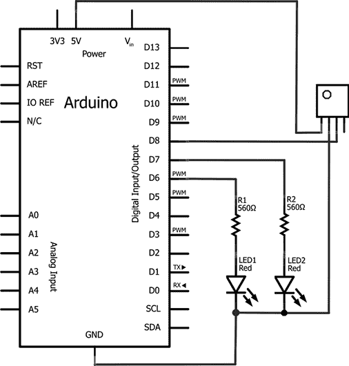

图 16-5：项目 46 的接收器原理图

您可以将面包板、LED、限流电阻和接收模块替换为 Freetronics 433 MHz 接收器扩展板，如图 16-6 所示。

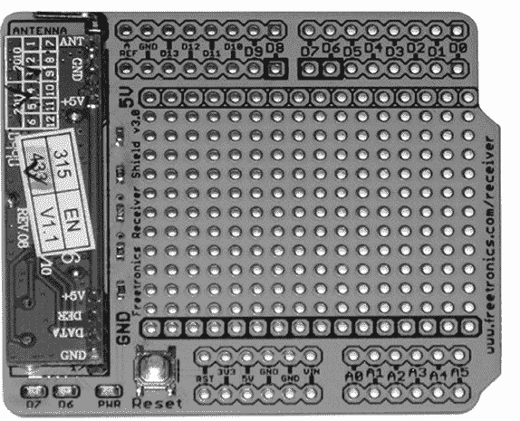

图 16-6：Freetronics 433 MHz 接收器扩展板

### 发射器草图

现在让我们来看一下发射器的草图。输入并上传以下草图到带有发射器电路的 Arduino：

```
// Project 46 - Creating a Wireless Remote Control, Transmitter Sketch1 #include <VirtualWire.h> 
uint8_t buf[VW_MAX_MESSAGE_LEN]; 
uint8_t buflen = VW_MAX_MESSAGE_LEN;2 const char *on2 = "a"; 
const char *off2 = "b"; 
const char *on3 = "c"; 
const char *off3 = "d"; 
void setup()
{3     vw_set_ptt_inverted(true);      // Required for RF Link modules  vw_setup(300);                  // set data speed 4     vw_set_tx_pin(8);              pinMode(2, INPUT); pinMode(3, INPUT);
}
void loop()
{5   if (digitalRead(2)==HIGH) {   vw_send((uint8_t *)on2, strlen(on2));  // send data out to the world vw_wait_tx();                          // wait a moment  delay(200); } if (digitalRead(2)==LOW) {6        vw_send((uint8_t *)off2, strlen(off2));    vw_wait_tx();                            delay(200); } if (digitalRead(3)==HIGH) { vw_send((uint8_t *)on3, strlen(on3));    vw_wait_tx();                            delay(200); }  if (digitalRead(3)==LOW) { vw_send((uint8_t *)off3, strlen(off3));  vw_wait_tx();                            delay(200); }
}
```

我们在第 1 行引入了 VirtualWire 库，并在第 3 行使用它的函数来设置 RF Link 发射模块并设定数据传输速度。在第 4 行，我们设置了数字引脚 8，用于连接 Arduino 到发射模块的数据引脚，并控制数据传输速度。（如果需要，您可以使用其他数字引脚，但 0 和 1 会干扰串行线。）

发射器的草图读取连接到数字引脚 2 和 3 的两个按钮的状态，并将与按钮状态匹配的单个文本字符发送到 RF 链接模块。例如，当数字引脚 2 上的按钮为`HIGH`时，Arduino 发送字符*a*；当按钮为`LOW`时，发送字符*b*；当数字引脚 3 上的按钮为`HIGH`时，Arduino 发送字符*c*；当按钮为`LOW`时，发送字符*d*。这四种状态从 2 开始声明。

文本字符的传输通过四个部分的`if`语句来处理，从第 5 行开始，例如第 6 行的`if-then`语句。传输的变量被使用了两次，如这里使用`on2`所示：

```
vw_send((uint8_t *)on2, strlen(on2)); 
```

函数`vw_send()`发送变量`on2`的内容，但它需要知道变量的字符长度，因此我们使用`strlen()`来完成这一操作。

### 接收器草图

现在让我们添加接收器草图。输入并上传以下草图到 Arduino，并连接接收电路：

```
// Project 46 - Creating a Wireless Remote Control, Receiver Sketch
#include <VirtualWire.h> 
uint8_t buf[VW_MAX_MESSAGE_LEN]; 
uint8_t buflen = VW_MAX_MESSAGE_LEN;
void setup()
{1   vw_set_ptt_inverted(true);    // Required for RF Link modules  vw_setup(300); 2   vw_set_rx_pin(8);             vw_rx_start();                 pinMode(6, OUTPUT);  pinMode(7, OUTPUT);
}
void loop()
{3   if (vw_get_message(buf, &buflen))  {4     switch(buf[0])   { case 'a': digitalWrite(6, HIGH); break; case 'b':  digitalWrite(6, LOW); break; case 'c':  digitalWrite(7, HIGH); break; case 'd':  digitalWrite(7, LOW); break; } }
}
```

与发射器电路一样，我们使用 VirtualWire 函数在第 1 行设置 RF 链接接收模块并设置数据传输速度。在第 2 行我们设置 Arduino 数字引脚，连接到该链接的数据输出引脚（引脚 8）。

当草图运行时，来自发射器电路的字符被 RF 链接模块接收并发送到 Arduino。`vw_get_message()`函数在第 3 行获取由 Arduino 接收的字符，这些字符通过第 4 行的`switch case`语句进行解析。例如，按下发射器电路上的按钮 S1 时，会发送字符*a*。该字符由接收器接收，并使数字引脚 6 设置为`HIGH`，点亮 LED。

你可以使用这一对简单的演示电路，通过将代码作为基本字符发送并由接收电路解释，从而为 Arduino 系统创建更复杂的控制。

## 使用 LoRa 无线数据模块实现更大范围和更快速度

当你需要比之前使用的基本无线模块提供更大范围和更快数据速度的无线数据链接时，LoRa 数据模块可能是一个合适的选择。LoRa 是“长距离”（long range）的缩写，这些模块具有低功耗并能够在长距离范围内工作。这些模块是*收发器*，即既能发送又能接收数据的设备，因此你不需要单独的发射器和接收器。使用 LoRa 模块的另一个好处是，不同类型的模块之间可以互相通信，使得你作为设计者能够创建从简单到复杂的控制和数据网络。在本章中，你将创建几个基础模块，可以根据需要扩展用于各种目的。

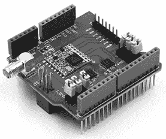

图 16-7：Arduino 用 LoRa 扩展板

为了方便起见，我们将使用两个 Arduino 的 LoRa 扩展板，例如 PMD Way 型号 14290433，如图 16-7 所示。

购买 LoRa 扩展板时，你需要选择一个工作频率。正确的频率会根据你使用的国家/地区而有所不同。这样可以确保你的数据传输不会干扰到你所在地区的其他设备。LoRa 产品有三种工作频段：

1.  433 MHz 用于美国和加拿大

1.  868 MHz 用于英国和欧洲

1.  915 MHz 用于澳大利亚和新西兰

你可以在[`www.thethingsnetwork.org/docs/lorawan/frequencies-by-country.html`](https://www.thethingsnetwork.org/docs/lorawan/frequencies-by-country.html)找到各国的频率范围完整列表。

最后，你需要下载并安装 Arduino 库，库文件可以在[`github.com/sandeepmistry/arduino-LoRa/archive/master.zip`](https://github.com/sandeepmistry/arduino-LoRa/archive/master.zip)找到。

## 项目 #47：通过 LoRa 无线进行远程控制

这个项目将演示从一个配备 LoRA 的 Arduino 到另一个的简单数据传输，用于远程控制数字输出引脚。我们的发射器有两个按钮，用于打开和关闭接收电路的输出引脚。

### 发射器电路硬件

发射器电路所需的硬件如下：

+   Arduino 和 USB 电缆

+   Arduino 用 LoRa 扩展板

+   两个 10 kΩ 电阻 (R1 和 R2)

+   两个 100 nF 电容 (C1 和 C2)

+   两个按钮

+   AA 电池座和接线（在第十四章中使用）

### 发射器原理图

如图 16-8 所示，发射器电路由两个带有去抖动电路的按钮组成，分别连接到数字引脚 2 和 3。LoRa 扩展板安装在 Arduino Uno 上。一旦草图上传完成，电源由 AA 电池座和接线提供。

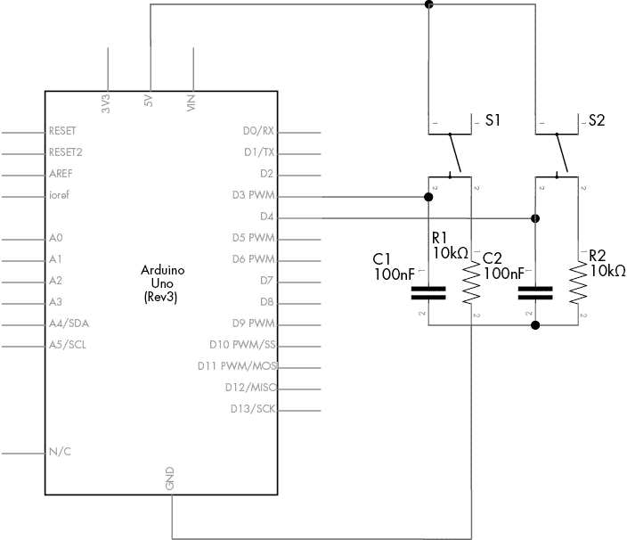

图 16-8：项目 47 的发射器原理图

在使用你的 LoRa 扩展板之前，需移除三个插针跳线，如图 16-9 所示。如果不移除它们，它们将干扰其他数字引脚。你可以完全移除它们，或者仅将插针连接到两个引脚之一。

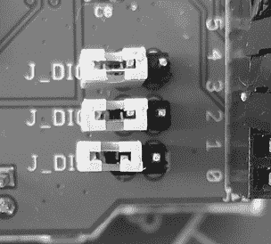

图 16-9：从 LoRa 扩展板上移除的插针跳线

### 接收器电路硬件

接收器电路所需的硬件如下：

+   Arduino 和 USB 电缆

+   Arduino 用 LoRa 扩展板

+   一个 LED

+   一个 560 Ω 电阻 (R1)

### 接收器原理图

接收器电路，如图 16-10 所示，由一个 LED 和一个限流电阻组成，电阻连接在数字引脚 7 和 GND 之间。我们将其通过 USB 连接到 PC，因此不需要外部电源。

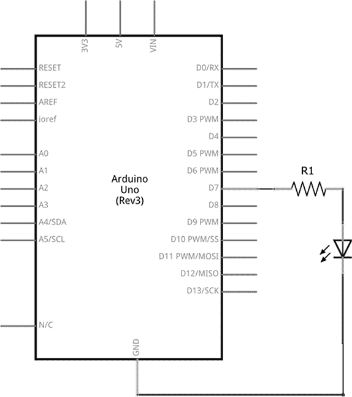

图 16-10：项目 47 的接收器原理图

### 发射器草图

现在让我们来查看发射器的草图。输入并上传以下草图到带有发射器电路的 Arduino：

```
// Project 47 - Remote Control over LoRa Wireless, Transmitter Sketch1 #define LORAFREQ (915000000L)2 #include <LoRa.h>
#include <SPI.h>3 void loraSend(int controlCode)
{4   LoRa.beginPacket();      // start sending data LoRa.print("ABC");       // "ABC" is our three-character code for receiver LoRa.print(controlCode); // send our instructions (controlCode codes)5   LoRa.endPacket();        // finished sending data5   LoRa.receive();          // start listening
}
void setup()
{ pinMode(4, INPUT);    // on button pinMode(3, INPUT);    // off button6   LoRa.begin(LORAFREQ); // start up LoRa at specified frequency
}
void loop()
{ // check for button presses to control receiver if (digitalRead(4) == HIGH) { loraSend(1); // '1' is code for turn receiver digital pin 5 HIGH delay(500);  // allow time to send } if (digitalRead(3) == HIGH) { loraSend(0); // '0' is code for turn receiver digital pin 5 LOW delay(500);  // allow time to send }
}
```

操作频率在第 1 行选择。我们的示例使用的是 915 MHz，因此根据你的国家和无线电盾牌，你可能需要将其更改为`433000000L`或`868000000L`。我们在第 2 行包含了 Arduino LoRa 库，并在第 4 行激活它。SPI 库也被包含，因为 LoRa 盾牌使用 SPI 总线与 Arduino 通信。在第 6 行，LoRa 收发器在适当的频率下被激活，数字引脚也被准备好作为按钮的输入。

在第 3 行，我们有一个自定义函数`loraSend(int controlCode)`。按下按钮时，会调用此函数。它首先发送一个三字符代码——在本例中是`ABC`——通过 LoRa 无线电波发送，然后发送控制代码。字符代码允许你将控制发送到特定的接收器电路。否则，如果你使用两个或更多接收器，就会混淆由哪个接收器接收发射器的控制信号。你将看到，接收器只有在收到`ABC`时才会行动。我们示例中的控制代码是`1`和`0`（分别用于打开或关闭接收器的数字输出）。

在第 4 行，LoRa 模块被切换到发送模式，然后通过无线电波发送字符和控制代码。在第 5 行，LoRa 模块停止发送并切换回接收数据。上传了发射器草图后，可以将发射器硬件从计算机上断开，并通过电池组供电。

### 接收器草图

现在让我们来看看接收器草图。输入并上传以下草图到带有接收器电路的 Arduino 中：

```
// Project 47 - Remote Control over LoRa Wireless, Receiver Sketch1 #define LORAFREQ (915000000L)2 #include <LoRa.h>
#include <SPI.h>
void takeAction(int packetSize)
// things to do when data received over LoRa wireless
{3   char incoming[4] = ""; int k; for (int i = 0; i < packetSize; i++) { k = i; if (k > 6) { k = 6; // make sure we don't write past end of string } incoming[k] = (char)LoRa.read();4   } // check the three-character code sent from transmitter is correct5   if (incoming[0] != 'A') { return; // if not 'A', stop function and go back to void loop() }5   if (incoming[1] != 'B') { return; // if not 'B', stop function and go back to void loop() }5   if (incoming[2] != 'C') { return; // if not 'C', stop function and go back to void loop() } // If made it this far, correct code has been received from transmitter.  // Now to do something... if (incoming[3] == '1') { digitalWrite(7, HIGH); } if (incoming[3] == '0') { digitalWrite(7, LOW); }}
void setup()
{ pinMode(7, OUTPUT);6   LoRa.begin(LORAFREQ);       // start up LoRa at specified frequency7   LoRa.onReceive(takeAction); // call function "takeAction" when data received 8   LoRa.receive();             // start receiving
}
void loop()
{
}
```

我们再次在第 2 行包含了 Arduino LoRa 库，并在第 6 行激活它。操作频率也在第 1 行选择。我们的示例使用的是 915 MHz，因此根据你的国家和无线电盾牌，你可能需要将其更改为`433000000L`或`868000000L`。同时也包含了 SPI 库，因为 LoRa 盾牌使用 SPI 总线与 Arduino 通信。在第 7 行，我们告诉草图在接收到数据时运行某个函数——在本例中是`void takeAction()`。然后在第 8 行，LoRa 模块被切换到接收模式。

在运行时，接收器只是等待 LoRa 模块接收到数据。此时，`takeAction()`函数会被调用。它将从发射器接收的每个字符放入一个名为`incoming[4]`的字符数组中，位置在第 3 行到第 4 行之间。接下来，接收器检查代码的每个字符（在我们的示例中是`ABC`），以确保传输是针对这个特定接收器的。最后，如果检查成功，控制字符会被检查。如果它是`1`，数字引脚 7 会被设置为`HIGH`，如果是`0`，数字引脚 7 会被设置为`LOW`。

现在你已经有了一个远程控制的基本框架。此外，通过为多个接收器分配不同的字符代码，你可以将系统扩展为通过一个发射器控制多个接收单元。

然而，对于一些重要的应用，你可能希望确认发射机的指令已被接收机成功执行，因此我们将在下一个项目中添加确认功能。

## 项目#48：通过 LoRa 无线遥控并进行确认

该项目为第 47 号项目中创建的接收机-发射机系统添加了确认功能，形成了一个双向数据系统。发射机电路上的 LED 将在接收机输出设置为`HIGH`时点亮，而在接收机输出设置为`LOW`时熄灭。

### 发射机电路硬件

发射机电路所需的硬件如下：

+   Arduino 及 USB 电缆

+   Arduino 的 LoRa 扩展板

+   两个 10 kΩ电阻（R1 和 R2）

+   一个 560 Ω电阻（R3）

+   一个 LED

+   两个 100 nF 电容（C1 和 C2）

+   两个按键

+   AA 电池座及接线（如第十四章所用）

### 发射机电路图

如图 16-11 所示，发射机电路由两个带去抖动电路的按键组成，这些按键连接到数字引脚 3 和 4；LED 和限流电阻连接到数字引脚 6。LoRa 扩展板安装在 Arduino Uno 上。一旦草图上传完成，电源由 AA 电池座和接线提供。

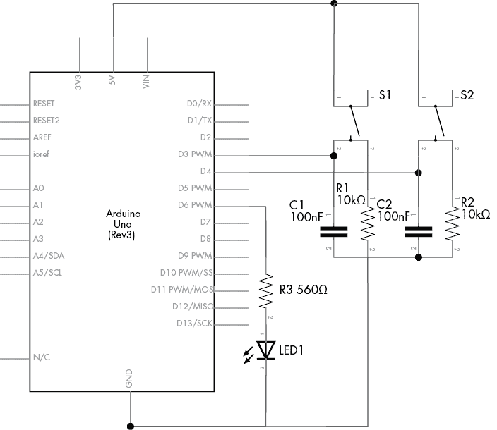

图 16-11：第 48 号项目的发射机电路图

本项目的接收机电路和电路图与第 47 号项目中的相同。

### 发射机草图

现在，让我们来查看发射机的草图。输入并上传以下草图到配有发射机电路的 Arduino 中：

```
// Project 48 - Remote Control over LoRa Wireless with Confirmation, 
// Transmitter Sketch
#define LORAFREQ (915000000L)
#include <SPI.h>
#include <LoRa.h>
void loraSend(int controlCode)
{ LoRa.beginPacket(); // start sending data LoRa.print("DEF");  // "DEF" is our three-character code for the receiver.  // Needs to be matched on RX. LoRa.print(controlCode); // send our instructions (controlCode codes) LoRa.endPacket();   // finished sending data LoRa.receive();     // start listening
}1 void takeAction(int packetSize)
// things to do when data received over LoRa wireless
{ char incoming[4] = ""; int k; for (int i = 0; i < packetSize; i++) { k = i; if (k > 6) { k = 18; // make sure we don't write past end of string } incoming[k] = (char)LoRa.read(); } // check the three-character code sent from receiver is correct if (incoming[0] != 'D') { return; // if not 'D', stop function and go back to void loop() } if (incoming[1] != 'E') { return; // if not 'E', stop function and go back to void loop() } if (incoming[2] != 'F') { return; // if not 'F', stop function and go back to void loop() } // If made it this far, correct code has been received from receiver.  // Now to do something...2   if (incoming[3] == '1') { digitalWrite(6, HIGH); // receiver has turned output on and has sent a signal confirming this }2   if (incoming[3] == '0') { digitalWrite(6, LOW); // receiver has turned output off and has sent a signal confirming this }
}
void setup()
{ pinMode(4, INPUT);          // on button pinMode(3, INPUT);          // off button pinMode(6, OUTPUT);         // status LED LoRa.begin(LORAFREQ);       // start up LoRa at specified frequency LoRa.onReceive(takeAction); // call function "takeAction" when data received // over LoRa wireless
}
void loop()
{ // check for button presses to control receiver if (digitalRead(4) == HIGH) { loraSend(1); // '1' is code for turn receiver digital pin 7 HIGH delay(500);  // button debounce } if (digitalRead(3) == HIGH) { loraSend(0); // '0' is code for turn receiver digital pin 7 LOW delay(500);  // button debounce }
}
```

我们的发射机电路与第 47 号项目中的工作方式相同，首先发送一个字符编码用于识别，然后发送一个控制编码来打开或关闭接收机的输出。然而，在这个项目中，发射机会监听接收机的信号，一旦接收机完成了来自发射机的控制指令，接收机会将字符编码和控制编码返回给发射机。

因此，在 1 时，我们新增了一个函数`takeAction()`，用于检查来自接收机电路的字符编码`DEF`。接收机在其输出引脚打开时发送`1`，在输出关闭时发送`0`。我们的发射机电路可以通过控制数字引脚 6 上的 LED 来显示此状态，方法是通过 2 中的代码。

### 接收机草图

最后，让我们来看一下接收机的草图。输入并上传以下草图到配有接收机电路的 Arduino 中：

```
// Project 48 - Remote Control over LoRa Wireless with Confirmation, Receiver 
// Sketch
#define LORAFREQ (915000000L)
#include <SPI.h>
#include <LoRa.h>
void loraSend(int controlCode){ LoRa.beginPacket();      // start sending data LoRa.print("DEF");       // "DEF" is our three-character code for the // transmitter LoRa.print(controlCode); // send our instructions (controlCode codes) LoRa.endPacket();        // finished sending data LoRa.receive();          // start listening
}
void takeAction(int packetSize)
// things to do when data received over LoRa wireless
{ char incoming[4] = ""; int k; for (int i = 0; i < packetSize; i++) { k = i; if (k > 6) { k = 18; // make sure we don't write past end of string } incoming[k] = (char)LoRa.read(); } // check the three-character code sent from transmitter is correct if (incoming[0] != 'A') { return; // if not 'A', stop function and go back to void loop() } if (incoming[1] != 'B') { return; // if not 'B', stop function and go back to void loop() } if (incoming[2] != 'C') { return; // if not 'C', stop function and go back to void loop() } // If made it this far, correct code has been received from transmitter.  // Now to do something... if (incoming[3] == '1') { digitalWrite(7, HIGH);1     loraSend(1); // tell the transmitter that the output has been turned on } if (incoming[3] == '0') { digitalWrite(7, LOW);1     loraSend(0); // tell the transmitter that the output has been turned off }
}
void setup()
{ pinMode(7, OUTPUT); LoRa.begin(LORAFREQ);       // start up LoRa at specified frequency LoRa.onReceive(takeAction); // call function "takeAction" when data received // over LoRa wireless LoRa.receive(); // start receiving
}
void loop()
{
}
```

我们的接收机工作原理与第 47 号项目中的接收机相同，唯一不同的是，接收机会将字符编码`DEF`发送回发射机，接着发送`1`或`0`，以指示输出引脚是否被打开或关闭。这一操作通过`loraSend()`函数在 1 时完成。

到此为止，你已经有了两个示例项目，展示了如何不仅能在比之前的项目更远的距离上无线控制数字输出引脚，还能确认操作是否已发生。现在你可以在这些示例的基础上扩展，创建你自己的遥控项目。不过接下来，我们将尝试通过 LoRa 无线链路发送传感器数据，项目 49 将展示这一实验。

## 项目#49：通过 LoRa 无线发送远程传感器数据

这个项目基于我们之前的工作，通过计算机请求远程传感器的温度数据。

### 发射器电路硬件

发射器电路所需的硬件如下：

+   Arduino 和 USB 电缆

+   Arduino 的 LoRa 扩展板

本项目使用 PC 上的串口监视器进行控制，因此发射器电路仅包括 Arduino 和 LoRa 扩展板，通过 USB 电缆连接到 PC。

### 接收器电路硬件

接收器电路所需的硬件如下：

+   Arduino 和 USB 电缆

+   Arduino 的 LoRa 扩展板

+   TMP36 温度传感器

+   无焊接面包板

+   Arduino 的外部电源

+   公对公跳线

### 接收器原理图

我们的电路简单地将 TMP36 温度传感器连接到模拟引脚 A0，并将 LoRa 扩展板放置在 Arduino 上，如图 16-12 所示。

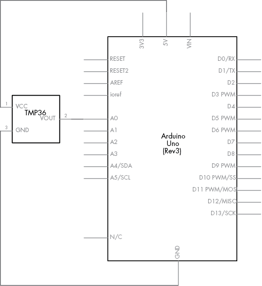

图 16-12：项目 49 的接收器原理图

接收器电路可能距离计算机较远，因此你可以使用 USB 电源或之前项目中使用的电池解决方案。

### 发射器草图

现在，让我们检查一下发射器的草图。将以下草图输入并上传到 Arduino 与发射器电路：

```
// Project 49 - Sending Remote Sensor Data Using LoRa Wireless, Transmitter 
// Sketch
#define LORAFREQ (915000000L)
#include <SPI.h>
#include <LoRa.h>
char command;
void loraSend(int controlCode)
{ LoRa.beginPacket();      // start sending data1   LoRa.print("ABC");       // "ABC" is our three-character code for the // transmitter LoRa.print(controlCode); // send our instructions (controlCode codes) LoRa.endPacket();        // finished sending data LoRa.receive();          // start listening
}
void takeAction(int packetSize)
// send text received from sensor Arduino via LoRa to Serial Monitor{ char incoming[31] = ""; int k; for (int i = 0; i < packetSize; i++) { k = i; if (k > 31) { k = 31; // make sure we don't write past end of string } incoming[k] = (char)LoRa.read(); Serial.print(incoming[k]); // display temp information from sensor board } Serial.println();
}
void setup()
{2   LoRa.begin(LORAFREQ);       // start up LoRa at specified frequency LoRa.onReceive(takeAction); // call function "takeAction" when data received // over LoRa wireless LoRa.receive();             // start receiving Serial.begin(9600);
}
void loop()
{3   Serial.print("Enter 1 for Celsius or 2 for Fahrenheit then Enter: "); Serial.flush(); // clear any "junk" out of the serial buffer before waiting4   while (Serial.available() == 0) { // do nothing until something enters the serial buffer } while (Serial.available() > 0) { command = Serial.read() - '0'; // read the number in the serial buffer, // remove the ASCII text offset for zero: '0' } Serial.println();5   loraSend(command); delay(2000);
}
```

与本章之前的项目一样，我们在 2 处初始化 LoRa 硬件和串口监视器。然而，这次我们不再使用硬件按钮，而是通过串口监视器接受用户命令，并将这些命令发送到接收器硬件。在本项目中，用户需要在串口监视器的输入框中输入`1`或`2`，分别获取来自接收器硬件的摄氏度或华氏度温度。这一操作发生在 3 处。计算机在 4 处等待用户输入，然后通过`loraSend()`在 5 处将相应命令发送给接收器硬件。同样，我们使用一个三字符代码确保传输仅限于接收器板 1。

### 接收器草图

现在，让我们检查接收器的草图。将以下草图输入并上传到 Arduino 与接收器电路：

```
// Project 49 - Sending Remote Sensor Data Using LoRa Wireless, Receiver
// Sketch
#define LORAFREQ (915000000L)
#include <SPI.h>
#include <LoRa.h>
float sensor = 0;
float voltage = 0;
float celsius = 0;
float fahrenheit = 0;
void loraSendC()
{ LoRa.beginPacket(); // start sending data sensor = analogRead(0); voltage = ((sensor * 5000) / 1024); voltage = voltage - 500; celsius = voltage / 10; fahrenheit = ((celsius * 1.8) + 32);1   LoRa.print("Temperature: "); LoRa.print(celsius, 2); LoRa.print(" degrees C");2   LoRa.endPacket(); // finished sending data LoRa.receive();   // start listening
}
void loraSendF()
// send temperature in Fahrenheit
{ LoRa.beginPacket(); // start sending data sensor = analogRead(0); voltage = ((sensor * 5000) / 1024); voltage = voltage - 500; celsius = voltage / 10; fahrenheit = ((celsius * 1.8) + 32);1   LoRa.print("Temperature: "); LoRa.print(fahrenheit, 2); LoRa.print(" degrees F");2   LoRa.endPacket(); // finished sending data LoRa.receive();   // start listening
}
void takeAction(int packetSize)
// things to do when data received over LoRa wireless
{ char incoming[6] = ""; int k; for (int i = 0; i < packetSize; i++) { k = i; if (k > 6) { k = 6; // make sure we don't write past end of string } incoming[k] = (char)LoRa.read(); }3   // check the three-character code sent from transmitter is correct if (incoming[0] != 'A') { return; // if not 'A', stop function and go back to void loop() } if (incoming[1] != 'B') { return; // if not 'B', stop function and go back to void loop() } if (incoming[2] != 'C') { return; // if not 'C', stop function and go back to void loop() } // If made it this far, correct code has been received from transmitter  if (incoming[3] == '1') {4     loraSendC(); } if (incoming[3] == '2') {5     loraSendF(); }
}
void setup()
{ LoRa.begin(LORAFREQ);       // start up LoRa at specified frequency LoRa.onReceive(takeAction); // call function "takeAction" when data received  LoRa.receive();             // start receiving
}
void loop()
{
}
```

使用与项目 48 相同的方法，我们的接收器硬件解码从发射器传输来的信号，以确保数据是发送给它的，通过检查在 3 处发送的字符代码。如果这是正确的，接收器板会分别在 4 或 5 调用`loraSendC()`或`loraSendF()`中的一个。这两个函数计算 TMP36 传感器的温度，并在 1 和 2 之间将包含温度和测量类型的文本字符串发送回发射器板。

一旦你组装好两个电路的硬件并上传了两个草图，将带电的接收器电路（包括传感器）放置在你希望从计算机测量温度的位置。确保发射器电路已连接到计算机。在 IDE 中打开串口监视器，并按照指示检查温度。如图 16-13 所示为示例。

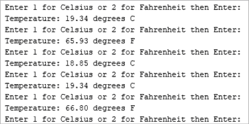

图 16-13：项目 49 的示例输出

## 展望未来

本章展示了远程控制多 Arduino 系统是多么简单。例如，你可以通过从一个 Arduino 向另一个 Arduino 发送字符来控制数字输出，使用 LoRa 无线技术创建更复杂的多 Arduino 控制系统，并且可以包括数据返回。通过你迄今为止获得的知识，许多创意选项都已向你开放。

但在无线数据传输方面仍有许多内容需要探讨，因此，在下一章学习如何使用简单的电视遥控器与 Arduino 配合时，继续阅读并跟随示例进行实践。
