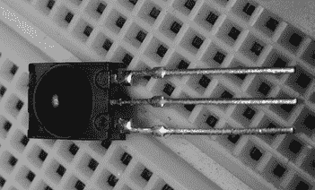
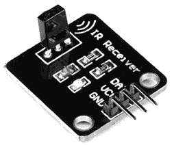
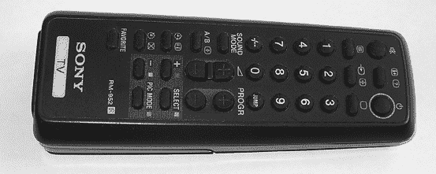
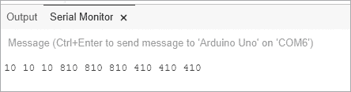
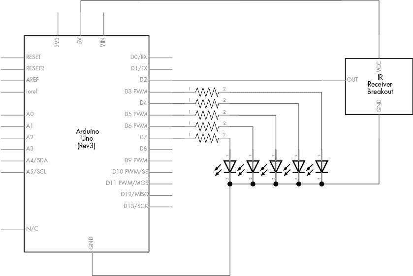

# 第十七章：红外遥控器

在本章中，你将会：

+   创建并测试一个简单的红外接收器

+   遥控 Arduino 数字输出引脚

+   将遥控系统添加到我们在第十四章中创建的机器人车辆中

正如你将看到的，借助一个便宜的接收器模块，你的 Arduino 能够接收来自红外遥控器的信号并做出响应。

## 什么是红外线？

许多人在日常生活中使用红外遥控器，但大多数人并不知道它们是如何工作的。红外线（IR）信号是无法用肉眼看到的光束。所以下次你看遥控器上小小的 LED 并按下一个按钮时，你并不会看到 LED 亮起。

这是因为红外遥控器包含一个或多个特殊的红外光生成 LED，它们用于发射红外信号。当你按下遥控器上的一个按钮时，LED 会反复开关，以独特的模式传输每个按钮的信号。这个信号被被控制设备上的特殊红外接收器接收，并转换为电脉冲，接收器的电子设备会读取这些数据。如果你对这些模式感兴趣，可以通过手机相机或数码相机的取景器查看遥控器上的红外 LED 来观察这些模式。

## 设置红外接收

在继续之前，我们需要安装 Arduino IRremote 库，因此请访问[`github.com/z3t0/Arduino-IRremote/archive/master.zip`](https://github.com/z3t0/Arduino-IRremote/archive/master.zip)下载所需的文件，并使用第七章中描述的方法安装。

### 红外接收器

下一步是设置红外接收器并测试它是否正常工作。你可以选择独立的红外接收器（如图 17-1 所示）或预接线模块（如图 17-2 所示），选择最适合你的方式。



图 17-1：红外接收器



图 17-2：预接线红外接收器模块

如图 17-1 所示，独立的红外接收器是 Vishay TSOP4138。接收器的底部引脚（如图所示）连接到 Arduino 数字引脚，中间引脚连接到 GND，顶部引脚连接到 5V。

图 17-2 显示了一个预接线的红外模块。预接线接收器模块可以从 PMD Way 及其他零售商处购买。使用这些模块的好处是，它们配有连接线，并且标有标签，便于参考。

无论你选择哪种模块，在接下来的所有示例中，你都会将 D（数据线）连接到 Arduino 的数字引脚 2，将 VCC 连接到 5V，将 GND 连接到 GND。

### 遥控器

最后，你需要一个遥控器。我使用了像图 17-3 中显示的索尼电视遥控器。如果你没有索尼遥控器，任何便宜的通用遥控器都可以使用，前提是将其重置为索尼代码。有关如何操作，请参阅遥控器附带的说明。



图 17-3：典型的 Sony 遥控器

### 测试草图

现在，让我们确保一切正常工作。在将 IR 接收器连接到 Arduino 后，输入并上传 列表 17-1 中的草图。

```
// Listing 17-11 #include <IRremote.h>       // use the library 2 IRrecv irrecv(receiverpin); // create instance of irrecv3 decode_results results; 
int receiverpin = 2;        // pin 1 of IR receiver to Arduino digital pin 2
void setup()
{ Serial.begin(9600);  irrecv.enableIRIn();      // start the IR receiver
}
void loop() 
{4   if (irrecv.decode(&results))        // have we received an IR signal? { 5     Serial.print(results.value, HEX); // display IR code in the Serial Monitor Serial.print(" "); irrecv.resume();                  // receive the next value }
}
```

列表 17-1：IR 接收器测试

这个草图相对简单，因为大部分工作都由 IR 库在后台完成。在第 4 行，我们检查是否接收到遥控器的信号。如果接收到信号，它将在第 5 行以十六进制显示在串行监视器中。第 1、2 和 3 行激活 IR 库，并创建一个红外库函数的实例，以便在草图的其余部分进行引用。

### 测试设置

上传草图后，打开串行监视器，将遥控器对准接收器，开始按下按钮。每次按下按钮后，您应该会在串行监视器中看到按钮的代码。例如，图 17-4 显示了分别按下 1、2 和 3 后的结果。



图 17-4：运行 列表 17-1 中的代码后按下按钮的结果

表 17-1 列出了我们将在后续草图中使用的基本 Sony 遥控器的代码。然而，在运行 列表 17-1 时，请注意每个代码数字会重复三次。这是 Sony 红外系统的一个特性，每次按下按钮时，系统会发送三次代码。通过一些巧妙的编程，您可以忽略这些重复代码，但现在我们跳到下一个项目，进行遥控操作。

表 17-1：示例 Sony IR 代码

| **按钮** | **代码** | **按钮** | **代码** |
| --- | --- | --- | --- |
| 电源 | A90 | 7 | 610 |
| 静音 | 290 | 8 | E10 |
| 1 | 10 | 9 | 110 |
| 2 | 810 | 0 | 910 |
| 3 | 410 | 音量增加 | 490 |
| 4 | C10 | 音量减少 | C90 |
| 5 | 210 | 渠道增加 | 90 |
| 6 | A10 | 渠道减少 | 890 |

## 项目 #50：创建一个 IR 遥控器 Arduino

本项目将演示如何使用 IR 遥控器控制数字输出引脚。您将使用 Sony 遥控器上的数字按钮 3 到 7 控制数字引脚 3 到 7。当您按下遥控器上的按钮时，相应的数字输出引脚将变为 `HIGH` 持续 1 秒钟，然后恢复为 `LOW`。您可以使用该项目作为基础或指南，将遥控控制功能添加到其他项目中。

### 硬件

本项目所需的硬件如下：

+   Arduino 和 USB 电缆

+   五个 LED

+   五个 560 Ω 电阻

+   红外接收器或模块

+   无焊面包板

+   各种跳线

### 原理图

电路由红外接收器组成，输出连接到数字引脚 2，五个 LED 通过限流电阻连接到数字引脚 3 到 7（包括 7），如 图 17-5 所示。



图 17-5：项目 50 的原理图

### 草图

输入并上传以下草图：

```
// Project 50 – Creating an IR Remote Control Arduino
#include <IRremote.h> 
IRrecv irrecv(receiverpin); // create instance of irrecv
decode_results results;
int receiverpin = 2;        // pin 1 of IR receiver to Arduino digital pin 2
void setup()
{ irrecv.enableIRIn();      // start the receiver for (int z = 3 ; z < 8 ; z++) // set up digital pins  { pinMode(z, OUTPUT); }
}1 void translateIR() 
// takes action based on IR code received
// uses Sony IR codes
{ switch(results.value) {2     case 0x410:  pinOn(3); break; // 3 case 0xC10:  pinOn(4); break; // 4 case 0x210:  pinOn(5); break; // 5 case 0xA10:  pinOn(6); break; // 6 case 0x610:  pinOn(7); break; // 7 }
}3 void pinOn(int pin) // turns on digital pin "pin" for 1 second
{ digitalWrite(pin, HIGH); delay(1000); digitalWrite(pin, LOW);
}
void loop() 
{4   if (irrecv.decode(&results))    // have we received an IR signal? { translateIR();5     for (int z = 0 ; z < 2 ; z++) // ignore the 2nd and 3rd repeated codes { irrecv.resume();            // receive the next value } }
}
```

这个草图有三个主要部分。首先，它在 4 的位置等待来自遥控器的信号。当信号被接收后，它会在 1 的位置通过函数`translateIR()`测试该信号，以确定按下的是哪个按钮以及应采取什么操作。

请注意在 2 的位置，我们比较了 IR 库返回的十六进制代码。这些代码是通过在清单 17-1 中进行的测试返回的。当接收到按钮 3 到按钮 7 的代码时，会调用 3 中的函数`pinOn()`，它会点亮匹配的数字引脚，持续 1 秒钟。

如前所述，索尼遥控器会为每个按钮按下发送三次代码，因此我们在 5 的位置使用一个小循环来忽略第二次和第三次的代码。最后，请注意在 2 的位置的`case`语句中，十六进制数字前面添加了`0x`。

### 修改草图

你可以通过测试更多按钮来扩展可用的选项或控制功能，从而控制你的接收设备。为此，使用清单 17-1 来确定每个按钮产生的代码，然后将每个新代码添加到`switch case`语句中。

## 项目 #51：创建 IR 遥控机器人车辆

为了向你展示如何将 IR 遥控器集成到现有项目中，我们将在第十四章的第 39 个项目中添加 IR 功能。在这个项目中，草图将展示如何用简单的索尼电视遥控器来控制机器人，而不是预设机器人的方向和距离。

### 硬件

所需的硬件与在第 39 个项目中为机器人构建时所需的硬件相同，只是在本章前面描述的 IR 接收器模块。此外，在以下草图中，机器人将根据你按下遥控器上的按钮作出响应：按 2 前进，按 8 后退，按 4 左转，按 6 右转。

### 草图

在重新组装你的车辆并添加 IR 接收器后，输入并上传以下草图：

```
// Project 51 - Creating an IR Remote Control Robot Vehicle
int receiverpin = 2; // pin 1 of IR receiver to Arduino digital pin 11
#include <IRremote.h>
IRrecv irrecv(receiverpin); // create instance of irrecvdecode_results results;
#include <AFMotor.h>
AF_DCMotor motor1(1); // set up instances of each motor
AF_DCMotor motor2(2);
AF_DCMotor motor3(3);
AF_DCMotor motor4(4);
void goForward(int speed, int duration)
{ motor1.setSpeed(speed); motor2.setSpeed(speed); motor3.setSpeed(speed); motor4.setSpeed(speed); motor1.run(FORWARD); motor2.run(FORWARD); motor3.run(FORWARD); motor4.run(FORWARD); delay(duration); motor1.run(RELEASE); motor2.run(RELEASE); motor3.run(RELEASE); motor4.run(RELEASE);
}
void goBackward(int speed, int duration)
{ motor1.setSpeed(speed); motor2.setSpeed(speed); motor3.setSpeed(speed); motor4.setSpeed(speed); motor1.run(BACKWARD); motor2.run(BACKWARD); motor3.run(BACKWARD); motor4.run(BACKWARD); delay(duration); motor1.run(RELEASE); motor2.run(RELEASE); motor3.run(RELEASE); motor4.run(RELEASE);
}
void rotateLeft(int speed, int duration)
{ motor1.setSpeed(speed); motor2.setSpeed(speed); motor3.setSpeed(speed); motor4.setSpeed(speed); motor1.run(FORWARD); motor2.run(BACKWARD); motor3.run(BACKWARD); motor4.run(FORWARD); delay(duration); motor1.run(RELEASE); motor2.run(RELEASE); motor3.run(RELEASE); motor4.run(RELEASE);
}
void rotateRight(int speed, int duration)
{ motor1.setSpeed(speed); motor2.setSpeed(speed); motor3.setSpeed(speed); motor4.setSpeed(speed); motor1.run(BACKWARD); motor2.run(FORWARD); motor3.run(FORWARD); motor4.run(BACKWARD); delay(duration); motor1.run(RELEASE); motor2.run(RELEASE); motor3.run(RELEASE); motor4.run(RELEASE);
}
// translateIR takes action based on IR code received, uses Sony IR codes
void translateIR()
{ switch (results.value) { case 0x810: goForward(255, 250); break; // 2 case 0xC10: rotateLeft(255, 250); break; // 4 case 0xA10: rotateRight(255, 250); break; // 6 case 0xE10: goBackward(255, 250); break; // 8 }
}
void setup()
{ delay(5000); irrecv.enableIRIn();         // start IR receiver
}
void loop()
{ if (irrecv.decode(&results)) // have we received an IR signal? { translateIR(); for (int z = 0 ; z < 2 ; z++) // ignore the repeated codes { irrecv.resume();            // receive the next value } }
}
```

这个草图应该对你来说有些熟悉。基本上，它不是点亮数字引脚上的 LED，而是调用第十四章机器人车辆中使用的电机控制函数。

## 展望未来

完成本章项目后，你应该已经理解如何通过红外遥控设备向你的 Arduino 发送命令。凭借这些技能和你在前几章中学到的知识，你现在可以用遥控器代替物理输入形式，如按钮。

但乐趣并未就此结束。在接下来的章节中，我们将使用 Arduino 来控制一些东西，这对未经训练的眼睛来说是既迷人又充满未来感的：射频识别系统。
