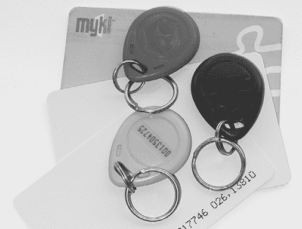
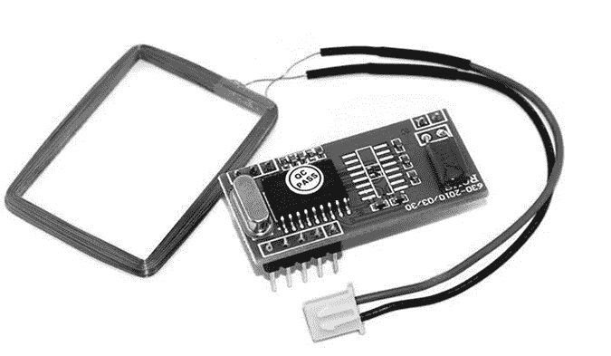
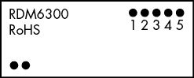
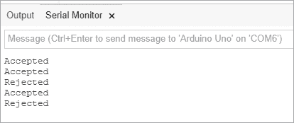
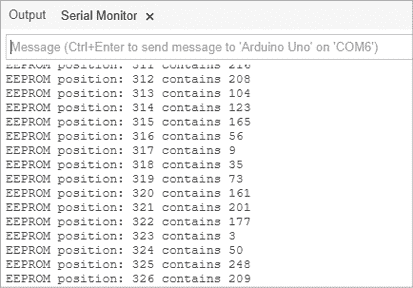

# 第十八章：读取 RFID 标签

在本章中，你将

+   学习如何用 Arduino 实现 RFID 读卡器

+   查看如何将变量保存在 Arduino EEPROM 中

+   设计基于 Arduino 的 RFID 访问控制系统框架

*射频识别（RFID）* 是一种无线系统，通过电磁场将数据从一个物体传输到另一个物体，两个物体之间无需接触。你可以构建一个 Arduino，读取常见的 RFID 标签和卡片，用于创建访问控制系统和控制数字输出。你可能曾经使用过 RFID 卡，比如用于解锁门的访问卡，或者在公交车上刷的公共交通卡。图 18-1 展示了一些 RFID 标签和卡片的示例。



图 18-1：RFID 设备示例

## RFID 设备内部

RFID 标签内部有一个微小的集成电路，带有内存，可以被专门的读卡器访问。大多数标签内部没有电池；相反，RFID 读卡器中的线圈天线会广播一束电磁能量到标签。标签吸收这些能量并用它为自己的电路提供动力，从而向 RFID 读卡器广播响应。图 18-2 展示了我们在本章中使用的 RFID 读卡器的天线线圈。



图 18-2：我们的 RFID 读卡器

本章使用的读卡器来自 PMD Way（部件号 113990014）。它便宜且易于使用，工作频率为 125 kHz；确保购买两个或更多匹配该频率的 RFID 标签，例如可以在[`pmdway.com/collections/rfid-tags/`](https://pmdway.com/collections/rfid-tags/)找到的标签。

## 测试硬件

在本节中，你将连接 RFID 读卡器到 Arduino。然后，你将通过一个简单的示例程序来测试其是否正常工作，该程序读取 RFID 卡并将数据发送到串行监视器。为了避免 PC 和 Arduino 之间串行端口的冲突，RFID 将连接到其他数字引脚，并使用 SoftwareSerial，就像我们在第十五章中对 GPS 接收模块所做的那样。

### 原理图

图 18-3 显示了 RFID 模块连接的示意图，视图来自模块的顶部。



图 18-3：RFID 模块连接图

### 测试原理图

要建立 RFID 读卡器与 Arduino 之间的连接，请按照以下步骤操作，使用母对公跳线：

1.  将随附的线圈插头连接到 RFID 读卡器板底左侧的天线引脚。这些引脚没有极性，可以任意连接。

1.  将读卡器的 GND（引脚 2）连接到 Arduino 的 GND。

1.  将读卡器的 5V（引脚 1）连接到 Arduino 的 5V。

1.  将读卡器的 RX（引脚 4）连接到 Arduino 的 D3 引脚。

1.  将读卡器的 TX（引脚 5）连接到 Arduino 的 D2 引脚。

### 测试示例

输入并上传清单 18-1。

```
// Listing 18-1
#include <SoftwareSerial.h>
SoftwareSerial Serial2(2, 3); 
int data1 = 0;
void setup(){ Serial.begin(9600); Serial2.begin(9600);
}
void loop() 
{ if (Serial2.available() > 0) { data1 = Serial2.read(); // display incoming number Serial.print(" "); Serial.print(data1, DEC); }
```

清单 18-1：RFID 测试示例

### 显示 RFID 标签 ID 号

打开串口监视器窗口，将 RFID 标签在天线前摆动。结果应该类似于图 18-4。


图 18-4：Listing 18-1 的示例输出

注意，串口监视器窗口中显示了 14 个数字。这些数字共同构成了 RFID 标签的唯一 ID 号，我们将在未来的草图中使用它来识别被读取的标签。扫描你所有的 RFID 标签并记录它们的 ID 号，因为你将在接下来的几个项目中需要它们。

## 项目#52：创建一个简单的 RFID 控制系统

现在，让我们将 RFID 系统投入使用。在这个项目中，你将学习如何在读取到两个正确 RFID 标签之一时触发一个 Arduino 事件。草图会存储两个 RFID 标签编号；当一个 ID 与其中之一匹配的卡片被读取时，它会在串口监视器中显示*接受*。如果读取到一个 ID 不匹配存储 ID 的卡片，则串口监视器会显示*拒绝*。我们将以此为基础，向现有项目中添加 RFID 控制功能。

### 草图

输入并上传以下草图。然而，在第 1 和第 2 行，将数组中的`x`替换为你在上一节中记录的两个 RFID 标签的数字。（我们在第六章讨论过数组。）

```
// Project 52 – Creating a Simple RFID Control System
#include <SoftwareSerial.h>
SoftwareSerial Serial2(2, 3);
int data1 = 0;
int ok = -1;
// use Listing 18-1 to find your tags' numbers1 int tag1[14] = {*x*, *x*, *x*, *x*, *x*, *x*, *x*, *x*, *x*, *x*, *x*, *x*, *x*, *x*};2 int tag2[14] = {*x*, *x*, *x*, *x*, *x*, *x*, *x*, *x*, *x*, *x*, *x*, *x*, *x*, *x*};
int newtag[14] = {0, 0, 0, 0, 0, 0, 0, 0, 0, 0, 0, 0, 0, 0};
// used for read comparisons3 boolean comparetag(int aa[14], int bb[14])
{ boolean ff = false; int fg = 0; for (int cc = 0 ; cc < 14 ; cc++) { if (aa[cc] == bb[cc]) { fg++; } } if (fg == 14) { ff = true; } return ff;
}4 void checkmytags() // compares each tag against the tag just read
{ ok = 0;          // This variable supports decision making. // If it is 1, we have a match; 0 is a read but no match, // -1 is no read attempt made. if (comparetag(newtag, tag1) == true) {5     ok++; } if (comparetag(newtag, tag2) == true) {6     ok++; }
}
void setup(){ Serial.begin(9600); Serial2.begin(9600); Serial2.flush(); // need to flush serial buffer // otherwise first read may not be correct
}
void loop()
{ ok = -1; if (Serial2.available() > 0)     // if a read has been attempted { // read the incoming number on serial RX delay(100); // needed to allow time for the data // to come in from the serial buffer7     for (int z = 0 ; z < 14 ; z++) // read the rest of the tag { data1 = Serial2.read(); newtag[z] = data1; } Serial2.flush(); // stops multiple reads // now to match tags up8     checkmytags(); }9   // now do something based on tag type if (ok > 0)        // if we had a match { Serial.println("Accepted"); ok = -1; } else if (ok == 0)  // if we didn't have a match { Serial.println("Rejected"); ok = -1; }
}
```

### 理解草图

当一个标签出现在 RFID 读取器前时，它会通过串口发送标签的数字，这些数字共同构成了标签的 ID 号。我们捕获这 14 个数字，并将它们存储在第 7 行的`newtag[]`数组中。接着，使用第 4 和第 8 行的`checkmytags()`函数将标签 ID 与第 1 和第 2 行存储的两个标签 ID 进行比较，实际的标签数组比较由第 3 行的`comparetag()`函数执行。

`comparetag()`函数接受两个数字数组作为参数，并返回（布尔值）数组是否相同（`true`）或不同（`false`）。如果匹配成功，变量`ok`将在 5 和 6 行被设置为`1`。最后，在第 9 行，我们有读取标签成功后要执行的操作。

上传草图后，打开串口监视器窗口，并将一些标签呈现给读取器。结果应类似于图 18-5。



图 18-5：项目 52 的结果

## 将数据存储在 Arduino 的内建 EEPROM 中

当你在 Arduino 草图中定义并使用一个变量时，存储的数据只会持续到 Arduino 重置或断电为止。但如果你想在未来使用这些值，比如在第十一章中提到的用户可更改的数字键盘密码，怎么办呢？这时就需要使用*EEPROM（电可擦写只读存储器）*了。EEPROM 将变量存储在 ATmega328 微控制器内部的内存中，而且在断电时，存储的值不会丢失。

Arduino 中的 EEPROM 可以在编号为 0 到 1,023 的位置存储 1,024 字节的变量。回想一下，一个字节可以存储一个值介于 0 和 255 之间的整数，你就能明白它为何非常适合存储 RFID 标签号码。为了在草图中使用 EEPROM，我们首先通过以下代码调用 EEPROM 库（该库已包含在 Arduino IDE 中）：

```
#include <EEPROM.h>
```

然后，要将值写入 EEPROM，我们只需使用以下代码：

```
EEPROM.write(*a*, *b*);
```

在这里，`a` 是 EEPROM 存储信息的位置，而 `b` 是存储我们希望存储在位置 `a` 的信息的变量。

为了从 EEPROM 检索数据，我们使用这个函数：

```
*value* = EEPROM.read*(position)*; 
```

这将把存储在 EEPROM 位置编号为 `position` 的数据存储到变量 `value` 中。

### 读取和写入到 EEPROM

下面是一个读取和写入 EEPROM 的示例。输入并上传 列表 18-2。

```
// Listing 18-2
#include <EEPROM.h>
int zz;
void setup()
{ Serial.begin(9600); randomSeed(analogRead(0));
}
void loop()
{ Serial.println("Writing random numbers..."); for (int i = 0; i < 1024; i++)  { zz = random(255);1     EEPROM.write(i, zz);  } Serial.println(); for (int a = 0; a < 1024; a++) {2     zz = EEPROM.read(a);  Serial.print("EEPROM position: "); Serial.print(a); Serial.print(" contains ");3     Serial.println(zz);  delay(25); }
}
```

列表 18-2：EEPROM 演示草图

在 1 处的循环中，一个介于 0 和 255 之间的随机数被存储在每个 EEPROM 位置中。存储的值会在 2 处的第二个循环中被检索，并显示在 3 处的串口监视器中。

一旦草图上传完成，打开串口监视器。你应该能看到类似于 图 18-6 的内容。



图 18-6：来自 列表 18-2 的示例输出

现在你可以开始使用 EEPROM 创建一个项目了。

## 项目 #53：创建带有“最后操作”记忆的 RFID 控制

尽管项目 52 展示了如何使用 RFID 控制某些设备，比如灯光或电动门锁，但我们不得不假设如果系统重置或断电，什么都不会被记住。例如，如果灯开着，电源断了，那么电源恢复后灯会熄灭。然而，你可能希望 Arduino 记住电源断开前的状态，并恢复到那个状态。让我们现在来解决这个问题。

在这个项目中，最后的操作将被存储在 EEPROM 中（例如，“已锁定”或“已解锁”）。当草图因断电或 Arduino 重置而重新启动时，系统将恢复到存储在 EEPROM 中的先前状态。

### 草图

输入并上传以下草图。像项目 52 一样，将数组 1 和 2 中的每个 `x` 替换为你两个 RFID 标签的号码。

```
// Project 53 – Creating an RFID Control with "Last Action" Memory
#include <SoftwareSerial.h>
SoftwareSerial Serial2(2, 3);
#include <EEPROM.h>
int data1 = 0;
int ok = -1;
int lockStatus = 0;
// use Listing 18-1 to find your tags' numbers1 int tag1[14] = { *x*, *x*, *x*, *x*, *x*, *x*, *x*, *x*, *x*, *x*, *x*, *x*, *x*, *x*
};2 int tag2[14] = { *x*, *x*, *x*, *x*, *x*, *x*, *x*, *x*, *x*, *x*, *x*, *x*, *x*, *x*
};int newtag[14] = { 0, 0, 0, 0, 0, 0, 0, 0, 0, 0, 0, 0, 0, 0
}; // used for read comparisons
// comparetag compares two arrays and returns true if identical
// this is good for comparing tags
boolean comparetag(int aa[14], int bb[14])
{ boolean ff = false; int fg = 0; for (int cc = 0; cc < 14; cc++) { if (aa[cc] == bb[cc]) { fg++; } } if (fg == 14) { ff = true; } return ff;
}
void checkmytags()
// compares each tag against the tag just read
{ ok = 0; if (comparetag(newtag, tag1) == true) { ok++; } if (comparetag(newtag, tag2) == true) { ok++; }
}3 void checkLock()
{ Serial.print("System Status after restart "); lockStatus = EEPROM.read(0); if (lockStatus == 1) { Serial.println("- locked"); digitalWrite(13, HIGH); } if (lockStatus == 0) { Serial.println("- unlocked"); digitalWrite(13, LOW); } if ((lockStatus != 1) && (lockStatus != 0)) { Serial.println("EEPROM fault - Replace Arduino hardware"); }
}
void setup()
{ Serial.begin(9600); Serial2.begin(9600); Serial2.flush(); // need to flush serial buffer pinMode(13, OUTPUT);4   checkLock();
}
void loop()
{ ok = -1; if (Serial2.available() > 0)   // if a read has been attempted { // read the incoming number on serial RX delay(100); for (int z = 0; z < 14; z++) // read the rest of the tag { data1 = Serial2.read(); newtag[z] = data1; } Serial2.flush();             // prevents multiple reads // now to match tags up checkmytags(); }5   if (ok > 0)                    // if we had a match { lockStatus = EEPROM.read(0); if (lockStatus == 1)         // if locked, unlock it {6       Serial.println("Status - unlocked"); digitalWrite(13, LOW); EEPROM.write(0, 0); } if (lockStatus == 0) {7       Serial.println("Status - locked"); digitalWrite(13, HIGH); EEPROM.write(0, 1); } if ((lockStatus != 1) && (lockStatus != 0)) {8       Serial.println("EEPROM fault - Replace Arduino hardware"); } } else if (ok == 0)              // if we didn't have a match { Serial.println("Incorrect tag"); ok = -1; } delay(500);
}
```

### 理解草图

这个草图是项目 52 的修改版。我们使用板载 LED 来模拟我们希望在每次读取一个有效 RFID ID 标签时开启或关闭的设备状态。每次读取并匹配标签后，锁的状态会在 5 处改变。我们将锁的状态存储在 EEPROM 的第一个位置。这个状态由一个数字表示：`0` 表示解锁，`1` 表示锁定。每次成功读取标签后，状态会在 6 或 7 处发生变化（从锁定到解锁，再回到锁定）。

我们还引入了一个故障保护机制，以防 EEPROM 损坏。如果读取 EEPROM 返回的值不是 `0` 或 `1`，我们将在 8 处收到通知。此外，当草图在重置后重新启动时，使用 `checkLock()` 函数在 1、2、3 和 4 处检查状态，该函数读取 EEPROM 值，确定最后的状态，然后将锁设置为该状态（锁定或解锁）。

## 展望未来

再次说明，我们使用了一块 Arduino 板来简单地重现可能是一个非常复杂的项目。现在你有了一个基础，可以将 RFID 控制添加到你的项目中，这将允许你通过刷 RFID 卡来创建专业级的访问系统并控制数字输出。我们将在第二十章重新访问 RFID 时再次演示这一点。
