# 第十九章：数据总线

在本章中，您将

+   了解 I²C 总线

+   了解如何在 I²C 总线上使用 EEPROM 和端口扩展器

+   了解 SPI 总线

+   了解如何在 SPI 总线上使用数字电位器

Arduino 通过*数据总线*与其他设备进行通信，数据总线是一种连接系统，允许两个或多个设备按顺序交换数据。数据总线可以为 Arduino 和各种传感器、I/O 扩展设备以及其他组件之间提供连接。

大多数 Arduino 使用的两个主要总线是*串行外设接口（SPI）*总线和*集成电路互联（I²C）*总线。许多有用的传感器和外部设备都使用这些总线进行通信。

## I²C 总线

I²C 总线，也称为*双线接口（TWI）*总线，是一种简单易用的数据总线。数据通过两根线在设备和 Arduino 之间传输，这两根线分别是*SDA*（数据线）和*SCL*（时钟线）。在 Arduino Uno 中，SDA 引脚是 A4，SCL 引脚是 A5，如图 19-1 所示。

一些较新的 R3 板还在左上角有专用的 I²C 引脚，便于访问，如图 19-2 所示。如果使用这两个引脚，您不能将 A4 和 A5 引脚用于其他用途。

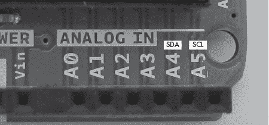

图 19-1：Arduino Uno 上的 I²C 总线连接器

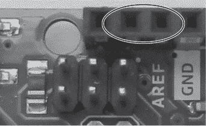

图 19-2：额外专用的 I²C 引脚

由于用于重新编程 USB 接口微控制器的六个引脚占用了通常用于引脚标签的位置，您可以在 Arduino 的背面看到标签，如图 19-3 所示。

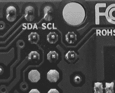

图 19-3：额外专用 I²C 引脚的标签

在 I²C 总线上，Arduino 是*主设备*，总线上每个 IC 都是*从设备*。每个从设备都有自己的地址，这是一个十六进制数字，允许 Arduino 寻址并与每个设备通信。每个设备通常有一系列 7 位 I²C 总线地址可供选择，详细信息可以在制造商的数据表中找到。具体可用的地址由 IC 引脚的连接方式决定。

要使用 I²C 总线，您需要使用 Wire 库（Arduino IDE 中包含的库）：

```
#include <Wire.h> 
```

接下来，在`void setup()`中，使用以下代码激活总线：

```
Wire.begin();
```

数据通过总线一次传输 1 字节。为了从 Arduino 向总线上某个设备发送一个字节的数据，需要三个函数：

1.  第一个函数通过以下代码行启动通信（其中`address`是次设备的总线地址，采用十六进制格式——例如`0x50`）：

    ```
    Wire.beginTransmission(`address`); 
    ```

1.  第二个函数将 1 字节数据从 Arduino 发送到前一个函数中所指定的设备（其中`data`是包含 1 字节数据的变量；您可以发送多个字节，但每个字节都需要使用一次`Wire.write()`调用）：

    ```
    Wire.write(`data`);
    ```

1.  最后，一旦完成向特定设备发送数据，使用此命令结束传输：

    ```
    Wire.endTransmission();
    ```

要请求将数据从 I²C 设备发送到 Arduino，首先使用 `Wire.beginTransmission(``address``)`，然后是以下代码（其中 `x` 是要请求的字节数）：

```
Wire.requestFrom(`address`,`x`);
```

接下来，使用以下函数将每个传入的字节存储到变量中：

```
incoming = Wire.read(); // incoming is the variable receiving the byte of data
```

然后使用 `Wire.endTransmission()` 完成事务。我们将在下一个项目中使用这些功能。

## 项目 #54：使用外部 EEPROM

在第十八章中，我们使用了 Arduino 内部的 EEPROM 来防止由于板重置或断电导致的变量数据丢失。Arduino 内部的 EEPROM 只存储 1,024 字节的数据。为了存储更多的数据，你可以使用外部 EEPROM，如本项目所示。

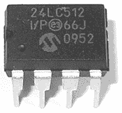

图 19-4：Microchip Technology 的 24LC512 EEPROM

对于我们的外部 EEPROM，我们将使用 Microchip Technology 的 24LC512 EEPROM，它可以存储 64KB（65,536 字节）的数据（图 19-4）。它可以从像 Digi-Key（零件号 24LC512-I/P-ND）和 PMD Way（零件号 24LC512A）等零售商处购买。

### 硬件

以下是创建此项目所需的材料：

+   Arduino 和 USB 电缆

+   一个 Microchip Technology 24LC512 EEPROM

+   一个面包板

+   两个 4.7 kΩ 电阻

+   一个 100 nF 陶瓷电容

+   各种连接线

### 原理图

对于电路，将一个 4.7 kΩ 电阻连接在 5 V 和 SCL 之间，另一个连接在 5 V 和 SDA 之间，如 图 19-5 所示。

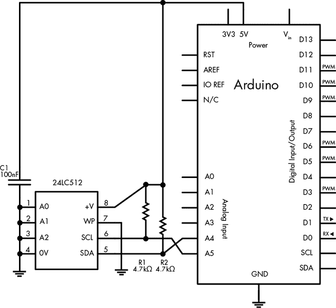

图 19-5：项目 54 的原理图

24LC512 EEPROM IC 的总线地址部分由它在电路中的连接方式决定。总线地址的最后 3 位由 A2、A1 和 A0 引脚的状态决定。当这些引脚连接到 GND 时，它们的值为 `0`；当它们连接到 5 V 时，它们的值为 `1`。

前 4 位预设为 `1010`。因此，在我们的电路中，由于 A0、A1 和 A2 直接连接到 GND，总线地址在二进制中表示为 `1010000`，即十六进制表示为 `0x50`。这意味着我们可以在草图中使用 `0x50` 作为总线地址。

### 草图

虽然我们的外部 EEPROM 可以存储最多 64KB 的数据，但我们的草图仅用于演示它的部分功能，因此我们只会在 EEPROM 的前 20 个存储位置存储和读取字节。

输入并上传以下草图：

```
// Project 54 - Using an External EEPROM1 #include <Wire.h> 
#define chip1 0x50
byte d=0;
void setup()
{2   Serial.begin(9600);   Wire.begin(); 
}
void writeData(int device, unsigned int address, byte data) 
// writes a byte of data 'data' to the EEPROM at I2C address 'device'
// in memory location 'address'
{3   Wire.beginTransmission(device);  Wire.write((byte)(address >> 8));   // left part of pointer address Wire.write((byte)(address & 0xFF)); // and the right Wire.write(data); Wire.endTransmission(); delay(10);
}4 byte readData(int device, unsigned int address) 
// reads a byte of data from memory location 'address' 
// in chip at I2C address 'device' 
{ byte result;  // returned value Wire.beginTransmission(device); Wire.write((byte)(address >> 8));   // left part of pointer address Wire.write((byte)(address & 0xFF)); // and the right Wire.endTransmission();5   Wire.requestFrom(device,1);  result = Wire.read(); return result; // and return it as a result of the function readData
}
void loop()
{ Serial.println("Writing data..."); for (int a=0; a<20; a++) { writeData(chip1,a,a); } Serial.println("Reading data..."); for (int a=0; a<20; a++) { Serial.print("EEPROM position "); Serial.print(a); Serial.print(" holds "); d=readData(chip1,a); Serial.println(d, DEC); }
}
```

让我们来一步步分析草图。在 1 处，我们激活库并定义 EEPROM 的 I²C 总线地址为 `chip1`。在 2 处，我们启动串口监视器，然后启动 I²C 总线。包括两个自定义函数 `writeData()` 和 `readData()`，它们可以节省你的时间，并为将来使用该 EEPROM IC 提供一些可重复使用的代码。我们将分别使用它们来写入和读取数据。

`writeData()`函数在第 3 步启动与 EEPROM 的传输，使用接下来的两个`Wire.write()`函数调用发送存储数据字节的 EEPROM 地址，发送要写入的字节数据，然后结束传输。

`readData()`函数在第 4 步以与`writeData()`相同的方式操作 I²C 总线。然而，它首先设置要读取的地址，然后不是向 EEPROM 发送数据字节，而是使用`Wire.requestFrom()`来读取第 5 步中的数据。最后，从 EEPROM 发送的数据字节被接收到变量`result`中，并成为函数的返回值。

### 运行草图

在`void loop()`中，草图循环执行 20 次，每次写入一个值到 EEPROM 中。然后它再循环一次，检索这些值并在串口监视器中显示，如图 19-6 所示。

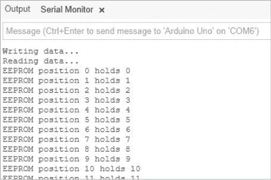

图 19-6：项目 54 的结果

## 项目#55：使用端口扩展器 IC

一个*端口扩展器*是另一个有用的 IC，通过 I²C 进行控制。它旨在提供更多的数字输出引脚。在这个项目中，我们将使用 Microchip Technology 的 MCP23017 16 位端口扩展器 IC（图 19-7），它有 16 个数字输出，可以增加到 Arduino 上。它可以从 Digi-Key（零件号 MCP23017-E/SP-ND）和 PMD Way（零件号 MCP23017A）等零售商购买。

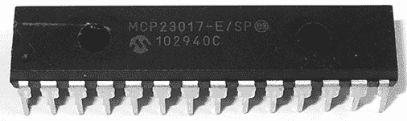

图 19-7：Microchip Technology 的 MCP23017 端口扩展器 IC

在这个项目中，我们将 MCP23017 连接到 Arduino，并演示如何使用 Arduino 控制 16 个端口扩展器输出。每个端口扩展器的输出都可以像常规的 Arduino 数字输出一样使用。

### 硬件

创建这个项目所需的材料：

+   Arduino 和 USB 电缆

+   一个面包板

+   各种连接电线

+   一颗 Microchip Technology 的 MCP20317 端口扩展器 IC

+   两个 4.7 kΩ的电阻

+   （可选）相同数量的 560 Ω电阻和 LED

### 电路图

图 19-8 展示了 MCP23017 的基本电路图。与项目 54 中的 EEPROM 一样，我们可以通过特定的接线顺序来设置 I²C 总线地址。在 MCP23017 中，我们将引脚 15 到 17 连接到 GND，将地址设置为`0x20`。

在使用 MCP23017 时，查看 IC 数据手册中的引脚图非常有帮助，如图 19-9 所示。请注意，16 个输出被分成两个部分：右侧为 GPA7 到 GPA0，左侧为 GPB0 到 GPB7。我们将通过 560 Ω的电阻将 LED 连接到某些或所有的输出端，以演示输出端何时被激活。

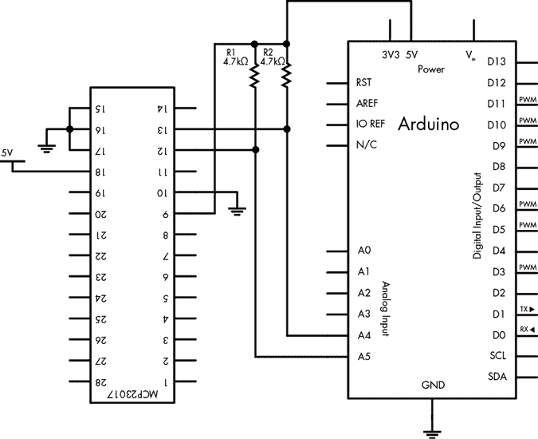

图 19-8：项目 55 的电路图

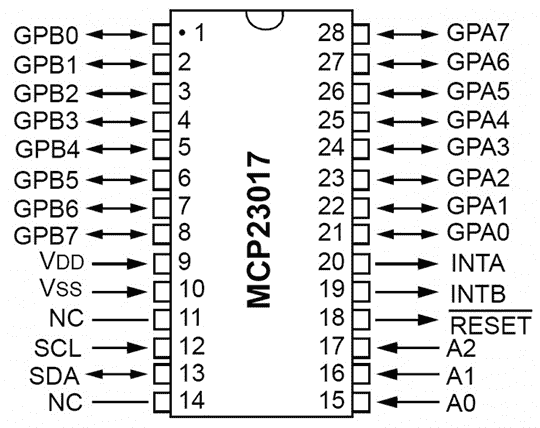

图 19-9：MCP23017 的引脚图

### 草图

输入并上传以下草图：

```
// Project 55 - Using a Port Expander IC
#include "Wire.h"
#define mcp23017 0x20
void setup()
{1   Wire.begin();     // activate I2C bus // set up MCP23017  // set I/O pins to outputs Wire.beginTransmission(mcp23017); Wire.write(0x00); // IODIRA register Wire.write(0x00); // set all of bank A to outputs Wire.write(0x00); // set all of bank B to outputs2   Wire.endTransmission(); 
}
void loop()
{ Wire.beginTransmission(mcp23017); Wire.write(0x12); 3     Wire.write(255);    // bank A4     Wire.write(255);    // bank B Wire.endTransmission(); delay(1000);  Wire.beginTransmission(mcp23017); Wire.write(0x12);  Wire.write(0);      // bank A Wire.write(0);      // bank B Wire.endTransmission(); delay(1000);
}
```

要使用 MCP23017，我们需要在 `void setup()` 中列出的第 1 行到第 2 行。为了开启或关闭每个银行的输出，我们按顺序发送 1 字节代表每个银行；也就是说，我们首先发送代表 GPA0 到 GPA7 的值，然后发送代表 GPB0 到 GPB7 的值。

在设置单个引脚时，你可以将每个银行看作一个二进制数字（如第六章第 104 页的“二进制简明教程”所解释）。因此，要打开引脚 1 到 4，你将发送二进制数 `11110000`（十进制为 `240`），并将其插入到 `Wire.write()` 函数中，分别用于银行 GPA0 到 GPA7 或 GPB0 到 GPB7。

数百个设备使用 I²C 总线进行通信。现在你已经了解了如何使用这条总线的基本知识，你可以使用任何这些设备与 Arduino 板进行连接。

## SPI 总线

SPI 总线与 I²C 总线的不同之处在于，它可以同时向设备发送和接收数据，并且可以根据所使用的微控制器以不同的速度进行传输。通信模式仍然是主/从：Arduino 作为主设备，决定与哪个从设备进行通信。

### 引脚连接

每个 SPI 设备使用四个引脚与主设备进行通信：*MOSI*（主设备输出，次设备输入）、*MISO*（主设备输入，次设备输出）、*SCK*（串行时钟）和 *SS* 或 *CS*（次设备选择或芯片选择）。这些 SPI 引脚按照 图 19-10 中所示的方式连接到 Arduino。


图 19-10：Arduino Uno 上的 SPI 引脚

如 图 19-11 所示，典型的 Arduino 到 SPI 设备连接。Arduino 的 D11 到 D13 引脚保留给 SPI，但 SS 引脚可以使用任何其他数字引脚（通常使用 D10，因为它靠近 SPI 引脚）。

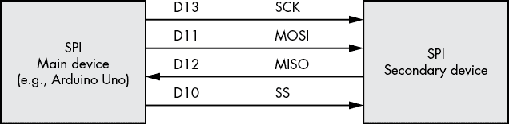

图 19-11：典型的 Arduino 到 SPI 设备连接

### 实现 SPI

现在让我们看看如何在草图中实现 SPI 总线。在此之前，我们先回顾一下所用到的函数。首先，包含 SPI 库（随 Arduino IDE 软件一起提供）：

```
#include "SPI.h" 
```

接下来，你需要选择一个引脚作为 SS 引脚，并在 `void setup()` 中将其设置为数字输出。由于在我们的示例中仅使用一个 SPI 设备，我们将使用 D10 并首先将其设置为 `HIGH`，因为大多数 SPI 设备的 SS 引脚是“低有效”（这意味着将引脚连接到 GND 就会设置为 `HIGH`，反之亦然）：

```
pinMode(10, OUTPUT);
digitalWrite(10, HIGH);
```

这是激活 SPI 总线的函数：

```
SPI.begin(); 
```

最后，我们需要告诉草图如何发送和接收数据。一些 SPI 设备要求先发送最高有效位（MSB），而一些设备要求最低有效位（LSB）先发送。（关于 MSB 的更多内容，请参见第六章的“二进制简明教程”）。因此，在 `void setup()` 中，我们在 `SPI.begin()` 后使用以下函数：

```
SPI.setBitOrder(`order`);
```

这里，`order` 是 `MSBFIRST` 或 `MSBLAST`。

### 向 SPI 设备发送数据

要向 SPI 设备发送数据，首先我们将 SS 引脚设置为 `LOW`，这告诉 SPI 设备主设备（Arduino）想要与它通信。接下来，我们通过以下代码行向设备发送字节数据，按需重复——即，每发送一个字节时都使用此代码：

```
SPI.transfer*(byte)*;
```

在与设备通信完成后，将 SS 引脚设置为 `HIGH`，告诉设备 Arduino 已经与其通信完成。

每个 SPI 设备需要一个独立的 SS 引脚。例如，如果你有两个 SPI 设备，第二个 SPI 设备的 SS 引脚可以是 D9，并按照 图 19-12 所示连接到 Arduino。

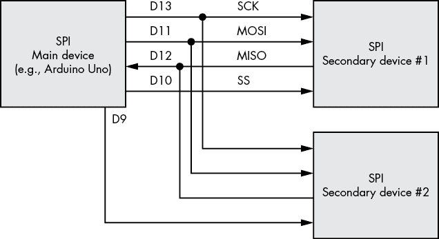

图 19-12：两个 SPI 设备连接到一个 Arduino

与第二个设备 #2 通信时，你需要使用 D9（而不是 D10）SS 引脚，通信前后均需如此。

项目 56 演示了如何使用 SPI 总线与数字电位器进行通信。

## 项目 #56：使用数字电位器

简单来说，*电位器* 设备类似于我们在第四章中研究的可调电阻，但电位器有两个引脚：一个用于滑片，一个用于回流电流。在本项目中，你将使用数字电位器在草图中设置电阻，而不是亲自转动电位器旋钮或轴。电位器通常是音频设备中音量控制的基础，这些设备使用按钮而不是旋钮，例如汽车音响。电位器的公差比普通固定电阻的公差要大——在某些情况下，大约大 20%。

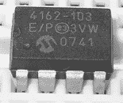

图 19-13：Microchip Technology 的 MCP4162 数字电位器

对于项目 56，我们将使用 图 19-13 中显示的 Microchip Technology MCP4162。MCP4162 提供多种电阻值；此示例使用 10 kΩ 版本。它可从 Digi-Key（零件号 MCP4162-103E/P-ND）和 element14（零件号 1840698）等零售商处购买。电阻值可以通过 257 个步骤调整；每个步骤的电阻约为 40 Ω。要选择特定步骤，我们将 2 字节的数据发送到命令字节（值为 0）和数值字节（值介于 0 和 256 之间）。MCP4162 使用非易失性存储器，因此当断电并重新连接电源后，最后选择的值仍然有效。

我们将使用电位器控制 LED 的亮度。

### 硬件

以下是完成此项目所需的内容：

+   Arduino 和 USB 数据线

+   一块面包板

+   各种连接电线

+   一只 Microchip Technology MCP4162 数字电位器

+   一只 560 Ω 电阻

+   一只 LED

### 电路图

图 19-14 显示了电路图。MCP4162 的引脚编号从封装的左上角开始。引脚 1 由位于 IC 上 Microchip 标志左侧的凹点表示（见 图 19-13）。

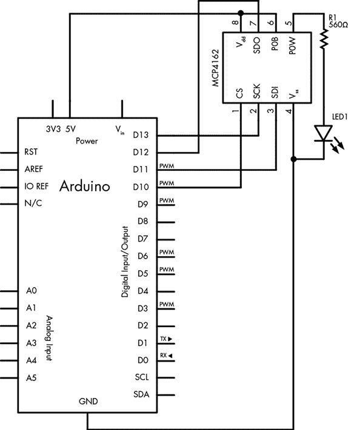

图 19-14：项目 56 的电路图

### 草图

输入并上传以下草图：

```
// Project 56 - Using a Digital Rheostat1 #include "SPI.h" // necessary library
int ss=10;       // using digital pin 10 for SPI secondary select
int del=200;     // used for delaying the steps between LED brightness values
void setup()
{2   SPI.begin();   pinMode(ss, OUTPUT);    // we use this for the SS pin digitalWrite(ss, HIGH); // the SS pin is active low, so set it up high first3   SPI.setBitOrder(MSBFIRST);   // our MCP4162 requires data to be sent MSB (most significant byte) first
}4 void setValue(int value) 
{ digitalWrite(ss, LOW); SPI.transfer(0);     // send the command byte SPI.transfer(value); // send the value (0 to 255) digitalWrite(ss, HIGH);
}
void loop()
{5   for (int a=0; a<256; a++)   { setValue(a); delay(del); }6   for (int a=255; a>=0; a--)  { setValue(a); delay(del); }
}
```

让我们来一步步解析代码。首先，我们在 1 和 2 设置 SPI 总线。在 3 处，我们设置字节方向以适配 MPC4162。为了简化电阻设置，我们在 4 处使用自定义函数，该函数接受电阻步长（从 0 到 255）并将其传递给 MCP4162。最后，代码使用两个循环将电位器通过所有阶段，从 0 到最大值在 5 处，再从最大值回到 0 在 6 处。最后这段代码应该使 LED 的亮度增减，随程序运行时 LED 的亮度不断变化。

## 展望未来

在本章中，你了解并实验了两种重要的 Arduino 通信方法。现在你已经准备好将 Arduino 与各种传感器、更高级的组件以及其他市面上出现的设备进行连接。其中，今天最流行的组件之一是实时时钟集成电路（IC），它让你的项目能够保持时间并与之交互——这也是第二十章的主题。那么，开始吧！
