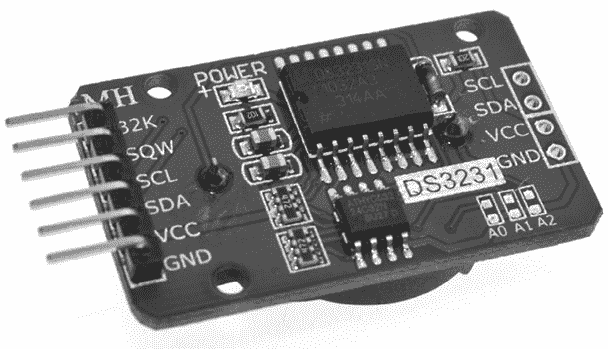
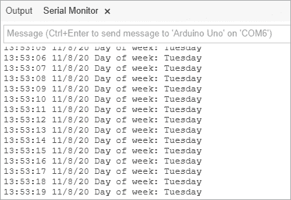
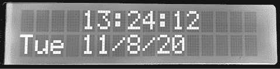
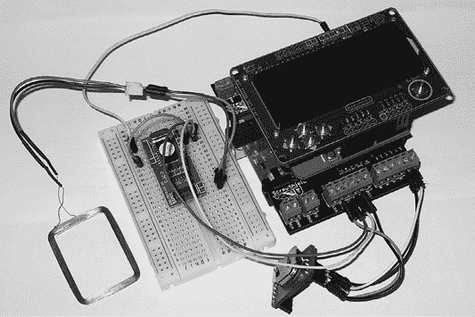
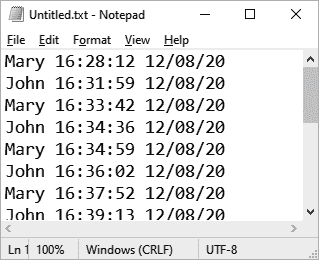

# 第二十章：实时钟

在本章中，你将

+   设置并获取实时钟模块的时间和日期

+   探索将设备连接到 Arduino 的新方法

+   创建一个数字时钟

+   构建一个员工 RFID 打卡机

一个*实时钟（RTC）* IC 模块是一个小型的计时设备，为 Arduino 项目提供了各种可能性。一旦设置了当前的时间和日期，RTC 可以在请求时提供准确的时间和日期数据。

市场上有许多不同的 RTC IC，有些比其他的更精确。在本章中，我们将使用 Maxim DS3231；它除了备用电池外不需要任何外部电路，而且在模块形式下非常精确且相当稳健。DS3231 可以作为 breakout 板从各种零售商处购买，包括来自 PMD Way（零件号 883422）的版本，如图 20-1 所示。



图 20-1：一个实时钟 IC 模块

## 连接 RTC 模块

将 RTC 模块连接到 Arduino 很简单，因为它使用 I²C 总线（在第十九章中讨论过）。你只需要四根电线：GND 和 VCC 分别连接到 Arduino 的 GND 和 5 V；SDA 和 SCL 分别连接到 Arduino 的 A4 和 A5。我们的示例中不会使用其他引脚。由于模块的设计，I²C 总线上无需额外的上拉电阻。

为了方便起见，可以考虑将模块安装在一个空白的 ProtoShield 上，这样它可以轻松地与其他硬件集成用于其他项目。并确保已安装备用电池，否则当你关闭项目时，时间数据将丢失！

## 项目 #57：使用 RTC 添加并显示时间和日期

在这个项目中，你将学习如何设置 RTC 的时间和日期，然后从串口监视器中检索并显示它们。时间和日期信息对于各种项目都很有用，例如温度记录仪和闹钟。

### 硬件

这是你完成这个项目所需的材料：

+   Arduino 和 USB 电缆

+   各种连接电线

+   一颗 CR2032 电池（如果 DS3231 模块中未包含）

+   一块 Maxim DS3231 RTC 模块

### 草图

按照本章之前的描述将模块连接到 Arduino，然后输入但*不要上传*以下草图：

```
// Project 57 - Adding and Displaying Time and Date with an RTC1 #include "Wire.h" 
#define DS3231_I2C_ADDRESS 0x68 
// Convert normal decimal numbers to binary coded decimal2 byte decToBcd(byte val) 
{ return( (val/10*16) + (val%10) );
}
// Convert binary coded decimal to normal decimal numbers
byte bcdToDec(byte val) 
{ return( (val/16*10) + (val%16) );
}3 void setDS3231time(byte second, byte minute, byte hour, byte dayOfWeek, byte
dayOfMonth, byte month, byte year) 
{ // sets time and date data in the DS3231 Wire.beginTransmission(DS3231_I2C_ADDRESS);   Wire.write(0); // set next input to start at the seconds register Wire.write(decToBcd(second));     // set seconds Wire.write(decToBcd(minute));     // set minutes Wire.write(decToBcd(hour));       // set hours Wire.write(decToBcd(dayOfWeek));  // set day of week (1=Sunday, 7=Saturday) Wire.write(decToBcd(dayOfMonth)); // set date (1 to 31) Wire.write(decToBcd(month));      // set month Wire.write(decToBcd(year));       // set year (0 to 99) Wire.endTransmission();
}4 void readDS3231time(byte *second, 
byte *minute, 
byte *hour, 
byte *dayOfWeek, 
byte *dayOfMonth, 
byte *month, 
byte *year)
{ Wire.beginTransmission(DS3231_I2C_ADDRESS); Wire.write(0); // set DS3231 register pointer to 00h Wire.endTransmission();   Wire.requestFrom(DS3231_I2C_ADDRESS, 7);  // request seven bytes of data from DS3231 starting from register 00h *second     = bcdToDec(Wire.read() & 0x7f); *minute     = bcdToDec(Wire.read()); *hour       = bcdToDec(Wire.read() & 0x3f);   *dayOfWeek  = bcdToDec(Wire.read()); *dayOfMonth = bcdToDec(Wire.read()); *month      = bcdToDec(Wire.read()); *year       = bcdToDec(Wire.read());
}
void displayTime()
{ byte second, minute, hour, dayOfWeek, dayOfMonth, month, year;   // retrieve data from DS3231 5   readDS3231time(&second, &minute, &hour, &dayOfWeek, &dayOfMonth, &month,  &year);  // send it to the Serial Monitor Serial.print(hour, DEC); // convert the byte variable to a decimal number when displayed Serial.print(":"); if (minute<10) { Serial.print("0"); } Serial.print(minute, DEC); Serial.print(":"); if (second<10) { Serial.print("0"); } Serial.print(second, DEC); Serial.print("  "); Serial.print(dayOfMonth, DEC); Serial.print("/"); Serial.print(month, DEC); Serial.print("/"); Serial.print(year, DEC); Serial.print("  Day of week: "); switch(dayOfWeek){ case 1: Serial.println("Sunday"); break; case 2: Serial.println("Monday"); break; case 3: Serial.println("Tuesday"); break; case 4: Serial.println("Wednesday"); break; case 5: Serial.println("Thursday"); break; case 6: Serial.println("Friday"); break; case 7: Serial.println("Saturday"); break; }
}
void setup()
{ Wire.begin();  Serial.begin(9600); // set the initial time here:  // DS3231 seconds, minutes, hours, day, date, month, year6   setDS3231time(0, 56, 23, 6, 30, 10, 21); 
}
void loop()
{ displayTime(); // display the real-time clock data in the Serial Monitor, delay(1000);   // every second
}
```

### 理解并运行草图

这个草图看起来可能很复杂，但其实并不难。在第 1 行，我们导入 I²C 库并在草图中将 RTC 的总线地址设置为 `0x68`。这是 DS3231 的默认总线地址，可以在数据手册中找到。在第 2 行，两个自定义函数将十进制数转换为二进制编码十进制（BCD）值并返回这些值。我们进行这些转换，因为 DS3231 存储的是 BCD 格式的值。

在第 6 行，我们使用函数 `setDS3231time()` 将时间和日期信息传递给 RTC IC，代码如下：

```
setDS3231time(`second`, `minute`, `hour`, `dayOfWeek`, `dayOfMonth`, `month`, `year`)
```

要使用此功能，只需将所需数据插入到各个参数中。`dayOfWeek`参数是一个 1 到 7 之间的数字，分别代表周日到周六。（RTC 无法检查`dayOfWeek`是否与输入的日期匹配，因此需要格外小心，确保一切对齐。）`year`信息仅为两位数字——例如，2021 年的年份应使用`21`。（20 是默认的。）你可以插入固定值（如本草图中所示）或包含参数的字节变量。

因此，要设置 RTC 中的时间，我们需要在第 3 行将当前日期和时间值输入到`setDS3231time()`函数中。现在可以上传草图了。完成一次之后，我们通过在`setDS3231time()`函数前加上`//`来注释掉该函数，然后重新上传草图，确保每次草图启动时时间不会重置为原始值！

最后，第 4 行的`readDS3231time()`函数从 RTC 中读取时间和日期，并将数据插入字节变量中。此数据在第 5 行的`displayTime()`函数中使用，该函数简单地获取数据并通过打印时间变量的内容在串行监视器中显示。

一旦上传了草图，打开串行监视器。结果应与图 20-2 中显示的类似，但它们会根据你运行草图时的当前时间和日期有所不同。



图 20-2：项目 57 的结果

你可以将项目 57 中的草图内容作为其他时间相关项目的基础。`decToBcd()`、`bcdToDec()`、`readDS3231time()`和`setDS3231time()`等函数可以插入并在未来的项目中重复使用。这就是使用 Arduino 平台的一个好处：一旦写出一个有用的过程，它通常可以在以后几乎不做修改地重复使用。

## 项目#58：创建一个简单的数字时钟

在本项目中，我们将使用项目 57 中的函数将时间和日期显示在标准字符 LCD 上，类似于第十五章项目 43 中 GPS 接收器使用的 LCD。

### 硬件

这是你需要创建这个项目的硬件：

+   Arduino 和 USB 线

+   各种连接线

+   一块面包板

+   一块 Proto-ScrewShield 或类似产品

+   一块 LCD 模块或 LCD 遮罩

+   一块实时时钟模块（在本章前面展示过）

首先，重新创建项目 57 中使用的硬件。如果你是通过接线将 RTC 模块连接到 Arduino 的，请改用 Proto-ScrewShield 与 RTC 进行连接。然后，将 LCD 遮罩插入其他遮罩上面。

### 草图

输入但*不要上传*以下草图：

```
// Project 58 - Creating a Simple Digital Clock
#include "Wire.h"1 #include <LiquidCrystal.h> 
#define DS3231_I2C_ADDRESS 0x68
LiquidCrystal lcd( 8, 9, 4, 5, 6, 7 );
// Convert normal decimal numbers to binary coded decimal
byte decToBcd(byte val)
{ return( (val/10*16) + (val%10) );
}
// Convert binary coded decimal to normal decimal numbers
byte bcdToDec(byte val)
{ return( (val/16*10) + (val%16) );
}
void setDS3231time(byte second, byte minute, byte hour, byte dayOfWeek, byte dayOfMonth, byte month, byte year)
{ // sets time and date data in the DS3231 Wire.beginTransmission(DS3231_I2C_ADDRESS);   Wire.write(0);  // set next input to start at the seconds register Wire.write(decToBcd(second));     // set seconds Wire.write(decToBcd(minute));     // set minutes Wire.write(decToBcd(hour));       // set hours Wire.write(decToBcd(dayOfWeek));  // set day of week (1=Sunday, 7=Saturday) Wire.write(decToBcd(dayOfMonth)); // set date (1 to 31) Wire.write(decToBcd(month));      // set month Wire.write(decToBcd(year));       // set year (0 to 99) Wire.endTransmission();
}
void readDS3231time(byte *second, 
byte *minute, 
byte *hour, 
byte *dayOfWeek, 
byte *dayOfMonth, 
byte *month, 
byte *year)
{ Wire.beginTransmission(DS3231_I2C_ADDRESS); Wire.write(0); // set DS3231 register pointer to 00h Wire.endTransmission();   Wire.requestFrom(DS3231_I2C_ADDRESS, 7);  // request seven bytes of data from DS3231 starting from register 00h *second     = bcdToDec(Wire.read() & 0x7f); *minute     = bcdToDec(Wire.read()); *hour       = bcdToDec(Wire.read() & 0x3f);   *dayOfWeek  = bcdToDec(Wire.read()); *dayOfMonth = bcdToDec(Wire.read()); *month      = bcdToDec(Wire.read()); *year       = bcdToDec(Wire.read());
}
void displayTime()
{ byte second, minute, hour, dayOfWeek, dayOfMonth, month, year; // retrieve data from DS3231 readDS3231time(&second, &minute, &hour, &dayOfWeek, &dayOfMonth, &month,  &year); // send the data to the LCD shield lcd.clear(); lcd.setCursor(4,0); lcd.print(hour, DEC); lcd.print(":"); if (minute<10) { lcd.print("0"); } lcd.print(minute, DEC); lcd.print(":"); if (second<10) { lcd.print("0"); } lcd.print(second, DEC); lcd.setCursor(0,1); switch(dayOfWeek){ case 1: lcd.print("Sun"); break; case 2: lcd.print("Mon"); break; case 3: lcd.print("Tue"); break; case 4: lcd.print("Wed"); break; case 5: lcd.print("Thu"); break; case 6: lcd.print("Fri"); break; case 7: lcd.print("Sat"); break; } lcd.print(" "); lcd.print(dayOfMonth, DEC); lcd.print("/"); lcd.print(month, DEC); lcd.print("/"); lcd.print(year, DEC);
}
void setup()
{ Wire.begin();2   lcd.begin(16, 2);   // set the initial time here:  // DS3231 seconds, minutes, hours, day, date, month, year3   // setDS3231time(0, 27, 0, 5, 15, 11, 20); 
}
void loop()
{ displayTime(); // display the real-time clock time on the LCD, delay(1000);   // every second
}
```

### 理解和运行草图

这个草图的操作与项目 57 类似，不同之处在于我们已经修改了 `displayTime()` 函数，使其将时间和日期数据发送到 LCD 上，而不是发送到串口监视器，并且在第 1 和第 2 步添加了 LCD 所需的设置行。（有关使用 LCD 模块的回顾，请参见第九章。）

别忘了先上传带有时间和日期数据的草图（见第 3 步），然后再上传将代码注释掉的草图。上传草图后，您的结果应该与图 20-3 所示的类似。



图 20-3：来自项目 58 的显示

现在，您已经完成了项目 57 和 58，应该已经掌握了如何在草图中读取和写入 RTC IC 的数据。接下来，您将利用所学的知识创建一个非常实用的系统。

## 项目 #59：创建一个 RFID 时钟系统

在这个项目中，我们将创建一个时钟系统。您将看到 Arduino 扩展板如何协同工作，以及 Proto-ScrewShield 如何帮助您引入没有安装在扩展板上的电子元件。这个系统可以由两个人使用，他们会被分配一个 RFID 卡或标签，当他们进入或离开某个区域（如工作场所或家庭）时，刷卡通过 RFID 读卡器。时间和卡片详细信息将被记录到 microSD 卡中，供后续分析。

我们在第十五章中介绍了如何将数据记录到 microSD 卡，如何在第十八章读取 RFID 标签，以及如何在本章前面连接 RTC 模块。现在我们将把这些部分整合在一起。

### 硬件

创建这个项目所需的材料：

+   Arduino 和 USB 电缆

+   各种连接线

+   一个实时时钟模块（在本章前面已展示）

+   一个 LCD 模块或 Freetronics LCD 扩展板

+   一个 microSD 卡扩展板和卡（来自第十五章）

+   一个 Proto-ScrewShield 或类似产品

+   一个 RFID 读卡器模块和两个标签（来自第十八章）

要组装系统，首先将 Arduino Uno 放在底部，然后添加 Proto-ScrewShield，接着将 microSD 卡扩展板放在 Proto-ScrewShield 上，再将 LCD 扩展板放在 microSD 卡扩展板上。像第十八章中所做的那样连接 RFID 读卡器，并按照本章前面描述的方式连接 RTC 模块。根据所用硬件的具体情况，组装后的外观应类似于图 20-4 所示。



图 20-4：时钟组件

### 草图

现在输入并上传以下草图。记住，在向连接了 RFID 的 Arduino 上传草图时，您需要确保移除 RFID 读卡器的 RX 引脚与 Arduino D0 引脚之间的线缆，上传成功后再重新连接。

```
// Project 59 - Creating an RFID Time-Clock System1 #include "Wire.h" // for RTC 2 #include "SD.h"   // for SD card 
#include <LiquidCrystal.h>
#define DS3231_I2C_ADDRESS 0x68 
LiquidCrystal lcd( 8, 9, 4, 5, 6, 7 );
int data1 = 0;3 // Use Listing 18-1 to find your tag numbers 
int Mary[14] = {  2, 52, 48, 48, 48, 56, 54, 67, 54, 54, 66, 54, 66, 3}; 
int John[14] = {  2, 52, 48, 48, 48, 56, 54, 66, 49, 52, 70, 51, 56, 3}; 
int newtag[14] = {  0,0,0,0,0,0,0,0,0,0,0,0,0,0}; // used for read comparisons
// Convert normal decimal numbers to binary coded decimal
byte decToBcd(byte val) 
{ return( (val/10*16) + (val%10) );
}
// Convert binary coded decimal to normal decimal numbers
byte bcdToDec(byte val) 
{ return( (val/16*10) + (val%16) );
}
void setDS3231time(byte second, byte minute, byte hour, byte dayOfWeek, byte dayOfMonth, byte month, byte year) 
{ // Sets time and date data in the DS3231 Wire.beginTransmission(DS3231_I2C_ADDRESS);   Wire.write(0);  // set next input to start at the seconds register Wire.write(decToBcd(second));     // set seconds Wire.write(decToBcd(minute));     // set minutes Wire.write(decToBcd(hour));       // set hours Wire.write(decToBcd(dayOfWeek));  // set day of week (1=Sunday, 7=Saturday) Wire.write(decToBcd(dayOfMonth)); // set date (1 to 31) Wire.write(decToBcd(month));      // set month Wire.write(decToBcd(year));       // set year (0 to 99) Wire.endTransmission();
}
void readDS3231time(byte *second, byte *minute, 
byte *hour, 
byte *dayOfWeek, 
byte *dayOfMonth, 
byte *month, 
byte *year) 
{ Wire.beginTransmission(DS3231_I2C_ADDRESS); Wire.write(0); // set DS3231 register pointer to 00h Wire.endTransmission();   Wire.requestFrom(DS3231_I2C_ADDRESS, 7);  // Request seven bytes of data from DS3231 starting from register 00h *second     = bcdToDec(Wire.read() & 0x7f); *minute     = bcdToDec(Wire.read()); *hour       = bcdToDec(Wire.read() & 0x3f);   *dayOfWeek  = bcdToDec(Wire.read()); *dayOfMonth = bcdToDec(Wire.read()); *month      = bcdToDec(Wire.read()); *year       = bcdToDec(Wire.read());
}
// Compares two arrays and returns true if identical.
// This is good for comparing tags.
boolean comparetag(int aa[14], int bb[14]) 
{ boolean ff=false; int fg=0; for (int cc=0; cc<14; cc++) { if (aa[cc]==bb[cc]) { fg++; } } if (fg==14) { ff=true;      // all 14 elements in the array match each other } return ff;
}
void wipeNewTag() 
{ for (int i=0; i<=14; i++) { newtag[i]=0; }
}
void setup()
{ Serial.flush(); // need to flush serial buffer Serial.begin(9600); Wire.begin();  lcd.begin(16, 2); // set the initial time here:  // DS3231 seconds, minutes, hours, day, date, month, year // setDS3231time(0, 27, 0, 5, 15, 11, 12);  // Check that the microSD card exists and can be used 4   if (!SD.begin(8))    { lcd.print("uSD card failure"); // stop the sketch return; } lcd.print("uSD card OK"); delay(1000); lcd.clear(); 
}
}
void loop()
{ byte second, minute, hour, dayOfWeek, dayOfMonth, month, year; if (Serial.available() > 0) // if a read has been attempted { // read the incoming number on serial RX delay(100);  // allow time for the data to come in from the serial buffer  for (int z=0; z<14; z++)  // read the rest of the tag { data1=Serial.read(); newtag[z]=data1; } Serial.flush(); // stops multiple reads // retrieve data from DS3231  readDS3231time(&second, &minute, &hour, &dayOfWeek, &dayOfMonth, &month,  &year); } // now do something based on the tag type5   if (comparetag(newtag, Mary) == true)  { lcd.print("Hello Mary "); File dataFile = SD.open("DATA.TXT", FILE_WRITE); if (dataFile)   { dataFile.print("Mary "); dataFile.print(hour); dataFile.print(":"); if (minute<10) { dataFile.print("0"); } dataFile.print(minute); dataFile.print(":"); if (second<10) { dataFile.print("0"); } dataFile.print(second); dataFile.print(" "); dataFile.print(dayOfMonth); dataFile.print("/"); dataFile.print(month); dataFile.print("/"); dataFile.print(year); dataFile.println(); dataFile.close();  } delay(1000); lcd.clear(); wipeNewTag();    } if (comparetag(newtag, John)==true)  { lcd.print("Hello John "); File dataFile = SD.open("DATA.TXT", FILE_WRITE); if (dataFile)   { dataFile.print("John ");    dataFile.print(hour); dataFile.print(":");       if (minute<10) { dataFile.print("0"); } dataFile.print(minute); dataFile.print(":");     if (second<10) { dataFile.print("0"); } dataFile.print(second); dataFile.print(" "); dataFile.print(dayOfMonth); dataFile.print("/"); dataFile.print(month); dataFile.print("/"); dataFile.print(year); dataFile.println(); dataFile.close();  } delay(1000); lcd.clear(); wipeNewTag();    }
}
```

### 理解草图

在这个草图中，系统首先等待一个 RFID 卡呈现给读卡器。如果 RFID 卡被识别，卡主的姓名、时间和日期将被附加到存储在 microSD 卡上的文本文件中。

在 1 处是 I²C 总线和实时钟所需的函数，在 2 处是设置 microSD 卡扩展板所需的代码。在 4 处，我们检查并报告 microSD 卡的状态。在 5 处，读取的卡片与存储的两个人的卡号进行比较——在这个例子中是 John 和 Mary。如果匹配，数据将被写入 microSD 卡。通过一些修改，你可以通过在 3 处现有卡号下方添加卡片的序列号，再添加像 5 处那样的比较函数，从而将更多的卡片添加到系统中。

当需要查看记录的数据时，从 microSD 卡中复制文件*data.txt*。然后使用文本编辑器查看数据，或将其导入到电子表格中进行进一步分析。数据的布局非常易于阅读，如图 20-5 所示。



图 20-5：项目 59 生成的示例数据

## 展望未来

在本章中，你学习了如何通过 RTC 芯片处理时间和日期数据。项目 59 中描述的 RFID 系统为你提供了创建自己的访问控制系统的框架，甚至可以跟踪例如你的孩子们何时到家。在接下来的两章中，我们将创建使用 Arduino 通过互联网和手机网络进行通信的项目。
