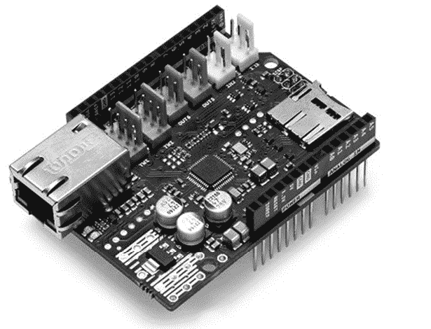
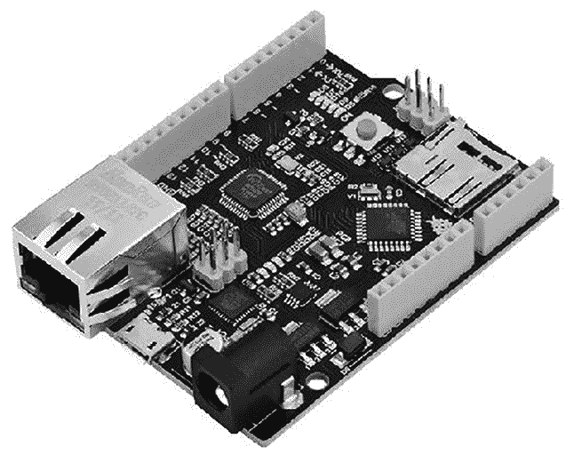
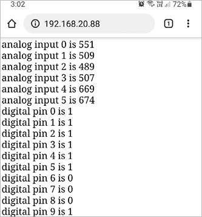
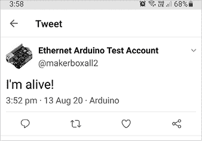
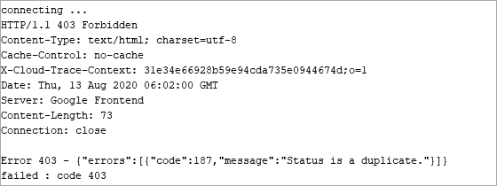
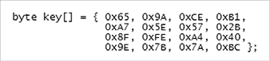
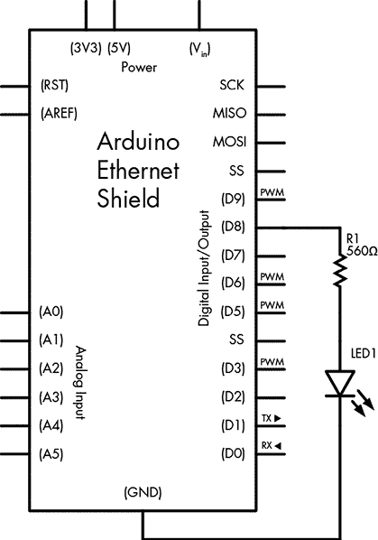
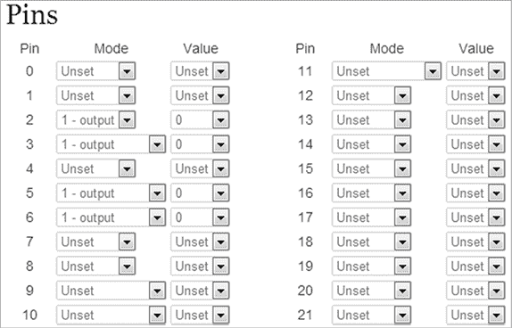

# 第二十一章：互联网

在本章中，你将会

+   构建一个 web 服务器来显示网页上的数据

+   使用你的 Arduino 在 Twitter 上发送 tweets

+   从网页浏览器远程控制 Arduino 数字输出

本章将向你展示如何通过互联网将你的 Arduino 连接到外部世界。这使你能够从你的 Arduino 广播数据，并通过网络浏览器远程控制你的 Arduino。

## 你需要什么

要构建这些与互联网相关的项目，你需要一些常见的硬件、一根电缆和一些信息。

让我们从硬件开始。你需要一个带有 W5100 控制芯片的以太网 shield。你有两个选择：你可以使用正品 Arduino 品牌的以太网 shield，如图 21-1 所示，或者你可以使用兼容 Arduino Uno 的集成以太网硬件板，如 PMD Way part 328497，如图 21-2 所示。后者是新项目或希望节省物理空间和金钱的好选择。正如你所见，集成板有用于 Arduino shield 的连接器，一个 USB 端口，一个以太网插座和一个 microSD 卡插槽。



图 21-1：一个 Arduino 以太网 shield



图 21-2：带有集成以太网的 Arduino Uno 兼容板

无论你选择哪种硬件，你还需要一根标准的 10/100 CAT5、CAT5E 或 CAT6 网络电缆，将你的以太网 shield 连接到网络路由器或互联网调制解调器。

另外，你需要你网络的路由器网关或调制解调器的 IP 地址，格式应该像这样：192.168.0.1。你还需要你计算机的 IP 地址，格式与你的路由器 IP 地址相同。

最后，如果你想要从家庭或本地区域网络之外与你的 Arduino 通信，你需要一个静态的公共 IP 地址。静态 IP 地址是由你的互联网服务提供商（ISP）分配给你的物理互联网连接的固定地址。你的互联网连接可能默认没有静态 IP 地址；如果需要，联系你的 ISP 启用此功能。如果你的 ISP 无法提供静态 IP 或者费用太高，你可以获取一个自动重定向服务，提供一个主机名，通过第三方公司（如 No-IP ([`www.noip.com/`](http://www.noip.com/)) 或 Dyn ([`account.dyn.com/`](https://account.dyn.com/)）将其重定向到你的连接 IP 地址。现在让我们通过一个简单的项目来测试我们的硬件。

## 项目＃60：构建远程监控站

在前几章的项目中，我们收集了传感器数据来测量温度和光线。在这个项目中，你将学习如何在一个简单的网页上显示这些值，几乎可以从任何支持网络的设备访问。这个项目将显示模拟输入引脚的值和数字输入 0 到 9 的状态，这些功能将作为远程监控站的基础。

使用此框架，您可以添加具有模拟和数字输出的传感器，如温度、光照和开关传感器，并将传感器的状态显示在网页上。

### 硬件

以下是创建此项目所需的内容：

+   一根 USB 线

+   一根网线

+   一块 Arduino Uno 和以太网盾，或者一块带有集成以太网的 Arduino Uno 兼容板

### 草图

输入以下草图，但*不要上传*：

```
/* Project 60 – Building a Remote Monitoring Station created 18 Dec 2009 by David A. Mellis, modified 9 Apr 2012 by Tom Igoe modified August 2020 by John Boxall */
#include <SPI.h>#include <Ethernet.h>1 IPAddress ip(`xxx`,`xxx`,`xxx`,`xxx`); //  Replace this with your project's IP address2 byte mac[] = { 0xDE, 0xAD, 0xBE, 0xEF, 0xFE, 0xED }; 
EthernetServer server(80);
void setup() 
{ // Start the Ethernet connection and server Ethernet.begin(mac, ip); server.begin(); for (int z=0; z<10; z++)   { pinMode(z, INPUT);         // set digital pins 0 to 9 to inputs }
} 
void loop()
{ // listen for incoming clients (incoming web page request connections) EthernetClient client = server.available(); if (client) { // an HTTP request ends with a blank line boolean currentLineIsBlank = true; while (client.connected()) { if (client.available()) { char c = client.read(); if (c == '\n') && currentLineIsBlank) { client.println("HTTP/1.1 200 OK"); client.println("Content-Type: text/html"); client.println("Connection: close"); client.println(); client.println("<!DOCTYPE HTML>"); client.println("<html>"); // add a meta refresh tag, so the browser pulls again every 5 sec:3           client.println("<meta http-equiv=\"refresh\" content=\"5\">");  // output the value of each analog input pin onto the web page for (int analogChannel = 0; analogChannel < 6; analogChannel++) { int sensorReading = analogRead(analogChannel);4             client.print("analog input "); client.print(analogChannel); client.print(" is "); client.print(sensorReading); client.println("<br />");        } // output the value of digital pins 0 to 9 onto the web page for (int digitalChannel = 0; digitalChannel < 10; digitalChannel++) { boolean pinStatus = digitalRead(digitalChannel); client.print("digital pin "); client.print(digitalChannel); client.print(" is "); client.print(pinStatus); client.println("<br />");           }           client.println("</html>"); break; } if (c == '\n') { // you're starting a new line currentLineIsBlank = true; }  else if (c != '\r') { // you've gotten a character on the current line currentLineIsBlank = false; } } } // give the web browser time to receive the data delay(1); // close the connection: client.stop(); }
}
```

我们稍后会更详细地讨论这个草图。首先，在上传草图之前，您需要为以太网盾设置一个 IP 地址，以便它能够在本地网络或调制解调器中找到。您可以通过检查路由器的 IP 地址来确定地址的前三部分。例如，如果路由器的地址是 192.168.0.1，请将最后一位数字更改为一个随机值，且该数字不能与网络上其他设备的数字相同，选择一个 2 到 254 之间的未被占用的数字。在草图中的 1 处输入更改后的 IP 地址，像这样：

```
IPAddress ip(192, 168, 0, 69); // Ethernet shield's IP address
```



图 21-3：由我们的站点监控的引脚值，可通过任何连接网络的设备上的网页浏览器查看

一旦做出更改，保存并上传您的草图。接下来，如果需要，插入以太网盾到您的 Arduino，连接网络线到路由器或调制解调器和以太网连接器，并开启 Arduino 板电源。

等待大约 20 秒。然后，使用您网络中的任何设备或计算机上的网页浏览器，输入 1 处的 IP 地址。如果您看到类似图 21-3 的内容，则您的监控站框架正常工作。

### 故障排除

如果这个项目对您不起作用，请尝试以下方法：

+   检查草图中 1 处的 IP 地址是否设置正确。

+   检查草图是否正确并已上传到您的 Arduino。

+   再次检查本地网络。您可以检查连接的计算机是否能够访问互联网。如果可以，检查 Arduino 板是否通电并且已连接到路由器或调制解调器。

+   如果您是从智能手机访问项目网页，请确保您的智能手机连接的是本地 Wi-Fi 网络，而不是手机运营商的移动网络。

+   如果以太网盾的 LED 灯在 Arduino 有电并且以太网线连接到盾和路由器或调制解调器时没有闪烁，请尝试更换一根网线。

### 理解草图

一旦你的监控站点工作正常，你可以回到草图中最重要的部分。从开始到第 3 处的代码是必要的，因为它加载了必要的库，并在 `void setup()` 中启动了以太网硬件。在第 3 处之前，`client.print()` 语句是草图设置网页的地方，使其能够被网页浏览器读取。从第 3 处开始，你可以使用 `client.print()` 和 `client.println()` 函数在网页上显示信息，就像在串口监视器上一样。例如，下面的代码用于显示图 19-3 中所示的网页的前六行：

```
client.print("analog input ");
client.print(analogChannel);
client.print(" is ");
client.print(sensorReading);
```

在第 4 处，你会看到一个示例，展示了如何将文本和变量内容写入网页。在这里，你可以使用 HTML 来控制网页的外观，只要不超出 Arduino 的内存限制。换句话说，你可以使用任意多的 HTML 代码，直到达到最大草图大小，而这个大小由 Arduino 板的内存决定。（每种板型的内存大小请参见第 234 页的表格 13-2。）

需要注意的一点是 MAC 地址，网络可以通过它来检测连接到网络的每个硬件。网络上的每个硬件都有一个唯一的 MAC 地址，可以通过更改第 2 处的十六进制值来改变。如果有两个或更多基于 Arduino 的项目使用同一个网络，你必须为每个设备输入不同的 MAC 地址。如果你的开发板附带了一个 MAC 地址，请使用该值。

最后，如果你想从未连接到本地网络的设备（例如使用蜂窝连接的平板电脑或手机）查看网页，那么你需要在网络路由器或调制解调器中使用称为 *端口转发* 的技术，可以通过像 No-IP 或 Dyn 这样的组织提供的服务实现。端口转发通常与路由器的品牌和型号有关，因此可以在网上搜索“路由器端口转发”或者访问像 [`www.wikihow.com/Port-Forward`](http://www.wikihow.com/Port-Forward) 这样的教程网站获取更多信息。

现在你知道如何在网页上显示文本和变量了，让我们来使用 Arduino 发布推文。

## 项目 #61：创建一个 Arduino 推特账号

在这个项目中，你将学习如何让 Arduino 通过 Twitter 发送推文。你可以接收由任何可以访问 Twitter 的设备生成的各种信息。如果，比如说，你希望在国外时接收来自家里的每小时温度更新，或者当孩子们回家时收到通知，这可以提供一种经济实惠的解决方案。

你的 Arduino 需要一个独立的 Twitter 账号，因此请执行以下操作：

1.  访问 [`twitter.com/`](http://twitter.com/) 并创建你的 Arduino 的 Twitter 账号。记下用户名和密码。

1.  从第三方网站[`arduino-tweet.appspot.com/`](http://arduino-tweet.appspot.com/)获取一个*令牌*。令牌在 Arduino 与 Twitter 服务之间创建了一座桥梁。你只需要在这个网站上完成第 1 步。

1.  将令牌以及你的 Arduino 新 Twitter 账户的详细信息复制并粘贴到电脑上的文本文件中。

1.  从[`github.com/NeoCat/Arduno-Twitter-library/archive/master.zip`](https://github.com/NeoCat/Arduno-Twitter-library/archive/master.zip)下载并安装 Twitter Arduino 库。

### 硬件部分

这是你需要创建这个项目的材料：

+   一根 USB 电缆

+   一根网络电缆

+   一块 Arduino Uno 和以太网扩展板，或一块与 Arduino Uno 兼容的集成以太网板

### 草图部分

输入以下草图，但*不要上传*：

```
// Project 61 - Creating an Arduino Tweeter
#include <SPI.h> 
#include <Ethernet.h>
#include <Twitter.h>// Ethernet shield settings1 IPAddress ip(192,168,0,1); // Replace this with your project's IP address2 byte mac[] = { `0xDE`, `0xAD`, `0xBE`, `0xEF`, `0xFE`, `0xED` };3 Twitter twitter("`insertyourtokenhere`");
// Message to post4 char msg[] = "`I'm alive!`";
void setup()
{ delay(1000); Ethernet.begin(mac, ip); // or you can use DHCP for automatic IP address configuration // Ethernet.begin(mac); Serial.begin(9600); Serial.println("connecting ...");
}
void loop()
{5  if (twitter.post(msg)) { int status = twitter.wait(&Serial); if (status == 200) { Serial.println("OK."); } else { Serial.print("failed : code "); Serial.println(status); } } else { Serial.println("connection failed."); } while (1);
}
```



图 21-4：你的 Arduino 推文

如同项目 60 一样，在 1 处插入你的 IP 地址，并在 2 处根据需要修改 MAC 地址。然后在 3 处的双引号之间插入 Twitter 令牌。最后，在 4 处插入你想要发送的推文内容。现在上传草图并将硬件连接到网络。（别忘了使用你自己的账户关注 Arduino 的 Twitter 账户！）大约一分钟后，访问你的 Twitter 页面或在设备上加载应用，信息应该会显示出来，如图 21-4 所示。

在创建 Arduino 推特程序时，请记住每分钟只能发送一条推文，并且每条信息必须是独一无二的。（这些是 Twitter 的规定。）发送推文时，Twitter 还会回复一个状态码。草图会在串口监视器中接收并显示该状态码，使用位于 5 处的代码。图 21-5 显示了一个示例。



图 21-5：由于尝试重复发布，Twitter 返回的示例错误信息

如果你收到像这样的 403 消息，可能是令牌不正确或者你发送推文的速度过快。（有关完整的 Twitter 错误代码列表，请参见[`finderrorcode.com/twitter-error-codes.html`](https://finderrorcode.com/twitter-error-codes.html)）。

## 从网页控制你的 Arduino

你可以通过多种方式从网页浏览器控制你的 Arduino。经过一些研究，我找到了一个可靠、安全且免费的方法：Teleduino。

Teleduino 是由新西兰 Arduino 爱好者 Nathan Kennedy 创建的一个免费服务。它是一个简单而强大的工具，用于通过互联网与 Arduino 交互。它不需要任何特殊或定制的 Arduino 草图；你只需在网页浏览器中输入一个特殊的 URL 即可控制 Arduino。你可以使用 Teleduino 来控制数字输出引脚和舵机，或者发送 I²C 命令，更多功能正在不断添加。在项目 62 中，你将学习如何配置 Teleduino，并通过网络启用的设备远程控制数字输出。

## 项目 #62：为你的 Arduino 设置远程控制

在开始第一个 Teleduino 项目之前，你必须先在 Teleduino 服务平台注册并获取一个唯一的密钥来识别你的 Arduino。为此，访问 [`www.teleduino.org/tools/request-key/`](https://www.teleduino.org/tools/request-key/) 并输入所需信息。你应收到一封包含你的密钥的电子邮件，密钥大致如下：`187654321Z9AEFF952ABCDEF8534B2BBF`。

接下来，通过访问 [`www.teleduino.org/tools/arduino-sketch-key/`](https://www.teleduino.org/tools/arduino-sketch-key/) 将你的密钥转换为数组变量。输入你的密钥，页面应返回一个类似于 图 21-6 所示的数组。



图 21-6：作为数组的 Teleduino 密钥

每个密钥都是独特的，针对单个 Arduino，但如果你想同时运行多个 Teleduino 项目，你可以获取更多的密钥。

### 硬件

以下是你创建此项目所需的设备：

+   一根 USB 数据线

+   一根网络电缆

+   一块 Arduino Uno 和以太网扩展板，或一块集成以太网的 Arduino Uno 兼容板

+   一只 560 Ω 电阻（R1）

+   一块面包板

+   一只任意颜色的 LED

组装你的硬件并将 LED 连接到数字引脚 8，如 图 21-7 所示。



图 21-7：项目 62 的原理图

### 草图

Teleduino 项目仅使用一个草图，该草图包含在 Teleduino 库中。以下是如何访问该草图：

1.  从 [`www.teleduino.org/downloads/`](https://www.teleduino.org/downloads/) 下载并安装 Teleduino 库。

1.  重启 Arduino IDE 并选择 **文件**▶**示例**▶**Teleduino328**▶**TeleduinoEthernetClientProxy**。

1.  现在你应该能看到 Teleduino 草图。在将其上传到 Arduino 之前，替换默认的密钥为你的密钥数组。你需要替换的变量应该在草图的第 36 行。一旦替换完成，保存草图，然后上传到你的 Arduino。

现在连接你的硬件到网络并观察 LED。大约一分钟后，LED 应该会闪烁几次然后停下来。闪烁的次数表示 Teleduino 服务的状态，如 表 21-1 所示。

表 21-1：Teleduino 状态闪烁代码

| **闪烁次数** | **消息** |
| --- | --- |
| 1 | 初始化中 |
| 2 | 正在启动网络连接 |
| 3 | 正在连接到 Teleduino 服务器 |
| 4 | 身份验证成功 |
| 5 | 会话已存在 |
| 6 | 无效或未授权的密钥 |
| 10 | 连接已断开 |

如果你看到五次闪烁，那么另一个 Arduino 已经使用你的密钥进行编程并连接到 Teleduino 服务器。看到十次闪烁时，你应该检查硬件和网络连接。Arduino 连接成功后，LED 应每隔大约 5 秒闪烁一次。由于状态 LED 是由数字引脚 8 控制的，在使用 Teleduino 时，你不能将该引脚用于其他用途。

### 远程控制你的 Arduino

为了远程控制你的 Teleduino，你可以使用任何带有网页浏览器的设备。然而，首先需要设置你想控制的每个数字引脚的模式。控制 Arduino 的命令是通过输入你创建的网址来发送的：

```
http://us01.proxy.teleduino.org/api/1.0/328.php?k={*YOURKEY*}&r=definePinMode&pin=<*X*>&mode=<*Y*>
```

你需要在网址中更改三个参数。首先，将 `{YOURKEY}` 替换为你从 Teleduino 网站收到的长字母数字密钥。接着，将 `<X>` 替换为你想要控制的数字引脚号。最后，将 `<Y>` 更改为 `1`，以将数字引脚设置为输出。

现在你可以远程控制数字引脚了。执行此操作的命令是：

```
http://us01.proxy.teleduino.org/api/1.0/328.php?k={*YOURKEY*}
&r=setDigitalOutput&pin=<*X*>&output=<*S*>
```

再次，你需要更改网址中的三个参数。首先，将 `{YOURKEY}` 替换为你从 Teleduino 网站收到的长字母数字密钥。接着，将 `<X>` 替换为你想要控制的数字引脚号。最后，将 `<S>` 更改为 `0`（低电平）或 `1`（高电平）以改变数字输出。例如，要将数字引脚 7 设置为高电平，你应输入：

```
http://us01.proxy.teleduino.org/api/1.0/328.php?k={`YOURKEY`}&r=setDigitalOutput&pin=7&output=1
```

在命令成功执行后，你应该会在网页浏览器中看到类似以下内容：

```
{"status":200,"message":"OK","response"
{"result":0,"time":0.22814512252808,"values":[]}}
```

如果命令失败，你应该看到类似下面的错误信息：

```
{"status":403,"message":"Key is offline or invalid.","response":[]}
```

你可以通过修改网址发送命令，将数字引脚设置为高或低。

如果某个数字引脚支持脉宽调制（PWM），如第三章所述，你还可以使用以下命令控制引脚的 PWM 输出：

```
http://us01.proxy.teleduino.org/api/1.0/328.php?k={`YOURKEY`}&r=setPwmOutput&pin=<`X`>&output=<`Y`>
```

其中，`<X>` 是数字输出引脚，`<Y>` 是 PWM 水平，范围从 0 到 255。

在你为项目创建完网址后，可以将其加入浏览器书签，或者创建一个本地网页，其中的链接作为按钮。例如，你可以将一个网址书签为将数字引脚 7 设置为高电平，另一个书签为将其设置为低电平。

在某些情况下，你的 Arduino 输出的状态可能至关重要。作为一种安全保障，以防 Arduino 由于断电或其他中断而重置，设置数字引脚的默认状态。将你的项目连接到 Teleduino 服务后，访问 [`www.teleduino.org/tools/manage-presets/`](https://www.teleduino.org/tools/manage-presets/)。在输入你的唯一密钥后，你应该会看到一个选项屏幕，允许你选择数字引脚的模式和数值，如 图 21-8 所示。



图 21-8：默认引脚状态设置页面

## 展望未来

除了可以轻松地通过互联网监控你的 Arduino 并让它发送推文到 Twitter，你还可以通过互联网控制你的 Arduino 项目，而无需编写复杂的草图、具备深厚的网络知识或承担月度费用。这使你几乎可以在任何地方控制 Arduino，并扩大其发送数据的能力。本章中的三个项目提供了一个框架，你可以在此基础上设计自己的远程控制项目。

本书的下一章，也是最后一章，将向你展示如何通过蜂窝网络连接让你的 Arduino 发送和接收命令。
